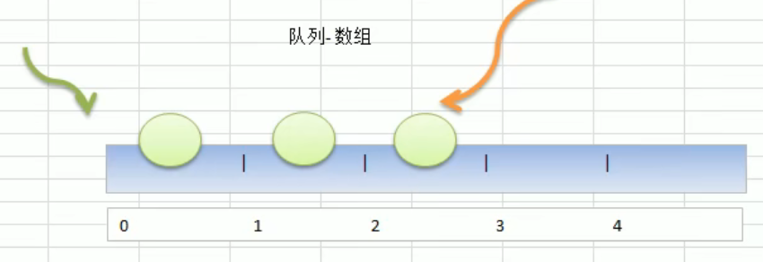

# 一.稀疏数组

介绍：

当一个数组中大部分元素为0，或者为同一个值的数组时，可以使用稀疏数组来保存该数组。

稀疏数组的处理方法是：

1. 记录数组一共有几行几列，有多少个不同的值
2. 把具有不同值的元素的行列及值记录在一个小规模的数组中，从而**缩小程序的规模**


案例：

1. 使用稀疏数组，来保存类似前面的二维数组（棋盘、地图等等）
2. 将稀疏数组存盘，并且可以重新恢复到原来的二维数组数

代码实现：

```go
type Node struct {
	row   int
	col   int
	value int
}

func main() {
	//先创建一个原始数组
	var arr [11][11]int
	arr[1][2] = 1
	arr[2][3] = 2

	fmt.Println("原始数组: ")

	//遍历原始数组
	for _, v := range arr {
		for _, v2 := range v {
			fmt.Printf("%d\t", v2)
		}
		fmt.Println()
	}

	fmt.Println("\n稀疏数组: ")

	//创建稀疏数组
	var sparseArra []Node

	//稀疏数组第一个节点用于存放原始数组的规模信息
	nodeValue := Node{
		row:   11,
		col:   11,
		value: 0,
	}
	sparseArra = append(sparseArra, nodeValue)

	for i, v := range arr {
		for j, v2 := range v {
			if v2 != 0 {
				nodeValue = Node{
					row:   i,
					col:   j,
					value: v2,
				}
				sparseArra = append(sparseArra, nodeValue)
			}
		}
	}

	//打印稀疏数组
	for _, node := range sparseArra {
		fmt.Printf("%d\t%d\t%d\n", node.row, node.col, node.value)
	}

	//将稀疏数组解析为原始数组
	fmt.Println("\n解析稀疏数组:")

	//创建原始数组（声明为一个切片）
	arr2 := make([][11]int, sparseArra[0].row)

	//遍历稀疏数组
	for i, v := range sparseArra {
		//跳过稀疏数组的第一行数据
		if i == 0 {
			continue
		}
		arr2[v.row][v.col] = v.value
	}

	//遍历原始数组
	for _, v := range arr2 {
		for _, v2 := range v {
			fmt.Printf("%d\t", v2)
		}
		fmt.Println()
	}
}
```

# 二.队列

介绍：

- 队列是一个有序列表，可以用数组或者链表实现
- 遵循先入先出的原则。即：先存入队列的数据，要先取出；后存入队列的数据，要后取出

用数组实现队列的示意图：



## 1.数组模拟队列

- 队列本身是有序列表，若使用数组的结构来储存队列的数据，则队列数组的声明如下，其中 `maxSize` 是该队列的最大容量
- 因为队列的输出、输入分别从前后端来处理，因此需要两个变量 `front` 和 `rear` 来分别记录队列前后端的下标，front 会随着数据输出而改变，而 rear 则是随着数据输入而改变


案例：

当我们将数据存入队列时称为 addQueue，addQueue 的处理需要有两个步骤：

1. 将尾指针往后移：`rear+1`，如果 `front==rear`，说明队列已空
2. 若尾指针 rear 小于等于队列的最大下标 `MaxSize-1`，说明可以将数据存入 rea 所指向的数组元素中；否则无法放入数据（`rea=MaxSize-1`说明队列已满）

代码实现：

```go
/*
使用数组实现队列的思路：
1. 创建一个数组 array，作为队列的一个字段
2. front 初始化为 -1
3. real 表示队列尾部，初始化为 -1
4. 完成队列的基本查找：
	AddQueue	//加入数据到队列
	GetQueue	//从队列取出数据
	ShowQueue	//显示队列
*/

type Queue struct {
	maxSize  int //队列最大值
	valueArr []int
	front    int //首指针，默认值是 -1
	real     int //尾指针，默认值是 -1
}

// AddQueue 加入数据到队列之中
func (this *Queue) AddQueue(val int) (err error) {
	//判断队列是否已满
	if this.maxSize-1 == this.real {
		err = errors.New("队列已满，无法再添值")
		return
	}
	//尾指针加 1
	this.real++
	//将数据添加进队列
	this.valueArr[this.real] = val
	return
}

// GetQueue 从队列取出数据
func (this *Queue) GetQueue() (val int, err error) {
	//判断队列是否为空
	if this.front == this.real {
		err = errors.New("队列为空，无法再取值")
		return
	}

	this.front++
	val = this.valueArr[this.front]
	return
}

// ShowQueue 显示队列
func (this *Queue) ShowQueue() {
	fmt.Println("队列当前的情况是:")
	//this.front 不包括队列第一个元素
	for i := this.front + 1; i <= this.real; i++ {
		fmt.Printf("queue[%d]=%d\n", i, this.valueArr[i])
	}
}
```

## 2.环形队列

对前面的数组模拟队列的优化，充分利用数组，因此可以将数组看作是一个环形的，这可以通过取模的方式来实现。

1. 尾索引的下一个为头索引时表示队列已满，即**将空出一个队列容量作为约定**。这个在判断队列满的时候需要注意：`(tail+1) % maxSize == head`（满）
2. `tail == head`为空
3. 获取当前的队列元素个数：`(this.tail + this.maxSize - this.head) % this.maxSize`
4. `head` 和 `tail` 初始化为 0

代码实现：

```go
type CircleQueue struct {
	maxSize  int //队列最大值
	valueArr []int
	head     int //首指针，默认值是 -1
	tail     int //尾指针，默认值是 -1
}

// AddQueue 加入数据到队列之中
func (this *CircleQueue) AddQueue(val int) (err error) {
	//判断队列是否已满
	if this.isFull() {
		return errors.New("环形队列已满……")
	}

	//添加元素入队列
	this.valueArr[this.tail] = val
	//如果尾指针指向了队列最后一个位置
	//if this.tail == this.maxSize-1 {
	//	this.tail = -1
	//}
	//this.tail++
	this.tail = (this.tail + 1) % this.maxSize

	return
}

// GetQueue 从队列取出数据
func (this *CircleQueue) GetQueue() (val int, err error) {
	//判断队列是否为空
	if this.isEmpty() {
		err = errors.New("环形队列已空……")
		return
	}

	//判断头指针是否指向了队列最后一个位置
	//if this.head == this.maxSize {
	//	this.head = -1
	//}
	//
	//val = this.valueArr[this.head]
	//this.head++

	val = this.valueArr[this.head]
	this.head = (this.head + 1) % this.maxSize

	return
}

// ShowQueue 显示队列
func (this *CircleQueue) ShowQueue() {
	//判断队列是否为空
	if this.getSize() == 0 {
		fmt.Println("环形队列当前的情况是:\n当前环形队列为空")
		return
	}

	fmt.Println("环形队列当前的情况是:")
	tempHead := this.head
	for i := 0; i < this.getSize(); i++ {
		fmt.Printf("queue[%d]=%d\n", tempHead, this.valueArr[tempHead])
		tempHead = (tempHead + 1) % this.maxSize
	}
}

// isFull 判断队列是否已满: true为满, false为未满
func (this *CircleQueue) isFull() (is bool) {
	return (this.tail+1)%this.maxSize == this.head
}

// isEmpty 判断队列是否为空: true为是, false为不是
func (this *CircleQueue) isEmpty() (is bool) {
	return this.tail == this.head
}

// getSize 获取队列的元素个数
func (this *CircleQueue) getSize() int {
	return (this.tail + this.maxSize - this.head) % this.maxSize
}

func main() {
	queue := &CircleQueue{
		maxSize:  4,
		valueArr: make([]int, 4),
		head:     0,
		tail:     0,
	}
```

# 三.链表

介绍：

链表是有序的列表，但是它在内存中的储存如下：


## 1.单链表

一般来说，为了比较好的对单链表进行增删改查的操作，都会给单链表设置一个头节点。头节点主要用来表示链表头，而不会用来存放数据。


单链表代码实现：

```go
// HeroNode 定义一个节点
type HeroNode struct {
	no   int
	name string
	next *HeroNode
}

//往链表里添加节点 (无序链表)
func push(headNode, heroNode *HeroNode) {
	tempNode := headNode
	//循环查找链表的各个节点
	for {
		if tempNode.next == nil {
			//如果这是最后一个节点，就结束循环
			break
		}
		//否则继续查找
		tempNode = tempNode.next
	}

	//让 tempNode 指向要添加的新节点 heroNode
	tempNode.next = heroNode
}

//按从小打到的顺序往链表里添加节点 (有序链表)
func pushByOrder(headNode, heroNode *HeroNode) {
	tempNode := headNode

	//循环查找链表的各个节点
	for {
		//判断是否是最后一个节点
		if tempNode.next == nil {
			break
		} else if heroNode.no <= tempNode.next.no {
			//而且判断 heroNode 的排名是否小于 tempNode.next 的排名
			break
		} else {
			//如果都不是, 让 tempNode 指向下一个节点
			tempNode = tempNode.next
		}
	}

	//heroNode 的 next 指针指向 tempNode 的下一个节点
	heroNode.next = tempNode.next
	//tempNode 的 next 指针指向 heroNode 节点
	tempNode.next = heroNode

}

//根据 节点的排名(no) 删除节点
func remove(headNode *HeroNode, no int) {
	tempNode := headNode
	//此标签用于确认是否找到了节点: true 找到; false 没找到
	flag := true

	//查找链表的各个节点
	for {
		//判断是否是最后一个节点
		if tempNode.next == nil {
			flag = false
			break
		} else if no == tempNode.next.no {
			//判断此节点是否是要删除的节点
			break
		} else {
			//如果都不是, 让 tempNode 指向下一个节点
			tempNode = tempNode.next
		}
	}

	//判断是否找到了要删除的节点
	if !flag {
		//没找到
		fmt.Printf("没找到需要删除的 no=%d 的节点……\n", no)
	} else {
		//找到了要删除的节点后，将找到的节点删除
		tempNode.next = tempNode.next.next
		fmt.Printf("删除 no=%d 的节点成功\n", no)
	}
}

//打印链表信息
func show(headNode *HeroNode) {
	tempNode := headNode
	//判断是否是空链表
	if tempNode.next == nil {
		fmt.Println("此链表为空……")
		return
	}

	//不是空链表，tempNode 指向下一个节点
	tempNode = tempNode.next
	//循环遍历所有链表
	for {
		//如果是最后一个节点
		if tempNode.next == nil {
			//打印最后的节点信息
			fmt.Printf("排名: %d\t英雄: %s\n", tempNode.no, tempNode.name)
			return
		}
		//如果不是最后一个节点
		//打印当前节点信息
		fmt.Printf("排名: %d\t英雄: %s\n", tempNode.no, tempNode.name)
		//tempNode 指向下一个节点
		tempNode = tempNode.next
	}
}

func main() {
	//创建头节点
	headNode := &HeroNode{}

	//创建英雄节点
	captain := &HeroNode{
		no:   1,
		name: "Captain",
	}
	ironMan := &HeroNode{
		no:   2,
		name: "IronMan",
	}
	spiderMan := &HeroNode{
		no:   3,
		name: "SpiderMan",
	}
	thor := &HeroNode{
		no:   2,
		name: "Thor",
	}

	//push(headNode, captain)
	//push(headNode, ironMan)
	//push(headNode, spiderMan)
	pushByOrder(headNode, spiderMan)
	pushByOrder(headNode, ironMan)
	pushByOrder(headNode, captain)
	pushByOrder(headNode, thor)
	show(headNode)

	fmt.Println()

	//删除节点2
	remove(headNode, 6)
	show(headNode)
}
```

## 2.双向链表

使用带有 head 头的双向链表实现英雄排行榜管理

单项链表的缺点分析：

1. 单向链表，要查找的方向只能是一个方向，而双向链表可以向前或者向后查找
2. 单向链表不能自我删除，需要靠辅助节点，而双向链表，是可以实现自我删除的


```go
// DoubleLink 定义一个节点
type DoubleLink struct {
	no   int
	name string
	next *DoubleLink //尾指针
	pre  *DoubleLink //头指针
}

//打印链表信息
func show(headNode *DoubleLink) {
	tempNode := headNode
	//判断是否是空链表
	if tempNode.next == nil {
		fmt.Println("此链表为空……")
		return
	}

	//不是空链表，tempNode 指向下一个节点
	tempNode = tempNode.next
	//循环遍历所有链表
	for {
		//如果是最后一个节点
		if tempNode.next == nil {
			//打印最后的节点信息
			fmt.Printf("排名: %d\t英雄: %s\n", tempNode.no, tempNode.name)
			return
		}
		//如果不是最后一个节点
		//打印当前节点信息
		fmt.Printf("排名: %d\t英雄: %s\n", tempNode.no, tempNode.name)
		//tempNode 指向下一个节点
		tempNode = tempNode.next
	}
}

//往链表里添加节点
func push(headNode, heroNode *DoubleLink) {
	tempNode := headNode
	//循环查找链表的各个节点
	for {
		if tempNode.next == nil {
			//如果这是最后一个节点，就结束循环
			break
		}
		//否则继续查找
		tempNode = tempNode.next
	}

	//让 tempNode 指向要添加的新节点 heroNode
	tempNode.next = heroNode
	heroNode.pre = tempNode
}

//按从小打到的顺序往链表里添加节点 (有序链表)
func pushByOrder(headNode, heroNode *DoubleLink) {
	tempNode := headNode

	//循环查找链表的各个节点
	for {
		//判断是否是最后一个节点
		if tempNode.next == nil {
			break
		} else if heroNode.no <= tempNode.next.no {
			//而且判断 heroNode 的排名是否小于 tempNode.next 的排名
			break
		} else {
			//如果都不是, 让 tempNode 指向下一个节点
			tempNode = tempNode.next
		}
	}

	//heroNode 的前后指针指向 tempNode 节点和 tempNode.next 节点
	heroNode.next = tempNode.next
	heroNode.pre = tempNode
	//tempNode 节点和 tempNode.next 节点的前后指针指向 heroNode
	//判断当前节点是否是最后一个节点
	if tempNode.next != nil {
		tempNode.next.pre = heroNode
	}
	tempNode.next = heroNode

}

//根据 节点的排名(no) 删除节点
func remove(headNode *DoubleLink, no int) {
	tempNode := headNode
	//此标签用于确认是否找到了节点: true 找到; false 没找到
	flag := true

	//查找链表的各个节点
	for {
		//判断是否是最后一个节点
		if tempNode.next == nil {
			flag = false
			break
		} else if no == tempNode.next.no {
			//判断此节点是否是要删除的节点
			break
		} else {
			//如果都不是, 让 tempNode 指向下一个节点
			tempNode = tempNode.next
		}
	}

	//判断是否找到了要删除的节点
	if !flag {
		//没找到
		fmt.Printf("没找到需要删除的 no=%d 的节点……\n", no)
	} else {
		//找到了要删除的节点后，将找到的节点删除
		tempNode.next = tempNode.next.next
		//判断当前节点是否是最后的一个节点
		if tempNode.next != nil {
			tempNode.next.pre = tempNode
		}
		fmt.Printf("删除 no=%d 的节点成功\n", no)
	}
}

func main() {
	//创建头节点
	headLink := &DoubleLink{}

	//创建英雄节点
	captain := &DoubleLink{
		no:   1,
		name: "Captain",
	}
	ironMan := &DoubleLink{
		no:   2,
		name: "IronMan",
	}
	spiderMan := &DoubleLink{
		no:   3,
		name: "SpiderMan",
	}
	thor := &DoubleLink{
		no:   4,
		name: "Thor",
	}

	pushByOrder(headLink, captain)
	pushByOrder(headLink, thor)
	pushByOrder(headLink, ironMan)
	pushByOrder(headLink, spiderMan)

	show(headLink)

	fmt.Println()

	remove(headLink, 2)
	show(headLink)

}
```

## 3.单项环形链表

```go
type CatNode struct {
    id   int
    name string
    next *CatNode
}

//打印单向环形链表
func showLink(head *CatNode) {
    temp := head

    //判断是不是空链表
    if temp.next == nil {
        fmt.Println("此链表为空……")
        return
    }

    //循环打印环形链表
    for {
        //打印节点的信息
        fmt.Printf("小猫的序号: %d\t小猫的名字: %s\n", temp.id, temp.name)

        //如果遍历到最后一个节点，就结束循环
        if temp.next == head {
            break
        }
        //temp 指向下一个节点
        temp = temp.next
    }
}

//添加节点到单向环形链表尾部
func insertToEnd(head *CatNode, catNode *CatNode) {
    //判断 head 是否为空
    if head.next == nil {
        head.id = catNode.id
        head.name = catNode.name
        head.next = head
        return
    }

    temp := head
    //不为空, 循环遍历环形链表
    for {
        //判断是不是最后一个节点
        if temp.next == head {
            break
        }
        //否则 temp 指向下一个节点
        temp = temp.next
    }

    catNode.next = head
    temp.next = catNode
}

//根据从小到大的顺序将节点添加到链表中
func insertByOrder(head *CatNode, catNode *CatNode) {
    //判断 head 是否为空
    if head.next == nil {
        head.id = catNode.id
        head.name = catNode.name
        head.next = head
        return
    }

    temp := head
    //不为空, 循环遍历环形链表
    for {
        //判断是不是最后一个节点
        if temp.next == head {
            break
        } else if temp.next.id >= catNode.id {
            //判断 temp 的下一个节点的 id 是否大于等于要插入的节点的 id
            //如果是就结束循环
            break
        } else {
            //否则 temp 指向下一个节点
            temp = temp.next
        }
    }
    //将节点添加到链表中
    catNode.next = temp.next
    temp.next = catNode
}

//根据节点的 id 删除节点
func deleteNode(head *CatNode, id int) *CatNode {
    temp := head
    helper := head
    isFind := true

    //判断是不是空链表
    if temp.next == nil {
        fmt.Println("此链表为空……")
        return head
    }

    //如果只有一个节点
    if temp.next == head {
        temp.next = nil
        return head
    }

    //将 helper 定位到环形链表的最后一个节点
    for {
        if helper.next == head {
            break
        }
        helper = helper.next
    }

    //循环遍历链表
    for {
        //如果没有找到节点就结束循环
        if temp.next == head {
            //没有找到
            isFind = false
            break
        } else if temp.id == id {
            //如果当前节点 id 等于传入的 id 说明找到了
            //如果要删除的节点刚好就是头节点
            if temp == head {
                //就将指向头结点的指针指向下一个节点
                head = head.next
            }
            //此时删除节点
            helper.next = temp.next
            fmt.Printf("id=%d 的小猫已被删除\n", id)
            break
        }
        //否则 temp、helper 指向下一个节点
        temp = temp.next
        helper = helper.next

    }

    //如果没有找到目标节点
    if !isFind {
        if temp.id == id {
            //此时删除节点
            helper.next = temp.next
            fmt.Printf("id=%d 的小猫已被删除\n", id)
        } else {
            fmt.Printf("没有找到要删除的 id=%d 的小猫\n", id)
        }
    }
    return head

}

func main() {
    //创建头节点
    head := &CatNode{}

    //创建小猫节点
    whiteCat := &CatNode{
        id:   1,
        name: "whiteCat-smith",
    }
    blackCat := &CatNode{
        id:   2,
        name: "blackCat-tom",
    }
    orangeCat := &CatNode{
        id:   3,
        name: "orangeCat-jenny",
    }
    tiger := &CatNode{
        id:   4,
        name: "tiger-jerry",
    }

    //添加节点
    //insertToEnd(head, whiteCat)
    //insertToEnd(head, blackCat)
    //insertToEnd(head, orangeCat)
    insertByOrder(head, whiteCat)
    insertByOrder(head, orangeCat)
    insertByOrder(head, blackCat)
    insertByOrder(head, tiger)
    //打印链表
    showLink(head)

    fmt.Println()

    //删除节点
    head = deleteNode(head, 1)
    //打印节点
    showLink(head)
}
```

## 4.约瑟夫问题

Josephu 问题：

设编号为 1，2，……，n 的 n 个人围坐一圈，约定编号为 k(1 <= k <= n) 的人从 1 开始报数，数到 m 的那个人出列，他的下一位又从 1 开始报数，数到 m 的那个人又出列……以此类推，直到所有人出列为止，由此产生了一个出队编号的序列。

提示：

用一个不带头结点的循环链表来处理 Josephu 问题：先构成一个有 n 个结点的单循环链表，然后由 k 结点起从 1 开始计数，计到 m 时，对应结点从链表中删除，然后再从被删除结点的下一个结点又从 1 开始计数，知道最后一个结点从链表中删除算法结束。

示意图说明：


代码实现：

```go
type Children struct {
	id   int
	next *Children
}

//显示 Children 的环形链表
func showChildrenLink(headNode *Children) {
	tempNode := headNode
	//如果是一个空链表
	if tempNode.next == nil {
		fmt.Println("传入的链表为空……")
		return
	}

	//遍历环形链表
	for {
		fmt.Printf("小孩的序号是: id=%d\n", tempNode.id)
		//如果是最后一个结点，就结束循环
		if tempNode.next == headNode {
			break
		}
		//让 tempNode 指向下一个结点
		tempNode = tempNode.next

	}
}

//得到 Children 的环形链表
func getChildrenLink(num int) *Children {
	//对 num 值进行判断
	if num < 1 {
		fmt.Println("num 必须大于等于1")
		return nil
	}

	//定义头节点
	headNode := &Children{}
	//定义一个辅助结点
	tempNode := &Children{}

	//循环生成 Children
	for i := 1; i <= num; i++ {
		childrenNode := &Children{id: i}

		//如果是第一个结点
		if i == 1 {
			headNode = childrenNode //首指针不能改动
			tempNode = childrenNode
			//让第一个结点的指针指向自己
			tempNode.next = headNode
			continue
		} else {
			//让 tempNode 指向新添加的结点
			tempNode.next = childrenNode
			//让 tempNode 指针指向最新的结点
			tempNode = childrenNode
			//让最新添加的结点指向第一个结点
			tempNode.next = headNode
		}
	}
	//将头节点返回
	return headNode
}

//计算链表大小
func getSize(head *Children) int {
	temp := head
	size := 0

	//判断链表是否为空
	if head.next == nil {
		fmt.Println("传入的链表为空……")
		return 0
	}

	//循环遍历链表
	for {
		size++
		if temp.next == head {
			//到最后一个节点时退出循环
			break
		}
		//temp 指向下一个节点
		temp = temp.next
	}

	//将 size 返回
	return size
}

// Joseph 约瑟夫问题的实际代码解决
func Joseph(head *Children, startId int, countNum int) {
	//判断链表是否为空
	if head.next == nil {
		fmt.Println("传入的链表为空……")
		return
	}

	//判断 startId 是否大于链表总数
	if startId > getSize(head) {
		fmt.Println("参数 startId 不能大于链表的总数")
		return
	}

	temp := head
	tail := head

	//temp 从 startId 的位置开始移动
	for i := 1; i <= startId-1; i++ {
		temp = temp.next
		tail = tail.next
	}

	//循环遍历链表
	for {
		//如果找到了最后一个节点
		if tail.next == head {
			break
		}
		tail = tail.next
	}

	count := 1
	//再次循环遍历链表
	for {
		//当temp和tail都指向同一个节点时，说明链表只有一个节点
		if temp.next == tail.next {
			//打印节点信息
			fmt.Printf("被删除的小孩序号是: id=%d\n", temp.id)
			temp.next = nil
			break
		}

		//如果 count==countNum, 就将当前节点删除
		if count == countNum {
			//重置count
			count = 1
			//打印节点信息
			fmt.Printf("被删除的小孩序号是: id=%d\n", temp.id)
			//让 temp 指向下一个节点
			temp = temp.next
			//删除当前节点
			tail.next = temp
		} else {
			//如果不等于，就让 temp 和 tail 分别指向下一个节点
			temp = temp.next
			tail = tail.next
		}
		//count 累加
		count++
	}
}

func main() {
	//得到 children 的环形链表
	headChildren := getChildrenLink(400)
	//打印环形链表
	showChildrenLink(headChildren)

	fmt.Printf("\n约瑟夫问题解决:\n")

	Joseph(headChildren, 4, 40)
}
```

# 四.排序

排序是将一组数据，依照指定的顺序进行排列的过程。常见的排序有：

- 冒泡排序
- 选择排序
- 插入排序
- 快速排序

## 1.冒泡排序

冒泡排序（Bubble Sorting）的基本思想是：通过对待排序序列从后向前（从下标较大的元素开始），依次比较相邻元素的排序码，若发现逆序则交换，使排序码较小的元素逐渐从后部移向前部（从下标较大的单元移向下标较小的单元），就像水底下的气泡一样逐渐向上冒。

因为排序的过程中，各元素不断接近自己的位置，**如果一趟下来没有进行过交换，就说明序列有序**，因此需要在排序过程中设置一个标志 flag 判断元素是否进行过交换，从而减少不必要的比较。

```go
func main() {
	arr := [10]int{5, 1, 8, 3, 0, 4, 9, 2, 7, 6}

	var count = 0
	for i := 0; i < len(arr)-1; i++ {
		for j := 0; j < len(arr)-1-i; j++ {
			if arr[j] > arr[j+1] {
				temp := arr[j]
				arr[j] = arr[j+1]
				arr[j+1] = temp

				//计算循环次数
				count++
			}
		}
	}

	fmt.Println(arr)
	fmt.Println("count=", count)
}
```

## 2.选择排序

选择式排序也属于内部排序法，是从需要排序的数据中，按照指定的规则选出某一个元素，经过和其他元素重整，再依照原则交换位置后达到排序的目的。

选择排序思路分析图：


代码实现：

```go
//用 选择排序法 进行排序
func selectSort(arr *[5]int) {
	for i := 0; i < len(arr)-1; i++ {
		//假设数组中第一个数字是最大值
		maxNum := arr[i]
		maxIndex := i

		for j := i + 1; j < len(arr); j++ {
			//如果这个最大值还小于它之后的数字
			if maxNum < arr[j] {
				//就将真正的最大值重新赋值给 maxNum 和 maxIndex
				maxNum = arr[j]
				maxIndex = j
			}
		}

		//当最大值不是假设的第一个数字的时候
		if maxIndex != i {
			arr[i], arr[maxIndex] = arr[maxIndex], arr[i]
		}
	}

}
```

## 3.插入排序

插入排序（Inserting Sorting）思想：

把 n 个待排序的元素看成为一个有序表和一个无序表，**在开始时有序表中只包含一个元素，无序表中包含有 n-1 个元素**，排序过程中每次从无序表中取出第一个元素，把它的排序码依次与有序表元素的排序码进行比较，将它插入到有序表中的适当位置，使之成为新的有序表。

插入排序思路分析：


代码实现：

```go
//插入排序
func insertingSorting(arr *[5]int) {
	for i := 1; i <= len(arr)-1; i++ {
		//保存需要比较的值
		insertVal := arr[i]
		//保存下标: 总是在要进行比较的值的前一位
		insertIndex := i - 1

		//如果insertIndex 需要始终大于 0, 而且下标 insertIndex 处的值始终小于 insertVal,
		//循环就继续
		for insertIndex >= 0 && arr[insertIndex] < insertVal {
			arr[insertIndex+1] = arr[insertIndex]
			insertIndex--
		}

		//如果 insertVal 在比较后将要插入的位置就是它现在的位置，就不用进行替换了
		if insertIndex+1 != i {
			arr[insertIndex+1] = insertVal
		}

		fmt.Printf("第 %d 次排序后的数组: %v\n", i, *arr)
	}
}
```

## 4.快速排序

快速排序（Quick Sort）是对冒泡排序的一种改进。基本思想是：通过一趟排序，将要排序的数据分割成独立的两部分，其中一部分的所有数据都比另外一部分的所有数据都要小，然后再按照此方法对这两部分的数据分别进行快速排序，整个排序过程都可以递归进行，依次达到整个数据变成有序序列。


代码实现：

```go
//快速排序
//right: 表示数组右边的下标; left: 表示数组左边的下标
func quickSort(left, right int, arr *[6]int) {
	l := left
	r := right
	//pivot 是中轴, 表示最中间的数
	pivot := arr[(left+right)/2]

	//for 循环的目标是将比 pivot 小的数移动到左边
	//比 pivot 大的数移动到右边
	for l < r {
		//从 pivot 的左边找到大于等于 pivot 的值
		for arr[l] < pivot {
			l++
		}
		//从 pivot 的右边找到小于等于 pivot 的值
		for arr[r] > pivot {
			r--
		}
		//l >= r 表明本次分解任务完成
		if l >= r {
			break
		}

		//交换
		arr[l], arr[r] = arr[r], arr[l]

		//做一个优化
		if arr[l] == pivot {
			r--
		}
		if arr[r] == pivot {
			l++
		}
	}
	//如果 l==r 再移动下
	if l == r {
		l++
		r--
	}
	//向左递归
	if left < r {
		quickSort(left, r, arr)
	}
	//向右递归
	if right > l {
		quickSort(l, right, arr)
	}
}
```

# 五.栈

栈的介绍：

1. 有的开发者会把栈称为堆栈，即栈和堆栈是同一个概念
2. 栈的英文: stack
3. 栈是一个先入后出的有序列表（Filo-First In Last Out）
4. 栈是限制线性表中元素的插入和删除都只能在线性表的同一端进行的一种特殊线性表。允许插入和删除的一端，是变化的一端，称为**栈顶(Top)**，另一端是固定的一端，称为**栈底(Bottom)**
5. 根据堆栈的定义可知，最先放入栈中的元素在栈底，最后放入的元素在栈顶，而删除元素正好相反，最后放入的元素最先删除，最先放入的元素最后删除


栈的使用场景：

1. 子程序的调用：在跳往子程序之前，会先将下个指令的地址存到堆栈中，直到子程序执行完后再将地址取出，以回到原来的程序中
2. 处理递归调用，和子程序的调用类似，只是除了储存下一个指令的地址外，也将参数、区域变量等数据存入堆栈中
3. 表达式的转换与求值
4. 二叉树的遍历
5. 图形的深度优先搜索法（depth-first）

代码实现：

```go
type Stack struct {
	arr    [5]int
	maxTop int //栈最大储存数
	top    int //栈顶指针, 因为栈底固定不变, 所以可以省略
}

//打印栈内数据
func (this *Stack) show() {
	if this.top == -1 {
		fmt.Println("栈为空，无法展示栈数据")
		return
	}

	for i := this.top; i > -1; i-- {
		fmt.Printf("arr[%d]=%d\t", i, this.arr[i])
	}
	fmt.Println()
}

//入栈
func (this *Stack) push(num int) (err error) {
	//判断栈是否已满
	if this.top == this.maxTop-1 {
		return errors.New("堆栈已满")
	}

	//添加数据
	this.top++
	this.arr[this.top] = num
	return
}

//出栈
func (this *Stack) pop() (val int, err error) {
	if this.top == -1 {
		err = errors.New("堆栈为空")
		return
	}

	//出栈
	val = this.arr[this.top]
	this.top--
	return
}

func main() {
	//初始化栈
	stack := &Stack{
		maxTop: 5,
		top:    -1,
	}

	fmt.Println("入栈: ")
	//往栈里面添加值
	for i := 10; i <= 50; i = i + 10 {
		err := stack.push(i)
		if err != nil {
			fmt.Printf("往栈内添加数字 %d 时出现错误: %s\n", i, err)
		}
	}
	//展示栈数据
	stack.show()

	fmt.Println("\n出栈: ")
	//出栈
	for i := 10; i <= 50; i = i + 10 {
		if stack.top != -1 {
			//展示栈数据
			stack.show()
		}

		_, err := stack.pop()
		if err != nil {
			fmt.Printf("将数字 %d 出栈时出现错误: %s\n", i, err)
			continue
		}
	}
}
```

## 栈的计算表达式

算法分析：


代码实现：

```go
type Stack struct {
	arr    [20]int
	maxTop int //栈最大储存数
	top    int //栈顶指针, 因为栈底固定不变, 所以可以省略
}

//打印栈内数据
func (this *Stack) show() {
	if this.top == -1 {
		fmt.Println("栈为空，无法展示栈数据")
		return
	}

	for i := this.top; i > -1; i-- {
		fmt.Printf("arr[%d]=%d\t", i, this.arr[i])
	}
	fmt.Println()
}

//入栈
func (this *Stack) push(num int) {
	//判断栈是否已满
	if this.top == this.maxTop-1 {
		fmt.Println("堆栈已满")
		return
	}

	//添加数据
	this.top++
	this.arr[this.top] = num
	return
}

//出栈
func (this *Stack) pop() int {
	if this.top == -1 {
		fmt.Println("堆栈为空")
		return 0
	}

	//出栈
	val := this.arr[this.top]
	this.top--
	return val
}

//判断字符是否是一个运算符 [+, -, *, /]
func (this *Stack) isOperator(val int) bool {
	if val == 42 || val == 43 || val == 45 || val == 47 {
		return true
	} else {
		return false
	}
}

// Cal 进行数字的运算
func (this *Stack) Cal(num1, num2, operator int) int {
	res := 0

	switch operator {
	case 42:
		res = num2 * num1
	case 43:
		res = num2 + num1
	case 45:
		res = num2 - num1
	case 47:
		if num1 == 0 {
			fmt.Println("除数不能为 0")
			return 0
		}
		res = num2 / num1
	default:
		fmt.Println("运算符类型不存在")
	}
	return res
}

// Priority 返回运算符优先级
func (this *Stack) Priority(operator int) int {
	res := 0
	if operator == 43 || operator == 45 {
		//如果是 +, - 返回0
		res = 0
	} else if operator == 42 || operator == 47 {
		//如果是 /, * 返回1
		res = 1
	} else {
		//其他情况返回 -1
		res = -1
	}
	return res
}

func main() {
	//此栈用于储存数字
	numStack := Stack{
		top:    -1,
		maxTop: 20,
	}
	//此栈用于储存运算符
	operStack := Stack{
		top:    -1,
		maxTop: 20,
	}

	//需要计算的表达式
	express := "30+2*6-2"
	//定义一个 index 帮助扫描 express
	index := 0

	//定义变量
	topOper := 0
	num1 := 0
	num2 := 0
	res := 0
	oper := 0
	keepNum := ""
	//循环遍历表达式
	for {
		char := express[index : index+1]

		//将字符转成对应的 ASCII 码
		temp := int([]byte(char)[0])
		//如果 char 是运算符
		if operStack.isOperator(temp) {
			//判断 operStack 是不是空栈
			if operStack.top == -1 {
				//是空栈直接入栈
				operStack.push(temp)
			} else {
				//不是空栈, 查看 operStack 的栈顶运算符
				topOper = operStack.arr[operStack.top]
				//如果 topOper 的运算符优先级大于 temp 的优先级
				if operStack.Priority(topOper) >= operStack.Priority(temp) {
					//就从 numStack 中取出两个数
					num1 = numStack.pop()
					num2 = numStack.pop()
					//从 operStack 中取出运算符
					oper = operStack.pop()

					//对num1 num2 进行运算
					res = operStack.Cal(num1, num2, oper)
					//将运算结果重新入栈 numStack
					numStack.push(res)
					//将 temp 入栈 operStack
					operStack.push(temp)
				} else {
					//如果 topOper 的运算符优先级小于 temp 的优先级
					//将运算符 temp 直接入栈
					operStack.push(temp)
				}
			}
		} else {
			//如果 char 是数字

			//处理多位数的思路:
			//1. 定义一个变量 keepNum string, 用来做拼接
			//2. 每次向 index 的后一位字符测试一个, 判断是否是运算符, 然后处理

			//如果后一位字符是数字，就将其与当前字符拼接
			keepNum += char

			//判断是否已经到了表达式的最后一位
			if index == len(express)-1 {
				val, _ := strconv.ParseInt(keepNum, 10, 64)
				numStack.push(int(val))
			} else {
				//判断 index 的后一位字符是否是数字
				if numStack.isOperator(int([]byte(express[index+1 : index+2])[0])) {
					//如果后一位不是数字是字符，直接将当前字符入栈
					val, _ := strconv.ParseInt(keepNum, 10, 64)
					numStack.push(int(val))
					//清空 keepNum
					keepNum = ""
				}
			}
		}

		//如果 index+1 等于了表达式长度, 说明已经遍历完表达式的字符
		//结束循环
		if index+1 == len(express) {
			break
		}
		//遍历表达式下一个字符
		index++
	}

	//遍历 numStack 和 operStack, 计算最终的结果
	for {
		//如果 operStack 为空时, 结束循环
		if operStack.top == -1 {
			break
		}

		num1 = numStack.pop()
		num2 = numStack.pop()
		oper = operStack.pop()

		//对 num1, num2 进行计算
		res = numStack.Cal(num1, num2, oper)
		//将计算结果入栈 numStack
		numStack.push(res)
	}

	//将 numStack 中的最后一个数取出，就是表达式的运算结果
	res = numStack.pop()
	fmt.Printf("%s = %d\n", express, res)

}
```

# 六.递归

## 1.基本介绍

递归就是函数或者方法自己调用自己，每次调用时传入不同的变量。递归有助于编程者解决复杂的问题，同时让代码变得简洁。

递归底层刨析：


## 2.递归注意事项

递归需要遵守的重要原则：

1. 执行一个函数时，就会创建一个新的受保护的独立空间（新函数栈）
2. 函数的局部变量是独立的，不会相互影响
3. 递归必须向退出递归的条件逼近，否则就会出现无限递归，即死循环
4. 当一个函数执行完毕后，或者遇到`return`，就会返回，遵守：谁调用，就将结果返回谁 的原则。同时当函数执行完毕或者返回时，该函数本身也会被系统销毁

## 3.迷宫回溯问题

使用 8 行 7 列的二维数组模拟迷宫。

游戏规则：

1. 如果元素的值为 1，就是墙
2. 如果元素的值为 0，就是没有走过的路线
3. 如果元素的值为 2，是可以通过的
4. 如果元素的值为 3，是走过的路线，但是是死路

```go
//寻路函数
func getWay(migongMap *[8][7]int, i, j int) bool {
	//当找到终点后
	if migongMap[6][5] == 2 {
		return true
	} else {
		//如果不是墙，即前方的道路为 0
		if migongMap[i][j] == 0 {
			//假设当前停留的一点是可以通过的
			migongMap[i][j] = 2
			//对当前点的上下左右四个方向进行探测
			if getWay(migongMap, i+1, j) { //下
				return true
			} else if getWay(migongMap, i, j+1) { //右
				return true
			} else if getWay(migongMap, i-1, j) { //上
				return true
			} else if getWay(migongMap, i, j-1) { //左
				return true
			} else { //四个方向都不通，说明是死路
				migongMap[i][j] = 3
				return false
			}
		} else {
			//返回 false，说明前路不通
			return false
		}
	}
}

func main() {
	//定义数组
	var migongMap [8][7]int

	//构建游戏地图
	//将最上和最下置为 1
	for i := 0; i < 7; i++ {
		migongMap[0][i] = 1
		migongMap[7][i] = 1
	}

	//将最左和最右置为 1
	for i := 0; i < 8; i++ {
		migongMap[i][0] = 1
		migongMap[i][6] = 1
	}
	migongMap[2][1] = 1
	migongMap[2][2] = 1

	//打印地图
	for _, v := range migongMap {
		for _, v1 := range v {
			fmt.Printf("%d  ", v1)
		}
		fmt.Println()
	}

	fmt.Println("\n探索地图:")

	//开始走迷宫
	getWay(&migongMap, 1, 1)
	//打印地图
	for _, v := range migongMap {
		for _, v1 := range v {
			fmt.Printf("%d  ", v1)
		}
		fmt.Println()
	}

}
```

# 七.哈希表-散列

## 1.基本介绍

散列表（Hash Table）也叫哈希表。是根据关键码值（key-value）而直接进行访问的数据结构。也就是说，它通过把关键码值映射到表中的一个位置来访问记录，以加快查找的速度。这个映射函数就做散列函数，存放记录的数组叫做散列表。


## 2.案例

实际需求：

Google公司的一个上机题：

有一个公司，当有新的员工来报道时，要求将该员工的信息加入（id、性别、年龄、住址……），当输入该员工的 id 时，要求找到该员工的所有信息。

要求：不使用数据库，尽量节省内存，速度越快越好

`Emp.go`

```go
// Emp 支链表节点
type Emp struct {
	Id   int
	Name string
	Next *Emp
}

func (this *Emp) showEmp() {
	fmt.Printf("在第 %d 条链表中 ID=%d 的节点信息是: [id=%d,name=%s]\n",
		this.hashFun(this.Id), this.Id, this.Id, this.Name)
}

//此函数用于取模
func (this *Emp) hashFun(id int) int {
	return id % 7
}
```

`EmpLink.go`

```go
// EmpLink 主链表节点
// EmpLink 不带表头，第一个节点就用来存放数据
type EmpLink struct {
	Head *Emp //指向支链表的头节点
}

// Show 显示链表
func (this *EmpLink) Show(no int) {
	if this.Head == nil {
		fmt.Printf("第 %d 链表为空\n", no)
		return
	}

	//循环遍历链表
	temp := this.Head
	fmt.Printf("第 %d 链表: ", no)
	for {
		if temp != nil {
			fmt.Printf("[id=%d,name=%s] ", temp.Id, temp.Name)
		} else {
			break
		}
		temp = temp.Next
	}

	fmt.Println()
}

func (this *EmpLink) Insert(e *Emp) {
	//定义两个辅助指针
	temp := this.Head
	var pre *Emp = nil

	//判断支链表是否为空
	if temp == nil {
		//直接赋值
		this.Head = e
		return
	}

	//支链不为空，循环遍历支链
	for {
		//判断是否遍历到支链末尾
		if temp == nil {
			break
		} else if temp.Id >= e.Id { //判断 temp 指向的节点 id 是否大于传进来的节点 id
			break
		}

		//否则，pre 和 temp 都指向各自的下一个节点
		pre = temp //这里保证 pre 始终指向 temp 的前一个节点
		temp = temp.Next
	}

	//添加节点
	pre.Next = e
	e.Next = temp
}

// Delete 根据 Id 删除节点信息
func (this *EmpLink) Delete(id int) {
	temp := this.Head
	var pre *Emp = nil
	isEnd := false

	//判断支链表是否为空
	if this.Head == nil {
		fmt.Printf("ID=%d 的节点不存在，无法删除\n", id)
		return
	}

	//如果支链表只有一个节点，或者要删除的节点就是头节点
	if temp.Id == id {
		this.Head = temp.Next
		fmt.Printf("ID为 %d 的节点已被删除\n", id)
		return
	}

	//循环遍历链表
	for {
		if temp == nil {
			isEnd = true
			break
		} else if temp.Id == id {
			break
		}

		pre = temp
		temp = temp.Next
	}

	if isEnd {
		fmt.Printf("ID=%d 的节点不存在，无法删除\n", id)
	} else {
		pre.Next = temp.Next
		fmt.Printf("ID为 %d 的节点已被删除\n", id)
	}
}

func (this *EmpLink) GetById(id int) *Emp {
	temp := this.Head
	for {
		if temp != nil && temp.Id == id {
			return temp
		} else if temp == nil {
			break
		}
		temp = temp.Next
	}
	return nil
}
```

`main.go`

```go
// HashTable 主链表
type HashTable struct {
	LinkArr [7]EmpLink
}

// Show 显示hash表
func (this *HashTable) Show() {
	for i := 0; i < len(this.LinkArr); i++ {
		this.LinkArr[i].Show(i)
	}
}

// Insert 添加数据
func (this *HashTable) Insert(emp *Emp) {
	//使用散列函数，对 id 取模
	linkNo := this.hashFun(emp.Id)
	//添加数据
	this.LinkArr[linkNo].Insert(emp)
}

// Delete 根据 id 删除节点
func (this *HashTable) Delete(id int) {
	//使用散列函数，对 id 取模
	linkNo := this.hashFun(id)
	//添加数据
	this.LinkArr[linkNo].Delete(id)
}

// GetById 根据 id 查找节点信息
func (this *HashTable) GetById(id int) *Emp {
	//使用散列函数，对 id 取模
	linkNo := this.hashFun(id)
	//查找节点信息
	return this.LinkArr[linkNo].GetById(id)
}

//此函数用于取模
func (this *HashTable) hashFun(id int) int {
	return id % 7
}

func main() {
	hashTable := HashTable{}

	//创建 emp
	smith := Emp{
		Id:   7,
		Name: "smith",
	}
	tom := Emp{
		Id:   14,
		Name: "tom",
	}
	jerry := Emp{
		Id:   15,
		Name: "jerry",
	}
	tony := Emp{
		Id:   21,
		Name: "tony",
	}

	//添加 emp
	hashTable.Insert(&smith)
	hashTable.Insert(&tom)
	hashTable.Insert(&jerry)
	hashTable.Insert(&tony)
	//显示 hash 链表
	hashTable.Show()

	//查找 emp
	fmt.Println("\n查找节点信息:")
	id := 14
	e := hashTable.GetById(id)
	if e != nil {
		//打印节点信息
		e.showEmp()
	} else {
		fmt.Printf("ID=%d 的节点信息不存在\n", id)
	}

	//删除 emp
	fmt.Println("\n删除节点:")
	hashTable.Delete(15)
	//显示 hash 链表
	hashTable.Show()
}
```

# 八.二叉树

树有很多种，每个节点最多只能有两个子节点的一种形式称之为二叉树。

代码实现：

```go
type HeroTree struct {
	Id    int       //排名
	Name  string    //名字
	Left  *HeroTree //左指针
	Right *HeroTree //右指针
}

//构建 二叉树
func (this *HeroTree) getTree(root *HeroTree) {
	captain := &HeroTree{
		Id:   1,
		Name: "captain",
	}
	ironman := &HeroTree{
		Id:   2,
		Name: "ironMan",
	}

	root.Right = ironman
	root.Left = captain

	spiderMan := &HeroTree{
		Id:   3,
		Name: "spiderMan",
	}
	buckie := &HeroTree{
		Id:   4,
		Name: "buckie",
	}
	hawkeye := &HeroTree{
		Id:   5,
		Name: "hawkeye",
	}

	ironman.Right = spiderMan
	captain.Left = buckie
	captain.Right = hawkeye
}

//前序遍历二叉树：先输出 root 节点，再输出左子树，然后输出右子树
func (this *HeroTree) preOrder(node *HeroTree) {
	if node != nil {
		fmt.Printf("排名: %d  称号: %s\n", node.Id, node.Name)
		//输出左子树
		node.preOrder(node.Left)
		//输出右子树
		node.preOrder(node.Right)
	}
}

//中序遍历二叉树：先输出左子树，再输出 root 节点，然后输出右子树
func (this *HeroTree) infixOrder(node *HeroTree) {
	if node != nil {
		//输出左子树
		node.infixOrder(node.Left)
		fmt.Printf("排名: %d  称号: %s\n", node.Id, node.Name)
		//输出右子树
		node.infixOrder(node.Right)
	}
}

//后序遍历二叉树：先输出左子树，再输出右子树，然后输出 root 节点
func (this *HeroTree) postOrder(node *HeroTree) {
	if node != nil {
		//输出左子树
		node.postOrder(node.Left)
		//输出右子树
		node.postOrder(node.Right)
		fmt.Printf("排名: %d  称号: %s\n", node.Id, node.Name)
	}
}

func main() {
	tree := &HeroTree{}
	root := &HeroTree{
		Id:   0,
		Name: "avenger",
	}

	//构建二叉树
	tree.getTree(root)
	fmt.Println("前序遍历二叉树:")
	//前序遍历二叉树
	tree.preOrder(root)

	fmt.Println("\n中序遍历二叉树:")
	//中序遍历二叉树
	tree.infixOrder(root)

	fmt.Println("\n后序遍历二叉树:")
	//后序遍历二叉树
	tree.postOrder(root)
}
```


