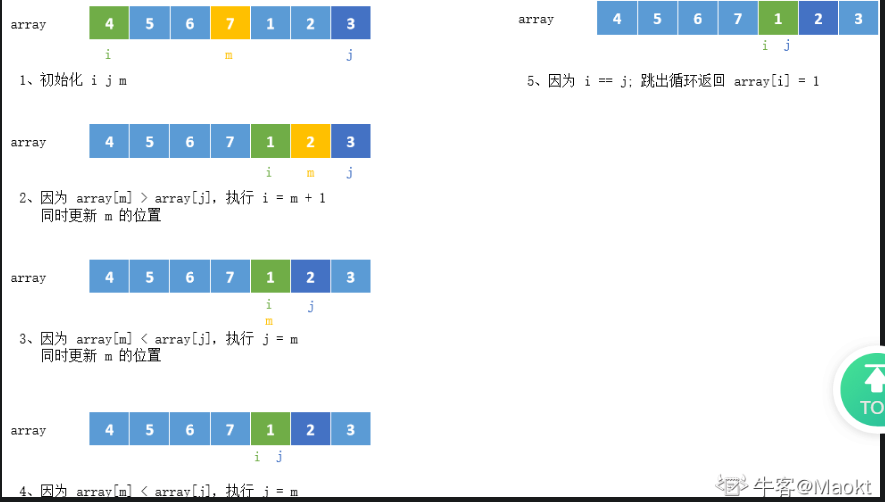
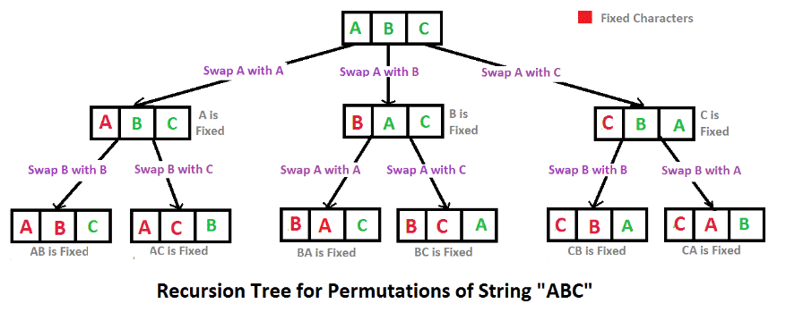

# 搜索算法

## 1.数字在升序数组中出现的次数

描述：给定一个长度为 n 的非降序数组和一个非负数整数 k，要求统计 k 在数组中出现的次数。

数据范围：0 <= n <= 1000，o <= k <= 100，数组中每个元素的值满足 0 <= Val <= 100

要求：空间复杂度 O(1)，时间复杂度 O(log(n))

示例1：

```
输入：[1,2,3,3,3,3,4,5],3
返回值：4
```

示例2：

```
输入：[1,3,4,5],6
返回值：0
```

代码实现：

```c++
class Solution {
public:
    int GetNumberOfK(vector<int> data, int k) {
        //如果参数为空
        if (data.empty()) {
            return 0;
        }

        //如果参数只有一个值
        if (data.size() == 1) {
            return data[0] == k ? 1 : 0;
        }

        return BinarySearch(data, k + 0.5) - (BinarySearch(data, k - 0.5));
    }

    //使用二分查找，找到数出现的位置
    int BinarySearch(vector<int> data, float num) {
        //左指针
        int left = 0;
        //右指针
        int right = data.size() - 1;

        //1, 2, 3, 3, 3, 4, 5
        while (left <= right) {
            //获取中间指针
            int mid = left + (right - left) / 2;

            //判断中间指针指向的值和 num 的大小
            if (num < data[mid]) {
                right = mid - 1;
            }
            if (num > data[mid]) {
                left = mid + 1;
            }
        }

        return left;
    }
};
```

思路：

因为data是一个非降序数组，它是有序的，这种时候我们可能会想到用二分查找。但是一个数组可能有多个k，而且我们要查找的并非常规二分法中k出现的位置，而是k出现的左界和k出现的右界。要是能刚好找到恰好小于k的数字位置和恰好大于k的数字的位置就好了。再有因为数组中全是整数，因此我们可以考虑，用二分查找找到 k*+0.5 应该出现的位置和k−0.5 应该出现的位置，二者相减就是k出现的次数。

具体做法：

1. 写一个二分查找的函数在数组中找到某个元素出现的位置。每次检查区间中点值，根据与中点的大小比较，确定下一次的区间。 
2. 分别使用二分查找，找到k+0.5和k-0.5应该出现的位置，中间的部分就全是k，相减计算次数就可以了。 

## 2.二维数组中的查找

描述：

在一个二维数组 array 中（每个一维数组的长度相同），每一行都按照从左到右递增的顺序排序，每一列都按照从上到下递增的顺序排序。请完成一个函数，输入这样的一个二维数组和一个整数，判断数组中是否含有该整数。 

[

 [1, 2, 8, 9], 

 [2, 4, 9, 12], 

 [4, 7, 10, 13], 

 [6, 8, 11, 15] 

]

给定 target=7，返回 true。

给定 target=3，返回 false。

数据范围：矩阵的长宽满足 0<= n，m <= 500，矩阵中的值满足 0 <= Val <= 10^9^

进阶：空间复杂度 O(1)，时间复杂度 O(n + m).

示例1：

```
输入：7,[[1,2,8,9],[2,4,9,12],[4,7,10,13],[6,8,11,15]]
返回值：true
说明：存在7，返回true
```

示例2：

```
输入：1,[[2]]
返回值：false
```

示例3：

```
输入：3,[[1,2,8,9],[2,4,9,12],[4,7,10,13],[6,8,11,15]]
返回值：false
说明：不存在3，返回false 
```

代码实现：

```c++
class Solution {
public:
    bool Find(int target, vector<vector<int> > array) {
        //参数判空
        if (array.empty() || array[0].empty()) {
            return false;
        }
        //只有一个参数
        if (array.size() == 1 && array[0].size() == 1) {
            return array[0][0] == target;
        }


        //获取头指针
        int left = 0;
        //获取尾指针
        int right = array.size() - 1;
        //获取矩阵的宽度
        int weight = array[0].size() - 1;

        //二分遍历最外层数组
        while (left <= right) {
            int mid = left + (right - left)/2;

            //判断 target 是否在当前数组中
            if (target < array[mid][0]) {
                right = mid - 1;
            } else if (target > array[mid][weight]) {
                left = mid + 1;
            } else {
                //在当前数组中查找 target
                int num = BinarySearch(array[mid], target);
                if (num == target) {
                    return true;
                } else {
                    //当前数组没有目标 target，避免对后续查找造成影响，将其删除
                    array.erase(array.begin() + mid);
                    right = array.size() - 1;
                }
            }
        }
        return false;
    }

    int BinarySearch(vector<int> array, int num) {
        if (array.empty())
            return 0;

        //获取头指针
        int left = 0;
        //尾指针
        int right = array.size() - 1;

        //循环遍历，二分查找
        while (left <= right) {
            //获取中间指针
            int mid = left + (right - left) / 2;

            //判断
            if (num < array[mid]) {
                right = mid - 1;
            } else if (num > array[mid]) {
                left = mid + 1;
            } else {
                return array[mid];
            }
        }
        return 0;
    }
};
```

思路：

使用双层二分查找的方式。

1. 第一层二分查找，找到最外层数组的中间数组，判断这个数组有没有要找的值，有直接返回`true`；没有将这个数组从`array`中删除，然后继续查找下一个中间数组。
2. 第二层使用二分查找，查找传进来的第二层数组有没有要找的值，找到将其返回；没找到返回 0。

## 3.旋转数组的最小数字

描述：

有一个长度为 n 的非降序数组，比如[1,2,3,4,5]，将它进行旋转，即把一个数组最开始的若干个元素搬到数组的末尾，变成一个旋转数组，比如变成了[3,4,5,1,2]，或者[4,5,1,2,3]这样的。请问，给定这样一个旋转数组，求数组中的最小值。 

数据范围：1 <= n <= 10000，数组中任意元素的值：0 <= val <= 10000

要求：空间复杂度：O(1)，时间复杂度：O(log(n))

示例1：

```
说明：[3,4,5,1,2]
返回值：1
```

示例2：

```
说明：[3,100,200,3]
返回值：3
```

代码实现：

```c++
class Solution {
public:
    int minNumberInRotateArray(vector<int> rotateArray) {
        //判断参数为空
        if (rotateArray.empty()) {
            return 0;
        }

        //如果数组只有一个值
        if (rotateArray.size() == 1) {
            return rotateArray[0];
        }

        //使用二分查找来做
        //获取头指针
        int left = 0;
        //获取尾指针
        int right = rotateArray.size() - 1;

        //循环
        while (left <= right) {
            //获取中间指针
            int mid = left + (right -left) / 2;

            //如果 mid 值大于 right 值
            if (rotateArray[mid] > rotateArray[right]) {
                left = mid + 1;
            } else if (rotateArray[mid] < rotateArray[right]) {
                //如果 mid 值小于 right 值
                right = mid;
            } else if (right == left) {
                //如果 right 等于 left，说明最小值就找到了
                return rotateArray[left];
            } else {
                right--;
            }
        }

        return 0;
    }
};
```

思路：

排序数组的查找问题首先考虑使用 二分法 解决，其可将 遍历法 的 线性级别 时间复杂度降低至 对数级别 

步骤：

1. 初始化： 声明 right、left 双指针分别指向 array 数组左右两端 
2. 循环二分： 设 `mid = (right + left)/2` 为每次二分的中点，当`array[mid] > array[right]`时： `mid` 一定在左排序数组 中，即旋转点 x 一定在`[mid + 1, right]`闭区间内，因此执行`left = mid + 1` 。
3. 当`array[mid] < array[right]` 时：`mid`一定在 右排序数组 中，即旋转点 x 一定在`[left, mid]`闭区间内，因此执行`right = mid` 。
4. 当`array[mid] = array[right]`时： 无法判断`mid`在哪个排序数组中，即无法判断旋转点 x 在`[left, mid]`还是`[mid + 1, right]`区间中。解决方案： 执行`right = right - 1`缩小判断范围。
5.  返回值：`当 left = right`时跳出二分循环，并返回 旋转点的值`array[left]`即可。 



## 4.字符串的排列

描述：

输入一个长度为 n 的字符串，打印出该字符串中字符的所有排列，你可以以任意顺序返回这个字符串数组。例如输入字符串ABC,则输出由字符A,B,C所能排列出来的所有字符串ABC, ACB, BAC, BCA, CBA和CAB。 



数据范围：n < 10

要求：空间复杂度 O(n!)，时间复杂度 O(n!)

输入描述：

输入一个字符串，长度不能超过 10，字符只包括大小写字母。

示例1：

```
输入："ab"
返回值：["ab","ba"]
说明：返回["ba","ab"]也是正确的
```

示例2：

```
输入："aab"
返回值：["aab","aba","baa"]
```

示例3：

```
输入："abc"
返回值：["abc","acb","bac","bca","cab","cba"]
```

示例4：

```
输入：""
返回值：[""]
```

代码实现：

```c++

```

思路：

## 5.数字序列中某一位的数字

描述：

数字以 0123456789101112131415... 的格式作为一个字符序列，在这个序列中第 2 位（**从下标 0 开始计算**）是 2 ，第 10 位是 1 ，第 13 位是 1 ，以此类题，请你输出第 n 位对应的数字。 

数据范围：0 <= n <= 10^9^

示例1：

```
输入：0
返回值：0
```

示例2：

```
输入：2
返回值：2
```

示例3：

```
输入：10
返回值：1
```

示例4：

```
输入：13
返回值：1
```

代码实现：

```c++
class Solution {
public:
    int findNthDigit(int n) {
        //记录n是几位数
        int digit = 1;
        //记录当前位数区间的起始数字：1,10,100...
        long long start = 1;
        //记录当前区间之前总共有多少位数字
        long long sum = 9;
        //将n定位在某个位数的区间中
        while(n > sum){
            n -= sum;
            start *= 10;
            digit++;
            //该区间的总共位数
            sum = 9 * start * digit;
        }
        //定位n在哪个数字上
        int num = start + (n - 1) / digit;
        //定位n在数字的哪一位上
        int index = (n - 1) % digit;
        return to_string(num)[index] - '0';
    }
};
```

思路：

不会写。