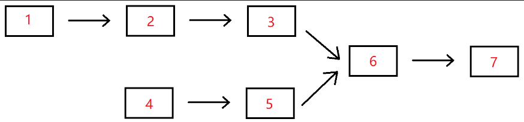

# 链表

## 1.从尾到头打印链表

描述： 

输入一个链表的头节点，按链表从尾到头的顺序返回每个节点的值（用数组返回）

如输入 {1, 2, 3} 的链表如下图所示：


返回一个数组为：[3, 2, 1]

示例：

```
输入： {1,2,3}
返回值：[3,2,1]
```

代码实现：

```go
type ListNode struct {
	Val  int
	Next *ListNode
}

//添加值到链表的末尾
func (this *ListNode) insertToListTail(newNode *ListNode) {
	temp := this

	for {
		//如果是最后一个节点
		if temp.Next == nil {
			break
		}
		//temp 指向下一个节点
		temp = temp.Next
	}

	//将值添加到链表末尾
	temp.Next = newNode
}

// ValList 创建一个切片，存放倒序数组
var ValList = make([]int, 0)

//从尾到头打印链表
func printListFromTailToHead(head *ListNode) []int {
	temp := head.Next

	//如果不是最后一个节点
	if temp.Next != nil {
		printListFromTailToHead(temp)
	}
	ValList = append(ValList, temp.Val)
	return ValList
}

func main() {
	//头节点
	headNode := &ListNode{}

	//生成链表
	node1 := &ListNode{Val: 1}
	node2 := &ListNode{Val: 2}
	node3 := &ListNode{Val: 3}
	headNode.insertToListTail(node1)
	headNode.insertToListTail(node2)
	headNode.insertToListTail(node3)

	//逆序打印链表数据
	ValList = printListFromTailToHead(headNode)
	fmt.Println(ValList)
}
```

思路：

由于题目要求使用单链表实现，因为单链表是只能顺序遍历而不能逆序遍历，所以使用正常遍历方法遍历链表是行不通的。于是，可以借助**递归**来实现要求。

1. 先通过递归遍历到链表的最后一个数字。
2. 然后退出递归，当递归退出时，递归栈也会被销毁。在递归栈被销毁之前还会执行递归语句后面剩余的代码，在此时，将链表元素添加到数组中
3. 打印数组元素，发现其内数据与链表中的数据刚好倒序。

## 2.反转链表

描述：

给定一个单链表的头结点 `pHead` (该头节点是有值的，比如在下图，它的val是1)，长度为n，反转该链表后，返回新链表的表头 。

- 数据范围：0 <= n <= 1000
- 要求：空间复杂度 O(1)，时间复杂度 O(n)

如当输入链表 {1, 2, 3} 时，经反转后，原链表变为 {3, 2, 1}，所以对应的输出为 {3, 2, 1}，以上转换过程如下图所示：


示例1：

```
输入：(1, 2, 3)
返回值：(3, 2, 1)
```

示例2：

```
输入：()
返回值：()
说明：空链表则输出为空
```

代码实现：

```go
// ReverseList 反转链表
func ReverseList(pHead *ListNode) *ListNode {
	//判断链表是否为空
	if pHead == nil || pHead.Val == 0 {
		fmt.Println("{}") //说明链表为空
		return nil
	}

	//如果链表只有一个节点
	if pHead.Next == nil {
		fmt.Printf("{%d}", pHead.Val)
		return pHead
	}

	//定义三个指针
	var pre *ListNode
	middle := pHead
	end := pHead.Next

	//遍历链表
	for {
		//当 middle 指针指向最后一个节点时
		if end == nil {
			break
		}

		//pre、middle、end三个指针分别指向后一个节点
		pre = middle
		middle = end
		end = end.Next

		//让middle指针指向的节点指向它的前一个节点，即 pre 指针指向的节点
		middle.Next = pre
	}

	//将反转后的链表的最后节点指向空
	pHead.Next = nil

	//结束循环后，将头节点返回，即middle指针指向的节点
	return middle
}
```

 思路：

1. 定义三个指针：`pre`、`middle`、`end`，初始化时分别指向`nil`、`headNode`、`headNode.next`。三个指针是前、中、后的关系。
2. 在 for 循环中，先让三个指针分别向后遍历。
3. 在遍历的过程中，每一次遍历，都让`middle`指向的当前节点的`next`指针指向`pre`指向的节点。这样一直遍历，直到`end`指针指向空时说明遍历完了整个链表，就结束循环。此时，整个链表都已被反转
4. for 循环结束后，将`middle`指针指向的节点，即被反转之前的链表的最后一个节点返回，既是被反转的新链表的表头。
5. 需要注意的一点：在返回头指针之前，需要将`pHead`指向的节点的`next`指针指向空，否则就会出现**环**

示意图：


## 3.合并两个排序的链表

描述：

输入两个递增的链表，单个链表的长度为n，合并这两个链表并使新链表中的节点仍然是递增排序的。

数据范围：0≤ n ≤1000，−1000≤节点值≤1000
要求：空间复杂度 O(1)，时间复杂度 O(n)

 如输入 {1,3,5}, {2,4,6} 时，合并后的链表为 {1,2,3,4,5,6}，所以对应的输出为 {1,2,3,4,5,6}，转换过程如下图所示： 


示例1：

```
输入：{1,3,5},{2,4,6}
返回值：{1,2,3,4,5,6}
```

示例2：

```
输入：{},{}
返回值：{}
```

示例3：

```
输入：{-1,2,4},{1,3,4}
返回值：{-1,1,2,3,4,4}
```

代码实现：

```go
// Merge 合并两个排序的链表
func Merge(pHead1 *ListNode, pHead2 *ListNode) *ListNode {
	//判断链表是否为 nil
	if pHead1 == nil && pHead2 == nil {
		fmt.Println("链表不能为空")
		return nil
	}

	//定义一个存放比较结果的链表
	resultHead := &ListNode{}
	//调用 Judge 方法合并排序链表
	Judge(pHead1.Next, pHead2.Next, resultHead)

	return resultHead
}

// Judge 这个方法用来判断节点的大小
func Judge(node1, node2, endNode *ListNode) {
	//当有一个链表遍历完后就结束递归
	if node1 != nil || node2 != nil {
		//定义辅助节点
		temp1 := node1.Next
		temp2 := node2.Next

		//判断 node1 和 node2 的大小
		if node1.Val <= node2.Val {
			endNode.Next = node1
			endNode.Next.Next = node2
		} else {
			endNode.Next = node2
			endNode.Next.Next = node1
		}
		//node 节点往后移
		node1 = temp1
		node2 = temp2
		//endNode 后移两位，始终指向最后一个节点
		endNode = endNode.Next.Next

		//递归调用
		Judge(node1, node2, endNode)
	}
}
```

思路：

1. 整体思路是使用递归实现

2. 在函数 `Merge()` 再额外定义一个函数，用来进行具体的节点大小比较：`Judge()`

3. 在函数`Judge(node1,node2,endNode *ListNode)`中定义三个指针参数，其中`node1`指向`pHead1`链表，`node2`指向`pHead2`链表，`endNode`则始终指向存放结果的链表`resultHead`的最后一个节点

4. 在函数`Judge()`中先确定`node1`和`node2`指针没有指向`nil`，如果指向`nil`，说明其各自的链表节点已经比较完毕，于是就结束递归

5. 如果`node1`和`node2`两个指针没有指向`nil`，则进入`if`内部，此时，先定义两个辅助节点`temp1`和`temp2`，分别指向`node1`和`node2`指针所指向的节点的下一个节点。

6. 之后，对`node1`和`node2`所指向的节点值进行大小的比较（此处不多赘述）

7. 在比较完当前`node1`和`node2`所指向的值后，让`node1`和`node2`指针分别指向`temp1`和`temp2`指针指向的值。

   > `temp1`和`temp2`保存的是比较节点大小之前`node1`和`node2`指针指向的节点的下一个节点地址，这样做做的意义是为了保证在比较节点大小时丢失指针

8. 最后，让`endNode`指针再次指向`resultHead`链表的最后一个节点即可

9. 继续下一次递归，直到递归结束

示意图：


## 4.输入两个链表的第一个公共结点

描述：

输入两个无环的单向链表，找出它们的第一个公共结点，如果没有公共节点则返回空。（注意因为传入数据是链表，所以错误测试数据的提示是用其他方式显示的，保证传入数据是正确的） 。

数据范围：n <= 1000

要求：空间复杂度 O(1)，时间复杂度 O(n)

例如，输入{1,2,3},{4,5},{6,7}时，两个无环的单向链表的结构如下图所示： 



输入描述：

输入分为是3段，第一段是第一个链表的非公共部分，第二段是第二个链表的非公共部分，第三段是第一个链表和第二个链表的公共部分。 后台会将这3个参数组装为两个链表，并将这两个链表对应的头节点传入到函数`FindFirstCommonNode`里面，用户得到的输入只有`pHead1`和`pHead2`。

返回值描述：

返回传入的pHead1和pHead2的第一个公共结点，后台会打印以该节点为头节点的链表 

示例1：

```
输入：{1,2,3},{4,5},{6,7}
返回值：{6,7}
说明：第一个参数{1,2,3}代表是第一个链表非公共部分，第二个参数{4,5}代表是第二个链表非公共部分，最后的{6,7}表示的是2个链表的公共部分。
这3个参数最后在后台会组装成为2个两个无环的单链表，且是有公共节点的
```

示例2：

```
输入：{1},{2,3},{}
返回值：{}
说明：2个链表没有公共节点 ,返回null，后台打印{}
```

代码实现：

```go
// FindFirstCommonNode1 使用暴力嵌套法（时间复杂度 O(mn)）
func FindFirstCommonNode1(pHead1 *ListNode, pHead2 *ListNode) *ListNode {
	//判断链表为空
	if pHead1 == nil || pHead2 == nil {
		fmt.Println("链表为空")
		return nil
	}

	//定义两个辅助结点
	temp1 := pHead1
	temp2 := pHead2
	//第一个公共结点
	var firstCommon *ListNode = nil

	//遍历 pHead2 链表
	for {
		if temp2 == nil {
			break
		}
		//遍历 pHead1 链表
		for {
			if temp1 == nil {
				//重置 temp1，让 temp1 重新指向头节点
				temp1 = pHead1
				break
			}
			//如果节点值相等，以及它们的下一个节点值也相等
			if temp1.Val == temp2.Val {
				firstCommon = temp2
				return firstCommon
			}
			//没找到继续遍历
			temp1 = temp1.Next
		}
		//temp2 继续遍历
		temp2 = temp2.Next
	}

	return firstCommon
}

// FindFirstCommonNode2 使用快慢指针，让慢指针先走完两个链表的长度差
func FindFirstCommonNode2(pHead1 *ListNode, pHead2 *ListNode) *ListNode {
	//判断链表为空
	if pHead1 == nil || pHead2 == nil {
		fmt.Println("链表为空")
		return nil
	}

	//定义两个辅助结点
	temp1 := pHead1
	temp2 := pHead2
	//第一个公共结点
	var firstCommon *ListNode = nil

	//让两个指针持平
	length := GetListLength(pHead1) - GetListLength(pHead2)
	if length > 0 {
		for i := 0; i < length; i++ {
			temp1 = temp1.Next
		}
	} else {
		for i := 0; i < (-length); i++ {
			temp2 = temp2.Next
		}
	}

	//寻找公共节点
	for {
		if temp1 == nil || temp2 == nil {
			break
		}
		if temp1.Val == temp2.Val {
			firstCommon = temp1
			break
		}

		//往下遍历
		temp1 = temp1.Next
		temp2 = temp2.Next
	}

	return firstCommon
}

// GetListLength 获取链表长度
func GetListLength(head *ListNode) int {
	length := 0
	//遍历链表
	temp := head
	for {
		if temp == nil {
			break
		}
		length++
		temp = temp.Next
	}
	return length
}
```

本题有两个思路。

- 思路1：采用暴力破解法，直接两层`for`循环嵌套，求解出第一个公共节点。思路可行，但是时间复杂度为 O(mn)
- 思路2：由于两个链表`pHead1`和`pHead2`公共相同的尾部，所以先消除两个链表的长度差，让分别指向两个链表头节点的指针持平，在进行循环比较，找出公共节点即可。时间复杂度为 O(m+n)


## 5.链表中环的入口结点

描述：

给一个长度为n链表，若其中包含环，请找出该链表的环的入口结点，否则，返回null 。

数据范围：n <=  10000，1  <= 结点值 <=  10000 

要求：空间复杂度 O(1)，时间复杂度 O(n)

例如，输入{1,2},{3,4,5}时，对应的环形链表如下图所示： 


 可以看到环的入口结点的结点值为3，所以返回结点值为3的结点 .

输入描述： 

输入分为2段，第一段是入环前的链表部分，第二段是链表环的部分，后台会根据第二段是否为空将这两段组装成一个无环或者有环单链表 。

返回值描述： 

返回链表的环的入口结点即可，我们后台程序会打印这个结点对应的结点值；若没有，则返回对应编程语言的空结点即可。 

示例1：

```
输入：{1,2},{3,4,5}
返回值：3
说明：返回环形链表入口结点，我们后台程序会打印该环形链表入口结点对应的结点值，即3 
```

示例2：

```
输入：{1},{}
返回值："null"
说明：没有环，返回对应编程语言的空结点，后台程序会打印"null" 
```

示例3：

```
输入：{},{2}
返回值：2
说明：环的部分只有一个结点，所以返回该环形链表入口结点，后台程序打印该结点对应的结点值，即2   
```

代码实现：

```go
// EntryNodeOfLoop 求出有环链表的环的入口结点
func EntryNodeOfLoop(pHead *ListNode) *ListNode {
	//判断链表是否为空，以及判断是否只有一个结点但是无环
	if pHead == nil || pHead.Next == nil {
		return nil
	}

	//如果只有一个结点而且有环
	if pHead.Next == pHead {
		return pHead
	}

	//循环遍历链表
	temp := pHead
	var entryNode *ListNode = nil
	for {
		if temp.Next == nil {
			break
		} else if temp.Next.Val < temp.Val {
			entryNode = temp.Next
			break
		}
		temp = temp.Next
	}
	return entryNode
}
```

思路：

- 思路1：因为链表是有序链表，所以在遍历链表的过程中，只要遍历的当前节点的值小于其下一个节点的值，就说明下一个节点就是有环链表的入口节点，将其返回即可
- 思路2：还可以使用快慢指针的方式实现。

## 6. 链表中倒数最后k个结点

描述：

输入一个长度为 n 的链表，设链表中的元素的值为 `a(i) `，返回该链表中倒数第 k 个节点。如果该链表长度小于 k，请返回一个长度为 0 的链表。

数据范围：0 <= n <=  10^5，o <= a(i) <= 10^9，0 <= k <= 10^9

要求：空间复杂度 O(n)，时间复杂度 O(n)

进阶：空间复杂度 O(1)，时间复杂度 O(n)

例如输入 {1, 2, 3, 4, 5}, 2 时，对应的链表结构如下图所示：


> 其中蓝色部分为该链表的最后2个结点，所以返回倒数第2个结点（也即结点值为4的结点）即可，系统会打印后面所有的节点来比较。 

示例1：

```
输入：{1, 2, 3, 4, 5}, 2
返回值：{4, 5}
说明：返回倒数第2个节点4，系统会打印后面所有的节点来比较。
```

示例2：

```
输入：{2},8
返回值：{}
```

代码实现：

```go
// FindKthToTailForOne 返回该链表中倒数第k个节点：快慢指针解决
func FindKthToTailForOne(pHead *ListNode, k int) *ListNode {
	//判断链表是否为空
	if pHead == nil {
		return nil
	}

	//判断链表长度是否小于 k
	if GetListLength(pHead) < k {
		return nil
	}

	//定义两个辅助指针
	deferNode := pHead //慢指针
	fastNode := pHead  //快指针

	//快指针先走 k 步
	for i := 1; i < k; i++ {
		fastNode = fastNode.Next
	}

	//然后快慢指针同时开始走
	for {
		//当快指针指向链表最后一个节点时，就结束循环
		if fastNode.Next == nil {
			break
		}
		//快慢指针一起往后走
		deferNode = deferNode.Next
		fastNode = fastNode.Next
	}

	//此时慢指针指向的节点就是目标节点
	return deferNode

}

//定义一个全局变量用来接收找到的目标节点
var resNode *ListNode

// FindKthToTailForTwo 返回该链表中倒数第k个节点：栈解决
func FindKthToTailForTwo(pHead *ListNode, k int) *ListNode {
	temp := pHead
	//判断链表是否为空
	if temp == nil {
		return nil
	}

	//判断链表长度是否小于 k
	if GetListLength(temp) < k {
		return nil
	}

	//找到链表中倒数第k个节点
	GetKthToTail(temp, &k)
	return resNode
}

// GetListLength 求链表长度
func GetListLength(pHead *ListNode) int {
	//判断是不是空链表
	if pHead.Val == 0 && pHead.Next == nil {
		fmt.Println("链表不能为空")
		return -1
	}

	//循环遍历链表
	temp := pHead
	var count int
	for {
		//如果是最后一个节点
		if temp == nil {
			break
		}
		//count 加 1
		count++
		//否则 temp 指向下一个节点
		temp = temp.Next
	}

	return count
}

// GetKthToTail 返回该链表中倒数第k个节点具体实现逻辑
func GetKthToTail(node *ListNode, k *int) {
	//如果node不是最后一个节点，始终递归
	if node.Next != nil {
		GetKthToTail(node.Next, k)
	}

	//当k等于1的时候就说明找到了目标节点
	if *k == 1 {
		resNode = node
	}
	//k不断减1
	*k--
}
```

思路：

- 思路1：快慢指针。

  第一个指针先移动k步，然后第二个指针再从头开始，这个时候这两个指针同时移动，当第一个指针到链表的末尾的时候，返回第二个指针即可

  

- 思路2：栈实现。

  把原链表的结点全部压栈，然后再把栈中最上面的k个节点出栈，出栈的结点重新串成一个新的链表即可 

  

## 7.复杂链表的复制

描述：

输入一个复杂链表（每个节点中有节点值，以及两个指针，一个指向下一个节点，另一个特殊指针random指向一个随机节点），请对此链表进行深拷贝，并返回拷贝后的头结点。（注意，输出结果中请不要返回参数中的节点引用，否则判题程序会直接返回空）。 下图是一个含有5个结点的复杂链表。图中实线箭头表示next指针，虚线箭头表示random指针。为简单起见，指向null的指针没有画出。 


示例：

```
输入:{1,2,3,4,5,3,5,#,2,#} 
输出:{1,2,3,4,5,3,5,#,2,#}
```

 解析：

我们将链表分为两段，前半部分{1,2,3,4,5}为`ListNode`，后半部分{3,5,#,2,#}是随机指针域表示 。后半部分，3，5，#，2，#分别的表示为1的位置指向3，2的位置指向5，3的位置指向null，4的位置指向2，5的位置指向null

 如下图：


示例1：

```
输入：{1,2,3,4,5,3,5,#,2,#}
返回值：{1,2,3,4,5,3,5,#,2,#}
```

代码实现：

````go
type RandomListNode struct {
	Label  int
	Next   *RandomListNode
	Random *RandomListNode
}

// Clone 复杂链表的复制
func Clone(head *RandomListNode) *RandomListNode {
	//判断链表是否为空
	if head == nil {
		return nil
	}
	
	//如果链表只有一个节点
	if head.Next == nil {
		return head
	}

	//将链表每个节点都复制一个
	temp := head
	for {
		//如果 temp 指向 nil 结束循环
		if temp == nil {
			break
		}
		//复制当前节点
		newNode := *temp
		//将复制出来的节点加入到链表中
		newNode.Next = temp.Next
		temp.Next = &newNode

		//temp 指向下一个节点
		temp = temp.Next.Next
	}

	//让复制的节点的Random指针指向正确的节点
	temp = head.Next
	for {
		//如果 temp 指向 nil 结束循环
		if temp.Next == nil {
			break
		}
		//修改被复制出来的节点的 Random 指针指向
		if temp.Random != nil {
			temp.Random = temp.Random.Next
		}

		//temp 指针往后移
		temp = temp.Next.Next
	}

	//将复制出来的节点提取出来
	newHead := head.Next
	temp = head.Next
	for {
		//如果是最后一个节点，就退出循环
		if temp.Next == nil {
			break
		}

		//提取出复制的节点
		temp.Next = temp.Next.Next
		//temp 指针往后移
		temp = temp.Next
	}

	return newHead
}
````

思路：

遍历链表，在每个节点的后一位复制节点，然后再将复制的节点提取出来组成新链表。

1. 先将原链表的所有节点都复制一份并添加到原节点的后面。
2. 使被复制出来的节点的`Random`指针都指向对应的被复制的节点
3. 将被复制的所有节点都提取出来组成一个新的链表，即原链表的复制


## 8.删除链表中重复的节点

描述：

在一个排序的链表中，存在重复的结点，请删除该链表中重复的结点，重复的结点不保留，返回链表头指针。 例如，链表 1->2->3->3->4->4->5 处理后为 1->2->5 。

数据范围： 链表长度满足 0 <= n <= 1000 ，链表中的值满足 1 <= val <= 1000 

进阶：空间复杂度 O(n)，时间复杂度 O(n)

例如输入{1,2,3,3,4,4,5}时，对应的输出为{1,2,5}，对应的输入输出链表如下图所示： 


示例1：

```
输入：{1,2,3,3,4,4,5}
返回值：{1,2,5}
```

示例2：

```
输入：{1,1,1,8}
返回值：{8}
```

代码实现：

```go
// DeleteDuplication 删除链表中重复的节点
func DeleteDuplication(pHead *ListNode) *ListNode {
	//判断链表为空
	if pHead == nil {
		return nil
	}
	//如果链表只有一个节点
	if pHead.Next == nil {
		return pHead
	}

	//创建辅助指针
	deferNode := pHead     //慢指针
	fastNode := pHead.Next //快指针

	//遍历链表
	for {
		//当快指针指向nil的时候结束循环
		if fastNode.Next == nil {
			break
		}
		//判断慢指针是否指向头节点
		if deferNode != pHead {
			//判断快指针指向的当前节点和其下一个节点是否相等
			if fastNode.Val == fastNode.Next.Val {
				//相等，就找到重复节点的结束位置
				fastNode = findDifference(fastNode)
				deferNode.Next = fastNode
			} else {
				//不相等，快慢指针都往后移动
				fastNode = fastNode.Next
				deferNode = deferNode.Next
			}

		} else {
			//指向头节点，判断头节点是否需要删除
			if deferNode.Val == deferNode.Next.Val {
				//找到重复节点的结束位置
				deferNode = findDifference(deferNode)
				//头节点指向结束位置
				pHead = deferNode
				//判断慢指针是否为空
				if deferNode != nil {
					fastNode = deferNode.Next
				} else {
					fastNode = nil
				}
			} else {
				//头节点不需要删除，快慢指针都往后移动
				fastNode = fastNode.Next
				deferNode = deferNode.Next
			}
		}
	}

	return pHead
}

//找到链表中重复节点的结束位置
func findDifference(node *ListNode) *ListNode {
	for {
		if node.Next != nil {
			//如果当前节点不是最后一个节点
			if node.Val == node.Next.Val {
				node = node.Next
			} else {
				break
			}
		} else {
			//如果是最后一个节点，直接返回nil
			return nil
		}
	}
	return node.Next
}
```

思路：

通过快慢指针与递归实现。

1. 定义两个指针：`deferNode`和`fastNode`，即慢指针和快指针
2. 先行判断链表的头节点是否和后面的节点相同，相同需要删除头节点
   1. 相同。先找到链表重复节点的结束位置（通过递归完成），找到后让头指针和慢指针指向结束节点，快指针指向结束节点的下一个节点。然后快慢指针继续往后遍历
   2. 不同。快慢指针继续往后面遍历，直到发现快指针指向的节点的值和快指针后一位的节点值相等，即找到重复节点的起始位置。此时，慢指针不动，快指针继续往后遍历，直到找到重复节点的结束位置，然后让慢指针的`next`指向结束位置即可。之后快慢指针继续往后遍历。
3. 当快指针的`next`指向为`nil`时，说明遍历完链表，此时返回头节点即可.

图解：


## 9.删除链表的结点

描述：

给定单向链表的头指针和一个要删除的节点的值，定义一个函数删除该节点，返回删除后的链表头节点。

1. 此题对比原题有所改动
2. 题目要保证链表中节点的值互不相同
3.  该题只会输出返回的链表和结果做对比，所以若使用 C 或 C++ 语言，你不需要 free 或 delete 被删除的节点 

数据范围：

0 <= 链表节点值 <= 10000

0 <= 链表长度 <= 10000

示例1：

```
输入：{2,5,1,9},5
返回值：{2,1,9}
说明：给定你链表中值为 5 的第二个节点，那么在调用了你的函数之后，该链表应变为 2 -> 1 -> 9
```

示例2：

```
输入：{2,5,1,9},1
返回值：{2,5,9}
说明：给定你链表中值为 1 的第三个节点，那么在调用了你的函数之后，该链表应变为 2 -> 5 -> 9
```

代码实现：

```go
//删除链表的节点
func deleteNode(head *ListNode, val int) *ListNode {
	//判断输入不能为空
	if head == nil {
		return nil
	}

	//如果要删除的节点是头节点
	if head.Val == val {
		head = head.Next
		return head
	}

	//遍历链表
	temp := head
	for {
		//快指针指向nil结束循环
		if temp == nil {
			break
		}
		//当找到了要删除的节点
		if temp.Next.Val == val {
			//删除
			temp.Next = temp.Next.Next
			//结束循环
			break
		}
		temp = temp.Next
	}

	return head
}
```

思路：

循环遍历链表删除即可。

# 树

## 1.二叉树的深度

描述：

输入一棵二叉树，求该树的深度。从根结点到叶结点依次经过的结点（含根、叶结点）形成树的一条路径，最长路径的长度为树的深度，根节点的深度视为 1 。

数据范围：节点的数量满足 1000 <= n <= 100 ，节点上的值满足 1000 <= val <= 100

进阶：空间复杂度 O(1) ，时间复杂度 O(n)

假如输入的用例为{1,2,3,4,5,#,6,#,#,7}，那么如下图：


示例1：

```
输入：{1,2,3,4,5,#,6,#,#,7}
返回值：4
```

示例2：

```
输入：{}
返回值：0
```

代码实现：

```go
type TreeNode struct {
	Val   int
	Left  *TreeNode
	Right *TreeNode
}

func TreeDepth(pRoot *TreeNode) int {
	//判断输入是否为空
	if pRoot == nil {
		return 0
	}

	//分别递归左子树和右子树
	left := TreeDepth(pRoot.Left)
	right := TreeDepth(pRoot.Right)

	//将递归左右子树得到的深度中，较大的深度加 1 返回
	return int(math.Max(float64(left), float64(right)) + 1)
}
```

思路：

递归实现

## 2.按之字形打印二叉树

描述：

给定一个二叉树，返回该二叉树的之字形层序遍历，（第一层从左向右，下一层从右向左，一直这样交替） 

数据范围：0 <= n <= 1500，树上每个节点的 `val` 都满足 |`val`| <= 1500

要求：空间复杂度：O(n)，时间复杂度：O(n)

例如：

给定的二叉树是 {1, 2, 3, #, #, 4, 5}


该二叉树之字形层序遍历的结果是：

```
[
[1],
[3, 2],
[4, 5]
]
```

示例1：

```
输入：{1,2,3,#,#,4,5}
返回值：[[1],[3,2],[4,5]]
说明：如题面解释，第一层是根节点，从左到右打印结果，第二层从右到左，第三层从左到右。  
```

示例2：

```
输入：{8,6,10,5,7,9,11}
返回值：[[8],[10,6],[5,7,9,11]]
```

示例3：

```
输入：{1,2,3,4,5}
返回值：[[1],[3,2],[4,5]]
```

代码实现：

```go
type TreeNode struct {
	Val   int
	Left  *TreeNode
	Right *TreeNode
}

// Print 之字形打印二叉树-队列实现
func Print(pRoot *TreeNode) [][]int {
	//确保参数不为空
	if pRoot == nil {
		return nil
	}

	//定义一个队列
	treeQueue := &Queue{maxSize: 10, head: 0, tail: 0, valueArr: make([]*TreeNode, 10)}
	//定义一个数组，用来存放所有的值
	allValues := [][]int{}
	//定义一个level，记录遍历的二叉树的层次
	level := 1
	//将根节点加入队列
	_ = treeQueue.AddQueue(pRoot)

	for {
		//只要队列不为空就一直循环
		if treeQueue.head == treeQueue.tail {
			break
		}
		//定义一个数组，用来储存二叉树每一层的节点值
		size := treeQueue.GetSize()
		var row = make([]int, 0)
		//遍历队列
		for i := 0; i < size; i++ {
			//弹出队列里存放的节点
			node, _ := treeQueue.GetQueue()
			//将节点的左右子节点加入队列
			if node.Left != nil {
				_ = treeQueue.AddQueue(node.Left)
			}
			if node.Right != nil {
				_ = treeQueue.AddQueue(node.Right)
			}
			//将当前节点的值存入数组中
			row = append(row, node.Val)
		}
		//判断当前二叉树的层数是奇数还是偶数
		if level%2 == 0 {
			//如果是偶数，将 row 数组反转后存入 allValues 数组
			allValues = append(allValues, reverse(row))
		} else {
			//如果是奇数，直接将 row 数组存入 allValues 数组
			allValues = append(allValues, row)
		}
		//level层数加1
		level++

	}
	return allValues
}

//反转切片函数
func reverse(s []int) []int {
	for i, j := 0, len(s)-1; i < j; i, j = i+1, j-1 {
		s[i], s[j] = s[j], s[i]
	}
	return s
}

/*队列实现-start*/

type Queue struct {
	maxSize  int //队列最大值
	valueArr []*TreeNode
	head     int //首指针，默认值是 0
	tail     int //尾指针，默认值是 0
}

// AddQueue 加入数据到队列之中
func (this *Queue) AddQueue(val *TreeNode) (err error) {
	//判断队列是否已满
	if this.isFull() {
		return errors.New("环形队列已满……")
	}

	//添加元素入队列
	this.valueArr[this.tail] = val
	//如果尾指针指向了队列最后一个位置
	this.tail = (this.tail + 1) % this.maxSize

	return
}

// GetQueue 从队列取出数据
func (this *Queue) GetQueue() (val *TreeNode, err error) {
	//判断队列是否为空
	if this.isEmpty() {
		err = errors.New("环形队列已空……")
		return
	}

	//判断头指针是否指向了队列最后一个位置
	val = this.valueArr[this.head]
	this.head = (this.head + 1) % this.maxSize

	return
}

// isFull 判断队列是否已满: true为满, false为未满
func (this *Queue) isFull() (is bool) {
	return (this.tail+1)%this.maxSize == this.head
}

// isEmpty 判断队列是否为空: true为是, false为不是
func (this *Queue) isEmpty() (is bool) {
	return this.tail == this.head
}

// GetSize 获取队列的元素个数
func (this *Queue) GetSize() int {
	return (this.tail + this.maxSize - this.head) % this.maxSize
}
/*队列实现-end*/
```

思路：

本题解法为**层次遍历**，二叉树的层次遍历借助队列的**先进先出**特性来实现。

1. 先定义一个数组`allValues`用来储存遍历二叉树的所有结果，再定义一个队列用来辅助遍历二叉树，然后定义一个`level`记录二叉树的层数

2. 一开始，先将二叉树的根节点加入队列

3. 建立第一个`for`循环，用来不断遍历队列，直至队列不再有元素了就结束循环

4. 获取队列当前的实时长度，保存在变量`size`中

5. 定义数组`row`储存遍历二叉树每一层的节点值

6. 建立第二层`for`循环，用来遍历当前队列里的元素，即二叉树一层的每个节点

7. 在第二层`for`循环中，将二叉树当前层中的节点依次出队列，并依次将节点的值保存到`row`数组中，以及依次将节点的左右子树加入队列。

   > 注意：这里`for`循环只循环`size`次，就是为了保证将二叉树当前层的节点遍历完的同时，不会遍历到二叉树下一层的节点。

8. 退出第二个`for`循环后，根据`level`的奇偶性判断`row`数组是正序加入`allValues`数组还是反序加入

9. `level`加1，进行二叉树下一层的循环遍历

图解：


## 3.二叉搜索树的第k个节点

描述：

给定一棵节点数为 n 的二叉搜索树，请找出其中的第 k 小的`TreeNode`结点值。

1.  返回第 k 小的节点值即可
2. 不能查找的情况，如二叉树为空 ，则返回-1，或者k大于n等等，也返回-1 
3. 保证 n 个节点的值不一样

数据范围：0 <= n <= 1000，0 <= k <= 1000，树上每个节点的值满足 0 <= val <= 1000

进阶：空间复杂度 O(n)，时间复杂度 O(n)

如输入 { 5,3,7,2,4,6,8 },3 时，二叉树 {5,3,7,2,4,6,8} 如下图所示：


该二叉树所有节点按结点值升序排列后可得 [2,3,4,5,6,7,8]，所以第3个结点的结点值为4，故返回对应结点值为4的结点即可。 

示例1：

```
输入：{5,3,7,2,4,6,8},3
返回值：4
```

示例2：

```
输入：{},1
返回值：-1
```

> 备注：当树是空时

代码实现：

```go
var arr = []int{}

func KthNode(pRoot *TreeNode, k int) int {
	//确保输入正确
	if pRoot == nil || k == 0 {
		return -1
	}
	findKthNode(pRoot)

	//获取二叉树的节点个数
	size := len(arr)
	//如果k大于二叉树的节点个数，返回-1
	if size < k {
		return -1
	}

	return arr[k-1]
}

func findKthNode(node *TreeNode) {
	if node != nil {
		//递归左子树
		findKthNode(node.Left)
		arr = append(arr, node.Val)
		//递归右子树
		findKthNode(node.Right)
	}
}
```

思路：

思路很简单。观察题目给的二叉树图示，发现按照**中序遍历法**遍历出来的二叉树节点值数组，刚好是升序数组，然后最后根据参数`k`返回对应的数组值即可。

## 4.重建二叉树

描述：

给定节点数为 n 的二叉树的前序遍历和中序遍历结果，请重建出该二叉树并返回它的头结点。

例如输入前序遍历序列 {1,2,4,7,3,5,6,8} 和中序遍历序列 {4,7,2,1,5,3,8,6}，则重建出如下图所示。


提示：

1. `vin.length == pre.length`
2. `pre` 和 `vin` 均无重复元素
3. `vin` 出现的元素均出现在 `pre` 里
4. 只需要返回根结点，系统会自动输出整颗树做答案对比

数据范围：n <= 2000，节点的值 -10000 <= val <= 10000

要求：空间复杂度 O(n)，时间复杂度 O(n)

示例1：

```
输入：[1,2,4,7,3,5,6,8],[4,7,2,1,5,3,8,6]
返回值：{1,2,3,4,#,5,6,#,7,#,#,8}
说明：返回根节点，系统会输出整颗二叉树对比结果，重建结果如题面图示
```

示例2：

```
输入：[1],[1]
返回值：{1}
```

示例3：

```
输入：[1,2,3,4,5,6,7],[3,2,4,1,6,5,7]
返回值：{1,2,5,3,4,6,7}
```

代码实现：

```go
type TreeNode struct {
	Val   int
	Left  *TreeNode
	Right *TreeNode
}

func reConstructBinaryTree(pre []int, vin []int) *TreeNode {
	//参数为空
	if len(pre) == 0 || len(vin) == 0 {
		return nil
	}

	//如果只有一个节点
	if len(pre) == 1 && len(vin) == 1 {
		return &TreeNode{Val: pre[0]}
	}

	//根节点
	rootNode := &TreeNode{Val: pre[0]}
	constructBinaryTree(rootNode, pre, vin)
	return rootNode

}

//重构二叉树详细逻辑
func constructBinaryTree(root *TreeNode, pre []int, vin []int) {
	//前序遍历列表和中序遍历列表为空时结束递归
	if len(pre) != 0 && len(vin) != 0 {
		//获取中序列表中的左子树列表
		vinLeft := getVin(root.Val, vin, true)
		//获取中序列表中的右子树列表
		vinRight := getVin(root.Val, vin, false)
		//获取前序列表中的左子树列表
		preLeft := getPre(pre, getCount(vinLeft), true)
		//获取前序列表中的右子树列表
		preRight := getPre(pre, getCount(vinRight), false)

		//判断根节点是否存在左子树
		if vinLeft != nil {
			if len(vinLeft) != 0 {
				//重构左子树
				root.Left = &TreeNode{Val: preLeft[0]}
				//递归
				constructBinaryTree(root.Left, preLeft, vinLeft)
			}
		}
		//判断根节点是否存在右子树
		if vinRight != nil {
			if len(vinRight) != 0 {
				//重构右子树
				root.Right = &TreeNode{Val: preRight[0]}
				//递归
				constructBinaryTree(root.Right, preRight, vinRight)
			}
		}
	}
}

//根据中序遍历结果获取左右子树列表
func getVin(root int, vin []int, isLeft bool) []int {
	//获取根节点在中序遍历列表中的下标索引
	index := getIndex(root, vin)
	//判断是想要左子树还是右子树
	if isLeft {
		return vin[:index]
	} else {
		return vin[index+1:]
	}
}

//获得左右子树的前序列表
func getPre(pre []int, count int, isLeft bool) []int {
	//如果 count==0 直接退出函数
	if count == 0 {
		return nil
	}

	//删除列表中的第一个元素
	pre = pre[1:]
	//根据count，即子树的节点个数，获取前序列表中相应子树的节点值列表
	if isLeft { //当想要获取左子树的列表时
		return pre[:count]
	} else { //当想要获取右子树的列表时
		//判断 count 奇偶性
		if len(pre)%2 != 0 {
			return pre[count-1:]
		} else {
			return pre[count:]
		}
	}
}

//获取子树的节点个数，根据中序遍历列表
func getCount(vin []int) int {
	var val int
	for _, value := range vin {
		if value != 0 {
			val++
		}
	}
	return val
}

//获得元素在切片中的索引
func getIndex(val int, arr []int) (index int) {
	for i, v := range arr {
		if v == val {
			index = i
		}
	}
	return
}
```

思路：

对于二叉树的前序遍历，我们知道序列的第一个元素必定是根节点的值，因为序列没有重复的元素，因此中序遍历中可以找到相同的这个元素，而我们又知道中序遍历中根节点将二叉树分成了左右子树两个部分，如下图所示： 


我们可以发现，数字1是根节点，并将二叉树分成了(247)和(3568)两棵子树，而子树的的根也是相应前序序列的首位，比如左子树的根是数字2，右子树的根是数字3，这样我们就可以利用前序遍历序列找子树的根节点，利用中序遍历序列区分每个子树的节点数。 

具体做法：

- step 1：先根据前序遍历第一个点建立根节点。
- step 2：然后遍历中序遍历找到根节点在数组中的位置。
- step 3：再按照子树的节点数将两个遍历的序列分割成子数组，将子数组送入函数建立子树。
- step 4：直到子树的序列长度为0，结束递归。

## 5.树的子结构

描述：

输入两棵二叉树A，B，判断B是不是A的子结构。（我们约定空树不是任意一个树的子结构）

假如给定A为 {8, 8, 7, 9, 2, #, #, #, #, 4, 7}，B为 {8, 9, 2}，2个树的结构如下，可以看出B是A的子结构


数据范围：

0 <= A的节点个数 <= 10000

0 <= B的节点个数 <= 10000

示例1：

```
输入：{8,8,7,9,2,#,#,#,#,4,7},{8,9,2}
返回值：true
```

示例2：

```
输入：{1,2,3,4,5},{2,4}
返回值：true
```

示例3：

```
输入：{1,2,3},{3,1}
返回值：false
```

代码实现：

```go
func HasSubtree(pRoot1 *TreeNode, pRoot2 *TreeNode) bool {
	//如果有参数为空，直接结束程序
	if pRoot1 == nil || pRoot2 == nil {
		return false
	}

	//根据 pRoot1 取得其层次遍历后的数组
	arr := getListForTree(pRoot1)
	//遍历数组
	for _, item := range arr {
		//根据 pRoot2 的头节点值，找到其在 arr 数组中的位置
		if item.Val == pRoot2.Val {
			//判断两个二叉树当前节点所属的子树是否相等
			if judgeEqual(item, pRoot2) {
				//相等直接返回 true 值
				return true
			}
		}
	}
	return false
}

//根据两个根节点，判断两个子树是否相等，具体逻辑实现
func judgeEqual(pRoot1 *TreeNode, pRoot2 *TreeNode) bool {
	//获取两个子树的层次遍历结果
	arr1 := getListForTree(pRoot1)
	arr2 := getListForTree(pRoot2)

	//确保 arr1 的长度大于 arr2 的长度，即保证 arr2 是 arr1 的子集
	if len(arr2) > len(arr1) {
		return false
	}

	//定义一个标签变量，用来记录两个数组是否有不相等的元素
	isEqual := true
	//遍历两个数组
	for i := 0; i < len(arr2); i++ {
		//如果有不相等的元素
		if arr1[i].Val != arr2[i].Val {
			//将 isEqual 置为 false
			isEqual = false
			//结束循环
			break
		}
	}

	//将标签变量返回
	return isEqual
}

//层次遍历二叉树，返回一个数组
func getListForTree(pRoot *TreeNode) []*TreeNode {
	if pRoot == nil {
		return nil
	}

	//定义一个切片数组
	arr := []*TreeNode{}
	//定义一个管道
	ch := make(chan *TreeNode, 6)
	//将根节点放入管道
	ch <- pRoot
	//循环持续遍历
	for {
		//获取管道的大小
		size := len(ch)
		//管道为空结束循环
		if size == 0 {
			//关闭管道
			close(ch)
			break
		}
		//遍历管道
		for i := 0; i < size; i++ {
			//弹出节点
			node := <-ch
			//将 node 放入数组
			arr = append(arr, node)
			//将node的左右子节点放入管道
			if node.Left != nil {
				ch <- node.Left
			}
			if node.Right != nil {
				ch <- node.Right
			}
		}
	}

	//将数组返回
	return arr
}
```

思路：

1. 遍历`pRoot1`，找出二叉树`pRoot1`中和二叉树`pRoot2`的头节点值相等的结点位置。
2. 找到结点后，判断此结点下的子树和二叉树`pRoot2`是否值相等
3. 相等返回`true`
4. 不相等，继续遍历并重复以上操作，直到遍历完`pRoot1`返回`false`

> 判断两棵树是否相等和遍历`pRoot1`，都是将二叉树转换成数组遍历。
>
> 此处的数组是层次遍历二叉树后得到的数组。

## 6.二叉树的镜像

描述：

操作给定的二叉树，将其变换为原二叉树的镜像。

数据范围：

二叉树的节点数 0 <= n <= 1000，二叉树每个结点的值 0 <= val <= 1000

要求：

空间复杂度 O(n)。本题也有原地操作，即空间复杂度 O(1) 的解法，时间复杂度 O(n)

比如：

源二叉树


镜像二叉树


示例1：

```
输入：{8,6,10,5,7,9,11}
返回值：{8,10,6,11,9,7,5}
说明：如题面所示
```

示例2：

```
输入：{}
返回值：{}
```

代码实现：

```go
func Mirror(pRoot *TreeNode) *TreeNode {
	if pRoot != nil {
		newNode := &TreeNode{Val: pRoot.Val}
		//递归右子树
		if pRoot.Right != nil {
			newNode.Left = Mirror(pRoot.Right)
		}
		//递归左子树
		if pRoot.Left != nil {
			newNode.Right = Mirror(pRoot.Left)
		}

		return newNode
	} else {
		return pRoot
	}
}
```

思路：

不断地对当前结点的左右子结点进行递归，然后让一个新结点指向递归函数所返回的结点即可。

## 7. **从上往下打印二叉树** 

描述：

不分行从上往下打印出二叉树的每个节点，同层节点从左至右打印。例如输入{8,6,10,#,#,2,1}，如以下图中的示例二叉树，则依次打印8,6,10,2,1(空节点不打印，跳过)，请你将打印的结果存放到一个数组里面，返回。 


数据范围：

0 <= 节点总数 <= 1000

-1000 <= 节点值 <= 1000

示例1：

```
输入：{8,6,10,#,#,2,1}
返回值：[8,6,10,2,1]
```

示例2：

```
输入：{5,4,#,3,#,2,#,1}
返回值：[5,4,3,2,1]
```

代码实现：

```go
func PrintFromTopToBottom(root *TreeNode) []int {
	if root == nil {
		return nil
	}

	//空数组
	result := []int{}
	//定义一个队列（管道）
	queue := make(chan *TreeNode, 10)
	//将二叉树根节点加入队列
	queue <- root
	//第一个for循环，用来遍历整个二叉树
	for {
		//获取队列大小
		size := len(queue)
		//当队列为空结束循环
		if size == 0 {
			break
		}
		//第二个for循环，遍历同一层次的二叉树节点
		for i := 0; i < size; i++ {
			//取出队列中的节点
			node := <-queue
			//将节点值存入数组中
			result = append(result, node.Val)
			//将节点的左右子树放入队列
			if node.Left != nil {
				queue <- node.Left
			}
			if node.Right != nil {
				queue <- node.Right
			}
		}
	}
	//将数组返回
	return result
}
```

思路：

使用队列对二叉树进行层次遍历，将遍历的值存入数组，即可实现从上往下打印二叉树

## 8. **二叉搜索树的后序遍历序列** 

描述：

输入一个整数数组，判断该数组是不是某二叉搜索树的后序遍历的结果。如果是则返回 true ,否则返回 false 。假设输入的数组的任意两个数字都互不相同。 

数据范围：节点数量 0 <= n <= 1000，节点上的值满足 1 <= val <= 10^5^，保证节点上的值各不相同

要求：空间复杂度 O(n)，时间复杂度 O(n^2^)

提示：

1. 二叉搜索树是指父亲节点大于左子树中的全部节点，但是小于右子树中全部节点的树
2. 该题我们约定空树不是二叉搜索树
3. 后序遍历是按照“左子树-右子树-根节点”的顺序遍历
4. 参考下面的二叉搜索树


示例1：

```
输入：[1,3,2]
返回值：true
说明：是上图的后序遍历 ，返回true
```

示例2：

```
输入：[3,1,2]
返回值：false
说明：不属于上图的后序遍历，从另外的二叉搜索树也不能后序遍历出该序列 ，因为最后的2一定是根节点，前面一定是孩子节点，可能是左孩子，右孩子，根节点，也可能是全左孩子，根节点，也可能是全右孩子，根节点，但是[3,1,2]的组合都不能满足这些情况，故返回false。
```

示例3：

```
输入：[5,7,6,9,11,10,8]
返回值：true
```

代码实现：

```go
func VerifySequenceOfBST(sequence []int) bool {
	//判断数组是否为空
	if sequence == nil || len(sequence) == 0 {
		return false
	}

	//如果数组只有 1 到 2 个数，直接返回true
	if len(sequence) == 1 || len(sequence) == 2 {
		return true
	}

	return detailFunc(sequence)
}

//详细代码逻辑实现
func detailFunc(sequence []int) bool {
	//如果参数为空，说明递归结束
	if len(sequence) == 0 {
		return true
	}
	//如果数组只有一个数
	if len(sequence) == 1 || len(sequence) == 2 {
		return true
	}

	//定义两个数组，分别存放比根节点大和小的值
	minArr := []int{} //小数组
	maxArr := []int{} //大数组
	//获取数组的长度
	length := len(sequence)
	//获取二叉树的根节点
	rootVal := sequence[length-1]
	//对数组重新赋值，去除根节点
	sequence = sequence[:length-1]

	//将数组的左右孩子部分分别存入两个数组
	length = len(sequence)
	for i := 0; i < length; i++ {
		//找到比根节点大的第一个数的位置
		if sequence[i] > rootVal {
			//将左孩子部分存入 minArr
			minArr = sequence[:i]
			//将右孩子部分存入 maxArr
			maxArr = sequence[i:]
			break
		}
	}

	//经过上面的循环后，如果maxArr没有值，说明原数组中除根节点外，其他数都比更节点小，此时
	if len(maxArr) == 0 {
		//将数组中出根节点外所有数存入minArr
		minArr = sequence
	}

	//遍历maxArr，判断是否全部数都大于根节点
	if len(maxArr) != 0 {
		length = len(maxArr)
		for i := 0; i < length; i++ {
			//如果找到了比根节点小的数，就直接返回 false 即可
			if maxArr[i] < rootVal {
				return false
			}
		}
	}

	//继续递归两个数组
	return detailFunc(minArr) && detailFunc(maxArr)
}
```

思路：递归

二叉搜索树定义：二叉搜索树是指父亲节点大于左子树中的全部节点，但是小于右子树中的全部节点的树。 

符合二叉搜索树后序遍历结果的数组，可能的排列顺序有以下三种：

1. 左孩子，右孩子，根节点
2. 全左孩子，根节点
3. 全右孩子，根节点

不可能的排列顺序是：

1. 右孩子，左孩子，根节点


具体思路实现：

1. 假设题目给定的数组一定是后序遍历数组，则数组的最后一个值一定是二叉树的根节点，其中比根节点小的数部分是左子树，比根节点大的数部分是右子树，且左子树一定在右子树的左边。

2. 于是，我们可以根据根节点，找到数组中比根节点大的数中第一个数`startVal`的位置

3. 然后将`startVal`左边的数封装到一个数组`minArr`中，将`startVal`右边的数包括`startVal`封装到一个数组`maxArr`中

4. 之后就可以分别比较`minArr`、`maxArr`中的数和根节点的大小，判断两个数组是否符合(1)。

   > 因为`minArr`中的数肯定都比根节点小，所以只需比较`maxArr`和根节点的大小即可

5. 如果`maxArr`中有比根节点小的数，说明`sequence`不是二叉搜索树；如果`maxArr`中的数都比根节点大，就继续递归`minArr`和`maxArr`，并重复上述步骤，直至两个数组为空。

## 9. 二叉树中和为某一值的路径(一)

描述：

给定一个二叉树root和一个值 sum ，判断是否有从根节点到叶子节点的节点值之和等于 sum 的路径。 

提示：

1. 该题路径定义为从树的根结点开始往下一直到叶子结点所经过的结点
2. 叶子节点是指没有子节点的节点
3. 路径只能从父节点到子节点，不能从子节点到父节点
4. 总节点数目为n

例如：

给出如下的二叉树，sum = 22


返回true，因为存在一条路径 5 -> 4 -> 11 -> 2 的节点值之和为 22

数据范围：

1. 树上的节点数满足 0 <= n <= 10000
2. 每个节点的值都满足 |Val| <= 1000

要求：空间复杂度 O(n)，时间复杂度 O(n)

进阶：空间复杂度 O( *树的高度* )，时间复杂度 O(n)

示例1：

```
输入：{5,4,8,1,11,#,9,#,#,2,7},22
返回值：true
```

示例2：

```
输入：{1,2},0
返回值：false
```

示例3：

```
输入：{1,2},3
返回值：true
```

代码实现：

```go
var res bool

func hasPathSum(root *TreeNode, sum int) bool {
	if root == nil {
		return false
	}

	//如果只有一个节点，直接进行比较即可
	if root.Left == nil && root.Right == nil {
		if root.Val == sum {
			return true
		} else {
			return false
		}
	}

	detail(root, 0, sum)
	return res
}

//详细代码实现
func detail(node *TreeNode, nodeSum int, sum int) {
	//如果已经确定答案，即 res=true，则不再执行后面的代码
	if res {
		return
	}

	//判断当前节点是叶子节点
	if node.Left == nil && node.Right == nil {
		//nodeSum 加上当前节点值
		nodeSum = nodeSum + node.Val
		//判断 nodeSum 是否和 sum 相等
		if nodeSum == sum {
			res = true
		} else {
			res = false
		}
		return
	}

	//nodeSum 加上当前节点值
	nodeSum = nodeSum + node.Val
	//递归左右子节点
	if node.Left != nil {
		detail(node.Left, nodeSum, sum)
	}
	if node.Right != nil {
		detail(node.Right, nodeSum, sum)
	}

}
```

思路：

通过**深度优先搜索算法**即可实现题目要求（在树中是**前序遍历**算法）

>  **深度优先搜索算法**（英语：Depth-First-Search，DFS）是一种用于遍历或搜索**树**或**图**的算法。这个算法会尽可能深地搜索树的分支。当节点v的所在边都己被探寻过，搜索将回溯到发现节点v的那条边的起始节点。这一过程一直进行到已发现从源节点可达的所有节点为止。如果还存在未被发现的节点，则选择其中一个作为源节点并重复以上过程，整个进程反复进行直到所有节点都被访问为止。 

## 10.二叉树中和为某一值的路径(二)

描述：

输入一颗二叉树的根节点root和一个整数`expectNumber`，找出二叉树中结点值的和为`expectNumber`的所有路径。

1. 该题路径定义为从树的根结点开始往下一直到叶子结点所经过的结点
2. 叶子节点是指没有子节点的节点
3. 路径只能从父节点到子节点，不能从子节点到父节点
4. 总节点数目为n

如二叉树 root 为 {10, 5, 12, 4, 7}，`expectNumber`为 22


则合法路径有 [[10, 5, 7], [10, 12]]

数据范围：

树中节点总数在范围 [0, 5000] 内

-1000 <= 节点值 <= 1000

-1000 <= `expectNumber` <= 1000

示例1：

```
输入：{10,5,12,4,7},22
返回值：[[10,5,7],[10,12]]
说明：返回[[10,12],[10,5,7]]也是对的
```

示例2：

```
输入：{10,5,12,4,7},15
返回值：[]
```

示例3：

```
输入：{2,3},0
返回值：[]
```

示例4：

```输入：
输入：{1,3,4},7
返回值：[]
```

代码实现（Java实现）：

```java
import java.util.*;
public class Solution {
    private ArrayList<ArrayList<Integer>> ret = new ArrayList<>();
    private LinkedList<Integer> path = new LinkedList<>();
     
    void dfs(TreeNode root, int number) {
        // 处理树为空
        if (root == null) return;
        // 路径更新
        path.add(root.val);
        // number更新
        number -= root.val;
        // 如果递归当前节点为叶子节点且该条路径的值已经达到了expectNumber，则更新ret
        if(root.left == null && root.right == null && number == 0) {
            ret.add(new ArrayList<>(path));
        }
        // 左右子树递归
        dfs(root.left, number);
        dfs(root.right, number);
        path.removeLast();
    }
     
    public ArrayList<ArrayList<Integer>> FindPath(TreeNode root,int expectNumber) {
        dfs(root, expectNumber);
        return ret;
    }
}
```

思路：

从根节点开始向左右子树进行递归，递归函数中需要处理的是：

1. 当前的路径`path`要更新
2. 当前的目标值`expectNumber`要迭代，减去当前节点的值
3. 若当前节点是叶子节点，考虑是否满足路径的期待值，并考虑是否将路径添加到返回列表中

具体做法：

1. 维护两个向量`ret`和`path`
2. 编写递归函数`dfs`
3. 递归函数内部要处理更新`path`，更新`expectNumber`，判断是否为叶子节点和判断是否要将`path`追加到`ret`末尾

## 11.二叉搜索树与双向链表

描述：

输入一颗二叉搜索树，将该二叉搜索树转换成一个排序的双向链表，如下图所示：


数据范围：输入二叉树的节点数 0 <= n <= 1000，二叉树中每个节点的值 0 <= Val <= 1000

要求：空间复杂度 O(1)（即在原树上操作），时间复杂度 O(n)

注意：

1. 要求不能创建任何新的节点，只能调整树中节点指针的指向。当转换完成以后，树中节点的左指针需要指向前驱，树中节点的右指针需要指向后继。
2. 返回链表中的第一个节点的指针。
3. 函数返回的 TreeNode，有左右指针，其实可以看成一个双向链表的数据结构。
4. 不用输出双向链表，程序会根据返回值自动打印输出。

输入描述：

二叉树的根节点

返回值描述：

双向链表的其中一个头节点

示例1：

```
输入：{10,6,14,4,8,12,16}
返回值：From left to right are:4,6,8,10,12,14,16;From right to left are:16,14,12,10,8,6,4;
说明：输入题面图中二叉树，输出的时候将双向链表的头节点返回即可。
```

示例2：

```
输入：{5,4,#,3,#,2,#,1}
返回值：From left to right are:1,2,3,4,5;From right to left are:5,4,3,2,1;
说明：
                    5
                  /
                4
              /
            3
          /
        2
      /
    1
树的形状如上图
```

代码实现：

```go
var result = []*TreeNode{}

func Convert(pRootOfTree *TreeNode) *TreeNode {
	if pRootOfTree == nil {
		return nil
	}

	//获得中序遍历二叉树的数组
	getMiddleList(pRootOfTree)

	//遍历数组，将数组元素串成链表
	for i := 0; i < len(result)-1; i++ {
		result[i].Right = result[i+1]
		result[i+1].Left = result[i]
	}

	//将链表头返回
	return result[0]
}

//得到二叉树中序遍历的数组
func getMiddleList(pRootOfTree *TreeNode) {
	//判空
	if pRootOfTree == nil {
		return
	}
	//中序递归二叉树
	getMiddleList(pRootOfTree.Left)
	result = append(result, pRootOfTree)
	getMiddleList(pRootOfTree.Right)
}
```

思路：

先通过中序遍历将二叉树的节点存入数组中，然后遍历数组，将数组的每个节点串成链表即可。

## 12.判断是不是平衡二叉树

描述：

输入一棵节点数为 n 二叉树，判断该二叉树是否是平衡二叉树。在这里，我们只需要考虑其平衡性，不需要考虑其是不是排序二叉树

**平衡二叉树**（Balanced Binary Tree），具有以下性质：它是一棵空树或它的左右两个子树的高度差的绝对值不超过1，并且左右两个子树都是一棵平衡二叉树。 

样例解释： 


样例二叉树如图，为一颗平衡二叉树。

> 约定空树也是平衡二叉树

数据范围：n <= 100，树上节点的 Val 值满足 0 <= n <= 1000

要求：空间复杂度 O(1)，时间复杂度 O(n)

输入描述：

输入一棵二叉树的根节点

返回值描述：

输出一个布尔类型的值

示例1：

```
输入：{1,2,3,4,5,6,7}
返回值：true
```

示例2：

```
输入：{}
返回值：true
```

代码实现：

```
func IsBalancedSolution(pRoot *TreeNode) bool {
	//如果是空树
	if pRoot == nil {
		return true
	}

	//判断当前节点的左右子节点高度差的绝对值是否小于1
	if math.Abs(getChildTreeHeight(pRoot.Left, 0)-
		getChildTreeHeight(pRoot.Right, 0)) > 1 {
		return false
	}

	//递归后序节点
	return IsBalancedSolution(pRoot.Left) && IsBalancedSolution(pRoot.Right)
}

//获取子树的高度
func getChildTreeHeight(childNode *TreeNode, height float64) float64 {
	//如果节点为空
	if childNode == nil {
		return 0
	}

	//每递归一个节点，深度加1
	height++
	//到叶子节点
	if childNode.Left == nil && childNode.Right == nil {
		return height
	}

	left := getChildTreeHeight(childNode.Left, height)
	right := getChildTreeHeight(childNode.Right, height)

	if left > right {
		return left
	} else {
		return right
	}
}
```

思路：

原理很简单，通过递归遍历二叉树每个节点，每遍历一个节点，就判断一次当前节点所属的二叉树是否是平衡二叉树，不是直接返回`false`，是就继续递归子节点。

获取当前节点的高度：递归当前节点的左右子节点，每递归一个节点`height`就加1，最后返回左右子树`height`的最大值.

## 13.二叉树的下一个节点

描述：

给定一个二叉树其中的一个结点，请找出中序遍历顺序的下一个结点并且返回。注意，树中的结点不仅包含左右子结点，同时包含指向父结点的next指针。下图为一棵有9个节点的二叉树。树中从父节点指向子节点的指针用实线表示，从子节点指向父节点的用虚线表示 。


示例：

输入： {8, 6, 10, 5, 7, 9, 11}, 8

返回：9

解析：这个组装传入的子树根节点，其实就是整颗树，中序遍历{5,6,7,8,9,10,11}，根节点8的下一个节点就是9，应该返回{9,10,11}，后台只打印子树的下一个节点，所以只会打印9，如下图，其实都有指向左右孩子的指针，还有指向父节点的指针，下图没有画出来 。


数据范围：节点数满足 1 <= n <= 50，节点上的值满足 1 <= Val <= 100

要求：空间复杂度 O(1)，时间复杂度 O(n)

输入描述：

输入分为2段，第一段是整体的二叉树，第二段是给定二叉树节点的值，后台会将这2个参数组装为一个二叉树局部的子树传入到函数`GetNext`里面，用户得到的输入只有一个子树根节点 

返回值描述：

返回传入的子树根节点的下一个节点，后台会打印输出这个节点 

示例1：

```
输入：{8,6,10,5,7,9,11},8
返回值：9
```

示例2：

```
输入：{8,6,10,5,7,9,11},6
返回值：7
```

示例3：

```
输入：{1,2,#,#,3,#,4},4
返回值：1
```

示例4：

```
输入：{5},5
返回值："null"
说明：不存在，后台打印"null"
```

代码实现：

```go
type TreeLinkNode struct {
	Val   int
	Left  *TreeLinkNode
	Right *TreeLinkNode
	Next  *TreeLinkNode
}

var resultArr = []*TreeLinkNode{}

func GetNext(pNode *TreeLinkNode) *TreeLinkNode {
	//判断是否为空值，以及判断是否只有一个节点
	if pNode == nil || (pNode.Left == nil && pNode.Right == nil && pNode.Next == nil) {
		return nil
	}

	//获取根节点
	pRoot := getRootNode(pNode)
	//通过根节点，获得整个二叉树的中序遍历数组
	getTraversalArr(pRoot)

	//根据中序遍历数组找到目标节点的下一个节点，返回
	for i := 0; i < len(resultArr)-1; i++ {
		if resultArr[i].Val == pNode.Val {
			return resultArr[i+1]
		}
	}
	return nil
}

//找到二叉树真正的根节点
func getRootNode(pNode *TreeLinkNode) *TreeLinkNode {
	temp := pNode
	for {
		if temp.Next == nil {
			return temp
		}

		temp = temp.Next
	}
}

//根据输入的根节点，得到中序遍历数组
func getTraversalArr(node *TreeLinkNode) {
	if node != nil {
		getTraversalArr(node.Left)
		resultArr = append(resultArr, node)
		getTraversalArr(node.Right)
	}
}
```

思路：

1. 先根据输入节点的`next`指针循环或者递归，找到二叉树的根节点（`getRootNode()`）
2. 然后以中序遍历算法，从根节点开始，将二叉树的中序遍历结果存入数组中（`getTraversalArr()`）
3. 最后，`for`循环遍历数组，找到目标节点的下一个节点，将其返回

## 14.对称的二叉树

描述：

给定一棵二叉树，判断其是否是自身的镜像（即：是否对称）

例如，下面这颗二叉树是对称的：


下面这棵二叉树不对称：


数据范围：节点数满足 o <= n <= 1000，节点上的值满足 |Val| <= 1000

要求：空间复杂度 O(n)，时间复杂度 O(n)

备注：你可以使用递归和迭代两种方法解决这个问题。

示例1：

```
输入：{1,2,2,3,4,4,3}
返回值：true
```

示例2：

```
输入：{8,6,9,5,7,7,5}
返回值：false
```

代码实现：

```go
type TreeNode struct {
	Val   int
	Left  *TreeNode
	Right *TreeNode
}

var result = true

func isSymmetrical(pRoot *TreeNode) bool {
	//判断参数是否为空
	//判断参数是否只有一个节点
	if pRoot == nil || (pRoot.Left == nil && pRoot.Right == nil) {
		return true
	}

	//调用递归函数
	recursion(pRoot.Left, pRoot.Right)
	return result
}

//递归左右子树
func recursion(lNode *TreeNode, rNode *TreeNode) {
	//当左右节点都不为空时才继续往下执行
	if lNode != nil && rNode != nil {
		//当左右节点的值不相等时
		if lNode.Val != rNode.Val {
			result = false
			return
		}
		//继续递归左右子节点
		recursion(lNode.Left, rNode.Right)
		recursion(lNode.Right, rNode.Left)
	} else {
		//当左右节点都为空时
		if lNode == nil && rNode == nil {
			return
		}
		//当左右节点其中一方为空另一方不为空，说明就不是镜像二叉树
		result = false
	}
}
```

思路：

对称二叉树有以下特点：

1. 左右子树高度一致
2. 左右子树互相对称

因此，在方法`recursion()`中，需要同时递归遍历左右子节点，如果当前左右子节点不相等，将`result`置为`false`并返回；如果相等，就继续递归左右子树互为镜像的部分（即 左节点的左子树和右节点的右子树、左节点的右子树和右节点的左子树），直至将整棵二叉树遍历完为止。

## 15.把二叉树打印成多行

描述：

给定一个节点数为 n 二叉树，要求从上到下按层打印二叉树的 val 值，同一层结点从左至右输出，每一层输出一行，将输出的结果存放到一个二维数组中返回。

例如：给定的二叉树是 {1, 2, 3, #, #, 4, 5} 


该二叉树多行打印层序遍历的结果是：

[

[1],

[2, 3],

[4, 5]

]

数据范围：二叉树的节点数 0 <= n <= 1000，0<= Val <= 1000

要求：空间复杂度 O(n)，时间复杂度 O(n)

输入描述：

给定一个二叉树的根节点

示例1：

```
输入：{1,2,3,#,#,4,5}
返回值：[[1],[2,3],[4,5]]
```

示例2：

```
输入：{8,6,10,5,7,9,11}
返回值：[[8],[6,10],[5,7,9,11]]
```

示例3：

```
输入：{1,2,3,4,5}
返回值：[[1],[2,3],[4,5]]
```

示例4：

```
输入：{}
返回值：[]
```

代码实现：

```go
type TreeNode struct {
	Val   int
	Left  *TreeNode
	Right *TreeNode
}

func Print(pRoot *TreeNode) [][]int {
	if pRoot == nil {
		return nil
	}

	//声明最终要返回的数组
	resultArr := [][]int{}
	//声明一个管道
	ch := make(chan *TreeNode, 100)
	//将根节点放入管道
	ch <- pRoot
	for {
		//获取管道长度
		length := len(ch)
		//管道为空时结束循环
		if length == 0 {
			break
		}

		//遍历管道
		itemArr := []int{}
		for i := 0; i < length; i++ {
			//将管道数据存入数组
			node := <-ch
			itemArr = append(itemArr, node.Val)

			//将当前层节点的下一个层放入管道
			if node.Left != nil {
				ch <- node.Left
			}
			if node.Right != nil {
				ch <- node.Right
			}
		}

		//将 itemArr 放入 resultArr 中
		resultArr = append(resultArr, itemArr)
	}
	return resultArr
}
```

思路：

主要通过队列实现。（即Golang里的管道）

1. 先创建一个死循环，死循环的结束条件是当队列的长度为 0 时结束循环。当队列长度为 0 时，说明已经遍历完整株二叉树。
2. 然后创建第二个普通`for`循环，这个`for`循环遍历的次数是二叉树一层的节点个数。在第一层`for`循环开始时获取的队列的长度，即为二叉树当前层的节点个数。
   1. 在第二层`for`循环中，先获取队列中的节点
   2. 将当前节点的值存入事先准备好的数组
   3. 再将当前节点的左右子节点存入队列，即为二叉树下一层的节点
3. 遍历完二叉树当前层的节点后，将当前层节点的数组，存入最后要返回的数组，之后继续下一轮循环。

## 16.二叉树中和为某一值的路径（三）

描述：

给定一个二叉树 root 和一个整数值 sum ，求该树有多少路径的的节点值之和等于 sum 。

1. 该题路径定义不需要从根节点开始，也不需要在叶子节点结束，但是一定是从父亲节点往下到孩子节点
2. 总节点数目为 n
3. 保证最后返回的路径个数在整形范围内（即路径个数小于 2^31^-1）

数据范围：

0 <= n <= 1000

-10^9^ <= 节点值 <= 10^9^

 假如二叉树 root为 {1, 2, 3, 4, 5, 4, 3, #, #, -1}，sum=6，那么总共如下所示，有3条路径符合要求 ：


示例1：

```
输入：{1,2,3,4,5,4,3,#,#,-1},6
返回值：3
说明：如图所示，有3条路径符合
```

示例2：

```
输入：{0,1},1
返回值：2
```

示例3：

```
输入：{1,#,2,#,3},3
返回值：2
```

代码实现：

```go
type TreeNode struct {
	Val   int
	Left  *TreeNode
	Right *TreeNode
}

//记录符合条件的路径个数
var pathCount = 0

/*
	两次递归求出符合要求的路径，第一次递归遍历所有节点，即路径起始节点
*/
func FindPath(root *TreeNode, sum int) int {
	if root != nil {
		//根据当前节点查找符合条件的路径
		findRightPath(root, sum)
		//递归左子树
		FindPath(root.Left, sum)
		//递归右子树
		FindPath(root.Right, sum)
	}
	return pathCount
}

/*
	第二次递归，根据第一次递归提供的起始节点，找到符合要求的路径
	(依旧是前序遍历方式)
*/
func findRightPath(start *TreeNode, sum int) {
	if start != nil {
		//如果 sum 等于了 当前节点值，说明找到了目标路径
		if sum == start.Val {
			pathCount++
		}
		//每次递归，sum就减去当前节点值
		sum = sum - start.Val
		//递归左子树
		findRightPath(start.Left, sum)
		//递归右子树
		findRightPath(start.Right, sum)
	}
}
```

思路：

既然要找所有路径上节点和等于目标值的路径个数，那我们肯定先找这样的路径起点啊，但是我们不知道起点究竟在哪里，而且任意节点都有可能是起点，那我们就前序遍历二叉树的所有节点，每个节点都可以作为一次起点，即子树的根节点。 

```go
//递归左子树
FindPath(root.Left, sum)
//递归右子树
FindPath(root.Right, sum)
```

查找路径的时候呢，也需要往下遍历，因此还可以继续前序遍历该子树，在遍历的过程遇到一个节点，sum相应减少，若是到最后往下的一个节点值正好等于剩下的sum，则找到一种情况。 

```go
//如果 sum 等于了 当前节点值，说明找到了目标路径，直接结束程序即可
if sum == start.Val {
    pathCount++
}
```

因为前序递归的次序是根左右，因此一定是往下找的路径，不会往上回溯。 

```go
//递归左子树
findRightPath(start.Left, sum)
//递归右子树
findRightPath(start.Right, sum)
```

## 17.在二叉树中找到两个节点的最近公共祖先

描述：

给定一棵二叉树（保证非空）以及这棵树上的两个节点对应的 Val 值 o1 和 o2，请找到 o1 和 o2 的最近公共祖先节点。

数据范围：树上节点数满足 1 <= n <= 10^5^，节点值 Val 满足区间 [0, n]。

要求：时间复杂度 O(n)

> 注：本题保证二叉树中每个节点的 Val 值均不相同.

如当输入  {3, 5, 1, 6, 2, 0, 8, #, #, 7, 4}, 5, 1 时，二叉树  {3, 5, 1, 6, 2, 0, 8, #, #, 7, 4}  如下图示：


所以节点值为5和节点值为1的节点的最近公共祖先节点的节点值为3，所以对应的输出为3。节点本身可以视为自己的祖先。

示例1：

```
输入：{3,5,1,6,2,0,8,#,#,7,4},5,1
返回值：3
```

示例2：

```
输入：{3,5,1,6,2,0,8,#,#,7,4},2,7
返回值：2
```

代码实现：

```go
type TreeNode struct {
	Val   int
	Left  *TreeNode
	Right *TreeNode
}

/*
这里有三种情况：
	第1种：o1、o2 有一个公共父节点；
	第2种：o1 为父节点，o2 为子节点
	第3种：o2 为父节点，o1 为子节点
*/
func lowestCommonAncestor(root *TreeNode, o1 int, o2 int) int {
	if root == nil {
		return 0
	}

	//如果 root 等于 o1 或 o2
	if root.Val == o1 || root.Val == o2 {
		return root.Val
	}

	//递归左右子树
	leftVal := lowestCommonAncestor(root.Left, o1, o2)
	rightVal := lowestCommonAncestor(root.Right, o1, o2)

	//对 leftVal 和 rightVal 进行判断
	if leftVal == 0 && rightVal == 0 {
		return 0
	}
	if leftVal == 0 && rightVal != 0 {
		return rightVal
	}
	if leftVal != 0 && rightVal == 0 {
		return leftVal
	}
	return root.Val
}
```

思路：

对于节点 o1, o2 的最近公共祖先，只存在三种情况： 

1. o1、o2 有一个公共父节点；
2. o1 为父节点，o2 为子节点；
3. o2 为父节点，o1 为子节点。

通过递归可解决本题：

1. 当到达空节点（既叶子节点的子节点）时，直接返回空 
2. 当root等于 o1 或 o2 时，返回root 
3. 若不为1， 2中情况，说明需要继续处理： 对左子树进行递归，返回值记为 left；对右子树进行递归，返回值记为 right
   1. 当 left 和 right 都为空时，说明不存在公共节点，返回 nil
   2. 当 left 不为空，right 为空时，说明 left 是公共节点，返回 left
   3. 当 left 为空，right 不为空时，说明 right 是公共节点，返回 right
   4. 当 left 和 right 都不为空时，说明 root 是公共节点，返回 root

## 18.二叉搜索树的最近公共祖先

描述：

给定一个二叉搜索树, 找到该树中两个指定节点的最近公共祖先 。

1. 对于该题的最近的公共祖先定义:对于有根树T的两个节点 p、q，最近公共祖先 LCA(T,p,q) 表示一个节点 x，满足 x 是p 和 q 的祖先且 x 的深度尽可能大。在这里，一个节点也可以是它自己的祖先.。
2. 二叉搜索树是若它的左子树不空，则左子树上所有节点的值均小于它的根节点的值； 若它的右子树不空，则右子树上所有节点的值均大于它的根节点的值所有节点的值都是唯一的。
3. 所有节点的值都是唯一的。
4. p 、q 为不同节点且均存在于给定的二叉搜索树中。 

数据范围：

3 <= 节点总数 <= 10000

0 <= 节点值 <= 10000

如果给定以下搜索二叉树：{7, 1, 12, 0, 4, 11, 14, #, #, 3, 5}，如下图：


示例1：

```
输入：{7,1,12,0,4,11,14,#,#,3,5},1,12
返回值：7
说明：节点1 和 节点12 的最近公共祖先是7
```

示例2：

```
输入：{7,1,12,0,4,11,14,#,#,3,5},12,11
返回值：12
说明：因为一个节点也可以是它自己的祖先.所以输出12 
```

代码实现：

```go
type TreeNode struct {
	Val   int
	Left  *TreeNode
	Right *TreeNode
}

func lowestCommonAncestor(root *TreeNode, p int, q int) int {
	if root == nil {
		return 0
	}

	//如果 root 值等于 p 或 q，直接返回 root
	if root.Val == p || root.Val == q {
		return root.Val
	}

	result := 0
	//如果 p 和 q 都小于 root 值，说明 p 和 q 都在 root 右子树上
	if p < root.Val && q < root.Val {
		result = lowestCommonAncestor(root.Left, p, q)
	}
	//如果 p 和 q 都大于 root 值，说明 p 和 q 都在 root 左子树上
	if p > root.Val && q > root.Val {
		result = lowestCommonAncestor(root.Right, p, q)
	}
	//这种情况说明 p 和 q 分别位于 root 左右子树上，root 即为 p、q 最近公共祖先
	if (p > root.Val && q < root.Val) || (p < root.Val && q > root.Val) {
		result = root.Val
	}
	return result
}
```

思路：

 本题主要思路依旧是递归。

二叉搜索树的特点是：若它的左子树不空，则左子树上所有节点的值均小于它的根节点的值； 若它的右子树不空，则右子树上所有节点的值均大于它的根节点的值所有节点的值都是唯一的。

根据二叉搜索树特点可知：

1. 如果 p 和 q 值都小于 root 值，说明 p 和 q 都位于 root 左子树上，于是继续递归遍历 root 左子树即可。
2. 如果 p 和 q 值都大于 root 值，说明 p 和 q 都位于 root 右子树上，于是继续递归遍历 root 右子树即可。
3. 如果 p 和 q 一个大于 root 值，一个小于 root 值，说明其分别位于 root 左右子树上，root 即要寻找的最近公共祖先。
4. 在进行以上判断之前，如果在递归中，root 值等于 p 或 q，直接将 root 返回，此时的 root 就是 q 或 p 所在的节点。

> 整体思路近似于第 17 题

# 队列&栈

## 1.用两个栈实现队列

描述：

用两个栈来实现一个队列，使用 n 个元素来完成 n 次在队列尾部插入整数 (push) 和 n 次在队列头部删除整数 (pop) 的功能。 队列中的元素为int类型。保证操作合法，即保证 pop 操作时队列内已有元素。 

数据范围 n <= 1000

要求：储存 n 个元素的空间复杂度为 O(n)，插入与删除的时间复杂度都是 O(1)。

示例1：

```
输入: ["PSH1","PSH2","POP","POP"]
返回值: 1,2
说明:"PSH1":代表将1插入队列尾部
	"PSH2":代表将2插入队列尾部
	"POP“:代表删除一个元素，先进先出=>返回1
	"POP“:代表删除一个元素，先进先出=>返回2 
```

示例2：

```
输入：["PSH2","POP","PSH1","POP"]
返回值：2,1
```

代码实现：

```go
//stack1 用来存放数据
var stack1 []int

//stack2 用来作为取数据的中转站
var stack2 []int

//指针，指向两个栈的数据最顶层
var len1 = 0
var len2 = 0

func Push(node int) {
	//将 node 存入 stack1
	stack1 = append(stack1, node)
	len1 += 1
}

func Pop() int {
	//转移 stack1 数据至 stack2
	for i := 1; i <= len1; i++ {
		stack2 = append(stack2, stack1[len1-i])
		len2 += 1
	}

	node := stack2[len2-1]
	len2 -= 1
	return node
}
```

思路：

栈的特点是：**先进后出**

队列的特点是：**先进先出**

如图所示：


将数据存入第一个栈中，再将数据从第一个栈取出存入第二个栈中，再从第二个栈中取出数据，就可以得到类似队列**先进先出**的数据了。

## 2.包含min函数的栈

描述：

定义栈的数据结构，请在该类型中实现一个能够得到栈中所含最小元素的 min 函数，**输入操作时保证 pop、top 和 min 函数操作时，栈中一定有元素**。 

此栈包含的方法有：

- `push(value)`：将 value 压入栈中
- `pop()`：弹出栈顶元素
- `top()`：获取栈顶元素
- `min()`：获取栈中最小元素

数据范围：操作数量满足 o <= n <= 300，输入的元素满足 |Val| <= 10000

进阶：栈的各个操作的时间复杂度是 O(1)，空间复杂度是 O(n)

示例：

输入： ["PSH-1", "PSH2", "MIN", "TOP", "POP", "PSH1", "TOP", "MIN"] 

输出：-1, 2, 1, -1

解析：

- "PSH-1" 表示将 -1 压入栈中，栈中元素为 -1
- "PSH2" 表示将 2 压入栈中，栈中元素为 2，-1
- “MIN” 表示获取此时栈中最小元素 ==> 返回 -1
- "TOP" 表示获取栈顶元素 ==> 返回 2
- "POP" 表示弹出栈顶元素，弹出 2，栈中元素为 -1
- "PSH1" 表示将 1 压入栈中，栈中元素为 1，-1
- "TOP" 表示获取栈顶元素 ==> 返回 1
- “MIN” 表示获取此时栈中最小元素 ==> 返回 -1

示例1：

```
输入： ["PSH-1","PSH2","MIN","TOP","POP","PSH1","TOP","MIN"]
返回值：-1,2,1,-1
```

代码实现：

```go
type Stack struct {
	Values []int
	//指针，指向栈顶元素
	p int
}

var stack Stack

// Push 将value压入栈中
func Push(node int) {
	//如果 stack 内容为空，就初始化 stack
	if len(stack.Values) == 0 {
		stack.Values = make([]int, 5)
		//指针初始化为 -1
		stack.p = -1
	}

	//指针指向栈顶
	stack.p += 1
	//将 node 压入栈中
	stack.Values[stack.p] = node
}

// Pop 弹出栈顶元素
func Pop() {
	//判断栈是否为空
	if stack.p == -1 {
		return
	}

	//弹出栈顶元素，栈指针指向上一个元素
	stack.p -= 1
}

// Top 获取栈顶元素
func Top() int {
	//判断栈是否为空
	if stack.p == -1 {
		return 0
	}

	//返回栈顶元素
	return stack.Values[stack.p]
}

// Min 获取栈中最小元素
func Min() int {
	//判断栈是否为空
	if stack.p == -1 {
		return 0
	}

	//获取栈元素的长度
	length := stack.p + 1
	//复制一份栈数据
	values := stack.Values

	//遍历栈中数据，找到最小值
	min := values[0]
	for i := 0; i < length; i++ {
		if min > values[i] {
			min = values[i]
		}
	}
	return min
}
```

思路：

定义一个栈结构体，`stack`的属性包含一个存放数据的切片`Values`，和一个指向栈顶元素的指针`p`。

其余见代码即可。

## 3.栈的压入、弹出序列

描述：

输入两个整数序列，第一个序列表示栈的压入顺序，请判断第二个序列是否可能为该栈的弹出顺序。假设压入栈的所有数字均不相等。例如序列 1, 2, 3, 4, 5 是某栈的压入顺序，序列 4, 5, 3, 2, 1 是该压栈序列对应的一个弹出序列，但 4, 3, 5, 1, 2 就不可能是该压栈序列的弹出序列。 

1. o <= `pushV.length` == `popV.length` <= 1000
2. -1000 <= `pushV[i]` <= 1000
3. `pushV` 的所有数字均不相同

示例1：

```
输入：[1,2,3,4,5],[4,5,3,2,1]
返回值：true
说明：可以通过，push(1)=>push(2)=>push(3)=>push(4)=>pop()=>push(5)=>pop()=>pop()=>pop()=>pop()，这样的顺序得到[4,5,3,2,1]这个序列，返回true 
```

示例2：

```
输入：[1,2,3,4,5],[4,3,5,1,2]
返回值：false
说明：由于是[1,2,3,4,5]的压入顺序，[4,3,5,1,2]的弹出顺序，要求4，3，5必须在1，2前压入，且1，2不能弹出，但是这样压入的顺序，1又不能在2之前弹出，所以无法形成的，返回false
```

代码实现：

```go
type Stack struct {
	Values []int
	//指针，指向栈顶元素
	p int
}

// Push 将value压入栈中
func (this Stack) Push(node int) Stack {
	//指针指向栈顶
	this.p += 1
	//将 node 压入栈中
	this.Values[this.p] = node

	return this
}

// Pop 弹出栈顶元素
func (this Stack) Pop() Stack {
	//判断栈是否为空
	if this.p == -1 {
		return this
	}

	//弹出栈顶元素，栈指针指向上一个元素
	this.p -= 1

	return this
}

func IsPopOrder(pushV []int, popV []int) bool {
	//定义一个栈
	stack := Stack{make([]int, 10), -1}

	//获取 pushV 的长度
	length := len(pushV)
	//定义索引 index，指向 pushV第一个元素
	index := 0
	//定义指针 pop，指向 popV 的第一个元素
	pop := 0
	//储存最终结果
	result := false

	for {
		//如果栈的当前元素和 pop 指针指向的值相等
		if stack.p != -1 && stack.Values[stack.p] == popV[pop] {
			//将栈当前元素弹出
			stack = stack.Pop()
			//pop 指针后移
			pop += 1

		} else {	
			//将 pushV 数据入栈
			stack = stack.Push(pushV[index])
			//index 指针后移
			index += 1
		}
		
		//结束循环
		if pop >= length {
			result = true
			break
		}
		if index >= length && stack.Values[stack.p] != popV[pop] {
			break
		}
	}
	return result
}
```

思路：

题目要我们判断两个序列是否符合入栈出栈的次序，我们就可以用一个栈来模拟。对于入栈序列，只要栈为空，序列肯定要依次入栈。那什么时候出来呢？自然是遇到一个元素等于当前的出栈序列的元素，那我们就放弃入栈，让它先出来 ：

```go
//如果栈的当前元素和 pop 指针指向的值相等
if stack.p != -1 && stack.Values[stack.p] == popV[pop] {
    //将栈当前元素弹出
    stack = stack.Pop()
    //pop 指针后移
    pop += 1

}
```

如果能按照这个次序将两个序列都访问完，那说明是可以匹配入栈出栈次序的。 

具体做法：

1. 准备一个辅助栈，两个下标分别访问两个序列 。
2. 辅助栈为空或者栈顶不等于出栈数组当前元素，就持续将入栈数组加入栈中。 
3. 栈顶等于出栈数组当前元素就出栈。 
4. 当入栈数组访问完，出栈数组无法依次弹出，就是不匹配的，否则两个序列都访问完就是匹配的。 

## 4.翻转单词序列

描述：

牛客最近来了一个新员工 Fish，每天早晨总是会拿着一本英文杂志，写些句子在本子上。同事 Cat 对 Fish 写的内容颇感兴趣，有一天他向 Fish 借来翻看，但却读不懂它的意思。例如，“nowcoder. a am I”。后来才意识到，这家伙原来把句子单词的顺序翻转了，正确的句子应该是“I am a nowcoder.”。Cat 对一一的翻转这些单词顺序可不在行，你能帮助他么 

数据范围：1 <= n < = 100

进阶：空间复杂度 O(n)，时间复杂度 O(n)，保证没有只包含空格的字符串

示例1：

```
输入："nowcoder. a am I"
返回值："I am a nowcoder."
```

示例2：

```
输入：""
返回值：""
```

代码实现：

```go
type Stack struct {
	Values []string
	//指针，指向栈顶元素
	p int
}

var stack = Stack{Values: make([]string, 10), p: -1}

// Push 将value压入栈中
func Push(node string) {
	//指针指向栈顶
	stack.p += 1
	//将 node 压入栈中
	stack.Values[stack.p] = node
}

// Pop 弹出栈顶元素
func Pop() string {
	//判断栈是否为空
	if stack.p == -1 {
		return ""
	}

	//弹出栈顶元素
	node := stack.Values[stack.p]
	//栈指针指向上一个元素
	stack.p -= 1

	return node
}

func ReverseSentence(str string) string {
	//判断参数为空
	if str == "" {
		return ""
	}

	//将字符串切割成数组
	strArr := strings.Split(str, " ")
	//取得数组长度
	length := len(strArr)

	//遍历数组，将其放入栈中
	for _, item := range strArr {
		Push(item)
	}

	//从栈中取得元素，并拼接
	result := ""
	for i := 0; i < length; i++ {
		result += Pop() + " "
	}
	return strings.TrimSpace(result)
}
```

思路：

解法很简单，把字符串按照空格分成字符数组，再将字符数组存入栈中，再从栈中取出数据拼接成字符串即可。
