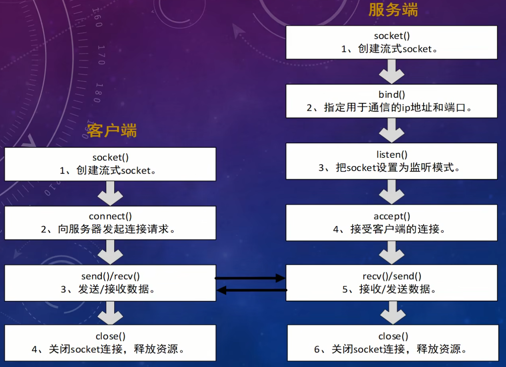

# 一.初识Socket

## 1.Socket编程概念

socket就是插座，运行在计算机中的两个程序会通过socket建立起一个通道，数据在通道中传输。

socket将复杂的TCP/IP协议族隐藏了起来，对于程序员来说，只要用好socket相关的函数，就可以完成网络通信。

## 2.Socket分类

1. socket提供了流（stream）和数据包（datagram）两种通信机制，即流socket和数据包socket。
2. 流socket基于TCP协议，是一个可靠、有序、双向字节流的通道，传输数据不会丢失、不会重复、顺序也不会错乱。
3. 数据包socket基于UDP协议，不需要建立和维持连接，可能会丢失或错乱。UDP不是一个可靠的协议，对数据的长度有限制，但数据传输效率高。
4. 某些应用层协议，由于历史原因，受到当时技术和网络条件限制，选择了基于UDP实现，其选择的理由现在已经大多不成立。
5. 实时的音视频聊天大多采用的是UDP，这种业务可以接受数据的丢失且没必要重传。

## 3.Socket通信流程

