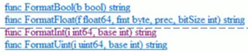

# 一、简介

## 1.Golang学习方向

- 区块链研发工程师
- Go 服务器端 / 游戏软件工程师
- Golang 分布式 / 云计算软件工程师

## 2.Go的特点

Go 语言保证了既能到达**静态编译语言**的安全和性能，又达到了**动态语言开发维护的高效率**，使用一个表达式来形容Go语言：**Go = C + Python**，说明Go语言既有C静态语言程序的运行速度，又达到了Python动态语言的快速开发。

1. 从C语言中继承了很多理念，包括表达式语法、控制结构、基础数据类型、调用参数传值、**指针**等等，同时也保留了和C语言一样的编译执行方式及弱化的指针。
2. 引入了包的概念，用于组织程序结构，Go语言的**一个文件都要归属于一个包**，而不能单独存在。
3. 垃圾回收机制，内存自动回收，不需要开发人员管理
4. 天然并发：
   1. 从语言层面支持并发，实现简单
   2. goroutine，轻量级线程，可实现大并发处理，高效利用多核
   3. 基于CPS并发模型（Communicating Sequential Processes）实现
5. 吸收了管道通信机制，形成了Go语言特有的管道 channel；通过管道 channel，可以形成不同的 goroute 之间的相互通信
6. 函数可以返回多个值
7. 新的创新：比如切片、延时执行 defer 等

# 二、快速搭建开发环境

## 1.搭建Go开发环境

1. 官网：https://go.dev/dl/

2. 选择版本：go1.17.13.windows-amd64

3. 配置环境变量：
   
   ```
   变量名：GOROOT
   变量值：D:\APP\Golang\go1.17.13.windows-amd64\go
   ```
   
   ```
   变量名：Path
   变量值：%GOROOT%\bin
   ```

## 2.Hello World

```go
package main

import "fmt"

func main() {
	fmt.Println("Hello World")
}
```

1. 通过 `go build` 对go文件进行编译，生成`xx.exe`文件
2. 运行`xx.exe`文件即可

> 也可以通过`go run`直接运行`hello.go`程序，类似于执行一个脚本环境（真实生产环境中需要先编译再执行）

## 3.执行流程分析

- 如果是对源码编译后再执行，Go执行流程如下：

  

- 如果是对源码直接执行 `go run` 源码，Go执行流程如下：

  

  两种执行方法的区别：

  - 如果先编译生成了可执行文件，则可以将该可执行文件拷贝到没有 go 开发环境的机器上，仍然可以运行
  - 如果是直接`go run`源代码，则如果要在另一台机器上运行，同样需要 go 开发环境，否则无法执行
  - 在编译时，编译器会将程序运行依赖的库文件包含在可执行文件中，所以可执行文件体积会变大

## 4.Go开发注意点

1. Go 源文件以`.go`作为文件扩展名
2. Go 应用程序的执行入口是`main()`方法
3. Go 语言严格区分大小写
4. Go 方法由一条条语句构成，每条语句不需要分号结尾（**Go会自动在每行结尾加上分号**），这也体现出Go的简洁性
5. Go 编译器是一行一行进行编译的，因此需要一行只写一行语句，不能把多行语句写在同一行，否则报错
6. go语言**定义的变量**或者**`import`的包**如果没有使用到，编译就不能通过

## 5.Go转义字符

- `\t`	:	一个制表位，实现对齐的功能
- `\n`    :    换行符
- `\\`    :    一个 \
- `\"`    :    一个 "
- `\r`    :    一个回车

## 6.Go中的注释类型

Go支持C语言风格的`/* */`块注释，也支持C++风格的`//`行注释。行注释更加通用，块注释主要针对于对**包**的详细说明或者屏蔽**大块的代码**

## 7.Go代码规范

1. 正确的注释和注释风格

   - Go官方推荐使用**行注释**来注释整个方法和语句

2. 正确的缩进和空白

   - 使用一个 tab 操作，来实现缩进，默认整体向右边移动，也可以使用 shift+tab 整体向左移动
   - 可以使用 `gofmt` 进行格式化
   - 运算符两边习惯性各加一个空格。例如：2 + 2 * 5

3. 代码风格

   推荐：

   ```go
   package main
   import "fmt"
   func main() {
       fmt.Println("Hello World")
   }
   ```

   **Go语言不允许这样写，这是错误的**：

   ```go
   package main
   import "fmt"
   func main() 
   {
       fmt.Println("Hello World")
   }
   ```

# 三、Go基本语法

## 1.变量

Go变量使用的三种方式：

1. 第一种：指定变量类型，声明后若不赋值，则使用默认值

2. 第二种：根据值自行判断变量类型（类型推导）

3. 第三种：省略 `var`，注意：`:=` 左侧的变量不应该是已经声明过的，否则会导致编译错误

   

Go 同时提供一次性声明多个变量的语法：

```go
var n1, n2, n3 int
```

> 全局变量也支持此语法

### 1.1 声明变量

基本语法：`var 变量名 数据类型`

- `var a int` 表示声明了一个变量，变量名是 a
- var num1 float32 也表明声明了一个变量，表示一个单精度类型的小数，变量名是 num1

### 1.2 初始化变量

在声明变量的同时，给其赋值

`var a int = 45`就是在初始化变量 a 的同时赋值 45

> 如果在声明是就直接赋值，可以省略数据类型
>
> ` var 4 = 400`

### 1.3 给变量赋值

先声明了变量：var num int

然后再进行赋值：num = 780

## 2.数据类型


### 2.1 整型

int：


uint：


其他数据类型：


整型的使用细节：

1. Go 各整数类型分为：有符号和无符号，int、uint的大小和系统有关

2. Go 的整型默认声明为 int 型

3. 可以在程序中查看某个变量的字节大小和数据类型

   ```go
   //查看数的类型
   var num1 = 100
   fmt.printf("num1 的类型是 %T", num1)
   
   //查看数的大小
   var num2 int32 = 200
   fmt.printf("num2 的大小是 %d", unsafe.Sizeof(num2))
   ```

4. Go 程序中的整型变量在使用时，遵守保小不保大的原则。即：在保证程序的正确允许下，尽量使用占用空间小的数据类型

5. **bit：计算机中的最小储存单位；byte：计算机中的基本储存单元**

### 2.2 浮点类型

```go
var n1 float32 = 3.14
```


浮点类型使用细节：

1. Go 浮点类型有固定的范围和字段长度，不受具体 OS (操作系统)的影响
2. Go 的浮点类型默认声明为 float64 类型
3. 浮点类型常量有两种表示形式：
   1. 十进制形式。如：5.12	.512（必须有小数点）
   2. 科学计数法形式。如：5.1234e2 = 5.12 * 10 的2次方     5.12E-2 = 5.12/10 的2次方
4. 通常情况下，应该使用 float64，因为它比 float32 更精确

### 2.3 字符类型（char）

Go 中没有专门的字符类型，如果要储存单个字符（字母），一般使用 byte 来保存。

Go 的字符串是由单个字符连接起来的，也就是说对于传统的字符串是由字符组成，而**Go的字符串不同，它是由字节组成**


> 注意：
>
> 1. 如果保存的字符是在 ASCII 表中的，如[0-1, a-z, A-Z……]，可以直接保存到 byte 中
> 2. 如果保存的字符对应码值大于 255，这是可以考虑使用 int 来进行保存
> 3. 如果需要按照字符的方式输出，这时就需要格式化输出，即：`fmt.Printf("%c", c1)`

### 2.4 布尔类型

1. 布尔类型也叫 bool 类型，go 中 bool 类型只允许取值 true 和 false
2. bool 类型占 1 个字节
3. bool 类型适用于逻辑运算，一般用于程序流程控制

```go
var i = false
```


### 2.5 字符串类型

Go 的字符串由单个字节连接起来。Go 的字符串使用 UFT-8 编码表示 Unicode 文本

```go
va raddress string = "北京"
```

字符串的注意事项：

1. Go 语言的字符串的字节使用 UTF-8 编码表示 Unicode 文本，所以 Go 统一使用 UFT-8 编码，也就不会有中文乱码问题的出现
2. 字符串一旦赋值，就无法修改，**在 Go 中字符串是不可变的**
3. 字符串的两种表示形式：
   1. 双引号，会识别转义字符
   2. 反引号，以字符串的原生形式输出，包括换行和特殊字符，可以实现防止攻击、输出源代码等效果

### 2.6 Go基本数据类型默认值


### 2.7 基本数据类型之间的转换

Go 和 Java / C 不同，Go在不同类型的变量之间赋值时需要**显示转换**，即Go中数据类型不能自动转换。

语法：

```go
var n1 int32 = 100
var n2 float32 = float32(n1)
fmt.Println("n1 = %T, n2 = %T", n1, n2)
```

基本数据类型的转换的注意事项：

1. Go 中，数据类型的转换可以是从 范围小的 -> 范围大的，也可以是 范围大的 -> 范围小的
2. 被转换的是**变量储存的数据**（即值），变量本身的数据类型并没有发生变化
3. 在转换中，比如将 int54 转换成 int8，编译时不会报错，知识转换的结果是按溢出处理，和我们希望的结果不同

### 2.8 基本数据类型和String的转换

**基本数据类型转String**：

方式一：`fmt.Sprintf("%参数", 表达式)`

```go
var num1 int = 99
var num2 float32 = 1.23

str := fmt.Sprintf("%d", num1)
str = fmt.Sprintf("%f", num2)
```

方式二：使用 `strconv` 包的函数



```go
var num1 int = 99
var num2 float32 = 1.23

str := strconv.FormatInt(int64(num3), 10)
str = strconv.FormatFloat(num2, 'f', 10, 64)
```

**String转基本数据类型**：

使用 `strconv` 包的函数


```go
var num int = 5
var str = strconv.Itoa(num)
```

> 因为函数返回的是 int64 或者 float64 ，所以如果希望得到 int32 或者 float32 要进行类型转换。
>
> 在将 String 类型转成基本数据类型的时候，**要确保 String 类型能够转成有效的数据**，比如可以把 123 转成一个整数，但是不能 hello 转成一个整数，如果这样做，Go 会直接将其转成 0

## 3.指针

1. 基本数据类型，变量存的就是值，也叫值类型
2. 获取变量的地址，通过 `&` 符号。比如：`var num int`，获取 num 的地址 -> `&num`
3. 指针类型，指针变量存的是一个地址，这个地址指向的空间才是实际的值。比如：`var ptr *int = &num`
4. 获取指针类型所指向的值，使用：`*`。比如：`var ptr *int`，使用 `*ptr` 获取 ptr 指向的值

指针在内存中的情况：


## 4.值类型和引用类型

1. 值类型：基本数据类型 int 系列、float 系列、bool、string、数组和结构体 struct
2. 引用类型：指针、slice 切片、map、管道 chan、interface 等

值类型和引用类型的特点：

1. 值类型：**变量直接储存值**，内存通常在**栈中分配**

   

2. 引用类型：变量储存的是一个地址，这个地址对应的空间才是真正储存数据（值）的地方。内存通常在**堆**上分配，当没有任何变量引用这个地址时，该地址对应的数据空间就会成为一个**垃圾**，由 **GC** 来进行回收

   

> 值类型：操作的是**地址**；引用类型：操作的是**真正的数据**

## 5.保留关键字和预定标识符

**保留关键字**：

在 Go 中，为简化代码编译过程中对代码的解析，其定义的保留关键字只有 25 个。

| break    | default     | func   | interface | select |
| -------- | ----------- | ------ | --------- | ------ |
| case     | defer       | go     | map       | struct |
| chan     | else        | goto   | package   | switch |
| const    | fallthrough | if     | range     | type   |
| continue | for         | import | return    | var    |

**预定义标识符**：

除了保留关键字外，Go 还提供了 36 个预定的标识符，其中包括基础数据类型和系统内嵌函数。

| append    | bool       | byte   | cap   | close   | comples |
| --------- | ---------- | ------ | ----- | ------- | ------- |
| complex64 | complex128 | uint16 | copy  | false   | float32 |
| float64   | imag       | int    | int8  | int16   | uint32  |
| int32     | int64      | iota   | len   | make    | new     |
| nil       | panic      | uint64 | print | println | real    |
| recover   | string     | true   | uint  | uint8   | uintprt |

## 6.运算符

**算术运算符**：

> 1. Go 的自增自减只能当作一个独立语言使用，不能这样使用：**`b := a++`** 或 **`b := a--`**
> 2. Go的 ++ 和 -- 只能写在变量的后面，不能写在变量的前面，即只能 `a++`、`a--` 不能 `++a`、`--a`
> 3. Go 的设计者去掉了 C / Java 中的 自增、自减 这些容易混淆的写法，使得 Go 更加简洁、统一（强制性）

## 7.获取键盘输入

获取键盘输入可以通过 `fmt.Scanln()` 或者 `fmt.Scanf()` 实现

代码：

```go
var name string
var age int

//使用 fmt.Scanln() 获取输入
fmt.Println("please input your name: ")
fmt.Scanln(&name)
fmt.Println("please input your age: ")
fmt.Scanln(&age)

//使用 fmt.Scanf() 获取输入
fmt.Println("please input your name and age: ")
fmt.Scanf("%s %d", &name, &age)
```

## 8.流程控制

### 8.1 分支判断

基本语法：

```
//单分支
if 条件表达式 {
	执行代码块
}

//双分支
if 条件表达式 {
	执行代码块1
} else {
	执行代码块2
}

//多分支
if 条件表达式 {
	执行代码块1
} else if 条件表达式2 {
	执行代码块2
}
……
```

实例：

```go
var num int = 10
//单分支
if num > 0 {
    //TODO
}

//双分支
if num > 0 {
    //TODO
} else {
    //TODO
}

//多分支
if num > 0 {
    //TODO
} else if num > 5 {
    //TODO
} else {
    //TODO
}
```

### 8.2 switch

基本语法：

```
switch 表达式 {
	case 表达式1,表达式2,……:
		语句块1
    case 表达式3,表达式4,……:
    	语句块2
    ……
    default:
    	语句块
}
```

实例：

```go
switch key {
    case 'a':
    	fmt.Println("xxx")
    case 'b':
    	fmt.Println("xxx")
    case 'c':
    	fmt.Println("xxx")
    default:
    	fmt.Println("xxx")
}
```

switch 语法的注意事项：

1. case 后是一个表达式，即常量值、变量、一个有返回值的函数都可以

2. case 后的各个表达式的值的数据类型，必须和 switch 的表达式数据类型一致

3. 如果 switch 的表达式的值没有和任何 case 的表达式匹配成功，则执行 default 的语句块，执行后推出 switch 的控制

4. Go 的 case 后面可以有多个表达式，表达式之间使用 `,` 间隔

5. Go 中的 case 语句块不需要写 `break`，因为 Go 会默认加上 

6. case 后面的表达式如果是常量值（字面量），则要求不能重复

7. `default` 语句不是必须的

8. switch 后面也可以不带表达式，类似于多个 `if-else` 来使用

   ```go
   age := 10
   switch {
       case age == 10:
       	fmt.Println("xxx")
       case age == 20:
       	fmt.Println("xxx")
       default:
       	fmt.Println("xxx")
   }
   ```

9. switch 后面也可以直接声明或者定义一个变量，分号结束（不推荐这样做）

10. switch 穿透：`fallthrough`。如果在 case 语句块后面增加  `fallthrough`，则会继续执行下一个 case，也叫 switch 穿透

    ```go
    switch age := 10 {
        case age == 10:
        	fmt.Println("xxx")
        	fallthrough	//默认只能穿透一层
        case age == 20:
        	fmt.Println("xxx")
        default:
        	fmt.Println("xxx")
    }
    ```

### 8.3 for循环

基本语法：

```
for 循环变量初始化; 循环条件; 循环变量迭代 {
	循环操作
}
```

实例：

```go
for i :=1; i <= 10; i++ {
    fmt.Println("xxx")
}
```

for 循环第二种使用方式

基本语法：

```
for 循环判断条件 {
	循环执行语句
}

将变量初始化和变量迭代写在其他位置
```

代码：

```go
j := 1
for j <= 10 {
    fmt.Println("xxxx")
    j++
}
```

for 循环的死循环写法

基本语法：

```
for {
	循环执行语句
}
```

Go 还提供了 `for-range` 的方式，可以方便的遍历字符串和数组：

```go
str := "hello world"
for index, val := range str {
    fmt.printf("index = %d, val = %c", index, val)
}
```

> 如果遍历的字符串中包含中文，则传统的遍历字符串方式会出现乱码
>
> 原因：传统对字符串的遍历是按照字节遍历，但是一个汉字在 utf-8 编码中占据 3 个字节
>
> 解决方法：将 `String` 类型数据转成 `[]rune` 切片
>
> 而对于  `for-range` 则没有这种问题，因为 `for-range` 是根据字符方式遍历，不会出现中文乱码

### 8.4 while 和 do……while

Go 没有 while 和 do……while 的语法，如果需要使用类似其他语言，如 Java、C 的 while 和 do……while，可以通过 for 循环来实现使用效果。

```go
// while 实现
num := 1
for {
    if num > 10 {
        break
    }
    fmt.Println("xxxx")
    num++
}

// do……while 实现
num := 1
for {
    fmt.Println("xxxx")
    num++
    if num > 10 {
        break
    }
}
```

### 8.4 跳转控制语句goto

1. Go的 goto 语句可以无条件的转移到程序中指定的行
2. goto 语句通常与条件语句配合使用，可用来实现条件转移，跳出循环体等功能
3. 在go程序设计中**一般不主张使用 goto 语句**，以免造成程序流程的混乱，使理解和调试程序都产生困难

代码：

```go
fmt.Println("input 1")
fmt.Println("input 2")
goto label
fmt.Println("input 3")
fmt.Println("input 4")
label:
fmt.Println("input 5")
fmt.Println("input 6")
```

## 9.常量

1. 常量使用 `const` 修饰
2. 常量在定义的时候，必须初始化
3. 常量不能修改
4. 常量只能修饰 bool、数值类型（int、float类型）、string类型
5. 语法：`const identifier [type] = value`
6. 例子：`const name string = "tom"`

方式一：比较简洁的写法

```go
const (
	a = 1
    b = 2
)
```

方式二：较为专业的写法

```go
const (
	a = iota	//iota 表示为 a 赋值为 0，后面的 b 就在 a 的基础上 +1，c 在 b 的基础上 +1
    b
    c
)
```

常量注意事项：

1. go 中**没有常量名必须字母大写的规范**，比如：`TAX_RATE`
2. go 常量仍然可以通过首字母的大小写来控制常量的访问范围

# 四、函数

## 1.函数

基本语法：

```go
func 函数名(形参列表) (返回值列表) {
    执行语句
    return 返回值列表
}
```

代码：

```go
func cal(n1 float64, n2 float64, operator byte) (float64) {
	var result float64
	switch operator {
	case '+':
		result = n1 + n2
	case '-':
		result = n1 - n2
	case '*':
		result = n1 * n2
	case '/':
		result = n1 / n2
	default:
		fmt.Println("error")
	}
	return result
}
```

## 2.包

注意事项：

1. 在给一个文件打包时，该包对应一个文件夹，如 utils 文件夹对应的就是 utils，文件的包名通常和该文件所在的文件夹名一致，一般为小写字母

2. 当一个文件要使用其他包函数或变量时，先引入对应的包

   1. 引入方式一：`import 包名`
   2. 引入方式二：`import (包名 包名)`

3. `packages` 指令在文件第一行，然后才是 `import` 指令

4. 在 `import` 包时，路径从 `$GOPATH` 的 src 下开始，不用带 src，编译器会自动从 src 下开始引入

5. 为了其他包的文件可以访问到本包的函数，则该函数名的首字母需要大写，类似于其它语言的 public，这样才能跨包访问

6. 在访问其他包函数变量时，其语法是 `包名.函数名`

7. 如果包名过长，go 支持给包取别名，但取别名后，原来的包名将不能使用

   ```go
   import f "fmt"
   ```

8. 如果要将程序编译成可执行程序文件，需要将包声明为 main，即 `package.main`。这是一个语法规范，如果写的是一个库，包名可以自定义

   

## 3.函数调用底层原理

例子：

```go
func test(n1 int) {
    n1 = n1 + 1
    fmt.Println("test() n1=", n1)
}

func main() {
    n1 := 10
    test(n1)
    
    fmt.Println("stringSlice() n1=", n1)
}
```


说明：

1. 在调用一个函数时，会给该函数分配一个新的空间，编译器会通过自身的处理让这个新的空间和其他的栈的空间区分开
2. 在每个函数所对应的栈中，数据空间是独立的，不会混淆
3. 当一个函数调用完毕（执行完毕）后，程序会销毁这个函数所对应的栈空间

> 函数注意事项：
>
> 1. 函数形参列表可以是多个，返回值也可以是多个
>
> 2. 形参列表和返回值列表的数据类型可以是值类型和引用类型
>
> 3. 函数的命名遵守标识符命名规范，首字母不能是数字。首字母大写该函数可以被本包文件和其他包文件使用，类似于`public`；首字母小写，只能被本包文件使用·，其他包文件不能使用，类似于`private`
>
> 4. 函数中的变量是局部变量，在函数外不生效
>
> 5. 基本数据类型和数组默认都是值传递的，即进行值拷贝。在函数内修改，不会影响到原来的值
>
> 6. 如果希望函数内的变量可以修改函数外的变量，可以传入变量的地址`&`，函数内以指针的方式操作变量，从效果上看类似引用
>
>    
>
> 7. Go函数不支持传统形式的函数重载
>
> 8. 在Go中，**函数也是一种数据类型**，可以赋值给一个变量，则该变量就是一个函数类型的变量。通过该变量可以对函数进行调用
>
>    ```go
>    func getSum(n1 int, n2 int) int {
>        return n1 + n2
>    }
>    
>    func main() {
>        a := getSum
>        fmt.Peintf("a 的类型是 %T，getSum 的类型是 %T\n", a, getSum)
>        
>        res := a(10, 10)
>        fmt.Println("res = ", res)
>    }
>    ```
>
> 9. 函数既然是一种数据类型，因此在Go中函数可以作为形参，并且调用
>
>    ```go
>    func myFun(funvar func(int, int) int, num1 int, num2 int) int {
>        return funvar(num1, num2)
>    }
>    
>    func main() {
>        res := myFun(getSum, 10, 20)
>    }
>    ```
>
> 10. 为了简化数据类型定义，Go支持自定义数据类型
>
>     ```go
>     基本语法：type 自定义数据类型名 数据类型
>     代码：type myInt int
>     代码：type myFun func(int, int) int
>     ```
>
> 11. 支持对函数返回值命名
>
>     ```go
>     func cal(n1 int, n2 int) (sum int, sub int) {
>         sum = n1 + n2
>         sub = n1 - n2
>         return
>     }
>     ```
>
> 12. 使用 `_` 标识符，忽略返回值

### 3.1 return 返回多个值：

```go
func getSumAndSub(n1 int, n2 int) (int, int) {
	sum := n1 + n2
	sub := n1 - n2
	return sum, sub
}

func main() {

	sum, sub := getSumAndSub(1, 2)
	fmt.Printf("sum = %v, sub = %v\n", sum, sub)
}
```

> 如果希望忽略某个返回值，可以使用 `_` 符号表示占位忽略
>
> ```go
> sum2, _ := getSumAndSub(3, 4)
> ```

### 3.2 递归调用底层原理

代码：

```go
func test(n int) {
    if n > 2 {
        n --
        test(n)
    }
    fmt.Prntln("n = ", n)
}

func main() {
    test(4)
}
```

原理：


## 4.init函数

**每个源文件都可以包含一个 `init` 函数**，该函数会在 main 函数执行前，被 go 运行框架调用，即 init 会在 main 函数前被调用

```go
func init() {
    //TODO
}
func main() {
    //TODO
}
```

注意事项：

1. 如果一个文件同时包含 全局变量定义、init函数和 main函数，则执行的流程是 全局变量定义 -> init函数 -> main函数

## 5.匿名函数

在定义匿名函数时直接调用，这种方式匿名函数只能调用一次：

```go

res1 := func(n1 int,n2 int) int {
    return n1 + n2
}(10, 20)
```

将匿名函数赋值给变量，实现多次调用：

```go

funcTemp := func(n1 int,n2 int) int {
    return n1 + n2
}
res1 = funcTemp(20, 30)
```

将匿名函数赋值给全局变量，实现匿名函数全局调用：

```go
var {
    globalFunc = func(n1 int, n2 int) int {
        return n1 + n2
    }
}

func main() {
    //TODO
}
```

## 6.闭包

基本介绍：闭包 就是一个函数和与其相关的引用环境组合的一个整体（实体）

基本语法：

```go
func AddUpper() func(int) int {
    var n int = 10
    return func(x int) int {
        n = n + x
        return n
    }
}

func main() {
    f := AddUpper()
    fmt.Println(f(1))	// 11
    fmt.Println(f(2))	// 13
    fmt.Println(f(3))	// 16
}
```

以上代码中 `AddUpper()` 返回了一个匿名函数，而这个匿名函数又引用到了函数外的变量 n，因此这个匿名函数就和 n 形成了一个整体，构成了一个 闭包

案例：

```go
/*
1、编写一个函数 makeSuffix(suffix string) 可以接受一个文件后缀名（比如.jpg），并返回一个闭包
2、调用闭包，可以传入一个文件名，如果该文件名没有指定的后缀（比如.jpg），则返回 文件名.jpg，如果已经
有 .jpg 后缀，则返回原文件名
3、要求使用闭包的方式完成
*/

func makeSuffix(suffix string) func(suffix string) string {
	return func(fileName string) string {
		//判断文件名是否有指定后缀名
		if strings.HasSuffix(fileName, suffix) {
			return fileName
		}
		return fileName + suffix
	}
}

func main() {
	result := makeSuffix(".jpg")
	fmt.Println(result("log.jpg"))
	fmt.Println(result("log.txt"))
}
```

代码说明：

1. 返回的 匿名函数 和 `makeSuffix(suffix string)` 的 suffix 变量组合成一个闭包，因为返回的函数会引用到 suffix 这个变量
2. 闭包的好处：如果使用传统方式，也可以轻松实现功能，但传统方式需要传入多次 后缀名(suffix) ，而闭包可以保留前一次引用的某个值，而使得同一个 后缀名(suffix) 可以反复使用

> 建议：除非非常有价值的地方，不然不推荐使用 闭包
>
> 原因：闭包是一种数据和行为耦合的模型，不是一种推荐的编程模型

## 7.defer

在函数中，开发者需要经常创建资源（如：数据库连接、文件句柄、锁等），为了在函数执行完毕后，及时的释放资源，Go提供了 defer（延时机制）

基本语法：

```go
defer fmt.Println("xxx")
```

注意事项：

1. 当 go 执行到一个 defer 时，不会立即执行 defer 后的语句，而是将 defer 后的语句压入到一个栈中，然后继续执行函数下一个语句
2. 当函数执行完毕后，再从 defer 栈中，依次从栈顶取出语句执行（遵循先入后出的规则）
3. 在 defer 将语句放入到栈时，也会将相关的值拷贝同时入栈

## 8.字符串函数详解

1. 统计字符串的长度，按字节计算：`len(str)`
2. 字符串遍历，同时处理有中文的问题：`r := []rune(str)`
3. 字符串转整数：`n, err := strconv.Atoi("12")`
4. 整数转字符串：`str = strconv.Itoa(123)`
5. 字符串转 []byte：`var bytes = []byte("hello")`
6. []byte 转字符串：`str = string([]byte{97, 98, 99})`
7. 10进制转 2、8、16 进制：`str = strconv.FormatInt(123, 2/8/16)`
8. 查找子串是否在指定的字符串中：`strings.Contains("seaFood", "sea")`
9.  统计一个字符串有几个指定的子串：`strings.Count("aabbccdd", "a")`
10. 不区分大小写的字符串比较（**`==`是区分字母大小写的**）：`strings.EqualFold("abc", "ABC")`
11. 返回子串在字符串中第一次出现的 index 值，如果子串在字符串中不存在返回 -1：`strings.index("NLT_abc", "abc")`
12. 返回子串在字符串中最后一次出现的 index，如果子串在字符串中不存在返回 -1：`strings.LastIndex("hello kitty", "hello")`
13. 将指定的子串替换成另外的一个子串：`strings.Replace("good morning", "morning", "night", n)`（n 可以指定希望替换的个数，如果 n=-1 表示全部替换）
14. 按照指定的某个字符，为分割标识，将一个字符串拆分成字符串数组：`strings.Split("hello,world", ",")`
15. 将字符串的字母进行大小写的转换：`strings.ToLower("GO")`
16. 将字符串左右两边的空格去掉：`strings.TrimSpace("  abc def asd ")`
17. 将字符串左右两边指定的字符去掉：`strings.Trim("! hello !", "!")`
18. 将字符串左边指定的字符去掉：`strings.TrimLeft("abcdef !", " !")`
19. 将字符串右边指定的字符去掉：`strings.TrimRight("! abcdef", "! ")`
20. 判断字符串是否以指定的字符串开头：`strings.HasPrefix("https://localhost:8080", "https")`
21. 判断字符串是否以指定的字符串结束：`strings.HasSufix("https://localhost:8080", "8080")`

## 9.时间与日期相关函数

1. 获取当前时间：`now := time.Now()`

2. 获取当前年：`now.Year()`

3. 获取当前月：`now.Month()`

4. 获取当前天：`now.Day()`

5. 获取当前小时：`now.Hour()`

6. 获取当前分钟：`now.Minute()`

7. 获取当前秒：`now.Second()`

8. 对日期进行格式化：`now.Format("2006/01/02 15:04:05")`

   > "2006/01/02 15:04:05" 这个字符串的**各个数字都是固定的，必须这样写**
   >
   > "2006/01/02 15:04:05" 这个字符串各个数字可以自由的组合，可以按照程序需求来返回时期和时间

9. 时间常量

   ```go
   time.NanosecondDuration //纳秒
   time.Microsecond		//微妙	
   time.Millisecond		//毫秒
   time.Second				//秒
   time.Minute				//分钟
   time.Hour				//小时
   //常量的作用：在程序中可用于获取指定时间单位的时间，比如像得到 100 毫秒：100 * time.Millisecond
   ```

10. 休眠：`time.Sleep(100 * timeMillisecond)` // 休眠 100 毫秒

11. 获取当前 秒 时间戳：`now.Unix()`

12. 获取当前 纳秒 时间戳：`now.UnixNano()`

## 10.内置函数

1. `len(str)`：用来求长度，比如 string、array、slice、map、channel。

2. `num := new(int)`：用来分配内存，主要用来分配值类型，比如 int、float32、struct 等，返回的是指针。

   `new()`函数的内存分配图：

   

3. `make`：用来分配内存，主要用来分配引用类型，比如 channel、map、slice。

## 11.错误处理机制

案例：

```go
func test() {
    num1 := 10
    num2 := 0
    res := num1 / num2
    fmt.Println("res = ", res)
}

func main() {
    test()
    fmt.Println("hello kitty")
}
```

1. Go 语言追求简洁优雅，所以 Go 语言不支持传统的 try……catch……finally 这种处理
2. Go 语言中引入的处理方式为：defer、panic、recover
3. 对 Go 语言处理方式的使用场景描述：Go 中可以抛出一个 panic 异常，然后在 defer 中通过 **recover内置函数 捕获这个异常**，然后进行正常处理

对代码异常进行异常处理：

```go
func test() {
    //使用 defer + recover 来捕获和处理异常
    defer func() {
        err := recover()	//recover()内置函数，可以捕获到代码中的异常
        if err != nil {		//如果捕获到异常
            fmt.Println("err = ", err)
        }
    }()
    
    num1 := 10
    num2 := 0
    res := num1 / num2
    fmt.Println("res = ", res)
}

func main() {
    test()
    fmt.Println("hello kitty")
}
```

自定义类型错误：

Go程序中，使用 `erros.New` 和 `panic` 内置函数自定义错误

1. `errors.New("错误说明")` 会返回一个 error 类型的值，表示一个错误
2. `panic` 内置函数，接受一个 `interface{}` 类型的值（也就是任何值）作为参数，可以接受 error 类型的遍历，输出错误信息，并且退出程序

```go
//这个函数会去读取配置文件 init.conf 的信息
//如果文件名传入不正确，就会返回一个自定义的错误
func readConf(name string) err error {
    if name == "config.ini" {
        return nil
    } else {
        //否则返回一个自定义错误
        return eerros.New("读取文件错误……")
    }
}

func main() {
    err := readConf("test.ini")
    if err != nil {
        //如果读取文件出现错误，就输出错误信息，并且终止程序
        panic(err)
    }
    
    fmt.Println("xxx")
}
```

# 五、数组

## 1.基本介绍

在 Go 中，数组是值类型。

定义一个数组：

```go
var list [6]float64
list[0] = 3.0
list[1] = 5.0
……
```

数组的内存图：


1. 数组的地址可以通过数组名来获取 `&intArr`
2. 数组的第一个元素的地址，就是数组的首地址
3. 数组的各个元素的地址间隔是依旧数组的类型决定，int64 类型数组地址之间间隔 8 个字节，int32 地址间隔 4 个字节

## 2.数组初始化

数组初始化的四种方式：

```go
var arr1 [3]int = [3]int{1, 2, 3}
var arr2 = [3]int{4, 5, 6}
//... 是规定的写法
var arr3 = [...]int{7, 8, 9}
var arr4 = [...]int{1: 700, 0: 800, 2: 900}
```

## 3.数组的遍历

for-range 是 go 语言一种独有的结构，可以用来遍历访问数组的元素。

基本语法：

```go
for index, value := range array {
    //TODO
}
```

1. 第一个返回值 index 是数组的下标
2. 第二个 value 是在该下标位置的值
3. 都是仅在 for 循环欸不可见的局部变量
4. 遍历数组元素的时候，若不想使用下标 index，可以直接将下标 index 标为下划线
5. index 和 value 的名称不是固定的，开发者可以自行指定，一般命名为 index 和 value

## 4.注意事项

1. 数组是多个**相同类型**数据的组合，一个数组一旦 声明 / 定义 了，其**长度是固定的，不能再动态变化**

2. `var arr []int` 这世界哦 arr 就是一个 slice 切片

3. 数组中的元素可以是任何数据类型，包括值类型和引用类型，**但是不能混用**

4. 数组创建后，若没有赋值，会有默认值

   - 数值型数组 	默认值为 0
   - 字符型数组    默认值为 “”
   - bool数组        默认值为 false

5. 数组下标从 0 开始

6. 数组下标必须在指定范围内使用，否则报 panic：数组越界

7. Go 的数组属于值类型，默认情况下是值传递，因此会进行值拷贝，**数组间不会相互影响**

8. 如果想在其他函数中，修改原来的数组，可以使用引用传递（指针方式）

9. 长度是数组类型的一部分，在传递函数参数时，需要考虑数组的长度

   ```go
   func modify(arr []int) {
       arr[0] = 100
       fmt.Println("modify 的 arr ", arr)
   }
   func main() {
       var arr = [...]int{1, 2, 3}
       modify(arr)
   }
   //会编译错误，因为不能把 [3]int 的值传递给 []int，类型不一致
   ```

# 六、切片

## 1.基本介绍

1. 切片英文是 slice

2. 切片是数组的一个引用。因此切片是引用类型，在进行值传递时，遵守引用传递的机制

3. 切片的使用和数组类似，遍历切片、访问切片的元素和求切片的长度 `len(slice)` 都一样

4. 切片的长度是可以变化的，因此切片是一个可以动态变化的数组

5. 切片的基本语法：

   ```go
   var a []int
   ```

切片的基本使用：

```go
var intArr = [...]int{1,22,33,66,99}

//引用 intArr 数组中起始下标为 1，到下标为4（但不包含4）的元素到 sliceArr 中
sliceArr := intArr[1:4]
fmt.Println("intArr = ", intArr)
fmt.Println("sliceArr 的元素是 ", sliceArr)
fmt.Println("sliceArr 的元素个数是 ", len(sliceArr))
fmt.Println("sliceArr 的容量是 ", cap(sliceArr))	//切片的容量可以是动态变化的
```

## 2.切片在内存中的布局


## 3.切片的使用

第一种方式：定义一个切片，然后让切片引用一个已经创建好的数组

```go
var arr [5]int = [...]int{1, 2, 3, 4, 5}
var slice = arr[1, 3]
```

第二种方式：通过 `make` 创建切片

基本语法：`var 切片名 90type = make([]type, len, cap)`

```go
var slice []int = make([]int, 4, 10)
```

> type：数据类型
>
> len：切片大小
>
> cap：指定切片容量，可选
>
> 注意：len <= cap

创建切片第二种方式内存布局：


1. 通过 make 方式创建的切片可以指定切片的大小和容量
2. 如果没有给切片的各个元素赋值，则会使用默认值（int、float = 0，string = ""，bool = false）
3. 通过 make 方式创建的切片对应的数组由 make 底层维护，对外不可见，只能通过 slice 去访问各个元素

第三种方式：定义一个切片，直接指定具体数组，使用原理类似于 make 的方式

```go
var slice []int = []int {1, 3, 5}
```

> 方式一和方式二的区别（面试题）：
>
> - 方式一是直接引用数组，而数组是事先存在的，对开发者来说可见
> - 方式二是通过 make 来创建切片，make 也会创建一个数组，由切片在底层进行维护，对开发者来说不可见

## 4.切片的遍历

切片遍历方式和数组类似。

`for` 循环遍历：

```go
var slice = []int{1, 2, 3, 4, 5}

//for 循环遍历切片
for i := 0; i < len(slice); i++ {
    fmt.Printf("slice[%v]=%v, ", i, slice[i])
}
```

`for-range` 遍历：

```go
var slice = []int{1, 2, 3, 4, 5}

//for-range 遍历切片
for index, value := range slice {
    fmt.Printf("slice[%v]=%v, ", index, value)
}
```

## 5.切片注意事项

1. 切片初始化时：`var slice = arr[startIndex : endIndex]`

   说明：从 arr 数组下标为 startIndex，取到下标为 endIndex 的元素（不包含 endIndex）

2. 切片初始化时，依旧不能越界，范围在 0-len(arr) 之间，但是可以动态增长

3. `var slice = arr[0 : end]` 可以简写成：`var slice = arr[: end]`

4. `var slice = arr[start : len(arr)]` 可以简写成：`var slice = arr[start :]`

5. `var slice = arr[0 : len(arr)]` 可以简写成：`var slice = arr[ : ]`

6. 切片定义完后，还无法使用，因为本身是空的，还需要让其引用到一个数组或者 make 一个空间供切片使用

7. 切片可以继续切片

   ```go
   arr := [...]int {10, 20, 30, 40, 50}
   slice1 := arr[0 : 4]
   slice2 := slice1[1 : 2]
   ```

8. 使用 append 内置函数，可以对切片进行动态追加

   ```go
   slice1 := []int {100, 200, 300}
   //通过 append 可以追加具体的元素
   slice2 := append(slice, 400, 500, 600)
   //通过 append 可以给切片追加切片
   slice3 := append(slice1, slice2...)
   ```

   **切片 append 操作底层原理分析**：

   1. 切片 append 操作的本质是对数组的扩容
   2. go 底层会创建一个新的数组 newArr（大小会按照扩容后大小动态分配）
   3. 将 slice 原来包含的元素拷贝到新的数组 newArr
   4. slice 重新引用到 newArr
   5. 注意：newArr 由底层来维护，对开发者是不可见的

9. 使用 copy 内置函数对切片进行拷贝

   ```go
   slice1 := []int {1, 2, 3, 4, 5}
   slice2 := make([]int, 10)
   copy(slice2, slice1)
   ```

   > 1. `copy(para1, para2)`：para1 和 para2 都是切片类型
   > 2. 按照以上代码，slice1 和 slice2 的数据空间都是独立的，相互之间不影响
   > 3. 长度大的切片可以被拷贝到长度小的切片中

10. 切片是引用类型，所以在进行值传递时，遵守引用传递机制

## 6.string和slice

1. string 底层是一个 byte 数组，所以也可以对 string 进行切片处理

2. string 和切片在内存中的存在形式示意图（以字符串 "abcd" 为例）

   

3. string 不可改变，即无法通过 `string[0]='z'` 的形式修改字符串

4. 如果需要修改字符串，可：先将 string 转换成 []byte 或者 []rune，然后再修改，再重写转成 string

   ```go
   str := "helloWorld"
   fmt.Println(str)
   strSlice := []byte(str)
   strSlice[0] = 'g'
   str = string(strSlice)
   fmt.Println(str)
   ```

   >以上操作可以处理英文和数字，但无法处理中文，因为中文字符占 3 个字节
   >
   >解决方法：将 string 转换成 []rune 即可，因为 []rune 按字符处理的，兼容汉字

# 七、排序和查找

## 1.排序

排序的分类：

1. 内部排序：指将需要处理的所有数据都加载到内部存储器中进行排序，包括**交换式排序法、选择式排序法和插入式排序法**
2. 外部排序法：当数据量过大，无法全部加载到内存中，需要借助外部储存进行排序，包括**合并排序法和直接合并排序法**

交换排序：

交换式排序属于内部排序法，是运用数据 值比较 后，依据判断规则对数据位置进行交换，以达到排序的目的。

交换式排序法可分为两种：

- 冒泡排序（Bubble Sort）
- 快速排序（Quick Sort）

冒泡排序：

```go
func main() {
	arr := [10]int{5, 1, 8, 3, 0, 4, 9, 2, 7, 6}

	var count = 0
	for i := 0; i < len(arr)-1; i++ {
		for j := 0; j < len(arr)-1-i; j++ {
			if arr[j] > arr[j+1] {
				temp := arr[j]
				arr[j] = arr[j+1]
				arr[j+1] = temp

				//计算循环次数
				count++
			}
		}
	}

	fmt.Println(arr)
	fmt.Println("count=", count)
}
```

## 2.查找

再 在 go 中，常用的查找有两种：

1. 顺序查找
2. 二分查找（前提是数组有序）

顺序查找：

```go
//对以下的 字符数组 进行顺序查找
strSort := [4]string{"白眉鹰王", "金毛狮王", "紫衫龙王", "青翼蝠王"}

var inputStr string
fmt.Print("输入：")
fmt.Scanln(&inputStr)

index := -1
for i := 0; i < len(strSort); i++ {
    if inputStr == strSort[i] {
        index = 1
        break
    }
}

if index != -1 {
    fmt.Println("找到了")
} else {
    fmt.Println("找不到")
}
```

二分查找，查找有序数组：

```go
func binaryFind(nums *[5]int, inputNum int, leftIndex int, rightIndex int) {
	//如果 leftIndex 大于 rightIndex，就说明找不到
	if leftIndex > rightIndex {
		fmt.Print("找不到")
		return
	}

	//先找到中间下标
	middleIndex := (leftIndex + rightIndex) / 2
	if inputNum > (*nums)[middleIndex] {
		//如果 inputNum 大于 中间的数，就往右边查找
		binaryFind(nums, inputNum, middleIndex+1, rightIndex)

	} else if inputNum < (*nums)[middleIndex] {
		//如果 inputNum 小于 中间的数，就往左边查找
		binaryFind(nums, inputNum, leftIndex, middleIndex-1)

	} else {
		//如果找到了，就把下标打印到控制台
		fmt.Print("找到了，下标是 ", middleIndex)
	}
}

func main() {
	nums := [5]int{11, 22, 33, 44, 55}

	binaryFind(&nums, 40, 0, len(nums)-1)
}
```

## 3.二维数组

```go
//声明二维数组
var arr [4][6]int
//赋初值
arr[1][2] = 1
arr[2][1] = 2
arr[2][3] = 3

//遍历二维数组
for i := 0; i < 4; i++ {
    for j := 0; j < 6; j++ {
        fmt.Print(arr[i][j], " ")
    }
    fmt.Println()
}
```

二维数组在内存中的布局：


二维数组遍历方式：

- 双层 for 循环完成遍历

  ```go
  for i := 0; i < len(arr); i++ {
      for j := 0; j < len(arr[i]); j++ {
          fmt.Printf("%v\t", arr[i][j])
      }
      fmt.Println()
  }
  ```

- `for-range` 方式完成遍历

  ```go
  for i, value := range arr {
      for j, value1 := range value {
          fmt.Printf("arr[%v][%v]=%v\t", i, j, value1)
      }
      fmt.Println()
  }
  ```

# 八、Map

基本语法：

`var map变量名 map[keyType] valueType`

1. go 的 map 的 key 可以是很多种数据类型，如：bool、数字、string、指针、channel，还可以是只包含前面几种类型的 接口、结构体、数组，**但通常为 int、string**
2. 注意：slice、map 以及 function 绝对不可以作为 key，因为这几种无法用 `==` 来判断

```go
var a map[string]string

a = make(map[string]string, 10)
a["no1"] = "松花江"
a["no2"] = "长江"
```

> 1. map 在使用前一定要 make，make 的作用就是给 map 分配数据空间
> 2. map 的 key 不可重复，如果重复，以最后的 key-value 为准
> 3. map 的 value 可以相同
> 4. map 的 key-value 无序

## 1. map使用方式

方式一：

```go
var a map[string]string

a = make(map[string]string, 10)
a["no1"] = "松花江"
a["no2"] = "长江"
```

方式二：

```go
cites := make(map[string]string)

cites["no1"] = "北京"
cites["no2"] = "南京"
```

方式三：

```go
heroes := map[string]string {
    "hero1": "Ironman",
    "hero2": "Spiderman",
}
```

## 2.map的crud

map 的增加和更新：

`map["key"] = value`：如果 map 中的 key 不存在，就是增加操作；如果 key 已经存在，就是修改操作

map 的删除：

`delete(map, "key")`：delete 是一个内置函数，如果 key 存在，就删除该 key-value；如果 key 不存在，不操作，但是也不会报错

> 1. 如果需要删除 map 所有的 key，没有一个专门的方法可以一次性删除。**解决方法是遍历 key，逐个删除**
> 2. 或者 make 一个新的空间，使原来的空间成为垃圾被 gc 回收：`map = make(……)`

map 的查找：

```go
heroes := map[string]string {
    "hero1": "Ironman",
    "hero2": "Spiderman",
}

val, isFind := heroes["hero1"]
```

> 如果能在 heroes 中 找到 ”hero1“，查找到的值会赋给 val，isFind 会返回 true；如果找不到，val 会返回空值，isFind 会返回 false

## 3.map的遍历

**map 的遍历使用 for-range 的结构遍历。**

```go
heroes := map[string]string{
    "hero1": "Ironman",
    "hero2": "SpiderMan",
    "hero3": "CaptainAmerica",
}

for index, value := range heroes {
    fmt.Printf("\nindex=%v, value=%v", index, value)
}
```

## 4.map切片

切片的数据类型如果是 map，则我们称为 slice of map，即 map 切片，这样使用 map 的个数就可以动态变化。

基本语法：

```go
monsters := []map[string]string
```

案例：

```go
//声明一个 map 切片
var monsters []map[string]string
//准备放入两个妖怪信息
monsters = make([]map[string]string, 2)

//增加第一个妖怪信息
if monsters[0] == nil {
    monsters[0] = make(map[string]string, 2)
    monsters[0]["name"] = "狐狸精"
    monsters[0]["age"] = "1000"
}

//增加第二个妖怪信息
if monsters[1] == nil {
    monsters[1] = make(map[string]string, 2)
    monsters[1]["name"] = "蝎子精"
    monsters[1]["age"] = "500"
}

newMonsters := map[string]string{
    "name": "孙悟空",
    "age":  "1000",
}
monsters = append(monsters, newMonsters)

fmt.Println(monsters)
```

## 5.map排序

1. go 中没有一个专门的方法针对 map 的 key 进行排序
2. go 中的 map 默认是无序的，注意也不是按照添加的顺序存放，即每次进行输出遍历，得到的结果可能都会不一样
3. go 中 map 的排序，是先将 key 进行排序，然后根据 key 值遍历输出即可

```go
mapTest := map[int]int{
    2: 200,
    3: 300,
    4: 400,
    1: 100,
}

//将 map 的 key 存放到切片中
var keys []int
for key := range mapTest {
    keys = append(keys, key)
}

//对切片中的 key 进行排序
sort.Ints(keys)

//遍历输出 map
for _, key := range keys {
    fmt.Printf("mapTest[%v]=%v \n", key, mapTest[key])
}
```

> 在最新版中，map 会通过 key 来进行默认排序输出

## 6.map注意事项

1. map 是引用类型，遵守引用类型传递机制，在一个函数接收 map 并修改后，会直接修改原来的 map

2. map 的容量达到最大后，如果还想增加 map 的元素，会自动扩容，并不会发生 panic，即**map 可以动态的增长 键值对（key-value）**

3. map 的 value 也经常使用 struct 类型，**这样可以更容易去管理复杂的数据（比之前的 value 是一个 map 要更好）**，比如 value 为 Student 结构体

   ```go
   type Stu struct {
       name string
       age int 
       addr string
   }
   func main() {
       students := make(map[string]stu, 2)
       //创建 2 个学生
       stu1 := Stu{"tom", 18, "BeiJing"}
       stu2 := Stu{"jerry", 18, "Hongko"}
       students["no1"] = stu1
       students["no2"] = stu2
   }
   ```

## 7.课堂练习

```go
/*
说明：
1、使用 map[string]map[string]string 的 map 类型
2、key：表示用户名，唯一，不可重复
3、如果某个用户名存在，就将其密码修改为 88888888，如果不存在，就增加这个用户的信息（包括昵称和密码）
4、编写一函数：modifyUser(users map[string]map[string]string, name string) 完成上述功能
*/

func modifyUser(users map[string]map[string]string, name string, passwd string) {
	//根据用户名获取信息
	userInfo := users[name]
	//判断是否存在
	if userInfo == nil {
		//如果不存在，就新建一个用户
		newUserInfo := map[string]string{
			"nickname": name,
			"passwd":   passwd,
		}
		users["name"] = newUserInfo
		return
	}

	//如果存在，就修改密码
	userInfo["passwd"] = "88888888"
}

func main() {
	users := make(map[string]map[string]string, 2)
	userInfo1 := make(map[string]string, 2)
	userInfo2 := make(map[string]string, 2)

	userInfo1["nickname"] = "tony"
	userInfo1["passwd"] = "123"

	userInfo2["nickname"] = "tom"
	userInfo2["passwd"] = "456"

	users["tony"] = userInfo1
	users["tom"] = userInfo2

	modifyUser(users, "jerry", "789")

	fmt.Println(users)
}

```

# 九、面对对象编程

1. Go 也支持面对对象编程（OOP），但是和传统的面对对象编程有区别，**并不是纯粹的面对对象语言**。所以我们说**Go 支持面对对象编程特性**是比较准确的
2. Go 没有类（class），Go 语言的结构体（struct）和其他编程语言的类（class）有相等的地位，可以认为 **Go 是基于 struct 来实现 OOP 特性的**
3. Go 的面对对象编程非常简洁，去掉了传统 OOP 语言的继承、方法重载、构造函数和析构函数、隐藏的 this 指针等等
4. Go 仍然有面对对象编程的继承、封装和多态的特性，只是实现的方式和其他 OOP 语言不一样，**比如继承**：Go 没有 extends 关键字，继承是通过匿名字段来实现的
5. Go 面对对象很优雅，OOP 本身就是语言类型系统（type system）的一部分，通过接口（interface）关联，**耦合性低**，也非常灵活。也就是说，在Go 中**面向接口编程**是非常重要的特性

## 1.结构体

### 1.1 基本使用

```go
type Cat struct {
    Name string
    Age int
    Color string
    Hobby string
}
```

结构体在内存中的布局：


结构体注意事项：

1. 字段声明的语法同变量一样。示例：字段名 字段类型

2. 字段的类型可以为：基本类型、数组或引用类型

3. 在创建一个结构体变量后，如果没有给字段赋值，都对应一个**零值**（默认值）

   1. 布尔类型是 false，数值是 0，字符串是 ""
   2. 数组类型的默认值和它的元素类型相关，如：`score [3]int` 为 [0, 0, 0]
   3. **指针、slice 和 map 的零值都是 nil，即还没有分配空间**

   ```go
   type Person struct {
       Name string 
       Age string
       ptr *int
       slice []int
       map1 map[string]string
   }
   func main() {
       var person Person()
       
       if person.ptr == nil {	//true
           fmt.Println("xxx")
       }
       if person.slice == nil {	//true
           fmt.Println("xxx")
       }
       
       //使用 slice 前一定要 make
       person.slice = make([]int, 2)
       person.slice[0] = 100
       
       //使用 map 前一定要 make
       person.map1 = make(map[string]string)
       person.map1["key1"] = "value1"
       
   }
   ```

4. **不同的结构体变量**的字段是独立的，互不影响，一个结构体变量字段的改变，不影响另外一个（结构体是值类型）

### 1.2 创建结构体实例的四种方式

方式一：

```go
var person Person
```

方式二：

```go
person := Person{
    "tom",
    20
}
```

方式三：

```go
var person *Person = new(Person)
(*person).Name = "tony"
//或者可以使用以下写法
person.Name = "smith"
(*person).Age = 12
//或者可以使用以下写法
person.Age = 18
```

方式四：

```go
var person *Person = &Person{}
(*person).Name = "tony"
//或者可以使用以下写法
person.Name = "smith"
(*person).Age = 12
//或者可以使用以下写法
person.Age = 18
```

或者可以直接在创建的时候赋初值：

```go
var person *Person = &Person{
    "jerry",
    12
}
```

注意事项：

1. 方式三和方式四返回的是 **结构体的指针**
2. 结构体指针访问字段的标准方式应该是：(*结构体指针) 字段名，如：`( *person).Name = "tom"`
3. 但是对此 Go 也做了简化，也支持 **结构体指针.字段名** 的语法，如：`person.Name = "tom"`，这样更加符合开发者使用的习惯，go 编译器底层对 `person.Name` 做了转化：`( *person).Name`

### 1.3 结构体内存分配机制

代码1：

```go
var p1 Person
p1.Age = 10
p1.Name = "小明"
var p2 Person = p1

fmt.Println(p2.Age)
p2.Name = "tom"
fmt.Printf("p2.Name = %v p1.Name = %v", p2.Name, p1.Name)

输出结果是：p2.Name = 小明 p1.Name = tom
```

内存分布图：


代码2：

```go
var p1 Person
p1.Age = 10
p1.Name = "小明"
var p2 *Person = &p1

fmt.Println((*p2).Age)
fmt.Println(p2.Age)
p2.Name = "tom"
fmt.Printf("p2.Name = %v p1.Name = %v \n", p2.Name, p1.Name)
fmt.Printf("p2.Name = %v p1.Name = %v \n", (*p2).Name, p1.Name)
```

内存分布图：


### 1.4 结构体注意事项

1. 结构体的所有字段在**内存**中是连续的

   > 如果结构体的字段是**指针**类型的，则指针类型的字段本身地址是连续的，但是它们所指向的地址不一定是连续的

2. 结构体是用户单独定义的类型，和其他类型进行转换时需要有**完全相同的字段**（名字、个数和类型）

3. 结构体进行 type 重新定义（相当于取别名），Go 会认为是新的数据类型，但是**相互间可以强转**

   ```go
   type Student struct {
       Name string
       AGe int
   }
   
   type Stu Student
   
   func main() {
       var stu1 Student
       var stu2 stu
       stu2 = stu1			//false
       stu2 = Stu(stu1)	//true
   }
   ```

4. struct 的每个字段，都可以写上一个 tag，该 tag 可以通过反射机制获取，常见的使用场景就是序列化和反序列化

   ```go
   type Person struct {
       Name string `json:”name“`	//json:xxx 是固定格式写法
       Age int `json:”age“`
   }
   ```

   

## 2.方法

### 2.1 基本介绍

在某些情况下，需要声明（定义）方法，比如 Person 结构体，除了有一些字段外（年龄、姓名……），Person 结构体还有一些行为，如：说话、跑步……**这是，就需要通过方法才能完成**。

Go 中的**方法是作用在指定的数据类型上**（即：**和指定的数据类型绑定**），因此**自定义类型都可以有方法，而不仅仅是 struct**

方法的声明：

```go
func (recevier type) methodName(参数列表) (返回值列表) {	
	方法体
    return 返回值
}
```

1. 参数列表，表示方法输入
2. `recevire type`：表示这个方法和 type 这个类型进行绑定，或者说该方法作用于 type 类型
3. `recevire type`：type 可以是结构体，也可以是其他的自定义类型
4. recevier：就是 type 类型的一个变量（实例）。如：Person 结构体的一个变量（实例）
5. 参数列表：表示方法输入
6. 返回值列表：表示返回的值，可以有多个
7. 方法主体，表示为了实现某一功能代码块
8. return 语句不是必须的

基本使用：

```go
type Person struct {
    Name string
}

//给Person类型绑定一个方法
func (p Person) test() {
    fmt.Println("test()", p.Name)
}

func main() {
    var p Person
    p.Name = "tony"
    //调用 p 的 test 方法
    p.test()
}
```

### 2.2 方法调用与传参机制原理

方法的调用和传参机制和函数基本一样，不一样的地方是在方法调用时，会调用方法的变量，当作实参传递给方法。

案例1：

```go
type Person struct {
    Name string 
    Age int
}

func (p Person) getSum(n1 int, n2 int) {
    return n1 + n2
}

func main() {
    var p Person
    n1 := 10
    n2 := 10
    res := p.getSum(n1, n2)
    fmt.Println("res: ", res)
}
```

方法的调用原理：


说明：

1. 在通过一个变量去调用方法时，其调用机制和函数一样
2. 不一样的地方在于，变量调用方法时，该变量本身也会作为一个参数传递到方法中（如果变量是值类型，则进行值拷贝；如果变量是引用类型，则进行地址拷贝）

案例2：

```go
type Circle struct {
    radius float32
}

func (c Circle) area() float32 {
    return 3.14 * c.radius * c.radius
}

func main() {
    var c Circle
    c.radius = 4.0
    res := c.area()
    fmt.Println(res)
}
```

方法调用原理：


### 2.3 方法注意事项

1. 结构体类型是值类型，在方法调用中，遵守值类型的传递机制，是值拷贝方式

2. 如果开发者希望在方法中，修改结构体变量的值，可以通过结构体指针的方式来处理

   ```go
   func (c *Circle) area() float32 {
       //因为 c 是指针，因此标准的访问其字段的方式是 (*c).radius
       return 3.14 * (*c).radius * (*c).radius
   }
   
   func main() {
       var c Circle
       c.radius = 5.0
       res := (&c).area()
       fmt.Println(res)
   }
   ```

3. **GO 中的方法作用在指定的数据类型上**（即：和指定的数据类型绑定），**因此自定义类型都可以有方法**，而不仅仅仅限于 struct，如：int、float32 等都可以有方法

4. 方法的访问范围控制的规则，和函数一样。方法名首字母小写，只能在本包访问；方法首字母大写，可以在本包和其他包访问

5. 如果一个类型实现了 `String()` 这个方法，则 `fmt.Println` 默认会调用这个变量的 `String()` 进行输出

   ```go
   type Student struct {
   	Name string
       Age int
   }
   
   func (stu *Student) String() string {
       str := fmt.Sprintf("Name=[%v], Age=[%v]", (*stu).Name, (*stu).Age)
       return str
   }
   
   func main() {
       stu := Student{
           Name: "tom",
           Age: 20
       }
       fmt.Println(&stu)
   }
   ```

### 2.4 方法和函数的区别

1. 调用方式不同
   - 函数的调用方式：`函数名(实参列表)`
   - 方法的调用方式：`变量.方法名(实参列表)`
2. 对于普通函数，接收者为值类型时，不能将指针类型的数据直接传递，反之亦然
3. 对于方法（如 struct 的方法），接收者为值类型时，可以直接使用指针类型的变量调用方法，反之亦然

## 3.工厂模式

问题：因为如果结构体首字母小写，只能在本包使用，但实际开发中往往希望首字母小写的结构体能在其他包被使用

Go 的结构体中没有构造函数，通常可以用工厂模式来解决这个问题。

```go
type student struct {
    Name string
    Score float32
}

func NewStudent(name string, score float32) *student {
    return &student {
        Name: name,
        Score: score,
    }
}
```

如果结构体字段小写，在其他包不可使用此字段，但开发中又需要使用此首字母小写的字段，则：

```go
type student struct {
    Name string
    score float32
}

func NewStudent(name string, score float32) *student {
    return &student {
        Name: name,
        Score: score,
    }
}

func (s *student) GetScore() float32 {
    return (*)s.score
}
```

## 4.面对对象三大特性

Golang 仍然有面对对象编程的继承、封装和多态的特性，只是实现的方式和其他 OOP 语言不同。

### 4.1 抽象

在定义一个结构体的时候，实际上就是把一类事物的共有属性（字段）和行为（方法）提取出来，形成一个物理模型（模板），这种研究问题的方法称为抽象。

代码：

```go
//TODO
```

### 4.2 封装

封装（encapsulation）就是把**抽象出的字段和对字段的操作封装在一起**，数据被保护在内部，程序的其他包只有通过被授权的操作（方法）才能对字段进行操作。

封装的好处：

1. 隐藏实现细节
2. 在内部对数据进行校验，保证安全合理性

封装的实现步骤：

1. 将结构体、字段（属性）的**首字母小写**（无法导出，其他包也不能使用，类似 private）

2. 给结构体所在的包提供一个工厂模式的函数，首字母大写，类似一个构造函数

3. 提供一个首字母大写的 `Set` 方法（类似其它语言的 public），用于对属性判断并且赋值

   ```go
   func (var 结构体类型名) Setxxx(参数列表) (返回值列表) {
       //加入数据验证的业务逻辑
       var.字段 = 参数
   }
   ```

4. 提供一个首字母大写的 `Get` 方法（类似其它语言的 public），用于获取属性的值

   ```go
   func (var 结构体类型名) Getxxx() {
       return var.字段
   }
   ```

> 特别说明：在 Golang 开发中并没有特别强调封装，这一点并不像 Java，所以不能总是用 Java 的语法特性来看待 Golang的语法特性，Golang 本身对面对对象的特性是做过了简化的。

### 4.3 继承

继承可以**解决代码复用**，使编程更加靠近人类思维。

在 Golang 中，如果一个 struct 嵌套了另一个匿名结构，则这个结构体可以直接访问匿名结构体的字段和方法，**从而实现了继承特性**。

基本语法：

```go
type Goods struct {
    Name string
    Price float32
}

type Book struct {
    Goods	//这里就是嵌套匿名结构体 Goods
    Writer string
}
```

继承的深入探讨：

1. 结构体可以使用嵌套匿名结构体所有的字段和方法，即：首字母大写或者小写的字段、方法都可以使用

2. 匿名结构体字段访问可以简化：

   ```go
   func main() {
       var b B
       b.A.name = "tom"
       b.A.Age = 78
       b.A.say()
       
       //可以简化为
       b.name = "tom"
       b.Age = 78
       b.say()
   }
   ```

   1. 当直接通过 b 访问字段或方法时，编译器会先查看 b 对应的类型有没有 Name
   2. 如果有，则直接调用 B 类型的 Name 字段
   3. 如果没有，就查看 B 中嵌入的匿名结构体，有没有声明 Name 字段
   4. 如果有就调用，如果没有，就继续查找，如果找不到就会报错

3. 当结构体和匿名结构体有相同的字段或者方法时，编译器采用**就近访问原则**访问，如果希望访问匿名结构体的字段和方法，可以通过匿名结构体名来区分

4. 结构体嵌入两个（或多个）匿名结构体，如两个匿名结构体有相同的字段和方法（**同时结构体本身没有相同的字段和方法**），在访问时，就必须明确指定匿名结构体名字，否则编译器会报错

   ```go
   type A struct {
       Name string
       Age int
   }
   type B struct {
       Name string
       score int
   }
   type C struct {
       A
       B
   }
   
   func main() {
       var c C
       c.Name = "tom" //error
       c.A.Name = "tom" //true
   }
   ```

5. 如果一个 struct 嵌套了一个有名结构体，这种模式就是**组合**，如果是组合关系，则在访问组合的结构体的字段或方法时，必须带上结构体的名字

   ```go
   type A struct {
       Name string
       age int
   }
   type B struct {
       a A
   }
   func main() {
       var b B
       b.Name = "tom" //error
       b.a.Name = "tom" //true
   }
   ```

6. 在嵌套匿名结构体后，也可以在创建结构体变量（实例）时，直接指定各个匿名结构体字段的值

   ```go
   type Goods struct {
       Name string
       Price int
   }
   type Brand struct {
       Name string
       Addr string
   }
   type TV struct {
       Goods
       Brand
   }
   func main() {
       tv := TV { 
       	Goods{"电视机001", 9000}, 
           Brand{"海尔", "北京"},
       }
       // or
       tv := TV { 
       	Goods{
               Name: "电视机001",
               Price:  9000,
           }, 
           Brand{
               Name: "海尔", 
               Addr: "北京",
           },
       }
   }
   ```

多重继承：

如果一个 struct 嵌套了多个匿名结构体，则该结构体可以直接访问嵌套的匿名结构体的字段和方法，从而实现了多重继承

```go
type Goods struct {
    Name string
    Price int
}
type Brand struct {
    Name string
    Addr string
}
type TV struct {
    Goods
    Brand
}
```

多重继承注意事项：

1. 如果嵌入的匿名结构体**有相同的字段名或方法名**，则在访问的时候，需要通过匿名结构体类型名来区分

   ```go
   tv.Brand.Name = "罗技"
   ```

2. 为保证代码的简洁性，**建议尽量不适用多重继承**

## 5.接口（interface）

入门案例：

```go
//声明一个接口
type Usb interface {
    //声明两个方法
    Start()
    Stop()
}

type Phone struct {
    
}
//让 结构体 实现接口方法
func (phone Phone) Start() {
    fmt.Println("手机开始工作……")
}
func (phone Phone) Stop() {
    fmt.Println("手机停止工作……")
}

type Camera struct {
    
}
//让 结构体 实现接口方法
func (camera Camera) Start() {
    fmt.Println("相机开始工作……")
}
func (camera Camera) Stop() {
    fmt.Println("相机停止工作……")
}

type Computer struct {
    
}
func (computer Computer) Working(usb Usb) {
    usb.Start()
    usb.Stop()
}

func main() {
    var phone Phone
    var camera Camera
    var computer Computer
    
    //调用接口方法
    computer.Working(phone)
    computer.Working(camera)
    
}
```

基本介绍：

interface 类型可以定义一组方法，但这些不需要实现，**并且 interface 不能包含任何变量**。当某个自定义类型（比如结构体）要使用接口的时候，再根据具体情况将这些方法实现。

基本语法：

```go
//定义接口
type 接口名 interface {
    method1(参数列表) 返回值列表
    method2(参数列表) 返回值列表
}

//实现所有接口方法
func(t 自定义类型) method1(参数列表) 返回值列表 {
    //TODO
}
func (t 自定义类型) method2(参数列表) 返回值列表 {
    //TODO
}
```

说明：

1. 接口里的所有方法都没有方法体，即接口的方法都是没有实现的方法。接口体现了程序设计的**多态和高内聚低耦合**的思想
2. Golang 中的接口，不需要显式的实现。只要一个变量，含有接口类型中的所有方法，那么这个变量就实现了这个接口。因此，**Golang 中没有 implement 这样的关键字**

接口注意事项：

1. 接口本身不能创建实例，但是可以指向一个实现了该接口的自定义类型的变量（实例）

2. 接口中所有的方法都没有方法体，即都是没有实现的方法

3. 在 Golang 中，一个自定义类型需要将某个接口的所有方法都实现，就表明这个自定义类型实现了该接口

4. 一个自定义类型只有实现了某个接口，才能将该自定义类型的实例（变量）赋给接口类型

5. 只要是自定义数据类型，就可以实现接口，而不仅仅是结构体类型

6. 一个自定义类型可以实现多个接口

7. Golang 接口中不能有任何变量

   ```go
   type myInterface interface {	//error
       Name string
       Age int
   }
   ```

8. 一个接口（比如 A 接口）**可以继承多个别的接口**（比如B、C接口），这时如果要实现 A 接口，也必须要将 B、C 接口的方法也全部实现

   ```go
   type aInterface interface {
       test1()
   }
   type bInterface interface {
       test2()
   }
   type cInterface interface {
       aInterface
       bInterface
       test3()
   }
   
   //如果需要实现 cInterface，就需要将 aInterface 和 cInterface 方法都实现
   type Stu struct {
       
   }
   func (stu Stu) test1() {
       //TODO
   }
   func (stu Stu) test2() {
       //TODO
   }
   func (stu Stu) test3() {
       //TODO
   }
   
   func main() {
       var stu Stu
       var a aInterface = stu
       a.test1()
   }
   ```

9. interface 类型默认是一个指针（是个引用类型），如果没有对 interface 初始化就使用，就会输出 `nil`

10. 空接口 `interface{}` 没有任何方法，所以所有类型都实现了空接口，即：**可以把任何一个变量赋值给空接口**

    ```go
    type T interface {
        
    }
    
    func main() {
        var t T = stu	//true
        num float32 := 8.8
        t = num
    }
    ```

## 6.多态

基本介绍：

变量（实例）具有多种形态，面对对象的第三大特征，在Go语言，多态特征是通过接口实现的，可以按照统一的接口来调用不同的实现，这时候接口的变量就呈现出不同的形态。

案例：

```go
//声明一个接口
type Usb interface {
    //声明两个方法
    Start()
    Stop()
}

type Phone struct {
    name string
}
//让 结构体 实现接口方法
func (phone Phone) Start() {
    fmt.Println("手机开始工作……")
}
func (phone Phone) Stop() {
    fmt.Println("手机停止工作……")
}

type Camera struct {
    name string
}
//让 结构体 实现接口方法
func (camera Camera) Start() {
    fmt.Println("相机开始工作……")
}
func (camera Camera) Stop() {
    fmt.Println("相机停止工作……")
}

type Computer struct {
    
}
func (computer Computer) Working(usb Usb) {	//usb 就体现出多态的特点
    usb.Start()
    usb.Stop()
}

func main() {
    var phone Phone
    var camera Camera
    var computer Computer
    
    //调用接口方法
    computer.Working(phone)
    computer.Working(camera)
    
}
```

接口体现出多态特征

1. 多态参数：

   在上述 Usb 代码案例中，`Usb usb` 即可接收手机变量，又可以接收相机参数，就体现出 Usb 接口的多态

2. 多态数组：

   案例：在一个 Usb 数组中，存放 Phone 结构体和 Camera 结构体变量

   ```go
   func main() {
       //定义一个 Usb 数组，可以存放 Phone 和 Camera 的结构体变量，从而天线出多态数组
       var usbArr [3]Usb
       usbArr[0] = Phone{"vivo"}
       usbArr[1] = Phone{"Huawei"}
       usbArr[2] = Phone{"尼康"}
   }
   ```

## 7.类型断言

以下代码中的 `b = a.(Point)` 就是类型断言，表示判断 a 是否指向 Point 类型的变量，如果是就转成 Point 类型并赋值给 b 变量，否则报错。

```go
type Point struct {
    X int
    Y int
}
func main() {
    var a interface{}
    point := Point{1, 2}
    
    a = point	//ok
    var b Point
    b = a		//error
    b = a.(Point) //ok -> 类型断言
    fmt.Println(b)
}
```

基本介绍：

由于接口是一般类型，不知道具体的类型，如果要转成具体的类型，就需要使用类型断言

基本语法：

```go
var i float32
var x interface{}
x = t
y := x.(float32)
```

待检测机制的类型断言：

```go
y, ok := x.(float32)
if ok {
    fmt.Println("convert success")
    //TODO
} else {
    fmt.Println("convert fail")
}

//TODO
```

# 十、文件操作

go中 `os.File` 封装了所有的文件相关操作，`File` 是一个结构体

## 1.读文件操作

1. 打开一个文件进行读操作：`os.Open(name string) (*File, error)`
2. 关闭一个文件：`File.Close()`

```go
file, err := os.Open("D:\\Golang\\Study\\Golang\\src\\12File\\static\\text.txt")
if err != nil {
    fmt.Println("open file error --> ", err)
}

//从输出可以看出 file 是一个指针
fmt.Println("file --> ", file)
err = file.Close()
if err != nil {
    fmt.Println("close file error --> ", err)
}
```

**读取文件的具体操作：**

1. 读取文件的内容并显示在终端（带缓冲区的方式），使用 `os.Open`、`file.Close`、`bufio.NewReader()`、`reader.ReadString` 函数和方法

   ```go
   //打开一个文件
   file, err := os.Open("D:/Golang/Study/Golang/src/12File/static/text.txt")
   if err != nil {
       fmt.Println("open file error --> ", err)
   }
   
   //用 defer 保证退出函数时文件的关闭
   defer file.Close()
   
   //创建一个 reader，reader默认的大小是 4096 个字节
   reader := bufio.NewReader(file)
   //循环读取文件内容
   for {
       str, err := reader.ReadString('\n') //读取到一个换行结束
       if err == io.EOF {                  //io.EOF 表示文件的末尾
           break
       }
       fmt.Println(str)
   }
   fmt.Println("end of file reading")
   ```

2. 读取文件的内容并显示在终端（使用`ioutil`一次将整个文件读入到内存之中），这种方式适用于文件不大的情况

   ```go
   filePath := "D:\\Golang\\Study\\Golang\\src\\12File\\static\\text.txt"
   //一次性读取文件
   content, err := ioutil.ReadFile(filePath)
   
   if err != nil {
       fmt.Println("err --> ", err)
   }
   
   fmt.Println(string(content))
   ```


## 2 写文件操作

`fucn OpenFile(name string, flag int, perm FileMode) (file *File, err error)`


> 说明：`os.OpenFile`是一个一般性的文件打开函数，它会使用指定的选项（如 O_RDONLY等）、指定的模式（如 0666 等）打开指定名称的文件。如果操作成功，返回的文件对象可用于 I/O；如果出错，错误底层类型是 `*PathError`

案例：

```go
filePath := "D:\\Golang\\Study\\Golang\\src\\12File\\static\\text.txt"
file, err := os.OpenFile(filePath, os.O_WRONLY|os.O_CREATE, 0666)

if err != nil {
    fmt.Println("open file error -> ", err)
    return
}

//关闭文件
defer file.Close()

//往文件里面写入字符串
write := bufio.NewWriter(file)

for i := 0; i < 5; i++ {
    _, err = write.WriteString("hello world\n")
    if err != nil {
        fmt.Println("write file error -> ", err)
    }
}

/*
		因为 write 是带缓存的，因此在调用 writeString 方法的时候，内容会先写入到缓存当中，所以需要调用 Flush 方法，
		将缓存的数据真正写入到文件之中，否则文件中将会没有数据
	*/
err = write.Flush()
if err != nil {
    fmt.Println("flush file error -> ", err)
}
```

## 3.判断文件目录是否存在

Go 判断**文件或者文件夹**是否存在的方法是使用 `os.Stat()` 函数返回的错误值进行判断：

1. 如果返回的错误为 nil，说明文件或文件夹存在
2. 如果返回的错误类型通过函数 `os.isNotExist()` 判断为 true，说明文件或文件夹不存在
3. 如果返回的错误是其他类型，则不确定是否存在

```go
func PathExists(path string) (bool, error) {
    _, err := os.Stat(path)
    //文件或者目录存在
    if err == nil {
        return true, nil
    }
    //文件或者目录不存在
    if os.IsNotExist(err) {
        return false, nil
    }
    return false, err
}
```

## 4.拷贝文件

将一张图片 / 电影 / mp3拷贝到另外一个文件之中，通过：

`func Copy(dst Writer, src Reader) (written int64, err error)`

代码：

```go
func copyFile(distFileName string, srcFileName string) (written int64, err error) {
    //打开 srcFileName
    srcFile, err := os.Open(srcFileName)
    if err != nil {
        fmt.Println("open file error -> ", err)
    }
    //关闭句柄
    defer srcFile.Close()
    //获取 reader
    reader := bufio.NewReader(srcFile)

    //打开 distFileName
    distFile, err := os.Open(distFileName)
    if err != nil {
        fmt.Println("open file error -> ", err)
    }
    //关闭句柄
    defer distFile.Close()
    //获取 write
    write := bufio.NewWriter(distFile)

    return io.Copy(write, reader)
}

func main() {
    srcFilePath := "D:\\Golang\\Study\\Golang\\src\\12File\\static\\images\\21.jpg"
    distFilePath := "D:\\Golang\\Study\\Golang\\src\\12File\\static\\1.jpg"

    _, err := copyFile(distFilePath, srcFilePath)
    if err != nil {
        fmt.Println("copy file error -> ", err)
    }
}
```

## 5.命令行参数

基本介绍：

`os.Args` 是一个 string 的切片，用来储存所有的命令行参数。

```go
fmt.Println("命令行参数有：")
for index, value := range os.Args {
    fmt.Printf("args[%v] = %v\n", index, value)
}
```

flag包解析命令行参数：

之前的获取命令行参数方式是一种比较原生的方式，对解析参数不是特别方便，特别是带有指定参数形式的命令行，为此Go设计者为开发者提供了`flag`包，可以方便的解析命令行参数，**且参数顺序可以随意**

```go
//定义参数
var user string
var pwd string
var host string
var port int

//设置获取参数规则
//flag.StringVar(参数值, 指定参数, 默认值, 说明注释)
flag.StringVar(&user, "u", "", "用户名，默认为空")
flag.StringVar(&pwd, "pwd", "", "密码，默认为空")
flag.StringVar(&host, "h", "localhost", "主机名，默认为localhost")
flag.IntVar(&port, "port", 3306, "端口号，默认为3306")

//这个操作十分重要，必须调用该方法
flag.Parse() //转换
fmt.Printf("user = %v\npwd = %v\nhost = %v\nport = %v\n",
           user, pwd, host, port)
```

## 6.JSON

### 6.1 序列化

结构体序列化：

```go
type animal struct {
    name string
    age int
    hobby string
    color string
}

func main() {
    cat := animal{
        name: "lucy",
        age: 1,
        hobby: "fish",
        color: "white",
    }
    
    //将 cat 序列化
    jsonData, err := json.Marshal(cat)
    fmt.Println("jsonData = ", string(jsonData))
}
```

map 切片序列化：

```go
//定义一个 map
var dog map[string]interface{}
//为 map 分配空间
dog = make(map[string]interface{})
dog["name"] = "luck"
dog["age"] = 1
dog["color"] = "yellow"

//将 map 序列化
jsonData, err := json.Marshal(dog)
fmt.Println("jsonData = ", string(jsonData))
```

> 1. 对于其他数据类型同理
> 2. 对于结构体的序列化，如果希望指定序列化后的 key 名，可以自定义 tag 标签

### 6.2 反序列化

结构体反序列化：

```go
type Animal struct {
    name string
    age int
    hobby string
    color string
}
func main() {
    //json字符串
    jsonStr := "xxx"
    
    //创建实例
    var animal Animal
    //进行反序列化
    err := json.Unmarshal([]byte(jsonStr), &animal)
}
```

map 反序列化：

```go
jsonStr = "xxx"

//定义一个 map
var m map[string]interface{}
//反序列化
err := json.Unmarshal([]byte(str), &m)
```

> 1. 注意：在反序列化 map 时，不需要为其 make 空间，因为 make 操作被封装到了 Unmarshal() 函数之中
> 2. 在反序列化一个 json 字符串时，需要确保反序列化后的数据类型和原来序列化前的数据类型一致

# 十一、单元测试

Go语言中自带有一个轻量级的测试框架 Testing 和自带的 `go test` 命令来实现单元测试和性能测试，testing 框架和其它语言中的测试框架类似，可以基于这个框架写针对响应函数的测试用例，也可以基于该框架写响应的压力测试用例。通过单元测试，可以解决如下问题：

1. 确保每个函数都是可运行的，并且运行结果是正确的
2. 确保写出来的代码性能优秀
3. 单元测试可以及时的发现程序设计或实现的逻辑错误，使问题及时暴露出来，便于定位问题的位置并解决。而性能测试的重点在于发现程序设计上的一些问题，让程序可以在高并发的情况下依旧保持稳定。

## 1.快速入门

`util.go`：

```go
func addUpper(n int) int {
	res := 0
	for i := 0; i < n-1; i++ {
		res += i
	}
	return res
}
```

`cal_test.go`：

```go
import (
	_ "fmt"
	"testing"
)

func TestAddUpper(t *testing.T) {
	res := addUpper(10)
	if res != 55 {
		//fmt.Printf("AddUpper(10) 执行错误，期望值为：%v，实际值为：%v\n", 55, res)
		t.Fatalf("AddUpper(10) 执行错误，期望值：%v，实际值：%v\n", 55, res)
	}

	t.Logf("AddUpper(10) 执行正确")
}
```

## 2.注意事项

1. 测试用例文件名必须以 `_test.go` 结尾。比如 `cal_test.go`，cal 不是固定的
2. 测试用例函数函数名必须以 `Test` 开头，一般来说就是 Test + 被测试的函数名，比如：`TestAddUpper`
3. `TestAddUpper(t *testing.T)` 的形参类型必须是 `*testing.T`
4. 一个测试用例文件中，可以有多个测试用例函数，比如：`TestAddUpper`、`TestSub`
5. 运行测试用例指令：
   1. `cmd > go test`：如果运行正确，无日志；如果运行错误，会输出日志
   2. `cmd > go test -v`：无论运行正确还是错误，都会输出日志
6. 当出现错误时，可以使用 `t.Fatalf` 来格式化输出错误信息，并退出程序
7. `t.Logf` 方法可以输出相应的日志
8. 测试用例函数，并没有放在 main 函数中，也能够成功执行，这就是**测试用例的方便之处**
9. `PASS` 表示测试用例成功，`FAIL` 表示测试用例运行失败
10. 测试单个文件，一定要带上被测试的原文件：`go test -v cal_test.go cal.go`
11. 测试单个方法：`go test -v -test.run TestAddUpper`

# 十二、协程-goroutine

## 1.基本介绍

进程和线程说明：

1. 进程是程序在操作系统中的一次执行过程，是系统进行资源分配和调度的基本单位
2. 线程是进程的一个执行实例，是程序执行的最小单元，它是比进程更小的能独立运行的基本单位
3. 一个进程可以创建和销毁多个线程，同一个进程的多个线程可以并发执行
4. 一个程序至少会有一个进程，一个进程至少会有一个线程

并发和并行：

1. 多线程 程序 在单核上运行，就是并发
2. 多线程 程序 在多核上运行，就是并发

并发：因为是在一个 CPU上，假如有 10 个线程，每个线程执行 10 毫秒（进行轮询操作），从人的角度上看，好像这 10 个线程都在运行，但从微观上观察，在某一段时间片上，其实只有一个线程在运行，就是并发。

并行：因为是在多个CPU上（比如有 10 个CPU），假如有 10 个线程，每个线程执行 10 毫秒（各自在不同的CPU上执行），从人的角度上看，这 10 个线程都在一起运行，而从微观上观察，在某一段时间片上，也同时有 10 个线程在执行，就是并行。


Go 协程（goroutine）和 Go 主线程：

1. Go 主线程（也有开发者直接称呼为线程或者进程）：一个Go线程上，可以发起多个协程。可以这样理解：协程是轻量级的线程
2. Go协程的特点：
   - 有独立的栈空间
   - 共享程序堆空间
   - 调度由用户控制
   - 协程是轻量级的线程

## 2.快速入门

编写一个程序，完成以下功能：

1. 在主线程（可以理解进程）中，开启一个 goroutine，该协程每隔 1 秒输出 “hello world”
2. 在主线程中也每隔 1 秒输出“hello golang”，输出 10 次后退出程序
3. 要求主线程 和 goroutine 同时执行
4. 画出主线程和协程执行流程图

```go
//此函数输出 hello world
func helloWorld() {
	for i := 0; i < 10; i++ {
		fmt.Println("hello world " + strconv.Itoa(i))
		//休眠 1 秒
		time.Sleep(time.Second)
	}
}

func main() {
	//开启了一个协程
	go helloWorld()

	//主线程中输出 hello golang
	for i := 0; i < 10; i++ {
		fmt.Println("hello golang " + strconv.Itoa(i))
		//休眠 1 秒
		time.Sleep(time.Second)
	}
}
```


注意事项：

1. 主线程是一个物理线程，是直接作用在 CPU 上的，是重量级的，十分消耗 CPU 资源。
2. 协程从主线程开启，是轻量级线程，是逻辑态的，对资源的消耗相对较小
3. golang 的协程机制是一个重要的特点，go 可以轻松的开启上万个协程。其他编程语言的并发机制一般基于线程，开启过多的线程后，资源耗费大，这里就突显出 golang 在并发上的优势

## 3.协程调度模型

MPG模式的基本介绍：

1. M：是操作系统的主线程（物理线程）
2. P：协程执行需要的上下文
3. G：协程

MPG模式运行的状态1：


1. 当前的程序有三个 M，如果三个 M 都在一个 CPU上运行，就是并发；如果在不同的CPU上运行就是并行
2. M1、M2、M3正在执行一个G，M1的协程队列有三个，M2的协程队列有三个，M3的协程队列有两个
3. 从上图可以看到：GO 的协程是轻量级的线程，是逻辑态的。Go可以非常轻松的创建上万个协程
4. 其他的程序（如C / Java）的多线程，往往是内核态，比较重量级的，几千个线程就可能耗光CPU的资源

MPG模式运行的状态2：


1. 上图分成两部分来看
2. 原来的情况是 M0 主线程正在执行 Go 协程，另外有三个协程在队列中等待
3. 如果 G0 协程阻塞了，比如读取文件或者数据库等
4. 这是 Go 就会创建 M1 主线程（也有可能是从已有的线程池中取出 M1），并且将等待的 3 个协程挂在 M1 下开始执行，而 M0 主线程下的 G0 依旧执行文件 IO 的读写
5. 这样的 MPG 调度模式，既可以让 G0 执行，同时也不会让队列中的其他协程一直阻塞，仍然可以并发 / 并行的执行
6. 等到 G0 不在阻塞时，M0 就会被挂到空闲的主线程中继续执行（从已有的线程池中获取），同时 G0 又会被唤醒

## 4.设置 go运行的CPU数

为了充分利用多CPU的优势，在go中，可以设置运行的CPU数量。

```go
num := runtime.NumCPU()
fmt.Println("cpu num: ", num)

//设置运行的 CPU 个数
runtime.GOMAXPROCS(num - 1)
fmt.Println("ok")
```

> 注意：
>
> 1. go1.8 以后，默认就让程序运行在多个核上，可以不用设置
> 2. go1.8之前，依然还需要手动设置，可以更高效的利用CPU

## 5.协程并发资源竞争问题

需求：现在要计算 1-200 的各个数的阶乘，并且把各个数的阶乘放入到 map 中，最后显示出来，要求使用 goroutine 完成。

思路分析：

1. 使用 goroutine 完成，虽然效率很高，但是会出现并发 / 并行安全问题
2. 这就需要解决不同 goroutine 相互通信的问题

代码实现：

```go
var (
	myMap = make(map[int]int)
)

//这个函数用来计算数的阶乘
func test(n int) {
	res := 1
	//计算阶乘
	for i := 0; i < n; i++ {
		res *= i
	}
	//将计算结果保存到 map 中
	myMap[n] = res
}

func main() {
	//开启 200 个协程进行计算
	for i := 0; i < 200; i++ {
		go test(i)
	}

	time.Sleep(time.Second * 10)

	//打印计算结果
	for index, value := range myMap {
		fmt.Printf("map[%d] = %d\n", index, value)
	}
}
```

协程资源竞争问题示意图：


## 6.全局互斥锁解决资源竞争问题

解决办法：

1. 全局变量互斥锁
2. channel

使用全局互斥锁解决资源竞争问题：

```go
var (
	myMap = make(map[int]int)
	//定义一个全局变量，类型是 互斥锁 类型
	lock sync.Mutex
)

//这个函数用来计算数的阶乘
func test(n int) {
	res := 1
	//计算阶乘
	for i := 1; i <= n; i++ {
		res *= i
	}

	//在写操作之前进行加锁
	lock.Lock()
	//将计算结果保存到 map 中
	myMap[n] = res
	//在写操作结束后进行解锁
	lock.Unlock()
}

func main() {
	//开启 200 个协程进行计算
	for i := 1; i <= 200; i++ {
		go test(i)
	}

	//将打印操作设置到程序结束时运行
	//保证所有的计算操作完成
	defer func() {
		//打印计算结果
		lock.Lock()
		for index, value := range myMap {
			fmt.Printf("map[%d] = %d\n", index, value)
		}
		lock.Unlock()
	}()
}
```

# 十三、管道-channel

## 1.基本介绍

1. channel 本质是一个数据结构-队列
2. 数据是先进先出（FIFO：first in first out）
3. 线程安全，多 goroutine 访问时，不需要加锁，即 channel 本身就是线程安全的
4. channel 是有类型的，一个 string 的 channel 只能存放 string 类型的数据


## 2.基本使用

创建 channel：

`var 变量名 chan 数据类型`

```go
var intChan chan int	//intChan 用于存放 int 数据
```

为 channel 分配空间：

```go
intChan = make(chan int, 10)
```

往 channel 中写入数据：

```go
num := 99
intChan <- num
intChan <- 10
```

从 channel 中读取数据：

```go
value, ok := <- intChan
```

channel 的关闭：

使用内置函数 `close()` 可以关闭 channel，当 channel 关闭后，就无法再向 channel 中写入数据，但是依旧可以从该 channel 中读取数据。

```go
close(myChannel)
```

channel 的遍历：

channel 支持 `for-range` 进行遍历，但是需要注意两个细节

1. 在遍历时，如果 channel 没有关闭，就会出现 `deadlock` 的错误
2. 在遍历时，如果 channel 已经关闭，就会正常遍历数据，在遍历完后，就会退出遍历

```go
close(myChannel)
for value := range myChannel {
    fmt.Println(value)
}
```

> 说明：
>
> 1. channel 是引用类型
> 2. channel 必须初始化后才能写入数据，即 make 后才能使用
> 3. 管道是由类型的，intChan 只能写入 int 整数

## 3.channel注意事项

1. channel 中只能存放指定的数据类型

2. channel 的数据放满后，就无法再放入

3. 若从 channel 中取出数据，就可以继续存放

4. 在没有使用协程的情况下，如果 channel 中的数据取完了，继续取数据，就会报错误：`deadlock`

5. channel 可以声明为只读，或者只写性质

   ```go
   //声明为只写 
   var test1 chan<- int
   //声明为只读
   var test2 <-chan int
   ```

6. 使用 select 可以解决从管道中取数据的阻塞问题

   ```go
   //定义一个管道，存入 10 个整数
   intChan := make(chan int, 10)
   for i := 0; i< 10; i++ {
       intChan <- i
   }
   
   //定义一个管道，存入 5 个字符
   stringChan := make(chan string, 5)
   for i := 0; i < 5; i++ {
       stringChan <- "hello-" + fmt.Sprintf("%d", i)
   }
   
   /*
   使用传统方法遍历管道时，如果不关闭就会阻塞导致 deadlock，这种问题可以用 select 解决
   */
   for {
       select {
           //如果这里 intChan 一直没有关闭，并不会一直阻塞而 dealock，而是会自动跳转到下一个 case 进行匹配
          	case v := <- intChan:
           	fmt.Println("从 intChan 中读取的数据：", v)
           case v := <- stringChan:
           	fmt.Println("从 stringChan 中读取的数据：", v)
       	default:
           	fmt.Println("取不到数据")
           	return
       }
   }
   ```

7. 在 goroutine 中使用 recover 可以解决协程中出现 panic，导致程序崩溃的问题

   ```go
   func sayHello() {
       for i := 0; i < 10; i++ {
           time.Sleep(time.Second)
           fmt.Println("hello world")
       }
   }
   
   func test() {
       //使用 defer+recover 捕获异常
       defer func() {
           fi err := recover(); err != nil {
               fmt.Println("test()发生错误 -> ", err)
           }
       }()
       
       var myMap map[int]string
       myMap[0] = "golang"	//map 没有 make，error
   }
   
   func main() {
       go sayHello()
       go test()
       
       for i := 0; i < 10; i++ {
           time.Sleep(time.Second)
           fmt.Println("main()-", i)
       }
   }
   ```

   > 如果创建了一个协程，但是这个协程出现了 panic，如果没有捕获这个 panic，就会造成整个程序的崩溃，这时可以在 goroutine 中使用 recover 来捕获 panic 进行处理。这样即使其中一个协程出现问题，主线程也仍然可以正常运行，而不受影响。

## 4.goroutine配合channel综合案例

```go
/*
说明：
请完成 goroutine 和 channel 协同工作的案例，具体要求：
1. 开启一个 writeData 协程，向管道 intChan 中写入 50 个整数
2. 开启一个 readData 协程，从管道 intChan 中读取 writeData 写入的数据
3. 注意：writeData 和 readData 操作的是同一个管道
4. 主线程需要等待 writeData 和 readData 协程都完成才能退出管道
*/

//往管道中写入数据
func writeData(intChan chan int) {
	for i := 1; i <= 50; i++ {
		intChan <- i
	}
	close(intChan)
}

//从管道中读取数据
func readData(intChan chan int, existChan chan bool) {
	for value := range intChan {
		fmt.Printf("value = %d\n", value)
	}

	existChan <- true
	close(existChan)
}

func main() {
	//创建两个管道
	var intChan chan int
	intChan = make(chan int, 50)

	var existChan chan bool
	existChan = make(chan bool, 1)

	//开启两个协程
	go writeData(intChan)
	go readData(intChan, existChan)

	for {
		_, ok := <-existChan
		if !ok {
			break
		}
	}
}
```

## 5. 阻塞问题

```go
func main() {
	//创建两个管道
	var intChan chan int
	intChan = make(chan int, 50)

	var existChan chan bool
	existChan = make(chan bool, 1)

	//开启两个协程
	go writeData(intChan)
	//go readData(intChan, existChan)

	for {
		_, ok := <-existChan
		if !ok {
			break
		}
	}
}
```

问题：如果注销掉 `go readData(intChan, existChan)` 程序会怎样？

答：如果只是向管道中写入数据，而没有读取，就会出现阻塞而报出错误 `deadlock`，原因是 `intChan` 容量是 10，而代码 `writeData` 会写入 50 个数据，因此阻塞在 writeData 的 `intChan <- i` 处。如果写管道和读管道的频率不一致，不会出现问题。

# 十四、反射

## 1.基本介绍

1. 发射可以在运动时动态获取变量的各种信息，比如：变量的类型（type）、类别（kind）
2. 如果是结构体变量，还可以获取到结构体本身的信息（包括结构体的字段、方法）
3. 通过反射，可以修改变量的值，可以调用变量关联的方法
4. 使用反射，需要导入包：`import ("reflect")`

反射示意图：


## 2.应用场景

反射常见应用场景主要有以下两种：

1. 不知道接口调用哪个函数，根据传入的参数在运行时确定调用的具体接口，这种需要对函数或方法进行反射。例如以下这种桥接模式：

   ```go
   func bridge(funcPtr interface{}, args ...interface{})
   ```

   第一个参数 `funcPtr` 以接口的形式传入函数指针，函数参数 `args` 以可变参数的形式传入，`bridge` 函数中可以用反射来动态执行 `funcPtr` 函数

2. 对结构体序列化。如果结构体有指定的 `tag`，也会使用到反射生成对应的字符串

   ```go
   type Monster struct {
       Name string `json:"monsterName"`
       Age int `json:"monsterAge"`
       Sal string `json:"monsterSal"`
   }
   
   func main() {
       m := Monster {
           Name: "angle",
           Age: 10000,
           Sal: 100
       }
       data, _ := json.Marshal(m)
       fmt.Println("json result: ", string(data))
   }
   ```

## 3.反射的重要函数

1. `reflect.TypeOf(变量名)`：获取变量的类型，返回`reflect.Type`类型
2. `reflect.ValueOf(变量名·)`：获取变量的值，返回`reflect.Value`类型（`reflect.Value`是一个结构体类型，通过`reflect.Value`可以获取到关于该变量的很多信息）

使用以上两个函数可以实现变量、`interface{}`和`reflect.Value`之间的相互转换：


## 4.快速入门

```go
type Student struct {
	Name string
	Age  int
}

func ReflectTest(param interface{}) {
	//获取 reflect.Type
	reflectType := reflect.TypeOf(param)
	fmt.Printf("reflectType = %v, type = %T", reflectType, reflectType)

	//获取 reflect.Value
	reflectValue := reflect.ValueOf(param)
	fmt.Printf("\nreflectValue = %v, type = %T \n", reflectValue, reflectValue)

	//获取 Name 字段值
	reflectInterface := reflectValue.Interface()
	student, ok := reflectInterface.(Student)
	if ok {
		fmt.Println("name of student: ", student.Name)
	}
}
```

## 5.反射注意事项

1. `reflect.Value.kind`：获取变量的类别，返回的是一个常量

2. Type 时类型，Kind 是类别。Type 和 Kind 可能是相同的，也可能是不同的

   - 比如：`var num int = 10`，num 的 type 是 int，kind 也是 int
   - 比如：`var stu Student`，stu 的 type 是`包名.Student`，kind 是 struct

3. 通过反射可以让变量在`interface{}`和`Reflect.Value`之间相互转换。

4. 使用反射的方式来获取变量的值（并返回对应的类型），要求数据类型匹配。如：x是 int，则就应该使用`reflect.Value(x).Int()`，而不能使用其他的数据类型，否则报错：panic

5. 通过反射来修改变量，注意当使用`setXxx()`方法来设置值时，需要通过对应的指针类型来完成，这样才能改变传入的变量的值，同时需要使用到`reflect.Value.Elem()`方法

   ```go
   func putReflectForInt(params interface{}) {
   	value := reflect.ValueOf(params)
   	value.Elem().SetInt(20)
   
   	fmt.Println("putReflect() -> ", value.Elem())
   }
   func main() {
   	num := 10
   
   	putReflectForInt(&num)
   	fmt.Println("main() -> ", num)
   }
   ```

# 十五、TCP编程

## 1.基本介绍

Golang 的主要设计目标之一就是面向大规模后端服务程序，网络通信是服务端程序必不可少也是至关重要的一部分。

网络编程主要有两种：

1. **TCP socket编程**：是网络编程的主流。之所以叫 TCP Socket 编程，是因为底层基于 TCP / IP 协议的。比如：QQ聊天
2. **B / S结构的 HTTP 编程**：我们使用浏览器去访问服务器时，使用的就是 http 协议，而 http 底层依旧是用 tcp socket 实现的。比如：京东商城（这属于 GoWeb 开发范畴）

协议（tcp / ip）：

TCP / IP（Transmission Control Protocol / Internet Protocol）的简写，中文译名为传输控制协议 / 因特网互联协议，又叫网络通讯协议，这个协议是 Internet 最基本的协议、Internet 国际互联网的基础。简单的说，就是有网络层的 IP 协议和传输层的 TCP 协议组成。

OSI与TCP / IP 参考模型：


QQ通讯案例：


## 2.端口和IP

概述：每个 Internet 上的主机和路由器都有一个 IP 地址，它包括网络号和主机号，IP地址有 ipv4(32位) 和 ipv6(128位) 两种。可以通过 `ipconfig` 来查看。

端口：

指 TCP/IP 协议中的端口，是逻辑意义上的端口。如果将 IP 地址比作一间房子，端口就是出入这间房子的门。真正的房子只有几个门，但是一个 IP 地址可以有 65536 个端口（即 256×256）。端口是通过端口号来标记的，端口号只有整数，范围从 0 - 65535（256×256-1）

端口分类：

- 0 号是保留端口
- 1-1024 是固定端口，又叫有名端口。即被某些固定程序使用，开发者不能使用
  - 22：SSH 远程登录协议使用
  - 23：telnet 使用
  - 21：ftp 使用
  - 25：smtp 服务使用
  - 80：iis 使用
  - 7：echo 使用
- 1025-65535 是动态端口，开发者可以使用

端口示意图：


端口使用注意事项：

1. 在计算机中（尤其是服务器），要尽可能地少开端口
2. 一个端口只能被一个程序监听
3. 使用命令：`netstat -an`可以查看本机有哪些端口在监听
4. 使用命令：`netstat -anb`来查看监听端口的 pid，再结合任务管理器可以关闭不安全的端口

下图为 Golang socket 编程中客户端和服务器的网络分布：


## 3.socket编程快速入门

服务器端的处理流程：

1. 监听端口
2. 接收客户端的 tcp 连接，建立客户端和服务器端的连接
3. 创建`goroutine`，处理该连接的请求（通常客户端会通过连接发送请求包）

客户端的处理流程：

1. 建立与服务端的连接
2. 发送请求数据，接收服务端返回的结果数据
3. 关闭连接


server.go:

```go
func process(conn net.Conn) {
	//保证使用完 conn 后将其关闭
	defer func() {
		err := conn.Close()
		if err != nil {
			fmt.Println("关闭 conn 出错: ", err)
		}
	}()

	//循环接收客户端的输入
	for {
		buf := make([]byte, 1024)
		//1. 等待客户端通过 conn 发送数据
		//2. 如果客户端没有发送，则协程就会在此阻塞
		//fmt.Printf("服务端正在等待客户端 %s 的数据\n", conn.RemoteAddr().String())
		n, err := conn.Read(buf)
		if err != nil {
			fmt.Println("远程客户端已退出 ")
			return
		}

		//显示客户端发送的数据到终端
		fmt.Print(string(buf[:n]))
	}
}

func main() {
	fmt.Println("服务器开始监听")

	listen, err := net.Listen("tcp", "0.0.0.0:8080")
	//如果监听失败
	if err != nil {
		fmt.Println("监听服务器失败: ", err)
		return
	}
	//保证使用完 listen 后将其关闭
	defer func() {
		err = listen.Close()
		if err != nil {
			fmt.Println("关闭 listen 出错: ", err)
		}
	}()

	//一直监听端口知道接收到请求
	for {
		fmt.Println("服务器端等待连接……")
		conn, err := listen.Accept()

		if err != nil {
			fmt.Println("Accept() 出错: ", err)
		} else {
			fmt.Println("conn=", conn)
		}

		//创建协程，去接受客户端传输的数据
		go process(conn)
	}
}
```

client.go:

```go
func main() {
	conn, err := net.Dial("tcp", "192.168.0.8:8080")
	if err != nil {
		fmt.Println("连接失败: ", err)
		return
	}

	for {
		//从客户端发送单行数据，然后退出
		reader := bufio.NewReader(os.Stdin) //os.Stdin 代表标准输入（终端）

		//从终端读取一行输入
		line, err := reader.ReadString('\n')
		if err != nil {
			fmt.Println("reader.ReadString error: ", err)
		}

		//如果输入 exit 就退出输入
		line = strings.Trim(line, " \r\n")
		if line == "exit" {
			fmt.Println("客户端退出……")
			return
		}

		//将获取的输入发送给服务器
		_, err = conn.Write([]byte(line + "\n"))
		if err != nil {
			fmt.Println("conn.Write error: ", err)
		}
	}
}
```

# 十六、Redis

## 1.基本介绍

redis 基本介绍：

1. redis 是 NOSQL 数据库，不是传统的关系型数据库
2. redis 全称 REmote Dlctionary Server （远程字段服务器）。redis 性能很高，单机就能达到 15w qps，通常适合做缓存，也可以持久化
3. redis 完全开源免费，是一款高性能的分布式内存数据库（key / value），基于内存运行并支持持久化的 NOSQL 数据库，是最热门的 NOSQL 数据库之一，也称为数据结构服务器

redis 原理示意图：


## 2.Redis基本使用

> 略……

## 3.Go操作Redis

安装第三方开源 Redis 库：

1. 使用第三方开源的 Redis 库：https://github.com/gomodule/redigo
2. 在使用 redis 前，需要先安装第三方 redis 库，在 GOPATH 路径下执行安装指令：`go get github.com/gomodule/redigo/redis`

> 在安装 redis 库前，确保已经安装并配置了 git，因为是从 GitHub 下载安装 redis 库的，需要使用到 git

```go
import (
	"fmt"
	"github.com/garyburd/redigo/redis"
)

func main() {
	conn, err := redis.Dial("tcp", "192.168.200.129:6379")

	if err != nil {
		fmt.Println("连接 redis 出错: ", err)
		return
	}
	fmt.Println("连接成功, conn = ", conn)
}
```

### 3.1 set/get

 通过 go 添加和获取 key-value

```go
//getAndSet 往 redis 写入和读取数据
func getAndSet(conn redis.Conn) {
	//要记得关闭 conn
	defer conn.Close()

	//set
	_, err := conn.Do("Set", "name", "jerry")
	if err != nil {
		fmt.Println("set error:  ", err)
		return
	}
	fmt.Println("set success")

	//get
	//接收到的 result 是 interface{}，需要转换成 string
	name, err := redis.String(conn.Do("Get", "name"))
	if err != nil {
		fmt.Println("get error:  ", err)
		return
	}

	fmt.Println("get success, name=", name)
}
```

### 3.2 Hash

通过 go 对 redis 操作 hash 数据类型

```go
//hash 操作 hash 数据类型
func hash(conn redis.Conn) {
	//要记得关闭 conn
	defer conn.Close()

	//set hash
	_, err := conn.Do("HSet", "user", "name", "tom")
	if err != nil {
		fmt.Println("set hash error:  ", err)
		return
	}

	fmt.Println("set hash success")

	//get hash
	name, err := redis.String(conn.Do("HGet", "user", "name"))
	if err != nil {
		fmt.Println("get hash error:  ", err)
		return
	}

	fmt.Println("get hash success, name=", name)
}
```

一次性 get / set 多个 hash：

```go
_, err := conn.Do("HMSet", "user", "name", "john", "age", 12)
values, err := redis.Strings(conn.Do("HMSet", "user", "name", "age"))
```

### 3.3 设置有效时间

通过 go 对 redis 操作，给 key-value 设置有效时间

```go
//给 name 数据设置有效时间为 10 s
err := conn.Do("expire", "name", 10)
```

### 3.4 Redis连接池

通过 go 对 redis 操作，还可以通过 redis 连接池实现，流程如下：

1. 事先初始化一定数量的连接，放入到连接池之中
2. 当 go 需要操作 redis 时，直接从 redis 连接池取出连接即可
3. 这样可以节省临时获取 redis 连接的时间，从而提高效率

```go
//定义一个全部的连接池常量
var pool *redis.Pool

//当程序启动时，就初始化 redis 连接池
func init() {
	pool = &redis.Pool{
		MaxIdle:     8,   //最大空闲连接数
		MaxActive:   0,   //表示和数据库的最大连接数，0 表示没有限制
		IdleTimeout: 100, //最大空闲时间
		Dial: func() (redis.Conn, error) { //初始化连接的代码
			return redis.Dial("tcp", "192.168.200.129:6379")
		},
	}
}

func main() {
	//从连接池中获取一个连接
	coon := pool.Get()
	defer coon.Close()

	_, err := coon.Do("Set", "name2", "smith")
	if err != nil {
		fmt.Println("set error: ", err)
		return
	}

	fmt.Println("set success")

	name, err := redis.String(coon.Do("Get", "name2"))
	if err != nil {
		fmt.Println("get error: ", err)
		return
	}
	fmt.Println("get success and name is ", name)
}
```

> 关闭连接池：`pool.Close()`
>
> 如果要从连接池中取出连接，一定要保证连接池是没有关闭的


