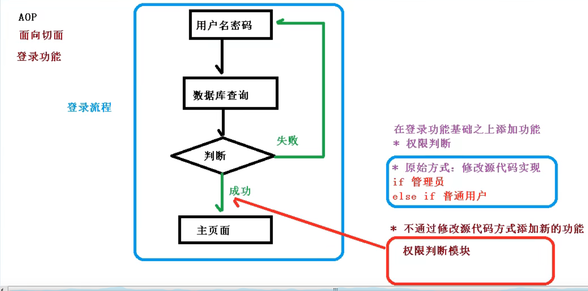
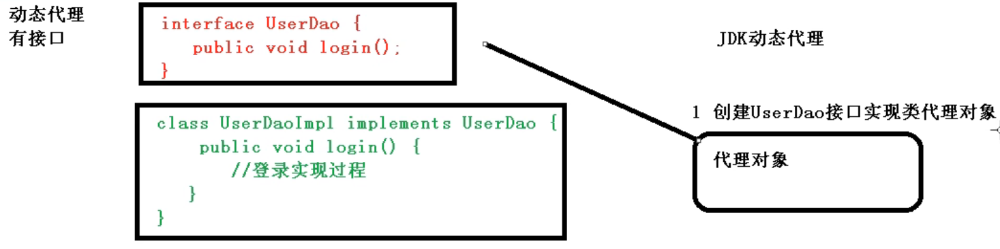
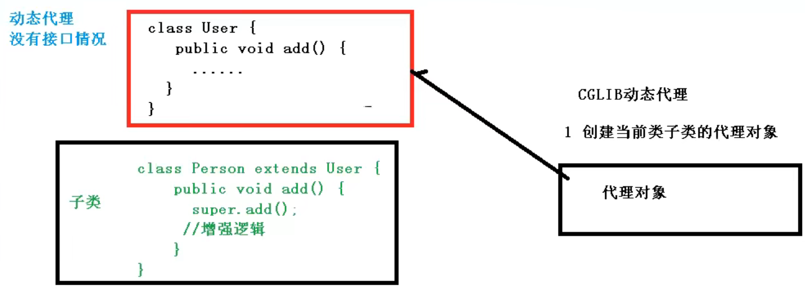
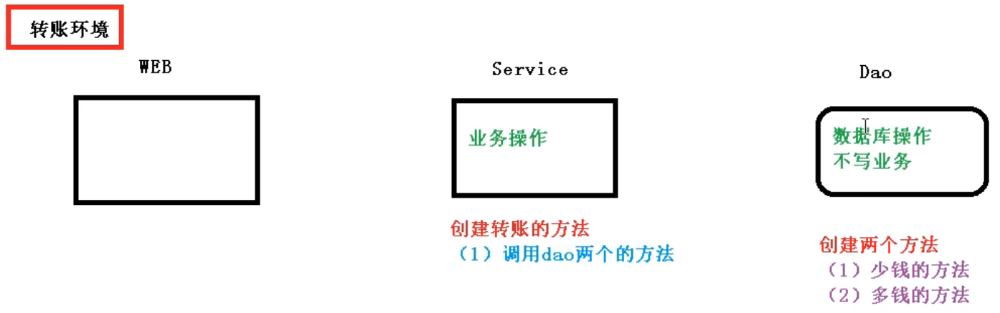
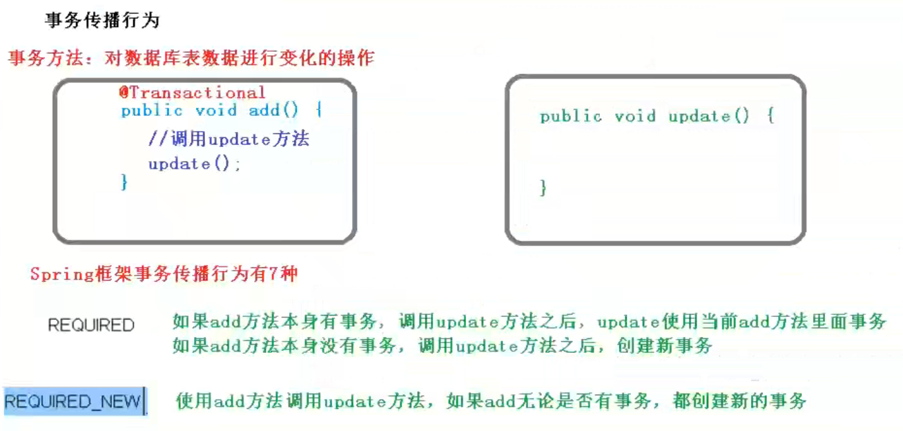
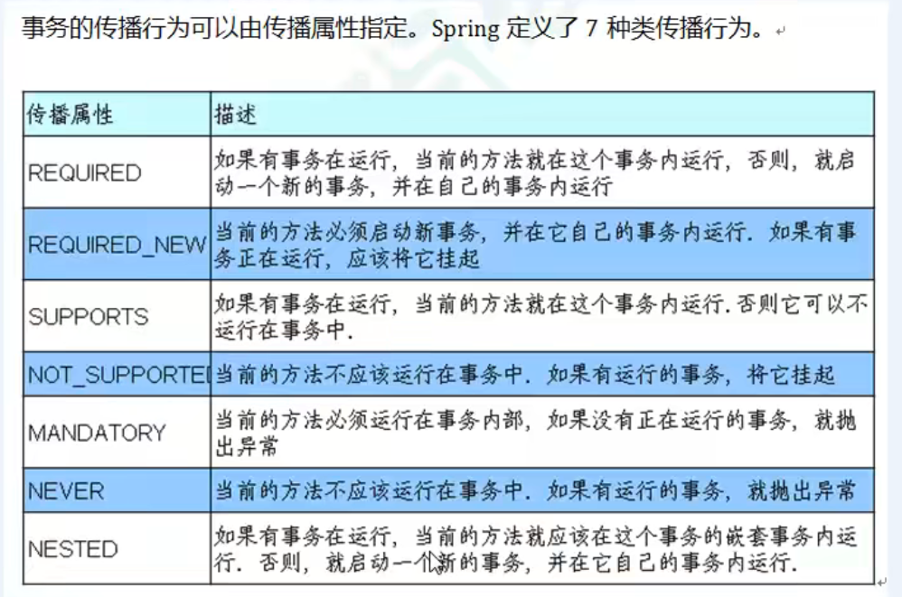
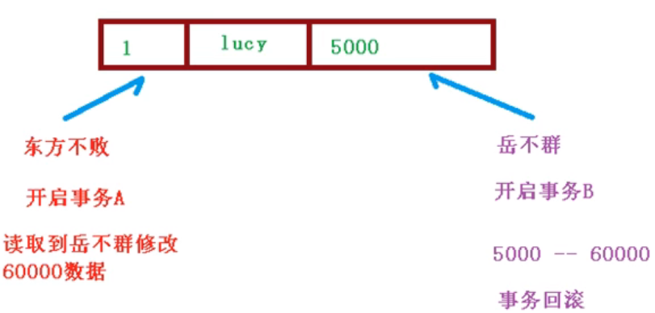
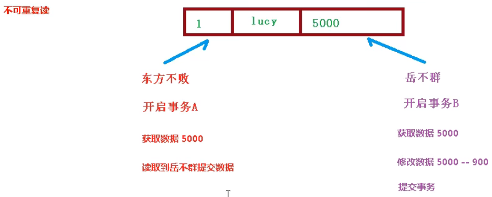
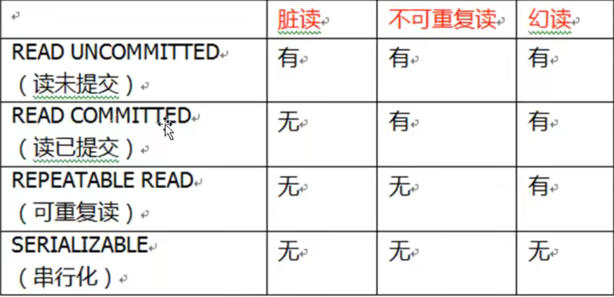

# 一、Spring框架概述

## 1. spring是轻量级的开源 JavaEE 框架

## 2. spring可以解决企业应用开发的复杂性

## 3. spring的两个核心部分：

- 1）方便解耦，简化开发
- 2）AOP编程支持
- 3）方便与其他框架进行整合
- 4）方便进行事务操作
- 5）降低API开发难度

# 二、IOC容器

## 1. 什么是IOC（控制反转）

- 1）IOC：指把对象创建和对象之间的调用过程，交给Spring进行管理
- 2）使用 IOC 的目的：降低耦合度

## 2. IOC 底层原理

- 1）xml解析

- 2）工厂模式

  > 
  >
  > ---
  >
  > 
  >
  > 工厂模式目的：尽可能降低耦合度到最低限度

- 3）反射

## 3. IOC的使用过程

- 第一步）XML配置文件，配置创建的对象

  > ```xml
  > <bean id="dao" class="com.atguigu.UserDao"></bean>
  > ```

- 第二步）为service类和dao类，创建工厂类

  > ```java
  > class UserFactory {
  > ​	public static UserDao getDao() {
  > ​		//1、xml解析
  > ​		String classValue = class属性值;
  > ​		//2、通过反射创建对象
  > ​		Class clazz = Class.forName(classValue);
  > 		return (UserDao) clazz.newInstance();
  > ​	}
  > }
  > ```

- IOC过程的目的：相较于工厂模式，更进一步降低耦合度

## 4. IOC接口

- 1）IOC思想基于IOC容器完成，IOC容器底层就是对象工厂

- 2）spring提供了实现IOC容器的两种方式（即两个接口）

  * BeanFactory（**加载配置文件时不会创建对象，在获取对象（使用）的时候才会去创建对象**）

    > IOC容器的基本实现，是spring内部的使用接口，不提供开发人员使用

  * ApplicationContext（**加载配置文件的时候就会将配置文件中的对象创建**）

    > BeanFactory接口的子接口，提供了更多更强大的功能

# 三、Bean管理 XML方式

## 1. 什么是Bean管理（即两个操作方式）

- 1）spring创建对象
- 2）spring注入属性

## 2. Bean管理操作的两种实现方式

- 1）基于xml配置文件的方式实现**创建对象**

  > ```xml
  > <bean id="user" class="com.atguigu.spring5.User" />
  > ```

- 2）基于注解的方式实现**注入属性，即依赖注入**

  > 原始方式：
  >
  > ```java
  > public class Book {
  >     private final String bookName;
  >     
  >     public Book(){};
  >     
  >     public Book(String bookName) {
  >         this.bookName = bookName;
  >     }
  >     
  >     public void setBookName(String bookName) {
  >         this.bookName = bookName;
  >     }
  >     
  >     public void printf() {
  >         System.out.println("bookName = " + bookName);
  >     }
  >     
  >     public static void main(String[] args) {
  >         //有参构造器注入
  >         Book book1 = new Book("Java核心技术卷");
  >         
  >         //setName()方法注入
  >         Book book2 = new Book();
  >         book2.setBookName("Java核心技术卷");
  >     }
  > }
  > ```
  >
  > ---
  >
  > spring配置属性注入
  >
  > ```xml
  > <!--set方法的属性注入-->
  > <!--1、配置对象-->
  > <bean id="book" class="com.atguigu.spring5.Book">
  > 	<!--2、使用property完成属性注入-->
  >     <property name="bookName" value="Java核心技术卷"></property>
  > </bean>
  > 
  > <!--有参构造器的属性注入-->
  > <!--1、配置对象-->
  > <bean id="book1" class="com.atguigu.spring5.Book">
  >     <!--2、使用constructor完成属性注入-->
  > 	<constructor name="bookName" value="编译原理"></constructor>
  > </bean>
  > ```
  >
  > ```java
  > //set方法的属性注入
  > @Test
  > public void test1() {
  >     //1、加载spring配置文件
  >     ApplicationContext context = new ClassPathXmlApplicationContext("bean1.xml");
  >     //2、获取配置创建的对象
  >     Book book = context.getBean("book", Book.class);
  >     
  >     System.out.println(book);
  >     book.printf();
  > }
  > 
  > //有参构造器的属性注入
  > @Test
  > public void test2() {
  >     //1、加载spring配置文件
  >     ApplicationContext context = new ClassPathXmlApplicationContext("bean1.xml");
  >     //2、获取配置创建的对象
  >     Book book1 = context.getBean("book1", Book.class);
  >     
  >     System.out.println(book1);
  >     book1.printf();
  > }
  > ```

- 3)xml注入其他类型的属性

  > ```java
  > public class Book {
  >     private String bookName;
  >     private String author;
  >     
  >     public void setBookName(String bookName) {
  >         this.bookName = bookName;
  >     }
  >     public void setAuthor(String author) {
  >         this.author = author;
  >     }
  >     
  >     public void printf() {
  >         System.out.println("《" + bookName "》的作者是" + author + "。");
  >     }
  > }
  > ```
  >
  > ```xml
  > <!--给属性注入空值-->
  > <bean id="book" class="com.atguigu.spring5.Book">
  > 	<property name="bookName" value="山海经"></property>
  >     <property name="author">
  >         <null />
  >     </property>
  > </bean>
  > 
  > <!--
  > 	给属性注入特殊符号
  > 		1、对特殊符号进行转义
  > 		2、将特殊符号写到 CDATA 中
  > -->
  > <bean id="book1" class="com.atguigu.spring5.Book">
  > 	<property name="bookName" value="<<山海经>>"></property>
  >     <property name="author"><null/></property>
  > </bean>
  > 
  > <bean id="book2" class="com.atguigu.spring5.Book">
  >     <property name="bookName" value="&lt;&gt;山海经&lt;&gt;"></property>
  >     <property name="author"><null/></property>
  > </bean>
  > 
  > <bean id="book3" class="com.atguigu.spring5.Book">
  > 	<property name="bookName">
  >         <value><![CDATA[<<山海经>>]]></value>
  >     </property>
  >     <property name="author"><null/></property>
  > </bean>
  > ```
  >
  
- 4）xml注入外部 bean

  > ```java
  > public class UserService {
  >     //spring中调用 UserDaoImpl 的方法
  >     //1、创建 UserDao 属性，生成 set() 方法
  >     private UserDao userDao;
  >     public void setUserDao(UserDao userDao) {
  >         this.userDao = userDao;
  >     }
  > 
  >     //2、调用方法
  >     public void test() {
  >         System.out.println("UserService");
  >         userDao.userDao();
  >     }
  > }
  > ```
  >
  > ```xml
  > <!--1、创建 UserService 和 UserDao 对象-->
  > <bean id="userService" class="service.BookService">
  >     <!--2、注入userDao对象-->
  >     <property name="userDao" ref="userDaoImpl"/>
  > </bean>
  > <bean id="userDaoImpl" class="dao.Impl.UserDaoImpl" />
  > ```
  >
  > ```java
  > @Test
  > public void test() {
  >     //1、加载 Spring 配置文件
  >     ApplicationContext context = new ClassPathXmlApplicationContext("../../main/resources/beanTest1.xml");
  >     //2、获取配置文件中的对象
  >     UserService userService = context.getBean("userService", UserService.class);
  >     //3、调用方法
  >     userService.test();
  > }
  > ```

- 5）内部 bean 和级联赋值

  > ```java
  > public class Employee {
  >     private String name;
  >     private String gender;
  >     private Dept dept;
  > 
  >     public void setName(String name) {
  >         this.name = name;
  >     }
  > 
  >     public void setGender(String gender) {
  >         this.gender = gender;
  >     }
  > 
  >     public Dept getDept() {
  >         return dept;
  >     }
  > 
  >     public void setDept(Dept dept) {
  >         this.dept = dept;
  >     }
  > 
  >     @Override
  >     public String toString() {
  >         return "Employee{" +
  >                 "name='" + name + '\'' +
  >                 ", gender='" + gender + '\'' +
  >                 ", dept=" + dept +
  >                 '}';
  >     }
  > }
  > ```
  >
  > ```java
  > public class Dept {
  >     private String deptName;
  > 
  >     public void setDeptName(String deptName) {
  >         this.deptName = deptName;
  >     }
  > }
  > ```
  >
  > ```xml
  > <!--级联赋值-->
  > <bean id="employee" class="pojo.Employee">
  >     <!--设置普通属性-->
  >     <property name="name" value="lucy"/>
  >     <property name="gender" value="woman"/>
  > 
  >     <!--为特殊属性级联赋值-->
  >     <property name="dept" ref="dept"/>
  >     <property name="dept.deptName" value="技术部"/>
  > </bean>
  > <bean id="dept" class="pojo.Dept">
  >     <property name="deptName" value="财务部"/>
  > </bean>
  > ```
  >
  > ```java
  > @Test
  > public void test1() {
  >     //1、加载 Spring 配置文件
  >     ApplicationContext context = new ClassPathXmlApplicationContext("../../main/resources/beanTest1.xml");
  >     //2、获取配置文件中的对象
  >     Employee employee = context.getBean("employee", Employee.class);
  >     //3、调用方法
  >     System.out.println(employee);
  > }
  > ```

- 6)xml注入集合属性

  > ```java
  > public class Student {
  >     //数组类型属性
  >     private String[] courses;
  >     //List 集合类型属性
  >     private List<String> list;
  >     //Map 集合类型属性
  >     private Map<String, Object> map;
  > 
  >     public void setCourses(String[] courses) {
  >         this.courses = courses;
  >     }
  > 
  >     public void setList(List<String> list) {
  >         this.list = list;
  >     }
  > 
  >     public void setMap(Map<String, Object> map) {
  >         this.map = map;
  >     }
  > 
  >     @Override
  >     public String toString() {
  >         return "Student{" +
  >                 "courses=" + Arrays.toString(courses) +
  >                 ", list=" + list +
  >                 ", map=" + map +
  >                 '}';
  >     }
  > }
  > ```

  ---

  > 注入数组类型属性
  >
  > ```xml
  > <bean id="student" class="pojo.Student">
  >     <!--数组类型属性注入-->
  >     <property name="courses">
  >         <array>
  >             <value>数学</value>
  >             <value>英语</value>
  >             <value>语文</value>
  >             <value>物理</value>
  >             <value>生物</value>
  >             <value>化学</value>
  >             <value>历史</value>
  >             <value>政治</value>
  >             <value>地理</value>
  >             <value>体育</value>
  >         </array>
  >     </property>
  > ```
  >
  > ---
  >
  > 注入 List 集合类型属性
  >
  > ```xml
  > <!--列表类型属性注入-->
  > <property name="list">
  >     <list>
  >         <value>小明</value>
  >     </list>
  > </property>
  > ```
  >
  > ---
  >
  > 注入 Map 集合类型属性
  >
  > ```xml
  > <!--集合类型属性注入-->
  > <property name="map">
  >     <map>
  >         <entry key="数学" value="150"/>
  >         <entry key="英语" value="150"/>
  >         <entry key="语文" value="150"/>
  >         <entry key="物理" value="100"/>
  >         <entry key="生物" value="100"/>
  >         <entry key="化学" value="100"/>
  >         <entry key="历史" value="100"/>
  >         <entry key="政治" value="100"/>
  >         <entry key="地理" value="100"/>
  >         <entry key="体育" value="100"/>
  >     </map>
  > </property>
  > </bean>
  > ```
  >
  > ---
  >
  > 测试类
  >
  > ```java
  > @Test
  > public void test() {
  >     //1、加载 Spring 配置文件
  >     ApplicationContext context = new ClassPathXmlApplicationContext("../../main/resources/beanTest1.xml");
  >     //2、获取配置文件中的对象
  >     Student student = context.getBean("student", Student.class);
  >     //3、调用方法
  >     System.out.println(student);
  > }
  > ```

## 3. 工厂Bean（FactoryBean）

 - 1）概念

   - 普通Bean：在配置文件中定义的bean类型和返回的bean类型相同

   - FactoryBean：在配置文件中定义的bean类型和返回的bean类型不相同

     > **工厂Bean需实现 FactoryBean 接口**
     >
     > ```java
     > public class FactoryBean1 implements FactoryBean<Student> {
     >     @Override
     >     public Student getObject() throws Exception {
     >         Student student = new Student(null, null, null);
     >         System.out.println(student);
     >         return student;
     >     }
     > 
     >     @Override
     >     public Class<?> getObjectType() {
     >         return null;
     >     }
     > 
     >     @Override
     >     public boolean isSingleton() {
     >         return FactoryBean.super.isSingleton();
     >     }
     > }
     > ```
     >
     > ```xml
     > <!--工厂Bean-->
     > <bean id="factoryBean1" class="pojo.FactoryBean1">
     > 
     > </bean>
     > ```
     >

## 4. Bean的作用域和生命周期

 - 1）作用域

    - 在spring里，可以设置bean实例为单实例或者多实例

    - 在spring里，默认情况下bean是单实例对象

      > 

   - 设置bean的实例对象

     > 单实例对象
     >
     > > 1、单实例对象存储地址是相同的
     > >
     > > 2、单实例对象在加载*spring*配置文件时创建单实例对象
     >
     > ```xml
     > <bean id="student" class="pojo.Student" scope="singleton"/>
     > ```
     >
     > ---
     >
     > 多实例对象
     >
     > > 1、多实例对象存储地址是不同的
     > >
     > > 2、多实例对象在调用 *getBean()* 方法时
     >
     > ```xml
     > <bean id="student" class="pojo.Student" scope="prototype"/>
     > ```

- 2）生命周期

    - 通过构造器创建bean实例（无参数构造器）

    - 对bean属性赋值以及对bean的引用（通过 *setxxx()* 方法）

    - 调用bean初始化（需要对初始化方法进行配置）

    - 使用bean（获取到对象）

    - 销毁bean（需要对销毁方法进行配置）

      > ```java
      > public class Person {
      >     private String name;
      >     public Person() {
      >         System.out.println("第一步，执行无参构造创建bean实例");
      >     }
      >     public void setName(String name) {
      >         this.name = name;
      >         System.out.println("第二步，调用set方法设置属性值");
      >     }
      >     public void initMethod() {
      >         System.out.println("第三步，执行初始化的方法");
      >     }
      >     public void destroyMethod() {
      >         System.out.println("第五步，执行销毁方法");
      >     }
      > }
      > ```
      >
      > ```xml
      > <bean id="person" class="pojo.Person" init-method="initMethod" destroy-method="destroyMethod">
      >     <property name="name" value="Smith"/>
      > </bean>
      > ```
      >
      > ```java
      > public static void main(String[] args) {
      >     ClassPathXmlApplicationContext context = new ClassPathXmlApplicationContext("../../main/resources/beanTest1.xml");
      >     Person person = context.getBean("person", Person.class);
      >     System.out.println("第四步，获取bean实例对象");
      >     System.out.println(person);
      >     //手动销毁bean实例
      >     context.close();
      > }
      > ```

## 5. xml自动装配

- 1）概念：

  > 根据指定装配规则（属性名称或属性类型），spring自动将匹配的属性值进行注入。

- 2）代码演示

  > ```java
  > public class Employee1 {
  >     private Dept1 dept1;
  > 
  >     public void setDept1(Dept1 dept1) {
  >         this.dept1 = dept1;
  >     }
  >     public void printf() {
  >         System.out.println(dept1);
  >     }
  >     @Override
  >     public String toString() {
  >         return "Employee1{" +
  >                 "dept1=" + dept1 +
  >                 '}';
  >     }
  > }
  > 
  > public class Dept1 {
  >     @Override
  >     public String toString() {
  >         return "Dept1{}";
  >     }
  > }
  > ```
  >
  > ```xml
  > <!--
  >     autowire常用属性：byName、byType
  >         byName：根据属性名称注入，注入值bean的id值要和类属性名称一致
  >         byType：根据属性类型注入
  >     -->
  > <bean id="employee1" class="pojo.Employee1" autowire="byName">
  >     <!--<property name="dept1" ref="dept1"/>-->
  > </bean>
  > <bean id="dept1" class="pojo.Dept1">
  > </bean>
  > ```
  >
  > ```java
  > public static void main(String[] args) {
  >     ClassPathXmlApplicationContext context = new ClassPathXmlApplicationContext("../../main/resources/beanTest.xml");
  >     Employee1 employee1 = context.getBean("employee1", Employee1.class);
  >     System.out.println(employee1);
  > }
  > ```

## 6. xml通过外部属性文件注入

- 1）直接配置数据库信息（**druid**）

  > ```xml
  > <!--直接配置连接池-->
  > <bean id="dataSource" class="com.alibaba.druid.pool.DruidDataSource">
  >     <property name="driverClassName" value="com.mysql.jdbc.Driver" />
  >     <property name="url" value="jdbc:mysql://localhost:8080/master" />
  >     <property name="username" value="root" />
  >     <property name="password" value="123abc" />
  > </bean>
  > ```

- 2）引入外部属性文件配置数据库连接池

  > ```xml
  > <?xml version="1.0" encoding="UTF-8"?>
  > <beans xmlns="http://www.springframework.org/schema/beans"
  >        xmlns:xsi="http://www.w3.org/2001/XMLSchema-instance"
  >        xmlns:util="http://www.springframework.org/schema/util"
  >        xmlns:context="http://www.springframework.org/schema/context"
  >        xsi:schemaLocation="http://www.springframework.org/schema/beans https://www.springframework.org/schema/beans/spring-beans.xsd
  >                            http://www.springframework.org/schema/util https://www.springframework.org/schema/util/spring-util.xsd
  >                            http://www.springframework.org/schema/context https://www.springframework.org/schema/context/spring-context.xsd" >
  > 
  >     <!--直接配置连接池-->
  > <!--    <bean id="dataSource" class="com.alibaba.druid.pool.DruidDataSource">
  >         <property name="driverClassName" value="com.mysql.jdbc.Driver" />
  >         <property name="url" value="jdbc:mysql://localhost:8080/master" />
  >         <property name="username" value="root" />
  >         <property name="password" value="123abc" />
  >     </bean>-->
  > 
  >     <!--引入外部属性文件-->
  >     <context:property-placeholder location="jdbc.properties" />
  >     <bean id="dataSource" class="com.alibaba.druid.pool.DruidDataSource">
  >         <property name="driverClassName" value="${prop.driverClassName}" />
  >         <property name="url" value="${prop.url}" />
  >         <property name="username" value="${prop.username}" />
  >         <property name="password" value="${prop.password}" />
  >     </bean>
  > </beans>
  > ```
  >
  > jdbc.properties配置文件
  >
  > ```properties
  > prop.driverClassName=com.mysql.jdbc.Driver
  > prop.url=jdbc:mysql://localhost:8080/master
  > prop.username=root
  > prop.password=123abc
  > ```

# 四、Bean管理 注解方式

## 1. spring为创建对象提供的注解

- 1）@Component

- 2）@Service

- 3）@Controller

- 4）@Repository

  **以上四个注解功能一样，都可以用来创建bean实例**

## 2. 基于注解创建对象的步骤

- 1）引入依赖

  > 

- 2）开启组件扫描

  > ```xml
  > <beans xmlns="http://www.springframework.org/schema/beans"
  >        xmlns:xsi="http://www.w3.org/2001/XMLSchema-instance"
  >        xmlns:context="http://www.springframework.org/schema/context"
  >        xsi:schemaLocation="http://www.springframework.org/schema/beans https://www.springframework.org/schema/beans/spring-beans.xsd
  >                            http://www.springframework.org/schema/context https://www.springframework.org/schema/context/spring-context.xsd">
  > 
  >     <!--开启组件扫描-->
  >     <context:component-scan base-package="java"/>
  > </beans>
  > ```

- 3）创建类，在类上面添加对象注解

  > ```java
  >  /**
  >   * 在注解里面value属性值可以省略不写。
  >   * 默认值是类名称，首字母小写
  >   */
  > @Component(value="bookService")
  > public class BookService {
  >     public void method() {
  >         System.out.println("这里是BookService类");
  >     }
  > }
  > ```
  >
  > Test测试类
  >
  > ```java
  > public static void main(String[] args) {
  >     ApplicationContext context = new ClassPathXmlApplicationContext("../../main/resources/beanTest1.xml");
  >     BookService bookService = context.getBean("bookService", BookService.class);
  > 
  >     bookService.method();
  > }
  > ```
  >
  > ---
  >
  > *另外还有*
  >
  > ```xml
  > <!--
  >         示例1
  >         use-default-filters="false" -> 表示由用户自己配置 filters
  >         context:include-filter -> 设置扫描注解中配置了 Controller 的文件
  >     -->
  > <context:component-scan base-package="java" use-default-filters="false">
  >     <context:include-filter type="annotation" expression="org.springframework.stereotype.Controller"/>
  > </context:component-scan>
  > 
  > <!--
  >         示例2
  >         context:include-filter -> 设置不扫描注解中配置了 Controller 的文件
  >     -->
  > <context:component-scan base-package="java">
  >     <context:exclude-filter type="annotation" expression="org.springframework.stereotype.Controller"/>
  > </context:component-scan>
  > ```

## 3. 注解实现属性注入

- 1）实现属性注入的常见注解分类：

  - @AutoWired

    > 根据属性类型进行注入
    >
    > 
    >
    > 第一步：把service和dao对象创建，在service和dao类添加创建对象注解
    >
    > ```java
    > @Service
    > public class BookDaoImpl implements BookDao {
    >     @Override
    >     public void method() {
    >         System.out.println("这里是 BookDao 的实现类");
    >     }
    > }
    > ```
    >
    > ```java
    > @Repository
    > public class BookService {
    >     public void method() {
    >         System.out.println("这里是BookService类");
    >     }
    > }
    > ```
    >
    > 第二步：在service注入dao对象，在service类添加dao类型属性，在属性上面使用注解
    >
    > ```java
    > @Repository
    > public class BookService {
    >     //定义dao类型属性
    >     //**不需要添加set方法
    >     //添加属性注解
    >     @Autowired
    >     BookDao bookDao;
    > 
    >     public void method() {
    >         bookDao.method();
    >         System.out.println("这里是BookService类");
    >     }
    > }
    > ```

  - @Qualifier（**和 *@AutoWired* 一起使用**）

    > 根据名称进行注入
    >
    > 
    >
    > ```java
    > @Repository(value = "bookDaoImpl1")
    > public class BookDaoImpl implements BookDao {
    >     @Override
    >     public void method() {
    >         System.out.println("这里是 BookDao 的实现类");
    >     }
    > }
    > ```
    >
    > ```java
    > @Repository
    > public class BookService {
    >     //定义dao类型属性
    >     //**不需要添加set方法
    >     @Autowired                          //根据属性进行注入
    >     @Qualifier(value = "bookDaoImpl1")  //根据名称进行注入
    >     private BookDao bookDao;
    > 
    >     public void method() {
    >         bookDao.method();
    >         System.out.println("这里是BookService类");
    >     }
    > }
    > ```

  - @Resource（**这个注解是在 *javax* 扩展里的，不建议使用**）

    > 可以根据类型注入，也可以根据名称注入
    >
    > 
    >
    > ```java
    > //    @Resource                       //默认根据类型进行注入
    >     @Resource(name = "bookDaoImpl1")  //根据名称进行注入
    >     BookDao bookDao;
    >     
    >     public void method() {
    >         bookDao.method();
    >         System.out.println("这里是BookService类");
    >     }
    > ```

  - @Value

    > 注入普通类型属性
    >
    > 
    >
    > ```java
    > @Value(value = "《三体》")
    > private String name;
    > ```

- 2)纯注解开发

  - 第一步：创建配置类，代替xml配置文件

    > ```java
    > //作为配置类，替代xml配置文件
    > @Configuration
    > @ComponentScan(basePackages = {"java"})
    > public class SpringConfig {
    > }
    > ```

  - 第二步：编写测试类（**有一点点不同**）

    > ```java
    > public static void main(String[] args) {
    >     ApplicationContext context = new AnnotationConfigApplicationContext(SpringConfig.class);
    >     BookService bookService = context.getBean("bookService", BookService.class);
    > 
    >     bookService.method();
    > }
    > ```

# 五、AOP切面

## 1. 什么是AOP（面向切面）

- 1）面向切面（或方面）编程，是利用 AOP 可以对业务逻辑的各个部分进行隔离，从而使得业务逻辑各部分之间的**耦合度**降低，提高程序的可重用性，同时也提高了开发的效率。

- 2）面向切面就是在不改变源代码的基础上，对方法进行增强（或扩展）的这个过程。

- 3）图示：

  > 

## 2. AOP底层原理

- 1）AOP底层使用了动态代理，而且分为两种情况

  - 第一种有接口情况，使用 JDK 动态代理

    > **创建接口实现类代理对象，增强类的方法**
    >
    > 
    >
    > 

  - 第二种没有接口情况，使用 CGLIB动态代理

    > **创建子类的代理对象，增强类的方法**
    >
    > 

- 2)JDK动态代理的代码演示（使用JDK动态代理，通过 *Proxy* 类里面的方法创建代理对象）

  > 第一步：创建接口，定义方法
  >
  > ```java
  > public interface Temp {
  >     int add(int a, int b);
  >     String update(String id);
  > }
  > ```
  >
  > 第二步：创建接口实现类，实现方法
  >
  > ```java
  > public class TempImpl implements Temp {
  >     @Override
  >     public int add(int a, int b) {
  >         return a + b;
  >     }
  > 
  >     @Override
  >     public String update(String id) {
  >         return id;
  >     }
  > }
  > ```
  >
  > 第三步：使用Proxy类创建接口代理对象
  >
  > ```java
  > public class JDKProxy {
  >     public static void main(String[] args) {
  >         //创建接口实现类的代理对象
  >         Class[] interfaces = {Temp.class};
  > 
  >         //temp：代理类的对象
  >         Temp temp = (Temp) Proxy.newProxyInstance(JDKProxy.class.getClassLoader(), interfaces, new TempDaoProxy(new Templmpl()));
  >         System.out.println(temp.add(2, 3));
  >     }
  > }
  > 
  > //创建代理对象代码
  > class TempDaoProxy implements InvocationHandler {
  >     private Object obj; //需要使用被代理类的对象进行赋值
  >     public TempDaoProxy(Object obj) {
  >         this.obj = obj;
  >     }
  > 
  >     //当我们通过代理类的对象，调用方法 a 时，就会自动调用如下的方法：invoke()
  >     //将被代理类要执行的方法 a 的功能就声明在 invoke() 中
  >     @Override
  >     public Object invoke(Object service, Method method, Object[] args) throws Throwable {
  >         System.out.println("前面加的额外的方法 -> " + method.getName() + "，传递的参数 -> " + Arrays.toString(args));
  > 
  >         //method；即为代理类对象调用的方法，此方法也就作为了被代理类对象要调用的方法
  >         //obj：被代理类的对象
  >         Object invoke = method.invoke(obj, args);
  > 
  >         System.out.println("后面加的额外的方法 -> " + obj);
  >         return invoke;
  >     }
  > }
  > ```

## 3. AOP专业术语

- 1）连接点

  > 类里面**可以**被增强的方法，这些方法就称为连接点

- 2）切入点

  > **实际**被真正增强的方法，称为切入点

- 3）通知（增强）

  > - 实际增强的**逻辑部分**称为通知（增强）
  >
  > - 通知有多种类型
  >
  >   > - 前置通知
  >   > - 后置通知
  >   > - 环绕通知
  >   > - 异常通知
  >   > - 最终通知（官方：返回通知）

- 4）切面

  > **是一种操作过程**，指把通知应用到切入点的过程叫做切面

## 4. AspectJ的准备

- 1）spring框架一般都是基于 *AspectJ* 来实现AOP操作
- 2）*AspectJ* 是一个单独的AOP框架，但是通常会和spring框架一起使用，以实现AOP操作
- 3）基于 *AspectJ* 实现AOP操作的方式：
  - 第一，基于XML配置文件
  - 第二，基于注解

- 4）切入表达式

  - 作用：指出对哪个类里面的什么方法进行增强

  - 语法：execution( 访问修饰符 返回值 包名.包名.包名...类名.方法名(参数列表) )

    > 例1：对 *com.atguigu.dao.BookDao* 类的 *add()* 进行增强
    >
    > > execution(* com.atguigu.dao.BookDao.add(..))
    >
    > 例2：对 *com.atguigu.dao.BookDao* 类里的所有方法进行增强
    >
    > > execution(* com.atguigu.dao.BookDao.*(..))
    >
    > 例3：对 *com.atguigu.dao* 包里的所有类和所有方法进行增强
    >
    > > execution(* com.atguigu.dao.*.*(..))

  - 注意：

    - **访问修饰符可以省略**
    - **返回值可以使用通配符，表示任意返回值**

## 5.使用AspectJ实现AOP操作

- 1）AspectJ注解

  > xml配置文件
  >
  > ```xml
  > <beans xmlns="http://www.springframework.org/schema/beans"
  >        xmlns:xsi="http://www.w3.org/2001/XMLSchema-instance"
  >        xmlns:context="http://www.springframework.org/schema/context"
  >        xmlns:aop="http://www.springframework.org/schema/aop"
  >        xsi:schemaLocation="http://www.springframework.org/schema/beans http://www.springframework.org/schema/beans/spring-beans.xsd
  >                            http://www.springframework.org/schema/context http://www.springframework.org/schema/context/spring-context.xsd
  >                            http://www.springframework.org/schema/aop http://www.springframework.org/schema/aop/spring-aop.xsd">
  >     <!--开启注解扫描-->
  >     <context:component-scan base-package="Dao" />
  > 
  >     <!--启动Aspect以生成代理对象-->
  >     <aop:aspectj-autoproxy />
  > </beans>
  > ```
  >
  > 被增强类
  >
  > ```java
  > /**
  >  * Created by MrLi on 2022/02/13/13:42
  >  *
  >  * 被增强类
  >  */
  > @Component
  > public class Clothes {
  >     public void clothesFactory() {
  >         System.out.println("衣服工厂生产衣服");
  >     }
  > }
  > ```
  >
  > 增强类
  >
  > ```java
  > /**
  >  * Created by MrLi on 2022/02/13/13:43
  >  *
  >  * 增强类
  >  */
  > @Component
  > @Aspect     //表明生成代理对象
  > public class ClothesProxy {
  >     //将以下方法配置为前置通知：@Before
  >     @Before(value = "execution(* Dao.Clothes.clothesFactory(..))")
  >     public void before() {
  >         System.out.println("在衣服工厂生产衣服之前的一些操作");
  >     }
  > }
  > ```

- 2）相同切入点抽取

  > ```java
  > @Component
  > @Aspect     //表明生成代理对象
  > public class ClothesProxy {
  >     //相同的切入点抽取：@Pointcut
  >     @Pointcut(value = "execution(* Dao.Clothes.clothesFactory(..))")
  >     public void point() {}
  > 
  >     //将以下方法配置为前置通知：@Before
  >     @Before(value = "point()")
  >     public void before() {
  >         System.out.println("在衣服工厂生产衣服之前的一些操作");
  >     }
  > 
  >     //将以下方法配置为后置通知：@AfterReturning
  >     @AfterReturning(value = "point()")
  >     public void afterReturning() {
  >         System.out.println("在衣服工厂生产衣服之前的一些操作");
  >     }
  > }
  > ```

- 3)当有多个增强类对同一个方法进行增强时，设置增强类的优先级

  > @Order(数字类型的值)：数值类型的值从 0 开始，其值越小优先级越高
  >
  > ```java
  > @Order(1)
  > public class ClothesProxyTwo {
  >     …………
  > }
  > ```
  >
  > 

- 4）AspectJ配置文件（略）

# 六、JdbcTemplate（略）

# 七、事务

## 1. 概念

- 1）事务是数据库操作的最基本单元，逻辑上的一组操作。要么都成功，如果有一个操作失败所有操作就都失败。

- 2）事务的四个特性（ACID）

  - 原子性

    > 过程不可分割。操作要么成功，要么有一个失败就都失败

  - 一致性

    > 事务提交前后的数据完整性和状态保持一致

  - 隔离性

    > 进行多事务操作时，各个事务不会相互影响

  - 持久性

    > 事务提交后数据一定会发生相应的改变

## 2. spring的事务管理介绍

- 1）事务添加到 JavaEE 三层结构里的 Service 层（业务逻辑层）

- 2）在spring进行事务管理操作有两种方式：

  - 编程式事务管理（不推荐）
  - 声明式事务管理（推荐）

- 3）声明式事务管理有两种实现方式：

  - 第一种：基于注解方式（常用）
  - 第二种：基于xml配置文件方式（不常用）

- 4）在spring进行使用的声明式事务管理，其底层原理是**AOP原理**

- 5）spring为事务管理操作提供的API：**PlatformTransactionManager**

  > 其代表事务管理器，且针对不同的框架提供了不同的实现类

## 3. 搭建事务操作环境

- 1）典例：银行转账

  > - Lucy转账100元给Mary
  > - Lucy少100元，Mary多100元

- 2）图示：

  > 

- 3）代码：

  > 第一步，创建数据库表，添加记录
  >
  > ```sql
  > create database springAffairs
  > use springAffairs
  > 
  > create table `s_user`(
  >     id int primary key auto_increment,
  >     username varchar(20),
  >     money decimal(20, 2)
  > )
  > 
  > insert into `s_user`(`username`, `money`) VALUES('Lucy', 1000);
  > insert into `s_user`(`username`, `money`) VALUES('Mary', 1000);
  > 
  > select * from `s_user`
  > ```
  >
  > 第二步，在service中注入到dao，在dao中注入JdbcTemplate，在JdbcTemplate中注入DataSource
  >
  > ```xml
  > xmlns:context="http://www.springframework.org/schema/context"
  > xmlns:aop="http://www.springframework.org/schema/aop"
  > xsi:schemaLocation="http://www.springframework.org/schema/beans http://www.springframework.org/schema/beans/spring-beans.xsd
  > http://www.springframework.org/schema/context http://www.springframework.org/schema/context/spring-context.xsd
  > http://www.springframework.org/schema/aop http://www.springframework.org/schema/aop/spring-aop.xsd">
  > 
  > <!--开启组件扫描-->
  > <context:component-scan base-package="Dao" />
  > 
  > <!--数据库连接池-->
  > <bean id="dataSource" class="com.alibaba.druid.pool.DruidDataSource" destroy-method="close">
  >     <property name="url" value="jdbc:mysql:///springAffairs" />
  >     <property name="username" value="root" />
  >     <property name="password" value="123abc" />
  >     <property name="driverClassName" value="com.sql.jdbc.Driver" />
  > </bean>
  > 
  > <!--JdbcTemplate对象-->
  > <bean id="jdbcTemplate" class="org.springframework.jdbc.core.JdbcTemplate">
  >     <property name="dataSource" value="dataSource" />
  > </bean>
  > ```
  >
  > ```java
  > @Service
  > public class AffairsUserService {
  >     @Autowired
  >     private AffairsUserDao userDao;
  > }
  > ```
  >
  > ```java
  > @Repository
  > public class AffairsUserDaoImpl implements AffairsUserDao {
  >     @Autowired
  >     private JdbcTemplate jdbcTemplate;
  > }
  > ```
  >
  > 第三步，在dao中创建两个方法：多钱和少钱；在service中创建方法：转账
  >
  > ```java
  > @Repository
  > public class AffairsUserDaoImpl implements AffairsUserDao {
  >     @Autowired
  >     private JdbcTemplate jdbcTemplate;
  > 
  >     @Override
  >     public void addMoney(String username, BigDecimal money) {
  >         String sql = "update `s_user` set `money`=`money`+? where username=?";
  >         jdbcTemplate.update(sql, money, username);
  >     }
  > 
  >     @Override
  >     public void reduceMoney(String username, BigDecimal money) {
  >         String sql = "update `s_user` set `money`=`money`-? where username=?";
  >         jdbcTemplate.update(sql, money, username);
  >     }
  > }
  > ```
  >
  > ```java
  > @Service
  > public class AffairsUserService {
  >     @Autowired
  >     private AffairsUserDao userDao;
  > 
  >     //转账
  >     public void accountMoney() {
  >         //lucy少100
  >         userDao.reduceMoney("Lucy", new BigDecimal(100));
  >         //mary多100
  >         userDao.addMoney("Mary", new BigDecimal(100));
  >     }
  > }
  > ```
  >
  > 第四步，制造异常情况
  >
  > ```java
  > //lucy少100
  > userDao.reduceMoney("Lucy", new BigDecimal(100));
  > 
  > //异常情况
  > System.out.println(3/0);
  > 
  > //mary多100
  > userDao.addMoney("Mary", new BigDecimal(100));
  > ```

## 4. 使用事务解决异常情况

- 1）基于注解

  > 第一步：在spring配置文件中配置事务管理器
  >
  > ```xml
  > <!--创建事务管理器-->
  > <bean id="transactionManager" class="org.springframework.jdbc.datasource.DataSourceTransactionManager">
  >     <!--注入数据源-->
  >     <property name="dataSource" ref="dataSource" />
  > </bean>
  > ```
  >
  > 第二步：在spring配置文件中开启事务注解
  >
  > ```xml
  > <beans xmlns="http://www.springframework.org/schema/beans"
  >        xmlns:xsi="http://www.w3.org/2001/XMLSchema-instance"
  >        xmlns:context="http://www.springframework.org/schema/context"
  >        xmlns:tx="http://www.springframework.org/schema/tx"
  >        xmlns:aop="http://www.springframework.org/schema/aop"
  >        xsi:schemaLocation="http://www.springframework.org/schema/beans http://www.springframework.org/schema/beans/spring-beans.xsd
  >                            http://www.springframework.org/schema/context http://www.springframework.org/schema/context/spring-context.xsd
  >                            http://www.springframework.org/schema/tx http://www.springframework.org/schema/tx/spring-tx.xsd
  >                            http://www.springframework.org/schema/aop http://www.springframework.org/schema/aop/spring-aop.xsd">
  > ```
  >
  > ```xml
  > <!--开启事务管理器-->
  > <tx:annotation-driven transaction-manager="transactionManager" />
  > ```
  >
  > 第三步：在 service 类上（或方法）添加事务注解
  >
  > ```java
  > @Service
  > @Transactional
  > public class AffairsUserService {
  > ```

- 3)事务操作注解 *@Transactional* 的参数

  - propagation：事务传播行为

    > - 解释：当多事务方法进行调用时，事务的管理方式叫做 *事务传播行为*
    >
    > - 代码：
    >
    >   > ```java
    >   > @Service
    >   > @Transactional(propagation = Propagation.REQUIRED)
    >   > public class AffairsUserService {
    >   > ```
    >
    > 
    >
    > 

  - isolation：事务隔离级别

    > - 解释：事务有一种特性叫做隔离性，当多事务操作时相互之间不会产生影响叫做事务隔离级别
    >
    > - 如果不考虑事务隔离性会产生三个读问题：脏读、不可重复读、虚（幻）读
    >
    >   > 脏读：一个未提交事务读取到另一个未提交事务的数据
    >   >
    >   > 
    >   >
    >   > ---
    >   >
    >   > 不可重复读：一个未提交事务读取到另一提交事务修改的数据
    >   >
    >   > 
    >   >
    >   > ---
    >   >
    >   > 幻读：一个未提交的事务读取到另一个提交事务之后添加的数据，两次读取的数据不一致
    >
    > - 事务隔离级别（Mysql默认是 *REPEATABLE_READ*）
    >
    >   > 
    >
    > - 代码：
    >
    >   > ```java
    >   > @Transactional(propagation = Propagation.REQUIRED, isolation = Isolation.REPEATABLE_READ)
    >   > public class AffairsUserService {
    >   > ```

  - timeout：超时时间

    > - 解释：事务需要在一定的时间内进行提交，如果不提交则进行回滚；超时时间的默认值是**-1**，且时间设置以**秒**为单位。
  >
    > - 代码：
  >
    >   > ```java
    >   > @Service
    >   > @Transactional(propagation = Propagation.REQUIRED, isolation = Isolation.REPEATABLE_READ, timeout = 60)
    >   > public class AffairsUserService {
    >   > ```
  
  - readOnly：是否只读
  
    > 解释：默认值是false
  
  - rollbackFor：回滚
  
    > - 解释：设置出现哪些异常的时候进行事务回滚
    >
    > - 代码：
    >
    >   > ```java
    >   > @Service
    >   > @Transactional(rollbackFor = Exception.class)
    >   > public class AffairsUserService {
    >   > ```
  
  - noRollbackFor：不回滚
  
    > - 解释：设置出现哪些异常时不进行事务回滚
    >
    > - 代码：
    >
    >   > ```java
    >   > @Service
    >   > @Transactional(noRollbackFor = Exception.class)
    >   > public class AffairsUserService {
    >   > ```

## 5. 完全注解声明式注解管理

- 代码：

  > ```java
  > @Configuration //声明为配置类
  > @ComponentScan(basePackages = "java") //开启组件扫描
  > @EnableTransactionManagement //开启事务
  > public class AffairsConfig {
  >     //创建一个数据库连接池
  >     @Bean
  >     public DruidDataSource getDruidDataSource() {
  >         DruidDataSource dataSource = new DruidDataSource();
  >         dataSource.setDriverClassName("com.sql.jdbc.Driver");
  >         dataSource.setUrl("jdbc:mysql:///springAffairs");
  >         dataSource.setUsername("root");
  >         dataSource.setPassword("123abc");
  >         return dataSource;
  >     }
  > 
  >     //创建JdbcTemplate对象
  >     @Bean
  >     public JdbcTemplate getJdbcTemplate(DataSource dataSource) {
  >         //根据类型到IOC容器中找到 dataSource 完成注入
  >         JdbcTemplate jdbcTemplate = new JdbcTemplate();
  >         //注入dataSource
  >         jdbcTemplate.setDataSource(dataSource);
  >         return jdbcTemplate;
  >     }
  > 
  >     //创建事务管理器
  >     @Bean
  >     public DataSourceTransactionManager transactionManager(DataSource dataSource) {
  >         DataSourceTransactionManager transactionManager = new DataSourceTransactionManager();
  >         transactionManager.setDataSource(dataSource);
  >         return transactionManager;
  >     }
  > }
  > ```

# 八、spring5新特性

## 1. 新特性

- 1）整个 spring5 框架的代码基于 Java8 ，运行时兼容 JDK9，许多不建议使用的类和方法在代码库中已经被删除。

- 2）spring5 框架自带了通用的日志封装。

- 3）spring5框架核心容器支持 *@Nullable* 注解

  > *@Nullable* 注解可以使用在方法、属性、参数上面，表示方法返回值或属性值或参数值可以为空

- 4）spring5核心容器支持函数式风格 *GenericApplicationContext*

  > ```java
  > //函数式风格创建对象，交给spring进行管理
  > public void testGenericApplicationContext() {
  >     //1、创建 GenericApplicationContext 对象
  >     GenericApplicationContext context = new GenericApplicationContext();
  >     //2、调用 context 的方法注册对象
  >     context.refresh(); //清空
  >     context.registerBean("user", User.class, () -> new User());
  >     //3、获取在 spring 中注册的对象
  >     User user = (User) context.getBean("user");
  >     System.out.println(user);
  > }
  > ```

- 5)spring5支持整合 *JUnit5单元测试框架*
- 6）SpringWebFlux