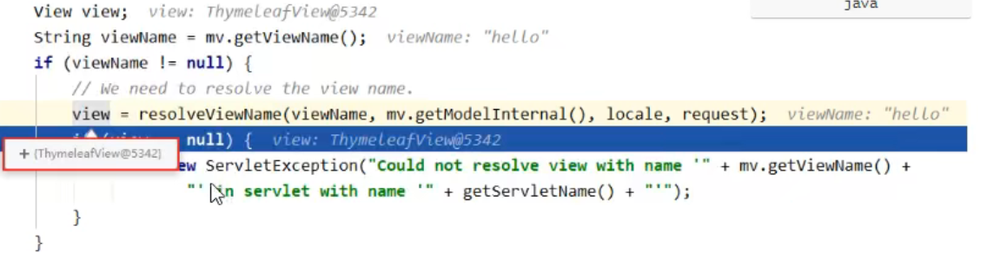
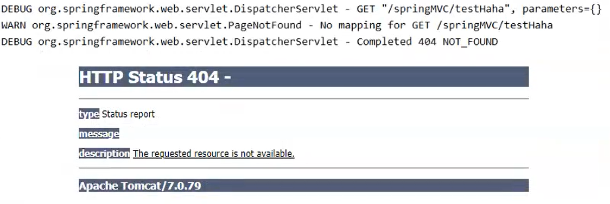
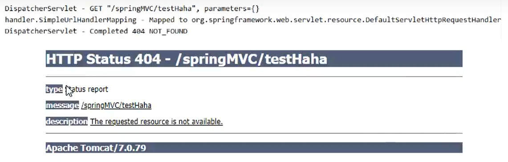

# 一、springMVC简介

## 1.什么是springMVC

- 1）springMVC 是 spring 的一个后续产品，是 spring 的一个子项目

- 2）springMVC 是 spring 为表述层开发提供的一整套完备的解决方案，在表述层框架经历了 *Strust*、*WebWork*、*Strust2* 等诸多产品的历代更迭之后，目前业界普遍选择了 springMVC 作为 JavaEE 项目表述层开发的首选方案

  > 三层架构分别是**表述层（或表示层）**、**业务逻辑层**、**数据访问层**；表述层表示前台页面和后台 servlet

## 2. springMVC的特点

- 1）**spring家族原生产品**，与IOC容器等基础设施无缝对接
- 2）**基于原生的Servlet**，通过功能强大的**前端控制器 *DispatcherServlet* **对请求和响应进行统一处理
- 3）表述层各细分领域需要解决的问题**全方位覆盖**，，提供了**全面的解决方案**
- 4）**代码清新简洁**，大幅度提升开发效率
- 5）内部组件化程度高，可插拔式组件**即插即用**，需要什么功能就配置相应的组件即可
- 6）**性能卓著**，尤其适合现代大型、超大型互联网项目要求

# 二、springMVC的HelloWorld

## 1. 配置springMVC的maven地址

> ```xml
> <dependencies>
>     <!--导入 springMVC 依赖包-->
>     <dependency>
>         <groupId>org.springframework</groupId>
>         <artifactId>spring-webmvc</artifactId>
>         <version>5.3.1</version>
>     </dependency>
> 
>     <!--日志文件-->
>     <dependency>
>         <groupId>ch.qos.logback</groupId>
>         <artifactId>logback-classic</artifactId>
>         <version>1.2.3</version>
>     </dependency>
> 
>     <!--servletAPI-->
>     <dependency>
>         <groupId>javax.servlet</groupId>
>         <artifactId>javax.servlet-api</artifactId>
>         <version>3.1.0</version>
>         <scope>provided</scope>
>     </dependency>
> 
>     <!--spring5和thymeleaf整合包-->
>     <dependency>
>         <groupId>org.thymeleaf</groupId>
>         <artifactId>thymeleaf-spring5</artifactId>
>         <version>3.0.12.RELEASE</version>
>     </dependency>
> </dependencies>
> ```

## 2. 配置 *web.xml*

- 1）默认配置方式

  在默认配置方式下。springMVC的配置文件默认位于WEB-INF下，默认名称是 *<servlet-name>-servlet.xml*，例如以下配置所对应的springMVC的配置文件位于WEB-INF下，文件名就是 *springMVC-servlet.xml*

> ```xml
> <!--配置 springMVC 的前端处理器，对浏览器发送的请求进行统一处理-->
> <servlet>
>     <servlet-name>SpringMVC</servlet-name>
>     <servlet-class>org.springframework.web.servlet.DispatcherServlet</servlet-class>
> </servlet>
> <servlet-mapping>
>     <servlet-name>SpringMVC</servlet-name>
>     <!--"/" 所匹配的请求可以是 /login 或 .html 或 .js 或 .css 方式的请求路径，
>         但是 "/" 不能匹配 .jsp 请求路径的请求
> 
> 		/* 可以匹配所有请求，例如在使用过滤器时，如果需要对所有请求进行过滤，就需要使用 /*
> 
>         .jsp需要配置专属于其本身的 servlet 程序来处理请求，
> 		所以.jsp不需要 DispatcherServlet 来处理请求-->
>     <url-pattern>/</url-pattern>
> </servlet-mapping>
> ```

- 2）配置扩展文件

  可通过 *init-param* 标签设置springMVC配置文件的位置和名称，通过 *load-on-startup* 标签设置springMVC前端控制器 *DisppatcherServlet* 的初始化时间

  > ```xml
  > <!--配置 springMVC 的前端处理器，对浏览器发送的请求进行统一处理-->
  > <servlet>
  >     <servlet-name>SpringMVC</servlet-name>
  >     <servlet-class>org.springframework.web.servlet.DispatcherServlet</servlet-class>
  > 
  >     <!--配置springMVC配置文件的位置和名称-->
  >     <init-param>
  >         <param-name>contextConfigLocation</param-name>
  >         <param-value>classpath:springMVC.xml</param-value>
  >     </init-param>
  > 
  >     <!--将springMVC的前端控制器的初始化时间提前到服务器启动时-->
  >     <load-on-startup>1</load-on-startup>
  > </servlet>
  > <servlet-mapping>
  >     <servlet-name>SpringMVC</servlet-name>
  >     <!--"/" 所匹配的请求可以是 /login 或 .html 或 .js 或 .css 方式的请求路径，
  >             但是 "/" 不能匹配 .jsp 请求路径的请求
  > 
  > 		/* 可以匹配所有请求，例如在使用过滤器时，如果需要对所有请求进行过滤，就需要使用 /*
  > 
  >          .jsp需要配置专属于其本身的 servlet 程序来处理请求，
  >          所以.jsp不需要 DispatcherServlet 来处理请求-->
  >     <url-pattern>/</url-pattern>
  > </servlet-mapping>
  > ```

## 3. 创建请求控制器

- 1）由于前端控制器对浏览器发送的请求进行了统一的处理，但是具体的请求有不同的处理过程，因此需要提供处理具体请求的类，即请求控制器

- 2）请求控制器中每一个处理请求的方法都是控制器方法

- 3）因为springMVC的控制器由一个 **POJO（普通的Java类）** 担任，因此需要通过 ***@Controller*注解** 将其标识为一个控制层组件，交予spring的IOC容器管理，此时springMVC才可以识别控制器的存在

  > ```java
  > @Controller
  > public class HelloController {
  > }
  > ```

## 4. 创建springMVC的配置文件

> ```xml
> <!--扫描组件-->
> <context:component-scan base-package="controller" />
> <!--配置Thymeleaf视图解析器-->
> <bean id="viewResolver" class="org.thymeleaf.spring5.view.ThymeleafViewResolver">
>     <property name="order" value="1" />
>     <property name="characterEncoding" value="UTF-8" />
>     <property name="templateEngine">
>         <bean class="org.thymeleaf.spring5.SpringTemplateEngine">
>             <property name="templateResolver">
>                 <bean class="org.thymeleaf.spring5.templateresolver.SpringResourceTemplateResolver">
>                     <!--视图前缀-->
>                     <property name="prefix" value="/WEB-INF/templates/" />
>                     <!--视图后缀-->
>                     <property name="suffix" value="html" />
>                     <property name="templateMode" value="HTML5" />
>                     <property name="characterEncoding" value="UTF-8" />
>                 </bean>
>             </property>
>         </bean>
>     </property>
> </bean>
> ```

## 5. 创建与运行 HelloController 程序

- 1)实现对首页的访问，在请求控制器中创建处理请求的方法

  > ```java
  > @Controller
  > public class HelloController {
  >     //@RequestMapping注解：处理请求和控制器方法之间的映射关系
  >     //@RequestMapping注解的 value 属性可以通过请求地址匹配请求
  >     //“/”表示当前工程的上下文路径：localhost:8080/springMVC/
  >     @RequestMapping("/")
  >     public String index() {
  >         //返回视图名称
  >         return "index";
  >     }
  > }
  > ```

- 2）通过超链接调转到指定的页面：在主页 index.html 中设置超链接

  > ```html
  > <!DOCTYPE html>
  > <html lang="en" xmlns:th="http://www.thymeleaf.org">
  > <head>
  >     <meta charset="UTF-8">
  >     <title>首页</title>
  > </head>
  > <body>
  > <h1 style="color: red; text-align: center">首页</h1>
  > </body>
  > </html>
  > ```
  >

## 6. 访问指定页面

> ```html
> <div style="color: red; text-align: center">
>     <h1>首页</h1>
>     <a th:href="@{/target}">访问目标页面 target.html</a>
> </div>
> ```
>
> ```html
> <div style="color: red; text-align: center">
>     <h1>Hello World!!!</h1>
> </div>
> ```
>
> ---
>
> ```java
> @RequestMapping("/target")
> public String toTarget() {
>     return "target";
> }
> ```

## 7. 总结

> 浏览器发送请求，若请求地址符合前端控制器的 *url-pattern*，该请求就会被前端控制器 *DispatcherServlet* 处理。前端控制器会读取springMVC的核心配置文件，通过扫描组件找到控制器，将请求地址和控制器中 *@RequestMapping* 注解的value属性值进行匹配。若匹配成功，该注解所标识的控制器方法就是处理请求的方法。处理请求的方法需要返回一个字符串类型的视图名称，该视图名称会被视图解析器解析，加上前缀和后缀组成视图的路径，通过 *Thymeleaf* 对视图进行渲染，最终转发到视图所对应的页面。

# 三、*@RequestMapping* 注解

## 1. *@RequestMapping* 注解的功能

- 1）从注解名称上我们可以看到，*@RequestMapping* 注解的作用就是将请求和处理请求的控制器方法关联起来，建立映射关系
- 2）springMVC接收到指定的请求，就会找到映射关系中对应的控制器方法来处理这个请求

## 2.*@RequestMapping* 注解的位置

- 1）*@RequestMapping* 注解标识一个类：设置映射请求的请求路径的初始信息
- 2）*@RequestMapping* 注解标识一个方法：设置映射请求的请求路径的具体信息

> ```html
> <div style="text-align: center; font-family: 微软雅黑,serif; color: red">
>     <h1>首页</h1>
>     <a th:href="@{/hello/requestMappingTest}">RequestMappingTest</a>
> </div>
> ```
>
> ```java
> @Controller
> @RequestMapping(value = "/hello")
> public class RequestMappingController {
>     @RequestMapping(value = "/requestMappingTest")
>     public String forwardToRequestMappingTest() {
>         return "requestMappingTest";
>     }
> }
> ```

## 3. *@RequestMapping* 注解的value属性

- 1）*@RequestMapping* 注解的value属性通过请求的请求地址匹配请求映射

- 2）*@RequestMapping* 注解的value属性是一个字符串类型的数组，表示该请求映射能够匹配多个请求地址所对应的请求

- 3）*@RequestMapping* 注解的value属性必须设置，至少通过请求地址匹配请求映射

  > ```xml
  > <div style="text-align: center; font-family: 微软雅黑,serif; color: red">
  >     <h1>首页</h1>
  >     <a th:href="@{/requestMappingTest}">RequestMappingTest</a> <br>
  >     <a th:href="@{/Test}">RequestMappingTest</a> <br>
  >     <a th:href="@{/requestMapping}">RequestMappingTest</a> <br>
  >     </div>
  > ```
  >
  > ```java
  > @RequestMapping(value = {"/requestMappingTest", "/test", "/requestMapping"})
  > public String forwardToRequestMappingTest() {
  >     return "requestMappingTest";
  > }
  > ```

## 4. *@RequestMapping* 注解的 method 属性

- 1）*@RequestMapping* 注解的 method 属性通过请求的请求方式**（POST/GET）**匹配请求映射

- 2）*@RequestMapping* 注解的 method 属性是一个 RequestMethod 类型的数组，表示该请求映射能够匹配多种请求方式的请求

- 3）若当前请求的请求地址满足请求映射的 value 属性，但是请求方式不满足 method 属性，则浏览器会报 ***405错误：Request method 'POST' not supported***

  ```html
  <div style="text-align: center; font-family: 微软雅黑,serif; color: red">
      <h1>首页</h1>
      <a th:href="@{/requestMappingTest}">RequestMappingTest</a> <br>
      <a th:href="@{/test}">test</a> <br>
      <a th:href="@{/requestMapping}">requestMapping</a> <br>
      <a th:href="@{/requestMapping}">GET</a> <br>
  
      <form th:action="@{/test}" method="post">
          <input type="submit">
      </form>
  </div>
  ```

  ```java
  @Controller
  public class RequestMappingController {
      @RequestMapping(value = {"/requestMappingTest", "/test", "/requestMapping"},
              method = {RequestMethod.GET, RequestMethod.POST})
      public String forwardToRequestMappingTest() {
          return "requestMappingTest";
      }
  }
  ```

- 4）注意：

> 1、对于处理指定请求方式的控制器方法，springMVC中提供了 *@RequestMapping* 的派生注解处理get请求的映射：***@GetMapping***；
>
> 处理post请求的映射：***@PostMapping***；
>
> 处理put请求的映射：***@PutMapping***；
>
> 处理delete请求的映射：***@DeleteMapping***
>
> 2、常用的请求方式有get、post、put、delete；
>
> 但是目前浏览器只支持get和post，若在form表单提交时，为method设置了其他请求的字符串（put或delete），则按照默认的请求方式get处理；
>
> 若要发送put和delete请求，则需要通过spring提供的过滤器 **HiddenHttpMethodFilter**

## 5. *@RequestMapping* 注解的 params 属性

- 1）*@RequestMapping* 注解的params属性通过请求的请求参数匹配请求映射

- 2）*@RequestMapping* 注解的params属性是一个字符串类型的数组，可以通过四种表达式设置请求参数和请求映射的匹配关系

- 3）“param”：要求请求映射所匹配的请求必须携带param请求参数

- 4）“!param”：要求请求映射所匹配的请求必须不能携带param请求参数

- 5）“param=value”：要求请求映射所匹配的请求必须携带param请求参数而且param=value

- 6）“param!=value”：要求请求映射所匹配的请求必须携带param请求参数但是param!=value

> 若当前请求满足 *@RequestMapping* 注解的value和method属性，但是不满足params属性，此时页面会报400错误：Parameter conditions "username,password!=123456" not met for actual request parameters:username={admin},passwrod={123456}

## 6. *@RequestMapping* 注解的 headers 属性

- 1）*@RequestMapping* 注解的headers属性通过请求的请求头信息匹配请求映射

- 2）*@RequestMapping* 注解的headers属性是一个字符串类型的数组，可以通过四种表达式设置请求头信息和请求映射的匹配关系

- 3）“header”：要求请求映射所匹配的请求必须携带header请求头信息

- 4）“!header”：要求请求映射所匹配的请求必须不能携带header请求头信息

- 5）“header=value”：要求请求映射所匹配的请求必须携带header请求头信息而且header=value

- 6）“header!=value”：要求请求映射所匹配的请求必须携带header请求头信息而且header!=value

> 若当前请求满足 *@RequestMapping* 注解的value属性和method属性，但是不满足header属性，此时页面报 *404*错误，即资源未找到。

## 7. springMVC支持ant风格的路径

- 1）?：表示任意的单个字符

- 2）*：表示任意的0个或多个字符

- 3）**：表示任意的一层或多层目录

> 注意：在使用\**时，只能使用 /**/xxx 的方式

## 8. springMVC支持路径中的占位符

- 1）原始方式：/deleteUser?id=1
- 2）rest方式：/deleteUser/1

- springMVC路径中的占位符常用于restful风格中，当请求路径中将某些数据通过路径的方式传输到服务器中，就可以相应的在 *@RequestMapping* 注解的value属性中通过占位符{xxx}表示传输的数据，再通过 *@Pathvariable*注解，将占位符所表示的数据赋值给控制器方法的形参

  ```html
  <a th:href="@{/testPath/1}">测试@RequestMapping支持路径中的占位符 --> /testPath</a> <br>
  ```

  ```java
  @RequestMapping("/testPath/{id}")
  public String testPath(@PathVariable("id")Integer id) {
      System.out.println("id = " + id);
      return "requestMappingTest";
  }
  ```

# 四、springMVC获取请求参数

## 1. 通过ServletAPI获取

```java
@RequestMapping("/servletAPI")
public String servletAPI(HttpServletRequest request) {
    String username = request.getParameter("username");
    String password = request.getParameter("password");
    System.out.println("username = " + username + ", password = " + password);

    return "requestMappingTest";
}
```

## 2. 通过控制器方法的形参获取请求参数

- 1）在控制器方法的形参位置，设置和请求参数同名的形参。当浏览器发送请求，匹配到请求映射时，在 DispatcherServlet 中就会将请求参数赋值给相应的形参

  ```html
  <a th:href="@{/servletAPI(username='admin',password='123abc')}">测试使用 servletAPI 来获取参数请求</a> <br>
  <a th:href="@{/testParam(username='admin',password='123abc')}">测试使用 控制器的形参 来获取参数请求</a> <br>
  ```

  ```java
  @RequestMapping("/testParam")
  public String testParam(String username, String password) {
      System.out.println("username = " + username + ", password = " + password);
      return "requestMappingTest";
  }
  ```

- 2）当请求中有数个同名的形参时

  ```html
  <form th:action="@{/testParams}" method="get">
      用户名：<label><input type="text" name="username"></label> <br>
      密码：<label><input type="password" name="password"></label> <br>
      爱好：<label><input type="checkbox" name="hobby" value="python">python</label>
      <label><input type="checkbox" name="hobby" value="php">php</label>
      <label><input type="checkbox" name="hobby" value="java">java</label> <br>
      <label><input type="submit" value="测试使用 控制器的形参 来获取参数请求"></label>
  </form>
  ```

  ```java
  @RequestMapping("/testParams")
  public String testParams(String username, String password, String hobby) {
      System.out.println("username = " + username + ", password = " + password + ", hobby = " + hobby);
      return "requestMappingTest";
  }
  ```

## 3. @RequestParam

- 1）@RequestParam是将请求参数和控制器方法的形参创建映射关系

- 2）@RequestParam注解一共有三个属性：

  - value：指定为形参赋值的请求参数的参数名

  - required：设置是否必须传输此请求参数，默认值为true

  > 若设置为true时，则当前请求必须传输value所指定的请求参数；若没有传输请求参数，且没有设置defaultValue属性，则页面报400错误：*Required String parameter 'xxx' is not present*；若设置为false，则当前请求不是必须传输value所指定的请求参数；若没有传输，则注解所标识的形参的值为null

  - defaultValue：不管required属性值为true还是false，当value所指定的请求参数没有传输时，则使用默认值为形参赋值

## 4. *@RequestHeader*

- 1）*@RequestHeader* 是将请求头信息和控制器方法的形参创建映射关系
- 2）*@RequestHeader* 注解一共有三个属性：value、required、defaultValue，用法和 *@RequestParam* 一样

## 5. *@CookieValue*

- 1）*@CookieValue*是将cookie数据和控制器方法的形参创建映射关系
- 2）*@CookieValue*注解一共有三个属性：value、required、defaultValue，用法同*@RequestParam*

## 6.通过POJO获取请求参数

- 可以在控制器方法的形参位置设置一个实体类类型的形参，此时若浏览器传输的请求参数的参数名和实体类中的属性名一致，那么请求参数就会为此属性赋值

  ```html
  <form th:action="@{/testBean}" method="post">
      用户名：<label><input type="text" name="username"></label> <br>
      密  码：<label><input type="password" name="password"></label> <br>
      性  别：<label><input type="radio" name="sex" value="男">男 <input type="radio" name="sex" value="女">女</label> <br>
      年  龄:<label><input type="text" name="age"></label> <br>
      邮  箱:<label><input type="text" name="email"></label> <br>
      <label><input type="submit" value="使用POJO来接受参数"></label>
  </form>
  ```

  ```java
  @RequestMapping("/testBean")
  public String testBean(User user) {
      System.out.println(user);
      return "requestMappingTest";
  }
  ```

## 7.解决post请求乱码问题

- 解决获取请求参数的乱码问题，可以使用springMVC提供的编码过滤器**CharacterEncodingFilter**，但是必须在web.xml中进行注册

  ```xml
  <!--通过filter过滤器解决tomcat post请求乱码问题-->
  <filter>
      <filter-name>CharacterEncodingFilter</filter-name>
      <filter-class>org.springframework.web.filter.CharacterEncodingFilter</filter-class>
      <init-param>
          <param-name>encoding</param-name>
          <param-value>UTF-8</param-value>
      </init-param>
      <init-param>
          <param-name>forceResponseEncoding</param-name>
          <param-value>true</param-value>
      </init-param>
  </filter>
  <filter-mapping>
      <filter-name>CharacterEncodingFilter</filter-name>
      <url-pattern>/*</url-pattern>
  </filter-mapping>
  ```

# 五、域对象共享数据

## 1.session的钝化和活化

- 钝化：当服务器关闭，但是浏览器没有关闭时，会话仍然在继续，此时session中的数据经过序列化保存到计算机磁盘上。
- 活化：当浏览器依旧没有关闭，但是服务器又重新开启，此时服务器将钝化后的文件中的内容重新读取到session中，这个过程叫做活化。

## 2.session共享数据的原理

- 只要当前JSESSIONID的cookie存在，那么当前创建的session域永远都是同一个

## 3.使用servletAPI向request域对象共享数据

```java
@RequestMapping("/testRequestByServletAPI")
public String testRequestByServletAPI(HttpServletRequest req) {
    req.setAttribute("testRequestScope", "hello, servlet!");
    return "success";
}
```

## 4.使用ModelAndView向request域对象共享数据

- 推荐使用

```java
@RequestMapping("/testModelAndView")
public ModelAndView testModelAndView() {
    ModelAndView modelAndView = new ModelAndView();
    //处理模型数据：即向请求域 Request 共享数据
    modelAndView.addObject("testRequestScope", "hello, modelAndView");
    //设置视图名称
    modelAndView.setViewName("success");
    return modelAndView;
}
```

## 5.使用Model向Request域对象共享数据

```java
@RequestMapping("/testModel")
public String testModel(Model model) {
    model.addAttribute("testRequestScope", "hello, model");
    return "success";
}
```

## 6.使用Map向Request域对象共享数据

```java
@RequestMapping("/testMap")
public String testMap(Map<String, Object> map) {
    map.put("testRequestScope", "hello, map");
    return "success";
}
```

## 7.使用ModelMap向Request域对象共享数据

```java
@RequestMapping("testModelMap")
public String testModelMap(ModelMap modelMap) {
    modelMap.addAttribute("testRequestScope", "hello, modelMap");
    return "success";
}
```

## 8.Model、ModelMap、Map的关系

- Model、ModelMap、Map类型的参数其实本质上都是 **BindingAwareModelMap** 类型实例化的

  ```java
  public interface Model(){}
  
  public class ModelMap extends LinkedHashMap<String, Object>() {}
  
  public class BindingAwareModelMap extends ExtendedModelMap() {}
  ```

## 9.向session域中共享数据

- 推荐使用servletAPI

```java
@RequestMapping("/testSession")
public String testSession(HttpSession session) {
    session.setAttribute("testRequestScope", "hello, session");
    return "success";
```

## 10.向application域中共享数据

```java
@RequestMapping("/testApplication")
public String testApplication(HttpSession session) {
    ServletContext context = session.getServletContext();
    context.setAttribute("testApplicationScope", "hello, application");
    return "success";
}
```

# 六、springMVC的视图

## 1.介绍

- 1）springMVC中的视图是view接口，视图的作用是渲染数据，将模型Model中的数据展示给用户
- 2）springMVC视图种类很多，默认有转发视图和重定向视图
- 3）当工程引入 jstl 依赖时，转发视图会自动转换为 jstlView

> 若使用的视图技术为Thymeleaf，在springMVC的配置文件中配置了Thymeleaf的视图解析器，由此视图解析器解析之后所得到的是 ThymeleafView

## 2.ThymeleafView

- 当控制器方法中所设置的视图名称没有任何前缀时，此时的视图名称会被springMVC配置文件中所配置的视图解析器解析，视图名称拼接视图前缀和试图后缀得到最终的路径，会通过转发的方式实现跳转

  ```java
  @RequestMapping("/testHello")
  public String testHello() {
      return "hello";
  }
  ```

  

## 3.转发视图

- 1）springMVC中默认的转发视图是：**InternalResourceView**

- 2）当控制器方法所设置的视图名称以“**forward:**”为前缀时，将会创建 InternalResourceView 视图，此时的视图名称不会被springMVC配置文件中所配置的视图解析器解析，而是会将前缀“**forward:**”去掉，剩余部分作为最终路径通过转发的方式实现跳转

  例如："forward:/"、"forward:/employee"

  ```java
  @RequestMapping("/testForward")
  public String testForward() {
      return "forward:/testThymeleafView";
  }
  ```

  

## 4.重定向视图

- 1）springMVC中默认的重定向视图是 **RedirectView**

- 2）当控制器方法中所设置的视图名称以“**redirect:**”为前缀时，创建RedirectView视图，此时试图名称不会被springMVC配置文件中所配置的视图解析器解析，而是会将前缀“**redirect:**”去掉，剩余部分作为最终路径通过重定向的方式实现跳转

  例如："redirect:/"，"redirect:/employee"

  ```java
  @RequestMapping("/testRedirect")
  public String testRedirect() {
      return "redirect:/testThymeleafView";
  }
  ```

> 注意：重定向视图在解析时，会先将 redirect: 前缀去掉，然后会判断剩余部分是否是以 / 开头，若是则会自动拼接上下文路径

## 5.视图控制器：view-controller

- 当控制器方法仅仅用来实现页面的跳转时，即只需要设置视图名称时，可以将处理器方法使用 **view-controller** 标签进行表达

  ```xml
  <mvc:view-controller path="/" view-name="index" />
  <!--开启MVC的注解驱动-->
  <mvc:annotation-driven />
  ```

> 注意：当spring MVC中设置任何一个 view-controller 时，其他控制器中的请求映射将会全部失效，此时就需要在springMVC的核心配置文件中设置开启mvc注解驱动的标签，即
>
> <mvc:annotation-driven />

# 七、RESTFUL

## 1.RESTFUL简介

RESTFUL：Representational State Transfer，表现层资源状态转移

- 1）资源

  资源是一种看待服务器的方式，即将服务器看作是由很多离散的资源组成。每个资源是服务器上一个可命名的抽象概念。因为资源是一个抽象概念，所以它不仅仅可以代表服务器文件系统中的一个文件、数据库中的一张表等等具体的东西，可以将资源设计的要多抽象有多抽象，只要想象力允许而且客户端应用开发者能够理解。与面对对象类似，资源是以名词为核心来组织的。首先关注的是名词，一个资源可以由一个或者多个**URL**来标识。**URL**既是资源的名称，也是资源在Web上的地址，对某个资源感兴趣的客户端应用，可以通过资源的URL与其交互。

- 2）资源的表述

  资源的表述是一段对于资源在某个特定时刻的状态的描述，即在客户端与服务器端之间的转移或交换。资源的表述有多种格式，例如 HTML、XML、JSON、纯文本、图片、音频 等等。资源的表述格式可以通过协商机制来确定。而请求-响应之间的表述通常采用不同的格式。

- 3）状态转移

  状态转移指：在客户端和服务器之间转移（**Transfer**）代表资源状态的表述，通过转移和操作资源的表述来间接实现操作资源的目的。

## 2.RESTFUL的实现

RESTFUL就是HTTP协议里面四个表示操作方式的动词：GET、POST、PUT、DELETE；

它们分别对应四种基本操作：

- 1）**GET**用来获取资源
- 2）**POST**用来新建资源
- 3）**PUT**用来更新资源
- 4）**DELETE**用来删除资源

RESTFUL风格提倡 URL 地址使用统一的风格设计，从前到后各个单词间使用斜杠分开，而不再使用问号键值对方式携带请求参数，而是要将发送给服务器的数据作为 URL 地址的一部分，以保证整体风格的一致性。

<table style="text-align:center">
    <tr><th>传统操作方式</th><th>REST操作方式</th><th>传统方式</th><th>REST风格</th></tr>
    <tr><td>查询操作</td><td>get请求</td><td>GetUserById?id=1</td><td>user/1</td></tr>
    <tr><td>保存操作</td><td>post请求</td><td>saveUser</td><td>user</td></tr>
    <tr><td>删除操作</td><td>delete请求</td><td>deleteUser?id=1</td><td>user/1</td></tr>
    <tr><td>更新操作</td><td>put请求</td><td>updateUser</td><td>user</td></tr>
</table>

get请求：查询所有用户信息

```html
<a th:href="/user">查询所有用户信息</a> <br><br>
```

```java
@RequestMapping(value = "/user", method = RequestMethod.GET)
public String queryUsers() {
    System.out.println("查询所有用户信息");
    return "success";
}
```

get请求：根据用户id查询用户信息

```html
<a th:href="/user/1">根据用户id查询用户信息</a> <br><br>
```

```java
@RequestMapping(value = "/user/{id}", method = RequestMethod.GET)
public String queryUserById() {
    System.out.println("根据用户id查询用户信息");
    return "success";
}
```

post请求：添加用户信息

```html
<form th:action="/user" method="post">
    用户名：<label><input type="text" name="username"></label> <br><br>
    密  码：<label><input type="password" name="password"></label> <br><br>
    <label><input type="submit" value="提交"></label>
</form> <br><br>
```

```java
@RequestMapping(value = "/user", method = RequestMethod.POST)
public String addUser(String username, String password) {
    System.out.println("用户名：" + username + "\n" + "密码：" + password);
    System.out.println("添加用户信息");
    return "success";
}
```

delet请求：删除用户信息

put请求：修改所有用户信息

```html
<form th:action="/user" method="post">
    <input type="hidden" name="_method" value="put">
    用户名：<label><input type="text" name="username"></label> <br><br>
    密  码：<label><input type="password" name="password"></label> <br><br>
    <label><input type="submit" value="修改"></label>
</form> <br><br>
```

```java
@RequestMapping(value = "/user", method = RequestMethod.PUT)
public String updateUser(String username, String password) {
    System.out.println("用户名：" + username + "\n" + "密码：" + password);
    System.out.println("修改用户信息");
    return "success";
}
```


# 八、RESTFUL案例

## 1.前期代码准备

bean层

```java
public class Employee {
    private Integer id;
    private String lastName;
    private String email;
    private Integer gender;

    public Employee() {
    }

    public Employee(Integer id, String lastName, String email, Integer gender) {
        this.id = id;
        this.lastName = lastName;
        this.email = email;
        this.gender = gender;
    }

    public Integer getId() {
        return id;
    }

    public void setId(Integer id) {
        this.id = id;
    }

    public String getLastName() {
        return lastName;
    }

    public void setLastName(String lastName) {
        this.lastName = lastName;
    }

    public String getEmail() {
        return email;
    }

    public void setEmail(String email) {
        this.email = email;
    }

    public Integer getGender() {
        return gender;
    }

    public void setGender(Integer gender) {
        this.gender = gender;
    }

    @Override
    public String toString() {
        return "Employee{" +
                "id=" + id +
                ", lastName='" + lastName + '\'' +
                ", email='" + email + '\'' +
                ", gender=" + gender +
                '}';
    }
}
```

dao层

```java
@Repository
public class EmployeeDao {
    private static Map<Integer, Employee> employees = null;
    private static Integer initId = 107;
    static {
        employees = new HashMap<>();
        employees.put(101, new Employee(101, "smith", "smith@qq.com", 1));
        employees.put(102, new Employee(102, "tony", "tony@qq.com", 1));
        employees.put(103, new Employee(103, "amy", "amy@qq.com", 0));
        employees.put(104, new Employee(104, "any", "any@qq.com", 0));
        employees.put(105, new Employee(105, "dog", "dog@qq.com", 1));
        employees.put(106, new Employee(106, "cat", "cat@qq.com", 0));
    }

    public void save(Employee employee) {
        if (employee.getId() == null) {
            employee.setId(initId++);
        }
        employees.put(employee.getId(), employee);
    }

    public Collection<Employee> getAll() {
        return employees.values();
    }

    public Employee get(Integer id) {
        return employees.get(id);
    }

    public void delete(Integer id) {
        employees.remove(id);
    }
}
```

## 2.功能清单

<table style="text-align:center">
    <tr><th>功能</th><th>URL地址</th><th>请求方式</th></tr>
    <tr><td>访问首页√</td><td>/</td><td>GET</td></tr>
    <tr><td>查询全部数据√</td><td>/employee</td><td>GET</td></tr>
    <tr><td>删除√</td><td>/employee/2</td><td>DELETE</td></tr>
    <tr><td>跳转到添加数据页面√</td><td>/toAdd</td><td>GET</td></tr>
    <tr><td>执行保存√</td><td>/employee</td><td>POST</td></tr>
    <tr><td>跳转到更新数据页面√</td><td>/employee/2</td><td>GET</td></tr>
</table>

访问首页：

```xml
<!--配置视图控制器-->
<mvc:view-controller path="/" view-name="index" />
```

查询全部数据:

```html
<a th:href="@{/employee}">查看员工信息</a> <br><br>
```

```java
@GetMapping("/employee")
public ModelAndView getAllEmployee() {
    ModelAndView modelAndView = new ModelAndView();
    modelAndView.addObject("employeeList", employeeDao.getAll());
    modelAndView.setViewName("employee_list");
    return modelAndView;
}
```

删除：

```html
<td>
    <a @click="deleteEmployee" th:href="@{'/employee/' + ${employee.id}">删除</a>
```

```html
<form id="deleteForm" method="post">
    <input type="hidden" name="_method" value="delete">
</form>

<script src="https://cdn.staticfile.org/vue/2.2.2/vue.min.js"></script>
<script>
    const vue = new Vue({
        el:"#dataTable",
        data:{},
        methods:{
            deleteEmployee:function (event) {
                const deleteForm = document.getElementById("deleteForm");
                deleteForm.action = event.target.href;
                //提交表单
                deleteForm.submit();
                //取消超链接的默认行为
                event.preventDefault();
            },
        }
    });
</script>
```

```java
@DeleteMapping("/employee/{id}")
public String deleteEmployee(@PathVariable Integer id) {
    employeeDao.delete(id);
    return "redirect:/employee";
}
```

跳转到添加数据页面：

```html
<tr>
    <th>员工编号</th>
    <th>员工姓名</th>
    <th>员工性别</th>
    <th>员工邮箱</th>
    <th>操作|<a th:href="toAdd">添加</a></th>
</tr>
```

```html
<form th:action="@{/employee}" method="post">
    lastName:<label><input type="text" name="lastName"></label> <br><br>
    email   :<label><input type="text" name="email"></label> <br><br>
    gender  :<label><input type="radio" name="gender" value="1">man</label>
             <label><input type="radio" name="gender" value="0">woman</label> <br><br>
    <label><input type="submit" value="add"></label>
</form>
```

执行保存：

```java
@PostMapping("/employee")
public String addEmployee(Employee employee) {
    employeeDao.save(employee);
    return "redirect:/employee";
}
```

跳转到更新数据页面：

```html
<td>
    <a @click="deleteEmployee" th:href="@{'/employee/' + ${employee.id}">删除</a>
    <a th:href="@{'/employee/' + ${employee.id}">修改</a>
</td>
```

```html
<form th:action="@{/employee}" method="post">
    <input type="hidden" name="_method" value="put" />
    <input type="hidden" name="id" th:value="${employee.id}" />
    lastName:<label><input type="text" name="lastName" th:value="${employee.lastName}"></label> <br><br>
    email   :<label><input type="text" name="email" th:value="${employee.email}"></label> <br><br>
    gender  :<label><input type="radio" name="gender" value="1" th:field="${employee.gender}">man</label>
    <label><input type="radio" name="gender" value="0" th:field="${employee.gender}">woman</label> <br><br>
    <label><input type="submit" value="add"></label>
</form>
```

```java
@GetMapping("/employee/{id}")
public String getEmployeeById(@PathVariable Integer id, Model model) {
    model.addAttribute("employee", employeeDao.get(id));
    return "employee_update";
}

@PutMapping("/employee")
public String updateEmployee(Employee employee) {
    employeeDao.save(employee);
    return "redirect:/employee";
}
```

# 九、HttpMessageConverter

HttpMessageConverter：报文信息转换器，将请求报文转换成java对象，或将java对象转换为响应报文。

HttpMessageConverter提供了两个注解和两个类型：@RequestBody、@ResponseBody和RequestEntity、ResponseEntity

## 1.@RequestBody

@RequestBody可以获取请求体，需要在控制器方法设置一个形参，使用@RequestBody进行标识，当前请求的请求体就会为当前注解所标识的形参赋值

```java
@RequestMapping("/testRequestBody")
public String testRequestBody(@RequestBody String requestBody) {
    System.out.println("requestBody = " + requestBody);
    return "success";
}
```

输出结果：

requestBody: username=admin&password=123456

## 2.RequestEntity

RequestEntity，封装请求报文的一种类型，需要在控制器方法的形参中设置该类型的形参，当前请求的请求报文就会赋值给该形参，可以通过**getHeaders()**获取请求头信息，通过**getBody()**获取请求体信息

```java
@RequestMapping("/testRequestEntity")
public String testRequestEntity(RequestEntity<String> requestEntity) {
    System.out.println("requestHeader: " + requestEntity.getHeaders());
    System.out.println("requestBody: " + requestEntity.getBody());
    return "success";
}
```

输出结果：

requestHeader: […………]

requestBody: username=admin&password=123

## 3.@ResponseBody

@ResponseBody用于标识一个控制器方法，可以将该方法的返回值直接作为响应报文的响应体响应到浏览器

原生servletAPI实现方式：

```java
@RequestMapping("/testResponseServletAPI")
public void testResponseServletAPI(HttpServletResponse response) throws IOException {
    response.getWriter().write("Hello World!");
}
```

使用 @ResponseBody 的实现方式：

```java
@RequestMapping("/testResponseBody")
@ResponseBody
public String testResponseBody() {
    return "success";
}
```

## 4.springMVC处理json

- 1）导入jackson的依赖

  ```xml
  <!--导入json依赖包-->
  <dependency>
      <groupId>com.fasterxml.jackson.core</groupId>
      <artifactId>jackson-databind</artifactId>
      <version>2.13.1</version>
  </dependency>
  ```

- 2）在springMVC的核心配置文件中开启mvc的注解驱动，此时在HandlerAdaptor中会自动装配一个消息转换器：MappingJackson2HttpMessageConverter，可以使响应到浏览器的java对象转换成Json格式的字符串

  ```xml
  <!--开启mvc注解驱动-->
  <mvc:annotation-driven />
  ```

- 3）在处理器方法上使用 **@ResponseBody** 注解进行标识

- 4）将java对象直接作为控制器方法的返回值返回，就会自动转换成为json格式的字符串

  ```java
  @RequestMapping("/testResponseBodyUser")
  @ResponseBody
  public User testResponseBodyUser() {
      return new User(101, "tom", "man", 12);
  }
  ```

- 5）在浏览器的页面中展示的结果

  {"id":101,"username":"tom","sex":"man","age":"12"}

## 5.springMVC处理ajax

- 1）请求超链接

  ```html
  <script src="https://cdn.staticfile.org/vue/2.2.2/vue.min.js"></script>
  <script src="https://cdn.staticfile.org/axios/0.18.0/axios.min.js"></script>
  ```

- 2）通过vue和axios处理点击事件

  ```html
  <script>
      const app = new Vue({
          el:"#app",
          methods:{
              testAxios:function (event) {
                  axios({
                     method:"post",
                     url:event.target.href,
                     params:{
                         username:"admin",
                         password:"123",
                     }
                  }).then(function (response) {
                      alert(response.data);
                  });
                  event.preventDefault();
              }
          },
      });
  </script>
  ```

- 3）控制器方法

  ```java
  @RequestMapping("/testAxios")
  @ResponseBody
  public String testAxios(String username, String password) {
      System.out.println(username + ", " + password);
      return "success, axios";
  }
  ```

## 6.@RestController

@RestController注解是springMVC提供的一个复合注解，标识在控制器的类上，就相当于为类添加了@Controller注解，并且为其中的每个方法添加了@ResponseBody注解

## 7.ResponseEntity

ResponseEntity用于控制器方法的返回值类型，该控制器方法的返回值就是响应到浏览器的响应报文

# 十、文件的上传和下载

## 1.文件的下载

通过使用ResponseEntity实现文件的下载功能

```java
@RequestMapping("/testDown")
public ResponseEntity<byte[]> testResponseEntity(HttpSession session) throws Exception {
    //获取servletContext对象
    ServletContext servletContext = session.getServletContext();
    //获取服务器中文件的真实路径
    String realPath = servletContext.getRealPath("../web/static/images/1.jpg");
    //创建输入流
    FileInputStream is = new FileInputStream(realPath);
    //创建字节数组
    byte[] bytes = new byte[is.available()];
    //将流读到字节数组中
    is.read(bytes);
    //创建HttpHeaders对象设置响应头信息
    MultiValueMap<String, String> headers = new HttpHeaders();
    //设置要下载的方式和下载文件的名字
    headers.add("Content-Disposition", "attachment;filename=好看的二次元妹子.jpg");
    //设置响应状态码
    HttpStatus statusCode = HttpStatus.OK;
    //创建ResponseEntity对象
    ResponseEntity<byte[]> responseEntity = new ResponseEntity<>(bytes, headers, statusCode);
    //关闭输入流
    is.close();
    return responseEntity;
}
```

## 2.文件上传

文件上传要求form表单的请求方式必须为**post**，并且添加属性**enctype="multipart/form-data"**，springMVC中将要上传的文件封装到**MultipartFile对象**中，通过此对象可以获取文件的相关信息

- 1）添加依赖

  ```xml
  <!--文件上传依赖-->
  <dependency>
      <groupId>commons-fileupload</groupId>
      <artifactId>commons-fileupload</artifactId>
      <version>1.4</version>
  </dependency>
  ```

- 2）在springMVC的配置文件中添加配置

  ```xml
  <!--配置文件上传解析器，将上传的文件封装为 MultipartFile-->
  <bean id="multipartResolver" class="org.springframework.web.multipart.commons.CommonsMultipartResolver" />
  ```

- 3)控制器方法

  ```java
  @RequestMapping("/testUp")
  public String testUp(MultipartFile photo, HttpSession session) throws IOException {
      //获取上传文件的文件名
      String originalFilename = photo.getOriginalFilename();
      //获取上传的文件后缀名
      String suffixName = originalFilename.substring(originalFilename.lastIndexOf("."));
      //获取 uuid
      String uuid = UUID.randomUUID().toString();
      //将 uuid 和 后缀名 拼接后的结果作为最终的文件名
      originalFilename = uuid + suffixName;
      //通过 ServletContext 获取服务器中photo目录的路径
      ServletContext context = session.getServletContext();
      String photoPath = context.getRealPath("photo");
      File file = new File(photoPath);
      //判断photoPath所对应的路径是否存在
      if (!file.exists()) {
          //如果不存在，就创建目录
          file.mkdir();
      }
      String finalPath = photoPath + File.separator + originalFilename;
      photo.transferTo(new File(finalPath));
      return "success";
  }
  ```

# 十一、拦截器

## 1.拦截器的配置

springMVC中的拦截器用于拦截控制器方法的执行

springMVC中的拦截器需要实现**HandlerInterceptor**接口

springMVC的拦截器必须在springMVC的配置文件中进行配置：

```xml
<!--配置拦截器-->
<mvc:interceptors>
    <!--<bean class="com.MrLi.interceptor.FirstInterceptor" />-->
    <!--<ref bean="firstInterceptor" />-->
    <!--以上两种配置都是对DispatcherServlet所处理的所有请求进行拦截-->
    <mvc:interceptor>
        <!--需要拦截的范围-->
        <mvc:mapping path="/**"/>
        <!--不需要拦截的路径-->
        <mvc:exclude-mapping path="/"/>
        <!--配置拦截器-->
        <ref bean="firstInterceptor" />
    </mvc:interceptor>
    <!--以上配置方式可以通过ref或bean标签设置拦截器，通过mvc:mapping设置需要拦截的请求，通过mvc:exclude-mapping设置需要排除的请求，即不需要拦截的请求-->
</mvc:interceptors>
```

## 2.拦截器中的三个抽象方法

springMVC中的拦截器有三个抽象方法：

- 1）preHandle：控制器方法执行之前执行**preHandle()**，其boolean类型的返回值表示是否拦截或放行，返回true为放行；返回false表示拦截，即不调用控制器方法
- 2）postHandle：控制器方法执行之后执行**postHandle()**
- 3）afterComplation“处理完视图和模型数据，再渲染视图完毕之后执行**afterComplation()**

## 3.多个拦截器执行顺序

- 1）若每个拦截器的preHandle()都返回true，此时多个拦截器的执行顺序和拦截器在springMVC的配置文件的配置顺序有关：preHandle()会按照配置的顺序执行，而postHandle()和afterHandle()会按照配置的反序执行。
- 2）若某个拦截器的preHandle()返回了false，preHandle()返回false和它之前的拦截器的preHandle()都会执行，postHandle()都不执行，返回false的拦截器之前的拦截器afterComplation()会执行。

# 十二、异常处理器

## 1.基于配置的异常处理

- springMVC提供了一个处理控制器方法执行过程中出现的异常的接口：**HandlerExceptionResolver**

- HandlerExceptionResolver接口的实现类有：**DefaultHandlerExceptionResolver**和**SimpleMappingExceptionResolver**
- springMVC提供了自定义的异常处理器**SimpleMappingExceptionResolver**，使用方式：

```xml
<!--配置异常处理-->
<bean class="org.springframework.web.servlet.handler.SimpleMappingExceptionResolver">
    <property name="exceptionMappings">
        <props>
            <!--
				properties的键表示处理器方法执行过程中出现的异常
				properties的值表示若出现指定异常时，设置一个新的视图名称，跳转到指定页面
			-->
            <prop key="java.lang.ArithmeticException">error</prop>
        </props>
    </property>
    <!--设置将异常信息共享在请求域中的键-->
    <property name="exceptionAttribute" value="e" />
</bean>
```

## 2.基于注解的异常处理

```java
@ControllerAdvice
public class ExceptionController {
    @ExceptionHandler(value = {ArithmeticException.class, NullPointerException.class})
    public String TestException(Exception e, Model model) {
        model.addAttribute("e", e);
        return "error";
    }
}
```

# 十三、注解配置springMVC

使用配置类和注解代替 web.xml 和 springMVC 的配置文件的功能

## 1.创建初始化类，代替 web.xml

- 在 Servlet3.0 环境中，容器会在类路径中查找实现 **javax.servlet.ServletContainerInitializer** 接口的类，如果找到就使用其来配置Servlet容器。
- spring提供了这个接口的实现，命名为 **SpringServletContainerInitializer**，这个类反过来又会查找实现 **WebAppLicationInitializer** 的类并将配置的任务交给它们来完成。spring3.2引入了一个便利的 **WebAppLicationInitializer** 基础实现，名为 **AbstractAnnotationConfigDispatcherServletInitializer**，当我们的类扩展了 **AbstractAnnotationConfigDispatcherServletInitializer** 并将其部署到 Servlet3.0 容器的时候，容器会自动找到它，并用它来配置servlet上下文。

```java
/**
 * Created by MrLi on 2022/02/27/14:37
 *
 * web工程的初始化类，用于代替 web.xml
 */
public class WebInit extends AbstractAnnotationConfigDispatcherServletInitializer {
    //指定spring配置类
    @Override
    protected Class<?>[] getRootConfigClasses() {
        return new Class[]{SpringConfig.class};
    }

    //指定springMVC配置类
    @Override
    protected Class<?>[] getServletConfigClasses() {
        return new Class[]{WebConfig.class};
    }

    //指定DispatcherServlet的映射路径，即url-pattern
    @Override
    protected String[] getServletMappings() {
        return new String[]{"/"};
    }

    //注册过滤器
    @Override
    protected Filter[] getServletFilters() {
        CharacterEncodingFilter characterEncodingFilter = new CharacterEncodingFilter();
        characterEncodingFilter.setEncoding("utf-8");
        characterEncodingFilter.setForceResponseEncoding(true);

        HiddenHttpMethodFilter hiddenHttpMethodFilter = new HiddenHttpMethodFilter();

        return new Filter[]{characterEncodingFilter, hiddenHttpMethodFilter};
    }
}
```

## 2.创建 SpringConfig.java 代替springMVC配置文件

```java
@Configuration
public class SpringConfig {
}
```

## 3.创建 TestInterceptor.java 过滤器类

```java
public class TestInterceptor implements HandlerInterceptor {
    @Override
    public boolean preHandle(HttpServletRequest request, HttpServletResponse response, Object handler) throws Exception {
        System.out.println("TestInterceptor --> preHandle");
        return true;
    }

    @Override
    public void postHandle(HttpServletRequest request, HttpServletResponse response, Object handler, ModelAndView modelAndView) throws Exception {
        HandlerInterceptor.super.postHandle(request, response, handler, modelAndView);
    }

    @Override
    public void afterCompletion(HttpServletRequest request, HttpServletResponse response, Object handler, Exception ex) throws Exception {
        HandlerInterceptor.super.afterCompletion(request, response, handler, ex);
    }
}
```


## 4.创建 WebConfig.java 配置文件类

```java
//将当前类标识为一个配置类
@Configuration
//扫描组件
@ComponentScan("com.MrLi.controller")
//mvc注解驱动
@EnableWebMvc
public class WebConfig implements WebMvcConfigurer {
    //异常处理器
    @Override
    public void configureHandlerExceptionResolvers(List<HandlerExceptionResolver> resolvers) {
        SimpleMappingExceptionResolver exceptionResolver = new SimpleMappingExceptionResolver();
        Properties properties = new Properties();
        properties.setProperty("java.lang.ArithmeticException", "error");
        exceptionResolver.setExceptionMappings(properties);
        exceptionResolver.setExceptionAttribute("exception");
        resolvers.add(exceptionResolver);
    }

    //文件上传解析器
    @Bean
    public MultipartResolver multipartResolver() {
        return new CommonsMultipartResolver();
    }

    //视图解析器
    @Override
    public void addViewControllers(ViewControllerRegistry registry) {
        registry.addViewController("/").setViewName("index");
    }

    //拦截器
    @Override
    public void addInterceptors(InterceptorRegistry registry) {
        TestInterceptor testInterceptor = new TestInterceptor();
        registry.addInterceptor(testInterceptor).addPathPatterns("/**");
    }

    //default-servlet-handler
    @Override
    public void configureDefaultServletHandling(DefaultServletHandlerConfigurer configurer) {
        configurer.enable();
    }

    //配置生成模板解析器
    @Bean
    public ITemplateResolver templateResolver() {
        WebApplicationContext webApplicationContext = ContextLoader.getCurrentWebApplicationContext();
        //servletContextTemplateResolver 需要一个 ServletContext 作为构造参数，可通过 WebApplicationContext
        ServletContextTemplateResolver templateResolver = new ServletContextTemplateResolver(webApplicationContext.getServletContext());
        templateResolver.setPrefix("/WEB-INF/templates/");
        templateResolver.setSuffix(".html");
        templateResolver.setCharacterEncoding("utf-8");
        templateResolver.setTemplateMode(TemplateMode.HTML);
        return templateResolver;
    }

    //生成模板引擎并为模板引擎注入模板解析器
    @Bean
    public SpringTemplateEngine templateEngine(ITemplateResolver templateResolver) {
        SpringTemplateEngine templateEngine = new SpringTemplateEngine();
        templateEngine.setTemplateResolver(templateResolver);
        return templateEngine;
    }

    //生成视图解析器并未解析器注入模板引擎
    @Bean
    public ViewResolver viewResolver(SpringTemplateEngine templateEngine) {
        ThymeleafViewResolver viewResolver = new ThymeleafViewResolver();
        viewResolver.setCharacterEncoding("utf-8");
        viewResolver.setTemplateEngine(templateEngine);
        return viewResolver;
    }
}
```

# 十四、springMVC执行流程

## 1.springMVC常用组件

- DispatcherServlet：**前端控制器**，不需要工程师开发，由框架提供

  作用：统一处理请求和响应，整个流程控制的中心，由它调用其他组件处理用户的请求

- HandlerMapping：**处理器映射器**，不需要工程师开发，由框架提供。

  作用：根据请求的url、method等信息查找Handler，即控制器方法

- Handler：**处理器**，需要工程师开发

  作用：在DispatcherServlet的控制下Handler对具体的用户请求进行处理

- HandlerAdapter：**处理器适配器**，不需要工程师开发，由框架提供

  作用：通过HandlerAdapter对处理器（控制器方法）进行执行

- ViewResolver：**视图解析器**，不需要工程师开发，由框架提供

  作用：进行视图解析，得到相应的视图，例如：ThymeleafView、InternalResourceView、RedirectView

- View：**视图**，不需要工程师开发，由框架或视图技术提供

  作用：将模型数据通过页面展示给用户

## 2.DispatcherServlet初始化过程

DispatcherServlet本质上是一个Servlet，所以天然的遵循Servlet的生命周期，所以宏观上是Servlet生命周期来调度。

> 过于复杂，内容见学习视频

## 3.DispatcherServlet调用组件处理请求

> 过于复杂，内容见学习视频

## 4.springMVC执行流程

- 1）用户向服务器发送请求，请求被springMVC前端控制器 DispatcherServlet 捕获

- 2）DispatcherServlet 对请求url进行解析，得到请求资源标识符（url），判断请求url对应的映射：

  - a、不存在

    - i、再次判断是否配置了 mvc:default-servlet-handler
    - ii、如果没配置，则控制台报映射查找不到，客户端展示404错误

    

    - iii、如果有配置，则访问目标资源（一般为静态资源，如：JS、CSS、HTML），找不到客户端也会展示404错误

    

  - b）存在则执行下面的流程

    - 1、根据该url，调用 HandlerMapping 获得该 Handler 配置的所有相关的对象（包括Handler对象对应的拦截器），最后以 HandlerExecutionChain 执行链对象的形式返回。
    - 2、DispatcherServlet 根据获得的Handler，选择一个合适的 HandlerAdapter。
    - 3、如果成功获得 HandlerAdapter，此时将开始执行拦截器的 preHandler(……)方法（正向）
    - 4、提取Request中的模型数据，填充到Handler入参，开始执行Handler（Controller）方法，处理请求。在填充Handler入参的过程中，将会根据你的配置，spring会做一些额外的工作：
      - ①、HttpMessageConveter：将请求信息（如JSON、XML等数据）转换成一个对象，将对象转换成指定的响应信息。
      - ②、数据转换：对请求信息进行数据转换，如String转换成Integer、Doube等。
      - ③、数据格式化：对请求信息进行数据格式化，如将字符串转换成格式化数字或者格式化日期等。
      - ④、数据验证：验证数据的有效性（长度、格式等），验证结果储存到BindingResult或Error中
    - 5、Handler执行完成后，向 DispatcherServlet 返回一个 ModelAndView 对象。
    - 6、此时将开始执行拦截器的postHandler(……)方法（逆向）
    - 7、根据返回的ModelAndView（此时会判断是否存在异常：如果存在异常，则执行HandlerExceptionResolver进行异常处理）选择一个合适的ViewResolver进行视图解析，根据Model和View，来渲染视图。
    - 8、渲染视图完毕执行拦截器的afterCompletion(……)（逆向）
    - 9、将渲染结果返回给客户端