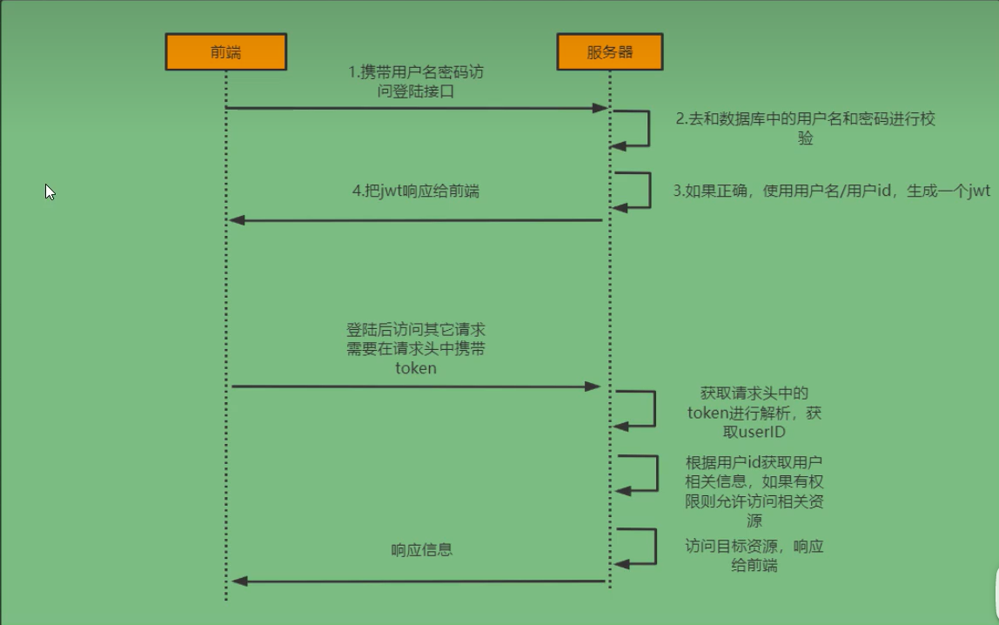
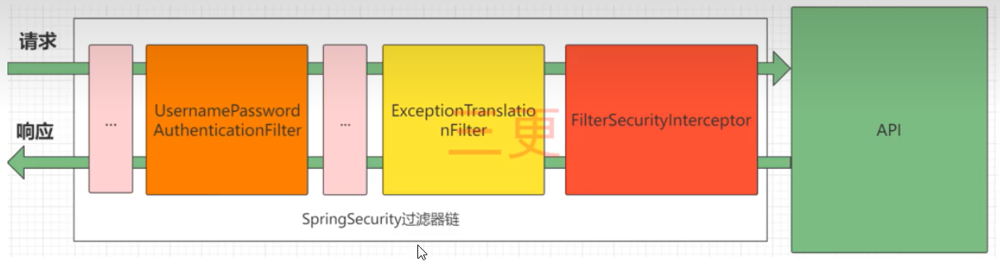
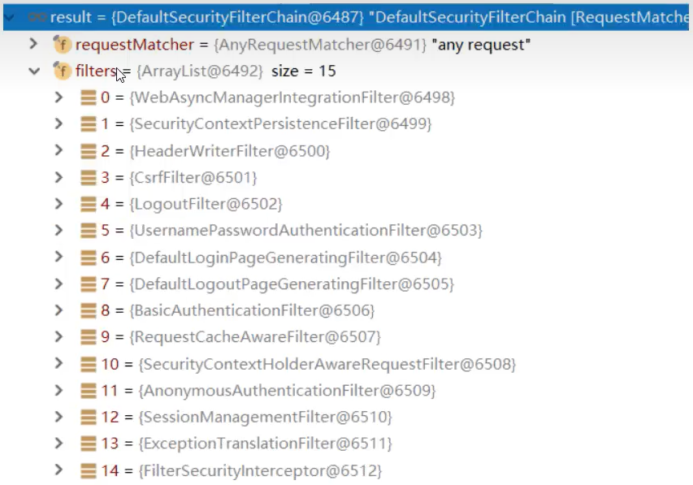
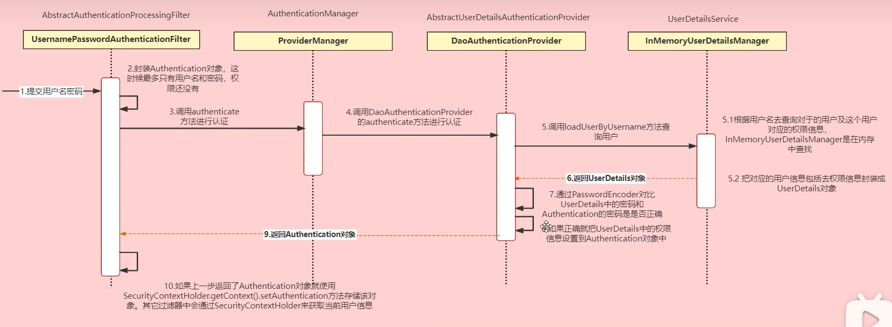

# 一、简介

**SpringSecurity** 是 spring 家族中的一个安全管理框架，相比于另外一个安全框架 Shiro ，它提供了更加丰富的功能，社区资源也比 Shiro 丰富。

一般来说大型的项目都是使用SpringSecurity来做安全框架，小项目中Shiro使用的比较多。因此与SpringSecurity相比，Shiro上手更加简单。

一般Web应用都需要进行**认证**和**授权**：

​	**认证：验证当前访问系统的是不是本系统的用户，并且确认具体是哪个用户**

​	**授权：经过认证后判断当前用户是否有权限进行某个操作**

而认证和授权也是SpringSecurity作为安全框架的核心功能。

# 二、准备工作

导入SpringSecurity：

```xml
<dependency>
    <groupId>org.springframework.boot</groupId>
    <artifactId>spring-boot-starter-security</artifactId>
</dependency>
```

引入依赖后，在尝试访问接口时会自动跳转到一个SpringSecurity的默认登录页面，默认用户名是user，密码会输出在控制台。必须先登录才能访问接口。

# 三、认证

## 1 登录校验流程



## 2.原理

SpringSecurity的原理其实就是一个过滤器链，一个内部包含了提供各种功能的过滤器

### 2.1 SpringSecurity的完整流程



> 图中只展示了核心过滤器

- **UsernamePasswordAuthenticationFilter**：负责处理我们在登录页面填写了用户名和密码后的登录请求，认证工作主要由它负责。
- **ExceptionTranslationFilter**：处理过滤链中抛出的任何异常：AccessDeniedException和AuthenticationException
- **FilterSecurityInteerceptor**：负责权限校验的过滤器

SpringSecurity中包含的过滤器：



### 2.2 认证流程



- Authentication接口：它的实现类，表示当前访问系统的用户，封装了用户的相关信息
- AuthenticationManager接口：定义了认证Authentication的方法
- UserDetailsService接口：加载用户特定数据的核心接口，里面定义了一个根据用户名查询用户信息的方法
- UserDetails接口：提供核心用户消息，通过UserDetailsService根据用户名获取处理的用户信息封装成UserDetails对象返回，然后将这些信息封装到Authentication对象中。

## 3.解决问题

### 3.1 思路流程

1. 登录
   1. 自定义登录接口
      - 调用 ProviderManager 的方法进行认证，如果认证通过则生成 jwt
      - 把用户信息存入 redis 中
   2. 自定义 UserDetailsService
      - 在其实现类中查询数据库中的用户信息，根据 userId
2. 校验
   1. 定义 jwt 认证过滤器
      - 获取 Token
      - 解析 Token 获取其中的 userId
      - 从 redis 中获取用户信息
      - 存入 SecurityContextHolder

### 3.2 准备工作

1.添加依赖

```xml
<dependency>
    <groupId>org.springframework.boot</groupId>
    <artifactId>spring-boot-starter-data-redis</artifactId>
</dependency>
<dependency>
    <groupId>com.alibaba</groupId>
    <artifactId>fastjson</artifactId>
    <version>2.0.7.graal</version>
</dependency>
<dependency>
    <groupId>io.jsonwebtoken</groupId>
    <artifactId>jjwt</artifactId>
    <version>0.9.1</version>
</dependency>
```

2.添加 redis 相关配置

配置序列化器：

```java
public class FastJsonRedisSerializer<T> implements RedisSerializer<T> {
    public static final Charset DEFAULT_CHARSET = StandardCharsets.UTF_8;
    private final Class<T> clazz;

    /*static {
        ParserConfig.getGlobalInstance().setAutoTypeSupport(true);
    }*/

    public FastJsonRedisSerializer(Class<T> clazz) {
        super();
        this.clazz = clazz;
    }

    @Override
    public byte[] serialize(T t) throws SerializationException {
        if (t == null) {
            return new byte[0];
        }
        return JSON.toJSONString(t, SerializerFeature.WriteClassName).getBytes(DEFAULT_CHARSET);
    }

    @Override
    public T deserialize(byte[] bytes) throws SerializationException {
        if (bytes == null || bytes.length <= 0) {
            return null;
        }
        String str = new String(bytes, DEFAULT_CHARSET);
        return JSON.parseObject(str, clazz);
    }

    @Override
    public boolean canSerialize(Class<?> type) {
        return RedisSerializer.super.canSerialize(type);
    }

    @Override
    public Class<?> getTargetType() {
        return RedisSerializer.super.getTargetType();
    }

    protected JavaType getJavaType(Class<?> clazz) {
        return TypeFactory.defaultInstance().constructType(clazz);
    }
}
```

redis相关配置：

```java
@Configuration
public class RedisConfig {
    @Resource
    private  RedisConnectionFactory connectionFactory;

    @Bean
    @SuppressWarnings(value = {"unchecked", "rawtypes"})
    public RedisTemplate<Object, Object> redisTemplate() {
        RedisTemplate<Object, Object> template = new RedisTemplate<>();
        template.setConnectionFactory(connectionFactory);

        FastJsonRedisSerializer serializer = new FastJsonRedisSerializer(Object.class);

        //使用StringRedisSerializer来序列化和反序列化redis的key值
        template.setKeySerializer(new StringRedisSerializer());
        template.setValueSerializer(serializer);

        //Hash的key也采用StringRedisSerializer的序列化方式
        template.setHashKeySerializer(new StringRedisSerializer());
        template.setHashValueSerializer(serializer);

        template.afterPropertiesSet();
        return template;
    }
}
```

响应类：

```java
@JsonInclude(JsonInclude.Include.NON_NULL)
public class ResponseResult<T> {
    //状态码
    private Integer code;

    //提示信息，如果有错误，前端可以获取该字段进行提示
    private String msg;

    //查询到的结果数据
    private T data;

    public ResponseResult(Integer code, String msg) {
        this.code = code;
        this.msg = msg;
    }

    public ResponseResult(Integer code, T data) {
        this.code = code;
        this.data = data;
    }

    public ResponseResult(Integer code, String msg, T data) {
        this.code = code;
        this.msg = msg;
        this.data = data;
    }

    public Integer getCode() {
        return code;
    }

    public void setCode(Integer code) {
        this.code = code;
    }

    public String getMsg() {
        return msg;
    }

    public void setMsg(String msg) {
        this.msg = msg;
    }

    public T getData() {
        return data;
    }

    public void setData(T data) {
        this.data = data;
    }

    @Override
    public String toString() {
        return "ResponseResult{" +
                "code=" + code +
                ", msg='" + msg + '\'' +
                ", data=" + data +
                '}';
    }
}
```

工具类：

```java
/**
 * Created by LiLin on 2022/7/6/17:39:46
 *
 * JWT工具类
 */
public class JWTUtil {
    //有效期
    public static final Long JWT_TTL = 60*60*1000L; //一个小时

    //设置密钥明文
    public static final String JWT_KEY = "123abc";

    public static String getUUID() {
        return UUID.randomUUID().toString().replaceAll("-", "");
    }

    //生成JWT
    public static String createJWT(String subject) {
        JwtBuilder builder = getJwtBuilder(subject, null, getUUID()); //设置过期时间
        return builder.compact();
    }

    private static JwtBuilder getJwtBuilder(String subject, Long ttlMillis, String uuid) {
        SignatureAlgorithm signatureAlgorithm = SignatureAlgorithm.HS256;
        SecretKey secretKey = generalkey();
        long nowMillis = System.currentTimeMillis();
        Date now = new Date(nowMillis);
        if (ttlMillis == null) {
            ttlMillis = JWTUtil.JWT_TTL;
        }
        long expMillis = nowMillis + ttlMillis;
        Date expDate = new Date(expMillis);
        return Jwts.builder()
                .setId(uuid)	                            //唯一的ID
                .setSubject(subject)	                    //主题 可以是JSON数据
                .setIssuer("lilin")		                    //签发者
                .setIssuedAt(now)	                        //签发时间
                .signWith(signatureAlgorithm, secretKey)    //使用HS256对称加密算法签名，第二个参数为密钥
                .setExpiration(expDate);
    }

    //创建token
    public static String createJWT(String id, String subject, Long ttlMillis) {
        JwtBuilder builder = getJwtBuilder(subject, ttlMillis, id); //设置注册时间
        return builder.compact();
    }

    public static void main(String[] args) {
        String token = "jdiwecvcvdsjcm,ncdlsjcwejcndsue19i01rerfcherjkldf8j2390rferhnfcjlwefchn1269387ryduewhf30fuy34fy8ofhuioewfh38fophjwiedfcnjwfuy348fyu239i9023fujh34gh43o";
        Claims claims = parseJWT(token);
        System.out.println(claims);
    }

    //生成加密后的密钥
    public static SecretKey generalkey() {
        byte[] encodeKey = Base64.getDecoder().decode(JWTUtil.JWT_KEY);
        return new SecretKeySpec(encodeKey, 0, encodeKey.length, "AES");
    }

    //解析
    public static Claims parseJWT(String jwt) {
        SecretKey secretKey = generalkey();
        return Jwts.parser()
                .setSigningKey(secretKey)
                .parseClaimsJws(jwt)
                .getBody();
    }
}
```

RedisCache.java：

```java
@SuppressWarnings(value = {"unchecked", "rawtypes"})
@Component
public class RedisCache {
    @Autowired
    public RedisTemplate redisTemplate;

    //缓存基本的对象：Integer、String、实体类等
    public <T> void setCacheObject(final String key, final T value) {
        redisTemplate.opsForValue().set(key, value);
    }

    //缓存基本的对象：Integer、String、实体类等
    public <T> void setCacheObject(final String key, final T value, final Integer timeout, final TimeUnit timeUnit) {
        redisTemplate.opsForValue().set(key, value, timeout, timeUnit);
    }

    //设置有效时间
    public boolean expire(final String key, final long timeout) {
        return expire(key, timeout, TimeUnit.SECONDS);
    }

    //设置有效时间
    public boolean expire(final String key, final long timeout, final TimeUnit unit) {
        return Boolean.TRUE.equals(redisTemplate.expire(key, timeout, unit));
    }

    //获得缓存基本对象
    public <T> T getCacheObject(final String key) {
        ValueOperations<String, T> operation = redisTemplate.opsForValue();
        return operation.get(key);
    }

    //删除单个对象
    public boolean deleteObject(final String key) {
        return Boolean.TRUE.equals(redisTemplate.delete(key));
    }

    //删除集合对象
    public Long deleteObject(final Collection collection) {
        return redisTemplate.delete(collection);
    }

    //缓存list数据
    public <T> long setCacheList(final String key, final List<T> dataList) {
        Long count = redisTemplate.opsForList().rightPushAll(key, dataList);
        return count == null ? 0 : count;
    }

    //获得缓存的list对象
    public <T> List<T> getCacheList(final String key) {
        return redisTemplate.opsForList().range(key, 0, -1);
    }

    //缓存Set
    public <T> BoundSetOperations<String, T> setCacheSet(final String key, final Set<T> dataSet) {
        BoundSetOperations<String, T> setOperation = redisTemplate.boundSetOps(key);
        for (T t : dataSet) {
            setOperation.add(t);
        }
        return setOperation;
    }

    //获得缓存的set
    public <T> Set<T> getCacheSet(final String key) {
        return redisTemplate.opsForSet().members(key);
    }

    //缓存map
    public <T> void setCacheMap(final String key, final Map<String, T> dataMap) {
        if (dataMap != null) {
            redisTemplate.opsForHash().putAll(key, dataMap);
        }
    }

    //获得缓存的map
    public <T> Map<String, T> getCacheMap(final String key) {
        return redisTemplate.opsForHash().entries(key);
    }

    //往Hash中存入数据
    public <T> void setCacheMapValue(final String key, final String hkey, final T value) {
        redisTemplate.opsForHash().put(key, hkey, value);
    }

    //获取Hash中的数据
    public <T> T getCacheMapValue(final String key, final String hkey) {
        HashOperations<String, String, T> opsForHash = redisTemplate.opsForHash();
        return opsForHash.get(key, hkey);
    }

    //删除Hash
    public void delCacheMapValue(final String key, final String hkey) {
        HashOperations hashOperations = redisTemplate.opsForHash();
        hashOperations.delete(key, hkey);
    }

    //获取多个Hash中的数据
    public <T> List<T> getMultiCacheMapValue(final String key, final Collection<Object> hkeys) {
        return redisTemplate.opsForHash().multiGet(key, hkeys);
    }

    //获取缓存的基本对象列表
    public Collection<String> keys(final String pattern) {
        return redisTemplate.keys(pattern);
    }
}
```

WebUtils.java：

```java
public class WebUtils {
    //将字符串渲染到客户端
    public static String renderString(HttpServletResponse response, String string) {
        try {
            response.setStatus(200);
            response.setContentType("application/json");
            response.setCharacterEncoding("utf-8");
            response.getWriter().print(string);
        } catch (IOException e) {
            e.printStackTrace();
        } return null;
    }
}
```

实体类：

```java
@Data
@AllArgsConstructor
@NoArgsConstructor
public class User implements Serializable {
    private static final long serialVersionUID = -40356785423858312L;
    private Integer uid;            //用户id
    private String username;        //用户名
    private String password;        //密码
    private String salt;            //盐值
    private String phone;           //电话号码
    private String email;           //电子邮箱
    private Integer gender;         //性别：0-女，1-男
    private String avatar;          //头像
    private Integer isDelete;       //是否删除：0-未删除，1-已删除
    private String createdUser;     //日志-创建人
    private Date createdTime;       //日志-创建时间
    private String modifiedUser;    //日志-最后修改执行人
    private Date modifiedTime;      //日志-最后修改时间
}
```

### 3.3 实现

从之前的分析我们可以知道，可以自定义一个UserDetailsService，让SpringSecurity使用自定义的UserDetailService，而自定义的UserDetailsService可以从数据库中查询用户名和密码

#### 3.3.1 准备工作

1.创建用户表

```sql
CREATE TABLE t_user (
	uid INT AUTO_INCREMENT COMMENT '用户id',
	username VARCHAR(20) NOT NULL UNIQUE COMMENT '用户名',
	`password` CHAR(32) NOT NULL COMMENT '密码',
	salt CHAR(36) COMMENT '盐值',
	phone VARCHAR(20) COMMENT '电话号码',
	email VARCHAR(30) COMMENT '电子邮箱',
	gender INT COMMENT '性别：0-女，1-男',
	avatar VARCHAR(100) COMMENT '头像',
	is_delete INT COMMENT '是否删除：0-未删除，1-已删除',
	created_user VARCHAR(20) COMMENT '日志-创建人',
	created_time DATETIME COMMENT '日志-创建时间',
	modified_user VARCHAR(20) COMMENT '日志-最后修改执行人',
	modified_time DATETIME COMMENT '日志-最后修改时间',
	PRIMARY KEY (uid)
) ENGINE=InnoDB DEFAULT CHARSET=utf8;
```

2.引入MybatisPlus和mysql依赖

```xml
<dependency>
    <groupId>com.baomidou</groupId>
    <artifactId>mybatis-plus-boot-starter</artifactId>
    <version>3.5.2</version>
</dependency>
<dependency>
    <groupId>mysql</groupId>
    <artifactId>mysql-connector-java</artifactId>
</dependency>
```

3,配置数据库信息

```properties
spring.datasource.url=jdbc:mysql://localhost:3306/tian_mao?useUnicode=true&characterEncoding=utf-8
spring.datasource.username=root
spring.datasource.password=123abc
spring.datasource.driver-class-name=com.mysql.cj.jdbc.Driver
```

4.定义Mapper接口

```java
@Mapper
public interface UserMapper extends BaseMapper<User> {
}
```

5.修改User实体类

```java
@Data
@AllArgsConstructor
@NoArgsConstructor
@TableName(value = "t_user")
public class User implements Serializable {
    @TableId
    private Integer uid;            //用户id
    private String username;        //用户名
    private String password;        //密码
    private String salt;            //盐值
    private String phone;           //电话号码
    private String email;           //电子邮箱
    private Integer gender;         //性别：0-女，1-男
    private String avatar;          //头像
    private Integer isDelete;       //是否删除：0-未删除，1-已删除
    private String createdUser;     //日志-创建人
    private Date createdTime;       //日志-创建时间
    private String modifiedUser;    //日志-最后修改执行人
    private Date modifiedTime;      //日志-最后修改时间
}
```

6.引入junit依赖，以便测试代码

```xml
<dependency>
    <groupId>junit</groupId>
    <artifactId>junit</artifactId>
    <scope>test</scope>
</dependency>
```

7.编写测试程序

```java
@SpringBootTest
public class UserMapperTests {
    @Autowired
    private UserMapper userMapper;
    @Test
    public void selectUserByUid() {
        System.out.println(userMapper.selectById(8));
    }
}
```

#### 3.3.2 核心代码实现

UserDetailServiceImpl.java，需要实现 UserDetailService接口：

```java
@Service
public class UserDetailServiceImpl implements UserDetailsService {
    @Autowired
    private UserMapper userMapper;

    @Override
    public UserDetails loadUserByUsername(String username) throws UsernameNotFoundException {
        //查询用户信息
        LambdaQueryWrapper<User> wrapper = new LambdaQueryWrapper<>();
        wrapper.eq(User::getUsername, username);
        User user = userMapper.selectOne(wrapper);

        //TODO 查询对应的权限信息

        //将数据封装成UserDetails数据返回
        return new LoginUser(user);
    }
}
```

LoginUser.java，将 User 数据封装成 UserDetail，需要实现 UserDetails.java 接口

```java
@Data
@AllArgsConstructor
@NoArgsConstructor
public class LoginUser implements UserDetails {
    private User user;

    @Override
    public Collection<? extends GrantedAuthority> getAuthorities() {
        return null;
    }

    @Override
    public String getPassword() {
        return user.getPassword();
    }

    @Override
    public String getUsername() {
        return user.getUsername();
    }

    @Override
    public boolean isAccountNonExpired() {
        return true;
    }

    @Override
    public boolean isAccountNonLocked() {
        return true;
    }

    @Override
    public boolean isCredentialsNonExpired() {
        return true;
    }

    @Override
    public boolean isEnabled() {
        return true;
    }
}
```

> 如果要测试，如果密码存储是明文存储，需要在密码前加上：{noop}

#### 3.3.3 密码加密存储

默认使用的 PasswordEncoder 要求数据库中的密码格式为：{id}password，它会根据 id 来判断密码的加密方式，但是一般情况下不会采用这种方式，所以就需要替换掉 PasswordEncoder。

一般会使用 SpringSecurity 提供的 BCryptPasswordEncoder，只需要把 BCryptPasswordEncoder 对象注入到 Spring 容器中，SpringSecurity 就会使用该 PasswordEncoder 来进行密码校验。

我们可以定一个 SpringSecurity 的配置类，SpringSecurity 要求这个配置类需要继承 WebSecurityConfigurerAdapter

```java
@Configuration
public class SecurityConfig {
    @Bean
    public PasswordEncoder passwordEncoder() {
        return new BCryptPasswordEncoder();
    }
}
```

#### 3.3.4 登录接口实现

接下来需要自定义登录接口，让 SpringSecurity 对这个接口放行，让用户访问这个接口的时候不需要登录也可以访问。

在接口中需要通过 AuthenticationManager 的 authenticate 方法来进行用户认证，所以需要在 SecurityConfig 中配置将 AuthenticationManager 注入容器。

认证成功后要生成一个 jwt，放入响应中返回，并且为了使用户在之后的请求中可以通过 jwt 被识别出身份，需要将用户信息存入 redis 中，并将用户 id 作为 key

1.配置SecurityConfig,java：

```java
@Override
protected void configure(HttpSecurity http) throws Exception {
    http
        //关闭csrf
        .csrf().disable()
        //不通过session获取securityContext
        .sessionManagement().sessionCreationPolicy(SessionCreationPolicy.STATELESS)
        .and()
        .authorizeRequests()
        //对于登录接口，允许匿名访问
        .antMatchers("/user/login").anonymous()
        //除上面外的所有请求都需要授权认证
        .anyRequest().authenticated();
}
```

2.编写 LoginController.java：

```java
@RestController
public class LoginController {
    @Autowired
    private UserService userService;

    @PostMapping("/user/login")
    public ResponseResult login(@RequestBody User user) {
        return userService.saveUser(user);
    }
}
```

编写 UserSerice.java 及其实现类 UserServiceImpl.java：

```java
@Service
public class UserServiceImpl implements UserService {
    @Autowired
    private AuthenticationManager authenticationManager;
    @Autowired
    private RedisCache redisCache;

    @Override
    public ResponseResult<HashMap<String, String>> saveUser(User user) {
        //先通过 AuthenticationManager 进行用户认证
        UsernamePasswordAuthenticationToken authenticationToken = new UsernamePasswordAuthenticationToken(user.getUsername(), user.getPassword());
        Authentication authentication = authenticationManager.authenticate(authenticationToken);

        //如果认证没通过，给出提示信息
        if (authentication == null)
            throw new RuntimeException("登录失败");

        //如果认证通过，使用 userId 生成JWT，并存入 ResponseResult 返回
        LoginUser loginUser = (LoginUser) authentication.getPrincipal();
        String uid = loginUser.getUser().getUid().toString();
        String jwt = JWTUtil.createJWT(uid);
        HashMap<String, String> map = new HashMap<>();
        map.put("token", jwt);

        //将完整用户信息存入 redis 中，UserId 作为key
        redisCache.setCacheObject("token:" + uid, loginUser);

        return new ResponseResult<>(200, "登录成功", map);
    }
}
```

#### 3.3.5 认证过滤器

需要自定义一个过滤器，这个过滤器会去获取请求头中的 token，然后对 token 进行解析取出其中的 userId，再通过 userId 去获取对应的 loginUser 对象，然后将 loginUser 对象封装成 authentication 对象存入 securityContextHolder 中

1.编写过滤器：

```java
@Component
public class JwtAuthenticationTokenFilter extends OncePerRequestFilter {
    @Autowired
    RedisCache redisCache;

    @Override
    protected void doFilterInternal(HttpServletRequest request, HttpServletResponse response, FilterChain filterChain) throws ServletException, IOException {
        //获取token
        String token = request.getHeader("token");
        if (!StringUtils.hasText(token)) {
            filterChain.doFilter(request, response);
            return;
        }

        //解析token
        String uid = JWTUtil.parseJWT(token).getSubject();
        if (!StringUtils.hasText(uid))
            throw new RuntimeException("非法token");

        //从redis中获取用户信息
        LoginUser loginUser = redisCache.getCacheObject("login:" + uid);
        if (Objects.isNull(loginUser))
            throw new RuntimeException("用户未登录");

        //存入SecurityContextHandler
        //TODO 获取权限信息封装到 authenticationToken 中
        UsernamePasswordAuthenticationToken authenticationToken =
                new UsernamePasswordAuthenticationToken(loginUser, null, null);
        SecurityContextHolder.getContext().setAuthentication(authenticationToken);

        //放行
        filterChain.doFilter(request, response);
    }
}
```

2.在 SecurityConfig.java 中配置过滤器

```java
@Override
protected void configure(HttpSecurity http) throws Exception {
    http
        //关闭csrf
        .csrf().disable()
        //不通过session获取securityContext
        .sessionManagement().sessionCreationPolicy(SessionCreationPolicy.STATELESS)
        .and()
        .authorizeRequests()
        //对于登录接口，允许匿名访问
        .antMatchers("/user/login").anonymous()
        //除上面外的所有请求都需要授权认证
        .anyRequest().authenticated();

    //将token过滤器加入到过滤器链中
    http.addFilterBefore(authenticationTokenFilter, UsernamePasswordAuthenticationFilter.class);
}
```

#### 3.3.6 退出登录

只需要定义一个登录接口，获取 securityContextHolder 中的认证信息，然后删除 redis 中对应的数据即可。

```java
@Override
public ResponseResult<Void> logout() {
    //获取 securityContextHolder 中保存的用户id
    UsernamePasswordAuthenticationToken authenticationToken =(UsernamePasswordAuthenticationToken)
        SecurityContextHolder.getContext().getAuthentication();
    LoginUser loginUser = (LoginUser) authenticationToken.getPrincipal();
    Integer uid = loginUser.getUser().getUid();

    //根据用户id删除 redis 中保存的用户信息
    redisCache.deleteObject("login:" + uid);
    return new ResponseResult<>(200, "注销成功");
}
```

# 四、授权

## 1.权限系统的作用

假如一个学校的图书管理系统，如果是普通学生登录就能看到借书还书相关的功能，但是不可能让他看到并且去使用添加书籍信息、删除书籍信息等重要功能；但是如果是一个图书管理员登录账户，就可以看到并且能够使用添加书籍信息、删除书籍信息等重要功能。总而言之，就是**不同的用户要使用不同的功能**，这就是权限系统需要去实现的功能。

而在实际开发中，我们不能只依赖前端去判断用户的权限来选择显示哪些按钮，因为如果只是这样，只要知道对应功能的接口地址链接，就可以不通过前端页面，直接发送请求实现操作前端页面。

所以我们还需要在后台进行相关用户权限的判断操作，确定当前用户是否有足够的访问权限去进行对应的操作。

## 2.授权的基本流程

在 springsecurity 中，会使用默认的 FilterSecurityInterceptor 进行校验，在 FilterSecurityInterceptor 中可以通过 SecurityContextHolder 来获取 Authentication，通过 Authentication 获取用户权限信息，从而判断用户是否有足够的权限访问当前资源。

所以权限管理是先将当前登录用户的权限信息存入 Authentication，在设置访问各个资源所需要的权限即可。

## 3.授权实现

### 3.1 设置访问资源所需权限

springSecurity 提供了基于注解的权限控制方案，这也是项目中主要采用的方式，可以通过注解去指定访问资源所需的权限等级。

1.先开启相关配置

```java
@Configuration
@EnableGlobalMethodSecurity(prePostEnabled = true)
public class SecurityConfig extends WebSecurityConfigurerAdapter {}
```

2.使用对应的注解：@PreAuthorize

```java
@RestController
public class TestController {
    @PreAuthorize("hasAuthority('test')")
    @RequestMapping("hello")
    public String test() {
        return "Hello World";
    }
}
```

### 3.2 封装权限信息

在 UserDetailServiceImpl 中，在查询出用户信息后还需要获取对应的权限信息，然后将权限信息封装到 UserDetail 中返回。

先直接把权限信息写死封装到 UserDetail 中进行测试，在 UserDetails 实现类 LoginUser 中，想要 LoginUser 可以封装权限信息，就要先对其进行一些修改。

1.在 `UserDetailServiceImpl.java`中：

```java
@Override
public UserDetails loadUserByUsername(String username) throws UsernameNotFoundException {
    //查询用户信息
    LambdaQueryWrapper<User> wrapper = new LambdaQueryWrapper<>();
    wrapper.eq(User::getUsername, username);
    User user = userMapper.selectOne(wrapper);

    //确保查询到的用户不为空
    if (user == null) {
        throw new RuntimeException("用户名或密码错误");
    }

    //TODO 查询对应的权限信息
    ArrayList<String> list = new ArrayList<>(Arrays.asList("test", "admin"));

    //将数据封装成UserDetails数据返回
    return new LoginUser(user, list);
}
```

2.在`LoginUser.java`中：

```java
@JSONField(serialize = false)   //禁止将 authoritiesList 序列化
private List<SimpleGrantedAuthority> authoritiesList;
@Override
public Collection<? extends GrantedAuthority> getAuthorities() {
    //将 permission 中包含的 string 类型的权限信息封装成 SimpleGrantedAuthority 对象]
    if (authoritiesList.size() == 0)
        authoritiesList = permission.
        stream().
        map(SimpleGrantedAuthority :: new).
        collect(Collectors.toList());
    return authoritiesList;
}
```

3.在`JwtAuthenticationTokenFilter.java`中：

```java
@Override
protected void doFilterInternal(HttpServletRequest request, 
                                HttpServletResponse response, 
                                FilterChain filterChain) throws ServletException, IOException {
    //获取token
    String token = request.getHeader("token");
    if (!StringUtils.hasText(token)) {
        filterChain.doFilter(request, response);
        return;
    }

    //解析token
    String uid = JWTUtil.parseJWT(token).getSubject();
    if (!StringUtils.hasText(uid))
        throw new RuntimeException("非法token");

    //从redis中获取用户信息
    LoginUser loginUser = redisCache.getCacheObject("login:" + uid);
    if (Objects.isNull(loginUser))
        throw new RuntimeException("用户未登录");

    //存入SecurityContextHandler
    //TODO 获取权限信息封装到 authenticationToken 中
    UsernamePasswordAuthenticationToken authenticationToken =
        new UsernamePasswordAuthenticationToken(loginUser, null, loginUser.getAuthorities());
    SecurityContextHolder.getContext().setAuthentication(authenticationToken);

    //放行
    filterChain.doFilter(request, response);
}
```

### 3.2 从数据库查询权限信息

#### 3.2.1 RBAC权限模型

RBAC权限模型（Role-Based Access Control）即：基于角色的权限控制。这是目前最常被开发者使用也是相对易用和通用的权限模型。

#### 3.2.2 准备工作

1.建立数据表

```sql
create table `sys_menu` {
	id bigint(20) not null auto_increment,
	menu_name varchar(64) not null default 'null' comment '菜单名',
	……
};

create table `sys_role` {
	id bigint(20) not null auto_increment,
	name varchar(128) default null,
	……
};

create table `sys_role_menu` {
	role_id bigint(200) not null auto_increment comment '角色id',
	menu_id bigint(200) not null default '0' comment '菜单id',
	primary key (role_id, menu_id)
} ENGINE=InnoDB AUTO_INCREMENT=2 DEFAULT CHARSET=utf8mb4; 

create table sys_user {
	id bigint(200) not null auto_increment comment '主键',
	user_name varchar(64) not null default 'null' comment '用户名',
	……
};

create table sys_user_role {
	user_id bigint(200) not null auto_increment comment '用户id',
	role_id bigint(200) not null default '0'  comment '角色id',
	primary key (user_id, role_id)
}ENGINE=InnoDB DEFAULT CHARSET=utf8mb4; 
```

2.测试 SQL

```sql
select
	distinct m.`perms`
from
	sys_user_role ur
	left join `sys_role` r on ur.`role.id` = r.id
	left join sys_role_menu rm on ur.role_id = rm.role_id
	left join sys_menu m on m.id = rm.menu_id
where
	user_id = 2
	and r.status = 0
	and m.status = 0
```

3.创建对应的实体类

```java
@Data
@AllArgsConstructor
@NoArgsConstructor
@TableName(value = "sys_menu")
@JsonInclude(JsonInclude.Include.NON_NULL)
public class Menu {
    private static final long serialversionUID = -549041104113736L;
    @TableId
    private Long id;
    private String menuName;        //菜单名
    private String path;            //路由地址
    private String component;       //组件路径
    private String visible;         //菜单状态（0显示，1隐藏）
    private String status;          //菜单状态（0正常，1停用）
    private String perms;           //权限标识
    private String icon;            //菜单图标
    private Long createBy;
    private Date createTime;
    private Long updateBy;
    private Date updateTime;
    private Integer delFlag;        //是否删除（0未删除，1已删除）
    private String remark;          //备注
}
```

#### 3.2.3 代码实现

根据用户 id 去查询到其所对应的权限信息即可，所以要先定义一个 mapper，在 mapper 里提供一个方法，可以根据 userId 查询权限信息

1.编写 `MenuMapper.java`

```java
@Mapper
public interface MenuMapper extends BaseMapper<Menu> {
    List<String> selectPermsByUserId(Long userId);
}
```

2.创建对应的 mapper 文件

```xml
<mapper namespace="com.lilin.springsecurity.mapper.MenuMapper">

    <select id="selectPermsByUserId" resultType="java.lang.String">
        select
            distinct m.`perms`
        from
            sys_user_role ur
                left join `sys_role` r on ur.`role.id` = r.id
                left join sys_role_menu rm on ur.role_id = rm.role_id
                left join sys_menu m on m.id = rm.menu_id
        where
            user_id = #{userId} and r.status = 0 and m.status = 0
    </select>
</mapper>
```

3.修改 `UserDetailServiceImpl.java` 对应的代码

```java
@Override
public UserDetails loadUserByUsername(String username) throws UsernameNotFoundException {
    //查询用户信息
    LambdaQueryWrapper<User> wrapper = new LambdaQueryWrapper<>();
    wrapper.eq(User::getUsername, username);
    User user = userMapper.selectOne(wrapper);

    //确保查询到的用户不为空
    if (user == null) {
        throw new RuntimeException("用户名或密码错误");
    }

    //查询对应的权限信息
    //        ArrayList<String> list = new ArrayList<>(Arrays.asList("test", "admin"));
    List<String> list = menuMapper.selectPermsByUserId(user.getUid().longValue());

    //将数据封装成UserDetails数据返回
    return new LoginUser(user, list);
}
```

4.修改资源文件 `TestController.java` 中的访问权限

```java
@RestController
public class TestController {
//    @PreAuthorize("hasAuthority('test')")
    @PreAuthorize("hasAuthority('system:dept:list')")
    @RequestMapping("hello")
    public String test() {
        return "Hello World";
    }
}
```

# 五、自定义失败处理

我们希望在认证失败或者授权失败的情况下，springSecurity 也能和我们自定义的接口一样返回相同结构的 json 数据，这样可以让前端能够对响应进行统一的处理。要实现这个功能需要了解 springSecurity 的异常处理机制。

在springSecurity中，如果在认证或者授权的过程中出现了异常会被ExceptionTranslationFilter捕获到，ExceptionTranslationFilter 就会判断是认证失败还是授权失败而产生的异常。

- 如果是认证过程中出现的异常就会被封装成 AuthenticationException，然后调用 AuthenticationEntryPoint 对象中的方法进行异常处理；
- 如果是授权过程中出现的异常就会被封装成 AccessDeniedException，然后调用 AccessDeniedHandler 对象中的方法进行异常处理。

所以如果需要自定义异常处理，只需要自定义 **AuthenticationEntryPoint** 和 **AccessDeniedHandler**，然后配置给SpringSecurity即可。

1.自定义实现类

`AuthenticationEntryPointImpl.java`：

```java
@Component
public class AuthenticationEntryPointImpl implements AuthenticationEntryPoint {
    @Override
    public void commence(HttpServletRequest request,
                         HttpServletResponse response,
                         AuthenticationException authException) throws IOException, ServletException {
        ResponseResult<Void> result = new ResponseResult<>(HttpStatus.UNAUTHORIZED.value(),
                "认证失败，请重新登录");
        //处理异常
        WebUtils.renderString(response, JSON.toJSONString(result));
    }
}
```

`AccessDeniedHandlerImpl.java`：

```java
@Component
public class AccessDeniedHandlerImpl implements AccessDeniedHandler {
    @Override
    public void handle(HttpServletRequest request,
                       HttpServletResponse response,
                       AccessDeniedException accessDeniedException) throws IOException, ServletException {
        ResponseResult<Void> result = new ResponseResult<>(HttpStatus.FORBIDDEN.value(),
                "你的权限不足");
        //处理异常
        WebUtils.renderString(response, JSON.toJSONString(result));
    }
}
```

2.在 `SecurityConfig.java`配置类中配置异常处理器

```java
@Override
protected void configure(HttpSecurity http) throws Exception {
    http
        //关闭csrf
        .csrf().disable()
        //不通过session获取securityContext
        .sessionManagement().sessionCreationPolicy(SessionCreationPolicy.STATELESS)
        .and()
        .authorizeRequests()
        //对于登录接口，允许匿名访问
        .antMatchers("/user/login").anonymous()
        //除上面外的所有请求都需要授权认证
        .anyRequest().authenticated();

    //将token过滤器加入到过滤器链中
    http.addFilterBefore(authenticationTokenFilter, UsernamePasswordAuthenticationFilter.class);

    //配置异常处理器
    http.exceptionHandling()
        //配置认证失败处理器
        .authenticationEntryPoint(authenticationEntryPoint)
        //配置授权失败处理器
        .accessDeniedHandler(accessDeniedHandler);
}
```

# 六、跨域

浏览器处于安全的考虑，使用 XMLHttpRequest 对象发起 HTTP 请求时必须遵守同源策略，否则就是跨域的 HTTP请求，默认情况下是被禁止的。同源策略要求源相同才能正常进行通信，即协议、域名、端口号都完全一致。

前后端分离项目中，前端项目和后端项目一般都不是同源的，所以肯定会存在跨域请求问题，于是这就需要我们对其进行处理，让前端能进行跨域请求。

1.先对 SpringBoot 进行配置，允许跨域请求

```java
@Configuration
public class CorsConfig implements WebMvcConfigurer {
    @Override
    public void addCorsMappings(@NotNull CorsRegistry registry) {
        //设置允许跨域的路径
        registry.addMapping("/**")
                //设置允许跨域请求的域名类型
                .allowedOriginPatterns("*")
                //是否允许cookie
                .allowCredentials(true)
                //设置允许请求的方式
                .allowedMethods("GET","POST","PUT","DELETE")
                //设置蕴蓄的header属性
                .allowedHeaders("*")
                //允许跨域时间
                .maxAge(3600);
    }
}
```

2.然后对 springSecurity 进行配置，允许跨域请求

因为项目的资源都会受到 springSecurity 的保护，所以想要进行跨域访问还需要让 springSecurity 允许进行跨域请求

```java
在 SecurityConfig.java 的 configure(HttpSecurity http) 方法中添加以下代码：
http.cors();
```

# 七、其他

## 1.其他权限校验方法

在之前都是使用`@PreAuthorize`注解，然后在其中使用`hasAuthority`方法进行校验，SpringSEcurity 还为开发者提供了其他方法，例如：`hasAnyAuthority`、`hasRole`、`hasAnyRole`等

原理：

1. `hasAuthority`方法实际是执行了`SecurityExpressionRoot.java`的`hasAuthority`方法，其内部通过调用`Authentication.java`的`getAuthorities`方法获取用户的权限列表，然后判断存入的方法参数数据在权限列表中。

2. `hasAnyAuthority`方法允许传入多个权限，只要用户有其中任意一个权限都可以访问对应的资源。

   ```java
   @PreAuthorize("hasAnyAuthority('admin', 'test', 'system:dept:list')")
   public String hello() {
       return "hello";
   }
   ```

3. `hasRole`要求要有对应的角色才可以访问，但是其内部会将传入的参数拼接上 **ROLE_** 后再做比较，所以在这种情况下就要求用户的权限也要有 **ROLE_** 作为前缀才行。

   ```java
   @PreAuthorize("hasRole('system:dept:list')")
   public String hello() {
       return "hello";
   }
   ```

4. `hasAnyRole` 允许任意的角色都可以访问资源，其内部要求传入的参数先拼接上 **ROLE_** 后再进行比较，在这种情况下要求用户的权限也要有 **ROLE_** 作为前缀才行。

   ```java
   @PreAuthorize("hasAnyRole('admin', 'test', 'system:dept:list')")
   public String hello() {
       return "hello";
   }
   ```

## 2.自定义权限校验方法

可以自定义权限校验方法，然后在 `@PreAuthorize` 注解使用自定义的方法

1.自定义权限校验方法

```java
@Component("my")
public class MyExpressionRoot {
    public boolean hasAuthority(String authority) {
        //获取当前用户权限
        Authentication authentication = SecurityContextHolder.getContext().getAuthentication();
        LoginUser loginUser = (LoginUser) authentication.getPrincipal();
        List<String> permission = loginUser.getPermission();

        //判断当前用户权限是否存在 authority 权限
        return permission.contains(authority);
    }
}
```

2.使用自定义权限校验方法

```java
@RestController
public class TestController {
//    @PreAuthorize("hasAuthority('test')")
//    @PreAuthorize("hasAuthority('system:dept:list')")
    @PreAuthorize("@my.hasAuthority('system:dept:list')")
    @RequestMapping("hello")
    public String test() {
        return "Hello World";
    }
}
```

## 3.基于配置的权限控制

也可以在配置类中通过使用配置的方式对资源进行权限控制

在 springSecurity 的配置类`SecurityConfig.java`的`configure(HttpSecurity http)`方法中添加以下代码：

```java
http.antMatchers("/testCors").hasAuthority("system:dept:list");
```

## 4.CSRF

CSRF是指跨站请求伪造（Cross-Site Request Forgery），是web常见的攻击之一。

springSecurity防止CSRF攻击的方式就是通过 csrf_token 来实现的。后端会生成一个 csrf_token，前端发起请求的时候需要携带这个 csrf_token，后端就会有过滤器进行验证，如果没有携带 csrf_token 或是伪造 csrf_token 就无法通过验证。

我们可以发现CSRF攻击依靠的是cookie中所携带的认证信息，但是在前后端分离项目中认证信息是 token，而token并不是储存在cookie中，并且需要前端代码将 token 设置到请求头中才可以，所以 CSRF 攻击可以不必担心。

## 5.认证成功处理器

实际上在`UsernamePasswordAuthenticationFilter.java`进行登录认证的时候，如果登录成功就会调用`AuthenticationSuccessHandler.java`的方法进行认证成功之后的处理，而`AuthenticationSuccessHandler.java`就是登录成功处理器。

开发者也可以自定义登录成功处理器进行更复杂的登录成功处理。

1.自定义`AuthenticationSuccessHandler.java`：

```java
@Component
public class MySuccessHandler implements AuthenticationSuccessHandler {
    @Override
    public void onAuthenticationSuccess(HttpServletRequest request, HttpServletResponse response, Authentication authentication) throws IOException, ServletException {
        System.out.println("认证成功了");
    }
}
```

2.将自定义`AuthenticationSuccessHandler.java`加入到配置

```java
@Configuration
public class SecurityConfig extends WebSucurityConfigurerAdapter {
    @Autowired
    private AuthenticationSuccessHandler successHandler;
    
    @Override
    protected void configure(HttpSecurity http) throws Exception {
        http.formLogin().successHandler(successHandler);
        
        http.authorizeRequests().anyRequest().authenticated();
    }
```

## 6.认证失败处理器

实际上在`UsernamePasswordAuthenticationFilter.java`进行登录认证的时候，如果登录失败就会调用`AuthenticationFailureHandler.java`的方法进行认证失败后的处理，而`AuthenticationFailureHandler.java`就是登录成功处理器。

开发者也可以自定义登录失败处理器进行更复杂的登录失败处理。

代码：

```java
……
```