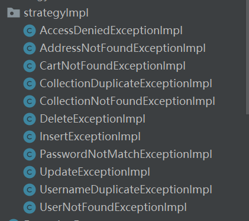

#  一、项目分析

## 1.项目功能

- 登录
- 注册
- 商品列表
- 个人信息（待定）
- 购物车
  - 展示
  - 删除单项
  - 删除多项
  - 增加商品
  - 结算

## 2.开发顺序

## 3.单一模块开发

- 持久层开发：依据前端页面的设置规划相关的SQL语句，以及进行配置
- 业务层开发：核心功能控制、业务操作以及异常的处理
- 控制层开发：接受请求、处理响应
- 前端开发：JS、Query、Ajax等技术来连接后台

# 二、环境搭建

## 1.环境要求

- JDK：11.0.14.1
- maven：2.6.6版本及以上
- 数据库：MySQL 8.0及以上版本
- 服务器：apache-tomcat-9.0.59及以上版本
- 开发平台：IDEA 2021版本开发

## 2.搭建项目

### 2.1 配置文件

#### 2.1.1 导入`pom.xml`依赖

```xml
<dependencies>
    <!--junit测试包-->
    <dependency>
        <groupId>junit</groupId>
        <artifactId>junit</artifactId>
        <version>4.13.2</version>
        <scope>test</scope>
    </dependency>

    <!--spring相关-->
    <dependency>
        <groupId>org.springframework</groupId>
        <artifactId>spring-context</artifactId>
        <version>5.3.17</version>
    </dependency>
    <dependency>
        <groupId>org.springframework</groupId>
        <artifactId>spring-beans</artifactId>
        <version>5.3.17</version>
    </dependency>
    <dependency>
        <groupId>org.springframework</groupId>
        <artifactId>spring-webmvc</artifactId>
        <version>5.3.17</version>
    </dependency>
    <dependency>
        <groupId>org.springframework</groupId>
        <artifactId>spring-aspects</artifactId>
        <version>5.3.17</version>
    </dependency>
    <dependency>
        <groupId>org.springframework</groupId>
        <artifactId>spring-jms</artifactId>
        <version>5.3.17</version>
    </dependency>
    <dependency>
        <groupId>org.springframework</groupId>
        <artifactId>spring-context-support</artifactId>
        <version>5.3.17</version>
    </dependency>
    <dependency>
        <groupId>org.springframework</groupId>
        <artifactId>spring-test</artifactId>
        <version>5.3.17</version>
    </dependency>
    <dependency>
        <groupId>org.springframework</groupId>
        <artifactId>spring-jdbc</artifactId>
        <version>5.3.17</version>
    </dependency>

    <!--mybatis相关-->
    <dependency>
        <groupId>org.mybatis</groupId>
        <artifactId>mybatis</artifactId>
        <version>3.5.9</version>
    </dependency>
    <dependency>
        <groupId>org.mybatis</groupId>
        <artifactId>mybatis-spring</artifactId>
        <version>2.0.7</version>
    </dependency>
    <dependency>
        <groupId>com.github.miemiedev</groupId>
        <artifactId>mybatis-paginator</artifactId>
        <version>1.2.17</version>
    </dependency>

    <!--分页插件-->
    <dependency>
        <groupId>com.github.pagehelper</groupId>
        <artifactId>pagehelper</artifactId>
        <version>5.3.0</version>
    </dependency>

    <!--mysql-->
    <dependency>
        <groupId>mysql</groupId>
        <artifactId>mysql-connector-java</artifactId>
        <version>8.0.28</version>
    </dependency>

    <!--druid-->
    <dependency>
        <groupId>com.alibaba</groupId>
        <artifactId>druid</artifactId>
        <version>1.2.8</version>
    </dependency>

    <!--JSP相关-->
    <dependency>
        <groupId>jstl</groupId>
        <artifactId>jstl</artifactId>
        <version>1.2</version>
    </dependency>
    <dependency>
        <groupId>javax.servlet.jsp</groupId>
        <artifactId>jsp-api</artifactId>
        <version>2.2.1-b03</version>
        <scope>provided</scope>
    </dependency>

    <!--servlet-->
    <dependency>
        <groupId>javax.servlet</groupId>
        <artifactId>javax.servlet-api</artifactId>
        <version>4.0.1</version>
        <scope>provided</scope>
    </dependency>

    <!--jackson json处理包-->
    <dependency>
        <groupId>com.fasterxml.jackson.core</groupId>
        <artifactId>jackson-databind</artifactId>
        <version>2.13.2.1</version>
    </dependency>

    <!--文件异步上传-->
    <dependency>
        <groupId>commons-io</groupId>
        <artifactId>commons-io</artifactId>
        <version>20030203.000550</version>
    </dependency>
    <dependency>
        <groupId>commons-fileupload</groupId>
        <artifactId>commons-fileupload</artifactId>
        <version>1.4</version>
    </dependency>

    <!--slf4j-impl-->
    <dependency>
        <groupId>org.apache.logging.log4j</groupId>
        <artifactId>slf4j-impl</artifactId>
        <version>2.0-alpha2</version>
    </dependency>
</dependencies>
```

#### 2.1.2 配置`jdbc.properties`

这是数据库的连接信息

```properties
jdbc.url=jdbc:mysql://localhost:3306/tian_mao?useUnicode=true&characterEncoding=utf-8
jdbc.driver=com.mysql.cj.jdbc.Driver
jdbc.username=root
jdbc.password=123abc
```

> 具体配置情况需要按照自己的数据库信息来配置

#### 2.1.3 配置`log4j.xml`

这是日志文件配置

```xml
<?xml version="1.0" encoding="utf-8" ?>
<!DOCTYPE log4j:configuration SYSTEM "log4j.dtd">
<log4j:configuration xmlns:log4j="http://jakarta.apache.org/log4j/"
                     xmlns:xsi="http://www.w3.org/2001/XMLSchema-instance"
                     xsi:schemaLocation="http://jakarta.apache.org/log4j/ ">
    <appender name="STDOUT" class="org.apache.log4j.ConsoleAppender">
        <param name="Encoding" value="UTF-8"/>
        <layout class="org.apache.log4j.PatternLayout">
            <param name="ConversionPattern" value="%-5p %d{MM-dd HH:mm:ss,SSS} %m(%F:%L) \n"/>
        </layout>
    </appender>
    <logger name="java.sql">
        <level value="debug"/>
    </logger>
    <logger name="org.apache.ibatis">
        <level value="info"/>
    </logger>
    <root>
        <level value="debug"/>
        <appender-ref ref="STDOUT"/>
    </root>
</log4j:configuration>
```

> 可以直接复制粘贴

#### 2.1.4 配置`web.xml`

```xml
<?xml version="1.0" encoding="UTF-8"?>
<web-app xmlns="http://xmlns.jcp.org/xml/ns/javaee"
         xmlns:xsi="http://www.w3.org/2001/XMLSchema-instance"
         xsi:schemaLocation="http://xmlns.jcp.org/xml/ns/javaee http://xmlns.jcp.org/xml/ns/javaee/web-app_4_0.xsd"
         version="4.0">
    <!--spring 文件启动器-->
    <context-param>
        <param-name>contextConfigLocation</param-name>
        <param-value>classpath:applicationContext.xml</param-value>
    </context-param>

    <!--添加监听器-->
    <listener>
        <listener-class>org.springframework.web.context.ContextLoaderListener</listener-class>
    </listener>

    <!--springMVC的前端控制器，拦截所有请求-->
    <servlet>
        <servlet-name>dispatcherServlet</servlet-name>
        <servlet-class>org.springframework.web.servlet.DispatcherServlet</servlet-class>
        <load-on-startup>1</load-on-startup>
    </servlet>
    <servlet-mapping>
        <servlet-name>dispatcherServlet</servlet-name>
        <url-pattern>/</url-pattern>
    </servlet-mapping>

    <!--配置字符编码过滤器，这个过滤器一定要在所有过滤器之前-->
    <filter>
        <filter-name>characterEncodingFilter</filter-name>
        <filter-class>org.springframework.web.filter.CharacterEncodingFilter</filter-class>
        <init-param>
            <param-name>encoding</param-name>
            <param-value>UTF-8</param-value>
        </init-param>
        <init-param>
            <param-name>forceRequestEncoding</param-name>
            <param-value>true</param-value>
        </init-param>
        <init-param>
            <param-name>forceResponseEncoding</param-name>
            <param-value>true</param-value>
        </init-param>
    </filter>
    <filter-mapping>
        <filter-name>characterEncodingFilter</filter-name>
        <url-pattern>/*</url-pattern>
    </filter-mapping>

    <!--使用restful风格的uri，将页面普通的post或get请求转为指定的delete或put请求-->
    <filter>
        <filter-name>hiddenHttpMethodFilter</filter-name>
        <filter-class>org.springframework.web.filter.HiddenHttpMethodFilter</filter-class>
    </filter>
    <filter-mapping>
        <filter-name>hiddenHttpMethodFilter</filter-name>
        <url-pattern>/*</url-pattern>
    </filter-mapping>
</web-app>
```

#### 2.1.5 配置`dispatcherServlet-servlet.xml`

```xml
<?xml version="1.0" encoding="UTF-8"?>
<beans xmlns="http://www.springframework.org/schema/beans"
       xmlns:xsi="http://www.w3.org/2001/XMLSchema-instance"
       xmlns:context="http://www.springframework.org/schema/context"
       xmlns:mvc="http://www.springframework.org/schema/mvc"
       xsi:schemaLocation="http://www.springframework.org/schema/beans http://www.springframework.org/schema/beans/spring-beans.xsd http://www.springframework.org/schema/context https://www.springframework.org/schema/context/spring-context.xsd http://www.springframework.org/schema/mvc https://www.springframework.org/schema/mvc/spring-mvc.xsd">
    <!--springMVC 的配置文件，包含网页的跳转逻辑控制-->

    <!--配置包扫描器-->
    <!--use-default-filters：禁用默认的过滤器规则-->
    <context:component-scan base-package="com.LiLin.TianMao" use-default-filters="false">
        <!--只需要扫描控制器-->
        <context:include-filter type="annotation" expression="org.springframework.stereotype.Controller"/>
    </context:component-scan>

    <!--配置视图解析器-->
    <bean class="org.springframework.web.servlet.view.InternalResourceViewResolver">
        <!--前缀-->
        <property name="prefix" value="/" />
        <!--后缀-->
        <property name="suffix" value=".jsp" />
    </bean>

    <!--标配-->
    <!--将springMVC不能处理的请求交给Tomcat处理-->
    <mvc:default-servlet-handler />
    <!--开启springMVC的高级功能，映射动态请求-->
    <mvc:annotation-driven />
</beans>
```

#### 2.1.6 配置`applicationContext.xml`

```xml
<?xml version="1.0" encoding="UTF-8"?>
<beans xmlns="http://www.springframework.org/schema/beans"
       xmlns:xsi="http://www.w3.org/2001/XMLSchema-instance"
       xmlns:context="http://www.springframework.org/schema/context"
       xmlns:aop="http://www.springframework.org/schema/aop" xmlns:tx="http://www.springframework.org/schema/tx"
       xsi:schemaLocation="http://www.springframework.org/schema/beans http://www.springframework.org/schema/beans/spring-beans.xsd http://www.springframework.org/schema/context https://www.springframework.org/schema/context/spring-context.xsd http://www.springframework.org/schema/aop https://www.springframework.org/schema/aop/spring-aop.xsd http://www.springframework.org/schema/tx http://www.springframework.org/schema/tx/spring-tx.xsd">
    <!--Spring 配置文件，进行和spring有关的配置-->

    <!--进行包扫描-->
    <context:component-scan base-package="com.LiLin.TianMao" >
        <!--不用扫描控制器-->
        <context:exclude-filter type="annotation" expression="org.springframework.stereotype.Controller"/>
    </context:component-scan>


    <!--配置数据源-->
    <context:property-placeholder location="classpath:jdbc.properties" />
    <bean id="druidDataSource" class="com.alibaba.druid.pool.DruidDataSource">
        <property name="url" value="${jdbc.url}" />
        <property name="driverClassName" value="${jdbc.driver}" />
        <property name="username" value="${jdbc.username}" />
        <property name="password" value="${jdbc.password}" />
    </bean>


    <!--配置MyBatis整合-->
    <bean id="sqlSessionFactory" class="org.mybatis.spring.SqlSessionFactoryBean">
        <!--配置mybatis全局配置文件-->
        <property name="configLocation" value="classpath:mybatis-config.xml" />
        <!--配置数据源-->
        <property name="dataSource" ref="druidDataSource" />
        <!--指定mapper文件-->
        <property name="mapperLocations" value="classpath:mapper/*.xml" />
    </bean>
    <!--配置mapper接口的扫描器-->
    <bean class="org.mybatis.spring.mapper.MapperScannerConfigurer">
        <property name="basePackage" value="com.LiLin.TianMao.mapper" />
    </bean>


    <!--配置事务管理器-->
    <bean id="transactionManager" class="org.springframework.jdbc.datasource.DataSourceTransactionManager">
        <!--对数据源进行控制-->
        <property name="dataSource" ref="druidDataSource" />
    </bean>
    <!--开启xml配置形式的事务配置-->
    <aop:config>
        <!--切入点配置-->
        <aop:pointcut id="txPoint" expression="execution(* com.LiLin.TianMao.service..*(..))"/>
        <!--事务增强配置-->
        <aop:advisor advice-ref="txAdvice" pointcut-ref="txPoint" />
    </aop:config>
    <!--配置切面-->
    <tx:advice id="txAdvice" transaction-manager="transactionManager">
        <tx:attributes>
            <!--指定所有方法都是事务方法-->
            <tx:method name="*"/>
            <!--以select开始的所有方法-->
            <tx:method name="select*" read-only="true"/>
            <!--以get开始的所有方法-->
            <tx:method name="get*" read-only="true"/>
        </tx:attributes>
    </tx:advice>
</beans>
```

#### 2.1.7 配置`mybatis-config.xml`

```xml
<?xml version="1.0" encoding="UTF-8" ?>
<!DOCTYPE configuration
        PUBLIC "-//mybatis.org//DTD Config 3.0//EN"
        "http://mybatis.org/dtd/mybatis-3-config.dtd">

<configuration>
    <settings>
        <!--开启驼峰命名规则-->
        <setting name="mapUnderscoreToCamelCase" value="true"/>
    </settings>
    <typeAliases>
        <!--开启类型别名-->
        <package name="com/LiLin/TianMao/pojo"/>
    </typeAliases>
</configuration>
```

### 2.2 创建文件目录

- main
  - java
    - com.LiLin.Tianmao
      - controller
      - mapper
      - pojo
      - service
      - utils
  - resources
    - mapper
    - .properties
    - .xml
    - ……
  - sql
  - webapp
    - css
    - images
    - js
    - WEB-INF
    - .jsp
    - ……

### 2.3 创建数据库

```mysql
create database tian_mao
```

# 三、注册登录功能的实现

## 1.创建数据表

```mysql
CREATE TABLE t_user (
	uid INT AUTO_INCREMENT COMMENT '用户id',
	username VARCHAR(20) NOT NULL UNIQUE COMMENT '用户名',
	`password` CHAR(32) NOT NULL COMMENT '密码',
	salt CHAR(36) COMMENT '盐值',
	phone VARCHAR(20) COMMENT '电话号码',
	email VARCHAR(30) COMMENT '电子邮箱',
	gender INT COMMENT '性别：0-女，1-男',
	avatar VARCHAR(50) COMMENT '头像',
	is_delete INT COMMENT '是否删除：0-未删除，1-已删除',
	created_user VARCHAR(20) COMMENT '日志-创建人',
	created_time DATETIME COMMENT '日志-创建时间',
	modified_user VARCHAR(20) COMMENT '日志-最后修改执行人',
	modified_time DATETIME COMMENT '日志-最后修改时间',
	PRIMARY KEY (uid)
) ENGINE=InnoDB DEFAULT CHARSET=utf8;
```

## 2.创建用户的实体类

### 2.1 创建基类

通过表的结构提取出表的公共字段，以此创建一个实体类的基类，命名为`BaseEntity.java`

```java
/**
 * Created by LiLin on 2022/04/08/10:57
 */
public class BaseEntity {
    private String createdUser;     //日志-创建人
    private Date createdTime;       //日志-创建时间
    private String modifiedUser;    //日志-最后修改执行人
    private Date modifiedTime;      //日志-最后修改时间

    public BaseEntity() {
    }

    public BaseEntity(String createdUser, Date createdTime, String modifiedUser, Date modifiedTime) {
        this.createdUser = createdUser;
        this.createdTime = createdTime;
        this.modifiedUser = modifiedUser;
        this.modifiedTime = modifiedTime;
    }

    public String getCreatedUser() {
        return createdUser;
    }

    public void setCreatedUser(String createdUser) {
        this.createdUser = createdUser;
    }

    public Date getCreatedTime() {
        return createdTime;
    }

    public void setCreatedTime(Date createdTime) {
        this.createdTime = createdTime;
    }

    public String getModifiedUser() {
        return modifiedUser;
    }

    public void setModifiedUser(String modifiedUser) {
        this.modifiedUser = modifiedUser;
    }

    public Date getModifiedTime() {
        return modifiedTime;
    }

    public void setModifiedTime(Date modifiedTime) {
        this.modifiedTime = modifiedTime;
    }

    @Override
    public String toString() {
        return "BaseEntity{" +
                "createdUser='" + createdUser + '\'' +
                ", createdTime=" + createdTime +
                ", modifiedUser='" + modifiedUser + '\'' +
                ", modifiedTime=" + modifiedTime +
                '}';
    }
}
```

### 2.2 创建实体类

用户的实体类需要继承实体类的基类

```java
public class User extends BaseEntity {
    private Integer uid;    //用户id
    private String username;    //用户名
    private String password;    //密码
    private String salt;        //盐值
    private String phone;       //电话号码
    private String email;       //电子邮箱
    private Integer gender;     //性别：0-女，1-男
    private String avatar;      //头像
    private Integer isDelete;   //是否删除：0-未删除，1-已删除

    public User() {
    }

    public User(Integer uid, String username, String password, String salt, String phone, String email, Integer gender, String avatar, Integer isDelete) {
        this.uid = uid;
        this.username = username;
        this.password = password;
        this.salt = salt;
        this.phone = phone;
        this.email = email;
        this.gender = gender;
        this.avatar = avatar;
        this.isDelete = isDelete;
    }

    public Integer getUid() {
        return uid;
    }

    public void setUid(Integer uid) {
        this.uid = uid;
    }

    public String getUsername() {
        return username;
    }

    public void setUsername(String username) {
        this.username = username;
    }

    public String getPassword() {
        return password;
    }

    public void setPassword(String password) {
        this.password = password;
    }

    public String getSalt() {
        return salt;
    }

    public void setSalt(String salt) {
        this.salt = salt;
    }

    public String getPhone() {
        return phone;
    }

    public void setPhone(String phone) {
        this.phone = phone;
    }

    public String getEmail() {
        return email;
    }

    public void setEmail(String email) {
        this.email = email;
    }

    public Integer getGender() {
        return gender;
    }

    public void setGender(Integer gender) {
        this.gender = gender;
    }

    public String getAvatar() {
        return avatar;
    }

    public void setAvatar(String avatar) {
        this.avatar = avatar;
    }

    public Integer getIsDelete() {
        return isDelete;
    }

    public void setIsDelete(Integer isDelete) {
        this.isDelete = isDelete;
    }

    @Override
    public String toString() {
        return "User{" +
                "uid=" + uid +
                ", username='" + username + '\'' +
                ", password='" + password + '\'' +
                ", salt='" + salt + '\'' +
                ", phone='" + phone + '\'' +
                ", email='" + email + '\'' +
                ", gender=" + gender +
                ", avatar='" + avatar + '\'' +
                ", isDelete=" + isDelete +
                '}';
    }
}
```

## 3.注册功能开发

### 3.1 持久层

通过Mybatis操作数据库表

#### 3.1.1 设计SQL

往数据库中插入用户，可以用以下的sql语句

```mysql
insert into t_user(username,`password`,salt,phone,email,gender,avatar,is_delete,created_user,created_time,modified_user,modified_time) values(?,?,?,?,?,?,?,?,?,?,?,?)
```

#### 3.1.2 设计接口和抽象方法

在接口类`UserMapper.java`中添加以下抽象方法

```java
    /**
     * @Author LiLin
     * @Date 2022/4/8 19:43
     * @Param User 用户实体类
     * @return 返回影响的行数
     * @Description 往数据库用户表添加数据
     */
    Integer insert(User user);
```

#### 3.1.3 编写映射文件

```xml
<?xml version="1.0" encoding="UTF-8" ?>
<!DOCTYPE mapper
        PUBLIC "-//mybatis.org//DTD Mapper 3.0//EN"
        "http://mybatis.org/dtd/mybatis-3-mapper.dtd">
<mapper namespace="com.LiLin.TianMao.mapper.UserMapper">
    <!--Integer insert(User user);-->
    <insert id="insert" useGeneratedKeys="true" keyProperty="uid">
        insert into
            t_user(username,`password`,salt,phone,email,gender,avatar,is_delete,created_user,created_time,modified_user,modified_time)
        values
            (#{username},#{password},#{salt},#{phone},#{email},#{gender},#{avatar},#{isDelete},#{createdUser},#{createdTime},#{modifiedUser},#{modifiedTime})
    </insert>
</mapper>
```

#### 3.1.4 单元测试

创建单元测试基类：

```java
@RunWith(SpringJUnit4ClassRunner.class)
@ContextConfiguration(locations = {"classpath:applicationContext.xml"})
public class BaseTest {
}
```

创建单元测试类：

```java
public class UserMapperTests extends BaseTest {
    @Autowired
    UserMapper userMapper;

    @Test
    public void insert() {
        User user = new User();
        user.setUsername("admin");
        user.setPassword("123abc");
        user.setPhone("12345678901");

        userMapper.insert(user);
    }
}
```

### 3.2 业务层

#### 3.2.1 异常规划

由于代码执行过程中可能会出现各种异常，所以要对异常进行统一规划管理

- 1、先创建`RuntimeException`异常的子类，即业务层异常的基类：`ServiceException`异常，然后再定义具体的异常类型来继承`ServiceException`异常，以此建立异常机制

  ```java
  public class ServiceException extends RuntimeException { //RuntimeException：运行时异常
      public ServiceException() {
      }
  
      public ServiceException(String message) {
          super(message);
      }
  
      public ServiceException(String message, Throwable cause) {
          super(message, cause);
      }
  
      public ServiceException(Throwable cause) {
          super(cause);
      }
  
      public ServiceException(String message, Throwable cause, boolean enableSuppression, boolean writableStackTrace) {
          super(message, cause, enableSuppression, writableStackTrace);
      }
  }
  ```

  > 根据业务层的不同功能来详细定义具体的异常类型，统一去继承`ServiceException`异常类

- 2、用户在进行注册的时候可能会产生用户名被占用的错误，此时可以抛出一个异常：`UsernameDuplicateException`异常

  ```java
  public class ServiceException extends RuntimeException {
      public ServiceException() {
      }
  
      public ServiceException(String message) {
          super(message);
      }
  
      public ServiceException(String message, Throwable cause) {
          super(message, cause);
      }
  
      public ServiceException(Throwable cause) {
          super(cause);
      }
  
      public ServiceException(String message, Throwable cause, boolean enableSuppression, boolean writableStackTrace) {
          super(message, cause, enableSuppression, writableStackTrace);
      }
  }
  ```

- 3、正在执行数据插入操作的时候，服务器或数据库宕机，是正在执行插入操作的过程中产生的异常：`InsertException`异常

  ```java
  public class InsertException extends ServiceException {
      public InsertException() {
      }
  
      public InsertException(String message) {
          super(message);
      }
  
      public InsertException(String message, Throwable cause) {
          super(message, cause);
      }
  
      public InsertException(Throwable cause) {
          super(cause);
      }
  
      public InsertException(String message, Throwable cause, boolean enableSuppression, boolean writableStackTrace) {
          super(message, cause, enableSuppression, writableStackTrace);
      }
  }
  ```

#### 3.2.2 创建接口

```java
public interface UserService {
    /**
     * @Author LiLin
     * @Date 2022/4/10 15:34
     * @Param User 用户实体类
     * @Description 实现用户注册功能
     */
    void register(User user);
}
```

#### 3.2.3 创建实现类

```java
@Service
public class UserServiceImpl implements UserService {
    @Autowired
    private UserMapper userMapper;
    /**
     * @Author LiLin
     * @Date 2022/4/10 15:34
     * @Param User 用户实体类
     * @Description 实现用户注册功能
     */
    @Override
    public void register(User user) {
        String username = user.getUsername();
        Date date = new Date();

        //补全用户信息
        //用户是否被删除
        user.setIsDelete(0);
        //日志-创建人
        user.setCreatedUser(username);
        //日志-创建时间
        user.setCreatedTime(date);
        //日志-最后修改执行人
        user.setModifiedUser(username);
        //日志-最后修改时间
        user.setModifiedTime(date);

        //查看用户名是否已经存在，如果存在则抛出异常
        if (userMapper.selectUserByUsername(username) != null) {
            throw new UsernameDuplicateException("用户名已存在");
        }

        //对用户密码进行加密操作（通过MD5算法进行加密）
        //获取盐值（一个随机的字符串）
        String salt = UUID.randomUUID().toString().toUpperCase();
        //将盐值保存到用户信息中
        user.setSalt(salt);
        //对用户密码进行MD5加密操作
        String lockPassword = Md5Utils.getMd5Password(user.getPassword(), salt);
        //更新用户数据中的密码
        user.setPassword(lockPassword);

        //注册用户信息
        Integer rows = userMapper.insert(user);
        //如果用户信息注册失败，即影响的行数不为1
        //抛出以下异常
        if (rows != 1) {
            throw new InsertException("用户注册失败");
        }
    }
}
```

#### 3.2.4 单元测试

```java
public class UserServiceTests extends BaseTest {
    @Autowired
    UserService userService;
    @Test
    public void register() {
        User user = new User();
        user.setUsername("tom");
        user.setPassword("123abc");
        user.setPhone("12345678901");
        userService.register(user);
    }
}
```

### 3.3 控制层

#### 3.3.1 创建响应

将相关的状态码、状态描述信息、数据等信息封装在一个类中，再将此类作为方法的返回值返回给前端浏览器

```java
public class JsonResult<T> implements Serializable {
    //状态码
    private Integer state;
    //描述信息
    private String message;
    //数据
    private T data;

    public JsonResult(Integer state) {
        this.state = state;
    }

    public JsonResult(Integer state, T data) {
        this.state = state;
        this.data = data;
    }

    public JsonResult(Throwable e) {
        this.message = e.getMessage();
    }

    public Integer getState() {
        return state;
    }

    public void setState(Integer state) {
        this.state = state;
    }

    public String getMessage() {
        return message;
    }

    public void setMessage(String message) {
        this.message = message;
    }

    public T getData() {
        return data;
    }

    public void setData(T data) {
        this.data = data;
    }

    @Override
    public String toString() {
        return "JsonResult{" +
                "state=" + state +
                ", message='" + message + '\'' +
                ", data=" + data +
                '}';
    }
}
```

#### 3.3.2 编写控制层基类

在控制层中创建一个父类`BaseCOntroller.java`，这个父类用来统一处理所有和异常有关的相关操作

```java
public class BaseController {
    //设置正常响应码
    public static final Integer OK = 200;
    
    /**
     * @Author LiLin
     * @Date 2022/4/10 16:34
     * @Param e 传递一个异常信息
     * @return 返回值是需要传递给前端的数据，即JSON数据
     * @Description 用于请求中管理异常的统一方法，自动将异常对象传递给此方法的参数列表上
     */
    @ExceptionHandler(ServiceException.class) //指统一处理请求过程中抛出的异常
    public JsonResult<Void> handlerException(Throwable e) {
        JsonResult<Void> result = new JsonResult<Void>(e);

        if (e instanceof UsernameDuplicateException) {
            result.setState(4000);
            result.setMessage("用户名已被占用");
        } else if (e instanceof InsertException) {
            result.setState(5000);
            result.setMessage("发生未知异常，用户注册错误");
        }
        return result;
    }
}
```

#### 3.3.3 处理请求

```java
@RestController
@RequestMapping("users")
public class UserController extends BaseController {
    @Autowired
    UserService userService;

    @RequestMapping("register")
    public JsonResult<Void> register(User user) {
        //注册用户信息
        userService.register(user);
        //注册成功的话就返回OK
        //如果注册失败了，程序就会在userService中结束并抛出异常
        return new JsonResult<>(OK);
    }
}
```

### 3.4 前端页面

```javascript
$(".submit").click(function () {
        $.ajax({
            url: "/users/register",
            type: "POST",
            data: $("#form-register").serialize(),
            dataType: "json",
            success: function (json) {
                let result = json.state;
                console.log("result --> ",json);
                console.log("result --> ",result);
                if (result === 200) {
                    alert("注册成功");
                    location.href = "index.html";
                } else if (result === 4000) {
                    alert("用户名已被占用");
                } else if ((result === 5000)) {
                    alert("注册用户信息时产生未知错误");
                }
            },
            error: function (xhr) {
                alert("注册时产生未知错误" + "\n" + xhr.status)
            }
        });
    });
```

## 4.登录功能的开发

### 4.1 持久层

#### 4.1.1 设计SQL

在登录功能中的SQL主要是根据用户名查询用户信息

```sql
select * from t_user where username=?
```

#### 4.1.2 设计接口和抽象方法

```java
    /**
     * @Author LiLin
     * @Date 2022/4/10 15:45
     * @Param username 用户名
     * @return 返回查询到的用户信息
     * @Description 根据用户名查询用户信息
     */
    User selectUserByUsername(String username);
```

#### 4.1.3 编写映射文件

```xml
    <!--User selectUserByUsername(String username);-->
    <select id="selectUserByUsername" resultMap="UserEntityMapper">
        select
            uid,username,`password`,salt,phone,email,gender,avatar,is_delete,created_user,created_time,modified_user,modified_time
        from
             t_user
        where
              username=#{username}
    </select>
```

#### 4.1.4 单元测试

```java
@Test
public void selectUserByUsername() {
    System.out.println(userMapper.selectUserByUsername("admin"));
}
```

### 4.2 业务层

#### 4.2.1 设计异常

- 在查询过程中有可能会出现用户找不到异常：`UserNotFoundException.java`
- 当用户登录账户时可能会出现密码不匹配异常：`PasswordNotMatchException.java`
- 编写异常：
  - 业务层异常都需要继承`ServiceException.java`异常类
  - 在具体的异常类中定义构造方法（五个）

#### 4.2.2 创建接口

```java
    /**
     * @Author LiLin
     * @Date 2022/4/12 17:04
     * @Param username 用户名
     * @Param password 用户密码
     * @Description 根据用户名和密码实现登录操作
     */
    User login(String username, String password);
```

#### 4.2.3 创建实现类

```java
/**
         * @Author LiLin
         * @Date 2022/4/12 17:04
         * @Param username 用户名
         * @Param password 用户密码
         * @Description 根据用户名和密码实现登录操作
         */
@Override
public User login(String username, String password) {
    //查询用户信息
    User result = userMapper.selectUserByUsername(username);
    if (result == null)
        throw new UserNotFoundException("用户不存在");

    //查询盐值
    String salt = result.getSalt();
    //查询用户密码
    String oldPassword = result.getPassword();
    //对传入的密码进行MD5加密
    String newPassword = Md5Utils.getMd5Password(password, salt);
    //检查用户密码是否一致
    if (!newPassword.equalsIgnoreCase(oldPassword))
        throw new PasswordNotMatchException("用户密码不匹配");

    //判断用户是否被删除
    if (result.getIsDelete() == 1)
        throw new UserNotFoundException("用户已被删除");

    //根据uid、用户名、用户头像重新封装一个user用户
    //目的：减少数据传输的大小，提高前后端的数据传输效率
    User user = new User();
    user.setUid(result.getUid());
    user.setUsername(result.getUsername());
    user.setAvatar(result.getAvatar());

    //返回user
    return user;
}
```

#### 4.2.4 单元测试

```java
@Test
public void login() {
    System.out.println(userService.login("any", "123abc"));
}
```

### 4.3 控制层

#### 4.3.1 规划异常

在`BaseController.java`中对异常：`UsernameNotFoundException.java`、`PasswordNotMatchException.java`进行统一管理

```java
else if (e instanceof UserNotFoundByUsernameException) {
    result.setState(4001);
    result.setMessage("用户找不到");
} else if (e instanceof PasswordNotMatchException) {
    result.setState(4002);
    result.setMessage("用户非法访问");
}
```

#### 4.3.2 设计请求

- url：/users/login
- type：POST
- param：String password, HttpSession session
- return：JsonResult\<User>

#### 4.3.3 创建工具方法

步骤：

- 1、封装session对象中数据的获取（封装到父类中）、数据的设置（当用户登录后将数据设置到全局session中）
- 2、在父类中封装获取uid和获取username的两个方法（用户头像将会封装到cookie中）

```java
/**
     * @author LiLin
     * @create 2022/4/6 14:48
     * @return 返回uid
     * @description 从session域中获取用户的uid
     */
protected final Integer getUidFromSession(HttpSession session) {
    return Integer.valueOf(session.getAttribute("uid").toString());
}

/**
     * @author LiLin
     * @create 2022/4/6 14:53
     * @return 返回用户名
     * @description 从session中获取用户的username
     */
protected  final String getUsernameFromSession(HttpSession session) {
    return session.getAttribute("username").toString();
}
```

> 服务器本身自动创建有session对象，这个session对象已经是一个全局的session对象。而SpringBoot会直接使用session对象，直接将HttpSession类型的对象作为请求处理方法的参数值，会自动将全局的session对象注入到请求处理方法的session形参中。

#### 4.3.4 实现请求

```java
@RequestMapping("login")
public JsonResult<User> login(String password, String username) {
    User user = userService.login(username, password);
    return new JsonResult<>(OK, user);
}
```

###  4.4 前端页面

```js
$(".submit").click(function () {
    $.ajax({
        url: "/users/login",
        type: "post",
        data: $("#form-login").serialize(),
        dataType: "json",
        success: function (json) {
            if (json.state === 200) {
                console.log('回调函数执行了');
                //将用户头像保存到 cookie 中
                //expires：设置有效值7天
                $.cookie("avatar", json.data.avatar, {expires: 7});
                location.href = "index.html";
            } else if (json.state === 4001) {
                alert("用户不存在");
            } else if ((json.state === 4002)) {
                alert("密码错误");
            }
        },
        error: function (xhr) {
            alert("注册时产生未知错误" + "\n" + xhr.status)
        }
    });
});
```

## 5.配置拦截器

1、定义一个拦截器`LoginInterceptor.java`

```java
public class LoginInterceptor implements HandlerInterceptor {
    //在登录前进行对请求进行拦截
    @Override
    public boolean preHandle(HttpServletRequest request,
                             HttpServletResponse response,
                             Object handler) throws Exception {

        //判断用户是否登录，如果登录了就放行
        if (request.getSession().getAttribute("uid") != null)
            return true;

        //如果没登陆就重定向会登录页面
        response.sendRedirect("login.html");
        return false;
    }
}
```

2、对拦截器进行注册以及配置

```java
@Configuration
public class LoginInterceptorConfigurer implements WebMvcConfigurer {
    //配置拦截器配置
    @Override
    public void addInterceptors(InterceptorRegistry registry) {
        HandlerInterceptor interceptor = new LoginInterceptor();
        //注册拦截器
        registry.addInterceptor(interceptor)
                //对所有的请求都进行拦截
                .addPathPatterns("/**")
                //需要放行的请求
                .excludePathPatterns(
                        "/css/**",
                        "/images/**",
                        "/js/**",
                        "index.html",
                        "login.html",
                        "register.html");
    }
}
```

# 四、购物车

## 1.创建数据表

```sql
create table t_cart (
    cid int auto_increment comment '购物车id',
    uid int not null comment '用户id',
    pid int not null comment '商品id',
    price bigint comment '加入商品时的单价',
    num int comment '商品数量',
    created_time datetime DEFAULT NULL COMMENT '创建时间',
    modified_time datetime DEFAULT NULL COMMENT '最后修改时间',
    created_user varchar(50) DEFAULT NULL COMMENT '创建人',
    modified_user varchar(50) DEFAULT NULL COMMENT '最后修改人',
    primary key (cid)
) ENGINE=InnoDB DEFAULT CHARSET=utf8;
```

## 2.创建购物车实体类

```java
@EqualsAndHashCode(callSuper = true)
@Data
@NoArgsConstructor
@AllArgsConstructor
public class Cart extends BaseEntity {
    private Integer cid;    //购物车id
    private Integer uid;    //用户id
    private Integer pid;    //商品id
    private Long price;     //加入商品时的单价
    private Integer num;    //商品数量
}
```

## 3.显示购物车商品列表

### 3.1 持久层

#### 3.1.3 设计SQL

需要从数据库中查询到购物车中所有的商品信息

因为购物车商品信息在多张表内，所以需要采用连接查询

```mysql
select 
	pid,cid,uid,t_cart.num,t_cart.price,t_product.title,t_product.image,t_product.price as 	realPrice
from
	t_cart
left join 
	t_product 
on 
	t_product.id = t_cart.pid
where 
	uid=?
order by 
	t_cart.created_time desc
```

#### 3.1.2 设计接口和抽象方法

##### 1.创建 vo 实体类

[什么是vo]( [一篇文章讲清楚VO，BO，PO，DO，DTO的区别 - 知乎 (zhihu.com)](https://zhuanlan.zhihu.com/p/102389552)  "点击跳转")

```java
@EqualsAndHashCode(callSuper = true)
@Data
@NoArgsConstructor
@AllArgsConstructor
public class CartVo implements Serializable {
    private Integer pid;        //商品id
    private Integer cid;        //购物车id
    private Integer uid;        //用户id
    private Integer num;        //商品数量
    private Long price;         //加入商品时的单价
    private String title;       //商品标题
    private String image;       //商品图片路径
    private Long realPrice;     //商品的真实价格
}
```

##### 2.创建接口和抽象方法

在 mapper 包里面创建`CartMapper.java`接口，并添加查询方法`selectCartByUid.java`

```java
@Mapper
public interface CartMapper {
    /**
     * @Author LiLin
     * @Date 2022/5/12 16:42
     * @Param uid 用户id
     * @return 返回查询到的商品信息组成的vo对象列表
     * @Description 根据用户id查询购物车所有商品信息
     */
    List<CartVo> selectCartVoByUid(Integer uid);
}
```

#### 3.1.3 编写映射文件

创建`CartMapper.xml`并在其中添加相应的映射代码

```xml
<?xml version="1.0" encoding="UTF-8" ?>
<!DOCTYPE mapper
        PUBLIC "-//mybatis.org//DTD Mapper 3.0//EN"
        "http://mybatis.org/dtd/mybatis-3-mapper.dtd">
<mapper namespace="com.tianmao.mapper.CartMapper">
    <resultMap id="CartEntityMapper" type="com.tianmao.pojo.Cart">
        <!--在定义映射规则时主键不可省略-->
        <result property="cid" column="cid"/>
        <result property="createdUser" column="created_user"/>
        <result property="createdTime" column="created_time"/>
        <result property="modifiedUser" column="modified_user"/>
        <result property="modifiedTime" column="modified_time"/>
    </resultMap>

    <!--List<CartVo> selectCartByUid(Integer uid);-->
    <select id="selectCartVoByUid" resultType="com.tianmao.vo.CartVo">
        select
        pid,cid,uid,t_cart.name,t_cart.price,t_product.title,t_product.image,t_product.price as realPrice
        from
        t_cart
        left join
        t_product on t_product.id = t_cart.pid
        where
        uid=#{uid}
        order by
        t_cart.created_time desc
    </select>
</mapper>
```

#### 3.1.4 单元测试

创建`CartMapperTest.java`测试文件，并编写测试代码

```java
@SpringBootTest
@RunWith(SpringRunner.class)
public class CartMapperTest {
    @Autowired
    CartMapper cartMapper;

    @Test
    public void selectCartByUid() {
        System.out.println(cartMapper.selectCartVoByUid(8));
    }
}
```

### 3.2 业务层

#### 3.2.1 设计异常

> 在查询购物车商品列表过程中一般是不会出现声明查询异常的，查询不到就查询不到了

#### 3.2.2 创建接口

在service包里创建`CartService.java`接口类，并编写抽象方法

```java
public interface CartService {

    /**
     * @Author LiLin
     * @Date 2022/5/12 17:05
     * @Param uid 用户id
     * @return 返回查询到的商品信息组成的vo对象列表
     * @Description 根据uid查询购物车商品信息列表
     */
    List<CartVo> selectCartVoByUid(Integer uid);
}
```

#### 3.2.3 创建实现类

```java
@Service
public class CartServiceImpl implements CartService {
    @Autowired
    CartMapper cartMapper;
    /**
     * @Author LiLin
     * @Date 2022/5/12 17:05
     * @Param uid 用户id
     * @return 返回查询到的商品信息组成的vo对象列表
     * @Description 根据uid查询购物车商品信息列表
     */
    @Override
    public List<CartVo> selectCartVoByUid(Integer uid) {
        return cartMapper.selectCartVoByUid(uid);
    }
}
```

#### 3.2.4 单元测试

```java
@SpringBootTest
@RunWith(SpringRunner.class)
public class CartServiceTests {
    @Autowired
    CartService cartService;
    @Test
    public void selectCartVoByUid() {
        System.out.println(cartService.selectCartVoByUid(8));
    }
}
```

### 3.3 控制层

#### 3.3.1 规划异常

> service层没有设计异常，所以controller层也就不用规划异常了

#### 3.3.2 设计请求

- url：/carts/
- type：post
- HttpSession session
- return JsonResult<List<CartVo\>>

#### 3.3.3 处理请求

在控制层创建`CartController.java`类，编写请求方法，并继承`BaseController.java`类

```java
@RestController
@RequestMapping("carts")
public class CartController extends BaseController {
    @Autowired
    CartService cartService;

    @RequestMapping({"", "/"})
    public JsonResult<List<CartVo>> getCartVo(HttpSession session) {
        return new JsonResult<>(OK, cartService.selectCartVoByUid(getUidFormSession(session)));
    }
}
```

### 3.4 前端页面

```javascript
<script>
    $(document).ready(function () {
        //先清空购物车里面的静态数据
        $("#cart-list").empty();
        showCartList();
    });

    //这个函数用来展示动态购物车数据
    function showCartList() {
        $.ajax({
            url: "/carts/",
            type: "post",
            dataType: "json",
            success: function (json) {
                let list = json.data;
                for (let i = 0; i < list.length; i++) {
                    let divData = '<tr>\n' +
                        '            <td><input type="checkbox" class="checkBox" name="cids" value="#{cid}"></td>\n' +
                        '            <td></td>\n' +
                        '            <td>#{title}</td>\n' +
                        '            <td name="goodsprice">#{realPrice}</td>\n' +
                        '            <td>\n' +
                        '                <div id="goods-num">\n' +
                        '                    <a href="javascript:void(0)" onclick="addGoodsNum(this)">-</a>\n' +
                        '                    <input type="text" name="goodsnum" value="#{num}" onkeyup="value=value.replace(/[^\\d]/g,\'\')" oninput="changeGoodsNum(this)" onporpertychange="changeGoodsNum(this)">\n' +
                        '                    <a href="javascript:void(0)" style="right: 0;" onclick="reduceGoodsNum(this)">+</a>\n' +
                        '                </div>\n' +
                        '            </td>\n' +
                        '            <td name="goodssum">#{totalPrice}</td>\n' +
                        '            <td><a href="javascript:void(0)" onclick="deleteRow()">删除</a></td>\n' +
                        '        </tr>';
                    divData = divData.replace(/#{cid}/g, list[i].cid);
                    divData = divData.replace(/#{image}/g, list[i].image);
                    divData = divData.replace(/#{title}/g, list[i].title);
                    divData = divData.replace(/#{realPrice}/g, list[i].realPrice);
                    divData = divData.replace(/#{num}/g, list[i].num);
                    divData = divData.replace(/#{totalPrice}/g, list[i].num * list[i].realPrice);

                    //将购物车商品添加到购物车中
                    $("#cart-list").append(divData);
                }
            },
            error: function (xhr) {
                alert("加载购物车数据时产生未知错误" + "\n" + xhr.status)
            }
        });
    }
</script>
```

## 4.修改购物车商品数量

### 4.1 持久层

#### 4.1.1 设计SQL

通过cid查询商品是否存在

```mysql
select * from t_cart where cid=?
```

通过cid更新商品数量

```mysql
update t_cart set num=?,modified_time=?,modified_user=? where cid=?
```

#### 4.1.2 编写抽象方法

```java
    /**
     * @Author LiLin
     * @Date 2022/5/12 20:18
     * @Param cid 购物车id
     * @return 返回查询到的购物车商品数据
     * @Description 根据cid查询购物车商品信息
     */
    Cart selectCartByCid(Integer cid);

    /**
     * @Author LiLin
     * @Date 2022/5/12 20:32
     * @Param cid 购物车id
     * @Param num 修改的数量
     * @Param modifiedUser 修改人
     * @Param modifiedTime 修改时间
     * @return 返回影响到的行数
     * @Description 根据cid更新购物车商品数量
     */
    Integer updateCartNumByCid(Integer cid, Integer num, String modifiedUser, Date modifiedTime);
```

#### 4.1.3 编写映射文件

```xml
  <select id="selectCartByCid" resultMap="CartEntityMapper">
        select
               uid,pid,price,num,created_time,modified_time,created_user,modified_user
        from
             t_cart
        where
              cid=#{cid}
    </select>
    <!--Integer updateCartNumByCid(Integer cid, Integer num, String modifiedUser, Date modifiedTime);-->
    <update id="updateCartNumByCid">
        update
            t_cart
        set
            num=#{num},modified_user=#{modifiedUser},modified_time=#{modifiedTime}
        where
              cid=#{cid}
    </update>
```

#### 4.1.4 单元测试

```java
@Test
public void selectCartByCid() {
    System.out.println(cartMapper.selectCartByCid(1));
}

@Test
public void updateCartNumByCid() {
    System.out.println("影响力" + cartMapper.updateCartNumByCid(1, 5, "admin", new Date()) + "行");
}
```

### 4.2 业务层

#### 4.2.1 设计异常

在查询过程可能会出现更新商品数量失败的异常：`UpdateException.java`

在查询过程中可能会出现商品数据查询不到的异常：`CartNotFoundException.java`

在查询过程中是否有权限访问的异常：`AccessDeniedException.java`

#### 4.2.2 编写抽象方法

```java
    /**
     * @Author LiLin
     * @Date 2022/5/12 20:32
     * @Param uid 用户id
     * @Param cid 购物车id
     * @Param username 用户名
     * @return 返回影响到的行数
     * @Description 增加购物车商品数量
     */
Integer updateCartNumByCid(Integer uid, Integer cid, Integer num, String username);
```

#### 4.2.3 编写实现类

```java
    /**
     * @Author LiLin
     * @Date 2022/5/12 20:32
     * @Param uid 用户id
     * @Param cid 购物车id
     * @Param username 用户名
     * @return 返回影响到的行数
     * @Description 增加购物车商品数量
     */
@Override
public Integer updateCartNumByCid(Integer uid, Integer cid, Integer num, String username) {
    //查询商品数据是否存在
    Cart result = cartMapper.selectCartByCid(cid);
    if (result == null)
        //如果商品数据不存在就抛出以下异常
        throw new CartNotFoundException("购物车不存在");

    //判断用户是否有权限查询购物车
    if (!Objects.equals(uid, result.getUid()))
        //如果用户没有权限，抛出异常
        throw new AccessDeniedException("用户无权限访问数据");

    //更新购物车数量
    Integer rows = cartMapper.updateCartNumByCid(cid, num, username, new Date());
    //如果更新失败
    if (rows != 1)
        //抛出异常
        throw new UpdateException("更新购物车数据失败");
    return rows;
}
```

#### 4.2.4 单元测试

```java
@Test
public void updateCartNumByCid() {
    System.out.println("影响了" + cartService.updateCartNumByCid(8, 2, 20, "amy") + "行");
}
```

### 4.3 控制层

#### 4.3.1 规划异常

在service层定义了三个异常，需要在控制层进行统一规划

```java
if (e instanceof UsernameDuplicateException) {
    //查询
    result.setState(4000);
    result.setMessage("用户名已被占用");
} else if (e instanceof UserNotFoundByUsernameException) {
    result.setState(4001);
    result.setMessage("用户不存在");
} else if (e instanceof PasswordNotMatchException) {
    result.setState(4002);
    result.setMessage("用户非法访问");
} else if (e instanceof CartNotFoundException) {
    result.setState(4003);
    result.setMessage("购物车数据不存在");
} else if (e instanceof AccessDeniedException) {
    result.setState(4004);
    result.setMessage("权限异常访问");
} else if (e instanceof InsertException) {
    //增加
    result.setState(5000);
    result.setMessage("发生未知异常，用户注册错误");
} else if (e instanceof UpdateException) {
    //修改
    result.setState(6000);
    result.setMessage("发生未知异常，更新数据失败");
}
```

#### 4.3.2 设计请求

- url：/carts/updateNum
- type：get
- param：Integer cid, Integer num, HttpSession session
- return：JsonResult<long\>

> 因为需要从后端往前端提供购物车商品总金额，所以需要返回一个 long 类型的数据

#### 4.3.3 实现请求

```java
@GetMapping("updateNum")
public JsonResult<Long> updateNum(Integer cid, Integer num, HttpSession session) {
    //更新用户数据
    cartService.updateCartNum(getUidFormSession(session), cid, num, getUsernameFromSession(session));

    //查询购物车中的总金额
    List<CartVo> cartVos = cartService.selectCartVoByUid(getUidFormSession(session));
    long allCartPrice = 0;
    for (CartVo item : cartVos) {
        allCartPrice += item.getRealPrice() * item.getNum();
    }
    //将总金额返回给前端
    return new JsonResult<>(OK, allCartPrice);
}
```

### 4.4 前端页面

```java
//增加商品数目
function addGoodsNum(obj, cid) {
    let numText = obj.nextSibling;
    while (numText.nodeType !== 1) {
        numText = numText.nextSibling;
    }
    numText.value -= 1;
    if (numText.value < 1 || numText.value == null) numText.value = 1;
    productCount();
    updateNum(cid, numText.value);
}

//修改商品数目
function changeGoodsNum(obj, cid) {
    if (obj.value < 1 || obj.value == null) obj.value = 1;
    productCount();
    updateNum(cid, obj.value)
}

//减少商品数目
function reduceGoodsNum(obj, cid) {
    let numText = obj.previousSibling;
    while (numText.nodeType !== 1) {
        numText = numText.previousSibling;
    }
    numText.value = numText.value * 1 + 1;
    productCount();
    updateNum(cid, numText.value);
}

function updateNum(cid, num) {
    $.ajax({
        url: "/carts/updateNum",
        type: "get",
        data: "cid=" + cid + "&num=" + num,
        dataType: "json",
        success: function (json) {
            if (json.state === 200) {
                //更新购物车中的总金额
                $("#allmoney").text(json.data);
            } else if (json.state === 4003) {
                alert("查询不到商品数据");
            } else if (json.state === 4004) {
                alert("登录异常，请重新登录");
                location.href = "login.html";
            } else if (json.state === 6000) {
                alert("发生未知异常，更新数据失败");
            }
        },
        error: function (xhr) {
            alert("更新商品数量时产生未知错误" + "\n" + xhr.status)
        }
    });
}
```

## 5.从购物车中删除商品

### 5.1 持久层

#### 5.1.1 设计SQL

先查询商品数据存不存在（已有）

```mysql
select * from t_cart where cid=?
```

删除商品数据

```mysql
delete from t_cart where cid=?
```

#### 5.1.2 编写抽象方法

```java
    /**
     * @Author LiLin
     * @Date 2022/5/13 14:55
     * @Param cid 购物车id
     * @return 返回影响的行数
     * @Description 根据cid删除购物车数据
     */
Integer deleteCartByCid(Integer cid);
```

#### 5.1.3 编写映射文件

```xml
    <!--Integer deleteCartByCid(Integer cid);-->
    <delete id="deleteCartByCid">
        delete from
                    t_cart
        where
              cid=#{cid}
    </delete>
```

#### 5.1.4 单元测试

```java
@Test
public void deleteCartByCid() {
    System.out.println(cartMapper.deleteCartByCid(1));
}
```

### 5.2 业务层

#### 5.2.1 设计异常

查询商品数据查询不到异常：`CartNotFoundException.java`（已有）

删除商品出现未知异常：`DeleteException.java`

#### 5.2.2 编写抽象方法

```java
    /**
     * @Author LiLin
     * @Date 2022/5/13 15:47
     * @Param cid 购物车id
     * @Param uid 用户id
     * @return 返回影响的行数
     * @Description 根据购物车id删除购物车商品数据
     */
Integer deleteCartByCid(Integer uid, Integer cid);
```

#### 5.2.3 编写实现类

```java
/**
     * @Author LiLin
     * @Date 2022/5/13 15:47
     * @Param cid 购物车id
     * @Param uid 用户id
     * @return 返回影响的行数
     * @Description 根据购物车id删除购物车商品数据
     */
@Override
public Integer deleteCartByCid(Integer uid, Integer cid) {
    //查询商品数据是否存在
    if (cartMapper.selectCartByCid(cid) == null)
        //不存在，抛异常
        throw new CartNotFoundException("购物车商品数据不存在");

    //删除购物车商品数据
    Integer rows = cartMapper.deleteCartByCid(cid);
    if (rows != 1) 
        //如果删除失败，抛出异常
        throw new DeleteException("删除购物车数据出现未知异常");
    return rows;
}
```

#### 5.2.4 单元测试

```java
@Test
public void deleteCartByCid() {
    cartService.deleteCartByCid(8, 2);
}
```

### 5.3 控制层

#### 5.3.1 规划异常

service有两个异常，分别是`CartNotFoundException.java`和`DeleteException.java`，因为`CartNotFoundException.java`已经处理过了，所以需要对`DeleteException.java`进行统一处理

```java
else if (e instanceof DeleteException) {
    //删除
    result.setState(7000);
    result.setMessage("发生未知异常，删除数据失败");
}
```

#### 5.3.2 设计请求

- url：/carts/deleteCart
- type：get
- param：Integer cid,  HttpSession session
- return：JsonResult<Void\>

#### 5.3.3 实现请求

```java
@GetMapping("deleteCart")
public JsonResult<Void> deleteCart(Integer cid, HttpSession session) {
    cartService.deleteCartByCid(getUidFormSession(session), cid);
    return new JsonResult<>(OK);
}
```

### 5.4 前端页面

```javascript
    //删除效果
    function deleteRow(cid) {
        let r = confirm("您确定要删除选中的商品么");
        if (r) {
            deleteCart(cid);
        } else {
            return;
        }
        let objInput = document.getElementsByName('product');
        for (let i = objInput.length - 1; i >= 0; i--) {
            if (objInput[i].checked) {
                let index = Number(i + 1);
                $("tablestyle").deleteRow(index);
                productCount();
            }
        }
    }

    //删除商品
    function deleteCart(cid) {
        $.ajax({
            url: "/carts/deleteCart/" + cid,
            type: "get",
            dataType: "json",
            success: function (json) {
                console.log("传进来的cid --> ", cid);
                if (json.state === 200) {
                    //先清空购物车里面的静态数据
                    $("#cart-list").empty();
                    //重新刷新购物车数据
                    showCartList();
                } else {
                    alert("删除商品失败");
                }
            },
            error: function (xhr) {
                alert("删除商品时产生未知错误" + "\n" + xhr.status)
            }
        });
    }
```

## 6.显示勾选的购物车数据

```js
//全选框
function changeProductObj() {
    $(".checkBox").prop("checked", $("#allcheck").prop("checked"));
}
```

```html
<td><input id="goodsButton#{cid}" onclick="checkedRadio()" type="checkbox" class="checkBox" name="cids" value="#{cid}"></td>

<script>
    //每当单选框被点击时，都遍历循环一次所有的单选框
    //如果所有的单选框都被选中，就将全选框设为选中状态
    function checkedRadio() {
        let objInput = document.getElementsByName('cids');
        for (let i = objInput.length - 1; i >= 0; i--) {
            if (!objInput[i].checked) {
                return;
            }
        }
        $("#allcheck").prop("checked", true);
    }
</script>
```


## 7.删除勾选的所有购物车数据

```javascript
//删除选中的所有购物车数据
function deleteCheckedAll() {
    for (let i = $(".checkBox").length - 1; i >= 0; i--) {
        //如果选中
        if ($(".checkBox")[i].checked) {
            //删除
            deleteCart($(".checkBox")[i].value);
        }
    }
}

//删除商品
function deleteCart(cid) {
    $.ajax({
        url: "/carts/deleteCart/" + cid,
        type: "get",
        dataType: "json",
        success: function (json) {
            if (json.state === 200) {
                //先清空购物车里面的静态数据
                $("#cart-list").empty();
                //重新刷新购物车数据
                showCartList();
            } else {
                alert("删除商品失败");
            }
        },
        error: function (xhr) {
            alert("删除商品时产生未知错误" + "\n" + xhr.status)
        }
    });
}
```

# 五、订单

## 1.创建订单数据表

```mysql
/* 订单表 */
CREATE TABLE t_order (
	oid INT AUTO_INCREMENT COMMENT '订单id',
	uid INT NOT NULL COMMENT '用户id',
	recv_name VARCHAR(20) NOT NULL COMMENT '收货人姓名',
	recv_phone VARCHAR(20) COMMENT '收货人电话',
	recv_province VARCHAR(15) COMMENT '收货人所在省',
	recv_city VARCHAR(15) COMMENT '收货人所在市',
	recv_area VARCHAR(15) COMMENT '收货人所在区',
	recv_address VARCHAR(50) COMMENT '收货详细地址',
	total_price BIGINT COMMENT '总价',
	`status` INT COMMENT '状态：0-未支付，1-已支付，2-已取消，3-已关闭，4-已完成',
	order_time DATETIME COMMENT '下单时间',
	pay_time DATETIME COMMENT '支付时间',
	created_user VARCHAR(20) COMMENT '创建人',
	created_time DATETIME COMMENT '创建时间',
	modified_user VARCHAR(20) COMMENT '修改人',
	modified_time DATETIME COMMENT '修改时间',
	PRIMARY KEY (oid)
) ENGINE=InnoDB DEFAULT CHARSET=utf8;
```

```mysql
/* 订单单项表 */
CREATE TABLE t_order_item (
	id INT AUTO_INCREMENT COMMENT '订单中的商品记录的id',
	oid INT NOT NULL COMMENT '所归属的订单的id',
	pid INT NOT NULL COMMENT '商品的id',
	title VARCHAR(100) NOT NULL COMMENT '商品标题',
	image VARCHAR(500) COMMENT '商品图片',
	price BIGINT COMMENT '商品价格',
	num INT COMMENT '购买数量',
	created_user VARCHAR(20) COMMENT '创建人',
	created_time DATETIME COMMENT '创建时间',
	modified_user VARCHAR(20) COMMENT '修改人',
	modified_time DATETIME COMMENT '修改时间',
	PRIMARY KEY (id)
) ENGINE=InnoDB DEFAULT CHARSET=utf8;
```

## 2.创建订单实体类

```java
@EqualsAndHashCode(callSuper = true)
@Data
@NoArgsConstructor
@AllArgsConstructor
public class Order extends BaseEntity {
    private Integer oid;            //订单id
    private Integer uid;            //用户id
    private String recvName;        //收货人姓名
    private String recvPhone;       //收货人电话
    private String recvProvince;    //收货人所在省
    private String recvCity;        //收货人所在市
    private String recvArea;        //收货人所在区
    private String recvAddress;     //收货详细地址
    private Long totalPrice;        //总价
    private Integer status;         //状态：0-未支付，1-已支付，2-已取消，3-已关闭，4-已完成
    private Date orderTime;         //下单时间
    private Date payTime;           //支付时间
}
```

```java
@EqualsAndHashCode(callSuper = true)
@Data
@AllArgsConstructor
@NoArgsConstructor
public class OrderItem extends BaseEntity {
    private Integer id;     //订单中的商品记录的id
    private Integer oid;    //所归属的订单的id
    private Integer pid;    //商品的id
    private String title;   //商品标题
    private String image;   //商品图片
    private Long price;     //商品价格
    private Integer num;    //购买数量
}
```

## 2.显示订单数据

### 2.1 持久层

#### 2.1.1 设计SQL

通过`cart.html`查询用户勾选的购物车商品信息

```mysql
select 
	pid,cid,uid,t_cart.name,t_cart.price,t_product.title,t_product.image,t_product.price as 	realPrice
from
	t_cart
left join 
	t_product on t_product.id = t_cart.pid
where 
	cid in (cids)
order by 
	t_cart.created_time desc
```

#### 2.1.2设计接口和抽象方法

在mapper层创建`OrderMapper.java`并添加查询方法

```java
@Mapper
public interface OrderMapper {
    /**
     * @Author LiLin
     * @Date 2022/5/16 11:28
     * @Param cids 购物车id的集合
     * @return 返回查询到的 CartVo 列表
     * @Description 根据cids查询购物车商品数据
     */
    List<CartVo> selectCartVoByCids(Integer[] cids);
}
```

#### 2.1.3 创建映射文件

创建`OrderMapper.java`的映射文件`OrderMapper.xml`

```java
<mapper namespace="com.tianmao.mapper.OrderMapper">
    <resultMap id="OrderEntityMapper" type="com.tianmao.pojo.Order">
        <!--在定义映射规则时主键不可省略-->
        <result property="oid" column="oid" />
        <result property="recvName" column="recv_name" />
        <result property="recvPhone" column="recv_phone" />
        <result property="recvProvince" column="recv_province" />
        <result property="recvCity" column="recv_city" />
        <result property="recvArea" column="recv_area" />
        <result property="recvAddress" column="recv_address" />
        <result property="totalPrice" column="total_price" />
        <result property="orderTime" column="order_time" />
        <result property="payTime" column="pay_time" />
        <result property="createdUser" column="created_user" />
        <result property="createdTime" column="created_time" />
        <result property="modifiedUser" column="modified_user" />
        <result property="modifiedTime" column="modified_time" />
    </resultMap>

    <!--List<CartVo> selectCartVoByCids(Integer[] cids);-->
    <select id="selectCartVoByCids" resultType="com.tianmao.vo.CartVo">
        select
            pid,cid,uid,t_cart.name,t_cart.price,t_product.title,t_product.image,t_product.price as 	realPrice
        from
            t_cart
                left join
            t_product on t_product.id = t_cart.pid
        where
            cid in (
                <foreach collection="array" item="cid" separator=",">
                    #{cid}
                </foreach>
            )
        order by
            t_cart.created_time desc
    </select>
</mapper>
```

#### 2.1.4 单元测试

在test包下创建`OrderMapperTests.java`

```java
@SpringBootTest
@RunWith(SpringRunner.class)
public class OrderMapperTests {
    @Autowired
    OrderMapper orderMapper;

    @Test
    public void selectCartVoByCids() {
        List<CartVo> list = orderMapper.selectCartVoByCids(new Integer[]{7, 9});
        list.forEach(System.out :: println);
    }
}
```

### 2.2 业务层

#### 2.2.1 设计异常

> 显示订单数据只涉及查询操作，所以没有异常

#### 2.2.2 设计接口和抽象方法

在service包下创建`OrderService.java`和设计抽象方法

```java
public interface OrderService {
    /**
     * @Author LiLin
     * @Date 2022/5/16 11:28
     * @Param cids 购物车id的集合
     * @Param uid 用户id
     * @return 返回查询到的 CartVo 列表
     * @Description 根据cids查询购物车商品数据
     */
    List<CartVo> selectCartVoByCids(Integer uid, Integer[] cids);
}
```

#### 2.2.3 实现接口

```java
@Service
public class OrderServiceImpl implements OrderService {
    @Autowired
    OrderMapper orderMapper;

    /**
     * @Author LiLin
     * @Date 2022/5/16 11:28
     * @Param cids 购物车id的集合
     * @Param uid 用户id
     * @return 返回查询到的 CartVo 列表
     * @Description 根据cids查询购物车商品数据
     */
    @Override
    public List<CartVo> selectCartVoByCids(Integer uid, Integer[] cids) {
        List<CartVo> list = orderMapper.selectCartVoByCids(cids);
        //如果 list 中有不属于 uid 的数据，就将其移除
        list.removeIf(cartVo -> !Objects.equals(cartVo.getUid(), uid));
        return list;
    }
}
```

#### 2.2.4 单元测试

```java
@SpringBootTest
@RunWith(SpringRunner.class)
public class OrderServiceTests {
    @Autowired
    OrderService orderService;

    @Test
    public void selectCartVoByCids() {
        List<CartVo> list = orderService.selectCartVoByCids(8, new Integer[]{7, 9});
        list.forEach(System.out :: println);
    }
}
```

### 2.3 控制层

#### 2.3.1 规划异常

> service层没有设计异常，因此这里不需要规划异常

#### 2.3.2 设计请求

- url：/Order/
- type：post
- param：Integer[] cids,  HttpSession session
- return：JsonResult<List<CartVo\>\>

#### 2.3.3 实现请求

```java
@RestController
@RequestMapping("order")
public class OrderController extends BaseController {
    @Autowired
    OrderService orderService;
    
    @RequestMapping({"", "/"})
    public JsonResult<List<CartVo>> getCartVo(Integer[] cids, HttpSession session) {
        return new JsonResult<>(OK, 
                orderService.selectCartVoByCids(getUidFormSession(session), cids));
    }
}
```

### 2.4 前端页面

#### 2.4.1 获取cids

先在`cart.html`中通过 form 表单将购物车 id 发送给 `order.html`

1. 设置多选框的`name`和`value`

   ```html
   <input name="cids" value="#{cid}" id="goodsButton#{cid}" onclick="checkedRadio()" type="checkbox" class="checkBox">
   ```

2. 设置提交按钮类型为`submit`

   ```html
   <input type="submit" value="结算" id="jiesuan">
   ```

3. 设置 form 标签

   ```html
   <form action="order.html" role="form">
   ```

4. 添加误触发事件

   ```html
   <body>
       <form action="order.html" role="form" onsubmit="return confirmSubmit()">
   </body>
       
   <script>
       //表单提交的误触发函数
       //确保用户不会提交一个空的表单
       function confirmSubmit() {
           for (let i = checkBox.length - 1; i >= 0; i--) {
               //如果用户选择了商品，提交表单
               if (checkBox[i].checked) {
                   return true;
               }
           }
           //如果用户没有选中商品数据，就阻止表单的提交
           alert("您还没有选择购物车商品");
           return false;
       }
   </script>
   ```

#### 2.4.2 展示数据

在订单页面将用户选中的购物车数据展示出来

```javascript
$(document).ready(function () {
    //先清空订单数据
    $("#cart-list").empty();
    //展示商品
    showOrder();
});

//展示用户勾选的购物车商品数据
function showOrder() {
    $.ajax({
        url: "/carts/",
        type: "post",
        data: location.search.substr(1),
        dataType: "json",
        success: function (json) {
            let list = json.data;
            let allGoodsPrice = 0;
            for (let i=0; i < list.length; i++) {
                let tr = '<tr>\n' +
                    '<td></td>\n' +
                    '<td>#{title}</td>\n' +
                    '<td name="goodsprice">#{realPrice}</td>\n' +
                    '<td>' +
                    '<div id="goods-num">' +
                    '<p>#{num}</p>' +
                    '</div>' +
                    '</td>\n' +
                    '<td name="goodssum">#{totalPrice}</td>\n' +
                    '</tr>';

                tr = tr.replace(/#{image}/g, list[i].image);
                tr = tr.replace(/#{title}/g, list[i].title);
                tr = tr.replace(/#{realPrice}/g, list[i].realPrice);
                tr = tr.replace(/#{num}/g, list[i].num);
                tr = tr.replace(/#{totalPrice}/g, list[i].num * list[i].realPrice);

                $("#cart-list").append(tr);

                allGoodsPrice += list[i].num * list[i].realPrice;
            }
            $("#allmoney").html(allGoodsPrice);
        },
        error: function (xhr) {
            alert("加载订单数据时产生未知错误" + "\n" + xhr.status)
        }
    });
}
```

## 3.提交订单

### 3.1 持久层

#### 3.1.1 设计SQL

往订单表中添加订单

```mysql
insert into t_order values(*)
```

往订单单项表中添加订单项

```mysql
insert into t_order_item values(*)
```

#### 3.1.2 设计抽象方法

在`OrderMapper.java`中：

```java
    /**
     * @Author LiLin
     * @Date 2022/5/18 19:50
     * @Param order 订单实体
     * @return 返回影响的行数
     * @Description 往订单表插入订单
     */
    Integer insertOrder(Order order);
    
    /**
     * @Author LiLin
     * @Date 2022/5/18 19:51
     * @Param orderItem 订单单项
     * @return 返回影响的行数
     * @Description 往订单单项表插入订单单项
     */
    Integer insertOrderItem(OrderItem orderItem);
```

#### 3.1.3 编写映射文件

在`Ordermapper.xml`中：

```xml
    <!--Integer insertOrder(Order order);-->
    <insert id="insertOrder" useGeneratedKeys="true" keyProperty="oid">
        insert into
            t_order(uid,recv_name,recv_phone,recv_province,recv_city,recv_area,recv_address,
                    total_price,`status`,order_time,pay_time,created_user,created_time,modified_user,
                    modified_time)
        values
               (#{uid},#{recvName},#{recvPhone},#{recvProvince},#{recvCity},#{recvArea},#{recvAddress},
                #{totalPrice},#{status},#{orderTime},#{payTime},#{createdUser},#{createdTime},
                #{modifiedUser},#{modifiedTime})
    </insert>
    <!--Integer insertOrderItem(OrderItem orderItem);-->
    <insert id="insertOrderItem" useGeneratedKeys="true" keyProperty="id">
        insert into
            t_order_item(oid,pid,title,image,price,num,created_user,created_time,modified_user,
                         modified_time)
        values
               (#{oid},#{pid},#{title},#{image},#{price},#{num},#{createdUser},#{createdTime},
                #{modifiedUser},#{modifiedTime})
    </insert>
```

#### 3.1.4 单元测试

在`OrderMapperTests.java`中：

```java
@Test
public void insertOrder() {
    Order order = new Order();

    order.setUid(8);
    order.setRecvName("tom");
    order.setRecvPhone("11111111111");
    order.setRecvProvince("河北省");
    order.setRecvCity("北京");
    order.setRecvArea("景德镇");
    order.setRecvAddress("巴拉巴拉巴拉");
    order.setTotalPrice(12345L);
    order.setStatus(1);
    order.setOrderTime(new Date());
    order.setPayTime(new Date());
    order.setCreatedTime(new Date());
    order.setCreatedUser("amy");
    order.setModifiedTime(new Date());
    order.setModifiedUser("amy");

    orderMapper.insertOrder(order);
}

@Test
public void insertOrderItem() {
    OrderItem orderItem = new OrderItem();

    orderItem.setOid(1);
    orderItem.setPid(10000001);
    orderItem.setTitle("广博(GuangBo)16K115页线圈记事本子日记本文具笔记本图案随机");
    orderItem.setImage("images/天猫超市-right-3.jpg");
    orderItem.setPrice(13L);
    orderItem.setNum(1);
    orderItem.setCreatedUser("amy");
    orderItem.setCreatedTime(new Date());
    orderItem.setModifiedUser("amy");
    orderItem.setModifiedTime(new Date());

    orderMapper.insertOrderItem(orderItem);
}
```

### 3.2 业务层

#### 3.2.1 设计异常

> 无异常可以设计

#### 3.2.2 设计抽象方法

```java
    /**
     * @Author LiLin
     * @Date 2022/4/19 16:57
     * @Param aid 收货地址id
     * @Param uid 用户的id
     * @Param cids 购物车的id集合
     * @Param username 用户名
     * @return 返回创建的订单
     * @Description 创建订单
     */
    Order createOrder(Integer aid, Integer uid, Integer[] cids, String username);
```

#### 3.2.3 实现抽象方法

```java
/**
     * @Author LiLin
     * @Date 2022/4/19 16:57
     * @Param aid 收货地址id
     * @Param uid 用户的id
     * @Param cids 购物车的id集合
     * @Param username 用户名
     * @return 返回创建的订单
     * @Description 创建订单
     */
@Override
public Order createOrder(Integer aid, Integer uid, Integer[] cids, String username) {
    //获取购物车数据
    List<CartVo> list = cartService.selectCartVoByUid(uid);

    //计算商品的总价
    long totalPrice = 0L;
    for (CartVo cartVo: list)
        totalPrice = cartVo.getRealPrice() * cartVo.getNum();

    //获取收货地址数据
    Address address = addressService.selectAddressByAid(aid, uid);


    Order order = new Order();
    //补全order数据
    //添加收货地址数据
    order.setUid(uid);
    order.setRecvName(address.getName());
    order.setRecvPhone(address.getPhone());
    order.setRecvProvince(address.getProvinceName());
    order.setRecvCity(address.getCityCode());
    order.setRecvArea(address.getAreaName());
    order.setRecvAddress(address.getAddress());
    //添加支付、总价、时间
    Date date = new Date();
    order.setOrderTime(date);
    order.setTotalPrice(totalPrice);
    order.setStatus(0);
    order.setPayTime(date);
    //添加日志
    order.setCreatedUser(username);
    order.setModifiedUser(username);
    order.setCreatedTime(date);
    order.setModifiedTime(date);

    //保存订单信息
    if (orderMapper.insertOrder(order) != 1)
        throw new InsertException("保存订单数据过程中出现未知异常");

    for (CartVo cartVo: list) {
        //创建订单详细项的数据
        OrderItem orderItem = new OrderItem();

        //补全orderItem数据
        orderItem.setOid(order.getOid());
        orderItem.setPid(cartVo.getPid());
        orderItem.setTitle(cartVo.getTitle());
        orderItem.setImage(cartVo.getImage());
        orderItem.setPrice(cartVo.getRealPrice());
        orderItem.setNum(cartVo.getNum());
        //日志信息
        orderItem.setCreatedUser(username);
        orderItem.setModifiedUser(username);
        orderItem.setCreatedTime(date);
        orderItem.setModifiedTime(date);

        //保存订单详细项数据
        if (orderMapper.insertOrderItem(orderItem) != 1)
            throw new InsertException("保存订单详细项数据过程中出现未知异常");
    }

    return order;
}
```

#### 3.2.4 单元测试

```java
@Test
public void createOrder() {
    System.out.println(orderService.createOrder(1, 8, new Integer[]{7, 9}, "amy"));
}
```

### 3.3 控制层

#### 3.3.1 规划异常

> 没有异常需要规划

#### 3.3.2 设计请求

- url: /orders/create
- param: Integer aid, Integer[] cids, HttpSession session
- type: POST
- return: JsonResult\<Order>

#### 3.3.3 实现请求

```java
@PostMapping("create")
public JsonResult<Order> create(Integer aid, Integer[] cids, HttpSession session) {
    return new JsonResult<>(OK, orderService.createOrder(
        aid,
        getUidFormSession(session),
        cids,
        getUsernameFromSession(session)));
}
```

### 3.4 前端页面

```javascript
//提交订单
function submitOrder() {
        const cids = location.search.substr(1);
        const aid = $("#address-list option:selected").val();
        $.ajax({
            url: "/order/create",
            type: "post",
            data: "aid=" + aid + "&" + cids,
            dataType: "json",
            success: function (json) {
                if (json.state === 200) {
                    location.href = "index.html";
                    alert("创建订单成功");
                } else {
                    alert("加载订单数据失败" + "\n" + json.message);
                }
            },
            error: function (xhr) {
                alert("提交订单时产生未知错误" + "\n" + xhr.status)
            }
        });
    }
```

# 六、收藏夹

## 1.添加入收藏夹

### 1.1 创建数据表

```mysql
create table t_collection(
	coid int auto_increment comment '收藏夹id',
	uid int not null comment '用户id',
	pid int not null comment '商品id',
	created_time datetime default null comment '创建时间',
	modified_time datetime default null comment '最后修改时间',
	created_user varchar(50) default null comment '创建人',
	modified_user varchar(50) default null comment '最后修改人',
	primary key(coid)
) engine=InnoDB default charset=utf8;
```

### 1.2 创建实体类

```java
@EqualsAndHashCode(callSuper = true)
@Data
@NoArgsConstructor
@AllArgsConstructor
public class Collection extends BaseEntity {
    private Integer coid;   //收藏夹id
    private Integer uid;    //用户id
    private Integer pid;    //商品id
}
```

### 1.3 持久层

#### 1.3.1 设计SQL

查询用户是否匹配（已有）

```mysql
select * from t_user where username=?
```

查询数据库是否已有此商品收藏

```mysql
select * from t_collection where coid=?
```

添加商品到收藏夹

```mysql
insert into t_collection values(?,?,?)
```

根据用户id查询用户信息

```mysql
select * from t_user where uid=?
```

#### 1.3.2 设计接口和抽象方法

在`CollectionMapper.java`中：

```java
@Mapper
public interface CollectionMapper {
    /**
     * @Author LiLin
     * @Date 2022/5/17 11:51
     * @Param pid 商品id
     * @return 返回查询到的收藏夹
     * @Description 根据商品id查询收藏夹
     */
    Collection selectCollectionByPid(Integer pid);
    
    /**
     * @Author LiLin
     * @Date 2022/5/17 11:52
     * @Param collection 收藏夹实体类
     * @return 返回影响的行数
     * @Description 保存收藏夹到数据库
     */
    Integer insertToCollection(Collection collection);
}
```

在`UserMapper.java`中：

```java
    /**
     * @Author LiLin
     * @Date 2022/5/17 13:07
     * @Param uid 用户id
     * @return 返回查询到的用户信息
     * @Description 根据uid查询用户信息
     */
    User selectUserByUid(Integer uid);
```

#### 1.3.3 创建映射文件

创建`CoolectionMapper.xml`，并编写映射代码：

```xml
<mapper namespace="com.tianmao.mapper.CollectionMapper">
    <resultMap id="collectionEntityMapper" type="com.tianmao.pojo.Collection">
        <!--在定义映射规则时主键不可省略-->
        <result property="coid" column="coid" />
        <result property="createdUser" column="created_user" />
        <result property="createdTime" column="created_time" />
        <result property="modifiedUser" column="modified_user" />
        <result property="modifiedTime" column="modified_time" />
    </resultMap>
    <!--Integer insertToCollection(Collection collection);-->
    <insert id="insertToCollection" useGeneratedKeys="true" keyProperty="coid">
        insert into t_collection
            (uid,pid,created_time,modified_time,created_user,modified_user)
        values
               (#{uid},#{pid},#{createdTime},#{modifiedTime},#{createdUser},#{modifiedUser})
    </insert>
    <!--Collection selectCollectionByCoid(Integer coid);-->
    <select id="selectCollectionByPid" resultMap="collectionEntityMapper">
        select
               coid,uid,pid,created_time,modified_time,created_user,modified_user
        from
             t_collection
        where
              pid=#{pid}
    </select>
</mapper>
```

在`UserMapper.xml`中：

```java
    <!--User selectUserByUid(Integer uid);-->
    <select id="selectUserByUid" resultMap="UserEntityMapper">
        select
            uid,username,`password`,salt,phone,email,gender,avatar,is_delete,created_user,created_time,modified_user,modified_time
        from
            t_user
        where
            uid=#{uid}
    </select>
```

#### 1.3.4 单元测试

在`CollectionMapperTests.java`中：

```java
@SpringBootTest
@RunWith(SpringRunner.class)
public class CollectionMapperTests {
    @Autowired
    CollectionMapper collectionMapper;

    @Test
    public void selectCollectionByPid() {
        System.out.println(collectionMapper.selectCollectionByPid(10000002));
    }

    @Test
    public void insertToCollection() {
        collectionMapper.insertToCollection(
                new Collection(null, 8,10000002));
    }
}
```

在`UserMapperTests.java`中：

```java
@Test
public void selectUserByUid() {
    System.out.println(userMapper.selectUserByUid(8));
}
```

### 1.4 业务层

#### 1.4.1 设计异常

可能会出现用户没有登录的异常：`UserNotFoundException.java`（已有）

添加商品到收藏夹可能会出现未知异常导致添加失败：`InsertException.java`（已有）

收藏商品时会出现收藏夹已存在此商品的异常：`CollectionDuplicateException.java`

#### 1.4.2 设计接口和抽象方法

```java
public interface CollectionService {
    /**
     * @Author LiLin
     * @Date 2022/5/17 11:52
     * @Param uid 用户id
     * @Param pid 商品id
     * @Description 保存收藏夹到数据库
     */
    void insertToCollection(Integer uid, Integer pid);
}
```

#### 1.4.3 实现接口

```java
@Service
public class CollectionServiceImpl implements CollectionService {
    @Autowired
    CollectionMapper collectionMapper;
    @Autowired
    UserMapper userMapper;

    /**
     * @Author LiLin
     * @Date 2022/5/17 11:52
     * @Param uid 用户id
     * @Param pid 商品id
     * @Description 保存收藏夹到数据库
     */
    @Override
    public void insertToCollection(Integer uid, Integer pid) {
        //首先判断用户登录是否异常
        User user = userMapper.selectUserByUid(uid);
        if (user == null)
            //为空抛出异常
            throw new UserNotFoundException("用户不存在");

        //判断收藏夹是否已经存在此商品
        if (collectionMapper.selectCollectionByPid(pid) != null)
            throw new CollectionDuplicateException("收藏夹已存在此商品");

        //往收藏夹添加商品
        Collection collection = new Collection();
        collection.setUid(uid);
        collection.setPid(pid);

        String username = user.getUsername();
        collection.setCreatedUser(username);
        collection.setModifiedUser(username);

        Date date = new Date();
        collection.setCreatedTime(date);
        collection.setModifiedTime(date);
        Integer rows = collectionMapper.insertToCollection(collection);
        
        //判断是否添加成功
        if (rows != 1)
            throw new InsertException("添加收藏夹出现未知异常");
    }
}
```

#### 1.4.4 单元测试

```java
@SpringBootTest
@RunWith(SpringRunner.class)
public class CollectionServiceTests {
    @Autowired
    CollectionService collectionService;

    @Test
    public void insertToCollection() {
        collectionService.insertToCollection(8, 10000003);
    }
}
```

### 1.5 控制层

#### 1.5.1 规划异常

需要将`CollectionDuplicateException.java`在`BaseController.java`进行统一规划

```java
else if (e instanceof CollectionDuplicateException) {
    result.setState(4005);
    result.setMessage("收藏夹中此商品已存在");
}
```

#### 1.5.2 设计请求

- url：/collection/save
- type：post
- param：Integer pid,  HttpSession session
- return：JsonResult<Void\>

#### 1.5.3 实现请求

```java
@RestController
@RequestMapping("collection")
public class CollectionController extends BaseController {
    @Autowired
    CollectionService collectionService;

    @RequestMapping("save")
    public JsonResult<Void> save(Integer pid, HttpSession session) {
        collectionService.insertToCollection(getUidFormSession(session), pid);
        return new JsonResult<>(OK);
    }
}
```

### 1.6 前端页面

> 暂时无

## 2.收藏夹展示

### 2.1 持久层

#### 2.1.1 设计SQL

需要与 product 表进行连接查询，查询商品信息

```mysql
select 
	t_collection.coid,t_collection.pid,t_product.image,t_product.title,t_product.price
from 
	t_collection
left join 
	t_product
on
	t_collection.pid = t_product.pid
order by
	t_collection.modified_time desc
```

#### 2.1.2 创建Vo类

```java
@Data
@NoArgsConstructor
@AllArgsConstructor
public class CollectionVo implements Serializable {
    private Integer coid;   //收藏夹id
    private Integer pid;    //商品id
    private Integer uid;    //用户id
    private String image;   //商品图片路径
    private String title;   //商品名称
    private Long price;     //商品价格
}
```

#### 2.1.3 设计抽象方法

```java
    /**
     * @Author LiLin
     * @Date 2022/5/17 15:22
     * @Param uid 用户id
     * @return 返回查询到的收藏夹商品的vo对象集合
     * @Description 根据用户id查询所有的收藏夹商品信息
     */
    List<CollectionVo> selectCollectionVoByUid(Integer uid);
```

#### 2.1.4 编写映射文件

```xml
    <!--List<CollectionVo> selectCollectionVo();-->
    <select id="selectCollectionVoByUid" resultType="com.tianmao.vo.CollectionVo">
        select
            t_collection.coid,t_collection.pid,t_collection.uid,t_product.image,t_product.title,t_product.price
        from
            t_collection
                left join
            t_product
        on
            t_collection.pid = t_product.id
        where
            uid=#{uid}
        order by
            t_collection.modified_time desc
    </select>
```

#### 2.1.5 单元测试

```java
    @Test
    public void selectCollectionVo() {
        List<CollectionVo> list = collectionMapper.selectCollectionVoByUid(8);
        list.forEach(System.out :: println);
    }
```

### 2.2 业务层

#### 2.2.1 设计异常

收藏夹的用户不存在的异常：`UserNotFoundException.java`（已存在）

#### 2.2.2 设计抽象方法

```java
    /**
     * @Author LiLin
     * @Date 2022/5/17 15:22
     * @Param uid 用户id
     * @return 返回查询到的收藏夹商品的vo对象集合
     * @Description 查询所有的收藏夹商品信息
     */
    List<CollectionVo> selectCollectionVoByUid(Integer uid);
```

#### 2.2.3 实现抽象方法

```java
    /**
     * @Author LiLin
     * @Date 2022/5/17 15:22
     * @Param uid 用户id
     * @return 返回查询到的收藏夹商品的vo对象集合
     * @Description 查询所有的收藏夹商品信息
     */
    @Override
    public List<CollectionVo> selectCollectionVoByUid(Integer uid) {
        //判断uid用户是否存在
        if (userMapper.selectUserByUid(uid) == null)
            throw new UserNotFoundException("用户不存在");

        //查询收藏夹数据
        List<CollectionVo> list = collectionMapper.selectCollectionVoByUid(uid);
        //将不属于uid的收藏夹数据从列表中移除
        list.removeIf(item -> !uid.equals(item.getUid()));
        return list;
    }
```

#### 2.2.4 单元测试

```java
@Test
public void selectCollectionVoByUid() {
    List<CollectionVo> list = collectionService.selectCollectionVoByUid(8);
    list.forEach(System.out :: println);
}
```

### 2.3 控制层

#### 2.3.1 规划异常

> `UserNotFoundException.java`已统一处理过了

#### 2.3.2 设计请求

- url：/collection/
- param：HttpSession session
- type：post
- return：JsonResult<LIst<CollectionVo\>\>

#### 2.3.3 实现请求

```java
@RequestMapping({"", "/"})
public JsonResult<List<CollectionVo>> getAllCollectionVo(HttpSession session) {
    return new JsonResult<>(OK, collectionService.
                            selectCollectionVoByUid(getUidFormSession(session)));
}
```

### 2.4 前端页面

```javascript
    $(document).ready(function () {
        //先清空收藏夹列表
        $("#collectionList").empty();
        //然后动态展示收藏夹商品数据
        showCollection();
    });

    //动态展示收藏夹商品数据
    function showCollection() {
        $.ajax({
            url: "/collection/",
            type: "post",
            dataType: "json",
            success: function (json) {
                let list = json.data;
                for (let i = 0; i < list.length; i++) {
                    let li = '<li>\n' +
                                 '<div class="You-Likw-item">\n' +
                                     '<a href="showShop.html">\n' +
                                         '<input type="hidden" name="coid" value="#{coid}">\n' +
                                         '\n' +
                                         '<p>#{title}</p>\n' +
                                         '<span>￥#{price}</span> <br>\n' +
                                         '<button class="addToCart">加入购物车</button>\n' +
                                         '<button class="deleteGoods">删除</button>\n' +
                                     '</a>\n' +
                                 '</div>\n' +
                             '</li>';

                    li = li.replace(/#{pid}/g, list[i].pid);
                    li = li.replace(/#{coid}/g, list[i].coid);
                    li = li.replace(/#{image}/g, list[i].image);
                    li = li.replace(/#{title}/g, list[i].title);
                    li = li.replace(/#{price}/g, list[i].price);

                    $("#collectionList").append(li);
                    //重新绑定按钮的显示和隐藏事件
                    showAndHide()
                }
            },
            error: function (xhr) {
                alert("加载收藏夹数据时产生未知错误" + "\n" + xhr.status)
            }
        });
    }
```

## 3.删除收藏夹

### 3.1 持久层

#### 3.1.1 设计SQL

根据 coid 查询收藏夹是否存在

```mysql
select * from t_collection where coid=?
```

删除收藏夹

```mysql
delete from t_collection where coid=?
```

#### 3.1.2 设计抽象方法

```java
    /**
     * @Author LiLin
     * @Date 2022/5/17 21:24
     * @Param coid 收藏夹id
     * @return 返回影响的行数
     * @Description 删除收藏夹
     */
    Integer deleteCollectionByCoid(Integer coid);
    
    /**
     * @Author LiLin
     * @Date 2022/5/17 21:51
     * @Param coid 收藏夹id
     * @return 返回查询到的收藏夹数据
     * @Description 根据coid查询收藏夹
     */
    Collection selectCollectionByCoid(Integer coid);
```

#### 3.1.3 编写映射文件

```xml
    <!--Integer deleteCollectionByCoid(Integer coid);-->
    <delete id="deleteCollectionByCoid">
        delete from 
                    t_collection 
        where 
              coid=#{coid}
    </delete>
    <!--Collection selectCollectionByCoid(Integer coid)-->
    <select id="selectCollectionByCoid" resultMap="collectionEntityMapper">
        select
            coid,uid,pid,created_time,modified_time,created_user,modified_user
        from
            t_collection
        where
            coid=#{coid}
    </select>
```

#### 3.1.4 单元测试

```java
@Test
public void deleteCollectionByCoid() {
    System.out.println(collectionMapper.deleteCollectionByCoid(2));
}
@Test
public void selectCollectionByCoid() {
    System.out.println(collectionMapper.selectCollectionByCoid(3));
}
```

### 3.2 业务层

#### 3.2.1 设计异常

用户没有登录的异常：`UserNotFoundException.java`（已有）

删除收藏夹失败：`DeleteException.java`（已有）

收藏夹不存在的异常：`CollectionNotFoundException.java`

#### 3.2.2 设计抽象方法、

```java
/**
     * @Author LiLin
     * @Date 2022/5/17 21:46
     * @Param coid 收藏夹id
     * @Param uid 用户id
     * @Description 根据coid删除收藏夹
     */
void deleteCollection(Integer coid, Integer uid);
```

#### 3.2.3 实现抽象方法

```java
/**
     * @Author LiLin
     * @Date 2022/5/17 21:46
     * @Param coid 收藏夹id
     * @Param uid 用户id
     * @Description 根据coid删除收藏夹
     */
@Override
public void deleteCollection(Integer coid, Integer uid) {
    //查询用户是否存在
    if (userMapper.selectUserByUid(uid) == null)
        throw new UserNotFoundException("用户不存在");

    //查询收藏夹是否存在
    if (collectionMapper.selectCollectionByCoid(coid) == null)
        throw new CollectionNotFoundException("收藏夹商品不存在");

    //删除收藏夹商品
    Integer rows = collectionMapper.deleteCollectionByCoid(coid);
    //判断是否删除失败
    if (rows != 1)
        throw new DeleteException("删除收藏夹出现未知异常");
}
```

#### 3.2.4 单元测试

```java
@Test
public void deleteCollection() {
    collectionService.deleteCollection(5, 7);
}
```

### 3.3 控制层

#### 3.3.1 规划异常

对`CollectionNotFoundException.java`在`BaseController.java`进行统一处理

```java
else if (e instanceof CollectionNotFoundException) {
    result.setState(4006);
    result.setMessage("收藏夹不存在");
}
```

#### 3.3.2 设计请求

- url：/collection/delete
- param：Integer coid, HttpSession session
- type：get
- return：JsonResult<Void\>

#### 3.3.3 实现请求

```java
@GetMapping("delete")
public JsonResult<Void> deleteCollection(Integer coid, HttpSession session) {
    collectionService.deleteCollection(coid, getUidFormSession(session));
    return new JsonResult<>(OK);
}
```

### 3.4 前端页面

```javascript
//为删除按钮绑定点击事件
function deleteCollectionButton() {
    $(".deleteGoods").click(function () {
        if (!confirm("确定要删除这个收藏夹吗？")) return;
        deleteCollection();
        $(this).parent("div").css("display", "none");
    });
}

//删除收藏夹逻辑
function deleteCollection() {
    $.ajax({
        url: "/collection/delete",
        type: "get",
        data: "coid=" + $("input:hidden").val(),
        dataType: "json",
        success: function (json) {
            let state_ = json.state;
            if (state_ === 4006) {
                alert("收藏夹不存在");
            } else if (state_ === 7000) {
                alert("删除收藏夹失败");
            }
        },
        error: function (xhr) {
            alert("删除收藏夹时产生未知错误" + "\n" + xhr.status)
        }
    });
}
```

## 4.加入购物车

```javascript
//为加入购物车添加点击事件
function addToCartButton() {
    $(".addToCart").click(function() {
        location.href = "showShop.html";
    });
}
```

## 5.注意事项

> 注意：因为页面使用ajax动态渲染页面，所以会出现加载页面出现单击事件失效的 bug，所以需要将所有的单击事件重新绑定
>
> ```javascript
> //动态展示收藏夹商品数据
> function showCollection() {
>     //先清空收藏夹列表
>     $("#collectionList").empty();
>     $.ajax({
>         url: "/collection/",
>         type: "post",
>         dataType: "json",
>         success: function (json) {
>             let list = json.data;
>             for (let i = 0; i < list.length; i++) {
>                 let li = '<li>\n' +
>                     '<div class="You-Likw-item">\n' +
>                     '<input type="hidden" name="coid" value="#{coid}">\n' +
>                     '<a href=""></a>\n' +
>                     '<a href=""><p>#{title}</p></a>\n' +
>                     '<span>￥#{price}</span> <br>\n' +
>                     '<button class="addToCart" >加入购物车</button>\n' +
>                     '<button class="deleteGoods" >删除</button>\n' +
>                     '</div>\n' +
>                     '</li>';
> 
>                 li = li.replace(/#{pid}/g, list[i].pid);
>                 li = li.replace(/#{coid}/g, list[i].coid);
>                 li = li.replace(/#{image}/g, list[i].image);
>                 li = li.replace(/#{title}/g, list[i].title);
>                 li = li.replace(/#{price}/g, list[i].price);
> 
>                 $("#collectionList").append(li);
>             }
>             //按钮的显示和隐藏
>             showAndHide();
>             //加入购物车
>             addToCartButton();
>             //删除收藏夹
>             deleteCollectionButton();
>         },
>         error: function (xhr) {
>             alert("加载收藏夹数据时产生未知错误" + "\n" + xhr.status)
>         }
>     });
> }
> ```

# 七、收货地址

## 1. 创建收货地址数据表

```mysql
/* 收货地址表 */
CREATE TABLE t_address (
	aid INT AUTO_INCREMENT COMMENT '收货地址id',
	uid INT COMMENT '归属的用户id',
	`name` VARCHAR(20) COMMENT '收货人姓名',
	province_name VARCHAR(15) COMMENT '省-名称',
	province_code CHAR(6) COMMENT '省-行政代号',
	city_name VARCHAR(15) COMMENT '市-名称',
	city_code CHAR(6) COMMENT '市-行政代号',
	area_name VARCHAR(15) COMMENT '区-名称',
	area_code CHAR(6) COMMENT '区-行政代号',
	zip CHAR(6) COMMENT '邮政编码',
	address VARCHAR(50) COMMENT '详细地址',
	phone VARCHAR(20) COMMENT '手机号码',
	tel VARCHAR(20) COMMENT '固定电话',
	tag VARCHAR(6) COMMENT '标签',
	is_default INT COMMENT '是否默认：0-不默认，1-默认',
	created_user VARCHAR(20) COMMENT '创建人',
	created_time DATETIME COMMENT '创建时间',
	modified_user VARCHAR(20) COMMENT '修改人',
	modified_time DATETIME COMMENT '修改时间',
	PRIMARY KEY (aid)
) ENGINE=InnoDB DEFAULT CHARSET=utf8;
```

## 2.创建收货地址实体类

```java
@EqualsAndHashCode(callSuper = true)
@Data
@NoArgsConstructor
@AllArgsConstructor
public class Address extends BaseEntity {
    private Integer aid;            //收货地址id
    private Integer uid;            //归属的用户id
    private String name;            //收货人姓名
    private String provinceName;    //省-名称
    private Integer provinceCode;   //省-行政代号
    private String cityName;        //市-名称
    private Integer cityCode;       //市-行政代号
    private String areaName;        //区-名称
    private Integer areaCode;       //区-行政代号
    private Integer zip;            //邮政编码
    private String address;         //详细地址
    private String phone;           //手机号码
    private String tel;             //固定电话
    private String tag;             //标签
    private Integer isDefault;      //是否默认：0-不默认，1-默认
}
```

## 3.添加收货地址

### 3.1 持久层

#### 3.1.1 设计SQL

添加收货地址：

```mysql
insert into t_address(处理aid外的字段列表) values()
```

因为一个用户的收货地址最多只能存在20条数据，所以还有收货地址数量查询

```mysql
select count(*) from t_address where uid=?
```

#### 3.1.2 设计接口和抽象方法

```java
/**
     * @Author LiLin
     * @Date 2022/5/23 21:22
     * @Param uid 用户id
     * @return 返回查询到的收货地址数量
     * @Description 查询用户的收货地址数量，根据用户id查询
     */
Integer selectAddressCountByUid(Integer uid);

/**
     * @Author LiLin
     * @Date 2022/5/23 21:23
     * @Param address 收货地址实体类
     * @return 返回影响的行数
     * @Description 往数据表插入收货地址
     */
Integer insert(Address address);
```

#### 3.1.3 编写映射文件

```xml
    <!--Integer selectAddressCountByUid(Integer uid);-->
    <select id="selectAddressCountByUid" resultType="java.lang.Integer">
        select
               count(*)
        from
             t_address
        where
              uid=#{uid}
    </select>

    <!--Integer insert(Address address);-->
    <insert id="insert" useGeneratedKeys="true" keyProperty="aid">
        insert into
            t_address(uid,`name`,province_name,province_code,city_name,city_code,area_name,
                      area_code,zip,address,phone,tel,tag,is_default,created_user,created_time,
                      modified_user,modified_time)
        values
            (#{uid},#{name},#{provinceName},#{provinceCode},#{cityName},#{cityCode},#{areaName},
             #{areaCode},#{zip},#{address},#{phone},#{tel},#{tag},#{isDefault},#{createdUser},
             #{createdTime},#{modifiedUser},#{modifiedTime})
    </insert>
```

#### 3.1.4 单元测试

```java
@Test
public void selectAddressCountByUid() {
    System.out.println(addressMapper.selectAddressCountByUid(8));
}

@Test
public void insert() {
    Address address = new Address();
    address.setUid(8);
    address.setName("景天");
    address.setProvinceName("四川省");
    address.setProvinceCode("3001");
    address.setCityName("长安城");
    address.setAreaName("永安当");

    addressMapper.insert(address);
}
```

### 3.2 业务层

如果用户是第一次插入收货地址，要遵循的规则：当用户插入的地址是第一条时，需要将当前地址作为默认的收货地址；如果查询到统计总数为1，则要将当前地址的 is_default 值设置为 1

#### 3.2.1 设计异常

如果查询到的结果总数大于20，此时需要抛出业务控制的异常：`AddressCountLimitException.java`

在插入数据时可能会发生异常：`InsertException.java`（已有）

#### 3.2.2 设计抽象方法

```java
    /**
     * @Author LiLin
     * @Date 2022/5/23 21:39
     * @Param uid 用户id
     * @Param username 用户名
     * @Param address 收货地址实体类
     * @Description 添加收货地址
     */
void insert(Integer uid, String username, Address address);
```

#### 3.2.3 编写实现类

在配置文件`application.properties`中定义收货地址最大个数

```properties
user.address.max-count=20
```

实现抽象方法：

```java
//用户最多地址数
//最大个数从配置文件 application.properties 中读取
@Value("${user.address.max-count}")
private Integer MAX_COUNT;

	/**
     * @Author LiLin
     * @Date 2022/5/23 21:39
     * @Param uid 用户id
     * @Param username 用户名
     * @Param address 收货地址实体类
     * @Description 添加收货地址
     */
    @Override
public void insert(Integer uid, String username, Address address) {
    //判断用户收货地址数是否超出最大个数限制
    Integer count = addressMapper.selectAddressCountByUid(uid);
    //超出了抛出异常
    if (count >= MAX_COUNT) throw new AddressCountLimitException("用户收货地址个数超出最大限制");

    //补全用户信息
    address.setUid(uid);
    address.setIsDefault(count == 0 ? 1 : 0);   //1 标识默认，0 标识不默认
    address.setCreatedUser(username);
    address.setModifiedUser(username);
    Date date = new Date();
    address.setCreatedTime(date);
    address.setModifiedTime(date);

    //插入收货地址
    Integer rows = addressMapper.insert(address);
    //如果插入失败，抛出异常
    if (rows != 1) throw new InsertException("保存用户地址时出现未知错误");
}
```

#### 3.2.4 单元测试

```java
@Test
public void insert() {
    Address address = new Address();
    address.setUid(8);
    address.setName("茂茂");
    address.setProvinceName("四川省");
    address.setProvinceCode("3001");
    address.setCityName("长安城");
    address.setAreaName("永安当");

    addressService.insert(8, "amy", address);
}
```

### 3.3 控制层

#### 3.3.1 规划异常

需要对业务层的`AddressCountLimitException.java`异常进行统一规划

```java
else if (e instanceof AddressCountLimitException) {
    result.setState(4008);
    result.setMessage("收货地址总数超出限制");
}
```

#### 3.3.2 设计请求

- url：/addresses/add
- type：post
- param：Address address, HttpSession session
- return：JsonResult\<Void> 

#### 3.3.3 实现请求

```java
@PostMapping("add")
public JsonResult<Void> addAddress(Address address, HttpSession session) {
    addressService.insert(getUidFormSession(session), getUsernameFromSession(session), address);
    return new JsonResult<>(OK);
}
```

### 3.4 前端页面

在`addAddress.html`页面添加如下 js 代码

```javascript
<script>
    $("#btn-add-new-address").click(function () {
        $.ajax({
            url: "/address/add",
            type: "POST",
            data: $("#form-add-new-address").serialize(),
            dataType: "JSON",
            success: function (json) {
                if (json.state === 200) {
                    alert("新镇收货地址成功");
                } else {
                    alert("新增收货地址失败");
                }
            },
            error: function (xhr) {
                alert("新增收货地址产生未知异常" + "\n" + xhr.status);
            }
        });
    });
</script>
```

## 4.获取省市区的列表

### 4.1 创建数据表

```mysql
/*省市区列表*/
CREATE TABLE t_dict_district (
  id int(11) NOT NULL auto_increment,
  parent varchar(6) DEFAULT NULL,
  `code` varchar(6) DEFAULT NULL,
  `name` varchar(16) DEFAULT NULL,
  PRIMARY KEY (id)
) ENGINE=InnoDB DEFAULT CHARSET=utf8;
```

### 4.2 建立实体类

```java
@EqualsAndHashCode(callSuper = true)
@Data
@AllArgsConstructor
@NoArgsConstructor
public class DictDistrict extends BaseEntity {
    private Integer id;
    private String parent;
  private String code;
  private String name;
}
```

### 4.3持久层

#### 4.3.1 设计SQL

根据父代号进行查询

```mysql
select * from t_dict_district where parent=? order by code asc
```

#### 4.3.2 设计接口和抽象方法

```java
@Mapper
public interface DictDistrictMapper {
    /**
     * @Author LiLin
     * @Date 2022/5/24 9:06
     * @Param parent 父代码
     * @return 返回查询到的省市区列表信息
     * @Description 根据父代码查询省市区信息
     */
    List<DictDistrict> selectDictDistrictByParent(Integer parent);
}
```

#### 4.3.3 创建映射文件

```xml
<mapper namespace="com.tianmao.mapper.DictDistrictMapper">

    <!--List<DictDistrict> selectDistrictByParent(Integer parent);-->
    <select id="selectDictDistrictByParent" resultType="com.tianmao.pojo.DictDistrict">
        select
             id,parent,`code`,`name`
        from
             t_dict_district
        where
             parent=#{parent}
        order by code asc
    </select>
</mapper>
```

#### 4.3.4 单元测试

```java
@SpringBootTest
@RunWith(SpringRunner.class)
public class DictDistrictMapperTests {
    @Autowired
    DictDistrictMapper dictDistrictMapper;

    @Test
    public void selectDictDistrictByParent() {
        List<DictDistrict> list = dictDistrictMapper.selectDictDistrictByParent(120100);
        list.forEach(System.out :: println);
    }
}
```

### 4.4 业务层

#### 4.4.1 设计异常

> 无异常

#### 4.4.2 设计接口和抽象方法

```java
public interface DictDistrictService {
    /**
     * @Author LiLin
     * @Date 2022/4/12 14:27
     * @Param parent 父区域的编号
     * @return 返回list集合，类型是 DictDistrict
     * @Description 根据父区域编号查询区域信息
     */
    List<DictDistrict> selectDictDistrictByParent(String parent);
}
```

#### 4.4.3 实现接口

```java
@Service
public class DictDistrictServiceImpl implements DictDistrictService {
    @Autowired
    DictDistrictMapper dictDistrictMapper;

    /**
     * @Author LiLin
     * @Date 2022/4/12 14:27
     * @Param parent 父区域的编号
     * @return 返回list集合，类型是 DictDistrict
     * @Description 根据父区域编号查询区域信息
     */
    @Override
    public List<DictDistrict> selectDictDistrictByParent(String parent) {

        List<DictDistrict> list = dictDistrictMapper.selectDictDistrictByParent(parent);

        //在进行网络数据传输时，为了尽量避免无效数据的，可以将无效数据设置为null
        //这样一方面可以节省流量，另一方面可以提高效率
        for (DictDistrict each : list) {
            each.setId(null);
            each.setParent(null);
        }
        return list;
    }
}
```

#### 4.4.4 单元测试

```java
@SpringBootTest
@RunWith(SpringRunner.class)
public class DictDistrictServiceTests {
    @Autowired
    DictDistrictService dictDistrictService;

    @Test
    public void selectDictDistrictByParent() {
        List<DictDistrict> list = dictDistrictService.selectDictDistrictByParent("120100");
        list.forEach(System.out :: println);
    }
}
```

### 4.5 控制层

#### 4.5.1 规划异常

> 无异常

#### 4.5.2 设计请求

- url：/districts/
- type：GET
- param：String parent
- return：JsonResult\<List\<District>>

#### 4.5.3 实现请求

```java
@RestController
@RequestMapping("dictDistrict")
public class DictDistrictController extends BaseController {
    @Autowired
    DictDistrictService dictDistrictService;

    @GetMapping({"", "/"})
    public JsonResult<List<DictDistrict>> getDictDistrict(String parent) {
        return new JsonResult<>(OK, dictDistrictService.selectDictDistrictByParent(parent));
    }
}
```

> 因为地址信息无论是否登录都可以查看，所以需要将`/districts`请求添加到白名单中
>
> ```java
> @Override
> public void addInterceptors(InterceptorRegistry registry) {
>     HandlerInterceptor interceptor = new LoginInterceptor();
>     //注册拦截器
>     registry.addInterceptor(interceptor)
>         //对所有的请求都进行拦截
>         .addPathPatterns("/**")
>         //添加拦截白名单
>         .excludePathPatterns(
>             "/css/**",
>             "/images/**",
>             "/js/**",
>             "/users/login",
>             "/users/register",
>             "/index.html",
>             "/login.html",
>             "/register.html",
>             "/dictDistrict/**");
> }
> ```

### 4.6 前端页面

> 暂无

## 5.获取省市区的名称

### 5.1 持久层

#### 5.1.1 设计SQL

根据当前code来获取当前省市区的名称，通过查询语句完成

```mysql
select `name` from t_dict_district where code=?
```

#### 5.1.2 设计抽象方法

```java
    /**
     * @Author LiLin
     * @Date 2022/5/24 9:44
     * @Param code 代码编号
     * @return 返回查询到的名称
     * @Description 根据代码编号查询省市区名称
     */
String selectNameByCode(String code);
```

#### 5.1.3 编写映射文件

```xml
    <!--String selectNameByCode(String code);-->
    <select id="selectNameByCode" resultType="java.lang.String">
        select
            `name`
        from
            t_dict_district
        where
            code=#{code}
    </select>
```

#### 5.1.4 单元测试

```java
@Test
public void selectNameByCode() {
    System.out.println(dictDistrictMapper.selectNameByCode("120105"));
}
```

### 5.2 业务层

#### 5.2.1 设计异常

> 无异常

#### 5.2.2 设计抽象方法

```java
    /**
     * @Author LiLin
     * @Date 2022/5/24 9:44
     * @Param code 代码编号
     * @return 返回查询到的名称
     * @Description 根据代码编号查询省市区名称
     */
String selectNameByCode(String code);
```

#### 5.2.3 编写实现类

```java
    /**
     * @Author LiLin
     * @Date 2022/5/24 9:44
     * @Param code 代码编号
     * @return 返回查询到的名称
     * @Description 根据代码编号查询省市区名称
     */
@Override
public String selectNameByCode(String code) {
    return dictDistrictMapper.selectNameByCode(code);
}
```

#### 5.2.4 单元测试

```java
@Test
public void selectNameByCode() {
    System.out.println(dictDistrictService.selectNameByCode("120105"));
}
```

### 5.3 控制层

> 无

### 5.4 优化收货地址的业务层

在收货地址`AddressService.java`里自动注入`DictDistrictService.java`

```java
@Autowired
private DictDistrictService dictDistrictService;
```

在 insert() 方法里补全收货地址信息

```java
//补全收货地址的省市区信息
address.setProvinceName(dictDistrictService.selectNameByCode(address.getProvinceCode()));
address.setCityName(dictDistrictService.selectNameByCode(address.getCityCode()));
address.setAreaName(dictDistrictService.selectNameByCode(address.getAreaCode() ));
```

### 5.5 前端页面

```javascript
<script>
    // value 属性用于表示当前的这个区域的code值
    let defaultOption = "<option value='0'>---- 请选择 ----</option>";


    //city-list发生了改变
    $("#city-list").change(function () {
        //先获取行政区的父代码
        let parent = $("#city-list").val();
        //清空标签里的所有子标签
        $("#area-list").empty();
        //填充默认值：请选择
        $("#area-list").append(defaultOption);

        if (parent === 0) return;
        $.ajax({
            url: "/dictDistrict/",
            type: "get",
            data: "parent=" + parent,
            dataType: "JSON",
            success: function (json) {
                if (json.state === 200) {
                    let list = json.data;
                    for (let i = 0; i < list.length; i++) {
                        const option = "<option value='" + list[i].code + "'>" + list[i].name + "</option>";
                        $("#area-list").append(option);
                    }
                } else {
                    alert("获取的区县信息加载失败");
                }
            },
            error: function (xhr) {
                alert("加载区县数据产生未知异常" + "\n" + xhr.status);
            }
        });
    });


    //当province-list发生了改变
    $("#province-list").change(function () {
        //先获取行政区的父代码
        let parent = $("#province-list").val();
        //清空标签里的所有子标签
        $("#city-list").empty();
        $("#area-list").empty();
        //填充默认值：请选择
        $("#city-list").append(defaultOption);
        $("#area-list").append(defaultOption);

        if (parent === 0) return;
        $.ajax({
            url: "/dictDistrict/",
            type: "get",
            data: "parent=" + parent,
            dataType: "JSON",
            success: function (json) {
                if (json.state === 200) {
                    let list = json.data;
                    for (let i = 0; i < list.length; i++) {
                        const option = "<option value='" + list[i].code + "'>" + list[i].name + "</option>";
                        $("#city-list").append(option);
                    }
                } else {
                    alert("获取的城市信息加载失败");
                }
            },
            error: function (xhr) {
                alert("加载城市数据产生未知异常" + "\n" + xhr.status);
            }
        });
    });


    $(document).ready(function () {
        showProvinceList();
        // 当用户没有在省列表中选择值时，设置控件的默认值：请选择
        $("#city-list").append(defaultOption);
        $("#area-list").append(defaultOption);
    });

    //省的下拉列表的数据展示
    function showProvinceList() {
        $.ajax({
            url: "/dictDistrict/",
            type: "get",
            data: "parent=86",
            dataType: "JSON",
            success: function (json) {
                if (json.state === 200) {
                    let list = json.data;
                    for (let i = 0; i < list.length; i++) {
                        const option = "<option value='" + list[i].code + "'>" + list[i].name + "</option>";
                        $("#province-list").append(option);
                    }
                } else {
                    alert("省/直辖市信息加载失败");
                }
            },
            error: function (xhr) {
                alert("加载省/直辖市数据产生未知异常" + "\n" + xhr.status);
            }
        });
    }

    $("#btn-add-new-address").click(function () {
        $.ajax({
            url: "/address/add",
            type: "post",
            data: $("#form-add-new-address").serialize(),
            dataType: "JSON",
            success: function (json) {
                if (json.state === 200) {
                    alert("新镇收货地址成功");
                } else {
                    alert("新增收货地址失败");
                }
            },
            error: function (xhr) {
                alert("新增收货地址产生未知异常" + "\n" + xhr.status);
            }
        });
    });
</script>
```

## 6.展示收货地址列表

### 6.1 持久层

#### 6.1.1 设计SQL

查询收货地址

```mysql
select * from t_address where uid=?
```

#### 6.1.2 设计抽象方法

```java
@Mapper
public class AddressMapper {
    /**
     * @Author LiLin
     * @Date 2022/5/19 10:57
     * @Param uid 用户id
     * @return 返回查询到的收货地址列表
     * @Description 根据uid查询所有的收货地址
     */
    List<Address> selectAllAddress(Integer uid);
}
```

#### 6.1.3 编写映射文件

```xml
<mapper namespace="com.tianmao.mapper.AddressMapper">
    <resultMap id="AddressEntityMapper" type="com.tianmao.pojo.Address">
        <!--在定义映射规则时主键不可省略-->
        <result property="aid" column="aid" />
        <result property="provinceName" column="province_name" />
        <result property="provinceCode" column="province_code" />
        <result property="cityName" column="city_name" />
        <result property="cityCode" column="city_code" />
        <result property="areaName" column="area_name" />
        <result property="areaCode" column="area_code" />
        <result property="isDefault" column="is_default" />
        <result property="createdUser" column="created_user" />
        <result property="createdTime" column="created_time" />
        <result property="modifiedUser" column="modified_user" />
        <result property="modifiedTime" column="modified_time" />
    </resultMap>

    <!--List<Address> selectAllAddress(Integer uid);-->
    <select id="selectAllAddress" resultMap="AddressEntityMapper">
        select
            aid,uid,`name`,province_name,province_code,city_name,city_code,area_name,area_code,zip,address,
            phone,tel,tag,is_default,created_user,created_time,modified_user,modified_time
        from
             t_address
        where
              uid=#{uid}
        order by modified_time desc
    </select>
</mapper>
```

#### 6.1.4 单元测试

```java
@SpringBootTest
@RunWith(SpringRunner.class)
public class AddressMapperTests {
    @Autowired
    AddressMapper addressMapper;

    @Test
    public void selectAllAddress() {
        List<Address> list = addressMapper.selectAllAddress(8);
        list.forEach(System.out :: println);
    }
}
```

### 6.2 业务层

#### 6.2.1 设计异常

> 不需要设计异常

#### 6.2.2 设计抽象方法

```java
public interface AddressService {
    /**
     * @Author LiLin
     * @Date 2022/5/19 11:13
     * @Param uid 用户id
     * @return 返回查询到的收货地址列表
     * @Description 根据uid查询所有的收货地址信息
     */
    List<Address> selectAllAddress(Integer uid);
}
```

#### 6.2.3 设计实现类

```java
@Service
public class AddressServiceImpl implements AddressService {
    @Autowired
    AddressMapper addressMapper;
    /**
     * @return 返回查询到的收货地址列表
     * @Author LiLin
     * @Date 2022/5/19 11:13
     * @Param uid 用户id
     * @Description 根据uid查询所有的收货地址信息
     */
    @Override
    public List<Address> selectAllAddress(Integer uid) {
        List<Address> list = addressMapper.selectAllAddress(uid);
        List<Address> temp = new ArrayList<>();

        for (Address item : list) {
            Address address = new Address();
            address.setAid(item.getAid());
            address.setTag(item.getTag());
            address.setName(item.getName());
            address.setAddress(item.getAddress());
            address.setPhone(item.getPhone());
            temp.add(address);
        }

        return temp;
    }
}
```

#### 6.2.4 单元测试

```java
@SpringBootTest
@RunWith(SpringRunner.class)
public class AddressServiceTests {
    @Autowired
    AddressService addressService;
    
    @Test
    public void selectAllAddress() {
        List<Address> list = addressService.selectAllAddress(8);
        list.forEach(System.out :: println);
    }
}
```

### 6.3 控制层

#### 6.3.1 规划异常

> 没有异常

#### 6.3.2 设计请求

- url：/address
- param：HttpSession session
- type：GET
- return：JsonResult<List\<Address>>

#### 6.3.3 实现请求

```java
@RestController
@RequestMapping("address")
public class AddressController extends BaseController {
    @Autowired
    AddressService addressService;

    @GetMapping({"", "/"})
    public JsonResult<List<Address>> getAllAddress(HttpSession session) {
        return new JsonResult<>(OK, addressService.selectAllAddress(getUidFormSession(session)));
    }
}
```

### 6.4 前端页面

在订单页面`order.html`中：

```javascript
$(document).ready(function () {
    //先清空订单数据
    $("#cart-list").empty();
    //展示商品
    showOrder();
    //先清空地址数据
    $("#address-list").empty();
    //展示地址
    showAddressList();
});

//在 select 下拉框中展示收货地址
function showAddressList() {
    $.ajax({
        url: "/address",
        type: "GET",
        dataType: "JSON",
        success: function (json) {
            if (json.state === 200) {
                let list = json.data;

                for (let i = 0; i < list.length; i++) {
                    let option = '<option value="#{aid}">#{name}&nbsp;&nbsp;&nbsp;#{tag}&nbsp;&nbsp;&nbsp;#{provinceName}#{cityName}#{areaName}#{address}&nbsp;&nbsp;&nbsp;#{phone}</option>';

                        option = option.replace(/#{aid}/g, list[i].aid);
                        option = option.replace(/#{name}/g, list[i].name === null ? "" : list[i].name);
                        option = option.replace(/#{tag}/g, list[i].tag === null ? "" : list[i].tag);
                        option = option.replace(/#{provinceName}/g, list[i].provinceName === null ? "" : list[i].provinceName);
                        option = option.replace(/#{cityName}/g, list[i].cityName === null ? "" : list[i].cityName);
                        option = option.replace(/#{areaName}/g, list[i].areaName === null ? "" : list[i].areaName);
                        option = option.replace(/#{address}/g, list[i].address === null ? "" : list[i].address);
                        option = option.replace(/#{phone}/g, list[i].phone === 0 ? "" : list[i].phone);

                    $("#address-list").append(option);
                }
            } else {
                alert("加载收货地址数据失败" + "\n" + json.message);
            }
        },
        error: function (xhr) {
            alert("加载收货地址数据出现未知错误" + "\n" + xhr.status);
        }
    });
}
```

在收货地址页面`shipping-address.html`中：

```javascript
$(document).ready(function () {
    showAddressList();
});

//展示用户地址列表
function showAddressList() {
    //清空页面
    $("#address-list").empty();

    $.ajax({
        url: "/address/",
        type: "GET",
        dataType: "JSON",
        success: function (json) {
            if (json.state === 200) {
                let list = json.data;
                for (let i = 0; i < list.length; i++) {
                    let tr = '<tr>'
                    + '<td>#{tag}</td>'
                    + '<td>#{name}</td>'
                    + '<td>#{address}</td>'
                    + '<td>#{phone}</td>'
                    + '<td><a class="btn btn-xs btn-info"><span class="fa fa-edit"></span> 修改</a></td>'
                    + '<td><a class="btn btn-xs add-del btn-info"><span class="fa fa-trash-o"></span> 删除</a></td>'
                    + '<td><a id="btn-default" class="btn btn-xs add-def btn-default">设为默认</a></td>'
                    + '</tr>';

                    tr = tr.replace(/#{tag}/g, list[i].tag === null ? "" : list[i].tag);
                    tr = tr.replace(/#{name}/g, list[i].name === null ? "" : list[i].name);
                    tr = tr.replace("#{address}", list[i].address === null ? "" : list[i].address);
                    tr = tr.replace("#{phone}", list[i].phone === 0 ? "" : list[i].phone);
                    tr = tr.replace("#{aid}", list[i].aid);

                    $("#address-list").append(tr);
                }

                //hide()：可以将某个元素隐藏
                $("#btn-default:eq(0)").hide();
            } else {
                alert("收货地址数据加载失败");
            }
        },
        error: function (xhr) {
            alert("收货地址数据产生未知异常" + "\n" + xhr.status);
        }
    });
}
```


## 7.添加业务功能

### 7.1 持久层

#### 7.1.1 设计SQL

根据收货地址 id 获取收货地址数据

```mysql
select * from t_address where aid=?
```

#### 7.1.2 设计抽象方法

```java
    /**
     * @Author LiLin
     * @Date 2022/4/19 16:36
     * @Param aid 收货地址id
     * @return 返回查询到的收货地址数据
     * @Description 根据aid获取收货地址数据
     */
    Address selectAddressByAid(Integer aid);
```

#### 7.1.3 编写映射

```xml
    <!--Address selectAddressByAid(Integer aid);-->
    <select id="selectAddressByAid" resultMap="AddressEntityMapper">
        select
            aid,uid,`name`,province_name,province_code,city_name,city_code,area_name,area_code,zip,address,
            phone,tel,tag,is_default,created_user,created_time,modified_user,modified_time
        from
            t_address
        where
            aid=#{aid}
    </select>
```

#### 7.1.4 单元测试

```java
@Test
public void selectAddressByAid() {
    System.out.println(addressMapper.selectAddressByAid(1));
}
```

### 7.2 业务层

#### 7.2.1 设计异常

可能会出现收货地址不存在的异常：`AddressNotFoundException.java`（需在 controller 层进行统一管理）

#### 7.2.2 设计抽象方法

```java
    /**
     * @Author LiLin
     * @Date 2022/4/19 16:36
     * @Param aid 收货地址id
     * @Param uid 用户id
     * @return 返回查询到的收货地址数据
     * @Description 根据aid获取收货地址数据
     */
    Address selectAddressByAid(Integer aid, Integer uid);
```

#### 7.2.3 实现抽象方法

```java
/**
     * @Author LiLin
     * @Date 2022/4/19 16:36
     * @Param aid 收货地址id
     * @Param uid 用户id
     * @return 返回查询到的收货地址数据
     * @Description 根据aid获取收货地址数据
     */
@Override
public Address selectAddressByAid(Integer aid, Integer uid) {
    Address address = addressMapper.selectAddressByAid(aid);

    //异常判断
    if (address == null)
        throw new AddressNotFoundException("收货地址数据不存在");
    if (!uid.equals(address.getUid()))
        throw new AccessDeniedException("收货地址数据非法访问");

    //减少数据冗余
    address.setProvinceCode(null);
    address.setCityCode(null);
    address.setAreaCode(null);
    address.setCreatedUser(null);
    address.setCreatedTime(null);
    address.setModifiedUser(null);
    address.setModifiedTime(null);

    return address;
}
```

#### 7.2.4 单元测试

```java
@Test
public void selectAddressByAid() {
    System.out.println(addressMapper.selectAddressByAid(1));
}
```

## 8.修改收货地址

### 8.1 持久层

#### 8.1.1 设计SQL

修改收货地址信息：

```mysql
update t_address set * where aid=?
```

查询收货地址是否存在（已存在）：

```mysql
select　* from t_address where aid=?
```

#### 8.1.2 编写抽象方法

```java
    /**
     * @Author LiLin
     * @Date 2022/5/24 16:30
     * @Param address 收货地址实体类
     * @return 返回影响的行数
     * @Description 修改收货地址信息
     */
Integer updateAddress(Address address);
```

#### 8.1.3 编写映射文件

```xml
    <!--Integer updateAddress(Address address);-->
    <update id="updateAddress">
        update
            t_address
        set
            `name`=#{name},
            <if test="provinceName != null">province_name=#{provinceName},</if>
            <if test="provinceCode != null">province_code=#{provinceCode},</if>
            <if test="cityName != null">city_name=#{cityName},</if>
            <if test="cityCode != null">city_code=#{cityCode},</if>
            <if test="areaName != null">area_name=#{areaName},</if>
            <if test="areaCode">area_code=#{areaCode},</if>
            zip=#{zip},address=#{address},
            phone=#{phone},tel=#{tel},tag=#{tag},modified_user=#{modifiedUser},modified_time=#{modifiedTime}
        where
              aid=#{aid}
    </update>
```

#### 8.1.4 单元测试

```java
@Test
public void updateAddress() {
    Address address = new Address();
    address.setAid(9);
    address.setName("tony");
    address.setModifiedUser("amy");
    address.setModifiedTime(new Date());
    addressMapper.updateAddress(address);
}
```

### 8.2 业务层

#### 8.2.1 设计异常

更新错误异常：`UpdateException.java`（已存在）

地址不存在异常：`AddressNotFoundException.java`（已存在）

#### 8.2.2 设计抽象方法

```java
    /**
     * @Author LiLin
     * @Date 2022/5/24 16:43
     * @Param aid 收货地址id
     * @Param username 用户名
     * @Param address 收货地址实体类
     * @Description 修改收货地址
     */
void updateAddress(Integer aid, String username, Address address);
```

#### 8.2.3 实现抽象方法

```java
    /**
     * @Author LiLin
     * @Date 2022/5/24 16:43
     * @Param aid 收货地址id
     * @Param username 用户名
     * @Param address 收货地址实体类
     * @Description 修改收货地址
     */
@Override
public void updateAddress(Integer aid, String username, Address address) {
    //判断收货地址是否存在
    if (addressMapper.selectAddressByAid(aid) == null)
        throw new AddressNotFoundException("收货地址不存在");

    //补全收货地址信息
    address.setModifiedUser(username);
    address.setModifiedTime(new Date());
    address.setAid(aid);

    //更新收货地址
    Integer rows = addressMapper.updateAddress(address);
    //如果更新失败，抛出异常
    if (rows != 1)
        throw new UpdateException("更新收货地址出现未知异常");
}
```

#### 8.2.4 单元测试

```java
@Test
public void updateAddress() {
    Address address = new Address();
    address.setName("tom");
    addressService.updateAddress(9, "admin", address);
}
```

### 8.3 控制层

#### 8.3.1 规划异常

> 没有异常需要规划

#### 8.3.2 设计请求

这里有两个请求，一个是根据 aid 查询单个收货地址信息，另一个是更新用户的收货地址信息，第一个请求是用来当用户进入修改收货地址的页面时，回显用户要修改的收货地址信息。

根据aid查询用户收货地址信息：

- url：/address/get/{aid}
- param：Integer aid, HttpSession session
- type：post
- return：JsonResult<Address\>

更新用户收货地址信息：

- url：/address/update/{aid}
- param：Integer aid, Address address, HttpSession session
- type：post
- return：JsonResult<Void\>

#### 8.3.3 实现请求

```java
@PostMapping("update/{aid}")
public JsonResult<Void> updateAddress(@PathVariable("aid") Integer aid, Address address, HttpSession session) {
    addressService.updateAddress(aid, getUsernameFromSession(session), address);
    return new JsonResult<>(OK);
}

@PostMapping("get/{aid}")
public JsonResult<Address> getAddress(@PathVariable("aid") Integer aid, HttpSession session) {
    return new JsonResult<>(OK, addressService.selectAddressByAid(aid,
                                                                  getUidFormSession(session)));
}
```

### 8.4 前端页面


先在表单中显示要修改的收货地址信息：

```javascript
$(document).ready(function () {
    showProvinceList();
    showAddressInfo();
    // 当用户没有在省列表中选择值时，设置控件的默认值：请选择
    $("#city-list").append(defaultOption);
    $("#area-list").append(defaultOption);
});

//回显用户的收货地址信息
function showAddressInfo() {
    $.ajax({
        url: "/address/get/" + location.search.substr(0).split("=")[1],
        type: "post",
        dataType: "JSON",
        success: function (json) {
            if (json.state === 200) {
                let list = json.data;
                //替换组件
                $("input[name='name']").val(list.name);
                $("input[name='zip']").val(list.zip);
                $("textarea[name='address']").val(list.address);
                $("input[name='phone']").val(list.phone);
                $("input[name='tel']").val(list.tel);
                $("input[name='tag']").val(list.tag);

            } else {
                alert("收货地址数据加载失败");
            }
        },
        error: function (xhr) {
            alert("加载收货地址数据产生未知异常" + "\n" + xhr.status);
        }
    });
}
```

编写修改按钮的点击事件：

```javascript
//修改按钮点击事件
$("#btn-add-new-address").click(function () {
    $.ajax({
        url: "/address/update/" + location.search.substr(0).split("=")[1],
        type: "post",
        data: $("#form-add-new-address").serialize(),
        dataType: "JSON",
        success: function (json) {
            if (json.state === 200) {
                alert("修改收货地址成功");
                location.href = "shipping-address.html";
            } else {
                alert("修改收货地址失败");
            }
        },
        error: function (xhr) {
            alert("修改收货地址产生未知异常" + "\n" + xhr.status);
        }
    });
});
```

## 9.删除收货地址

### 9.1 持久层

#### 9.1.1 设计SQL

删除收货地址的信息

```sql
delete from t_address where aid=?
```

如果用户删除的是默认收货地址，将剩下的地址中的一条设置为默认收货地址，规则可以自定义：即最新修改的收货地址设置为默认的收货地址，可以通过`modified_time`字段完成

```sql
select * from t_address where uid=? order by modified_time desc limit 0,1
```

如果用户本身只有一条收货地址，执行删除操作后就可以不再进行其他操作了

#### 9.1.2 设计抽象方法

```java
    /**
     * @Author LiLin
     * @Date 2022/5/24 14:37
     * @Param uid 用户id
     * @return 返回查询到的收货地址数据
     * @Description 查询用户最后一次修改的收货地址数据
     */
Address selectLastModifiedAddress(Integer uid);

    /**
     * @Author LiLin
     * @Date 2022/5/24 14:38
     * @Param aid 收货地址id
     * @return 返回影响的行数
     * @Description 根据aid删除收获电子hi
     */
Integer deleteAddressByAid(Integer aid);
```

#### 9.1.3 编写映射文件

```xml
    <!--Address selectLastModifiedAddress(Integer uid);-->
    <select id="selectLastModifiedAddress" resultMap="AddressEntityMapper">
        select
            aid,uid,`name`,province_name,province_code,city_name,city_code,area_name,
            area_code,zip,address,phone,tel,tag,is_default,created_user,created_time,
            modified_user,modified_time
        from
            t_address
        where
            uid=#{uid}
        order by modified_time desc limit 0,1
    </select>

    <!--Integer deleteAddressByAid(Integer aid);-->
    <delete id="deleteAddressByAid">
        delete from
            t_address
        where
            aid=#{aid}
    </delete>
```

#### 9.1.4 单元测试

```java
@Test
public void selectLastModifiedAddress() {
    System.out.println(addressMapper.selectLastModifiedAddress(8));
}

@Test
public void deleteAddressByAid() {
    addressMapper.deleteAddressByAid(1);
}
```

### 9.2 业务层

#### 9.2.1 设计异常

在执行删除的时候可能会产生未知的删除异常导致数据不能正常删除：`DeleteException.java`（已存在）

#### 9.2.2 编写抽象方法

```java
    /**
     * @Author LiLin
     * @Date 2022/5/24 14:44
     * @Param uid 用户id
     * @Param aid 收货地址id
     * @Param username 用户名
     * @Description 删除收货地址
     */
void deleteAddress(Integer uid, Integer aid, String username);
```

#### 9.2.3 实现抽象方法

```java
    /**
     * @Author LiLin
     * @Date 2022/5/24 14:44
     * @Param uid 用户id
     * @Param aid 收货地址id
     * @Param username 用户名
     * @Description 删除收货地址
     */
@Override
public void deleteAddress(Integer uid, Integer aid, String username) {
    Address result = addressMapper.selectAddressByAid(aid);
    //判断要删除的收货地址是否存在
    if (result == null)
        throw new AddressNotFoundException("收货地址不存在");

    //检查当前获取的收货地址归属
    if (!result.getUid().equals(uid))
        throw new AccessDeniedException("数据非法访问");

    //删除收货地址
    //如果删除失败
    if (addressMapper.deleteAddressByAid(aid) != 1)
        throw new DeleteException("删除收货地址过程中出现未知异常");

    //查询收货地址剩余数量
    //如果还有地址，以及删除的收货地址是默认地址
    if (addressMapper.selectAddressCountByUid(uid) != 0 && result.getIsDefault() == 1) {
        //查询最新修改的数据
        Address address = addressMapper.selectLastModifiedAddress(uid);
        //将最新的数据设为默认收货地址
        Integer rows = addressMapper.updateAddressDefault(aid, username, new Date());

        //如果修改数据失败
        if (rows != 1)
            throw new UpdateException("修改收货地址信息时出现未知异常");
    }
}
```

#### 9.2.4 单元测试

```java
@Test
public void deleteAddress() {
    addressService.deleteAddress(8, 2, "amy");
}
```

### 9.3 控制层

#### 9.3.1 规划异常

> 无

#### 9.3.2 设计请求

- url：/address/delete/{aid}
- dataType：get
- param：Integer aid, HttpSession session
- return：JsonResult\<Void>

#### 9.3.3 实现请求

```java
@GetMapping("delete/{aid}")
public JsonResult<Void> deleteAddress(@PathVariable("aid") Integer aid, HttpSession session) {
    addressService.deleteAddress(getUidFormSession(session), aid, getUsernameFromSession(session));
    return new JsonResult<>(OK);
}
```

### 9.4 前端页面

```javascript
//删除收货地址
function deleteAddress(aid) {
    //删除收货地址的误点击事件
    if (!confirm("你确定要删除这条收货地址吗？")) return;

    $.ajax({
        url: "/address/delete/" + aid,
        type: "get",
        dataType: "JSON",
        success: function (json) {
            if (json.state === 200) {
                //将删除的收货地址隐藏
                $("#address" + aid).hide();
            } else {
                alert("删除收货地址失败");
            }
        },
        error: function (xhr) {
            alert("删除收货地址发生未知错误" + " \n" + xhr.status);
        }
    });
}
```

## 10.设置默认收货地址

### 10.1 持久层

#### 10.1.1 设计SQL

检测当前用户想设置为默认收货地址的数据是否存在（已有）：

```mysql
select * from t_address aid=?
```

在修改用户的收获默认地址之前，现将所有的收货地址设置为非默认：

```sql
update t_address set is_default=0 where uid=?
```

将用户当前选中的记录设置为默认收货地址：

```mysql
update t_address set is_default=1,modified_user=?,modified_time=? where aid=?
```

#### 10.1.2 设计抽象方法

```java
    /**
     * @Author LiLin
     * @Date 2022/5/24 12:51
     * @Param uid 用户id
     * @return 返回影响的行数
     * @Description 修改用户所有的收货地址为非默认收货地址
     */
Integer updateAllAddressNoDefault(Integer uid);

    /**
     * @Author LiLin
     * @Date 2022/5/24 12:54
     * @Param aid 收货地址id
     * @Param modifiedUser 修改人
     * @Param modifiedTime 修改时间
     * @return 返回影响的行数
     * @Description 修改收货地址为默认收货地址
     */
Integer updateAddressDefault(Integer aid, String modifiedUser, Date modifiedTime);
```

#### 10.1.3 编写映射文件

```xml
    <!--Integer updateAllAddressNoDefault(Integer uid);-->
    <update id="updateAllAddressNoDefault">
        update
            t_address
        set
            is_default=0
        where
            uid=#{uid}
    </update>

    <!--Integer updateAddressDefault(Integer aid, String modifiedUser, Date modifiedTime);-->
    <update id="updateAddressDefault">
        update
            t_address
        set
            is_default=1,modified_user=#{modifiedUser},modified_time=#{modifiedTime}
        where
            aid=#{aid}
    </update>
```

#### 10.1.4 单元测试

```java
@Test
public void updateAllAddressNoDefault() {
    System.out.println(addressMapper.updateAllAddressNoDefault(8));
}

@Test
public void updateAddressDefault() {
    addressMapper.updateAddressDefault(3, "amy", new Date());
}
```

### 10.2 业务层

#### 10.2.1 设计异常

在执行更新的时候产生更新异常（已经创建数据的无需重复创建）：`UpdateException.java`（已有）

访问的数据不是当前登录用户的收货地址数据（即非法访问）：`AccessDeniedException.java`（已有）

收货地址可能不存在：`AddressNotFoundException.java`（已有）

#### 10.2.2 设计抽象方法

```java
    /**
     * @Author LiLin
     * @Date 2022/5/24 13:31
     * @Param uid 用户id
     * @Param aid 收货地址id
     * @Param username 用户名
     * @Description 修改收货地址为默认收货地址
     */
void updateDefaultAddress(Integer uid, Integer aid, String username);
```

#### 10.2.3 实现抽象方法

```java
    /**
     * @Author LiLin
     * @Date 2022/5/24 13:31
     * @Param uid 用户id
     * @Param aid 收货地址id
     * @Param modifiedUser 用户名
     * @Description 修改收货地址为默认收货地址
     */
@Override
public void updateDefaultAddress(Integer uid, Integer aid, String username) {
    //查询用户默认地址信息是否存在
    Address address = addressMapper.selectAddressByAid(aid);
    // 如果不存在抛出异常
    if (address == null)
        throw new AddressNotFoundException("用户收货地址不存在");

    //检查当前获取的收货地址归属
    if (!address.getAid().equals(aid))
        throw new AccessDeniedException("数据非法访问");

    //将用户所有收货地址都设置为非默认地址
    Integer result = addressMapper.updateAllAddressNoDefault(uid);
    //如果修改失败，抛出异常
    if (result == null || result < 1)
        throw new UpdateException("修改用户默认收货地址过程中出现未知异常");

    //修改用户默认收货地址
    result = addressMapper.updateAddressDefault(aid, username, new Date());
    //如果修改失败，抛出异常
    if (result == null || result != 1)
        throw new UpdateException("修改用户默认收货地址过程中出现未知异常");
}
```

#### 10.2.4 单元测试

```java
@Test
public void updateDefaultAddress() {
    addressService.updateDefaultAddress(8, 5, "amy");
}
```

### 10.3 控制层

#### 10.3.1 规划异常

> 无需规划

#### 10.3.2 设计请求

- url：/address/setDefault/{aid}
- type：GET
- data：@PathVariable("aid") Integer aid, HttpSession session
- return：JsonResult\<Void>

#### 10.3.3 实现请求

```java
@GetMapping("/setDefault/{aid}")
public JsonResult<Void> setDefault(@PathVariable("aid") Integer aid, HttpSession session) {
    addressService.updateDefaultAddress(getUidFormSession(session), aid, getUsernameFromSession(session));
    return new JsonResult<>(OK);
}
```

### 10.4 前端页面

```javascript
function setDefault(aid) {
    $.ajax({
        url: "/address/setDefault/" + aid,
        type: "GET",
        dataType: "JSON",
        success: function (json) {
            if (json.state === 200) {
                //重新加载收货地址列表页面
                showAddressList();
            } else {
                alert("设置默认收货地址失败");
            }
        },
        error: function (xhr) {
            alert("设置默认收货地址发生未知错误" + " \n" + xhr.status);
        }
    });
}
```

# 八、个人中心

## 1.修改密码

### 1.1 持久层

#### 1.1.1 规划SQL

根据用户的uid修改用户的password值

```mysql
update t_user set `password`=?,modified_user=?,modified_time=? where uid=?
```

根据uid查询用户的数据，在修改密码之前，首先要保证当前用户的数据存在，即检车是否被标记为删除，然后要检验输入的原始密码是否正确（已有）

```mysql
select * from t_user where uid=?
```

#### 1.1.2 设计抽象方法

```java
    /**
     * @Author LiLin
     * @Date 2022/5/22 17:12
     * @Param uid 用户id
     * @Param password 用户的新密码
     * @Param modifiedUser 修改人姓名
     * @Param modifiedTime 修改时间
     * @return 返回影响的行数
     * @Description 根据uid更改用户密码
     */
    Integer updatePasswordByUid(Integer uid, String password, String modifiedUser, Date modifiedTime);
```

#### 1.1.3 编写映射文件

```xml
    <!--Integer updatePasswordByUid(Integer uid, String password, String modifiedUser, Date modifiedTime);-->
    <update id="updatePasswordByUid">
        update 
            t_user 
        set 
            `password`=#{password},modified_user=#{modifiedUser},modified_time=#{modifiedTime} 
        where 
              uid=#{uid}
    </update>
```

#### 1.1.4 单元测试

```java
@Test
public void updatePasswordByUid() {
    userMapper.updatePasswordByUid(7, "abc123", "admin", new Date());
}
```

### 1.2 业务层

#### 1.2.1 设计异常

用户的原密码错误：is_delete==1、uid找不到，即用户找不到的异常：`UserNotFoundException.java`（已有）

update在更新的时候，可能会产生未知的异常：`UpdateException.java`（已有）

#### 1.2.2 设计接口方法

```java
    /**
     * @Author LiLin
     * @Date 2022/5/22 17:12
     * @Param uid 用户id
     * @Param newPassword 用户新密码
     * @Param oldPassword 用户旧密码
     * @Description 根据uid更改用户密码
     */
void updatePassword(Integer uid, String newPassword, String oldPassword);
```

#### 1.2.3 实现接口

```java
    /**
     * @Author LiLin
     * @Date 2022/5/22 17:12
     * @Param uid 用户id
     * @Param newPassword 用户新密码
     * @Param oldPassword 用户旧密码
     * @Description 根据uid更改用户密码
     */
@Override
public void updatePassword(Integer uid, String newPassword, String oldPassword) {
    //根据用户的uid查询用户信息
    User user = userMapper.selectUserByUid(uid);

    //判断用户是否存在
    if (user == null) {
        //如果用户不存在
        //执行以下异常
        throw new UserNotFoundException("用户不存在");
    }

    //判断用户账户是否被删除
    if (user.getIsDelete() == 1) {
        //如果用户账户被删除
        //执行以下异常
        throw new UserNotFoundException("用户不存在");
    }

    //获取盐值
    String salt = user.getSalt();
    //对用户的旧密码进行md5加密
    String lockPassword = Md5Utils.getMd5Password(oldPassword, salt);
    //比较用户数据库密码和旧密码是否一致
    if (!lockPassword.equalsIgnoreCase(user.getPassword())) {
        //如果不一致抛出以下异常
        throw new PasswordNotMatchException("用户密码输入错误");
    }

    //如果用户没有被删除/用户存在
    //如果以上操作都无异常，执行修改用户密码操作
    Integer result = userMapper.updatePasswordByUid(uid, Md5Utils.getMd5Password(newPassword, salt), user.getUsername(), new Date());
    //判断修改用户密码操作是否正确被执行
    if (result == null) {
        //如果修改用户密码操作没有被正确执行
        //执行以下异常
        throw new UpdateException("修改用户信息过程中出现不可知错误");
    }
}
```

#### 1.2.4 单元测试

```java
@Test
public void updatePassword() {
    userService.updatePassword(2, "456def", "123abc");
}
```

### 1.3 控制层

#### 1.3.1 规划异常

> 因为业务层的异常都已存在，所以控制层无需规划异常

#### 1.3.2 设计请求

- url：/users/update_password
- type：post
- param：String oldPassword, String newPassword, HttpSession session
- return：JsonResult\<Void>

#### 1.3.3 实现请求

```java
@PostMapping("updatePassword")
public JsonResult<Void> updatePassword(String oldPassword,
                                       String newPassword,
                                       HttpSession session) {
    userService.updatePassword(getUidFormSession(session),
                               newPassword,
                               oldPassword);
    return new JsonResult<>(OK);
}
```

### 1.4 前端页面

```javascript
$("#btn-change-password").click(function () {
    $.ajax({
        url: "/users/updatePassword",
        type: "POST",
        data: $("#form-change-password").serialize(),
        dataType: "json",
        success: function (json) {
            //如果登录成功，跳转到首页
            if (json.state === 200) {
                alert("密码修改成功");
            } else {
                alert("密码修改失败");
            }
        },
        error: function (xhr) {
            alert("更新用户数据中出现不可知错误" + "\n" + xhr.message);
        }
    });
});
```

## 2.个人资料

### 2.1 持久层

#### 2.1.1 设计SQL

根据uid更新用户信息

```mysql
update t_user set phone=?,email=?,gender=?,modified_user=?,modified_time=? where uid=?
```

根据uid查询用户数据（已有）

```mysql
select * from t_user where uid=?
```

#### 2.1.2 设计抽象方法

```java
    /**
     * @Author LiLin
     * @Date 2022/5/23 11:13
     * @Param user 用户实体类
     * @return 返回影响的行数
     * @Description 根据uid更改用户信息
     */
Integer updateUserInfoByUid(User user);
```

#### 2.1.3 编写映射文件

```xml
    <!--Integer updateUserInfo(User user);-->
    <update id="updateUserInfoByUid">
        update
            t_user
        set
            <if test="username != null">username=#{username},</if>
            <if test="phone != null">`phone`=#{phone},</if>
            <if test="email != null">`email`=#{email},</if>
            <if test="gender != null">`gender`=#{gender},</if>
            modified_user=#{modifiedUser},
            modified_time=#{modifiedTime}
        where
            uid=#{uid}
    </update>
```

#### 2.1.4 单元测试

```java
@Test
public void updateUserInfo() {
    User user = new User();
    user.setUid(17);
    user.setUsername("morty");
    user.setPhone("12345678901");
    user.setEmail("morty@qq.com");
    user.setGender(1);
    userMapper.updateUserInfoByUid(user);
}
```

### 2.2 业务层

因为需要在 修改用户资料页面 先展示回显用户的一些个人信息，所以在修改用户资料之前要先查询用户个人信息

#### 2.2.1 设计异常

打开页面的时候可能找不到用户的数据：`UpdateException.java`（已有）

在用户点击删除按钮之前用户的数据可能被错误删除：`DeleteException.java`（已有）

#### 2.2.2 设计抽象方法

```java
    /**
     * @Author LiLin
     * @Date 2022/5/23 11:33
     * @Param uid 用户id
     * @return 返回查询到的用户信息
     * @Description 查询用户信息，根据uid
     */
User selectUser(Integer uid);

    /**
     * @Author LiLin
     * @Date 2022/5/23 11:32
     * @Param uid 用户id
     * @Param username 用户名
     * @Param user 用户实体类
     * @Description 修改用户信息
     */
void updateUserInfo(Integer uid, String username, User user);
```

#### 2.2.3 编写实现类

```java
/**
     * @Author LiLin
     * @Date 2022/5/23 11:33
     * @Param uid 用户id
     * @return 返回查询到的用户信息
     * @Description 查询用户信息，根据uid
     */
@Override
public User selectUser(Integer uid) {
    User result = userMapper.selectUserByUid(uid);
    if (result == null || result.getIsDelete() ==1) {
        throw new UserNotFoundException("用户不存在");
    }

    //重新包装前端页面需要的数据
    User user = new User();
    user.setUid(result.getUid());
    user.setUsername(result.getUsername());
    user.setPhone(result.getPhone());
    user.setEmail(result.getEmail());
    user.setGender(result.getGender());
    return user;
}

/**
     * @Author LiLin
     * @Date 2022/5/23 11:32
     * @Param uid 用户id
     * @Param username 用户名
     * @Param user 用户实体类
     * @Description 修改用户信息
     */
@Override
public void updateUserInfo(Integer uid, String username, User user) {
    User result = userMapper.selectUserByUid(uid);
    if (result == null || result.getIsDelete() ==1) {
        throw new UserNotFoundException("用户不存在");
    }

    user.setUid(uid);
    user.setUsername(username);
    user.setModifiedUser(username);
    user.setModifiedTime(new Date());

    //更新数据
    Integer rows = userMapper.updateUserInfoByUid(user);
    if (rows != 1) {
        throw new UpdateException("更新用户数据时出现未知错误");
    }
}
```

#### 2,2,4 单元测试

```java
@Test
public void selectUser() {
    System.out.println(userService.selectUser(8));
}

@Test
public void updateUserInfo() {
    User user = new User();
    user.setPhone("18276361404");
    user.setEmail("amy@qq.com");
    user.setGender(0);
    userService.updateUserInfo(8, "amy", user);
}
```

### 2.3 控制层

#### 2.3.1 规划异常

> 因为业务层设计的异常都是已经存在了的，所以不需要规划异常

#### 2.3.2 设计请求

一打开页面就要发送当前用户数据的查询请求：

- url：/users/getUser
- type：GET
- param：HttpSession session
- return：JsonResult\<User>

点击修改按钮进行修改操作：

- url：/users/updateUser
- type：GET
- param：User user, HttpSession session
- return：JsonResult\<Void>

#### 2.3.3 实现请求

```java
@GetMapping("getUser")
public JsonResult<User> getUser(HttpSession session) {
    return new JsonResult<>(OK, userService.selectUser(getUidFormSession(session)));
}

@GetMapping("updateUser")
public JsonResult<Void> updateUser(User user, HttpSession session) {
    userService.updateUserInfo(getUidFormSession(session),
                               getUsernameFromSession(session),
                               user);
    return new JsonResult<>(OK);
}
```

### 2.4 前端页面

```javascript
<script>
    $("#btn-change-info").click(function () {
        $.ajax({
            url: "/users/updateUser",
            type: "get",
            data: $("#form-change-info").serialize(),
            dataType: "json",
            success: function (json) {
                //如果登录成功，跳转到首页
                if (json.state === 200) {
                    alert("用户资料修改成功");
                    //资料修改完成，重新加载页面
                    location.href = "personal-information.html";
                } else {
                    alert("用户资料修改失败");
                }
            },
            error: function (xhr) {
                alert("更新用户数据中出现不可知错误" + "\n" + xhr.message);
            }
        });
    });

    //在页面打开前加载
    $(document).ready(function () {
        $.ajax({
            url: "/users/getUser",
            type: "GET",
            dataType: "json",
            success: function (json) {
                if (json.state === 200) {
                    const user = json.data;
                    //将查询到的数据放到控件中
                    $("#username").val(user.username);
                    $("#phone").val(user.phone);
                    $("#email").val(user.email);
                    let radio = user.gender === 0 ? $("#gender-female") : $("#gender-male");
                    radio.prop("checked", "checked");
                } else {
                    alert("查询数据失败");
                }
            },
            error: function (xhr) {
                alert("查询数据过程中发生未知错误" + "\n" + xhr.message);
            }
        });
    });
</script>
```

## 3.上传头像

### 3.1 持久层

#### 3.1.1 设计SQL

更新头像数据

```mysql
update t_user set avatar=?,modified_user=?,modified_time=? where uid=?
```

#### 3.1.2 设计抽象方法

```java
    /**
     * @Author LiLin
     * @Date 2022/5/23 13:06
     * @Param uid 用户id
     * @Param avatar 头像
     * @Param modifiedUser 修改人
     * @Param modifiedTime 修改时间
     * @return 返回影响的行数
     * @Description 更新用户头像地址
     */
Integer updateAvatarByUid(Integer uid, String avatar, String modifiedUser, Date modifiedTime);
```

#### 3.1.3 编写映射文件

```xml
    <!--Integer updateAvatarByUid(Integer uid, String avatar, String modifiedUser, Date modifiedTime);-->
    <update id="updateAvatarByUid">
        update
            t_user
        set
            avatar=#{avatar},modified_user=#{modifiedUser},modified_time=#{modifiedTime}
        where
            uid=#{uid}
    </update>
```

#### 3.1.4 单元测试

```java
@Test
public void updateAvatarByUid() {
    userMapper.updateAvatarByUid(8, "images/avatar/amy.jpg", "amy", new Date());
}
```

### 3.2 业务层

#### 3.2.1 设计异常

- 用户数据不存在，找不到对应的用户数据：`UserNotFoundException.java`（已有）
- 更新用户数据的时候，有未知异常产生：`UpdateException.java`（已有）

#### 3.2.2 设计接口方法

```java
    /**
     * @Author LiLin
     * @Date 2022/5/23 13:13
     * @Param uid 用户id
     * @Param avatar 头像地址
     * @Param username 用户名
     * @Description 根据uid更新用户头像地址
     */
void updateAvatarByUid(Integer uid, String avatar, String username);
```

#### 3.2.3 编写实现类

```java
    /**
     * @Author LiLin
     * @Date 2022/5/23 13:13
     * @Param uid 用户id
     * @Param avatar 头像地址
     * @Param username 用户名
     * @Description 根据uid更新用户头像地址
     */
@Override
public void updateAvatarByUid(Integer uid, String avatar, String username) {
    //根据uid获取用户信息
    User result = userMapper.selectUserByUid(uid);

    if (result == null || result.getIsDelete() == 1) {
        //如果用户不存在或者用户已经被删除，抛出以下异常
        throw new UserNotFoundException("用户不存在");
    }

    //更新用户头像
    Integer integer = userMapper.updateAvatarByUid(uid, avatar, username, new Date());
    if (integer != 1) {
        //如果更新头像失败，抛出以下异常
        throw new UpdateException("更新用户头像过程中出现未知错误");
    }
}
```

#### 3.2.4 单元测试

```java
@Test
public void updateAvatarByUid() {
    userService.updateAvatarByUid(7, "images/avatar/image/amy.jpg", "any");
}
```

### 3.3 控制层

#### 3.3.1 规划异常

##### 1.文件类异常

因为要上传文件，所以要为上传的文件专门编写一个异常集合，来处理文件上传过程中可能出现的问题。

先创建一个`FileUploadException.java`作为基类，并继承`RuntimeException.java`

```java
public class FileUploadException extends RuntimeException {
    public FileUploadException() {
        super();
    }

    public FileUploadException(String message) {
        super(message);
    }

    public FileUploadException(String message, Throwable cause) {
        super(message, cause);
    }

    public FileUploadException(Throwable cause) {
        super(cause);
    }

    protected FileUploadException(String message, Throwable cause, boolean enableSuppression, boolean writableStackTrace) {
        super(message, cause, enableSuppression, writableStackTrace);
    }
}
```

之后创建下列的异常类，并统一都需要继承基类`FileUploadException.java`并重载其方法

- `FileEmptyException.java`：文件为空的异常
- `FileSizeException.java`：文件大小超出限制异常
- `FileTypeException.java`：文件类型异常
- `FileUploadIOException.java`：文件读写的异常
- `FileStatusException.java`：文件状态异常

##### 2.规划文件类异常

在`BaseController.java`中统一管理所有的文件类异常

```java
@ExceptionHandler({ServiceException.class, FileUploadException.class}) //指统一处理请求过程中抛出的异常
public JsonResult<Void> handlerException(Throwable e) {
    JsonResult<Void> result = new JsonResult<>(e);

    if (e instanceof InsertException) {
        result.setState(5000);
        result.setMessage("注册用户信息时产生未知错误");
    }  else if (e instanceof UpdateException) {
        result.setState(5001);
        result.setMessage("更新用户信息时产生未知错误");
    } else if (e instanceof UsernameDuplicateException) {
        result.setState(4000);
        result.setMessage("用户名已被占用");
    } else if (e instanceof UserNotFoundException) {
        result.setState(4001);
        result.setMessage("用户信息不存在");
    } else if (e instanceof PasswordNotMatchException) {
        result.setState(4002);
        result.setMessage("用户密码错误");
    } else if (e instanceof FileEmptyException) {
        result.setState(6000);
        result.setMessage("文件为空");
    } else if (e instanceof FileSizeException) {
        result.setState(6001);
        result.setMessage("文件大小超出限制");
    } else if (e instanceof FileStatusException) {
        result.setState(6002);
        result.setMessage("文件状态异常");
    } else if (e instanceof FileTypeException) {
        result.setState(6003);
        result.setMessage("文件类型错误");
    } else if (e instanceof FileUploadIOException) {
        result.setState(6004);
        result.setMessage("读取文件失败");
    }
    return result;
}
```

#### 3.3.2 设计请求

- url：/users/updateAvatar
- type：post
- param：@RequestParam("file") MultipartFile file, HttpSession session
- return：JsonResult\<String>

#### 3.3.3 实现请求

```java
@PostMapping("updateAvatar")
public JsonResult<String> updateAvatar(@RequestParam("file") MultipartFile file, HttpSession session) {
    //判断文件是否为空
    if (file.isEmpty())
        throw new FileEmptyException("文件为空");

    //判断文件大小是否超出限制
    if (file.getSize() > AVATAR_MAX_SIZE)
        throw new FileSizeException("文件大小超出了限制");

    //判断文件类型是否符合要求
    if (!AVATAR_TYPE.contains(file.getContentType()))
        throw new FileTypeException("文件类型不符合要求");

    //获取头像要保存的文件目录
    String src = null;
    try {
        src = new File("").getCanonicalPath() + "\\src\\main\\resources\\static\\images\\avatar";
    } catch (IOException e) {
        e.printStackTrace();
    }
    assert src != null;
    File dir = new File(src);
    //如果文件目录不存在，就创建文件目录
    if (!dir.exists()) dir.mkdirs();

    //获取到文件名
    String originalFilename = file.getOriginalFilename();
    //获取到后缀
    assert originalFilename != null;
    String suffix = originalFilename.substring(originalFilename.lastIndexOf("."));
    //拼接获取文件名
    String filename = getUsernameFromSession(session) + suffix;
    try {
        //先获取一个空文件夹：new File(dir, filename)
        //然后保存头像文件写入到空文件夹中：file.transferTo()
        file.transferTo(new File(dir, filename));
    } catch (IOException e) {
        throw new FileUploadIOException("文件读写过程中出现异常");
    } catch (FileStatusException e) {
        throw new FileStatusException("文件状态异常");
    }

    //头像路径只要返回相对路径
    String avatar = "images/avatar/" + filename;
    userService.updateAvatarByUid(
        getUidFormSession(session),
        avatar,
        getUsernameFromSession(session));
    return new JsonResult<>(OK, avatar);
}
```

### 3.4 前端页面

```javascript
<script>
    $(document).ready(function () {
        const avatar = $.cookie("avatar");
        $("#img-avatar").attr("src", avatar);
    });

    $("#btn-change-avatar").click(function () {
        //文件上传按钮误触发设置
        if ($("#avatar-file").val().length === 0) {
            alert("你还没有选择文件");
            return;
        }
        $.ajax({
            url: "/users/updateAvatar",
            type: "POST",
            data: new FormData($("#form-change-avatar")[0]),
            processData: false,   //处理数据的形式，默认开启的
            contentType: false,   //提交数据的形式，默认开启的
            dataType: "json",
            success: function (json) {
                //如果登录成功，跳转到首页
                if (json.state === 200) {
                    $("#img-avatar").attr("src", json.data);
                    alert("头像修改成功");
                } else {
                    alert("头像修改失败");
                }
            },
            error: function (xhr) {
                alert("更新头像中出现不可知错误" + "\n" + xhr.message);
            }
        });
    });
</script>
```

> 注意：SpringMVC默认对上传的文件有大小限制，需要手动修改 SpringMVC对上传文件大小的默认配置（有两种修改方式，这里选择在启动类里编写代码修改）
>
> ```java
> @Configuration
> @SpringBootApplication
> public class TianMaoApplication {
> 
>     public static void main(String[] args) {
>         SpringApplication.run(TianMaoApplication.class, args);
>     }
> 
>     @Bean
>     public MultipartConfigElement getMultipartConfigElement() {
>         //创建配置的工厂类对象
>         MultipartConfigFactory factory = new MultipartConfigFactory();
> 
>         //设置上传的文件大小
>         factory.setMaxFileSize(DataSize.ofMegabytes(10));
>         factory.setMaxRequestSize(DataSize.ofMegabytes(100));
> 
>         //通过工厂类来创建 MultipartConfigElement 对象
>         return factory.createMultipartConfig();
>     }
> }
> ```

# 九、项目优化

优化`BaseController.java`

## 1.策略模式+工厂模式

因为原本的`BaseController.java`中含有大量的 if/else 判断语句，极其影响代码美观和运行效率

```java
/**
     * @Author LiLin
     * @Date 2022/4/10 16:34
     * @Param e 异常类型
     * @return 返回值是需要传递给前端的数据，即JSON数据
     * @Description 用于请求中管理异常的统一方法，自动将异常对象传递给此方法的参数列表上
     */
@ExceptionHandler(ServiceException.class) //指统一处理请求过程中抛出的异常
public JsonResult<Void> handlerException(Throwable e) {
    JsonResult<Void> result = new JsonResult<>(e);

    if (e instanceof UsernameDuplicateException) {
        //查询
        result.setState(4000);
        result.setMessage("用户名已被占用");
    } else if (e instanceof UserNotFoundException) {
        result.setState(4001);
        result.setMessage("用户不存在");
    } else if (e instanceof PasswordNotMatchException) {
        result.setState(4002);
        result.setMessage("用户非法访问");
    } else if (e instanceof CartNotFoundException) {
        result.setState(4003);
        result.setMessage("购物车数据不存在");
    } else if (e instanceof AccessDeniedException) {
        result.setState(4004);
        result.setMessage("权限异常访问");
    } else if (e instanceof CollectionDuplicateException) {
        result.setState(4005);
        result.setMessage("收藏夹中此商品已存在");
    } else if (e instanceof CollectionNotFoundException) {
        result.setState(4006);
        result.setMessage("收藏夹不存在");
    } else if (e instanceof AddressNotFoundException) {
        result.setState(4007);
        result.setMessage("收货地址不存在");
    } else if (e instanceof InsertException) {
        //增加
        result.setState(5000);
        result.setMessage("发生未知异常，用户注册错误");
    } else if (e instanceof UpdateException) {
        //修改
        result.setState(6000);
        result.setMessage("发生未知异常，更新数据失败");
    } else if (e instanceof DeleteException) {
        //删除
        result.setState(7000);
        result.setMessage("发生未知异常，删除数据失败");
    }

    return result;
}
```

故，可以通过[策略模式](https://www.runoob.com/design-pattern/strategy-pattern.html "右键跳转")和[工厂模式](https://www.runoob.com/design-pattern/factory-pattern.html "右键跳转")代码进行如下优化：

1. 定义一个策略接口（`ExceptionHandler.java`），抽象原来的 if 语句中相同的方法

   ```java
   public interface ExceptionHandler extends InitializingBean {//InitializingBean：凡是继承该接口的类，在初始化bean的时候都会执行该方法
       JsonResult<Void> run(Throwable e);
   }
   ```

2. 将每一个具体的用户业务异常都封装成一个策略实现类，每一个实现类都实现策略接口

   ```java
   @Component
   public class InsertExceptionImpl implements ExceptionHandler {
       @Override
       public JsonResult<Void> run(Throwable e) {
           JsonResult<Void> result = new JsonResult<>(e);
           result.setState(5000);
           result.setMessage("发生未知异常，用户注册错误");
           return result;
       }
   
       @Override
       public void afterPropertiesSet() throws Exception {
           ExceptionFactory.registerException("InsertException", this);
       }
   }
   ```

   

3. 创建一个工厂类（`ExceptionFactory.java`），定义两个方法：获取方法（`getExceptionHandler()`）和注册方法（`registerException()`）

   ```java
   public class ExceptionFactory {
       private static final HashMap<String, ExceptionHandler> map = new HashMap<>();
   
       //定义一个获取方法
       public static ExceptionHandler getExceptionHandler(String name) {
           return map.get(name);
       }
   
       //定义一个注册方法
       public static void registerException(String name, ExceptionHandler handler) {
           if (name.isEmpty() || handler == null) return;
           map.put(name, handler);
       }
   }
   ```

4. 优化`BaseController.java`中大量的 if/else

   ```java
   @ExceptionHandler(ServiceException.class) //指统一处理请求过程中抛出的异常
   public JsonResult<Void> handlerException(Throwable e) {
       //获取异常类名
       String name = e.getClass().getName();
       //先获取当前异常的策略实现类（即具体是哪个异常）
       //再执行 run() 返回 JsonResult
       return ExceptionFactory.getExceptionHandler(name).run(e);
   }
   ```

## 2.模板方法

对于上面代码，其实还可以作进一步的优化。因为每个策略实现类中都对`JsonResult`这个类做了相同的操作，所不同的只是传入的参数不同，因此，可以通过[模板方法](https://www.liaoxuefeng.com/wiki/1252599548343744/1281319636041762 "右键跳转")对每个策略实现类做进一步的抽象：

1. 定义一个异常实现类的抽象类（`BaseException.java`），在里面抽象出策略实现类的共同代码

   ```java
   public abstract class BaseException {
       public final JsonResult<Void> getResult(Integer state, String message, Throwable e) {
           JsonResult<Void> result = new JsonResult<>(e);
           result.setState(state);
           result.setMessage(message);
           return result;
       }
   }
   ```

2. 每一个策略实现类都要去继承抽象类，并调用抽象类的方法

   ```java
   @Component
   public class InsertExceptionImpl extends BaseException implements ExceptionHandler {
       @Override
       public JsonResult<Void> run(Throwable e) {
           return getResult(5000, "发生未知异常，用户注册错误", e);
       }
   
       @Override
       public void afterPropertiesSet() throws Exception {
           ExceptionFactory.registerException("InsertException", this);
       }
   }
   ```