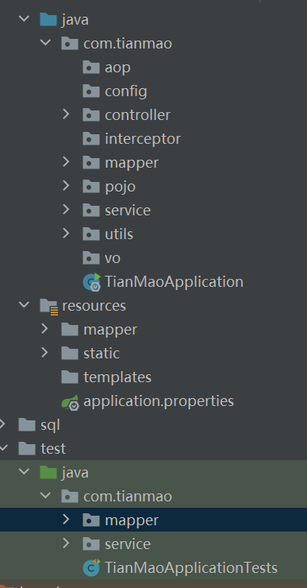

# 一、编程规范

[阿里代码规划使用手册](https://files.cnblogs.com/files/han-1034683568/%E9%98%BF%E9%87%8C%E5%B7%B4%E5%B7%B4Java%E5%BC%80%E5%8F%91%E6%89%8B%E5%86%8C%E7%BB%88%E6%9E%81%E7%89%88v1.3.0.pdf "点击下载")

## （一）命名风格

（有基础的可直接跳过）

（没必要全部遵守，毕竟不同的公司要求不同，但是大体上要符合要求，做到见名知义）

1、代码中的命名均不可以以**下划线或美元符号**开始，也不能以**下划线或美元符号**结束

> 反例：_name / _name / $Object / name_ / name$ / Object​\$

2、代码中的命名严禁汉语拼音和英文混合的方式（除非不得已），更不允许直接使用中文

> 正例：alibaba / taobao / youku / hangzhou 等国际通用的名称，可视同英文
>
> 反例： DaZhePromotion [打折]  /  getPingfenByName() [评分]  /  int 某变量 = 3 

3、类名使用 UpperCamelCase 风格， 必须遵从驼峰命名形式

> 正例：MarcoPolo / UserDO / XmlService / TcpUdpDeal / TaPromotion 
>
> 反例：macroPolo / UserDo / XMLService / TCPUDPDeal / TAPromotion 

4、常量命名全部大写，单词间用下划线隔开 

> 正例：MAX_STOCK_COUNT 
>
> 反例：MAX_COUNT 

5、包名统一使用小写

> 正例：应用工具类包名为 com.alibabba.open.util、类名为 MessageUtils

6、接口和实现类的命名各有两套规则：对于 Service 和 Dao 类，暴露出来的服务一定是接口，内部的实现类加上 Impl 以与接口相区分

> 正例：CacheServiceImpl 实现 CacheService 接口 

7、Service/Dao 各层方法命名规范

- 获取单个对象的方法用 get 做前缀
- 获取多个对象的方法用 list 做前缀
- 获取统计值的方法用 count 做前缀
- 插入的方法用 save/insert 做前缀
- 修改的方法用 update 做前缀

8、中括号是数组类型的一部分，数组定义如下：String[] args; 

> 反例：使用 String args[]的方式来定义 

9、抽象类命名使用 Abstract 或 Base 开头；异常类命名使用 Exception 结尾；测试类 命名以它要测试的类的名称开始，以 Test 结尾。

10、为了达到代码自解释的目标，任何自定义编程元素在命名时，使用尽量完整的单词 组合来表达其意。 

正例：从远程仓库拉取代码的类命名为 PullCodeFromRemoteRepository。 反例：变量 int a; 的随意命名方式。  

## （二）代码风格

一个项目代码分为前端代码和后端代码，前端代码包括：HTML、css、JavaScript、静态资源（图片、字体等）；后端代码主要是Java，其又分为三个结构层次：持久层（mapper）、业务层（service）和控制层（controller），除此之外还有一些特殊的代码，如工具类（utils）、实体类（pojo）等要另计。于是，为了使代码结构层次分明，便于开发和维护，就需要对代码进行如下截图的分类，之后会对各重要的包名做一个解释说明。



### 1.后端代码

[什么是三层结构](  [基础 | 三层架构与MVC模式 - 知乎 (zhihu.com)](https://zhuanlan.zhihu.com/p/101038664)   '点击跳转')

#### 1）aop：切面类文件包。

[什么是面向切面]( [Spring AOP详解 - 独具匠心 - 博客园 (cnblogs.com)](https://www.cnblogs.com/hongwz/p/5764917.html)  '点击跳转')

#### 2）config：配置包。

存放配置文件类

#### 3）controller：控制层包。

1. 所有的 Controller 类都必须以 `Controller` 后缀结尾
2. 所有的Controler 类都必须继承 `BaseController.java`
3. 项目异常统一在 `BaseController.java` 中进行管理
4. 控制层请求只要不涉及大量数据传输和不涉及用户隐私信息的使用 GET 请求
5. 控制层请求只要涉及大量数据传输和涉及用户隐私信息的使用 POST 请求

#### 4）interceptor：拦截器包。

所有与拦截器有关的操作都放置在这里

#### 5）mapper：持久层包。

1. 所有的持久层类都必须声明为接口
2. 所有接口方法前面都必须加上对应的参数与返回值注释，作者信息注释可加可不加

```java
    /**
     * @Author LiLin
     * @Date 2022/4/9 16:55
     * @Param address 收货地址实体类
     * @return 返回影响的行数
     * @Description 增加新的收货地址
     */
    Integer insert(Address address);
```

3. 所有持久层接口里的方法都必须以相应操作的英文单词开头。例如：

| 操作 | 命名                                                       |
| ---- | ---------------------------------------------------------- |
| 插入 | insertxxx --> `Integer insert(User user)`                  |
| 删除 | deletexxx --> `Integer deleteUserByUid(Integer uid)`       |
| 修改 | updatexxx --> `Integer updateInfoByUid(User user)`         |
| 查询 | selectxxx --> `User selectUserByUsername(String username)` |


#### 6）pojo：实体类包。

1. 所有的实体类必须继承 `BaseEntity.java`

2. 所有的实体类的 get / set方法、toString方法、equals方法都必须通过注解声明

   ```java
   @NoArgsConstructor
   @AllArgsConstructor
   @EqualsAndHashCode(callSuper = true)
   @Data
   public class User extends BaseEntity implements Serializable {}
   ```

3. 所有的实体属性必须加上对应的注释

   ```java
   public class User extends BaseEntity implements Serializable {
       private Integer uid;        //用户id
       private String username;    //用户名
       private String password;    //密码
       private String salt;        //盐值
       private String phone;       //电话号码
       private String email;       //电子邮箱
       private Integer gender;     //性别：0-女，1-男
       private String avatar;      //头像
       private Integer isDelete;   //是否删除：0-未删除，1-已删除
   }
   ```

#### 7）service：业务层包。

1. 项目开发过程中可能会遇到的异常问题都需要统一申明在 exception 包内，且统一继承`ServiceException.java`类并重载其方法
2. 所有的业务类都必须先声明接口，接口里定义相应的抽象方法，再定义一个实现类去实现其接口以及抽象方法
3. 所有的接口抽象方法和实现类实现方法前都需要加上对应的参数注释和返回值注释

```java
    /**
     * @author LiLin
     * @create 2022/4/5 14:04
     * @return 如果返回值为null说明登录失败；如果返回用户信息说明登录成功
     * @description 根据用户名和密码实现登录操作
     */
    User login(String username, String password);
```

```java
    /**
     * @return 如果返回值为null说明登录失败；如果返回用户信息说明登录成功
     * @author LiLin
     * @create 2022/4/5 14:04
     * @description 根据用户名和密码实现登录操作
     */
    @Override
    public User login(String username, String password) {
        //……
    }
```

4. 实现类实现方法里要给合适的步骤添加合适的注释。详情可见[注释规约](#notes)

#### 8）utils：工具包

所有的工具类都要放在这个包里面。

#### 9）vo：vo包

所有的vo代码都要放在这个包里面。[什么是vo]( [DO、VO、DTO...XXOO，你弄明白了么 - 知乎 (zhihu.com)](https://zhuanlan.zhihu.com/p/86047251)  '点击跳转')

### 2.测试文件

在每个功能单元完成后都==必须==先代码测试==才能==进行下一步操作。

#### 1）mapper：持久层测试包

1. 每个单元功能都只能对应一个测试方法
2. 每个功能类都只能对应一个测试类，不可全部放在一个类中
3. 测试方法名必须和被测试方法名保持一致
4. 可以不写注释

#### 2）service：业务层测试包

1. 每个单元功能都只能对应一个测试方法
2. 每个功能类都只能对应一个测试类，不可全部放在一个类中
3. 测试方法名必须和被测试方法名保持一致
4. 可以不写注释

### 3.前端代码（资源文件包）

> 前端代码（webapp）的静态文件（图片、字体、音视频等）最正确的做法其实是统一放在一个 static 包里面，这里是一个错误的演示（拷贝的别人的前端代码，请允许我偷一点点懒 :stuck_out_tongue_winking_eye:）

1. 项目的配置文件都要放在资源文件包内（resource包）
2. 持久层对应的映射文件都必须放在 com.tianmao.mapper 文件夹内，且映射文件名称必须和相应的持久层类名保持一致
3. 所有的前端代码有关的文件都放在 com.tianmao.static 包里面
4. 前端页面的 Ajax 代码都要声明在 `<body></body>` 的结束标签 `</body>` 前面
5. 所有的 js 代码都必须写在同一个 `<script></scrip>` 标签内
6. js 代码要在合适的位置写合适的注释。详情可见[注释规约](#notes)
7. 和数据库连接有关的信息要在 `application.properties` 配置文件内配置

# 二、<span id=notes>注释规约</span>

1、 所有的抽象方法（包括接口中的方法）必须要用 Javadoc 注释、除了返回值、参数、 异常说明外，还必须指出该方法做什么事情，实现什么功能。 说明：对子类的实现要求，或者调用注意事项，请一并说明。  

2、所有的枚举类型字段必须要有注释，说明每个数据项的用途。 

3、与其“半吊子”英文来注释，不如用中文注释把问题说清楚。专有名词与关键字保持 英文原文即可。

> 反例：“TCP 连接超时”解释成“传输控制协议连接超时”，理解反而费脑筋。 

4、 代码修改的同时，注释也要进行相应的修改，尤其是参数、返回值、异常、核心逻辑 等的修改。  

> 说明：代码与注释更新不同步，就像路网与导航软件更新不同步一样，如果导航软件严重滞后， 就失去了导航的意义。  

5、对于注释的要求：第一、能够准确反应设计思想和代码逻辑；第二、能够描述业务含 义，使别的程序员能够迅速了解到代码背后的信息。完全没有注释的大段代码对于阅读者形同 天书，注释是给自己看的，即使隔很长时间，也能清晰理解当时的思路；注释也是给继任者看 的，使其能够快速接替自己的工作。  

6、 好的命名、代码结构是自解释的，注释力求精简准确、表达到位。避免出现注释的 一个极端：过多过滥的注释，代码的逻辑一旦修改，修改注释是相当大的负担。  

```java
反例：
// put elephant into fridge 
put(elephant, fridge); 

方法名 put，加上两个有意义的变量名 elephant 和 fridge，已经说明了这是在干什么，语
义清晰的代码不需要额外的注释。
```

# 三、其他

1. 所有人都必须要写开发笔记，无论是开发前端代码、开发后端代码还是开发数据库的
2. 每个人在编写开发笔记时都要记录所开发的代码，只要记录自己开发的代码即可，需加上文字描述
3. 数据表的创建 sql 以及数据表的测试数据统一保存在 `src.sql` 包下的 `tian_mao.sql` 文件内
4. 推荐使用 markdown 语法做开发笔记，推荐使用 typora 记录笔记。您也可以选择您所喜欢的方式记录笔记，但要注意格式哦！！`^_^`