# 一 Docker简介

## 1.Docker简介

Docker 是基于 Go 语言实现的云开源项目。

Docker 的主要目标是 “Build，Ship and Run Any App, Anywhere”，也就是通过对应用组件的封装、分发、部署、运行等生命周期的管理，使用用户的 APP（可以是一个 Web 应用或者数据库应用）及其运行环境能够做到”**一次镜像，处处运行“**。

Linux 容器计数的出现就解决了这样一个问题，而 Docker 就是在它的基础上发展过来的。将应用打包成镜像，通过镜像成为运行在 Docker 容器上面的实例，而 Docker 容器在任何操作系统上都是一致的，这就实现了跨平台、跨服务器。只需要一次配置好环境就可以在其他机器上一键部署，大大简化了操作。

## 2.虚拟机和容器对比

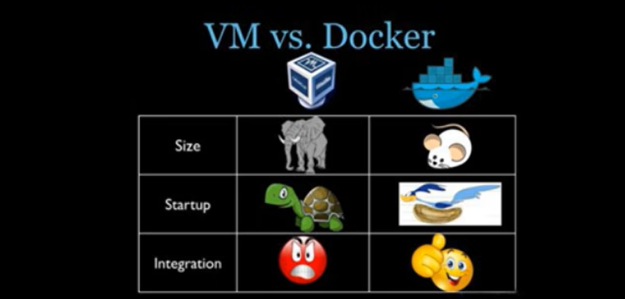

Docker 和传统虚拟化方式的不同之处：

- 传统虚拟机技术是虚拟出一套硬件后，在其上运行一个完整操作系统，在该系统上再运行所需要的应用进程。
- 容器内的应用进程直接运行于宿主的内核，容器内没有自己的内核，**且页没有进行硬件虚拟化**。因此容器要比传统虚拟机更加轻便。
- 每个容器之间相互隔离，每个容器有自己的文件系统，容器之间进程不会相互影响，能区分计算资源。

## 3.为什么Docker比虚拟机快

1.docker 有着比虚拟机更少的抽象层。

由于 docker 需要 Hypervisor（虚拟机）实现硬件资源虚拟化，运行在 docker 容器上的程序直接使用的都是实际物理机的硬件资源。因此在 CPU、内存利用率上 docker 就会有明显的效率优势。

2.docker 利用的是宿主机的内核，而不需要加载操作系统OS内核。

当新建一个容器时，docker 不需要和虚拟机一样重新加载一个操作系统内核，进而避免寻址、加载操作系统内核返回等比较费时费资源的过程，当新建一个虚拟机时，虚拟机软件需要加载 OS，返回新建过程是分钟级别的。而 docker 由于直接利用宿主机的操作系统，则省略了返回过程，因此新建一个 docker 容器只需要几秒钟。

## 4.Docker下载地址

Docker官网：http://www.docker.com

Docker Hub官网：https://hub.docker.com/

# 二 安装Docker

## 1.安装条件

Docker 并非是一个通用的容器工具，它依赖于已存在并运行的 Linux 内核环境。

Docker 实质上是在已经运行的 Linux 下制造了一个隔离的文件环境，因此它执行的效率几乎等同于所部署的 Linux 主机。

因此，Docker 必须部署在 Linux 内核的系统上。如果其它系统想部署 Docker 就必须安装一个 Linux 环境。

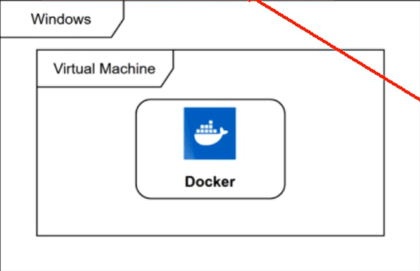

在 Windows 上部署 Docker 的方法都是先安装一个虚拟机，并在安装 Linux 系统的虚拟机中运行 Docker。

**前提条件：**

目前，CentOS 仅发行版本中的内核支持 Docker。Docker 运行在 CentOS7（64-bit）上，要求系统为64 位，Linux 系统内核版本为 3.8 以上，这里选用 CentOS7.x。

**查看系统内核：**

`uname`命令用于打印当前系统相关信息（内核版本号、硬件架构、主机名称和操作系统类型等）。

```shell
cat /etc/redhat-release
uname -r
```

## 2.Docker的基本组成

### 2.1 镜像（image）

Docker镜像（image）是一个**只读**模板。镜像可以用来创建 Docker 容器，**一个镜像可以创建多个容器**。也相当于是一个 root 文件系统，比如官方镜像 centos:7 就包含了完整的一套 centos:7 最小系统的 root 文件系统。相当于容器的”源代码“，**docker 镜像文件类似于 Java 的类模板，而 docker 容器实例类似于 Java 中 new 出来的实例对象。**

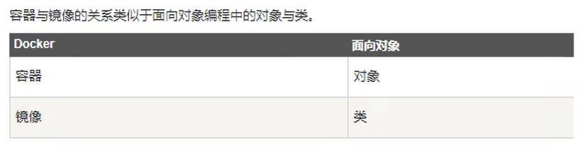

### 2.2 容器（container）

1. 从面向对象角度

   Docker 利用容器（container）独立运行的一个或一组应用，应用程序或服务运行在容器里面，容器就类似于一个虚拟化的运行环境，**容器是用镜像创建的运行实例**。就像是 Java 中的类和实例对象一样，镜像是静态的定义，容器是镜像运行时的实体。容器为镜像提供了一个标准的和隔离的运行环境，它可以被启动、开始、停止、删除。每个容器都是相互隔离的、保证安全的平台。

2. 从镜像容器角度

   **可以把容器看成是一个简易版的 Linux 环境（包括 root 用户权限、进程空间、用户空间和网络空间等）**和运行在其中的应用程序。

### 2.3 仓库（repository）

仓库（repository）是**集中存放镜像文件的场所**。

类似于 

- Maven 仓库，存放各种 jar 包的地方。
- GitHub仓库，存放各种 git 项目的地方。

Docker 公司提供的官方 registry 被称为 Docker Hub，存放各种镜像模板的地方。

仓库分为公开仓库（Public）和私有仓库（Private）两种形式，**最大的公开仓库是 Docker Hub（https://hub.docker.com/）**，存放了数量庞大的镜像供用户下载。

国内的公开仓库包括阿里云、网易云等。

## 3.Docker工作原理

Docker 是一个 Client-Server 结构的系统，Docker 守护进程运行在主机上，然后通过 Socket 连接从客户端访问，守护进程从客户端接受命令并管理运行在主机上的容器。**容器，是一个运行时环境，类比于集装箱**。

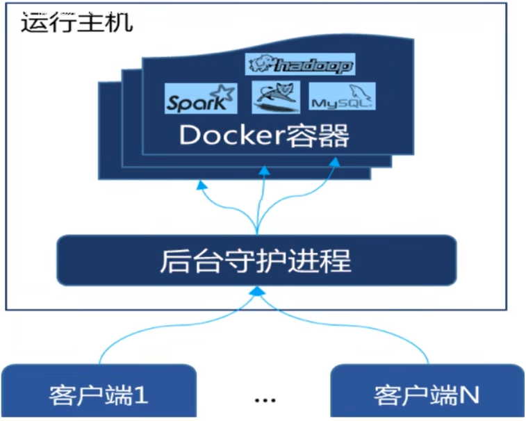

## 4.Docker平台架构图解

Docker 是一个 C/S 模式的架构，后端是一个松耦合架构，各个模块各司其职。

Docker 运行的基本流程为：

1. 用户是使用 Docker Client 和 Docker Daemon 建立通信，并发送请求给后者。
2. Docker Daemon 作为 Docker 架构中的主体部分，首先提供 Docker Server 的功能使其可以接受 Docker Client 的请求。
3. Docker Engine 执行 Doucker 内部的一系列工作，每一项工作都是以一个 Job 的形式存在。
4. Job 的运行过程中，当需要容器镜像时，则从 Docker Registry 中下载镜像，并通过镜像管理驱动 Graph Driver 将下载镜像以 Graph 的形式存储。
5. 当需要为 Docker 创建网络环境时，通过网络管理驱动 Network Driver 创建并配置 Docker 容器网络环境。
6. 当需要限制 Docker 容器运行资源或执行用户指令等操作时，则通过 Exec Driver 来完成。
7. Libcontainer 是一项独立的容器管理包，Network Driver 以及 Exec Driver 都是通过 Libcontainer 来实现具体对容器进行的操作。

## 5.安装步骤

1. 确定是 CentOS7 及以上版本

   ```shell
   cat /etc/redhat-release
   ```

2. 卸载旧版本 Docker

   ```shell
   yum remove docker \
                     docker-client \
                     docker-client-latest \
                     docker-common \
                     docker-latest \
                     docker-latest-logrotate \
                     docker-logrotate \
                     docker-engine
   ```

3. yum 安装 gcc 相关

   ```shell
   yum -y install gcc
   yum -y install gcc-c++
   ```

4. 安装需要的软件包

   ```shell
   yum install -y yum-utils
   ```

5. 设置 stable 镜像仓库

   ```shell
   yum-config-manager --add-repo http://mirrors.aliyun.com/docker-ce/liux/centos/docker-ce.repo
   ```

6. 更新 yum 软件包索引

   ```shell
   yum makecache fast
   ```

7. 安装 DOCKER CE

   ```shell
   yum -y install docker-ce docker-ce-cli containerd.io
   ```

8. 启动 docker

   ```shell
   systemctl start docker
   ```

9. 测试

   ```shell
   docker version
   docker run hello-world
   ```

10. 卸载 docker

    ```shell
    systemctl stop docker
    yum remove docker-ce docker-ce-li containerd.io
    rm -rf /var/lib/docker
    rm -rf /var/lib/containerd
    ```

## 6.阿里云镜像加速

1. 注册一个属于自己的阿里云账户（可复用淘宝账户）。

2. 获得加速器地址链接。

3. 粘贴脚本直接运行。

   ```shell
   mkdir -p /etc/docker
   ```

   ```shell
   tee /etc/docker/daemon.json <<-'EOF'
   {
     "registry-mirrors": ["https://98iqfzs4.mirror.aliyuncs.com"]
   }
   EOF
   ```

   ```shell
   systemctl daemon-reload
   systemctl restart docker
   ```

4. 重启服务器。

> https://cr.console.aliyun.com/cn-hangzhou/instances/mirrors

# 三 Docker常用命令

## 1.帮助启动类命令

- 启动 docker：`systemctl start docker`
- 停止 docker：`systemctl stop docker`
- 重启 docker：`systemctl restart docker`
- 查看 docker 状态：`systemctl status docker`
- 开启启动：`systemctl enable docker`
- 查看 docker 概要信息：`docker info`
- 查看 docker 总体帮助文档：`docker --help`
- 查看 docker 命令帮助文档：`docker 具体命令 --help`

## 2.镜像命令

- 列出本地主机上的镜像：`docker images`

  - `-a`：列出本地所有的镜像（含历史镜像层）。
  - `-q`：只显示镜像 ID。

  > 同一仓库源可以有多个 TAG 版本，代表这个仓库源的不同个版本。使用 `REPOSITORY:TAG` 来定义不同的镜像。
  >
  > 如果不指定一个镜像的版本标签，例如只使用 Ubuntu，docker 将默认使用 `ubuntu:latest` 镜像。

- 查询远程主机镜像：`docker search 镜像名字`

  - `--limit`：只列出 N 个镜像，默认 25 个。
  - `docker search --limit 5 redis`

- 远程拉取镜像：`docker pull 镜像名字`

  - `docker pull 镜像名[:TAG]`
  - `docker pull 镜像名`（没有 TAG 就是最新版本）

- 查看镜像/容器/数据卷所占的空间：`docker system df`

- 删除镜像：`docker rmi 镜像ID`

  - 删除单个：`docker rmi -f 镜像ID`
  - 删除多个：`docker rmi -f 镜像1:TAG 镜像2:TAG`
  - 删除全部：`docker rmi -f $(docker images -qa)`

面试题：谈谈 docker 虚悬镜像是什么？

虚悬镜像是指仓库名、标签都是 `<none>` 的镜像，俗称虚悬镜像（Dangling Image）。

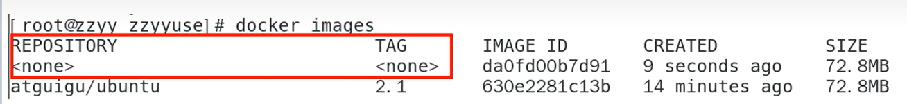

## 3.容器命令

### 3.1 新建和启动容器

```shell
docker run [OPTIONS] IMAGE [COMMAND] [ARG...]
```

OPTIONS 说明（常用）：

- `--name="容器新名字"`：为容器指定一个名称。

- `-d`：后台运行容器并返回容器 ID，也即启动守护式容器（后台运行）。

  - `-i`：以交互模式运行容器。通常与 `-t` 同时使用。
  - `-t`：为容器重新分配一个伪输入终端，通常与 `-i` 同时使用。

  > 启动交互式容器：前台有伪终端，等待交互。

- `-P`：大写 P，随机端口映射。

- `-p`：小写 p，指定端口映射。

举例：`docker run -it centos bash`

### 3.2 列出当前正在运行的容器

```shell
docker PS [OPTIONS]
```

OPTIONS 说明（常用）：

- `-a`：列出当前所有正在运行的容器和历史上运行过的。
- `-l`：显式最近创建的容器。
- `-n`：显式最近 n 个创建的容器。
- `-q`：静默模式，只显示容器编号。

### 3.3 退出容器

两种退出方式：

- `exit`：run 进去容器，exit 退出，容器停止。
- 快捷键 ctrl+p+q：run 进去容器，ctrl+p+q 退出，容器不停止。

### 3.4 启动已停止运行的容器

```shell
docker start 容器ID或容器名
```

### 3.5 重启容器

```shell
docker restart 容器ID或容器名
```

### 3.6 停止容器

```shell
docker stop 容器ID或容器名
```

### 3.7 强制停止容器

```shell
docker kill 容器ID或容器名
```

### 3.8 删除已停止的容器

```shell
docker rm 容器ID
```

一次性删除多个容器实例：

- `docker rm -f $(docker ps -a -q)`
- `docker ps -a -q | xargs docker rm`

## 4.重要

### 4.1 启动守护式容器（后台服务器）

在大部分的场景下，会希望 docker 的服务是在后台运行的，就可以通过 `-d` 指定容器的后台运行模式。

```shell
docker run -d 容器名
```

问题：使用命令 `docker ps -a` 进行查看会发现，**容器已经退出**。

说明：**docker 容器后台运行，必须要有一个前台进程。**

容器运行的命令如果不是会一直挂起的命令（如运行 top、tail），就会自动退出。这是 docker 的机制设置，比如 web 容器，以 nginx 为例，正常情况下，配置启动服务只需要启动响应的 service 即可，例如 `service nginx start`。但是，这样做 nginx 为后台进程模式运行，就会导致 docker 前台没有运行的应用，在容器后台启动后，会因为没有工作而导致自杀。

**所以，最佳的解决方案是：将要运行的程序以前台进程的形式存在，常见的就是命令行模式，表示还有交互操作，别中断。**

redis 前后台启动举例：

- 前台交互式启动：`docker run -it redis:6.0.8`
- 后台守护式启动：`docker run -d redis:6.0.8`

### 4.2 查看容器日志

```shell
docker logs 容器ID
```

### 4.3 查看容器内运行的进程

```shell
docker top 容器ID
```

### 4.4 查看容器内部细节

```shell
docker inspect 容器ID
```

### 4.5 进入正在运行的容器并以命令行交互

```shell
docker exec -it 容器ID bashShell
```

```shell
docker attach 容器ID
```

两个命令的区别：

- `attach` 直接进入容器启动命令的终端，不会启动新的进程，用 exit 退出，会导致容器的停止。
- `exec` 是在容器中打开新的终端，并且可以启动新的进程，用 exit 退出，不会导致容器的停止。

> 推荐使用 `docker exec` 命令，因为退出容器终端，不会导致容器的停止。

### 4.6 从容器内拷贝文件到主机上

```shell
docker cp 容器ID:容器内路径 目的主机路径
```

### 4.7 导入和导出容器

- `export`：导出容器的内容作为一个 tar 归档文件（与 `import` 命令相对）。
- `import`：从 tar 包中的内容创建一个新的文件系统再导入为镜像（与 `export` 命令相对）。

案例：

```shell
docker export 容器ID > 文件名.tar
```

```shell
cat 文件名.tar | docker import - 镜像用户/镜像名:镜像版本号
```

# 四 Docker镜像

## 1.什么是镜像

镜像是一种轻量级、可执行的独立软件包，它包含运行某个软件所需要的所有内容，我们把应用程序和配置依赖打包好形成一个可交付的运行环境（包括代码、运行时需要的库、环境变量和配置之文件等），这个打包好的运行环境就是 image 镜像文件。

只有通过这个镜像文件才能生成 Docker 容器实例（类似 Java 中 new 出来的一个对象）。

### 1.1 UnionFS（联合文件系统）

Union 文件系统（UnionFS）是一种分层、轻量级并且高性能的文件系统，它支持**对文件系统的修改作为一次提交来一层层的叠加**，可以同时将不同目录挂载到同一个虚拟文件系统下（unite several directories into a single virtual filesystem），Union 文件系统是 Docker 镜像的基础。**镜像可以通过分层来进行继承，基于基础镜像（没有父镜像），可以制作各种具体的应用镜像。

> 特性：一次同时加载多个文件系统，但是从外面看，只能看到一个文件系统，联合加载会把各层文件系统叠加起来，这样最终

### 1.2 Docker镜像加载原理

docker 的镜像实际上由一层一层的文件系统组成，这种层级的文件系统就是 UnionFS。

bootfs（boot file system）主要包含 bootloader 和 kernel，bootloader 主要是引导加载 kernel，Linux 刚启动时会加载 bootfs 文件系统，**在 Docker 镜像的最底层是引导文件系统 bootfs**。这一层与典型的 Linux/Unix 系统是一样的，包含 boot 加载器和内核。当 boot 加载完成之后整个内核就都在内存中了，此时内存的使用权已由 bootfs 转交给内核，此时系统也会卸载 bootfs。

rootfs（root file system），在 bootfs 之上，包含的就是典型 Linux 系统中的 /dev、/proc、/bin、/etc 等标准目录和文件。rootfs 就是各种不同的操作系统发行版，比如 Ubuntu、CentOS 等。

问题：平时安装进虚拟机的 CentOS 都是好几个G，为什么 docker 才 200M？

对于一个精简的 OS，rootfs 可以很小，只需要包含最基本的命令、工具和程序库就可以了，因为底层直接用 Hots 的 kernel，其本身只需要提供 rootfs 即可。由此可见对于不同的 Linux 发行版，bootfs 基本一致，rootfs 会有差别，因此不同的发行版可以公用 bootfs。

## 2.Docker镜像操作实例

`docker commit`：提交容器副本使之成为一个新的镜像。

```shell
docker commit -m="提交的描述信息" -a="作者" 容器ID 要创建的目标镜像名:[标签名]
```

案例演示，Ubuntu安装 vim：

1. 从 hub 上下载 Ubuntu 镜像到本地并成功运行。

2. 原始默认的 Ubuntu 镜像是不带 vim 命令的。

3. 连通外网的情况下，安装 vim。

   ```shell
   apt-get update
   apt-get -y install vim
   ```

4. 安装完成后，commit 到自定义的新镜像。

   ```shell
   docker commit -m="add vim cmd" -a="zzyy" 5fa45c3697b7 test/myubuntu:1.1
   ```

5. 启动新镜像并和原来的对比。

## 3.本地镜像发布到阿里云

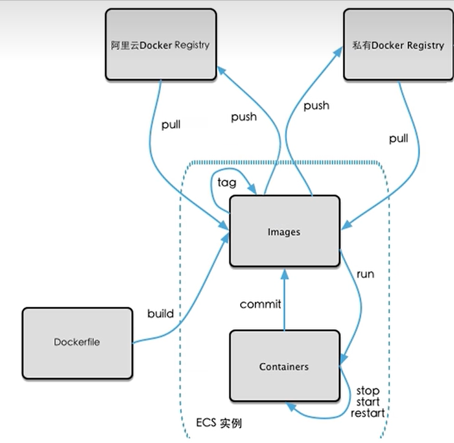

1. 本地镜像素材原型

   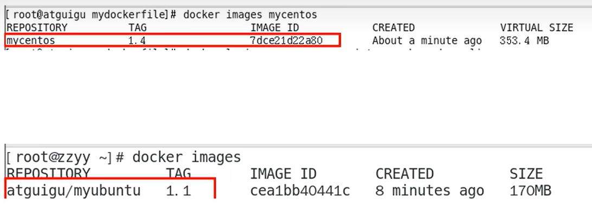

2. 阿里云开发者平台

   https://promotion.aliyun.com/ntms/act/kubernetes.html

3. 创建仓库镜像

   1. 选择控制台，进入容器镜像服务。
   2. 选择个人实例。
   3. 命名空间。
   4. 自定义仓库名称。
   5. 进入管理界面获得脚本。

4. 将镜像推送到阿里云

   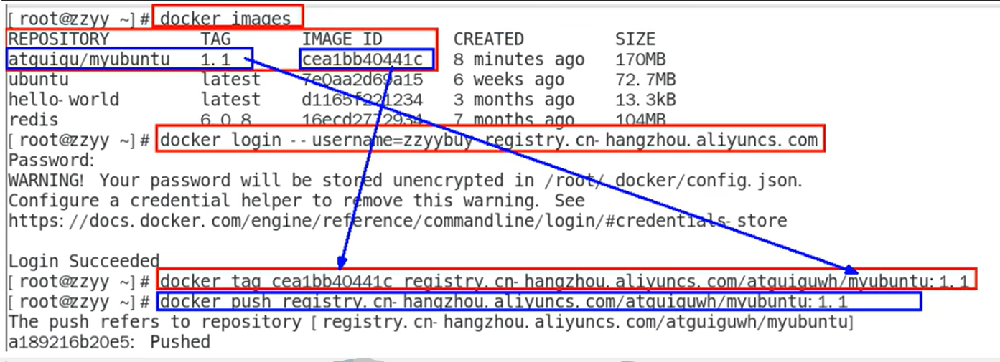

## 4.本地镜像发布到私有库

本地镜像发布到私有库流程：


Docker Register：

1. 官方 Docker Hub 地址：https://hub.docker.com/，但因为中国大陆访问慢且有被阿里云取代的趋势，不主流。
2. DockerHub、阿里云这样的公共镜像仓库可能不太方便，设计机密的公司不可能提供镜像给公网，所以需要创建一个本地私人仓库给团队使用，基于公司内部项目构建镜像。
3. Docker Register 是官方提供的工具，可以用于构建私有镜像仓库。

构建私有仓库：

1. 下载镜像 Docker Register。

   ```shell
   docker pull register
   ```

2. 运行私有库 Register，相当于本地有个私有 Docker Hub。

   

3. 案例演示创建一个新镜像，Ubuntu 安装 ifconfig 命令。

   1. 从 hub 上下载 Ubuntu 镜像到本地上并成功运行。

   2. 原始的 Ubuntu 镜像是不带 ifconfig 命令的。

   3. 在外网连通的情况下，安装 ifconfig 命令并测试通过。

      ```shell
      apt-get update
      apt-get install net-tools
      ```

   4. 安装完成后，commit 自己的新镜像。

      ```shell
      docker commit -m="ifconfig cmd add" -a="zzyy" a69d7dheu86 zzyyubuntu:1.2
      ```

   5. 启动新镜像并和原来的对比。

4. curl 验证私服库上有什么镜像。

   ```shell
   curl -XGET http://192.168.111.162:5000/v2/_catalog
   ```

5. 将新镜像 zzyyubuntu:1.2 修改符合私服规范的 Tag。

   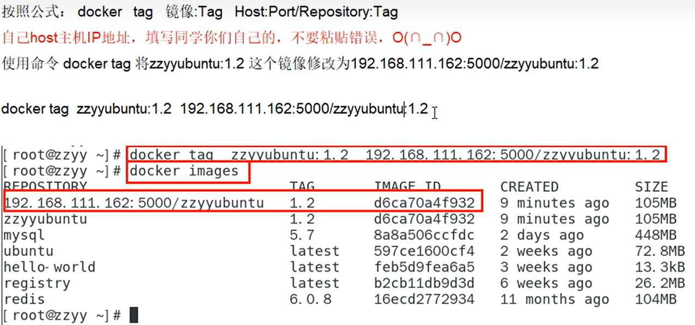

6. 修改配置文件使之支持 http。

   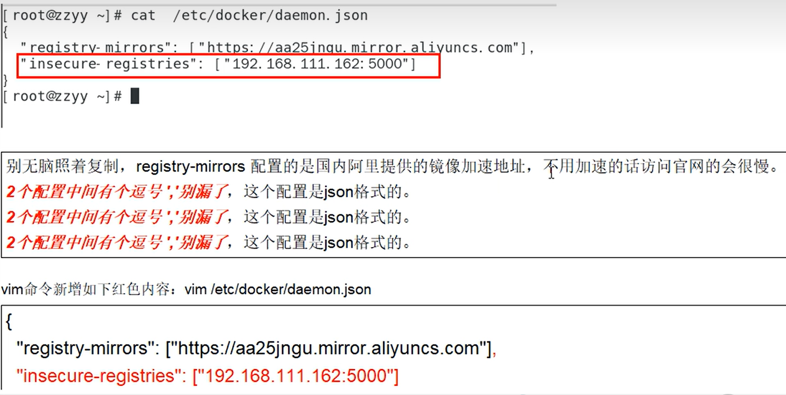

7. push 推送到私服库。

   ```shell
   docker push 192.168.111.162:5000/zzyyubuntu:1.2
   ```

8. curl 验证私服库上有什么镜像。

   ```shell
   curl -XGET http://192.168.111.162:5000/v2/_catalog
   ```

9. pull 到本地运行。

   ```shell
   docker pull 192.168.111.167:5000/zzyyubuntu:1.2
   ```

# 五 Docker容器数据卷

## 1.什么是容器数据卷

有点类似 Redis 里面的 rdb 和 aof 文件，将 docker 容器内的数据保存进宿主机的磁盘中。

卷就是目录或文件，存在于一个或多个容器中，由 docker 挂载到容器，但不属于联合文件系统，因此能够绕过 Union File System 提供一些用于持续存储或共享数据的特性。

卷的设计目的就是**数据的持久化**，完全独立于容器的生存周期，因此 Docker 不会在容器删除时删除其挂载的数据卷。

## 2.容器数据卷的作用

将运用和运行的环境打包成镜像，run 后形成容器实例运行，但是我们对数据的要求是**希望是持久化的**。

Docker 容器产生的数据，如果不备份，那么当容器实例删除后，容器内的数据自然也就没有了，为了能保存数据在 docker 中，我们使用卷。

特点：

1. 数据卷可在容器之间共享或重用数据。
2. 卷中的更改可以直接实时生效。
3. 数据卷中的更改不会包含在镜像的更新中。
4. 数据卷的生命周期一直持续到没有容器使用它为止。

## 3.容器卷案例

### 3.1 宿主机与容器之间映射添加容器卷

```shell
docker run -it --privileged=true -v /宿主机绝对路径目录:/容器内目录 镜像名
```

查看数据卷是否挂载成功：

```shell
docker inspect 容器ID
```

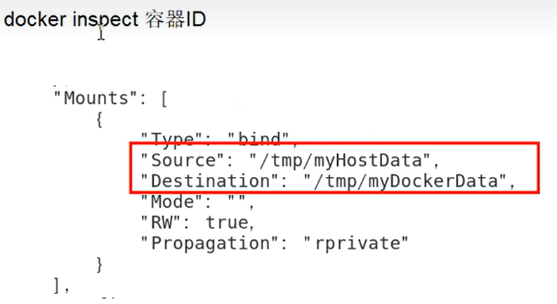

容器和宿主机之间的数据共享：

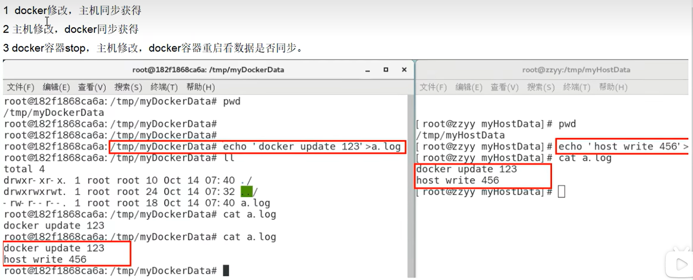

### 3.2 读写规则与映射添加说明

允许读和写（默认）：

```shell
docker run -it --privileged=true -v /宿主机绝对路径目录:/容器内目录:rw 镜像名
```

> 默认同上案例，默认就是 rw

只允许读或写：

```shell
docker run -it --privileged=true -v /宿主机绝对路径目录:/容器内目录:ro 镜像名
```

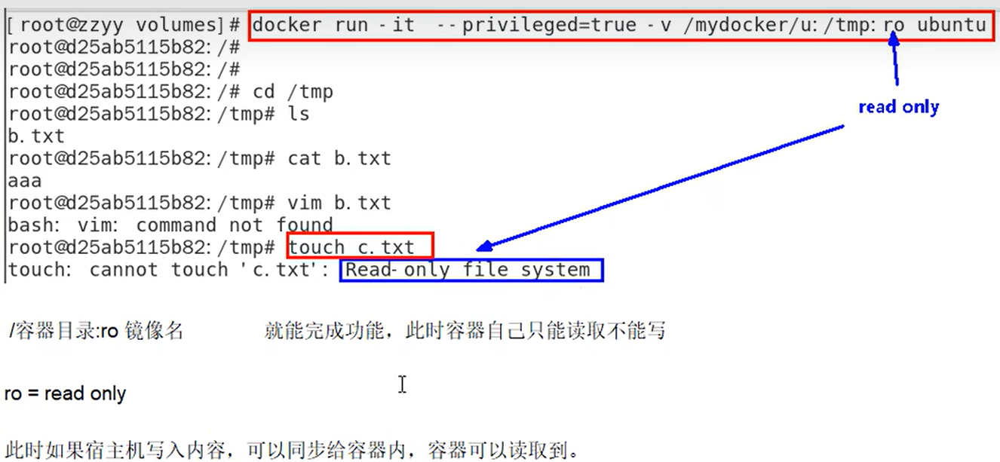

## 4.卷的继承和共享

容器1完成与宿主机的映射：

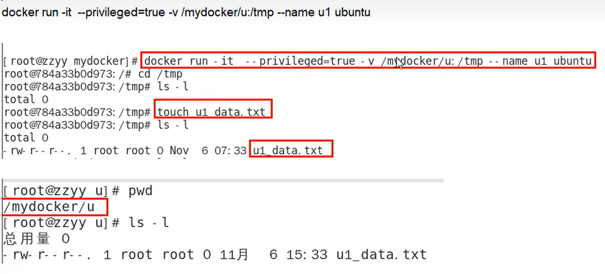

容器2继承容器1的卷规则：

```shell
docker run -it -privileged=true --volumes-from 父类 -name u2 ubuntu
```


