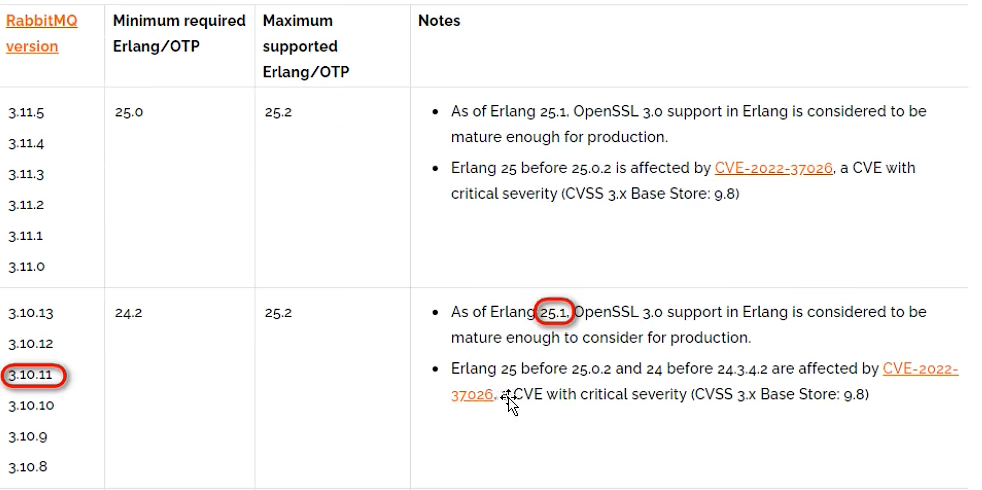
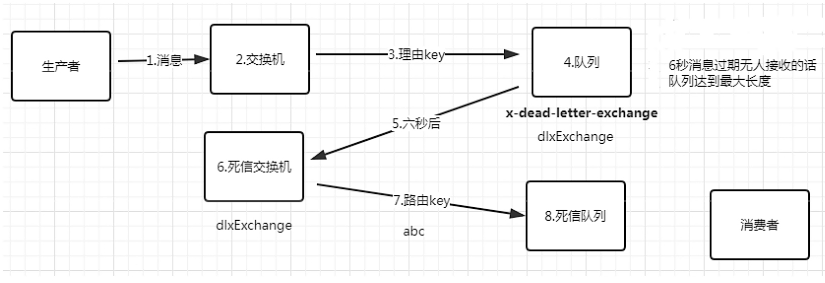

# 1.简介

RabbitMQ是一个广泛使用的**消息服务器**，采用Erlang语言实现，是一种开源的实现AMQP（高级消息队列协议）的消息中间件。

RabbitMQ最初起源于金融系统，它的性能和稳定性都非常出色。

AMQP协议（http://www.amqp.org），即Advanced Message Queuing Protocol，高级消息队列协议，是应用层协议的一个开发标准，为面向消息的中间件设计。

## 1.2 相关网址

官网：https://www.rabbitmq.com

Github：https://github.com/rabbitmq

## 1.3 消息中间件

简单来说消息中间件（Message Queue）就是指保存数据的一个容器（服务器），可以用于两个系统之间的数据传递。

消息中间件一般有三个主要角色：生产者、消费者、消息代理（消息队列、消息服务器）。


生产者发送消息到消息服务器，然后消费组从消息代理（消息队列）中获取数据并进行处理。

## 1.4 常用的消息中间件

目前主流的几个消息中间件：

- RabbitMQ
- Kafka（大数据领域）
- RocketMQ（阿里巴巴开源，献给Apache组织）
- Pulsar（最近一两年流行起来的）

# 2.MQ的应用场景

## 2.1 异步处理

一开始：

**下订单 -> 加积分 -> 发红包 -> 发手机短信**

RabbitMQ：

**下订单 -> 向MQ发送消息 -> 积分系统 、红包系统、手机短信系统接收消息**


同步会阻塞（会造成等待），异步是非阻塞（不会等待）。

大流量高并发请求、批量数据传递，就可以采用异步处理，提升系统吞吐量。

## 2.2 系统解耦

多个系统之间，不需要直接交互，通过消息进行业务流转。


## 2.3 流量削峰

高负载请求/任务的缓冲处理。


## 2.4 日志处理

主要是使用 Kafka 处理器来做。

日志处理是指将消息队列用于在日志处理中，比如 Kafka 解决大量日志传输的问题：`loger.info()`。

ELK 日志处理解决方案：

`loger.error()` -> `logstash` 收集消息 -> 发送消息的 Kafka -> Elastic Search

# 3.RabbitMQ运行环境搭建

RabbitMQ 是使用 Erlang 语言开发，所以要先下载 Erlang。

## 3.1 Erlang及RabbitMQ安装版本的选择

**下载时一定要注意版本兼容性**。

版本兼容说明地址：https://www.rabbitmq.com/which-erlang.html

我们选择的版本：



## 3.2 下载Erlang

Erlang 官网：https://www.erlang.org/

Linux下载：

wget：https://github.com/erlang/otp/releases/download/OTP-25.1.1/otp src 25.1.1.tar.gz

> 说明：wget 是 Linux 命令，可以用来下载软件

## 3.3 安装Erlang

1. 安装 Erlang 前先安装 Linux 依赖库

   ```
   yum -y install make gcc gcc-c++ kernel-devel m4 ncurses-devel openssl-devel
   ```

   > 说明：yun -y install 安装 linux的一些依赖库的命令，-y 表示自动确认

2. 解压 Erlang 压缩包文件

   ```
   tar -zxvf opt_src_25.1.1.tar.gz
   ```

3. 配置

   切换到解压的目录下，运行相应命令

   ```
   cd otp_src_25.1.1
   ./configure
   ```

4. 编译

   ```
   make
   ```

5. 安装

   ```
   make install
   ```

6. 安装好了 erlang 后可以将解压的文件夹删除

   ```
   rm -rf ....
   ```

## 3.4 安装RabbitMQ

解压RabbitMQ的压缩包，即安装完成，无需再编译。

```
tar -xvf rabbitmq-server-generic-unix-3.10.11.tar.xz -C /usr/local
```

> -C 选项是指定解压目录，如果不指定就会解压到当前目录。

此时RabbitMQ就安装好了。

# 4.启动及停止RabbitMQ

## 4.1 启动RabbitMQ

切换到安装目录的`sbin`目录下：

```shell
./rabbitmq-server -detached #启动程序
```

说明：

- `-detached`：表示将在后台启动运行 rabbitmq，不加该参数表示前台启动。

- rabbitmq 的运行日志存放在安装目录的 var 目录下

  > 现在的目录是：`/usr/local/rabbitmq_server-3.10.11/log/rabbitmq/`

## 4.2 查看RabbitMQ的状态

切换到 `sbin` 目录下执行：

```shell
./rabbitmqctl -n rabbit status
```

> `-n rabbit` 是指定节点名称为 rabbit，目前只有一个节点，节点名默认为 rabbit，此处 `-n rabbit` 也可以省略。

## 4.3 停止 RabbitMQ

切换到 `sbin` 目录下执行：

```shell
./rabbitmq shutdown
```

## 4.4 配置环境变量

编辑环境遍历文件：

```shell
vi /etc/profile
```

添加如下命令：

```shell
# add rabbitmq to system path
RABBIT_HOME=/usr/local/rabbitmq_server-3.10.11
PATH=$PATH:$RABBIT_HOME/sbin

export RABBIT_HOME PATH
```

刷新环境变量：

```shell
source /etc/profile
```

# 5.RabbitMQ管理命令

- `./rabbitmqctl` 是一个管理命令，可以管理 rabbitmq 的很多操作。
- `./rabbitmqctl help` 可以查看有哪些操作。
- `./rabbitmqctl help 子命令名称` 可以用来查看具体子命令。

## 5.1 用户管理

用户管理包括增加用户、删除用户、查看用户列表、修改用户密码。

这些操作都是通过 rabbitmqctl 管理命令来实现。

查看帮助：

```shell
rabbitmqctl add_user --help
```

相应的命令：

1. 查看当前用户列表

   ```shell
   rabbitmqctl list_users
   ```

2. 新增一个用户

   ```shell
   语法：rabbitmqctl add_user username password
   示例：rabbitmqctl add_user tom 123abc
   ```

3. 设置用户角色

   ```shell
   语法：rabbitmqctl set_user_targs User Tag
   示例：rabbitmqctl set_user_tags admin administrator
   ```

   > 说明：此处设置用户的角色为管理员角色。

4. 设置用户权限

   ```shell
   rabbitmqctl set_permissions -p /admin ".*" ".*" ".*"
   ```

   > 此操作是设置 admin 用户拥有操作虚拟主机下的所有权限

5. 查看用户权限

   ```shell
   ./rabbitmqctl list_permissions
   ```

# 6.Web管理后台

RabbitMQ 有一个 web 后台管理程序，这个管理后台是以插件的方式提供的，启动后台 web 管理功能，切换到 `sbin` 目录下执行。

## 6.1 启动管理后台

- 查看 rabbitmq 的插件列表

  ```shell
  rabbitmq-plugins list
  ```

- 启动管理后台

  ```shell
  rabbitmq-plugins enable rabbitmq management
  ```

- 禁用管理后台

  ```shell
  rabbitmq-plugins disable rabbitmq_management
  ```

## 6.2 防火墙操作

- 检查防火墙状态

  ```shell
  systemctl status firewalld
  ```

- 关闭防火墙，Linux 重启后会失效

  ```shell
  systemctl stop firewalld
  ```

- 防火墙置为不用，Linux重启后，防火墙服务不自动启动，依然不可用

  ```shell
  systemctl disable firewalld
  ```

## 6.3 访问

`http://192.168.15.129:15672`

> 如果使用默认用户 guest、密码 guest 登录，会提示 `User can only log in via localhost`。
>
> 说明 guest 用户只能从 localhost 本机登录，所以不要使用该用户。

# 7.RabbitMQ工作模型


broker 相当于 MySQL 服务器，virtual host 相当于数据库（可以有多个数据库），queue 相当于表，消息相当于记录。

消息队列有三个核心要素：**消息生产者**、**消息队列**、**消息消费者**。

- 生产者（Producer）：发送消息的应用（Java程序，也可能是别的语言写的程序）。
- 消费者（Consumer）：接收消息的应用（Java程序，也可能是别的语言写的程序）。
- 代理（Broker）：就是消息服务器，RabbitMQ Server 就是 Message Broker。
- 连接（Connection）：连接 RabbitMQ 服务器的 TCP 长连接。
- 信道（Channel）：连接中的一个虚拟通道，消息队列发送或接收消息时，都是通过信道进行的。
- 虚拟主机（Virtual host）：一个虚拟分组，在代码中就是一个字符串，当多个不同的用户使用同一个 RabbitMQ 服务时，可以划分出多个 Virtual host，每个用户在自己的 Virtual host 创建 exchange/queue 等（分类比较清晰，相互隔离）。
- 交换机（Exchange）：交换机负责从生产者接收消息，并根据交换机类型分发到对应的消息队列中，起到一个路由的作用。
- 路由键（Routing key）：交换机根据路由键来决定消息分发到哪个队列，路由键是消息的目的地址。
- 绑定（Binding）：绑定是队列和交换机的一个关联连接（关联关系）。
- 队列（Queue）：存储消息的缓存。
- 消息（Message）：由生产者通过 RabbitMQ 发送给消费者的信息（消息可以是任何数据、字符串、user 对象、json 串等）。

# 8.RabbitMQ交换机类型

Exchange（X）可翻译成交换机/交换器/路由器

## 8.1 RabbitMQ交换器（Exchange）类型

1. Fanout Exchange（扇形交换机）
2. Direct Exchange（直连交换机）
3. Topic Exchange（主题交换机）
4. Headers Exchange（头部交换机）

## 8.2 Fanout Exchange

### 8.2.1 介绍

Fanout 扇形的，散开的；扇形交换机。

投递到所有绑定的队列，不需要路由键，不需要进行路由键的匹配，相当于广播、群发。


### 8.2.2 实例

创建发送方：

1.创建项目，导入依赖

```xml
<dependency>
    <groupId>org.springframework.boot</groupId>
    <artifactId>spring-boot-starter-amqp</artifactId>
</dependency>
```

2.配置主机、端口、用户名、密码等信息

```yml
server:
  port: 8080

spring:
  application:
    name: RabbitMQ_01_FanoutExchange
  
  #rabbitmq
  rabbitmq:
    host: 192.168.15.129
    port: 5672
    username: admin
    password: 123abc
    virtual-host: testing
```

3.在 `RabbitConfig.java` 配置类里配置交换机

```java
@Configuration
public class RabbitConfig {
    //1.定义交换机
    @Bean
    public FanoutExchange fanoutExchange() {
        return new FanoutExchange("exchange.fanout");
    }

    //2.定义队列
    @Bean
    public Queue queueA() {
        return new Queue("queue.fanout.a");
    }

    @Bean
    public Queue queueB() {
        return new Queue("queue.fanout.b");
    }

    //3.绑定交换机和队列
    @Bean
    public Binding bindingA(FanoutExchange fanoutExchange, Queue queueA) {
        //绑定队列A到扇形交换区
        return BindingBuilder.bind(queueA).to(fanoutExchange);
    }

    @Bean
    public Binding bindingB(FanoutExchange fanoutExchange, Queue queueB) {
        //绑定队列B到扇形交换区
        return BindingBuilder.bind(queueB).to(fanoutExchange);
    }
}
```

4.配置 `MessageService.java` 类，定义发送消息的方法

```java
@Component
@Slf4j
public class MessageService {
    @Resource
    private RabbitTemplate rabbitTemplate;

    public void sendMsg() {
        String msg = "hello rabbitMQ";
        Message message = new Message(msg.getBytes());
        rabbitTemplate.convertAndSend("exchange.fanout", "", message);
        log.info("消息发送完毕，发送时间为：{}", new Date());
    }
}
```

5.在启动类里调用方法发送消息

```java
@SpringBootApplication
public class RabbitMq01FanoutExchangeApplication implements ApplicationRunner {
    @Autowired
    private MessageService messageService;

    public static void main(String[] args) {
        SpringApplication.run(RabbitMq01FanoutExchangeApplication.class, args);
    }

    @Override
    public void run(ApplicationArguments args) throws Exception {
        messageService.sendMsg();
    }
}
```

创建消息接收方：

1.创建项目，导入依赖

```xml
<dependency>
    <groupId>org.springframework.boot</groupId>
    <artifactId>spring-boot-starter-amqp</artifactId>
</dependency>
```

2.配置主机、端口、用户名、密码等信息

```yml
server:
  port: 8080

spring:
  application:
    name: RabbitMQ_01_FanoutExchange
  
  #rabbitmq
  rabbitmq:
    host: 192.168.15.129
    port: 5672
    username: admin
    password: 123abc
    virtual-host: testing
```

3.创建消息接收类 `ReceiveMessage.java`

```java
@Component
@Slf4j
public class ReceiveMessage {

    //监听 a, b 队列消息
    @RabbitListener(queues = {"queue.fanout.a", "queue.fanout.b"})
    public void receiveMessage(Message message) {
        //获取消息体
        byte[] body = message.getBody();
        //将消息体转换为字符数组
        String msg = new String(body);
        log.info("接收到的消息：{}", msg);
    }
}
```

> `ReceiveMessage.java` 被声明为组件后，Spring框架会自动装配与执行里面的方法。

## 8.3 Direct Exchange

### 8.3.1 介绍

根据路由键精确匹配（一模一样）进行路由消息队列：


### 8.3.2 实例

创建发送方：

1.创建项目，导入依赖

```xml
<dependency>
    <groupId>org.springframework.boot</groupId>
    <artifactId>spring-boot-starter-amqp</artifactId>
</dependency>
```

2.配置主机、端口、用户名、密码等信息

```yml
server:
  port: 8080

spring:
  application:
    name: RabbitMQ_01_ReceiveMessage

  #rabbitmq
  rabbitmq:
    host: 192.168.15.129
    port: 5672
    username: admin
    password: 123abc
    virtual-host: testing

my:
  exchangeName: exchange.direct
  queueAName: queue.direct.a
  queueBName: queue.direct.b
```

3.在 `RabbitConfig.java` 配置类里配置交换机

```java
@Configuration
//@ConfigurationProperties(prefix = "my")
public class RabbitConfig {
    //交换机名字
    @Value("${my.exchangeName}")
    private String exchangeName;
    //队列A的名字
    @Value("${my.queueAName}")
    private String queueAName;
    //队列A的名字
    @Value("${my.queueBName}")
    private String queueBName;

    //创建交换机三步骤
    //1.定义交换机
    @Bean
    public DirectExchange directExchange() {
        //使用建造者模式
        return ExchangeBuilder.directExchange(exchangeName).build();
    }

    //2.定义队列
    @Bean
    public Queue queueA() {
        //使用建造者模式
        return QueueBuilder.durable(queueAName).build();
    }

    @Bean
    public Queue queueB() {
        //使用建造者模式
        return QueueBuilder.durable(queueBName).build();
    }

    //3.绑定交换机和队列
    @Bean
    public Binding bindingA(DirectExchange directExchange, Queue queueA) {
        //绑定队列A到直连交换区
        return BindingBuilder.bind(queueA).to(directExchange).with("error");
    }

    @Bean
    public Binding bindingB1(DirectExchange directExchange, Queue queueB) {
        //绑定队列B到直连交换区
        return BindingBuilder.bind(queueB).to(directExchange).with("error");
    }
    @Bean
    public Binding bindingB2(DirectExchange directExchange, Queue queueB) {
        //绑定队列B到直连交换区
        return BindingBuilder.bind(queueB).to(directExchange).with("info");
    }
    @Bean
    public Binding bindingB3(DirectExchange directExchange, Queue queueB) {
        //绑定队列B到直连交换区
        return BindingBuilder.bind(queueB).to(directExchange).with("warning");
    }
}
```

4.配置 `MessageService.java` 类，定义发送消息的方法

```java
@Service
@Slf4j
public class MessageService {
    @Resource
    private RabbitTemplate rabbitTemplate;

    public void sendMsg() {
        //使用建造者模式创建消息
        Message msg = MessageBuilder.withBody("hello rabbitmq".getBytes()).build();
        //参数1 交换机，参数2 队列，参数3 消息体
        rabbitTemplate.convertAndSend("exchange.direct", "info", msg);
        log.info("消息发送完毕，发生时间是: {}", new Date());
    }
}
```

5.在启动类里调用方法发送消息

```java
@SpringBootApplication
public class RabbitMq01FanoutExchangeApplication implements ApplicationRunner {
    @Autowired
    private MessageService messageService;

    public static void main(String[] args) {
        SpringApplication.run(RabbitMq01FanoutExchangeApplication.class, args);
    }

    @Override
    public void run(ApplicationArguments args) throws Exception {
        messageService.sendMsg();
    }
}
```

创建接收方：

> 略……

## 8.4 Topic Exchange

#### 8.4.1 介绍

**通配符匹配，相当于模糊匹配。**

- `#`：匹配多个单词，用来表示任意数量（零个或多个）单词。
- `*`：匹配一个单词（必须有一个，而且只能有一个），用 `.` 隔开的为一个单词。


### 8.4.2 实例

……

 ## 8.5 Headers Exchange

### 8.5.1 介绍

Headers Exchange 用的较少。

基于消息内容中的 headers 属性进行匹配。


### 8.5.2 实例

绑定参考代码：

```java
Map<String, Object> headerValues = new HashMap<>();
headerValues.put("type", "m");
headerValues.put("status", 1);
BingdingBuilder.bing(queueA).to(headersExchange).whereAll(headerValues).match();
```

发送参考代码：

```java
MessageProperties messageProperties = new MessageProperties();
messageProperties.setHeader("type", "m");
messageProperties.setHeader("status", 1);
Message message = new Message(msg.getBytes(), messageProperties);
amqpTemplate.convertAndSend(RabbitConfig.EXCHANGE, null, message);
```

> Headers Exchange 的意义是：发送消息时可以指定消息属性（MessageProperties）

# 9.RabbitMQ过期消息

过期消息也叫 TTL（Time To Live）消息。

消息的过期时间有两种设置方式：

1. 设置单条消息的过期时间。
2. 通过队列属性设置消息过期时间。

## 9.1 设置单条消息的过期时间

参考代码：

```java
@Service
@Slf4j
public class MessageService {
    @Resource
    private RabbitTemplate rabbitTemplate;

    public void sendMsg() {
        //创建属性对象
        MessageProperties messageProperties = new MessageProperties();
        //设置过期时间，单位：ms
        messageProperties.setExpiration("15000");
        //创建消息，并将过期时间设置到消息对象内
        Message message = MessageBuilder.withBody("hello ttl".getBytes())
                .andProperties(messageProperties)
                .build();
        //发送消息
        rabbitTemplate.convertAndSend("exchange.ttl.a", "info", message);

        log.info("消息发送成功，时间是：{}", new Date());
    }
}
```

**单条消息的过期时间决定了在没有任何消费者消费时，消息可以存货多久。**

## 9.2 通过队列属性设置消息过期时间

```java
    //创建队列
    @Bean
    public Queue queue() {
        //方式1：new Queue 的方式
        Map<String, Object> arguments = new HashMap<>();
        arguments.put("x-message-ttl", 15000);
        return new Queue(queueName, true, false, false, arguments);

        //方式2：建筑者
//        return QueueBuilder
//                .durable(queueName)
//                .withArguments(arguments)
//                .build();
    }
```

**队列的过期时间决定了在没有任何消费者的情况下，队列中的消息可以存活多久。**

> **注意，如果消息和队列都设置了过期时间，则 TTL 会以两者之间较小的那个数值为准。**

# 10.RabbitMQ死信队列

也有死信交换机、死信邮箱等说法。

死信队列（DLX）：Dead Letter Exchange。



如下情况下一个消息会进入 DLX 死信交换机。

### 10.1 队列过期

```java
@Bean
public Queue normalQueue() {
    Map<String, Object> arguments = new HashMap<>();
    //设置过期时间为 20s
    arguments.put("x-message-ttl", 20000);
    //当产生死信时，让死信进入死信交换机，而不是立即删除
    arguments.put("x-dead-letter-exchange", exchangeDead);
    //设置死信路由 key，要保证和死信交换机-死信队列绑定的 key 一致
    arguments.put("x-dead-letter-routing-key", "error");

    return QueueBuilder.durable(queueNormal)
        .withArguments(arguments)   //设置过期时间
        .build();
}
```

### 10.2 单条消息过期

`RabbitConfig.java`：

```java
@Bean
public Queue normalQueue() {
    Map<String, Object> arguments = new HashMap<>();
    //当产生死信时，让死信进入死信交换机，而不是立即删除
    arguments.put("x-dead-letter-exchange", exchangeDead);
    //设置死信路由 key，要保证和死信交换机-死信队列绑定的 key 一致
    arguments.put("x-dead-letter-routing-key", "error");

    return QueueBuilder.durable(queueNormal)
        .withArguments(arguments)   //设置过期时间
        .build();
}
```

`MessageService.java`：

```java
public void sendMsg() {
    //设置单条消息过期时间
    MessageProperties messageProperties = new MessageProperties();
    messageProperties.setExpiration("15000");   //设置过期时间是 15s

    //将过期属性设置到消息上
    Message msg = MessageBuilder
        .withBody("hello, dlx".getBytes())
        .andProperties(messageProperties)
        .build();
    rabbitTemplate.convertAndSend("exchange.Normal.2", "order", msg);
    log.info("消息发送成功，发送时间：{}", new Date());
}
```

### 10.3 队列达到最大长度

```java
Map<String, Object> arguments = new HashMap<String, Object>();
arguments.put("x-dead-letter-exchange", DLX_EXCHANGE_NAME);
//指定了这个队列的死信交换机
arguments.put("x-max-length", 5);	//设置队列的最大长度
```

> 消息超出容量后，RabbitMQ 会将先进入的超出容量部分的消息变为死信。

### 10.4 消费者消息不进行重新投递

从正常的队列接收消息，但是不对消息进行确认，并且不进行重新投递，此时消息就进入死信队列。

`application.yml` 启动手动确认：

```yml
spring:
	rabbitmq:
		listener:
			simple:
				acknowledge-mode: manual
```

参考代码：

```java
//监听正常的那个队列的名字，不是监听死信队列
//从正常的队列接收消息，但是对消息不进行确认，并且不对消息进行重新投递，此时消息就进入死信队列

//channel 消息信道。连接下的一个消息信道，一个连接下有多个消息，发消息和接消息都通过信道完成
@RabbitListener(queues = {RabbitConfig.QUEUE})
public void process(Message message, Channel channel) {
    System.out.println("接收到的消息: " + message);
    //对消息不进行确认
    //deliverayTag 消息的一个数字标签；
    //multiple 如果是 true 小于 deliveryTag 标签的消息都拒绝，false表示只对当前 deliveryTag 标签的消息拒绝；
    //requeue 如果是 true 表示消息被拒绝后，重新发送到队列，如果是 false，消息被拒绝后，不会重新发送到队列。
    //void basicNack(long deliverayTag, boolean multiple, boolean requeue);
    
    try {
        System.out.println("deliveryTag = ", message.getMessageProperties().getDeliveryTag());
        //开启 rabbitmq 消息消费者的手动确认模式
        channel.basicNack(message.getMessageProperties().getDeliveryTag(), false, false);
    } catch (Exception e) {
        e.printStackTrace();
    }
}
```

### 10.5 消费者拒绝消息

开启手动确认模式，并拒绝消息，不重新投递，则进入死信队列。

参考代码：

```java
//监听正常队列的名字，不是监听死信队列
//从正常的队列中接收消息，但是不对消息进行确认，并且不对消息进行重新投递，此时消息就进入了死信队列
//channel 消息信道（是连接下的一个消息信道，一个连接下可以有多个消息信息，发消息和接收消息都是通过信道完成）
@RabbitListener(queues = {RabbitConfig.QUEUE})
public void process(Message message, Channel channel) {
    System.out.println("接收到的消息: " + message);
    //对消息不确认，ack 是确认的意思
    //multiple: 如果是 true 表示对小于 deliveryTag 标签下的消息都进行 Nack 不确认，false 表示只对当前 deliveryTag 标签的消息 Nack
    //requeue: 如果是 true 表示消息被 Nack 后，重新发送到队列，如果是 false，消息被 Nack 后，不会重新发送到队列
    //void basicNack(long deliveryTag, boolean multiple, boolean requeue);
    
    try {
        System.out.println("deliveryTag = " + message.getMessageProperties().getDeliveryTag());
        //要开启 rabbitMQ 消息消费的手动确认模式，才这么写代码
        channel.basicReject(message.getMessageProperties().getDeliveryTag(), false);
    } catch (Exception e) {
        e.printStackTrace();
    }
}
```

# 11.RabbitMQ延迟队列

场景：有一个订单，如果15分钟内没有支付，就将该订单的交易关闭，禁止支付，这类实现延迟任务的场景就可以采用延迟队列来实现。除了延迟队列实现，也可以有一些其他的实现方法。

## 11.1 定时任务方式

每隔3秒扫描一次数据库，查询过期的订单然后进行处理。

**优点：**

简单，易实现。

**缺点：**

1. 存在延迟（延迟时间不准确）。如果每隔1分钟扫描一次，就有可能延迟1分钟。
2. 性能较差。每次都要扫描数据库，如果订单量很大，性能就会降低。

**优化点：被动取消订单：**

当用户查询订单的时候，再来判断订单是否超时，发现超时就取消订单（关闭交易）。

**优点：**

对服务器而言，压力小。

**缺点：**

1. 用户不查询订单，订单将永远处于待支付状态，会对数据统计等功能造成影响。
2. 用户打开订单页面，有可能比较慢，因为要处理大量订单，用户体验稍差。

## 11.2 JDK延迟队列（只适用于单体应用）

`DelayedQueue.java`：无界阻塞队列，该队列只有在延迟期满的时候才能从中获取元素。

**优点：**

实现简单，任务延迟低。

**缺点：**

- 服务重启、宕机，会造成数据丢失。
- 只适合单机版，不适合集群。
- 订单量大，可能因为内存不足而发生 `OOM`(Out Of Memory) 异常

## 11.3 采用消息中间件（RabbitMQ）

RabbitMQ本身不支持延迟队列，可以使用 **TTL** 结合 **DLX** 的方式来实现消息的延迟投递，即把 DLX 跟某个队列绑定，到了指定时间，消息过期后，就会从 DLX 路由到这个队列，消费者可以从这个队列取走消息。


示例代码：

`application.yml`：

```yaml
my:
  exchangeName: exchange.delay.1  #change(normal and dead change)
  queueNormalName: queue.delay.normal.1 #normal queue
  queueDeadName: queue.delay.dead.1 #dead queue
```

`RabbitConfig.java`：

```java
//交换机（既是正常交换机，也是死信交换机）
@Value("${my.exchangeName}")
private String exchangeName;

//正常队列
@Value("${my.queueNormalName}")
private String queueNormalName;

//死信队列
@Value("${my.queueDeadName}")
private String queueDeadName;

//创建交换机
@Bean
public DirectExchange directExchange() {
    return ExchangeBuilder.directExchange(exchangeName).build();
}

//创建正常队列
@Bean
public Queue normalQueue() {
    return QueueBuilder
        .durable(queueNormalName)   //队列名称
        .ttl(20000)                 //队列过期时间
        .deadLetterExchange(exchangeName)    //设置死信交换机，正常交换机和死信交换机是同一个
        .deadLetterRoutingKey("error")  //死信路由 key
        .build();
}

//绑定交换机和正常队列
@Bean
public Binding bindingNormal(DirectExchange directExchange, Queue normalQueue) {
    return BindingBuilder.bind(normalQueue).to(directExchange).with("order");
}

//创建死信队列
@Bean
public Queue deadQueue() {
    return QueueBuilder.durable(queueDeadName).build();
}

//绑定交换机和死信队列
@Bean
public Binding bindingDead(DirectExchange directExchange, Queue deadQueue) {
    return BindingBuilder.bind(deadQueue).to(directExchange).with("error");
}
```

`MessageService.java`：

```java
public void sendMsg() {
    //创建消息，并将过期时间设置到消息对象内
    Message message = MessageBuilder.withBody("hello delay queue".getBytes()).build();
    //发送消息
    rabbitTemplate.convertAndSend("exchange.delay.1", "order", message);

    log.info("消息发送成功，时间是：{}", new Date());
}
```

**问题：如果先发送的消息，消息延迟时间长，就会影响后面的延迟时间段的消息的发送。因为两段消息都在一个消息队列里面。**

**解决：不同延迟时间的消息要发送到不同的队列上，同一个队列的消息，它的延迟时间就能一致。**


代码：

> 略

## 11.4 使用rabbitmq-delayed-message-exchange延迟插件

#### 1.下载

1.选择对应的版本下载，下载地址：http://www.rabbitmq.com/community-plugins.html


2.插件拷贝到 RabbitMQ 服务器 plugins 目录下


#### 2.解压

```shell
unzip rabbitmq_delayed_message_exchange-3.10.2.ez
```

> 如果 unzip 没有安装，要先安装
>
> ```powershell
> yum install unzip -y
> ```

#### 3.启用插件

```shell
rabbitmq-plugins enable rabbitmq_delayed_message_exchange
```

#### 4.查看安装情况

```shell
rabbitmq-plugins list #查询安装的所有插件
```

重启 rabbitmq 使其生效（也可以不重启）。


消息发送后不会直接投递到队列，而是存储到 **Mnesia** （嵌入式数据库），检查 x-delay 时间（消息头部）。

延迟插件在 RabbitMQ 3.5.7 及以上的版本才支持，依赖 Erlang/OPT 18.0 及以上运行环境。

- Mnesia 是一个小型数据库，不适合大量延迟消息的实现。
- 解决了消息过期时间不一致出现的问题。

参考代码：

`application.yml`

```yaml
my:
  exchangeName: exchange.delay.2  #delay change
  queueDelayName: queue.delay.2 #delay queue
```

`RabbitConfig.java`

```java
//延迟交换机
@Value("${my.exchangeName}")
private String exchangeName;

//延迟队列
@Value("${my.queueDelayName}")
private String queueDelayName;

//创建延迟交换机
@Bean
public CustomExchange customExchange() {
    Map<String, Object> arguments = new HashMap<>();
    arguments.put("x-delayed-type", "direct");
    return new CustomExchange(exchangeName, "x-delayed-message", true, false, arguments);
}

//创建延迟队列
@Bean
public Queue delayQueue() {
    return QueueBuilder
        .durable(queueDelayName)   //队列名称
        .build();
}

//绑定交换机和正常队列
@Bean
public Binding binding(CustomExchange customExchange, Queue delayQueue) {
    //绑定交换机和队列，也需要指定路由key plugin，然后 noargs
    return BindingBuilder.bind(delayQueue).to(customExchange).with("plugin").noargs();
}
```

`MessageService.java` 发送消息参考

```java
MessageProperties messageProperties = new MessageProperties();
//过期时间
messageProperties.setHeader("x-delay", 25000);
//创建消息，并将过期时间设置到消息对象内
Message message = MessageBuilder
    .withBody("hello delay queue, timeout is 25000".getBytes())
    .andProperties(messageProperties)
    .build();
//发送消息
rabbitTemplate.convertAndSend("exchange.delay.2", "plugin", message);

log.info("消息发送成功，时间是：{}", new Date());
```

`ReceiveMessage.java` 接收消息

```java
//监听延迟队列消息
@RabbitListener(queues = {"queue.delay.2"})
public void receiveMessage(Message message) {
    String body = new String(message.getBody());
    log.info("接收到的消息为：{}, 接收时间为：{}.", body, new Date());
}
```

# 12.Confirm模式介绍

消息的 confirm 确认机制，是指生产者投递消息后，到达了消息服务器 Broker 里面的 Exchange 交换机，则会给生产者一个应答，生产者接收到应答，用来确定这条消息是否正常的发送到 Rroker 的 Exchange 中，这也是消息可靠性投递的重要保障。


## 12.1 实现一

新建 `MyConfirmCallback.java` 类，继承 `ConfirmCallback` 接口：

```java
@Component
@Slf4j
public class MyConfirmCallback implements RabbitTemplate.ConfirmCallback {
    @Override
    public void confirm(CorrelationData correlationData, boolean ack, String cause) {
        if (ack) {
            log.info("消息成功到达交换机");
            return;
        }

        log.error("消息没有到达交换机，原因是：{}", cause);
    }
}
```

在 `MessageService.java` 发消息前调用 `MyConfirmCallback.java`：

```java
@Resource
private MyConfirmCallback confirmCallback;

@PostConstruct  //构造方法后就执行，相当于初始化作用
public void init() {
    rabbitTemplate.setConfirmCallback(confirmCallback);
}
```

## 12.2 实现二

直接让 `MessageService.java` 去继承 `MyConfirmCallback.java` 接口：

```java
public class MessageService implements RabbitTemplate.ConfirmCallback {
    @Resource
    private RabbitTemplate rabbitTemplate;

    @PostConstruct  //构造方法后就执行，相当于初始化作用
    public void init() {
        rabbitTemplate.setConfirmCallback(this);
    }
    
    @Override
    public void confirm(CorrelationData correlationData, boolean ack, String cause) {
        if (ack) {
            log.info("消息成功到达交换机");
            return;
        }

        log.error("消息没有到达交换机，原因是：{}", cause);
    }

    public void sendMsg() {
        Message message = MessageBuilder.withBody("hello confirm".getBytes()).build();

        //关联数据
        CorrelationData correlationData = new CorrelationData();
        correlationData.setId("order_123");

        rabbitTemplate.convertAndSend("exchange.confirm.11", "info", message, correlationData);
        log.info("消息发送完毕，发送时间为 {}", new Date());
    }
}
```

## 12.3 实现三

可以使用匿名内部类实现：

```java
public class MessageService implements RabbitTemplate.ConfirmCallback {
    @Resource
    private RabbitTemplate rabbitTemplate;

    @PostConstruct  //构造方法后就执行，相当于初始化作用
    public void init() {
        rabbitTemplate.setConfirmCallback(
        	//匿名内部类
            new RabbitTemplate.ConfirmCallback() {
                @Override
                public void confirm(CorrelationData correlationData, boolean ack, String cause){
                    if (ack) {
                        log.info("消息成功到达交换机");
                        return;
                    }

                    log.error("消息没有到达交换机，原因是：{}", cause);
                }
            }
        );
    }

    public void sendMsg() {
        Message message = MessageBuilder.withBody("hello confirm".getBytes()).build();

        //关联数据
        CorrelationData correlationData = new CorrelationData();
        correlationData.setId("order_123");

        rabbitTemplate.convertAndSend("exchange.confirm.11", "info", message, correlationData);
        log.info("消息发送完毕，发送时间为 {}", new Date());
    }
}
```

# 13.RabbitMQ消息Return模式

rabbitmq 整个消息投递的路径为：

producer -> exchange -> queue -> consumer

- 消息从 producer 到 exchange 则会返回一个 confirmCallback
- 消息从 exchange -> queue 投递失败则会返回一个 returnCallback

可以利用这两个 callback 控制消息的可靠性投递。

开启确认模式：

使用 `rabbitTemplate.setConfirmCallback()` 设置回调函数，当消息发送到 exchange 后回调 confirm 方法。在方法中判断 ack，如果为 true，则发送成功；如果为 false，则发送失败，需要处理。

在配置文件中，开启回退模式：

```properties
spring.rabbitmq.publisher-returns: true
```

参考代码：

定义一个 `MyReturnCallback.java` 类，去继承 `RabbitTemplate.ReturnsCallback.java` 接口：

```java
public class MyReturnCallback implements RabbitTemplate.ReturnsCallback {
    @Override
    public void returnedMessage(ReturnedMessage returnedMessage) {
        log.info("消息从交换机没有正确的路由到队列，原因是：{}", returnedMessage.getMessage());
    }
}
```

在 `MessageService.java` 类里面在初始化时调用 `MyReturnCallback.java` 类：

```java
@Resource
private MyReturnCallback returnCallback;

@PostConstruct  //构造方法后就执行，相当于初始化作用
public void init() {
    rabbitTemplate.setReturnsCallback(returnCallback);
}
```

# 14 RabbitMQ交换机详细属性

## 14.1 具体参数

1. `name`：交换机名称（就是一个字符串）。
2. `type`：交换机类型。Direct、Topic、Fanout、Headers 四种。
3. `durability`：持久化，声明交换机是否持久化，代表交换机在服务器重启后是否还存在。
4. `auto delete`：是否自动删除，曾经有队列绑定到该交换机，解绑后，就会自动删除。
5. `internal`：内部使用的，如果是 `yes`，客户端就无法直接发送消息到此交换机，只能用于交换机与交换机之间的绑定。
6. `exclusive`：exclusive 属性的队列只对首次声明它的连接可见，并且在连接断开时自动删除。

## 14.2 备用交换机

**备用交换机一般使用 `fanout` 交换机。**

在测试时，指定一个错误路由。

重点：普通交换机设置参数绑定到备用交换机。

```java
Map<String, Object> arguments = new HashMap<>();
//指定当前正常交换机的备用交换机是哪个
arguments.put("alternate-exchange", EXCHANGE_ALTERNATE);
return new DirectEchange(EXCHANGE, true, false, arguments);
```

# 15.RabbitMQ队列详细属性

**具体参数：**

1. `type`：队列类型。

2. `name`：队列名称，就是一个字符串。

3. `durability`：声明队列是否持久化，代表队列在服务器重启后是否还存在。

4. `auto delete`：是否自动删除，如果为 true，当没有消费者连接到这个队列的时候，队列会自动删除。

5. `exclusive`：声明了这个属性的队列只对首次声明它的连接可见，并且在连接断开时会自动删除；基本上不会去设置它，默认是 false。

6. `arguments`：队列的其他属性，例如指定 DLX（死信交换机）等。

   1. `x-expires: number`

      当 Queue（队列）在指定的时间未被访问，则会被自动删除。

   2. `x-message-ttl: number`

      指定发布的消息在队列中存活的时间（单位：毫秒）。

   3. `x-overflow: string`

      设置队列溢出行为，当队列达到最大长度时，消息会有的行为。有效值是 `Drop Head` 、 `Reject Pushlish` 和 `Reject Publish DLX`。

   4. `x-max-length: number`

      队列所能容纳的消息的最大长度，当超出最大长度后，新消息就会覆盖最前面的消息，类似 Redis 的 LRU 算法。

   5. `x-single-active-consumer: 默认为 false`

      激活单一的消费者，也就是该队列只能有一个消息消费者。

   6. `x-max-length-bytes: number`

      限定队列的最大占用空间，当超出后也是用类似于 Redis 的 LRU 算法。

   7. `x-dead-letter-exchange: string`

      指定队列关联的死信交换机，有时候希望当队列的消息达到上限溢出后的消息不会被删除，而是被发送到另一个队列保存起来。

   8. `x-dead-letter-routing-key: string`

      指定死信交换机的路由键，一般和第 6 条一起定义。

   9. `x-max-priority: number`

      如果将一个队列加上优先级参数，那么该队列会被列为优先级队列：

      （1）给队列加上优先级参数使其成为优先级队列：`x-max-priority=10` [0 - 255 取值范围]。

      （2）给消息加上优先级属性，通过优先级特性，让一个队列实现插队消费。

      ```java
      MessageProperties messageProperties = new MessageProperties();
      messageProperties.setPriority(8);
      ```

# 16.消息可靠性投递

消息的可靠性投递就是要保证消息投递过程中每一个环节都要成功，那么这肯定会牺牲一些性能，性能和可靠性是无法兼得的。

如果业务实施一致性要求不是特别高的场景，可以牺牲一些可靠性来换取性能。


- ① 代表消息从生产者发送到 Exchange。
- ② 代表消息从 Exchange 路由到 Queue。
- ③ 代表消息在 Queue 中存储。
- ④ 代表消费者监听 Queue 并消费消息。

## 16.1 确保消息发送到RabbitMQ服务器的交换机上

可能因为网络或者 Broker 的问题导致 ① 失败，而此时应该让生产者知道消息是否正确的发送到了 Broker 的 Exchange 中，有两种解决方案：

1. 开启 Confirm 确认模式（异步）；
2. 开启 Transaction 事务模式；（性能低，实际项目很少用到）。

## 16.2 确保消息路由到正确的队列

可能因为路由关键字错误，或者队列不存在，或者队列名称会导致 ② 失败。

1. 可以使用 **Return模式 ** 实现当消息无法路由时可以返回给生产者。

   > 在实际生产环境中，一般不会出现这种问题，项目都会进行严格测试后才会上线。

2. 另一种方式就是使用备用交换机（Alternate-Exchange），无法路由的消息就会发送到备用交换机上。

## 16.3 确保消息在队列正确的存储

可能会因为系统宕机、重启、关闭等情况导致存储在队列的消息丢失，就会出现 ③ 问题。

1. 队列持久化

   ```java
   QueueBuilder.durable(QUEUE).build();
   ```

2. 交换机持久化

   ```java
   ExchangeBuilder.directExchange(EXCHANGE).durable(true).build();
   ```

3. 消息持久化（这是默认的）

   ```java
   MessageProperties messageProperties = new MessageProperties();
   //设置消息持久化，不过它默认就是持久化的，所以可以不用设置
   messageProperties.setDeliveryMode(MessageDeliveryMode.PERSISTENT);
   ```

4. 集群、镜像队列、高可用。

5. 确保消息从队列正确的投递到消费者，通过采用消息消费时的手动 ACK 确认机制来保证。

如果消费者接收到消息后来不及处理就发送异常，或者在处理过程中出现异常，就会导致 ④ 的失败。为了保证消息从队列可靠的到达消费者，RabbitMQ 提供了消息确认机制（Message Acknowledgement）。

开启手动 ACK 消息消费确认：

```properties
spring.rabbitmq.listener.simple.acknowledge-mode=manual
```

消费者在订阅队列时，通过上述的配置，取消**自动确认**，改用**手动确认**，RabbitMQ 会等待消费者显式的回复确认信号后才从队列删除消息。

如果消息消费失败，也可以调用 `basicReject()` 或者 `basicNack()` 来拒绝当前消息而不是确认。

如果 `requeue` 参数设置为 `true`，可以把这条消息重新存入队列，以便发给下一个消费者（当在只有一个消费者的时候，这种方式就可能会出现无线循环重复消费的情况，可以投递到新的队列中，或者只是打印异常日志）。

# 17.消息的幂等性

**消息消费时的幂等性是指，消息不被重复消费。**

**同一个消息，第一次接收，正常处理业务，如果该消息第二次再接收，就不能再处理业务，否则就重复处理。**

> 幂等性：对一个一个资源，不管请求一次还是请求多次，对该资源本身造成的影响应该是相同的，不能因为重复的请求而对该资源造成重复的影响。

以接口幂等性举例：

接口幂等性是指，一个接口用同样的参数反复调用，不会造成业务错误，则次接口就是具有幂等性的。包括：注册接口、发送短信验证码接口等。

比如同一个订单支付两次，但是只会扣款一次，第二次支付不会扣款，这就说明此支付接口具有幂等性。

## 17.1 避免消息的重复消费问题

全局唯一 ID + Redis。

生产者在发送消息时，为每条消息设置一个全局唯一的 `messageId`，消费者在拿到消息后，使用 `setnx` 命令，将 `messageId` 作为 key 存入 redis中。`setnx(messageId, 1)` 命令若返回 1，说明之前没有消费过；若返回 0 ，说明这条消息之前已经消费过，抛弃。

## 17.2 代码实现

```java
//1. 把消息的唯一 ID 写入 Redis
boolean flag = stringRedisTemplate
    .opsForValue()
    //如果 redis 中 key 不存在，就设置；存在，就不设置
    .setIfAbsent("idempotent:" + orders.getId(), String.valueOf(orders.getId()));

//key 不存在返回 true
if (flag) {
   //相当于是第一次消费该消息
   //TODO 处理业务
   System.out.println("正常处理业务……" + orders.getId())
}
```

# 18.集群模式

RabbitMQ的集群分两种模式，一种是**默认集群模式**，一种是**镜像集群模式**。

在 RabbitMQ 集群中所有的节点（一个节点就是一个 RabbitMQ 的 broker 服务器）被归为两类：一类是磁盘节点，一类是内存节点。

磁盘节点会把集群的所有信息（比如交换机、绑定、队列等信息）持久化到磁盘中，而内存中的节点只会将这些信息保存到内存中，如果该节点宕机或重启，内存节点的数据会全部丢失，但是磁盘节点的数据不会丢失。

## 18.1 默认集群模式

默认集群模式也叫**普通集群模式**或者**内置集群模式**。

RabbitMQ 默认集群模式，只会把交换机、队列、虚拟主机等元数据信息在各个节点同步，而具体队列中的消息不会再各个节点中同步。


- 元数据：也叫队列元数据，包括队列名称和属性（是否可持久化，是否自动删除）。
- 交换器元数据：交换器名称、类型和属性。
- 绑定元数据：交换器和队列的绑定列表。
- vhost 元数据：vhost 内的相关属性，如安全属性等。

当用户访问其中任何一个 RabbitMQ 节点时，查询到的 queue、user、exchange、vhost 等信息都是相同的。**但集群中队列的具体信息数据只在队列的拥有者节点保存**，其他节点只知道队列的元数据和指向该节点的指针，所以其他节点接收到不属于该节点队列的消息时会将该消息传递给该队列的拥有者节点上。

为什么集群不复制队列内容和状态到所有节点？

1. 占用存储空间。
2. 低性能。

如果消息需要复制到集群中的每个节点，网络开销不可避免，持久化消息还需要写入磁盘，占用磁盘空间。

## 18.2 搭建集群

在三台机器上搭建了三个 RabbitMQ，分别是 rabbitmq129、rabbitmq130、rabbitmq131。

**搭建集群：**

在 rabbitmq129 机器上执行命令，让 129 的 rabbitmq 加入集群。

```shell
./rabbitmqctl stop_app
./rabbitmqctl reset

#--ram 表示让 rabbitmq129 成为一个内存结点，如果不带此参数默认为 disk 磁盘节点
./rabbitmqctl join_cluster rabbit@rabbit128 --ram
./rabbitmqctl start_app
```

将 rabbit129 节点加入集群之后，在 rabbit130 节点上也执行同样的命令，使 rabbit130 节点也加入到集群中。

## 18.3 SpringBoot连接集群

```yaml
spring:
	#配置 rabbitmq
	rabbitmq:
		#连接集群，使用逗号分割
		address: 192.168.150.150:5672,192.168.150.151:5672,192.168.150.152:5672
		username: admin
		password: 123abc
		virtual-host: test
```

## 18.4 镜像集群模式

镜像模式是基于默认集群模式加上一定配置得来的，在默认模式下的 RabbitMQ 集群，会把所有节点的交换机、绑定、队列的元数据复制确保所有节点都有一份相同的元数据信息，但是队列数据分为两种：

- 一种是队列的元数据信息（比如队列最大容量，队列的名称等配置信息）。
- 另一种是队列里面的消息。

镜像模式，则是把所有的队列数据完全同步，包括元数据信息和消息数据信息。镜像模式会对性能有一定影响，当对数据可靠性要求较高时，可以使用镜像模式。

实现镜像模式十分简单，它是在普通集群模式的基础之上搭建而成。

镜像队列配置命令：

```shell
./rabbitmqctl set_poicy [-p Vhot] Name Pattern Definition [Priority]
```

- `-p Vhot`：可选参数，针对指定 vhost 下的 queue 进行设置。

- `Name`：policy 的名称（可以自定义）。

- `Pattern`：queue 的匹配模式（正则表达式）。

- `Definition`：镜像定义，包括三个部分：`ha-mode`、`ha-params`、`ha-sync-mode`。

  ```shell
  #json 格式
  {"ha-mode":"exactly", "ha-params":2}
  #ha-mode: 指明镜像队列的模式，有效值为 all、exactly、nodes
  #	all: 表示在集群中所有的节点上进行镜像
  #	exactly: 表示在指定个数的节点上进行镜像，节点的个数由 ha-params 指定
  #	nodes: 表示在指定的节点上进行镜像，节点名称通过 ha-params 指定
  #ha-params: ha-mode 模式需要用到的参数
  #ha-sync-mode: 进行队列中消息的同步方式，有效值为 automatic 和 manual
  ```

- `priority`：可选参数，policy 的优先级。

比如想配置所有名字开头为 policy_ 的队列进行镜像，镜像数量为 2，那么命令如下（在任意节点执行如下命令）：

```shell
./rabbitmqctl set_policy -p powernode ha_policy "^policy_" '{"ha-mode":"exactly", "ha-params":2,"ha-sync-mode":"automatic"}'
```

如果想在所有节点所有队列上进行镜像，那么命令如下（在任意节点执行如下命令）：

```shell
./rabbitmqctl set_policy ha-all "^" '{"ha-mode":"all"}'
```

针对某个虚拟主机进行镜像，那么命令如下（在任意节点执行如下命令）：

```shell
./rabbitmqctl set_policy -p powernode ha-all "^" '{"ha-mode":"all","ha-sync-mode":"automatic"}'
```

> 在默认集群模式的基础上，执行以上命令就可以把一个默认集群模式变成镜像集群模式。


