# 一、NOSQL数据库简介

## 1.概述

NoSQL（Not Only SQL），泛指非关系型数据库。NoSQL不依赖于业务逻辑方式储存，而以简单的 key-value 模式储存，因此大大增加了数据库的扩展能力。

特点：

- 不遵循SQL标准
- 不支持ACID
- 远超于SQL的性能

## 2.NoSQL适用场景

- 对数据高并发的读写
- 对海量数据的读写
- 对数据高可扩展性的

## 3.NoSQL不适用场景

- 需要事务支持
- 基于SQL的结构化查询储存，处理复杂的关系，需要**即席查询**
- 用不到SQL或者用了SQL也不行的场景，可以使用NoSQL

## 4.常见的NOSQL数据库

**Memcache**：

- 很早出现的NoSQL数据库
- 数据存储在内存中，一般不支持持久化
- 支持简单的 key-value 模式，支持类型单一
- 一般是作为缓存数据库辅助持久化的数据库

**Redis**：

- 几乎覆盖了 Memcache 的绝大部分功能
- 数据都在内存中，支持持久化，主要用作备份恢复
- 除了支持简单的 key-value 模式，还支持多种数据结构的存储，例如 list、set、hash、zset等
- 一般是作为缓存数据库辅助持久化的数据库

**MongoDB**：

- 高性能、开源、模式自由（schema free）的文档型数据库
- 数据都在内存中，如果内存不足，会把不常用的数据保存到硬盘中·
- 虽然是 key-value 模式，但是对 value 数据（尤其是 JSON ）提供了丰富的查询功能
- 支持二进制数据及大型对象
- 可以根据数据的特点替代 RDBMS，成为独立的数据库，或者配合 RDBMS，存储特定的数据

# 二、Redis的概述和安装

## 1.Redis 的概述

- redis 是一个开源的 key-value 储存系统
- 和 Memcached 类似，它支持储存的 value 类型相对更多包括 **String、List、Set、ZSet（sorted set -- 有序集合）和 Hash**
- 这些数据类型都支持 push / pop、add / remove，及取交集并集和差集以及更丰富的操作，而且这些操作都是**原子性**的
- redis 还支持不同方式的排序
- 与 memcached 一样，为了保证效率，数据都是缓存在内存之中
- 区别是 redis 会周期性的把更新的数据写入磁盘或者把修改操作写入追加的记录文件
- 在此基础上 redis 还实现了 master-slave 同步（主从同步）

## 2.Redis 的安装

> Redis安装在Linux环境中，不考虑在 Windows 环境下对 Redis 的支持

### 2.1 下载地址

Redis 官方网站： https://redis.io/ 

Redis 中文官方网站： https://www.redis.net.cn/

### 2.2 安装步骤

1. 需要 C 语言编译环境

   ```
   yum install centos-release-scl scl-utils-build
   yum install -y devtoolset-8-toolchain
   scl enable devtoolset-8 bash
   测试 gcc 版本：gcc --version
   ```

2. 解压压缩文件

   ```
   tar -zxvf redis-7.0.4.tar.gz
   ```

3. 进入解压后的 redis-7.0.4 文件，使用`make`命令进行编译

4. 执行 `make install`进行最后的安装

5. 可以去到 `/usr/local/bin`目录下查看 Redis 是否安装成功

## 3.Redis 的启动

### 3.1 前台启动（不推荐）

### 3.2 后台启动（推荐）

1. 备份 redis.conf
   - 拷贝一份 redis,conf 到其他目录：`cp /opt/java/redis/redis-7.0.4/redis.conf /etc/redis.conf`
2. 后台启动设置`daemonize no`改成`daemonize yes`
   - 修改 `redis.conf`（128行）文件，将里面的`daemonize no`改成`daemonize yes`，让服务器在后台启动
3. 启动 Redis
   - 进入`/usr/local/bin/`目录中
   - 执行命令`redis-server /etc/redis.conf`

## 4.使用 Redis

`redis-cli`

## 5.关闭 Redis

1. `shutdown`
2. `kill -9 redis的进程号`

## 6.Redis相关知识

- 默认16个数据库，类似数组，下标从0开始，初始默认使用0号库
- 使用命令`select <db-id>`来切换数据库，如：`select 8`
- 统一密码管理，所有库使用同一密码
- `dbsize`可以用来查看当前库的 key 数量
- `flushdb`可以用来清空当前库
- `flushall`可以用来通杀所有库

Redis 是单线程 + 多路 IO 复用技术

多路复用指使用一个线程来检查多个文件描述符（Socket）的就绪状态，比如调用 select 和 poll 函数，传入多个文件描述符。如果有一个文件描述符就绪，则返回，否则阻塞直到超时。得到就绪状态后进行真正的操作时可以在同一个线程里执行，也可以启动线程执行（比如使用线程池）

# 三、五大基本数据类型

> 在 http://www.redis.cn/commands.html 可以获得 redis 常见的数据类型操作命令

## 1.Key操作

1. `keys *`

   查看当前库所有 key（匹配：keys *1）

2. `exists key`

   判断某个 key 是否存在

3. `type key`

   查看 key 的类型

4. `del key`

   删除指定的 key 数据

5. `unlink key`

   根据 value 选择非阻塞删除（仅将 keys 从 keyspace 元数据中删除，真正的删除会在后续异步操作）

6. `expire key 10`

   为给定的 key 设置过期时间

7. `ttl key`

   查看还有多少秒过期，-1代表永不过期，-2表示已过期

8. `select`

   切换数据库

9. `dbsize`

   查看当前数据库的 key 的数量

10. `flushdb`

    清空当前库

11. `flushall`

    清空全部库

## 2.字符串（String）

### 2.1 简介

String 是 Redis 最基本的类型，一个 key 对应一个 value。

String类型是二进制安全的，意味着 Redis 的 String 可以包含任何数据，比如 jpg 图片或者序列化对象。

String 是 Redis 最基本的数据类型，一个 Redis 中字符串 Value 储存量最多可以是 **512M**

### 2.2 常用命令

1. `set key value`

   添加键值对

2. `get key`

   查询对应键值

3. `append key value`

   将给定的 value 值追加到原值末尾

4. `strlen key`

   获取值的长度

5. `setnx key value`

   当 key 值不存在时，才能设置 key-value 值

6. `insc key`

   将 key 中储存的数字值增1；只能对数字值操作，如果为空，新增值为1

7. `decr key`

   将 key 中存储的数字值减1；只能对数字值操作，如果为空，新增值为-1

8. `incrby / decrby key 步长`

   将 key 中存储的数字值增减，自定义步长

   > 原子性：
   >
   > 所谓原子操作是指不会被线程调度机制打断的操作，这种操作一旦开始，就会一直运行直到结束，中间不会有任何的 context switch（切换到另一个线程）
   >
   > 1. 在单线程中，能够在单条指令中完成的操作都可以认为是”原子操作“，因为中断只能发生于指令之间。
   > 2. 在多线程中，不能被其他进程（线程）打断的操作就叫做”原子操作“
   >
   > Redis 单命令的原子性主要得益于 Redis 的单线程。

9. `mset key1 value1 key2 value2`

   同时设置一个或多个 key-value 对

10. `mget key1 key2 key3`

    同时获取一个或多个 value

11. `msetnx key1 value1 key2 value2`

    同时设置一个或多个 key-value 对，当且仅当所有给定 key 都不存在

12. `getrange key 起始位置 结束位置`

    获取值的范围，类似 Java 中的 substring，前包，后包

13. `setrange key 起始位置 value`

    用 value 覆写 key 所储存的字符串值，从 起始位置 开始（索引从 0 开始）

14. `setex key 过期时间 value`

    设置键值的同时，设置过期时间，单位是秒

15. `getset key value`

    以新换旧，设置了新值的同时获得旧值

### 2.3 数据结构

String 的数据结构为简单动态字符串（Simple Dynamic String，缩写 SDS），是可以修改的字符串，内部结构实现上类似于 Java 的 ArrayList，采用预分配冗余空间的方式来减少内存的频繁分配。


如图中所示，内部为当前字符串实际分配的空间 capacity 一般要高于实际字符串的长度 len。当字符串长度小于 1M 时，扩容都是加倍现有的空间，如果超过 1M，扩容时只会多扩 1M 的空间。需要注意的是字符串的最大长度为 512M

## 3.列表（List）

### 3.1 简介

列表是单值多键

Redis 列表是简单的字符串列表，按照插入顺序排列，可以添加一个元素到列表的头部（左边）或者尾部（右边）。

列表的底层实际上是个双向链表，对两端的操作性能很高，通过索引下标的操作中间的节点，性能会较差。


### 3.2 常用命令

1. `lpush / rpush key value1 value2 value3 ……`

   从左边或者右边插入一个或多个值

2. `lpop / rpop key`

   从左边或者右边吐出一个值。值在键在，值无键亡。

3. `rpoplpush key1 key2`

   从 key1 列表右边吐出一个值，插到 key2 列表左边

4. `lrange key start stop`

   按照索引下标获得元素（从左到右）

5. `lrange mylist 0 -1`

   0 左边第一个，-1 右边第一个（0-1表示获取所有）

6. `lindex key index`

   按照索引下标获得元素（从左到右）

7. `llen key`

   获得列表长度

8. `linsert key before value newValue`

   在 value 的后面插入 newValue 插入值

9. `lrem key n value`

   从左边删除 n 个 value（从左到右）

10. `lset key index value`

    将列表 key 下标为 index 的值替换成 value

### 3.3 数据结构

List 的数据结构是快速列表（quickList）

首先在列表元素较少的情况下会使用一块连续的内存存储，这个结构是 ziplist，即是压缩列表。压缩列表将所有的元素紧挨着一起储存，所分配的是一块连续的内存。

当储存的数据较多时，redis 会将 list 改为 quicklist。因为普通的链表需要附加的指针空间太大，会浪费空间。比如在这个列表里储存的只是 int 类型的数据，结构上还需要两个额外的指针 prev 和 next。


Redis 将链表和 ziplist 结合起来组成了 quicklist，也就是将多个 ziplist 使用双向指针串起来使用，这样既满足了快速的插入删除性能，又不会出现太大的空间冗余。

## 4.集合（Set）

### 4.1 简介

Redis Set 对外提供的功能与 List 类似，是一个列表的功能，特殊之处是在于 Set 可以**自动排重**。当需要一个列表数据，又不希望出现重复的数据时，Set 就是一个很好的选择，并且 Set 提供了判断某个成员是否在一个 Set 集合内的重要接口，这也是 List 所无法提供的。

Redis 的 Set 是 String 类型的无序集合，底层是一个 Value 为 null 的 hash 表，所以其添加、删除和查找功能的**复杂度都是O(1)**

### 4.2 常用命令

1. `sadd key value1 value2 ……`

   将一个或多个 member 元素加入到集合 key 中，已经存在的 member 元素将会被忽略

2. `smemebers key`

   取出该集合的所有值

3. `sismember key value`

   判断集合 key 是否为含有该 value 值，有输出1，没有输出0

4. `scard key`

   返回该集合的元素个数

5. `srem key value1 value2 ……`

   删除集合中的某个元素

6. `spop key`

   随机从该集合中吐出一个值

7. `srandmemeber key n`

   随机从该集合中取出 n 个值，不会从集合中删除

8. `smove source destination value`

   把集合中一个值从一个集合移动到另一个集合

9. `sinter key1 key2`

   返回两个集合的交集元素

10. `sunion key1 key2`

    返回两个集合的并集元素

11. `sdiff key1 key2 `

    返回两个集合的差集元素（key1 中包含的，key2 中不包含的）

### 4.3 数据结构

Set 数据结构是 dick 字典，字典是用 hash 表实现的。

Java中的 HashSet 的内部实现使用的是 HashMap，只不过所有的 value 都指向同一个对象。Redis 的 Set 内部实现同样使用 hash 结构，所有的 value 都指向同一个内部值。

## 5.哈希（Hash）

### 5.1 简介

Redis Hash 是一个键值对集合。

Redis Hash 是一个 String 类型的 field 和 value 的映射表，hash 特别适合用于储存对象，类似于 Java 里面的 Map<String, Object>。

用户 ID 为查找的 key，储存的 value 用户对象包括姓名、年龄、生日等信息，如果用普通的 key-value 结构来储存，主要有以下两种储存方式：

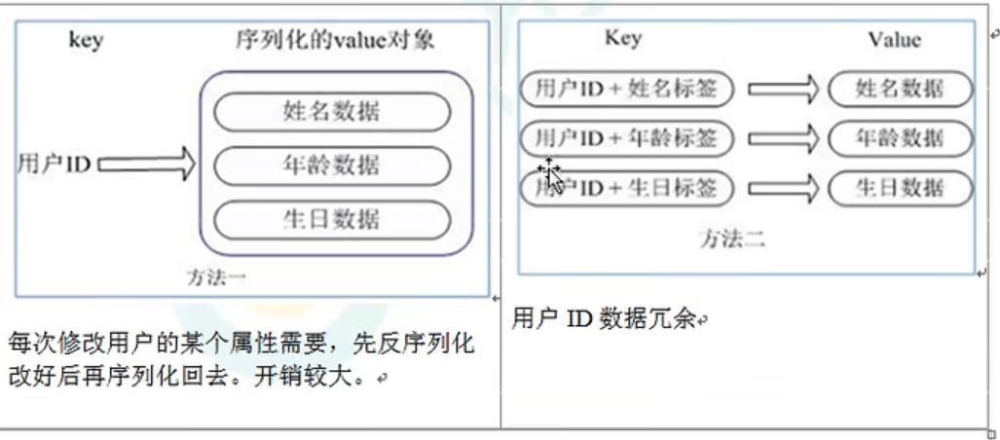

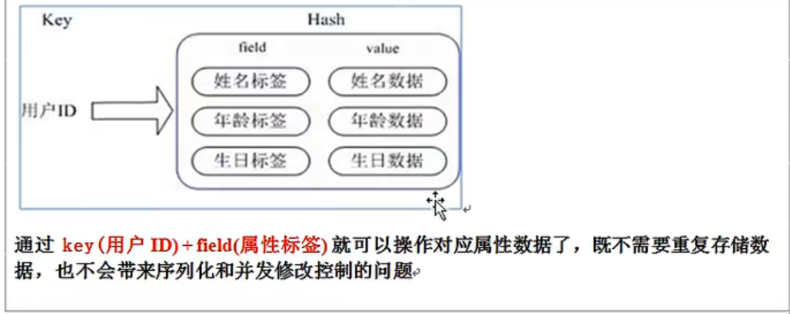

### 5.2 常用命令

1. `hset key field value`

   给 key 集合中的 field 键赋值 value

2. `hget key1 field`

   从 key1 集合 field 取出 value

3. `hmset key1 field value1 field2 value2 ……`

   批量设置 hash 的值

4. `hexists key1 field`

   查看哈希表 key 中，给定域 field 是否存在，1 存在，0 不存在

5. `hkeys key`

   列出该 hash 集合的所有 field

6. `hvals key`

   列出该 hash 集合的所有 value

7. `hincrby key field increment`

   为哈希表 key 中的域 field 的值加上增量 1 -1

8. `hsetnx key field value`

   将哈希表 key 中的域 field 的值设置为 value，当且仅当域 field 不存在时

### 5.3 数据结构

Hash 类型对应的数据结构有两种：ziplist（压缩列表），hashtable（哈希表），当 field-value 长度较短且个数较少时，使用 ziplist，否则使用 hashtable

## 6.有序集合（Zset）

### 6.1 简介

Redis 有序集合 zset 与普通集合 set 十分相似，是一个**没有重复元素**的字符串集合。不同之处在于有序集合的每个成员都关联了一个**评分（score）**，这个评分（score）被用来按照从最低分到最高分的方式排序集合中的成员。**集合的成员是唯一的，但是评分可以是重复的**。

因为元素是有序的，所以也可以很快根据 score 或者 次序（position）来获取一个范围的元素。访问有序集合的中间元素也是非常快的，因此可以通过使用有序集合来作为一个没有重复成员的智能列表。

### 6.2 常用命令

1. `zadd [key] [score1] [value1] [score2] [value2]……`

   将一个或多个 member 元素及其 score 值加入到有序集合 key 当中

2. `zrange [key] [start] [stop]` **[WITHSCORES]**

   返回有序集 key 中，下标在 start -- stop 之间的元素；带 WITHSCORES，可以让分数一起和值返回得到结果集。

3. `zrangebyscore [key] [min] [max] [withscores] [limit offset count]`

   返回有有序集 key 中，所有的 score 值介于 min 和 max 之间（包括等于 min 或 max）的成员

4. `zrangebyscore [key] [max] [min] [withscores] [limit offset count]`

   同上，改为从大到小排列

5. `zincrby [key] [increment] [value]`

   为元素的 score 加上增量

6. `zrem key value `

   删除该集合下，指定值的元素

7. `zcount key min max`

   统计该集合，分数区间内的元素个数

8. `zrank key value`

   返回该值在集合中的排名，从 0 开始

### 6.3 数据结构

SortedSet（zset） 是 Redis 提供的一个非常特别的数据结构，一方面它等价于 Java 的数据结构 Map<String, Double>，可以给每一个元素 value 赋予一个权重 score，另一方面它有类似于 TreeSet，内部的元素会按照权重 score 进行排序，可以得到每个元素的名次，还可以通过 score 的范围来获取元素的列表。

zset 底层使用了两个数据结构：

1. hash。hash的作用就是关联元素 value 和权重 score，保障元素 value 的唯一性，可以通过元素 value 找到相应的 score 值
2. 跳跃表。跳跃表的目的在于给元素 value 排序，根据 score 的范围获取元素列表

## 7.跳跃表（跳表）

### 7.1 简介

有序集合在生活中比较常见，例如根据成绩对学生进行排名，根据得分对玩家排名等。对于有序集合的底层实现，可以用数组、平衡树、链表等。数组不便元素的插入、删除；平衡树或红黑树虽然效率高但是结构复杂；链表查询需要遍历所有，效率低。redis 采用的是跳跃表，跳跃表效率堪比红黑树，但是实现却要比红黑树简单。

### 7.2 实例

对比有序链表和跳跃表，从链表中查询出 51

（1）有序链表

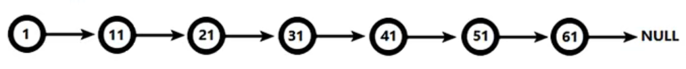

要查找值为 51 的元素，需要从第一个元素开始不断进行依次查找、比较才能找到，共需要进行 6 次比较。

（2）跳跃表

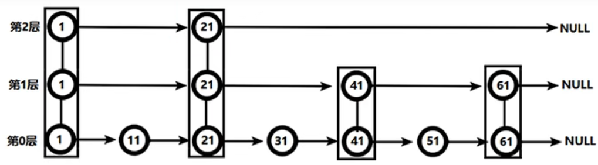

从第 2 层开始，1 节点比 51 节点小，向后比较；

21 节点比 51 节点小，继续向后比较，后面是 null，所以从 21 节点向下到第 1 层；

在第 1 层，41 节点比 51 节点小，继续向后，61 节点比 51 节点大，所以从 41 向下；

在第 0 层，51 节点为要查找的节点，节点被找到，共查找 4 次。

由此可看出跳跃表要比有序链表效率要高。

# 四、发布与订阅

## 1.概念

Redis 发布订阅（pub / sub）是一种消息通信模式：发送者（pub）发送消息，订阅者（sub）接收消息。Redis 客户端可以订阅任意数量的频道。

## 2.Redis 的发布和订阅

1.客户端可以订阅频道如下图

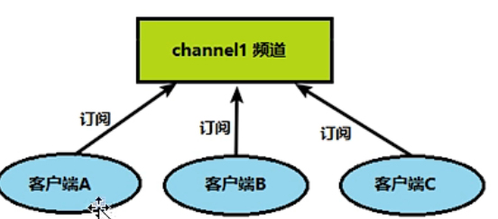

2.当给这个频道发布消息后，消息就会发布给订阅的客户端

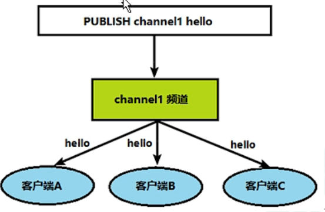

## 3.命令行实现

1.打开一个客户端订阅 channel1

`SUBSCRIBE channe11`

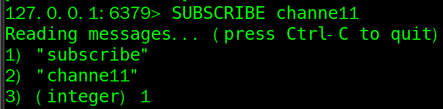

2.打开另一个客户端，给 channel1 发布消息 Hello

`publish channel1 hello`

返回的 1 是订阅者数量

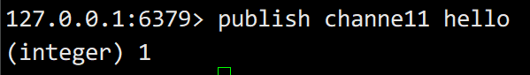

3.打开第一个客户端就可以看到发送的消息

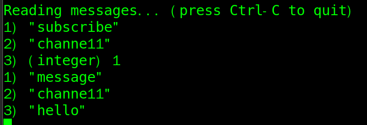

> 发布的消息没有持久化，如果在订阅的客户端收不到 hello，只能收到订阅后发布的消息

# 五、新数据类型

## 1.BitMaps

### 1.1 简介

现代计算机用二进制（位）作为信息的基础单位，1 个字节等于 8 位，例如 “abc” 字符串是由 3 个字节组成，但是记载计算机储存时将其用二进制表示，“abc” 分别对应的 ASCII 码分别是97、98、99，对应的二进制分别是 01100001、01100010 和 01100011。

合理的使用操作位能够有效提高内存的使用率和开发效率，Redis 提供了 Bitmaps 这个“数据类型”可以实现对位的操作：

1. Bitmaps 本身不是一种数据类型，实际上它就是字符串（key-value），但是它可以对字符串的位进行操作。
2. Bitmaps 单独提供了一套命令，所以在 Redis 中使用 Bitmaps 和使用字符串的方法不太相同，可以把 Bitmaps 想象成一个以位为单位的数组，数组的每个单元只能储存 0 和 1，数组的下标在 Bitmaps 中叫做偏移量。


### 1.2 常用命令

1. setbit

   1. 格式：`setbit key offset value`

      设置 Bitmaps 中某个偏移量的值（0 或 1）

      > offset：偏移量从 0 开始

   2. 实例：

      每个独立用户是否访问过网站的信息存放在 Bitmaps 中，将访问的用户记作 1，没有访问的用户记作 0，用偏移量作为用户的 id。

      设置键的第 offset 个位的值（从 0 算起），假设现在有 20 个用户，userid={1, 6, 11, 15, 19} 的用户对网站进行了访问，那么当前 Bitmaps 初始化结果如图所示：

      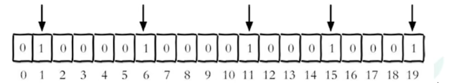

   > 很多应用的用户 id 以一个指定的数字（例如 10000）开头，这里直接将用户 id 和 Bitmaps 的偏移量对应势必会造成一定的浪费，通常的做法是每次做 setbit 的操作时将用户 id 减去这个指定的数字。
   >
   > 在第一次初始化 Bitmaps 时，假如偏移量非常大，那么整个初始化过程的执行就会比较慢，这可能会造成 Redis 的阻塞。

2. getbit

   1. 格式：`getbit key offset`

      获取 Bitmaps 中某个偏移量的值；获取键的第 offset 位的值（从 0 开始算）

   2. 实例

      获取 id=8 的用户是否在 2020-11-06 这天访问过，如果返回 0 说明没有访问过。

      > 如果获取的是一个不存在的数，返回 0

3. bitcount

   > 统计字符串被设置为 1 的 bit 数。一般情况下，给定的整个字符串都会被进行计数。，通过指定额外的 start 或 end 参数，可以让计数只在特定的位上进行。start 和 end 参数的设置，都可以使用负值。例如：-1 表示最后一位，-2 表示倒数第二位。start、end 是指 bit 组的字节的下标数，两者皆包含。

   1. 格式：`bitcount key start end`

      统计字符串从 start 字节到 end 字节比特值为 1 的数量

   2. 实例：

      start 和 end 代表起始和结束字节数，操作计算机用户 id 在第 1 个字节到第 3 个字节之间的独立访问用户数，对应的用户 id 是 11、15、19

      

      例如：k1[01000001, 01000000, 00000000, 00100001]，对应 [0, 1, 2, 3]

      - `bitcount k1 1 2`：统计下标 1、2 字节组中 bit=1 的个数，结果为 01000000、00000000
      - `bitcount k1 1 3`：统计下标 1、3字节组中 bit=1 的个数，结果为 01000000、00000000、00100001
      - `bitcount k1 0 -2`：统计下标 0 到下标倒数第 2 个字节组中 bit=1 的个数，结果为 01000001、01000000、00000000

      > 注意：redis 的 setbit 设置或清除的是 bit 位置，而 bitcount 计算的是 byte 位置

4. bitop

   1. 格式：`bitop and(or/not/xor) destkey [key……]`

      bitop 是一个复合操作，其可以做多个 Bitmaps 的 and（交集）、or（并集）、not（非）、xor（异或）操作并将结果保存在 destkey 中。

   2. 实例：

      2020-11-04日访问网站的userid={1, 2, 5, 9}

      - `setbit unique:users:20201104 1 1`
      - `setbit unique:users:20201104 2 1`
      - `setbit unique:users:20201104 5 1`
      - `setbit unique:users:20201104 9 1`

      2020-11-03日访问网站的userid={0, 1, 4, 9}

      - `setbit unique:users:20201103 0 1`
      - `setbit unique:users:20201103 1 1`
      - `setbit unique:users:20201103 4 1`
      - `setbit unique:users:20201103 9 1`

      计算出两天都访问过网站的用户数量：

      - `bitop and unique:users:and:20201104_03 unique:users:20201103 unique:users:20201104`

## 2.HyperLogLog

### 2.1 简介

在工作中，经常会遇到与统计相关的功能需求，比如统计网站PV（PageView 页面访问量），可以使用 redis 的 incr、incrby 轻松实现。但是像 UV（uniqueVisitor 独立访客）、独立IP数、搜索记录数等需要去重和计数的问题又该怎么解决？这种求集合中的不重复元素的个数的问题就称为基数问题。

解决基数问题有很多种方案：

1. 数据储存在MySQL表中，使用 distinct、count计算不重复的个数
2. 使用 redis 提供的 hash、set、bitmaps等数据结构来处理。

以上方案结果精准，但随着数据不断增加，导致占用空间越来越大，对于非常大的数据集是不切实际的。是否能够降低一定的精度来平衡储存空间？为此redis推出了 HyperLogLog 的解决方案。

Redis HyperLogLog是用来做基数统计的算法，HyperLogLog 的优点是：在输入元素的数量或者体积非常非常大的时候，计算基数所需的空间总是固定的，并且是很小的。在 redis 里面，每个 HyperLogLog 键只需要花费 12KB 内存，就可以计算接近 2^64 个不同的元素基数。这和计算基数时，元素越多耗费内存就越多的集合形成了鲜明对比。但是因为 HyperLogLog 只会根据输入元素来计算基数，而不会储存输入的元素本身，所以 HyperLogLog 不能像集合那样，返回输入的各个元素。

> 什么是基数？
>
> 比如数据集 {1, 3, 5, 7, 5, 7, 8}，那么这个数据集的基数集为 {1, 3, 5, 7, 8}，基数（集合中不重复的元素个数）为5.基数估计就是在误差可接受的范围内，快速计算基数。

### 2.2 常用命令

1. pfadd

   1. 格式：`pfadd key element [element……]`

      添加指定元素到 HyperLogLog 中

   2. 实例

      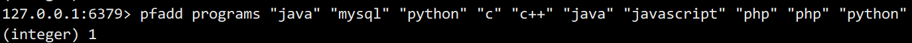

      将所有的元素添加到指定的 HyperLogLog 数据结构中，如果执行命令后 HLL 估计的近似基数发生变化，返回1，否则返回0

2. pfcount

   1. 格式：`pfcount key [key……]`

      计算 HLL 的近似基数，比如用 HLL 储存每天的 UV，计算一周的 UV 可以使用 7 天的 UV 合并计算即可。

   2. 实例

      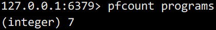

3. pfmerge

   1. 格式：`pfmerge destkey sourcekey [sourcekey……]`

      将一个或多个 HLL 合并后的结果储存在另一个 HLL 中，比如每月活跃用户数量可以使用每天的活跃用户进行合并计算即可

   2. 实例

      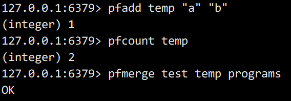

## 3.Geospatial

### 3.1 简介

Redis3.2 中增加了对 GEO 类型的支持。GEO（Geographic）是地理信息的缩写。该类型，就是元素的 2 维坐标，在地图上就是经纬度。redis 基于该类型，提供了经纬度设置、查询、范围查询、距离查询、经纬度 hash 等常见操作。

### 3.2 常用命令

1. geoadd

   1. 格式：`geoadd <key> <longitude> <latitude> <member> [longitude latitude member……]`

      添加地理位置（经度、纬度、名称）

   2. 实例

      - `geoadd china:city 121.47 31.23 shanghai`
      - `geoadd china:city 106.50 29.53 chongqing 114.05 22.52 shenzhen 116.38 39.90 beijing`

      > - 两级无法直接添加，一般会下载城市数据，直接通过 Java 程序一次性导入。
      > - 有效的经度从 -180° 到 180° ，有效的纬度从 -85.05112878° 到 85.05112878° .
      > - 当坐标位置超出指定范围时，该命令将会返回一个错误。
      > - 已经添加的数据，无法再次往里面添加。

2. geopos

   1. 格式：`geopos key member [member……]`

      获取指定地区的坐标值

   2. 实例

      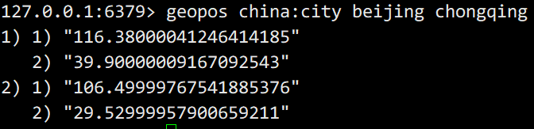

3. geodist

   1. 格式：`geodist key member1 member2 m/km/ft/mi`

      获取两个位置之间的直线距离

   2. 实例

      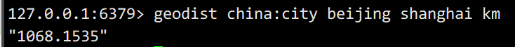

      > 单位：
      >
      > m 表示米（默认值）；
      >
      > km 表示千米；
      >
      > mi 表示英里；
      >
      > ft 表示英尺。
      >
      > 如果用户没有显示地指定单位参数，那么 GEODIST 默认使用米来作为单位。

4. georadius

   1. 格式：`georadius key longitude latitude radius m/km/ft/mi`

      以给定的经纬度为中心，找出某一半径内的元素

   2. 实例

      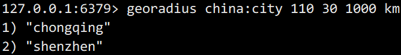

# 六、Jedis操作Redis6

## 1.Jedis前置准备

### 1.1 导入Jedis依赖

```xml
<dependency>
    <groupId>redis.clients</groupId>
    <artifactId>jedis</artifactId>
    <version>4.2.3</version>
</dependency>
```

### 1.2 测试 Jedis 连接

```java
public class JedisTest {
    public static void main(String[] args) {
        //创建 jedis 对象
        Jedis jedis = new Jedis("192.168.200.129", 6379);
        //测试连接
        System.out.println("连接成功 --> " + jedis.ping());
        //关闭 jedis
        jedis.close();
    }
}
```

### 1.3 注意事项

1. 在 /etc/redis.conf 文件中 bind 是否注释掉

   ```conf
   #bind-source-addr 10.0.0.1
   ```

2. 在 /etc/redis.conf 文件中 protected-mode 是否修改为 no

   ```conf
   protected-mode no
   ```

3. 在 Linux 防火墙中开放 6379 端口

   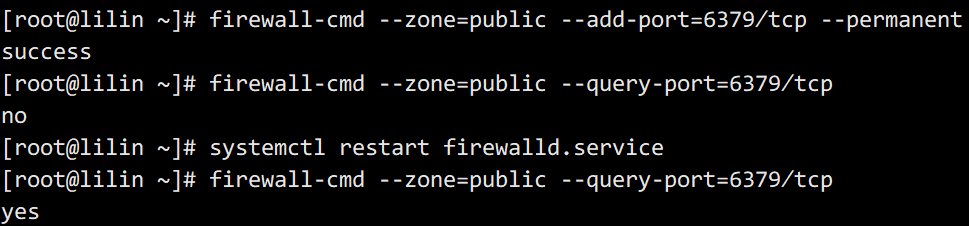 

## 2.Jedis实例-手机验证码

要求：

1. 输入手机号，点击发送后随机生成 6 位数字码，2 分钟有效
2. 输入验证码，点击验证，返回成功或失败
3. 每个手机号每天只能输入3次

代码：

```java
package com.lilin.jedis;

import redis.clients.jedis.Jedis;

import java.util.Random;

/**
 * Created by LiLin on 2022/7/28/15:41:54
 *
 * 手机验证码测试
 */
public class PhoneCode {
    //创建 jedis 对象
    private final static Jedis jedis = new Jedis("192.168.200.129", 6379);

    public static void main(String[] args) {
        //获取验证码
        String code = getCode();
        //设置手机号
        String phone = "18276360056";
        //保存验证码
        saveCode("18276360056", code);
        //校验验证码
//        checkCode(phone, code);
        checkCode(phone, "123456");
    }

    //用来生成 6 位的数字码
    public static String getCode() {
        Random random = new Random();

        StringBuilder randomCode = new StringBuilder();
        for (int i = 0; i < 6; i++) {
            randomCode.append(random.nextInt(10));
        }
        return randomCode.toString();
    }

    //保存验证码到 redis 中
    //每部手机每天只能发送三次
    //设置过期时间
    public static void saveCode(String phoneNumber, String code) {
        //拼接key
        //手机发送次数 key
        String countKey = "VerifyCode" + phoneNumber + ":count";
        //验证码key
        String codeKey = "VerifyCode" + phoneNumber + ":code";

        //每部手机每天只能发送三次
        String count = jedis.get(countKey);
        if (count == null) {
            jedis.setex(countKey, 24*3600, "1");
        } else if (Integer.parseInt(count) <= 2) {
            //发送次数加1
            jedis.incr(countKey);
        } else {
            System.out.println("您今天的请求次数已经超出限制");
            jedis.close();
            return;
        }

        //将验证码存入 redis
        jedis.setex(codeKey, 120, code);
        jedis.close();
    }

    //校验验证码
    public static void checkCode(String phoneNumber, String code) {
        //从redis中获取验证码
        //验证码key
        String codeKey = "VerifyCode" + phoneNumber + ":code";
        String redisCode = jedis.get(codeKey);

        //判断
        String result = redisCode.equals(code) ? "验证成功" : "验证失败";
        System.out.println(result);
        jedis.close();
    }
}

```

# 七、SpringBoot整合Redis

1.引入 Redis 依赖

```xml
<!--Redis6依赖-->
<dependency>
    <groupId>org.springframework.boot</groupId>
    <artifactId>spring-boot-starter-data-redis</artifactId>
</dependency>
<dependency>
    <groupId>org.apache.commons</groupId>
    <artifactId>commons-pool2</artifactId>
</dependency>
```

2.在`application.properties`中配置 redis 配置

```properties
#Redis服务器地址
spring.redis.host=192.168.200.129
#Redis服务器端口
spring.redis.port=6379
#Redis数据库索引，默认是0
spring.redis.database=0
#Redis连接超时时间，单位毫秒
spring.redis.timeout=1800000
#连接池最大连接数，负值表示没有限制
spring.redis.lettuce.pool.max-active=10
#最大阻塞时间，负数表示没有限制
spring.redis.lettuce.pool.max-wait=-1
#连接池最大空闲连接
spring.redis.lettuce.pool.max-idle=5
#连接池最小空闲连接
spring.redis.lettuce.pool.min-idle=0
```

3.添加 redis 配置类

```java
@Configuration
@EnableCaching
public class RedisConfig extends CachingConfigurerSupport {
    @Bean
    public RedisTemplate<String, Object> redisTemplate(RedisConnectionFactory factory) {
        RedisTemplate<String, Object> template = new RedisTemplate<>();
        RedisSerializer<String> serializer = new StringRedisSerializer();
        Jackson2JsonRedisSerializer jackson2JsonRedisSerializer = new Jackson2JsonRedisSerializer(Object.class);
        ObjectMapper om = new ObjectMapper();
        om.setVisibility(PropertyAccessor.ALL, JsonAutoDetect.Visibility.ANY);
        om.enableDefaultTyping(ObjectMapper.DefaultTyping.NON_FINAL);
        jackson2JsonRedisSerializer.setObjectMapper(om);
        template.setConnectionFactory(factory);
        //key序列化方式
        template.setKeySerializer(serializer);
        //value序列化
        template.setValueSerializer(jackson2JsonRedisSerializer);
        //value hashMap 序列化
        template.setHashValueSerializer(jackson2JsonRedisSerializer);
        return null;
    }
    @Bean
    public CacheManager cacheManager(RedisConnectionFactory factory) {
        RedisSerializer<String> redisSerializer = new StringRedisSerializer();
        Jackson2JsonRedisSerializer jackson2JsonRedisSerializer = new Jackson2JsonRedisSerializer(Object.class);
        //解决查询缓存转换异常问题
        ObjectMapper om = new ObjectMapper();
        om.setVisibility(PropertyAccessor.ALL, JsonAutoDetect.Visibility.ANY);
        om.enableDefaultTyping(ObjectMapper.DefaultTyping.NON_FINAL);
        jackson2JsonRedisSerializer.setObjectMapper(om);
        //配置序列化（解决乱码问题），过期时间设为600秒
        RedisCacheConfiguration config = RedisCacheConfiguration.defaultCacheConfig()
                .entryTtl(Duration.ofSeconds(600))
                .serializeKeysWith(RedisSerializationContext.SerializationPair.fromSerializer(redisSerializer))
                .serializeValuesWith(RedisSerializationContext.SerializationPair.fromSerializer(jackson2JsonRedisSerializer))
                .disableCachingNullValues();
        RedisCacheManager cacheManager = RedisCacheManager.builder(factory)
                .cacheDefaults(config)
                .build();
        return cacheManager;
    }
}
```

4.测试 redis 连接

```java
@RestController
@RequestMapping("redisTest")
public class TestController {
    @Autowired
    RedisTemplate<String, Object> template;
    
    @RequestMapping("test")
    public String test() {
        //添加值到 redis 中
        template.opsForValue().set("name", "tom");
        //从 redis 中获取值
        return (String) template.opsForValue().get("name");
    }
}
```

# 八、事务和锁机制

## 1.事物定义

Redis 事务是一个单独的隔离操作：事务中的所有命令都会序列化，按顺序的执行。事务在执行过程中，不会被其他客户端发送过来的命令请求所打断。Redis 事务的主要作用就是**串联多个命令**，防止别的命令插队。

## 2.三个基本命令

Redis 事务的三个基本命令分别是：**Multi、Exec、Discard**

从输入 multi 命令开始，输入的命令都会依次进入命令队列，但是不会执行，知道输入 exec 后，redis 会将之前的命令队列中的命令依次执行。组队的过程可以通过 discard 来放弃组队。

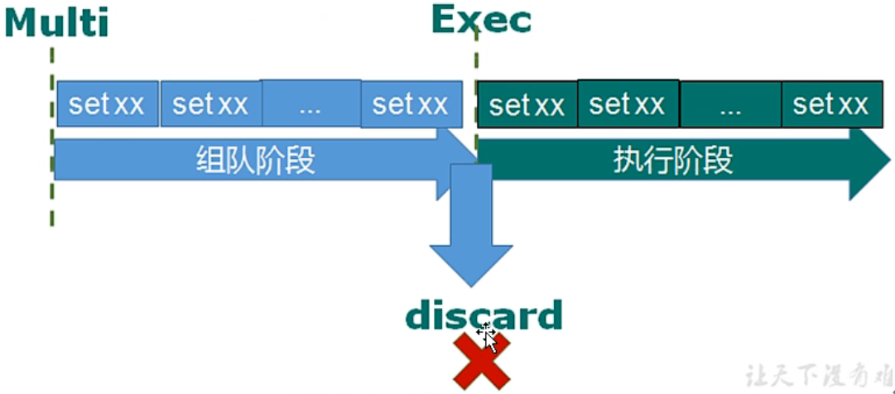

## 3.事务的错误处理

组队中某个命令出现了错误报告，执行时所有的队列都会被取消

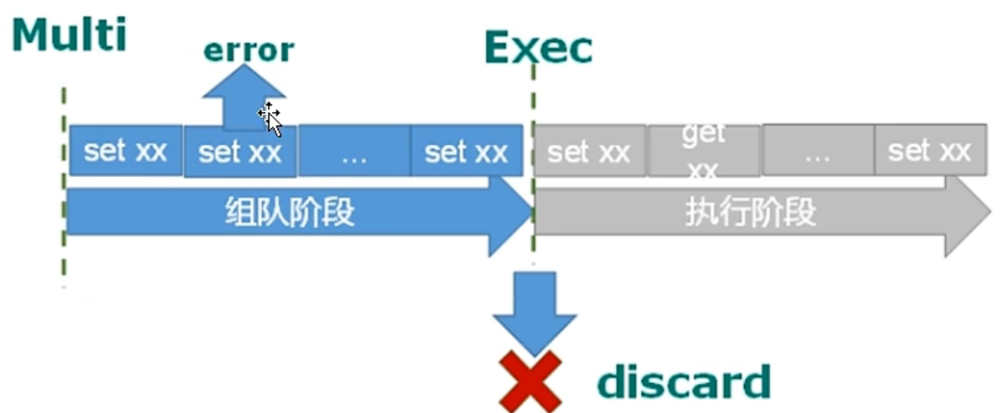

如果执行阶段某个命令出现了错误，则只有报错的命令不会被执行，其他的命令都可以正常执行

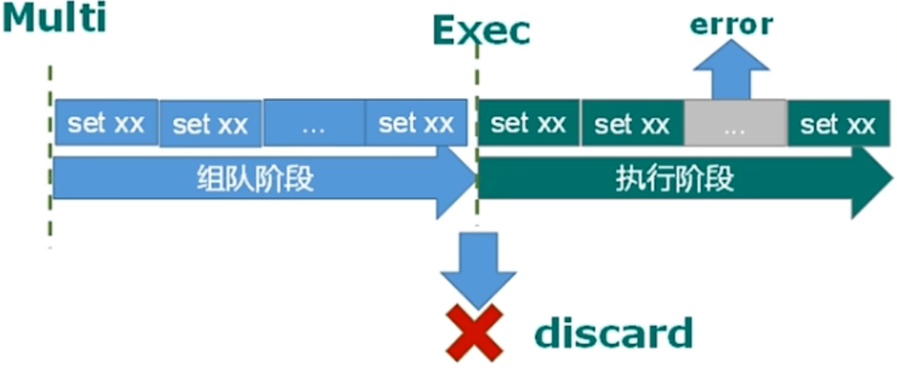

## 4.事务冲突问题

### 4.1 例子

举例：很多人使用同一个账户，同时去参加双十一抢购

- 一个请求想给金额减 8000
- 一个请求想给金额减 5000
- 一个请求想给金额减 1000


### 4.2 悲观锁

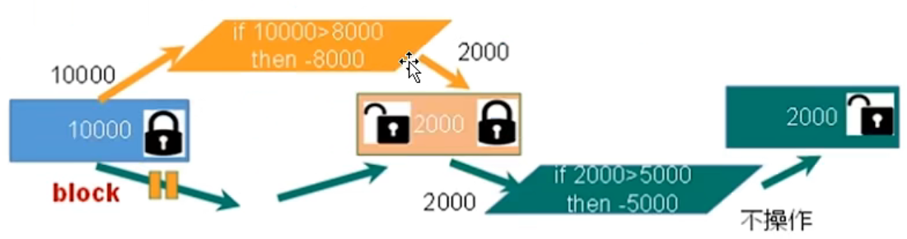

悲观锁（Pessimistic lock），顾名思义就是很悲观。每次获取数据时都会认为别人会去修改数据，所以在每次获取数据时都需要给数据上锁，如此当别人想获取这个数据时就会 block，直到结束操作后解锁。传统的关系型数据库就用到了很多这种锁机制，比如行锁、表锁、读锁、写锁等，都是在进行操作之前先上锁。

### 4.3 乐观锁

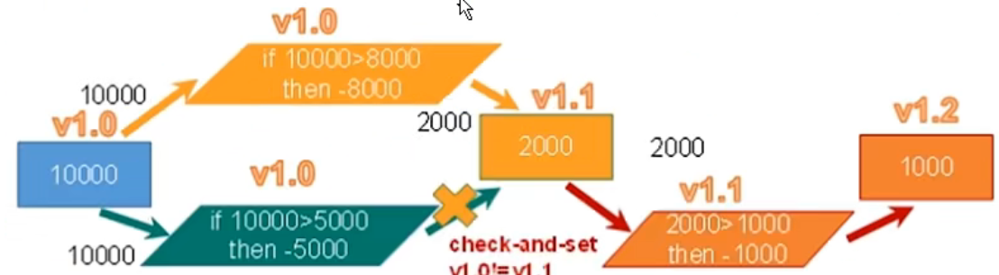

乐观锁（optimistic lock），顾名思义就是很乐观。每次获取数据的时候都会认为别人不会对数据进行修改，所以不会上锁，但是会在更新的时候进行判断，判断在此期间别人会不会更新数据，可以使用版本号等机制。乐观锁适用于多读的应用类型，这样可以提高吞吐量。Redis 就是使用这种 check-and-set 机制实现事务的。

#### 4.3.1 WATCH key……

在执行 multi 之前，先执行 watch key1 key2……，可以监视一个（或多个）key。如果在事务执行之前，key 被其他命令所改动，则事务将会被打断

#### 4.3.2 unwatch

取消 watch 命令对所有 key 的监视。

如果在执行 watch 命令之后，exec 命令或 discard 命令先被执行了，则就不需要再执行 unwatch

### 4.4 Redis事务三特性

1. 单独的隔离操作
   - 事务中的所有命令都会序列化，按顺序的执行。事务在执行的过程中，不会被其他客户端发送来的命令请求所打断。
2. 没有隔离级别的概念
   - 队列中的命令没有提交之前都不会实际被执行，因为事务提交前任何指令都不会被实际执行
3. 不保证原子性
   - 事务中如果有一条命令执行失败，其后的命令仍然会被执行，没有回滚。

## 5.秒杀案例

### 5.1 解决计数器和人员记录的事务操作

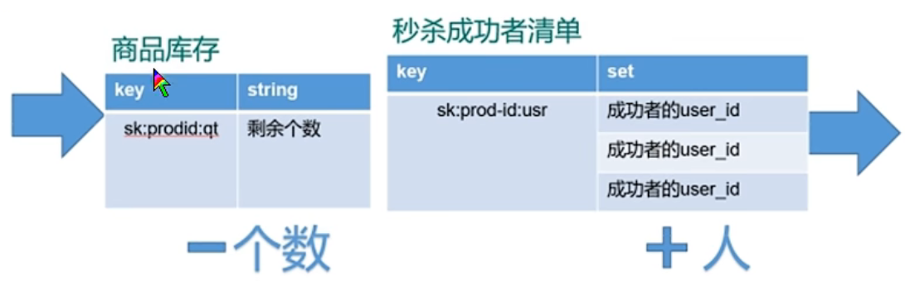

### 5.2 秒杀案例并发模拟

使用工具 ab 进行并发测试

CentOS6 默认安装；

CentOs7 需要手动安装

- 联网状态下

  `yum install httpd-tools`

- 无网状态下

  1. 进入 `cd /run/media/root/CentOS 7 x86_64/Packages`（路径与 centos6 不同）
  2. 顺序安装
     - apr-1.4.8-3.e17.x86_64.rpm
     - apr-util-1.5.2-6.e17.x86_64.rpm
     - httpd-tools-2.4.6-67.e17.centos.x86_64.rpm

### 5.3 超卖问题

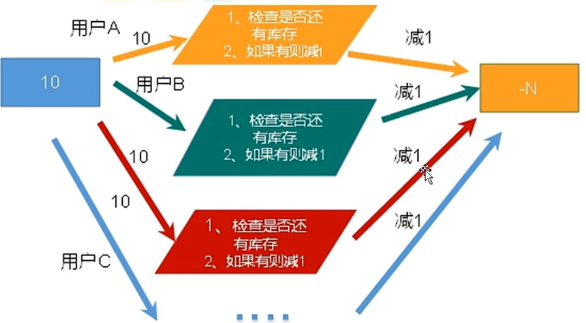

超卖问题可以通过 乐观锁 来解决。

```java
//监视库存
jedis.watch(kcKey);
……
//秒杀过程
//使用事务
Transaction multi = jedis.multi();

//组队操作
multi.decr(kcKey);
multi.sadd(userKey, uid);

//执行操作
List<Object> result = multi.exec();
if (result == null | result.size() == 0) {
    System.out.println("秒杀失败……");
    jedis.close();
}
……
```

### 5.4 超时问题

超时问题可以通过 redis 连接池来解决。

连接池可以节省每次连接 redis 服务带来的消耗，把连接好的实例反复利用。通过参数管理连接的行为。

连接池参数：

- MaxTotal：控制一个 pool 可分配多少个 jedis 实例，通过`pool.getResource()` 来获取；如果赋值为 -1，则表示不限制；如果 pool 已经分配了 MaxTotal 个 jedis 实例，则此时 pool 的状态为 exhausted。
- maxIdle：控制一个 pool 最多有多少个状态为 idle（空闲）的 jedis 实例
- MaxWaitMillis：表示当 borrow 一个 jedis 实例时，最大的等待毫秒数，如果超时等待时间，则直接抛出 JedisConnectionException 异常

### 5.5 库存遗留问题

由于使用了 乐观锁 后，用户购买了商品后的版本号无法及时更新，导致之后的用户无法正常购买商品，造成商品遗留，即库存遗留问题。

#### 5.5.1 LUA脚本

LUA 是一种小巧的脚本语言，Lua 脚本可以很容易被 C/C++ 代码调用，也可以反过来调用 C/C++ 的函数，Lua 并没有提供强大的库，而一个完整的 Lua 解释器不过只有 200k 大小，所以 Lua 不适合作为独立开发应用程序的语言，而是作为嵌入式脚本语言。

很多应用程序、游戏用 Lua 作为自己的嵌入式脚本语言，依次实现可配置性、可扩展性。这其中包括魔兽争霸地图、魔兽世界、博德之门、愤怒的小鸟等众多的游戏插件或者外挂。

Lua 脚本在 Redis 中的优势：

- 将复杂或多步的 redis 操作，写为一个脚本，一次性提交给 redis 执行，减少反复连接 redis 的次数，提高性能。
- Lua 脚本类似 redis 事务，有一定的原子性，不会被其他命令插队，可以完成一些 redis 事务性的操作。
- 利用 Lua 脚本淘汰用户，可以解决超卖问题。
- 在redis2.6版本后，通过 lua 脚本解决争抢问题，实际上是 redis 利用其单线程的特性，用任务队列的方式解决多任务并发问题
- redis 的 lua 脚本功能，只有在 redis2.6 以上版本才能使用。

[Lua脚本语言](https://www.w3cschool.cn/lua/ "点击跳转")

#### 5.5.2 Lua代码

1.Lua 脚本解决库存依赖问题

```lua
local userid=KEYS[1];
local prodid=KEYS[2];
local qtkey="sk:"..prodid..":qt";
local usersKey="sk:"..prodid.":usr";
local userExists=redis.call("sismember", usersKey, userid);
if tonumber(userExists) == 1 then
    return 2;	//2 表示当前用户已经秒杀过商品
    end
local num = redis.call("get", qtKey);
if tonumber(num) <= 0 then
    return 0;	//0 表示秒杀结束
    else
    redis.call("decr", qtKey);
    redis.call("sadd", usersKey, userid);
    end
return 1;		//1 表示秒杀成功
```

# 九、Redis持久化操作

Redis 提供了2种不同形式的持久化方式：

- RDB（Redis Data Base）
- AOF（Append Of File）

## 1.RDB

### 1.1 介绍

在指定的时间间隔内将内存中的数据集快照写入磁盘，也就是术语中的 Snapshot 快照，它恢复时会将快照文件直接读取到内存之中。

### 1.2 备份执行原理

Redis 会单独创建（fork）一个子进程来进行持久化操作，会先将数据写入到一个临时文件中，带持久化过程都结束了，再用这个临时文件替换上上次持久化好的文件。整个过程中，主进程是不进行任何IO操作的，这就确保了极高的性能。如果需要进行大规模的数据恢复时，且对于数据恢复的完整性不是非常敏感，那么 RDB 方式要比 AOF 方式更加的高效。**RDB 的缺点是最后一次持久化操作后的数据可能会丢失**。

### 1.3 fork

- fork 的作用是复制一个与当前进程一样的进程。新进程的所有数据（变量、环境变量、程序计数器等）数据和原进程一致，但是是一个全新的进程，作为原进程的子进程。
- 在Linux程序中，fork 会产生一个与父进程完全相同的子进程，但是子进程在此后多会被 exec 系统调用，处于效率的考虑，Linux 引入了“**写时复制技术**”
- 一般情况下父进程和子进程会共用一段物理内存，只有进程空间的各段内容要发生变化时，才会将父进程的内容复制一份给子进程。

### 1.4 RDB持久化流程

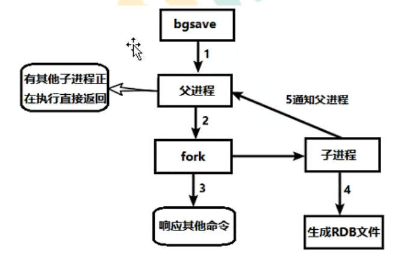

### 1.5 rdb备份

先通过`config get dir`查询 rdb 文件的目录，

将 *.rdb 的文件拷贝到其他地方，

之后进行 rdb 的恢复：

- 关闭 Redis
- 先把备份的文件拷贝到工作目录下`cp dump2.rdb dump.rdb`
- 启动 redis，备份数据会直接加载

### 1.6 特点

1. rdb 的优势：
   - 适合大规模的数据恢复
   - 如果对数据完整性和一致性要求不高，更适合使用
   - 节省磁盘空间
   - 恢复速度快
2. rdb 的缺点：
   - Fork 的时候，内存中的数据被克隆了一份，会产生大致 2 倍的内存膨胀
   - 虽然 Redis 在 fork 时采用了写时拷贝技术，但是如果数据十分庞大时，还是比较消耗性能的
   - 备份周期会在一定的间隔时间内做一次备份，所以如果 redis 意外关闭时，就会丢失最后一次快照后做的所有修改

## 2.AOF

### 2.1 简介

AOF（Append Only File）是以日志的形式来记录每个写操作（增量保存），将 redis 执行过的所有写指令记录下来（读操作不记录），只许追加文件但不可以改写文件，redis 启动之初会读取该文件来重新构建数据，换言之，redis 重启的话就会根据日志文件的内容将写指令从前到后执行一次以完成数据的恢复工作。

### 2.2 AOF持久化流程

1. 客户端的请求写命令会被 append 追加到 AOF 缓冲区内。
2. AOF缓冲区根据 AOF 持久化策略（aways, everysec, no）将操作 sync 同步到磁盘的 AOF 文件中
3. AOF 文件大小超过重写策略或手动重写时，会对 AOF 文件 rewrite 重写，压缩 AOF 文件容量。
4. redis 服务重启时，会重新加载 AOF 文件中的写操作以达到恢复数据的目的

### 2.3 开启AOF

AOF默认不开启，可以在 redis.conf 中将`appendonly no`修改为`appendonly yes`即可

### 2.4 优先级

当 AOF 和 RDB 同时开启时，系统会默认读取 AOF 的数据（数据不会存在丢失）

### 2.5 AOF启动/修复/恢复

- AOF的备份机制和性能虽然和 RDB 不同，但是备份和恢复的操作和 RDB 一样，都是拷贝备份文件，需要恢复时再拷贝到 redis 工作目录下，再启动系统即加载
- 正常恢复
  - 修改默认的`appendonly no`，改为 yes
  - 将有数据的 AOF 文件复制一份保存到对应的目录（如何查看目录：`config get dir`）
  - 恢复：重启 redis 然后重新加载
- 异常恢复
  - 修改默认的 `appendonly no`，改为 yes
  - 如果遇到 AOF 文件损坏，通过 `/usr/local/bin/redis-check-aof --fix apppendonly.aof` 进行恢复
  - 备份被写坏的 AOF 文件
  - 恢复：重启 redis，然后重新加载

### 2.6 AOF同步频率设置

- `appendfsync always`
  - 始终同步，每次 redis 的写入都会立刻记入日志，性能较差但是数据完整性比较好
- `appendfsync everysec`
  - 每秒同步，每秒记入日志一次，如果宕机，本秒的数据可能丢失
- `appendfsync no`
  - redis 不主动进行同步，把同步的时机交给操作系统。

### 2.7 Rewrite 压缩

#### 2.7.1 简介

AOF 采用文件追加方式，文件会越来越大，为避免出现此种情况，新增了重写机制，当 AOF 文件的大小超过所设定的阈值时，Redis 就会启动 AOF 文件的内容压缩，只保留可以恢复数据的最小指令集，可以使用命令`bgrewriteaof`

#### 2.7.2 重写原理

AOF 文件持续增长而过大时，会 fork 出一条新进程将文件重写（也是先写临时文件最后再 rename），redis4.0 版本后的重写，是指就是把 .rdb 文件的快照，以二进制的形式附在新的 aof 头部，作为已有的历史数据，替换掉原来的流水账操作。

如果`no-appendfsync-on-rewrite=yes`，不写入 aof 文件只写入缓存，用户请求不会阻塞，但是在这段时间如果宕机会丢失这段时间的缓存数据（这回降低数据安全性，提高性能）；如果`no-appednfsync-on-rewrite=no`，还是会把数据写入磁盘，但是如果遇到重写操作，可能会发生阻塞（此时数据安全，但是性能降低）。

当触发机制时，何时进行重写操作？redis 会记录上次重写时的 AOF大小，默认配置是当 AOF 文件大小是上次 rewrite 后大小的一倍且文件大于 64M 时触发。

**重写虽然可以节约大量的磁盘空间，减少恢复时间，但是每次重写还是有一定的负担，因此设定 redis 要满足一定提交才会进行重写**。

- `auto-aof-rewrite-percentage`：设置重写的基准值，当文件达到 100% 时才开始重写（当文件是原来重写后文件的2倍时触发）。
- `auto-aof-rewrite-min-size`：设置重写的基准值，最小文件 64MB。当达到这个值时开始重写。

#### 2.7.3 重写流程

1. `bgrewriteaof`触发重写，判断是否当前有`bgsave`或`bgrewriteaof`再允许；如果有，则等待该命令结束后再继续执行。
2. 主进程 fork 出子进程执行重写操作，保证主进程不会阻塞。
3. 子进程遍历 redis 内存中数据到临时文件，客户端的写请求同时写入 aof_buf 缓存区和 aof_rewrite_buf 重写缓冲区保证原 AOF 文件完整以及新 AOF 文件生成期间的新的数据修改动作不会丢失。
4. 子进程写完新的 AOF 文件后，向主进程发送信号，父进程更新统计信息；主进程把 aof_rewrite_buf 中的数据写入到新的 AOF 文件
5. 使用新的 AOF 文件覆盖旧的 AOF 文件，完成 AOF 重写。

### 2.8 AOF优缺点

#### 2.8.1 优点

- 备份机制更稳健，丢失数据概率更低。
- 可读的日志文件，通过操作 AOF 稳健，可以处理误操作

#### 2.8.2 缺点

- 比起 RDB 占用更多磁盘空间
- 恢复备份速度更慢
- 每次读写都要同步的话，会产生一定的性能压力
- 存在个别 Bug，可能会造成恢复失败。

## 3.选择

用哪个好？

官方推荐两个都启动；

如果对数据不敏感，可以单独选用 RDB；

不建议单独使用 AOF，因为可能会出现 Bug；

如果只是做纯内存缓存，可以都不用。

# 十、Redis主从复制

## 1.简介

主机数据更新后根据配置和策略，自动同步到备机的 master/slaver 机制，Master 以写为主，Slave 以读为主。

主从复制的作用：

- 读写分离，性能扩展
- 容灾快速恢复

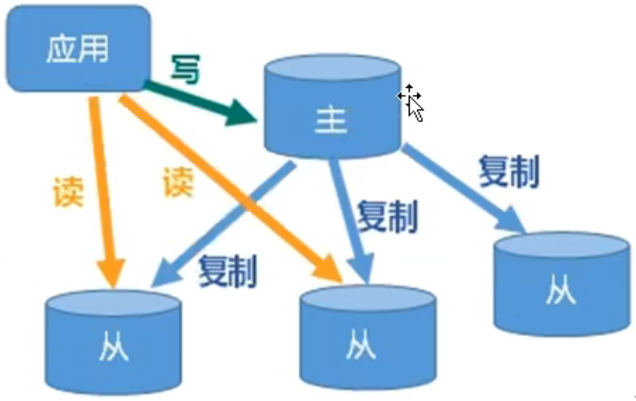

## 2.配置主从复制

1. 创建 /myredis 文件夹

   - `mkdir /myredis`

2. 复制 redis.conf 配置文件到文件夹中

   - `cp /etc/redis.conf /myredis/redis.conf`

3. 配置一主两从，创建三个配置文件

   - `vim redis6379.conf`
   - `vim redis6380.conf`
   - `vim redis6381.conf`

4. 在三个配置文件中分别写入内容

   ```
   include /myredis/redis.conf
   pidfile /var/run/redis_6379.pid
   port 6379
   dbfilename dump6379.rdb
   ```

   ```
   include /myredis/redis.conf
   pidfile /var/run/redis_6380.pid
   port 6380
   dbfilename dump6380.rdb
   ```

   ```
   include /myredis/redis.conf
   pidfile /var/run/redis_6381.pid
   port 6381
   dbfilename dump6381.rdb
   ```

5. 启动三个服务

   - `redis-server redis6379.conf`
   - `redis-server redis6380.conf`
   - `redis-server redis6381.conf`

6. 配置主从关系

   - 在从机上执行：`slaveof ip port`

## 3.主从复制特点

### 3.1 一主二仆

slave1、slave2是从头开始复制还是从切入点开始复制？比如从 k 4进来，则之前的 k1、k2、k3是否也可以复制？从机是否可以写？set 可否？主机 shutdown 后情况如何？从机是上位还是原地待命？主机又回来了后，主机新增记录，从机是否还能顺利复制？其中一台从机 down 后情况如何？依照原有它能跟上大部队吗？

### 3.2 薪火相传

上一个 slave 可以是下一个 salve 的 master，slave 同样可以接受其他的 slaves 的连接和同步请求，那么该 slave 作为了链条中下一个的 master，可以有效减轻 master 的写压力，去中心化降低风险。

用`slaveof <ip> <port>`；

中途变更转向：会清除之前的数据，重新建立拷贝最新的数据；

风险是一旦某个 slave 宕机，后面的 slave 都会无法备份；

当主机挂了后，从机依旧还是从机，但无法写数据

### 3.3 反客为主

当一个 master 宕机后，后面的 salve 可以立刻升为 master，其后面的 salve 不用做任何修改。

通过 `slaveof no one` 命令可以将从机变为主机。

## 4.主从复制原理

- slave 启动成功后连接到 master 后会发送一个 sync 命令
- master 接到命令启动后台的存盘进程，同时收集所有接收到的用于修改数据集的命令，在后台进程执行完毕后，master 将传送整个数据文件到 salve，以完成一次完全同步。
- 全量复制：而 salve 服务在接收到数据库文件数据后，将其存盘并加载到内存中。
- 增量复制：master 继续将新的所有收集到的修改命令依次传给 slave，完成同步
- 但是只要是重新连接 master，一次完全同步（全量复制）将被自动执行

## 5.哨兵模式

### 5.1 简介

反客为主的自动版，可以后台监控主机是否故障，如果故障了可以根据投票数自动将从库转换为主库。

### 5.2 使用步骤

1. 在 /myredis 目录下新建配置文件 sentinel.conf（名字不能错）

2. 在配置文件中添加内容 

   ```
   sentinel monitor mymaster 127.0.0.1 6379 1
   ```

   > 其中 mymaster 为监控对象起的服务器名称，1 为至少有 1 个哨兵同意迁移的数量

3. 启动哨兵，执行命令：`redis-sentinel /myredis/sentinel.conf`

### 5.3 选举原理

当主机挂掉，从从机中选举产生新的主机（大概 10s 左右可以看到哨兵窗口日志，切换了新的主机）；

选举会根据优先把级别进行，可以通过 `slave-prority` 查看从机优先级；

在原主机重启后会自动变成从机。

### 5.4 复制延时

由于所有的写操作都是先在 Master 上操作的，然后同步更新到 Slave 上，所以从 Master 同步到 Slave 机器会有一定的延时，当系统很繁忙的时候，延迟问题会更加严重，Slave 机器数量的增加也会使这个问题更加严重。

### 5.5. 故障恢复

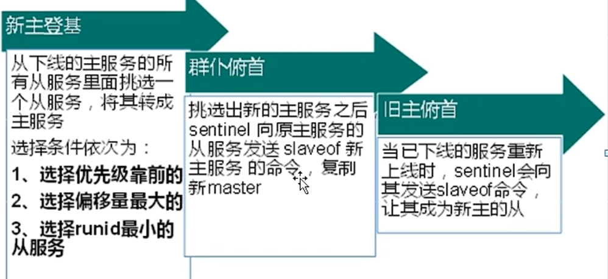

- 优先级在 redis.conf 中默认：`slave-priority 100`，值越小优先级越高；
- 偏移量是指获得原主机数据最全的；
- 每个 redis 实例启动后都会随机生成一个 40 位 的 runid。

## 6.主从复制Java实现

```java
private static JedisSentinelPool jedisSentinelPool = null;
public static Jedis getJedisFromSentinel() {
    if (jedisSentinelPool == null) {
        Set<String> sentinelSet = new HashSet<>();
        sentinelSet.add("192.168.11.103:26379");
        
        JedisPoolConfig jedisPoolConfig = new JedisPoolConfig();
        //最大可用连接数
        jedisPoolConfig.setMaxTotal(10);
        //最大闲置连接数
        jedisPoolConfig.setMaxIdle(5);
        //最小闲置连接数
        jedisPoolConfig.setMinIdle(5);
        //连接耗尽是否等待
        jedisPoolConfig.setBlockWhenExhausted(true);
        //等待时间
        jedisPoolConfig.setMaxWaitMillis(2000);
        //获取连接的时候进行一下测试 ping
        jedisPoolCOnfig.setTestOnBorrow(true);
        
        jedisSentinelPool = new JedisSentinelPool("mymaster", sentinelSet, jedisPoolConfig);
        return jedisSentinelPool.getResource();
    }
}
```

# 十一、集群

## 1.介绍

### 1.1 问题

当容量不够时，redis 如何进行扩容？

并发写操作，redis 又该如何进行分摊？

还有，主从模式，薪火相传模式，主机宕机，所导致的 ip 地址发生变化，应用程序配置中需要修改对应的主机地址、端口等信息。

之前可以通过代理主机来解决，但是在 redis3.0 中提供了解决方案：就是无中心化集群配置。

### 1.2 什么是集群

Redis 集群实现了对 Redis 的水平扩容，即启动了 N 个 redis 节点，将整个数据库分布存储在这 N 个节点中，每个节点储存总数据的 1/N 。

Redis 集群通过分区（partition）来提供一定程度的可用性（availability），即使集群中有一部分节点失效或者无法进行通讯，集群也可以继续处理命令请求。

## 2.搭建集群

### 2.1 配置基本信息

需要配置 6 个 redis 配置文件，端口号分别是 6379、6380、6381、6382、6383、6384，前一个分别是后一个的主机

```conf
include /myredis/redis.conf
pidfile "/var/run/redis_6384.pid"
port 6384
dbfilename "dump6384.rdb"
cluster-enabled yes
cluster-config-file nodes-6384.conf
cluster-node-timeout 15000
```

### 2.2 启动redis服务

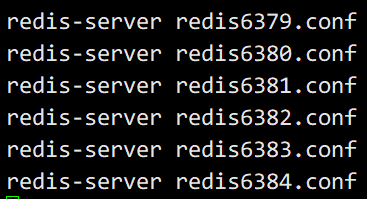

### 2.3 组建集群

> 组合之前，要确保所有的 redis 实例启动后，nodes-xxx.conf 文件都正常生成
>
> 集群分配原则：尽量保证每个主数据库运行在不同的IP地址上，每个从库和主库都不在一个IP地址上

1. 进入目录：`/opt/java/redis/redis-7.0.4/src`

2. 输入以下命令：

   ```
   redis-cli --cluster create --cluster-replicas 1 192.168.200.129:6379 192.168.200.129:6380 192.168.200.129:6381 192.168.200.129:6382 192.168.200.129:6383 192.168.200.129:6384
   ```

3. 进入集群：`redis-cli -c -p port`

4. 可以通过 `cluster nodes` 查看集群信息

## 3.slots(插槽)

一个Redis集群包括 16384 个插槽（hash slot），数据库的每个键都属于这 16384 个插槽的其中一个。

集群使用公式 CRC16(key)% 16384 来计算键 key 属于哪个槽，其中 CRC16(key) 语句用于计算键 key 的 CRC16校验。

集群中的每个节点负责处理一部分插槽。

## 4.使用集群

### 4.1 在集群中录入值

在 redis-cli 中每次录入、查询键值，redis 都会计算出该 key 应该送往的插槽位置，如果不是该客户端对应服务器的插槽，redis 就会报错，并告知因前往的 redis 实例地址和端口。

redis-cli 客户端提供了 -c 参数实现自动重定向。

如 `redis-cli -c -p 6379` 登入后，再录入、查询键值对可以自动重定向。

- 不在一个 slot 下的键值，是不能使用 mget、mset等多建操作

  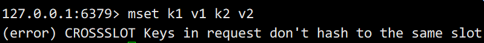

- 可以通过 {} 来定义组的概念，从而使 key 中 {} 相同内容的键值对放到一个 slot 中去

  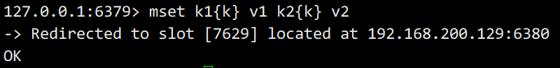

### 4.2 查询集群中的值

`cluster getkeysinslot <slot> <count>`

返回 count 个 slot 槽中的键

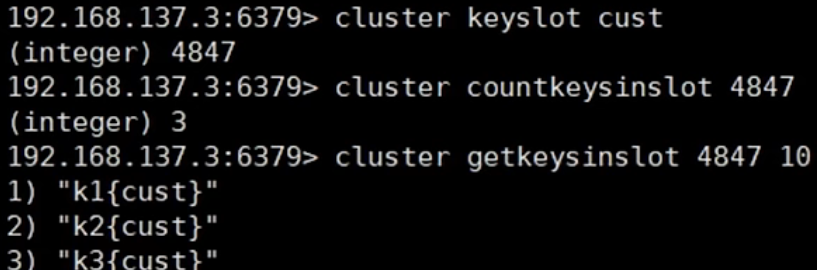

## 5. 故障恢复

- 如果主节点下线，从节点能否自动升为主节点？注意：15 秒超时
- 主节点恢复后，主从关系会如何？主节点恢复后变成从机
- 如果所有某一段插槽的主从节点都宕掉，redis 服务是否还能继续？
  - 如果所有某一段插槽的主从节点都宕掉，而 `cluster-require-full-coverage` 为 yes，则整个集群都会挂掉
  - 如果所有某一段插槽的主从节点都宕掉，而 `cluster-require-full-coverage` 为 no，则该插槽的数据都不能使用，也无法储存，但是其他集群还能正常工作

## 6.集群的 Jedis 开发

即使连接的不是主机，集群会自动切换主机储存。主机写，从机读。

无中心化主从集群，无论从哪台主机写的数据，其他主机上都能读到数据。

```java
public class JedisClusterTest {
    public static void main(String[] args) {
        Set<HostAndPort> set = new HashSet<HostAndPort>();
        set.add(new HostAndPort("192.168.31.211", 6379));
        JedisCluster jedisCluster = new JedisCluster(set);
        jedisCluster.set("k1", "v1");
        System.out.pringln(jedisCluster.get("k1"));
    }
}
```

## 7.集群优缺点

### 7.1 优点

- 实现扩容
- 分摊压力
- 无中心化配置相对简单

### 7.2 缺点

- 多键操作不被支持
- 多键的 redis 事务是不被支持的，lua 脚本不被支持
- 由于集群方案出现较晚，很多公司已经采用了其他的集群方案，而代理或者客户端分片得方案想要迁移到 redis cluster，需要整体迁移而不是逐步过渡，复杂度较大。

# 十二、应用问题解决

## 1.缓存穿透

### 1.1 描述

key 所对应的数据在数据源并不存在，每次针对此 key 的请求从缓存获取不到，请求都会压到数据源，从而有可能压垮数据源。比如用一个不存在的用户 id 获取用户信息，不论缓存还是数据库都没有此 id，若黑客利用此漏洞进行攻击可能会压垮数据库。

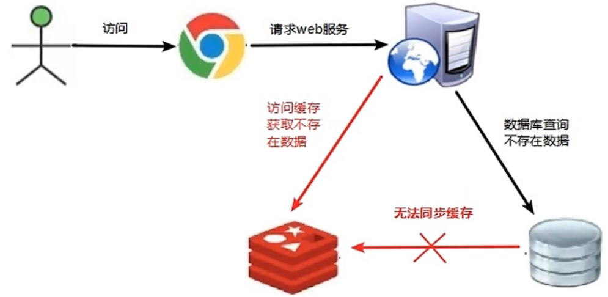

### 1.2 解决方案

一个一定不存在的缓存及查询不到的数据，由于缓存是不命中时被动写的，并且出于容错考虑，如果从储存层查不到的数据则不写入缓存，这将导致这个不存在的数据每次请求都要到储存层去查询，redis 就失去了缓存的意义。

解决方案：

1. **对空值缓存**：如果一个查询返回的数据为空（不管数据是否存在），仍然i把这个空的结果）null）进行缓存，再给空结果的设置一个非常短的过期时间，最长不超过五分钟。
2. **设置可访问的名单（白名单）**：使用 bitmaps 类型定义一个可以访问的名单，名单 id 作为 bitmaps 的偏移量，每次访问和 bitmap 里面的 id 进行比较，如果访问 id 不在 bitmaps 里面，就进行拦截，不允许访问。
3. **采用布隆过滤器（Bloom Filter）**：是在 1970 年 由布隆提出的。它实际上是一个很长的二进制向量（位图）和一系列随机映射函数（哈希函数）。布隆过滤器可以用于检索一个元素是否在一个集合中，它的优点是空间效率和查询时间都远远超过一般的算法，缺点是有一定的误识别率和删除困难。布隆过滤器的原理是：将所有可能存在的数据以哈希储存的方式储存到一个足够大的 bitmaps 中，一个一定不存在的数据会被这个 bitmaps 拦截掉，从而避免了对底层存储系统的查询压力。
4. **进行实时监控**：当发现 redis 的命中率开始急速降低时，需要排查访问对象和访问的数据，以及和运维人员配合，设置黑名单限制服务。

## 2.缓存击穿

### 2.1 描述

key 所对应的数据存在，但是在 redis 中过期了，此时若有大量并发请求过来，这些请求发现缓存过期后，一般都会从后端数据库（DB）中加载数据并回设到缓存中，这个时候大并发的请求可能会瞬间将后端DB压垮。

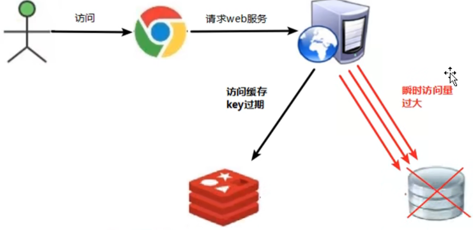

### 2.2 解决方案

key 可能会在某些时间点被超高并发的访问，是一种非常“热点”的数据。这个时候，就需要考虑缓存被“击穿”的问题。

解决方案：

1. **预先设置热门数据**：在 redis 高峰访问之前，把一些热门数据提前存入到 redis 里面，加大这些热门数据 key 的时长
2. **实时调整**：现场监控哪些数据热门，实时调整 key 的过期时长
3. **使用锁**：
   1. 就是在缓存失效的时候（判断拿出来的值为空，不立即去请求数据库（load db）
   2. 先使用缓存工具的某些带成功返回值的操作（比如 redis 的 SETNX）去 set 一个 mutex key
   3. 当操作返回成功时，再进行 load db 的操作，并回设缓存，最后删除 mutex key
   4. 当操作返回失败，证明有线程在 load db，当前线程睡眠一段时间再重试整个 get 缓存的方法

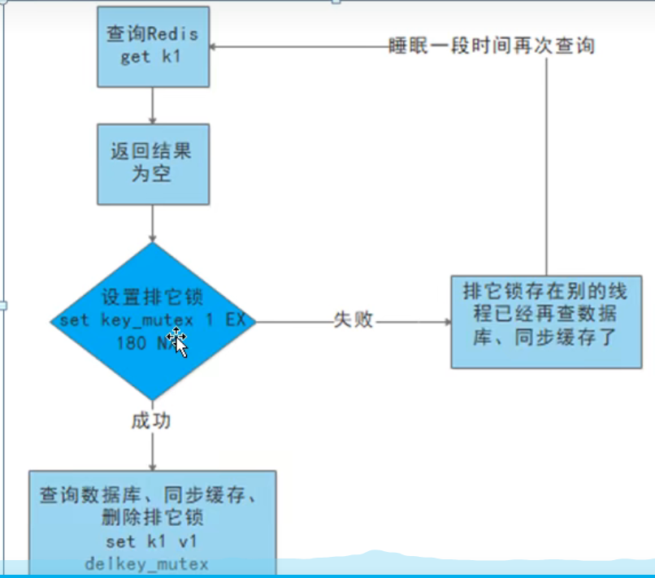

## 3.缓存雪崩

### 3.1 描述

key 对应的数据存在，但在 redis 中大量的 key 过期，若此时有高并发的请求过来，当这些请求发现缓存过期后就会从后端 DB 中加载数据并回设到缓存中，这个时候高并发的请求就有可能会瞬间将后端 DB 压垮。

缓存雪崩和缓存击穿的区别在于雪崩针对很多的 key 缓存，而击穿则是某一个 key 不能正常访问。

缓存失效瞬间：

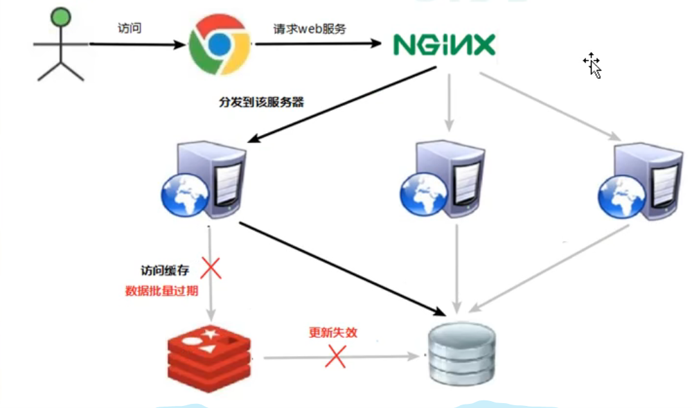

### 3.2 解决方案

缓存失效时的雪崩效应对于底层系统的冲击是十分可怕的！

解决方案：

1. **构建多级缓存架构**：nginx 缓存 + redis 缓存 + 其他缓存（ehcache 等）
2. **使用锁或队列**：用加锁或者队列的方式保证不会有大量的线程对数据库进行一次性读写，从而可以避免 key 失效时出现大量的并发请求对底层存储系统产生压力的情况。但是这不适用于高并发情况。
3. **设置过期标志更新缓存**：记录缓存数据是否过期（设置提前量），如果过期的话会触发通知另外的一个进程在后台去更新实际 key 的缓存。
4. **将缓存失效时间分散开**：可以在原有的失效时间基础上增加一个随机值，比如 1-5 分钟随机，这样每一个缓存的过期时间的重复率就可以降低，这很难引发集体失效的事件。

## 4.分布式锁

### 4.1 描述

随着业务发展的需要，原单体单机部署的系统被演化成为分布式集群系统后，由于分布式系统多线程、多进程并且分布在不同的机器上，这就将使原单机部署情况下的并发控制锁策略失效，单纯的 JavaAPI 并不能提供分布式锁的能力。为了解决这个问题就需要一种跨 JVM 的互斥机制来控制共享资源的访问，这就是分布式锁要解决的问题。

分布式锁主流解决方案：

1. 基于数据库实现分布式锁
2. 基于缓存（Redis 等）
3. 基于 Zookeeper

每一种分布式锁解决方案都有各自的优缺点：

1. 性能：redis 最高
2. 可靠性：zookeeper 最高

### 4.2 redis 实现分布式锁

通过命令 `setnx <key> <value>`实现；

释放锁：`del <key>`

可能出现的问题：

1. 上锁后一直没有释放锁
   - 设置 key 的过期时间，自动释放：先`setnx <key> <value>`，再`expire <key> <second>`
2. 上锁后突然出现异常，无法设置过期时间
   - 上锁的同时设置过期时间：`set <key> <value> nx ex <second>`

### 4.3 Java实现

```java
@GetMapping("testLock")
public void testLock() {
    //1.获取锁
    Boolean lock = redisTemplate.opsForValue().setIfAbsent("lock", "111", 3, TimeUnit.SECONDS);
    //2.获取锁成功，查询 num 的值
    if(lock) {
        Object value = redisTemplate.opsForValue().get("num");
        //判断 num 为空，return
        if(StringUtils.isEmpty(value)) {
            return;
        }
        //有值就转成 int 类型
        int num = Integer.parseInt(value + "");
        //将 redis 的 num 加1
        redisTemplate.opsForValue().set("num", ++num);
        //释放锁
        redisTemplate.delete("lock");
    } else {
        //3.获取锁失败，每隔 0.1 秒再获取
        try {
            Thread.sleep(100);
            testLock();
        } catch (InterruptedException e) {
            e.printStackTrace();
        }
    }
}
```

### 4.4 UUID防止误删

```java
@GetMapping("testLock")
public void testLock() {
    String uuid = UUID.randomUUID().toString();
    //1.获取锁
    Boolean lock = redisTemplate.opsForValue().setIfAbsent("lock", uuid, 3, TimeUnit.SECONDS);
    //2.获取锁成功，查询 num 的值
    if(lock) {
        Object value = redisTemplate.opsForValue().get("num");
        //判断 num 为空，return
        if(StringUtils.isEmpty(value)) {
            return;
        }
        //有值就转成 int 类型
        int num = Integer.parseInt(value + "");
        //将 redis 的 num 加1
        redisTemplate.opsForValue().set("num", ++num);
        //释放锁
        //判断比较 uuid 值是否一样
        String lockUuid = (String)redisTemplate/.opsForValue().set("lock");
        if(lockUuid.equals(uuid)) {
        	redisTemplate.delete("lock");   
        }
    } else {
        //3.获取锁失败，每隔 0.1 秒再获取
        try {
            Thread.sleep(100);
            testLock();
        } catch (InterruptedException e) {
            e.printStackTrace();
        }
    }
}
```

### 4.5 Lua保证删除原子性

```java
@GetMapping("testLock")
public void testLock() {
    String uuid = UUID.randomUUID().toString();
    //1.获取锁
    Boolean lock = redisTemplate.opsForValue().setIfAbsent("lock", uuid, 3, TimeUnit.SECONDS);
    //2.获取锁成功，查询 num 的值
    if(lock) {
        Object value = redisTemplate.opsForValue().get("num");
        //判断 num 为空，return
        if(StringUtils.isEmpty(value)) {
            return;
        }
        //有值就转成 int 类型
        int num = Integer.parseInt(value + "");
        //将 redis 的 num 加1
        redisTemplate.opsForValue().set("num", ++num);
        /* 使用 lua 脚本来锁 */
        //定义 lua 脚本
        String script = "if redis.call('get', KEYS[1]) == ARGV[1] then return redis.call('del', KEYS[1]) else return 0 end";
        //使用 redis 执行 lua 执行
        DefaultRedisScript<Long> redisScript = new DefaultRedisScript<>();
        redisScript.setScriptText(Script);
        //设置返回值类型
     	//因为删除判断的时候，返回的 0，给其封装为数据类型。如果不封装，那么默认返回 String 类型
        //那么返回字符串与 0 会发生错误
        redisScript.setResultType(Long.class);
        //第一个要是 script 脚本，第二个是需要判断的 key，第三个就是 key 所对应的值
        redisTemplate.execute(redisScript, Arrays.asList(locKey), uuid);
    } else {
        //3.获取锁失败，每隔 0.1 秒再获取
        try {
            Thread.sleep(100);
            testLock();
        } catch (InterruptedException e) {
            e.printStackTrace();
        }
    }
}
```

> 为了确保分布式锁可用，至少要保证锁的实现同时满足以下四个条件：
>
> - 互斥性：在任意时刻，只有一个客户端能持有锁
> - 不会发生死锁：即使有一个客户端在持有锁的期间崩溃而没有主动解锁，也能保证后续其他客户端能继续加锁
> - 解铃还须系铃人：加锁和解锁必须是同一个客户端，客户端不能自己去解别人的锁
> - 加锁和解锁必须具有原子性

# 十三、Redis6新功能

## 1.ACL

### 1.1 简介

Redis ACL是 Access Control List（访问控制列表）的缩写，该功能允许根据可以执行的命令和可以访问的键来限制某些连接。

在 Redis5 版本之前，Redis 安全规则只有密码控制，还有通过 rename 来调整高危命令，比如：flushdb、keys *、shutdown等，Redis5则提供 ACL 的功能来对用户进行更细粒度的权限控制：

1. 接入权限：用户名和密码
2. 可以执行的命令
3. 可以操作的 key

### 1.2 命令

> 略……

## 2.IO多线程

### 2.1 简介

IO 多线程其实是指客户端交互部分的网络 IO 交互处理模块多线程，而非执行命令多线程，Redis6执行命令依然是单线程

### 2.2 原理架构

Redis6加入了多线程，但是 Memcached 这种从 IO处理到数据访问多线程的实现模式有些差异。Redis 的多线程部分只是用来处理网络数据的读写和协议解析，执行命令依然是单线程，之所以这么设计纯粹是因为不想因为多线程而变得复杂，需要去控制 key、lua、事务、LPUSH/LPOP 等等的并发问题。

多线程 IO 默认是不开启的，需要在配置文件中配置：

```
io-threads-do-reads yes
io-threads 4
```

## 3.工具支持Cluster

之前老版的 Redis 想要搭建集群需要单独安装 ruby 环境，redis5 将 redis-trib.rb 的功能集成到 redis-cli 中。另外官方 redis-benchmark 工具也开始支持 cluster 模式，通过多线程的方式对多个分片进行压测。