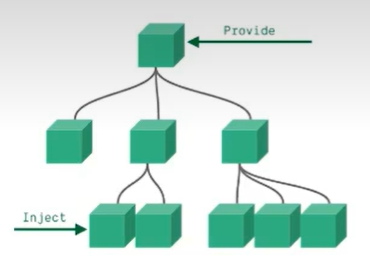

# 一 创建Vue3.0工程

## 1.使用vue-cli创建

官方文档：https://cli.vuejs.org/zh/guide/creating-a-project.html#vue-create

```shell
# 查看 @vue/cli 版本，确保 @vue/cli 版本在 4.5.0 以上
vue --version
# 安装或者升级 @vue/cli
npm install -g @vue/cli
# 创建
vue create vue_test
# 启动
cd vue_test
npm run serve
```

## 2.使用vite创建

官方文档：https://v3.cn.vuejs.org/guide/installation.html#vite

vite官网：https://vitejs.cn

- 什么是 vite？新一代前端构建工具。
- 优势如下：
  - 开发环境中，无需打包操作，可快速的冷启动。
  - 轻量快速的热重载。
  - 真正的按需编译，不再等待整个应用编译完成。
- 传统构建与 vite 构建对比图


```shell
#创建工程
npm init vite-app <project-name>
#进入工程目录
cd <project-name>
#安装依赖
npm install
#运行
npm run dev
```

# 二 常用Composition API

## 1.setup函数

1. 理解：Vue3.0 中一个新的配置项，值为一个函数。
2. setup 是**所有 Composition API（组合 API）**”表演的舞台“。
3. 组件中所用到的数据、方法等，均要配置在 setup 中。
4. setup 函数的两种返回值：
   1. 若返回一个对象，则对象中的属性、方法，在模板中均可直接使用。（重点关注）
   2. 若返回一个渲染函数，则可以自定义渲染内容。（了解）
5. 注意点：
   1. 尽量不要与 Vue2.x 配置混用。
      - Vue2.x 配置（data、methos、computed……）中**可以访问到 setup 中的属性、方法**。
      - 但在 setup 中**不能访问到 Vue2.x 配置（data、methos、computed）**。
      - 如果有重名，setup 优先。
   2. setup 不能是一个 async 函数，因为返回值不再是 return 的对象，而是 promise，模板看不到 return 对象中的属性。

## 2.ref函数

- 作用：定义一个响应式数据。
- 语法：`const xxx = ref(initValue)`。
  - 创建一个包含响应式数据的**引用对象（reference对象）**。
  - JS 中操作数据：`xxx.value`。
  - 模板中读取数据：不需要 `.value`，直接 `<div>{xxx}</div>`
- 备注：
  - 接收的数据可以是：基本类型，也可以是对象类型。
  - 基本类型的数据：响应式依然是靠 `Object.defineProperty()` 的 `get()` 和 `set()` 完成。
  - 对象类型的数据：内部使用了 Vue3.0 中的一个新函数——`reactive` 函数。

## 3.reactive函数

- 作用：定义一个**对象类型**响应式数据（基本类型不要用，要使用 `ref` 函数）。
- 语法：`const 代理对象 = reactive(源对象)` 接收一个对象（或数组），返回一个**代理对象（proxy对象）**。
- reactive 定义的响应式数据是“深层次的”。
- 内部基于 ES6 的 Proxy 实现，通过代理对象操作源对象内部数据进行操作。

## 4.Vue3.0中的响应式原理

### 4.1 Vue2.x的响应式

- 实现原理：

  - 对象类型：通过 `Object.defineProperty()` 对属性的读取、修改进行拦截（数据劫持）。

  - 数组类型：通过重写更新数组的一系列方法来实现拦截（对数组的变更方法进行了包裹）。

    ```javascript
    Object.defineProperty(data, 'count', {
        get() {},
        set() {}
    });
    ```

- 存在问题：

  - 新增属性、删除属性，页面不会更新。
  - 直接通过下标修改数组，页面不会自动更新。

### 4.2 Vue3.0的响应式

- 实现原理：
  - 通过 Proxy（代理）：拦截对象中任意属性的变化，包括：属性值的读写、属性的添加、属性的删除等。
  
  - 通过 Reflect（反射）：对源对象的属性进行操作。
  
  - MDN 文档中描述的 Proxy 与 Reflect：
  
    - Proxy：https://developer.mozilla.org/zh-CN/docs/Web/JavaScript/Reference/Global_Objects/Proxy
    - Reflect：https://developer.mozilla.org/zh-CN/docs/Web/JavaScript/Reference/Global_Objects/Reflect
  
    ```js
    //vue3 中的响应式原理
    let p = new Proxy(person, {
        //读取 p 的某个属性时调用
        get(target, propName) {
            console.log(`读取了 p 的 ${propName} 属性`);
            // return target[propName];
            return Reflect.get(target, propName);
        },
        //修改 p 的某个属性时调用
        set(target, propName, value) {
            console.log(`修改了 p 的 ${propName} 属性`);
            // target[propName] = value;
            Reflect.set(target, propName, value);
        },
        //删除 p 的某个属性时调用
        deleteProperty(target, propName) {
            console.log(`删除了 p 的 ${propName} 属性`);
            // return delete target[propName];
            return Reflect.deleteProperty(target, propName);
        }
    });
    return p;
    ```

## 5.对比reactive和ref

- 从定义数据角度对比：

  - ref 用来定义**基本类型数据**。
  - reactive 用来定义**对象（或数组）类型数据**。

  > 备注：ref 也可以用来定义**对象（或数组）类型数据**，它内部会自动通过 `reactive` 转为**代理对象**。

- 从原理角度对比：

  - ref 通过 `Object.defineProperty()` 的 `get()` 和 `set()` 方法来实现响应式（数据劫持）。
  - reactive 通过使用 **Proxy** 来实现响应式（数据劫持），并通过 **Reflect** 操作**源对象**内部的数据。

- 从使用角度对比：

  - ref 定义的数据，操作数据需要 `.value`，读取数据时模板中直接读取不需要 `.value`。
  - reactive 定义的数据，操作数据与读取数据 **均不需要 `.value`**。

## 6.setup的两个注意点

- setup 执行的时机
  - 在 beforeCreate 之前执行一次，this 是 undefined。
- setup 的参数：
  - props：值为对象，包含组件外部传递过来，且组件内部声明接收了的属性。
  - context：上下文对象。
    - attrs：值为对象，包含组件外部传递过来，但没有在 props 配置中声明的属性，相当于 `this.$attrs`。
    - slots：收到的插槽内容，相当于 `this.$slots`。
    - emit：分发自定义事件的函数，相当于 `this.$emit`。

## 7.计算属性与监视

### 7.1 computed函数

- 与 Vue2.x 中 computed 配置功能一致。

- 写法：

  ```js
  import { computed, reactive } from "vue";
  
  setup() {
      //源数据
      let person = reactive({
          firstName: "李",
          lastName: "四",
      });
  
      //计算属性 - 简写形式，没有考虑计算属性被修改的情况
      // person.fullName = computed(() => {
      //   return person.firstName + person.lastName;
      // });
  
      //计算属性 - 完整写法，考虑读和写
      person.fullName = computed({
          get() {
              return person.firstName + "-" + person.lastName;
          },
          set(newName) {
              const nameArr = newName.split("-");
              person.firstName = nameArr[0];
              person.lastName = nameArr[1];
          },
      });
  
      return { person };
  },
  ```

### 7.2 watch函数

- 与 Vue2.x 中 watch 配置功能一致。
- 两个小坑：
  - 监视 reactive 定义的响应式数据时，oldValue 无法正确获取，强制开启了深度监视（deep 配置失效）。
  - 监视 reactive 定义的响应式数据中某个属性时，deep 配置有效。

```js
let sum = ref(1);
let msg = ref("下午好! ");
let person = reactive({
    name: "tom",
    age: 12,
    job: {
        salary: 30
    }
});

//情况一：监视 ref 定义的一个响应式数据
// watch(sum, (newValue, oldValue) => {
//   console.log(`sum的值发生改变: ${newValue} -> ${oldValue}`);
// }, {immediate: true});

//情况二：监视 ref 定义的多个响应式数据
// watch([sum, msg], (newValue, oldValue) => {
//   console.log(`sum的值发生改变: ${newValue[0]} -> ${oldValue[0]}`);
//   console.log(`msg的值发生改变: ${newValue[1]} -> ${oldValue[1]}`);
// }, {immediate: true});

/**
     * 情况三：监视 reactive 定义的一个响应式数据的全部个属性
     * 注意：
     *    1.此处无法正确获取 oldValue
     *    2.强制开启了深度监视（deep配置无效）
     */
// watch(person, (newValue, oldValue) => {
//   console.log(`person的值发生改变: ${newValue} -> ${oldValue}`);
// }, {deep: false});

//情况五：监视 reactive 定义的一个响应式数据的某个属性
// watch(() => person.age, (newValue, oldValue) => {
//   console.log(`person.age的值发生改变: ${newValue} -> ${oldValue}`);
// });

//情况五：监视 reactive 定义的一个响应式数据的多个属性
// watch([() => person.age, () => person.name], (newValue, oldValue) => {
//   console.log(`person.age或person.name的值发生改变: ${newValue} -> ${oldValue}`);
// });

//特殊情况
watch(person.job, (newValue, oldValue) => {
    console.log("person.job的值发生改变: ${newValue} -> ${oldValue}")
}, {deep: true}); //由于此处监视的是 reactive 所定义的对象中的某个属性，所以 deep 配置会生效

return { sum, msg, person };
```

### 7.3 watchEffect函数

- watch 的套路是：既要指明监视的属性，也要指明监视的回调。
- watchEffect 的套路是：不用指明监视哪个属性，监视的回调中用到哪个属性，就监视哪个属性、
- watchEffect 有点像 computed：
  - 但 computed 注重计算出来的值（回调函数的返回值），所以必须要写返回值。
  - 而 watchEffect 更注重的是过程（回调函数的函数体），所以不用写返回值。

```js
//watchEffect 所指定的回调中用到的数据只要发生变化，则直接重新指向回调
watchEffect(() => {
    const sum1 = sum.value;
    const salary = person.job.salary;
    console.log("watchEffect 的回调函数被调用");
});
```

## 8.Vue3.0生命周期

**vue2生命周期图示:**

    **vue3生命周期图示:**


- vue3.0 中可以继续使用 vue2.x 中的生命周期钩子，但是有两个更名：
  - `beforeDestroy` 改名为 `beforeUnmount`。
  - `destroyed` 改名为 `unmounted`。
- vue3.0 也提供了 composition api 形式的生命周期钩子，与 vue2.x 中钩子对应关系如下：
  - `beforeCreate`    --> `setup()`
  - `created`              --> `setup()`
  - `beforeMount`     --> `onBeforeMount`
  - `mounted`              --> `onMounted`
  - `beforeUpdate`   --> `onBeforeUpdate`
  - `update`                --> `onUpdated`
  - `beforeUnmount` --> `onBeforeUnmount`
  - `unmounted`         --> `onUnmounted`

```js
setup() {
    let sum = ref(1);

    console.log("------setup------");

    onbeforeinput(() => {
        console.log("------onbeforeinput------");
    });

    onMounted(() => {
        console.log("------onMounted------");
    });

    onBeforeUpdate(() => {
        console.log("------onBeforeUpdate------");
    });

    onUpdated(() => {
        console.log("------onUpdated------");
    });

    onBeforeUnmount(() => {
        console.log("------onBeforeUnmount------");
    });

    onUnmounted(() => {
        console.log("------onUnmounted------");
    });
    return { sum };
},
//使用配置项的形式使用生命周期钩子
// beforeCreate() {
//   console.log("------beforeCreate------");
// },
// created() {
//   console.log("------created------");
// },
// beforeMount() {
//   console.log("------beforeMount------");
// },
// mounted() {
//   console.log("------mounted------");
// },
// beforeUpdate() {
//   console.log("------beforeUpdate------");
// },
// updated() {
//   console.log("------updated------");
// },
// beforeUnmount() {
//   console.log("------beforeUnmount------");
// },
// unmounted() {
//   console.log("------unmounted------");
// }
```

## 9.自定义hook函数

- 什么是 hook？

  本质是一个函数，把 setup 函数中使用的 composition api 进行了封装。

- 类似于 vue2.x 中的 mixin。

- 自定义 hook 的优势：复用代码，让 setup 中的逻辑更清楚易懂。

`usePoint.js`:

```js
import { onMounted, reactive, onBeforeUnmount } from "vue";

export default function () {
    let position = reactive({
        x: 0,
        y: 0,
    });

    function getMousePoint(event) {
        position.x = event.pageX;
        position.y = event.pageY;
        console.log(event.pageX, event.pageY);
    }

    //挂载函数
    onMounted(() => {
        window.addEventListener('click', getMousePoint);
    });

    //卸载函数
    onBeforeUnmount(() => {
        window.removeEventListener('click', getMousePoint);
    });

    return position;
}
```

`Demo.vue`:

```js
import usePoint from "../hooks/usePoint";

export default {
  name: "Demo",
  setup() {
    let sum = ref(1);
    let position = usePoint();

    return { sum, position };
  },
};
```

## 10.toRef

- 作用：创建一个 ref 对象，其 value 值指向另一个对象中的某个属性。
- 语法：`const name = toRef(person, 'name')`。
- 应用：要将响应式对象中的某个属性单独提供给外部使用时。
- 扩展：`toRefs` 与 `toRef` 功能一致，但可以批量创建多个 ref 对象。语法：`toRefs(person)`。

```js
setup() {
    let person = reactive({
        name: "tom",
        age: 12,
        job: {
            salary: 30
        }
    });

    let name1 = person.name;
    console.log("%%% ", name1);

    let name2 = toRef(person, "name");
    console.log("### ", name2);

    // return {
    //   name: toRef(person, "name"),
    //   age: toRef(person, "age"),
    //   salary: toRef(person.job, "salary")
    // };
    return {
        ...toRefs(person)
    };
},
```

# 三 其他Composition API

## 1.shallowReactive与shallowRef

- shallowReactive：只处理对象最外层属性的响应式（浅响应式）。
- shallowRef：只处理基本数据类型的响应式，不进行对象的响应式处理。
- 什么时候使用？
  - 如果有一个对象数据，结构比较深，但变化时只是外层属性变化，使用 shallowReactive。
  - 如果有一个对象数据，后续功能不会修改该对象中的属性，而是生成新的对象来替换，使用 shallowRef

```js
setup() {
    let num = shallowRef({
        n: 1
    });
    // let num = ref(0);

    let person = shallowReactive({
        name: "tom",
        age: 12,
        job: {
            salary: 30,
        },
    });
    // let person = reactive({
    //   name: "tom",
    //   age: 12,
    //   job: {
    //     salary: 30,
    //   },
    // });

    return {
        ...toRefs(person),
        num
    };
}
```

## 2.readOnly和shallowReadOnly

- readOnly：让一个响应式数据变为只读的（深只读）。
- shallowReadOnly：让一个响应式数据变为只读的（浅只读）。
- 应用场景：不希望数据被修改时。

```js
setup() {
    let sum = ref(0);

    let person = reactive({
        name: "tom",
        age: 12,
        job: {
            salary: 30,
        },
    });

    // person = readonly(person);
    person = shallowReadonly(person);

    return {
        ...toRefs(person),
        sum
    };
}
```

## 3.toRaw与markRow

- toRow
  - 作用：将一个由 `reactive` 生成的**响应式对象**转为**普通对象**。
  - 使用场景：用于读取响应式对象对应的普通对象，对这个普通对象的所有操作，不会引起页面更新。
- markRow
  - 作用：标记一个对象，使其永远不会成为响应式对象。
  - 使用场景：
    1. 有些值不应该被设置为响应式，如复杂的第三方类库等。
    2. 当渲染具有不可变数据源的大列表时，跳过响应式转换可以提高性能。

```js
function showRawObject() {
    console.log(person);
    console.log(toRaw(person));
}

function addCar() {
    person.car = markRaw({name: "奔驰", price: 1200});
}
```

## 4.customRef

- 作用：创建一个自定义的 ref，并对其依赖项跟踪和更新触发显示控制。

- 实现防抖效果：

  ```vue
  <template>
    <input type="text" v-model="keyWord" />
    <h1>{{ keyWord }}</h1>
  </template>
  
  <script>
  import { customRef, ref } from "vue";
  
  export default {
    name: "App",
    setup() {
      // let keyWord = ref("hello"); //vue提供的 ref
      let keyWord = myRef("hello", 500); //自定义 ref
  
      function myRef(value, delay) {
        let timer;
        return customRef((track, trigger) => {
          return {
            get() {
              //通知 vue 追踪 value 的变化
              track();
              return value;
            },
            set(newVal) {
              clearTimeout(timer);
              timer = setTimeout(() => {
                value = newVal;
                //通知 vue 去重新解析模板
                trigger();
              }, delay);
            }
          }
        });
      }
  
      return { keyWord };
    },
  };
  </script>
  
  ```

## 5.provide和inject



- 作用：实现**祖与后代组件间的通信**。

- 套路：父组件有一个 `provide` 选项来提供数据，子组件有一个 `inject` 选项来开始使用这些数据。

- 写法：

  1. 祖先组件中

     ```js
     setup() {
         let car = reactive({name: '劳斯莱斯', price: '1200w'});
         provide('car', car);
         return {...toRefs(car)};
     }
     ```

  2. 后台组件中

     ```js
     setup() {
         let car = inject("car");
         return {car};
     }
     ```

## 6.响应式数据的判断

- isRef：检查一个值是否为一个 `ref` 对象。
- isReactive：检查一个对象是否是由 `reactive` 创建的响应式代理。
- isReadOnly：检查一个对象是否是由 `readOnly` 创建的只读代理。
- isProxy：检查一个对象是否是由 `reactive` 或者 `readOnly` 方法创建的代理。

# 四 新组件

## 1.Fragment

- 在 vue2 中，组件必须有一个根标签。
- 在 vue3 中，组件可以没有根标签，内部会将多个标签包含在一个 Fragment 虚拟元素中。
- 好处：减少标签层级，减少内存占用。

## 2.Teleport

`Teleport` 是一种能够将我们的**组件html结构**移动到指定位置的技术。

```html
<teleport to="body">
    <div class="mask" v-if="isShow">
        <div class="dialog">
            <h1>我是弹窗</h1>
            <h1>我不是弹窗</h1>
            <h1>我是弹窗</h1>
            <button @click="isShow = false">关闭弹窗</button>
        </div>
    </div>
</teleport>
```

## 3.Suspense

- 等待异步组件时渲染一些额外内容，让应用有更好的用户体验。

- 使用步骤：

  - 异步引入组件。

    ```js
    import {defineAsyncComponent} from 'vue';
    const Child  = defineAsyncComponent(() => import('./components/Child.vue'));  //异步引入
    ```

  - 使用 `Suspense` 包裹组件，并配置好 `default` 和 `fallback`。

    ```html
    <Suspense>
        <template v-slot:default>
            <Child />
        </template>
        <template v-slot:fallback>
            <h3>稍等，加载中……</h3>
        </template>
    </Suspense>
    ```

# 五 其他

## 1.全局API的转移

- vue 2.x 有许多全局 API 和配置。

  - 例如：注册全局组件、注册全局指令等。

    ```js
    //注册全局组件
    Vue.component('MyButton', {
        data: () => ({
            count: 0
        }),
        template: '<button @click=count++>Clicked {{count}} times.</button>'
    });
    
    //注册全局指令
    Vue.directive('focus', {
        inserted: el => el.focus()
    });
    ```

- Vue 3.0 对这些 API 做出了调整。

  - 将全局的 API，即 `Vue.xxx` 调整到应用实例（`app`）上

    | 2.x 全局 API（`vue`）    | 3.x 实例 API（`app`）       |
    | ------------------------ | --------------------------- |
    | Vue.config.xxx           | app.config.xxx              |
    | Vue.config.productionTip | **移除**                    |
    | Vue.component            | app.component               |
    | Vue.directive            | app.directive               |
    | Vue.mixin                | app.mixin                   |
    | Vue.use                  | app.use                     |
    | Vue.prototype            | app.config.globalProperties |

## 2.其他改变

- data 选项应始终被声明为一个函数。

- 过度类名的更改：

  - Vue2.x 写法

    ```css
    .v-enter,
    .v-enter-to {
        opacity: 0;
    }
    .v-leave,
    .v-leave-to {
        opacity: 1;
    }
    ```

  - Vue3.x 写法

    ```css
    .v-enter-from,
    .v-enter-to {
        opacity: 0;
    }
    .v-leave-from,
    .v-leave-to {
        opacity: 1;
    }
    ```

- **移除** keyCode 作为 v-on 的修饰符，同时也不再支持 `config.keyCodes`。

- **移除** `v-on.native` 修饰符。

  - 父组件中绑定事件

    ```vue
    <my-component
    	v-on:close="handleComponentEvent"
        v-on:click="handleNativeClickEvent"              
    />
    ```

  - 子组件中声明自定义事件

    ```vue
    <script>
    	export default {
            emits: ['close']
        }
    </script>
    ```

- **移除**过滤器。

  > 过滤器虽然看起来很方便，但它需要一个自定义语法，打破大括号表达式是“只是 JavaScript”的假设，这不仅有学习成本，而且有实现成本。建议使用方法调用或计算属性去替换过滤器。

- ……


